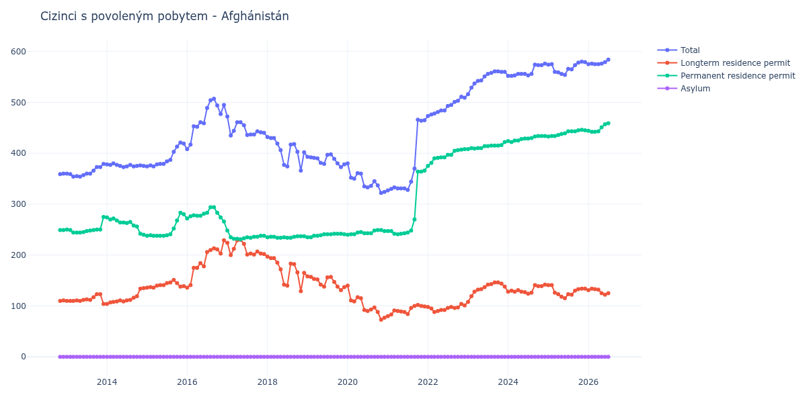

# Afghánistán

## Souhrnné statistiky (Min/Max pro rok) / Summary Statistics (Min/Max per year)

| Year   | Total     | Longterm Residence Permit   | Permanent Residence Permit   | Asylum   |
|--------|-----------|-----------------------------|------------------------------|----------|
| 2012   | 359 / 360 | 110 / 111                   | 249 / 249                    | 0 / 0    |
| 2013   | 354 / 379 | 104 / 123                   | 244 / 275                    | 0 / 0    |
| 2014   | 373 / 380 | 104 / 135                   | 240 / 274                    | 0 / 0    |
| 2015   | 374 / 421 | 136 / 151                   | 238 / 283                    | 0 / 0    |
| 2016   | 408 / 507 | 136 / 229                   | 266 / 294                    | 0 / 0    |
| 2017   | 435 / 472 | 200 / 230                   | 231 / 248                    | 0 / 0    |
| 2018   | 366 / 432 | 129 / 197                   | 234 / 237                    | 0 / 0    |
| 2019   | 373 / 398 | 131 / 158                   | 235 / 242                    | 0 / 0    |
| 2020   | 322 / 380 | 73 / 140                    | 240 / 249                    | 0 / 0    |
| 2021   | 327 / 466 | 80 / 102                    | 241 / 366                    | 0 / 0    |
| 2022   | 473 / 511 | 88 / 104                    | 375 / 408                    | 0 / 0    |
| 2023   | 516 / 561 | 108 / 146                   | 408 / 422                    | 0 / 0    |
| 2024   | 552 / 576 | 124 / 142                   | 422 / 434                    | 0 / 0    |
| 2025   | 554 / 580 | 115 / 141                   | 433 / 446                    | 0 / 0    |
| 2026   | 575 / 584 | 122 / 134                   | 442 / 459                    | 0 / 0    |

## Detailní tabulka / Detailed Data Table

| Date     | Total         | Longterm Residence Permit   | Permanent Residence Permit   | Asylum   |
|----------|---------------|-----------------------------|------------------------------|----------|
| **2012** |               |                             |                              |          |
| 11.2012  | 359           | 110                         | 249                          | 0        |
| 12.2012  | 360 (+0.28%)  | 111 (+0.91%)                | 249 (+0.00%)                 | 0        |
| **2013** |               |                             |                              |          |
| 01.2013  | 360 (+0.00%)  | 110 (-0.90%)                | 250 (+0.40%)                 | 0        |
| 02.2013  | 359 (-0.28%)  | 110 (+0.00%)                | 249 (-0.40%)                 | 0        |
| 03.2013  | 354 (-1.39%)  | 110 (+0.00%)                | 244 (-2.01%)                 | 0        |
| 04.2013  | 355 (+0.28%)  | 111 (+0.91%)                | 244 (+0.00%)                 | 0        |
| 05.2013  | 354 (-0.28%)  | 110 (-0.90%)                | 244 (+0.00%)                 | 0        |
| 06.2013  | 357 (+0.85%)  | 112 (+1.82%)                | 245 (+0.41%)                 | 0        |
| 07.2013  | 360 (+0.84%)  | 113 (+0.89%)                | 247 (+0.82%)                 | 0        |
| 08.2013  | 360 (+0.00%)  | 112 (-0.88%)                | 248 (+0.40%)                 | 0        |
| 09.2013  | 366 (+1.67%)  | 117 (+4.46%)                | 249 (+0.40%)                 | 0        |
| 10.2013  | 373 (+1.91%)  | 123 (+5.13%)                | 250 (+0.40%)                 | 0        |
| 11.2013  | 373 (+0.00%)  | 123 (+0.00%)                | 250 (+0.00%)                 | 0        |
| 12.2013  | 379 (+1.61%)  | 104 (-15.45%)               | 275 (+10.00%)                | 0        |
| **2014** |               |                             |                              |          |
| 01.2014  | 378 (-0.26%)  | 104 (+0.00%)                | 274 (-0.36%)                 | 0        |
| 02.2014  | 377 (-0.26%)  | 107 (+2.88%)                | 270 (-1.46%)                 | 0        |
| 03.2014  | 380 (+0.80%)  | 108 (+0.93%)                | 272 (+0.74%)                 | 0        |
| 04.2014  | 377 (-0.79%)  | 109 (+0.93%)                | 268 (-1.47%)                 | 0        |
| 05.2014  | 375 (-0.53%)  | 111 (+1.83%)                | 264 (-1.49%)                 | 0        |
| 06.2014  | 373 (-0.53%)  | 109 (-1.80%)                | 264 (+0.00%)                 | 0        |
| 07.2014  | 374 (+0.27%)  | 111 (+1.83%)                | 263 (-0.38%)                 | 0        |
| 08.2014  | 377 (+0.80%)  | 112 (+0.90%)                | 265 (+0.76%)                 | 0        |
| 09.2014  | 374 (-0.80%)  | 116 (+3.57%)                | 258 (-2.64%)                 | 0        |
| 10.2014  | 375 (+0.27%)  | 119 (+2.59%)                | 256 (-0.78%)                 | 0        |
| 11.2014  | 376 (+0.27%)  | 134 (+12.61%)               | 242 (-5.47%)                 | 0        |
| 12.2014  | 375 (-0.27%)  | 135 (+0.75%)                | 240 (-0.83%)                 | 0        |
| **2015** |               |                             |                              |          |
| 01.2015  | 374 (-0.27%)  | 136 (+0.74%)                | 238 (-0.83%)                 | 0        |
| 02.2015  | 376 (+0.53%)  | 137 (+0.74%)                | 239 (+0.42%)                 | 0        |
| 03.2015  | 374 (-0.53%)  | 136 (-0.73%)                | 238 (-0.42%)                 | 0        |
| 04.2015  | 378 (+1.07%)  | 140 (+2.94%)                | 238 (+0.00%)                 | 0        |
| 05.2015  | 379 (+0.26%)  | 141 (+0.71%)                | 238 (+0.00%)                 | 0        |
| 06.2015  | 379 (+0.00%)  | 141 (+0.00%)                | 238 (+0.00%)                 | 0        |
| 07.2015  | 384 (+1.32%)  | 145 (+2.84%)                | 239 (+0.42%)                 | 0        |
| 08.2015  | 387 (+0.78%)  | 146 (+0.69%)                | 241 (+0.84%)                 | 0        |
| 09.2015  | 403 (+4.13%)  | 151 (+3.42%)                | 252 (+4.56%)                 | 0        |
| 10.2015  | 413 (+2.48%)  | 145 (-3.97%)                | 268 (+6.35%)                 | 0        |
| 11.2015  | 421 (+1.94%)  | 138 (-4.83%)                | 283 (+5.60%)                 | 0        |
| 12.2015  | 419 (-0.48%)  | 139 (+0.72%)                | 280 (-1.06%)                 | 0        |
| **2016** |               |                             |                              |          |
| 01.2016  | 408 (-2.63%)  | 136 (-2.16%)                | 272 (-2.86%)                 | 0        |
| 02.2016  | 417 (+2.21%)  | 141 (+3.68%)                | 276 (+1.47%)                 | 0        |
| 03.2016  | 453 (+8.63%)  | 175 (+24.11%)               | 278 (+0.72%)                 | 0        |
| 04.2016  | 452 (-0.22%)  | 175 (+0.00%)                | 277 (-0.36%)                 | 0        |
| 05.2016  | 461 (+1.99%)  | 184 (+5.14%)                | 277 (+0.00%)                 | 0        |
| 06.2016  | 459 (-0.43%)  | 178 (-3.26%)                | 281 (+1.44%)                 | 0        |
| 07.2016  | 489 (+6.54%)  | 206 (+15.73%)               | 283 (+0.71%)                 | 0        |
| 08.2016  | 504 (+3.07%)  | 210 (+1.94%)                | 294 (+3.89%)                 | 0        |
| 09.2016  | 507 (+0.60%)  | 213 (+1.43%)                | 294 (+0.00%)                 | 0        |
| 10.2016  | 494 (-2.56%)  | 211 (-0.94%)                | 283 (-3.74%)                 | 0        |
| 11.2016  | 477 (-3.44%)  | 203 (-3.79%)                | 274 (-3.18%)                 | 0        |
| 12.2016  | 495 (+3.77%)  | 229 (+12.81%)               | 266 (-2.92%)                 | 0        |
| **2017** |               |                             |                              |          |
| 01.2017  | 472 (-4.65%)  | 224 (-2.18%)                | 248 (-6.77%)                 | 0        |
| 02.2017  | 435 (-7.84%)  | 200 (-10.71%)               | 235 (-5.24%)                 | 0        |
| 03.2017  | 444 (+2.07%)  | 212 (+6.00%)                | 232 (-1.28%)                 | 0        |
| 04.2017  | 461 (+3.83%)  | 229 (+8.02%)                | 232 (+0.00%)                 | 0        |
| 05.2017  | 461 (+0.00%)  | 230 (+0.44%)                | 231 (-0.43%)                 | 0        |
| 06.2017  | 455 (-1.30%)  | 222 (-3.48%)                | 233 (+0.87%)                 | 0        |
| 07.2017  | 436 (-4.18%)  | 201 (-9.46%)                | 235 (+0.86%)                 | 0        |
| 08.2017  | 437 (+0.23%)  | 203 (+1.00%)                | 234 (-0.43%)                 | 0        |
| 09.2017  | 437 (+0.00%)  | 201 (-0.99%)                | 236 (+0.85%)                 | 0        |
| 10.2017  | 443 (+1.37%)  | 207 (+2.99%)                | 236 (+0.00%)                 | 0        |
| 11.2017  | 441 (-0.45%)  | 203 (-1.93%)                | 238 (+0.85%)                 | 0        |
| 12.2017  | 440 (-0.23%)  | 202 (-0.49%)                | 238 (+0.00%)                 | 0        |
| **2018** |               |                             |                              |          |
| 01.2018  | 432 (-1.82%)  | 197 (-2.48%)                | 235 (-1.26%)                 | 0        |
| 02.2018  | 430 (-0.46%)  | 194 (-1.52%)                | 236 (+0.43%)                 | 0        |
| 03.2018  | 430 (+0.00%)  | 194 (+0.00%)                | 236 (+0.00%)                 | 0        |
| 04.2018  | 419 (-2.56%)  | 185 (-4.64%)                | 234 (-0.85%)                 | 0        |
| 05.2018  | 406 (-3.10%)  | 172 (-7.03%)                | 234 (+0.00%)                 | 0        |
| 06.2018  | 377 (-7.14%)  | 142 (-17.44%)               | 235 (+0.43%)                 | 0        |
| 07.2018  | 374 (-0.80%)  | 140 (-1.41%)                | 234 (-0.43%)                 | 0        |
| 08.2018  | 417 (+11.50%) | 183 (+30.71%)               | 234 (+0.00%)                 | 0        |
| 09.2018  | 418 (+0.24%)  | 182 (-0.55%)                | 236 (+0.85%)                 | 0        |
| 10.2018  | 403 (-3.59%)  | 166 (-8.79%)                | 237 (+0.42%)                 | 0        |
| 11.2018  | 366 (-9.18%)  | 129 (-22.29%)               | 237 (+0.00%)                 | 0        |
| 12.2018  | 402 (+9.84%)  | 165 (+27.91%)               | 237 (+0.00%)                 | 0        |
| **2019** |               |                             |                              |          |
| 01.2019  | 393 (-2.24%)  | 158 (-4.24%)                | 235 (-0.84%)                 | 0        |
| 02.2019  | 392 (-0.25%)  | 157 (-0.63%)                | 235 (+0.00%)                 | 0        |
| 03.2019  | 391 (-0.26%)  | 153 (-2.55%)                | 238 (+1.28%)                 | 0        |
| 04.2019  | 390 (-0.26%)  | 152 (-0.65%)                | 238 (+0.00%)                 | 0        |
| 05.2019  | 381 (-2.31%)  | 142 (-6.58%)                | 239 (+0.42%)                 | 0        |
| 06.2019  | 379 (-0.52%)  | 138 (-2.82%)                | 241 (+0.84%)                 | 0        |
| 07.2019  | 397 (+4.75%)  | 156 (+13.04%)               | 241 (+0.00%)                 | 0        |
| 08.2019  | 398 (+0.25%)  | 157 (+0.64%)                | 241 (+0.00%)                 | 0        |
| 09.2019  | 389 (-2.26%)  | 147 (-6.37%)                | 242 (+0.41%)                 | 0        |
| 10.2019  | 380 (-2.31%)  | 138 (-6.12%)                | 242 (+0.00%)                 | 0        |
| 11.2019  | 373 (-1.84%)  | 131 (-5.07%)                | 242 (+0.00%)                 | 0        |
| 12.2019  | 378 (+1.34%)  | 137 (+4.58%)                | 241 (-0.41%)                 | 0        |
| **2020** |               |                             |                              |          |
| 01.2020  | 380 (+0.53%)  | 140 (+2.19%)                | 240 (-0.41%)                 | 0        |
| 02.2020  | 352 (-7.37%)  | 111 (-20.71%)               | 241 (+0.42%)                 | 0        |
| 03.2020  | 350 (-0.57%)  | 109 (-1.80%)                | 241 (+0.00%)                 | 0        |
| 04.2020  | 361 (+3.14%)  | 117 (+7.34%)                | 244 (+1.24%)                 | 0        |
| 05.2020  | 360 (-0.28%)  | 115 (-1.71%)                | 245 (+0.41%)                 | 0        |
| 06.2020  | 335 (-6.94%)  | 92 (-20.00%)                | 243 (-0.82%)                 | 0        |
| 07.2020  | 333 (-0.60%)  | 90 (-2.17%)                 | 243 (+0.00%)                 | 0        |
| 08.2020  | 336 (+0.90%)  | 93 (+3.33%)                 | 243 (+0.00%)                 | 0        |
| 09.2020  | 345 (+2.68%)  | 97 (+4.30%)                 | 248 (+2.06%)                 | 0        |
| 10.2020  | 337 (-2.32%)  | 88 (-9.28%)                 | 249 (+0.40%)                 | 0        |
| 11.2020  | 322 (-4.45%)  | 73 (-17.05%)                | 249 (+0.00%)                 | 0        |
| 12.2020  | 324 (+0.62%)  | 77 (+5.48%)                 | 247 (-0.80%)                 | 0        |
| **2021** |               |                             |                              |          |
| 01.2021  | 327 (+0.93%)  | 80 (+3.90%)                 | 247 (+0.00%)                 | 0        |
| 02.2021  | 330 (+0.92%)  | 83 (+3.75%)                 | 247 (+0.00%)                 | 0        |
| 03.2021  | 333 (+0.91%)  | 91 (+9.64%)                 | 242 (-2.02%)                 | 0        |
| 04.2021  | 331 (-0.60%)  | 90 (-1.10%)                 | 241 (-0.41%)                 | 0        |
| 05.2021  | 331 (+0.00%)  | 89 (-1.11%)                 | 242 (+0.41%)                 | 0        |
| 06.2021  | 331 (+0.00%)  | 88 (-1.12%)                 | 243 (+0.41%)                 | 0        |
| 07.2021  | 328 (-0.91%)  | 84 (-4.55%)                 | 244 (+0.41%)                 | 0        |
| 08.2021  | 344 (+4.88%)  | 96 (+14.29%)                | 248 (+1.64%)                 | 0        |
| 09.2021  | 370 (+7.56%)  | 100 (+4.17%)                | 270 (+8.87%)                 | 0        |
| 10.2021  | 466 (+25.95%) | 102 (+2.00%)                | 364 (+34.81%)                | 0        |
| 11.2021  | 464 (-0.43%)  | 100 (-1.96%)                | 364 (+0.00%)                 | 0        |
| 12.2021  | 465 (+0.22%)  | 99 (-1.00%)                 | 366 (+0.55%)                 | 0        |
| **2022** |               |                             |                              |          |
| 01.2022  | 473 (+1.72%)  | 98 (-1.01%)                 | 375 (+2.46%)                 | 0        |
| 02.2022  | 476 (+0.63%)  | 95 (-3.06%)                 | 381 (+1.60%)                 | 0        |
| 03.2022  | 478 (+0.42%)  | 88 (-7.37%)                 | 390 (+2.36%)                 | 0        |
| 04.2022  | 481 (+0.63%)  | 90 (+2.27%)                 | 391 (+0.26%)                 | 0        |
| 05.2022  | 484 (+0.62%)  | 92 (+2.22%)                 | 392 (+0.26%)                 | 0        |
| 06.2022  | 484 (+0.00%)  | 92 (+0.00%)                 | 392 (+0.00%)                 | 0        |
| 07.2022  | 493 (+1.86%)  | 96 (+4.35%)                 | 397 (+1.28%)                 | 0        |
| 08.2022  | 495 (+0.41%)  | 98 (+2.08%)                 | 397 (+0.00%)                 | 0        |
| 09.2022  | 501 (+1.21%)  | 96 (-2.04%)                 | 405 (+2.02%)                 | 0        |
| 10.2022  | 503 (+0.40%)  | 97 (+1.04%)                 | 406 (+0.25%)                 | 0        |
| 11.2022  | 511 (+1.59%)  | 104 (+7.22%)                | 407 (+0.25%)                 | 0        |
| 12.2022  | 509 (-0.39%)  | 101 (-2.88%)                | 408 (+0.25%)                 | 0        |
| **2023** |               |                             |                              |          |
| 01.2023  | 516 (+1.38%)  | 108 (+6.93%)                | 408 (+0.00%)                 | 0        |
| 02.2023  | 529 (+2.52%)  | 119 (+10.19%)               | 410 (+0.49%)                 | 0        |
| 03.2023  | 537 (+1.51%)  | 128 (+7.56%)                | 409 (-0.24%)                 | 0        |
| 04.2023  | 542 (+0.93%)  | 132 (+3.12%)                | 410 (+0.24%)                 | 0        |
| 05.2023  | 543 (+0.18%)  | 133 (+0.76%)                | 410 (+0.00%)                 | 0        |
| 06.2023  | 551 (+1.47%)  | 137 (+3.01%)                | 414 (+0.98%)                 | 0        |
| 07.2023  | 556 (+0.91%)  | 142 (+3.65%)                | 414 (+0.00%)                 | 0        |
| 08.2023  | 558 (+0.36%)  | 143 (+0.70%)                | 415 (+0.24%)                 | 0        |
| 09.2023  | 561 (+0.54%)  | 146 (+2.10%)                | 415 (+0.00%)                 | 0        |
| 10.2023  | 561 (+0.00%)  | 146 (+0.00%)                | 415 (+0.00%)                 | 0        |
| 11.2023  | 560 (-0.18%)  | 144 (-1.37%)                | 416 (+0.24%)                 | 0        |
| 12.2023  | 560 (+0.00%)  | 138 (-4.17%)                | 422 (+1.44%)                 | 0        |
| **2024** |               |                             |                              |          |
| 01.2024  | 552 (-1.43%)  | 128 (-7.25%)                | 424 (+0.47%)                 | 0        |
| 02.2024  | 552 (+0.00%)  | 130 (+1.56%)                | 422 (-0.47%)                 | 0        |
| 03.2024  | 553 (+0.18%)  | 128 (-1.54%)                | 425 (+0.71%)                 | 0        |
| 04.2024  | 556 (+0.54%)  | 131 (+2.34%)                | 425 (+0.00%)                 | 0        |
| 05.2024  | 556 (+0.00%)  | 128 (-2.29%)                | 428 (+0.71%)                 | 0        |
| 06.2024  | 556 (+0.00%)  | 127 (-0.78%)                | 429 (+0.23%)                 | 0        |
| 07.2024  | 553 (-0.54%)  | 124 (-2.36%)                | 429 (+0.00%)                 | 0        |
| 08.2024  | 556 (+0.54%)  | 126 (+1.61%)                | 430 (+0.23%)                 | 0        |
| 09.2024  | 574 (+3.24%)  | 141 (+11.90%)               | 433 (+0.70%)                 | 0        |
| 10.2024  | 573 (-0.17%)  | 139 (-1.42%)                | 434 (+0.23%)                 | 0        |
| 11.2024  | 573 (+0.00%)  | 139 (+0.00%)                | 434 (+0.00%)                 | 0        |
| 12.2024  | 576 (+0.52%)  | 142 (+2.16%)                | 434 (+0.00%)                 | 0        |
| **2025** |               |                             |                              |          |
| 01.2025  | 574 (-0.35%)  | 141 (-0.70%)                | 433 (-0.23%)                 | 0        |
| 02.2025  | 575 (+0.17%)  | 141 (+0.00%)                | 434 (+0.23%)                 | 0        |
| 03.2025  | 560 (-2.61%)  | 126 (-10.64%)               | 434 (+0.00%)                 | 0        |
| 04.2025  | 559 (-0.18%)  | 123 (-2.38%)                | 436 (+0.46%)                 | 0        |
| 05.2025  | 556 (-0.54%)  | 118 (-4.07%)                | 438 (+0.46%)                 | 0        |
| 06.2025  | 554 (-0.36%)  | 115 (-2.54%)                | 439 (+0.23%)                 | 0        |
| 07.2025  | 566 (+2.17%)  | 123 (+6.96%)                | 443 (+0.91%)                 | 0        |
| 08.2025  | 565 (-0.18%)  | 122 (-0.81%)                | 443 (+0.00%)                 | 0        |
| 09.2025  | 573 (+1.42%)  | 130 (+6.56%)                | 443 (+0.00%)                 | 0        |
| 10.2025  | 578 (+0.87%)  | 133 (+2.31%)                | 445 (+0.45%)                 | 0        |
| 11.2025  | 580 (+0.35%)  | 134 (+0.75%)                | 446 (+0.22%)                 | 0        |
| 12.2025  | 579 (-0.17%)  | 134 (+0.00%)                | 445 (-0.22%)                 | 0        |
| **2026** |               |                             |                              |          |
| 01.2026  | 575 (-0.69%)  | 131 (-2.24%)                | 444 (-0.22%)                 | 0        |
| 02.2026  | 576 (+0.17%)  | 134 (+2.29%)                | 442 (-0.45%)                 | 0        |
| 03.2026  | 575 (-0.17%)  | 133 (-0.75%)                | 442 (+0.00%)                 | 0        |
| 04.2026  | 575 (+0.00%)  | 132 (-0.75%)                | 443 (+0.23%)                 | 0        |
| 05.2026  | 576 (+0.17%)  | 125 (-5.30%)                | 451 (+1.81%)                 | 0        |
| 06.2026  | 579 (+0.52%)  | 122 (-2.40%)                | 457 (+1.33%)                 | 0        |
| 07.2026  | 584 (+0.86%)  | 125 (+2.46%)                | 459 (+0.44%)                 | 0        |
