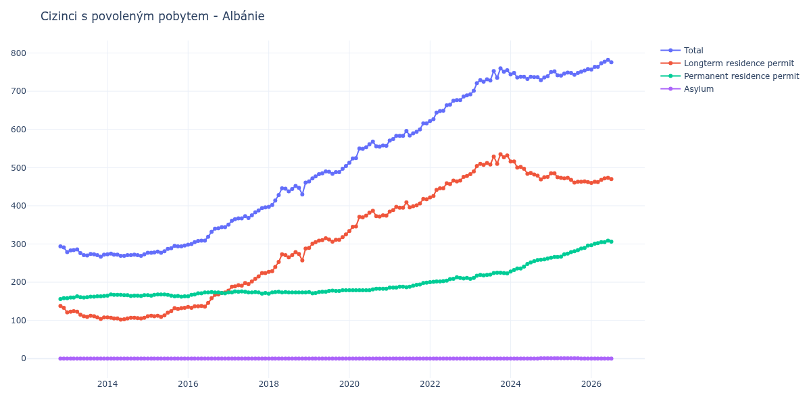

# Albánie

## Souhrnné statistiky (Min/Max pro rok) / Summary Statistics (Min/Max per year)

| Year   | Total     | Longterm Residence Permit   | Permanent Residence Permit   | Asylum   |
|--------|-----------|-----------------------------|------------------------------|----------|
| 2012   | 291 / 294 | 133 / 138                   | 156 / 158                    | 0 / 0    |
| 2013   | 267 / 286 | 104 / 124                   | 158 / 164                    | 0 / 0    |
| 2014   | 269 / 275 | 102 / 108                   | 164 / 168                    | 0 / 0    |
| 2015   | 277 / 296 | 109 / 133                   | 162 / 168                    | 0 / 0    |
| 2016   | 298 / 344 | 133 / 173                   | 163 / 174                    | 0 / 0    |
| 2017   | 351 / 396 | 178 / 224                   | 170 / 176                    | 0 / 0    |
| 2018   | 397 / 461 | 227 / 288                   | 170 / 175                    | 0 / 0    |
| 2019   | 464 / 504 | 290 / 325                   | 171 / 179                    | 0 / 0    |
| 2020   | 513 / 568 | 334 / 387                   | 179 / 183                    | 0 / 0    |
| 2021   | 571 / 616 | 385 / 418                   | 186 / 199                    | 0 / 0    |
| 2022   | 622 / 689 | 422 / 478                   | 200 / 213                    | 0 / 0    |
| 2023   | 692 / 760 | 483 / 535                   | 209 / 225                    | 0 / 0    |
| 2024   | 729 / 748 | 469 / 516                   | 228 / 262                    | 0 / 1    |
| 2025   | 741 / 758 | 461 / 485                   | 264 / 296                    | 0 / 1    |
| 2026   | 757 / 782 | 460 / 473                   | 297 / 309                    | 0 / 0    |

## Detailní tabulka / Detailed Data Table

| Date     | Total        | Longterm Residence Permit   | Permanent Residence Permit   | Asylum       |
|----------|--------------|-----------------------------|------------------------------|--------------|
| **2012** |              |                             |                              |              |
| 11.2012  | 294          | 138                         | 156                          | 0            |
| 12.2012  | 291 (-1.02%) | 133 (-3.62%)                | 158 (+1.28%)                 | 0            |
| **2013** |              |                             |                              |              |
| 01.2013  | 279 (-4.12%) | 121 (-9.02%)                | 158 (+0.00%)                 | 0            |
| 02.2013  | 283 (+1.43%) | 123 (+1.65%)                | 160 (+1.27%)                 | 0            |
| 03.2013  | 284 (+0.35%) | 124 (+0.81%)                | 160 (+0.00%)                 | 0            |
| 04.2013  | 286 (+0.70%) | 123 (-0.81%)                | 163 (+1.88%)                 | 0            |
| 05.2013  | 276 (-3.50%) | 115 (-6.50%)                | 161 (-1.23%)                 | 0            |
| 06.2013  | 271 (-1.81%) | 111 (-3.48%)                | 160 (-0.62%)                 | 0            |
| 07.2013  | 270 (-0.37%) | 109 (-1.80%)                | 161 (+0.63%)                 | 0            |
| 08.2013  | 274 (+1.48%) | 112 (+2.75%)                | 162 (+0.62%)                 | 0            |
| 09.2013  | 273 (-0.36%) | 111 (-0.89%)                | 162 (+0.00%)                 | 0            |
| 10.2013  | 271 (-0.73%) | 108 (-2.70%)                | 163 (+0.62%)                 | 0            |
| 11.2013  | 267 (-1.48%) | 104 (-3.70%)                | 163 (+0.00%)                 | 0            |
| 12.2013  | 272 (+1.87%) | 108 (+3.85%)                | 164 (+0.61%)                 | 0            |
| **2014** |              |                             |                              |              |
| 01.2014  | 273 (+0.37%) | 108 (+0.00%)                | 165 (+0.61%)                 | 0            |
| 02.2014  | 275 (+0.73%) | 107 (-0.93%)                | 168 (+1.82%)                 | 0            |
| 03.2014  | 272 (-1.09%) | 105 (-1.87%)                | 167 (-0.60%)                 | 0            |
| 04.2014  | 272 (+0.00%) | 105 (+0.00%)                | 167 (+0.00%)                 | 0            |
| 05.2014  | 269 (-1.10%) | 102 (-2.86%)                | 167 (+0.00%)                 | 0            |
| 06.2014  | 269 (+0.00%) | 103 (+0.98%)                | 166 (-0.60%)                 | 0            |
| 07.2014  | 271 (+0.74%) | 105 (+1.94%)                | 166 (+0.00%)                 | 0            |
| 08.2014  | 271 (+0.00%) | 107 (+1.90%)                | 164 (-1.20%)                 | 0            |
| 09.2014  | 272 (+0.37%) | 107 (+0.00%)                | 165 (+0.61%)                 | 0            |
| 10.2014  | 271 (-0.37%) | 106 (-0.93%)                | 165 (+0.00%)                 | 0            |
| 11.2014  | 269 (-0.74%) | 105 (-0.94%)                | 164 (-0.61%)                 | 0            |
| 12.2014  | 273 (+1.49%) | 107 (+1.90%)                | 166 (+1.22%)                 | 0            |
| **2015** |              |                             |                              |              |
| 01.2015  | 277 (+1.47%) | 111 (+3.74%)                | 166 (+0.00%)                 | 0            |
| 02.2015  | 277 (+0.00%) | 112 (+0.90%)                | 165 (-0.60%)                 | 0            |
| 03.2015  | 278 (+0.36%) | 111 (-0.89%)                | 167 (+1.21%)                 | 0            |
| 04.2015  | 280 (+0.72%) | 112 (+0.90%)                | 168 (+0.60%)                 | 0            |
| 05.2015  | 277 (-1.07%) | 109 (-2.68%)                | 168 (+0.00%)                 | 0            |
| 06.2015  | 281 (+1.44%) | 113 (+3.67%)                | 168 (+0.00%)                 | 0            |
| 07.2015  | 287 (+2.14%) | 120 (+6.19%)                | 167 (-0.60%)                 | 0            |
| 08.2015  | 289 (+0.70%) | 124 (+3.33%)                | 165 (-1.20%)                 | 0            |
| 09.2015  | 295 (+2.08%) | 132 (+6.45%)                | 163 (-1.21%)                 | 0            |
| 10.2015  | 294 (-0.34%) | 130 (-1.52%)                | 164 (+0.61%)                 | 0            |
| 11.2015  | 294 (+0.00%) | 132 (+1.54%)                | 162 (-1.22%)                 | 0            |
| 12.2015  | 296 (+0.68%) | 133 (+0.76%)                | 163 (+0.62%)                 | 0            |
| **2016** |              |                             |                              |              |
| 01.2016  | 298 (+0.68%) | 135 (+1.50%)                | 163 (+0.00%)                 | 0            |
| 02.2016  | 300 (+0.67%) | 133 (-1.48%)                | 167 (+2.45%)                 | 0            |
| 03.2016  | 305 (+1.67%) | 137 (+3.01%)                | 168 (+0.60%)                 | 0            |
| 04.2016  | 308 (+0.98%) | 137 (+0.00%)                | 171 (+1.79%)                 | 0            |
| 05.2016  | 309 (+0.32%) | 138 (+0.73%)                | 171 (+0.00%)                 | 0            |
| 06.2016  | 309 (+0.00%) | 136 (-1.45%)                | 173 (+1.17%)                 | 0            |
| 07.2016  | 319 (+3.24%) | 146 (+7.35%)                | 173 (+0.00%)                 | 0            |
| 08.2016  | 332 (+4.08%) | 158 (+8.22%)                | 174 (+0.58%)                 | 0            |
| 09.2016  | 340 (+2.41%) | 167 (+5.70%)                | 173 (-0.57%)                 | 0            |
| 10.2016  | 341 (+0.29%) | 168 (+0.60%)                | 173 (+0.00%)                 | 0            |
| 11.2016  | 344 (+0.88%) | 172 (+2.38%)                | 172 (-0.58%)                 | 0            |
| 12.2016  | 344 (+0.00%) | 173 (+0.58%)                | 171 (-0.58%)                 | 0            |
| **2017** |              |                             |                              |              |
| 01.2017  | 351 (+2.03%) | 178 (+2.89%)                | 173 (+1.17%)                 | 0            |
| 02.2017  | 361 (+2.85%) | 188 (+5.62%)                | 173 (+0.00%)                 | 0            |
| 03.2017  | 365 (+1.11%) | 189 (+0.53%)                | 176 (+1.73%)                 | 0            |
| 04.2017  | 367 (+0.55%) | 192 (+1.59%)                | 175 (-0.57%)                 | 0            |
| 05.2017  | 367 (+0.00%) | 191 (-0.52%)                | 176 (+0.57%)                 | 0            |
| 06.2017  | 373 (+1.63%) | 198 (+3.66%)                | 175 (-0.57%)                 | 0            |
| 07.2017  | 368 (-1.34%) | 195 (-1.52%)                | 173 (-1.14%)                 | 0            |
| 08.2017  | 375 (+1.90%) | 202 (+3.59%)                | 173 (+0.00%)                 | 0            |
| 09.2017  | 383 (+2.13%) | 209 (+3.47%)                | 174 (+0.58%)                 | 0            |
| 10.2017  | 388 (+1.31%) | 215 (+2.87%)                | 173 (-0.57%)                 | 0            |
| 11.2017  | 394 (+1.55%) | 224 (+4.19%)                | 170 (-1.73%)                 | 0            |
| 12.2017  | 396 (+0.51%) | 224 (+0.00%)                | 172 (+1.18%)                 | 0            |
| **2018** |              |                             |                              |              |
| 01.2018  | 397 (+0.25%) | 227 (+1.34%)                | 170 (-1.16%)                 | 0            |
| 02.2018  | 402 (+1.26%) | 229 (+0.88%)                | 173 (+1.76%)                 | 0            |
| 03.2018  | 414 (+2.99%) | 240 (+4.80%)                | 174 (+0.58%)                 | 0            |
| 04.2018  | 428 (+3.38%) | 253 (+5.42%)                | 175 (+0.57%)                 | 0            |
| 05.2018  | 446 (+4.21%) | 273 (+7.91%)                | 173 (-1.14%)                 | 0            |
| 06.2018  | 445 (-0.22%) | 271 (-0.73%)                | 174 (+0.58%)                 | 0            |
| 07.2018  | 438 (-1.57%) | 265 (-2.21%)                | 173 (-0.57%)                 | 0            |
| 08.2018  | 444 (+1.37%) | 271 (+2.26%)                | 173 (+0.00%)                 | 0            |
| 09.2018  | 452 (+1.80%) | 279 (+2.95%)                | 173 (+0.00%)                 | 0            |
| 10.2018  | 447 (-1.11%) | 274 (-1.79%)                | 173 (+0.00%)                 | 0            |
| 11.2018  | 430 (-3.80%) | 257 (-6.20%)                | 173 (+0.00%)                 | 0            |
| 12.2018  | 461 (+7.21%) | 288 (+12.06%)               | 173 (+0.00%)                 | 0            |
| **2019** |              |                             |                              |              |
| 01.2019  | 464 (+0.65%) | 290 (+0.69%)                | 174 (+0.58%)                 | 0            |
| 02.2019  | 472 (+1.72%) | 301 (+3.79%)                | 171 (-1.72%)                 | 0            |
| 03.2019  | 477 (+1.06%) | 305 (+1.33%)                | 172 (+0.58%)                 | 0            |
| 04.2019  | 483 (+1.26%) | 309 (+1.31%)                | 174 (+1.16%)                 | 0            |
| 05.2019  | 485 (+0.41%) | 310 (+0.32%)                | 175 (+0.57%)                 | 0            |
| 06.2019  | 490 (+1.03%) | 315 (+1.61%)                | 175 (+0.00%)                 | 0            |
| 07.2019  | 489 (-0.20%) | 312 (-0.95%)                | 177 (+1.14%)                 | 0            |
| 08.2019  | 484 (-1.02%) | 306 (-1.92%)                | 178 (+0.56%)                 | 0            |
| 09.2019  | 488 (+0.83%) | 311 (+1.63%)                | 177 (-0.56%)                 | 0            |
| 10.2019  | 488 (+0.00%) | 311 (+0.00%)                | 177 (+0.00%)                 | 0            |
| 11.2019  | 497 (+1.84%) | 318 (+2.25%)                | 179 (+1.13%)                 | 0            |
| 12.2019  | 504 (+1.41%) | 325 (+2.20%)                | 179 (+0.00%)                 | 0            |
| **2020** |              |                             |                              |              |
| 01.2020  | 513 (+1.79%) | 334 (+2.77%)                | 179 (+0.00%)                 | 0            |
| 02.2020  | 524 (+2.14%) | 345 (+3.29%)                | 179 (+0.00%)                 | 0            |
| 03.2020  | 525 (+0.19%) | 346 (+0.29%)                | 179 (+0.00%)                 | 0            |
| 04.2020  | 550 (+4.76%) | 371 (+7.23%)                | 179 (+0.00%)                 | 0            |
| 05.2020  | 549 (-0.18%) | 370 (-0.27%)                | 179 (+0.00%)                 | 0            |
| 06.2020  | 553 (+0.73%) | 374 (+1.08%)                | 179 (+0.00%)                 | 0            |
| 07.2020  | 561 (+1.45%) | 382 (+2.14%)                | 179 (+0.00%)                 | 0            |
| 08.2020  | 568 (+1.25%) | 387 (+1.31%)                | 181 (+1.12%)                 | 0            |
| 09.2020  | 556 (-2.11%) | 373 (-3.62%)                | 183 (+1.10%)                 | 0            |
| 10.2020  | 555 (-0.18%) | 372 (-0.27%)                | 183 (+0.00%)                 | 0            |
| 11.2020  | 558 (+0.54%) | 375 (+0.81%)                | 183 (+0.00%)                 | 0            |
| 12.2020  | 557 (-0.18%) | 374 (-0.27%)                | 183 (+0.00%)                 | 0            |
| **2021** |              |                             |                              |              |
| 01.2021  | 571 (+2.51%) | 385 (+2.94%)                | 186 (+1.64%)                 | 0            |
| 02.2021  | 575 (+0.70%) | 389 (+1.04%)                | 186 (+0.00%)                 | 0            |
| 03.2021  | 583 (+1.39%) | 397 (+2.06%)                | 186 (+0.00%)                 | 0            |
| 04.2021  | 583 (+0.00%) | 395 (-0.50%)                | 188 (+1.08%)                 | 0            |
| 05.2021  | 583 (+0.00%) | 395 (+0.00%)                | 188 (+0.00%)                 | 0            |
| 06.2021  | 596 (+2.23%) | 409 (+3.54%)                | 187 (-0.53%)                 | 0            |
| 07.2021  | 584 (-2.01%) | 396 (-3.18%)                | 188 (+0.53%)                 | 0            |
| 08.2021  | 590 (+1.03%) | 399 (+0.76%)                | 191 (+1.60%)                 | 0            |
| 09.2021  | 594 (+0.68%) | 401 (+0.50%)                | 193 (+1.05%)                 | 0            |
| 10.2021  | 600 (+1.01%) | 406 (+1.25%)                | 194 (+0.52%)                 | 0            |
| 11.2021  | 616 (+2.67%) | 418 (+2.96%)                | 198 (+2.06%)                 | 0            |
| 12.2021  | 616 (+0.00%) | 417 (-0.24%)                | 199 (+0.51%)                 | 0            |
| **2022** |              |                             |                              |              |
| 01.2022  | 622 (+0.97%) | 422 (+1.20%)                | 200 (+0.50%)                 | 0            |
| 02.2022  | 627 (+0.80%) | 426 (+0.95%)                | 201 (+0.50%)                 | 0            |
| 03.2022  | 644 (+2.71%) | 442 (+3.76%)                | 202 (+0.50%)                 | 0            |
| 04.2022  | 648 (+0.62%) | 446 (+0.90%)                | 202 (+0.00%)                 | 0            |
| 05.2022  | 649 (+0.15%) | 446 (+0.00%)                | 203 (+0.50%)                 | 0            |
| 06.2022  | 663 (+2.16%) | 459 (+2.91%)                | 204 (+0.49%)                 | 0            |
| 07.2022  | 665 (+0.30%) | 457 (-0.44%)                | 208 (+1.96%)                 | 0            |
| 08.2022  | 675 (+1.50%) | 466 (+1.97%)                | 209 (+0.48%)                 | 0            |
| 09.2022  | 677 (+0.30%) | 464 (-0.43%)                | 213 (+1.91%)                 | 0            |
| 10.2022  | 677 (+0.00%) | 466 (+0.43%)                | 211 (-0.94%)                 | 0            |
| 11.2022  | 686 (+1.33%) | 476 (+2.15%)                | 210 (-0.47%)                 | 0            |
| 12.2022  | 689 (+0.44%) | 478 (+0.42%)                | 211 (+0.48%)                 | 0            |
| **2023** |              |                             |                              |              |
| 01.2023  | 692 (+0.44%) | 483 (+1.05%)                | 209 (-0.95%)                 | 0            |
| 02.2023  | 701 (+1.30%) | 490 (+1.45%)                | 211 (+0.96%)                 | 0            |
| 03.2023  | 721 (+2.85%) | 504 (+2.86%)                | 217 (+2.84%)                 | 0            |
| 04.2023  | 729 (+1.11%) | 510 (+1.19%)                | 219 (+0.92%)                 | 0            |
| 05.2023  | 725 (-0.55%) | 507 (-0.59%)                | 218 (-0.46%)                 | 0            |
| 06.2023  | 731 (+0.83%) | 512 (+0.99%)                | 219 (+0.46%)                 | 0            |
| 07.2023  | 728 (-0.41%) | 508 (-0.78%)                | 220 (+0.46%)                 | 0            |
| 08.2023  | 753 (+3.43%) | 529 (+4.13%)                | 224 (+1.82%)                 | 0            |
| 09.2023  | 735 (-2.39%) | 510 (-3.59%)                | 225 (+0.45%)                 | 0            |
| 10.2023  | 760 (+3.40%) | 535 (+4.90%)                | 225 (+0.00%)                 | 0            |
| 11.2023  | 751 (-1.18%) | 527 (-1.50%)                | 224 (-0.44%)                 | 0            |
| 12.2023  | 755 (+0.53%) | 532 (+0.95%)                | 223 (-0.45%)                 | 0            |
| **2024** |              |                             |                              |              |
| 01.2024  | 744 (-1.46%) | 516 (-3.01%)                | 228 (+2.24%)                 | 0            |
| 02.2024  | 748 (+0.54%) | 516 (+0.00%)                | 232 (+1.75%)                 | 0            |
| 03.2024  | 736 (-1.60%) | 500 (-3.10%)                | 236 (+1.72%)                 | 0            |
| 04.2024  | 738 (+0.27%) | 502 (+0.40%)                | 236 (+0.00%)                 | 0            |
| 05.2024  | 738 (+0.00%) | 497 (-1.00%)                | 241 (+2.12%)                 | 0            |
| 06.2024  | 732 (-0.81%) | 484 (-2.62%)                | 248 (+2.90%)                 | 0            |
| 07.2024  | 738 (+0.82%) | 486 (+0.41%)                | 252 (+1.61%)                 | 0            |
| 08.2024  | 737 (-0.14%) | 482 (-0.82%)                | 255 (+1.19%)                 | 0            |
| 09.2024  | 737 (+0.00%) | 479 (-0.62%)                | 258 (+1.18%)                 | 0            |
| 10.2024  | 729 (-1.09%) | 469 (-2.09%)                | 259 (+0.39%)                 | 1            |
| 11.2024  | 736 (+0.96%) | 475 (+1.28%)                | 260 (+0.39%)                 | 1 (+0.00%)   |
| 12.2024  | 739 (+0.41%) | 476 (+0.21%)                | 262 (+0.77%)                 | 1 (+0.00%)   |
| **2025** |              |                             |                              |              |
| 01.2025  | 750 (+1.49%) | 485 (+1.89%)                | 264 (+0.76%)                 | 1 (+0.00%)   |
| 02.2025  | 752 (+0.27%) | 485 (+0.00%)                | 266 (+0.76%)                 | 1 (+0.00%)   |
| 03.2025  | 742 (-1.33%) | 475 (-2.06%)                | 266 (+0.00%)                 | 1 (+0.00%)   |
| 04.2025  | 741 (-0.13%) | 473 (-0.42%)                | 267 (+0.38%)                 | 1 (+0.00%)   |
| 05.2025  | 746 (+0.67%) | 472 (-0.21%)                | 273 (+2.25%)                 | 1 (+0.00%)   |
| 06.2025  | 749 (+0.40%) | 473 (+0.21%)                | 275 (+0.73%)                 | 1 (+0.00%)   |
| 07.2025  | 748 (-0.13%) | 468 (-1.06%)                | 279 (+1.45%)                 | 1 (+0.00%)   |
| 08.2025  | 743 (-0.67%) | 461 (-1.50%)                | 281 (+0.72%)                 | 1 (+0.00%)   |
| 09.2025  | 748 (+0.67%) | 463 (+0.43%)                | 284 (+1.07%)                 | 1 (+0.00%)   |
| 10.2025  | 751 (+0.40%) | 463 (+0.00%)                | 288 (+1.41%)                 | 0 (-100.00%) |
| 11.2025  | 754 (+0.40%) | 464 (+0.22%)                | 290 (+0.69%)                 | 0            |
| 12.2025  | 758 (+0.53%) | 462 (-0.43%)                | 296 (+2.07%)                 | 0            |
| **2026** |              |                             |                              |              |
| 01.2026  | 757 (-0.13%) | 460 (-0.43%)                | 297 (+0.34%)                 | 0            |
| 02.2026  | 764 (+0.92%) | 463 (+0.65%)                | 301 (+1.35%)                 | 0            |
| 03.2026  | 764 (+0.00%) | 462 (-0.22%)                | 302 (+0.33%)                 | 0            |
| 04.2026  | 773 (+1.18%) | 468 (+1.30%)                | 305 (+0.99%)                 | 0            |
| 05.2026  | 777 (+0.52%) | 472 (+0.85%)                | 305 (+0.00%)                 | 0            |
| 06.2026  | 782 (+0.64%) | 473 (+0.21%)                | 309 (+1.31%)                 | 0            |
| 07.2026  | 776 (-0.77%) | 470 (-0.63%)                | 306 (-0.97%)                 | 0            |
