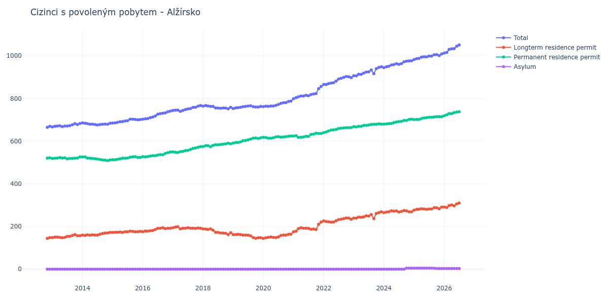

# Alžírsko

## Souhrnné statistiky (Min/Max pro rok) / Summary Statistics (Min/Max per year)

| Year   | Total         | Longterm Residence Permit   | Permanent Residence Permit   | Asylum   |
|--------|---------------|-----------------------------|------------------------------|----------|
| 2012   | 665 / 670     | 144 / 148                   | 521 / 522                    | 0 / 0    |
| 2013   | 667 / 683     | 147 / 162                   | 517 / 526                    | 0 / 0    |
| 2014   | 676 / 686     | 158 / 172                   | 509 / 526                    | 0 / 0    |
| 2015   | 685 / 703     | 172 / 178                   | 513 / 527                    | 0 / 0    |
| 2016   | 703 / 741     | 176 / 194                   | 526 / 549                    | 0 / 0    |
| 2017   | 740 / 767     | 189 / 199                   | 547 / 575                    | 0 / 0    |
| 2018   | 752 / 767     | 162 / 189                   | 574 / 590                    | 0 / 0    |
| 2019   | 753 / 766     | 145 / 163                   | 591 / 616                    | 0 / 0    |
| 2020   | 762 / 788     | 144 / 164                   | 614 / 624                    | 0 / 0    |
| 2021   | 799 / 857     | 175 / 221                   | 618 / 637                    | 0 / 0    |
| 2022   | 866 / 903     | 220 / 240                   | 640 / 664                    | 0 / 0    |
| 2023   | 906 / 949     | 237 / 269                   | 667 / 681                    | 0 / 0    |
| 2024   | 945 / 977     | 265 / 275                   | 680 / 703                    | 0 / 5    |
| 2025   | 983 / 1 009   | 277 / 291                   | 701 / 715                    | 3 / 5    |
| 2026   | 1 013 / 1 051 | 289 / 310                   | 719 / 738                    | 3 / 3    |

## Detailní tabulka / Detailed Data Table

| Date     | Total          | Longterm Residence Permit   | Permanent Residence Permit   | Asylum      |
|----------|----------------|-----------------------------|------------------------------|-------------|
| **2012** |                |                             |                              |             |
| 11.2012  | 665            | 144                         | 521                          | 0           |
| 12.2012  | 670 (+0.75%)   | 148 (+2.78%)                | 522 (+0.19%)                 | 0           |
| **2013** |                |                             |                              |             |
| 01.2013  | 667 (-0.45%)   | 148 (+0.00%)                | 519 (-0.57%)                 | 0           |
| 02.2013  | 670 (+0.45%)   | 150 (+1.35%)                | 520 (+0.19%)                 | 0           |
| 03.2013  | 671 (+0.15%)   | 150 (+0.00%)                | 521 (+0.19%)                 | 0           |
| 04.2013  | 672 (+0.15%)   | 149 (-0.67%)                | 523 (+0.38%)                 | 0           |
| 05.2013  | 668 (-0.60%)   | 147 (-1.34%)                | 521 (-0.38%)                 | 0           |
| 06.2013  | 671 (+0.45%)   | 149 (+1.36%)                | 522 (+0.19%)                 | 0           |
| 07.2013  | 671 (+0.00%)   | 154 (+3.36%)                | 517 (-0.96%)                 | 0           |
| 08.2013  | 673 (+0.30%)   | 154 (+0.00%)                | 519 (+0.39%)                 | 0           |
| 09.2013  | 677 (+0.59%)   | 158 (+2.60%)                | 519 (+0.00%)                 | 0           |
| 10.2013  | 682 (+0.74%)   | 162 (+2.53%)                | 520 (+0.19%)                 | 0           |
| 11.2013  | 678 (-0.59%)   | 157 (-3.09%)                | 521 (+0.19%)                 | 0           |
| 12.2013  | 683 (+0.74%)   | 157 (+0.00%)                | 526 (+0.96%)                 | 0           |
| **2014** |                |                             |                              |             |
| 01.2014  | 686 (+0.44%)   | 160 (+1.91%)                | 526 (+0.00%)                 | 0           |
| 02.2014  | 684 (-0.29%)   | 158 (-1.25%)                | 526 (+0.00%)                 | 0           |
| 03.2014  | 682 (-0.29%)   | 161 (+1.90%)                | 521 (-0.95%)                 | 0           |
| 04.2014  | 679 (-0.44%)   | 159 (-1.24%)                | 520 (-0.19%)                 | 0           |
| 05.2014  | 680 (+0.15%)   | 161 (+1.26%)                | 519 (-0.19%)                 | 0           |
| 06.2014  | 678 (-0.29%)   | 160 (-0.62%)                | 518 (-0.19%)                 | 0           |
| 07.2014  | 676 (-0.29%)   | 160 (+0.00%)                | 516 (-0.39%)                 | 0           |
| 08.2014  | 678 (+0.30%)   | 164 (+2.50%)                | 514 (-0.39%)                 | 0           |
| 09.2014  | 679 (+0.15%)   | 167 (+1.83%)                | 512 (-0.39%)                 | 0           |
| 10.2014  | 680 (+0.15%)   | 169 (+1.20%)                | 511 (-0.20%)                 | 0           |
| 11.2014  | 679 (-0.15%)   | 170 (+0.59%)                | 509 (-0.39%)                 | 0           |
| 12.2014  | 684 (+0.74%)   | 172 (+1.18%)                | 512 (+0.59%)                 | 0           |
| **2015** |                |                             |                              |             |
| 01.2015  | 685 (+0.15%)   | 172 (+0.00%)                | 513 (+0.20%)                 | 0           |
| 02.2015  | 686 (+0.15%)   | 173 (+0.58%)                | 513 (+0.00%)                 | 0           |
| 03.2015  | 688 (+0.29%)   | 173 (+0.00%)                | 515 (+0.39%)                 | 0           |
| 04.2015  | 691 (+0.44%)   | 174 (+0.58%)                | 517 (+0.39%)                 | 0           |
| 05.2015  | 692 (+0.14%)   | 172 (-1.15%)                | 520 (+0.58%)                 | 0           |
| 06.2015  | 695 (+0.43%)   | 175 (+1.74%)                | 520 (+0.00%)                 | 0           |
| 07.2015  | 696 (+0.14%)   | 175 (+0.00%)                | 521 (+0.19%)                 | 0           |
| 08.2015  | 703 (+1.01%)   | 178 (+1.71%)                | 525 (+0.77%)                 | 0           |
| 09.2015  | 703 (+0.00%)   | 177 (-0.56%)                | 526 (+0.19%)                 | 0           |
| 10.2015  | 702 (-0.14%)   | 175 (-1.13%)                | 527 (+0.19%)                 | 0           |
| 11.2015  | 700 (-0.28%)   | 176 (+0.57%)                | 524 (-0.57%)                 | 0           |
| 12.2015  | 701 (+0.14%)   | 177 (+0.57%)                | 524 (+0.00%)                 | 0           |
| **2016** |                |                             |                              |             |
| 01.2016  | 703 (+0.29%)   | 176 (-0.56%)                | 527 (+0.57%)                 | 0           |
| 02.2016  | 705 (+0.28%)   | 179 (+1.70%)                | 526 (-0.19%)                 | 0           |
| 03.2016  | 706 (+0.14%)   | 178 (-0.56%)                | 528 (+0.38%)                 | 0           |
| 04.2016  | 710 (+0.57%)   | 180 (+1.12%)                | 530 (+0.38%)                 | 0           |
| 05.2016  | 713 (+0.42%)   | 181 (+0.56%)                | 532 (+0.38%)                 | 0           |
| 06.2016  | 718 (+0.70%)   | 186 (+2.76%)                | 532 (+0.00%)                 | 0           |
| 07.2016  | 726 (+1.11%)   | 191 (+2.69%)                | 535 (+0.56%)                 | 0           |
| 08.2016  | 729 (+0.41%)   | 192 (+0.52%)                | 537 (+0.37%)                 | 0           |
| 09.2016  | 731 (+0.27%)   | 194 (+1.04%)                | 537 (+0.00%)                 | 0           |
| 10.2016  | 733 (+0.27%)   | 190 (-2.06%)                | 543 (+1.12%)                 | 0           |
| 11.2016  | 738 (+0.68%)   | 192 (+1.05%)                | 546 (+0.55%)                 | 0           |
| 12.2016  | 741 (+0.41%)   | 192 (+0.00%)                | 549 (+0.55%)                 | 0           |
| **2017** |                |                             |                              |             |
| 01.2017  | 744 (+0.40%)   | 194 (+1.04%)                | 550 (+0.18%)                 | 0           |
| 02.2017  | 745 (+0.13%)   | 197 (+1.55%)                | 548 (-0.36%)                 | 0           |
| 03.2017  | 746 (+0.13%)   | 199 (+1.02%)                | 547 (-0.18%)                 | 0           |
| 04.2017  | 740 (-0.80%)   | 189 (-5.03%)                | 551 (+0.73%)                 | 0           |
| 05.2017  | 744 (+0.54%)   | 192 (+1.59%)                | 552 (+0.18%)                 | 0           |
| 06.2017  | 748 (+0.54%)   | 192 (+0.00%)                | 556 (+0.72%)                 | 0           |
| 07.2017  | 751 (+0.40%)   | 194 (+1.04%)                | 557 (+0.18%)                 | 0           |
| 08.2017  | 753 (+0.27%)   | 192 (-1.03%)                | 561 (+0.72%)                 | 0           |
| 09.2017  | 758 (+0.66%)   | 192 (+0.00%)                | 566 (+0.89%)                 | 0           |
| 10.2017  | 759 (+0.13%)   | 191 (-0.52%)                | 568 (+0.35%)                 | 0           |
| 11.2017  | 764 (+0.66%)   | 193 (+1.05%)                | 571 (+0.53%)                 | 0           |
| 12.2017  | 767 (+0.39%)   | 192 (-0.52%)                | 575 (+0.70%)                 | 0           |
| **2018** |                |                             |                              |             |
| 01.2018  | 764 (-0.39%)   | 189 (-1.56%)                | 575 (+0.00%)                 | 0           |
| 02.2018  | 767 (+0.39%)   | 188 (-0.53%)                | 579 (+0.70%)                 | 0           |
| 03.2018  | 765 (-0.26%)   | 186 (-1.06%)                | 579 (+0.00%)                 | 0           |
| 04.2018  | 763 (-0.26%)   | 189 (+1.61%)                | 574 (-0.86%)                 | 0           |
| 05.2018  | 763 (+0.00%)   | 183 (-3.17%)                | 580 (+1.05%)                 | 0           |
| 06.2018  | 756 (-0.92%)   | 173 (-5.46%)                | 583 (+0.52%)                 | 0           |
| 07.2018  | 755 (-0.13%)   | 172 (-0.58%)                | 583 (+0.00%)                 | 0           |
| 08.2018  | 754 (-0.13%)   | 170 (-1.16%)                | 584 (+0.17%)                 | 0           |
| 09.2018  | 755 (+0.13%)   | 169 (-0.59%)                | 586 (+0.34%)                 | 0           |
| 10.2018  | 755 (+0.00%)   | 168 (-0.59%)                | 587 (+0.17%)                 | 0           |
| 11.2018  | 752 (-0.40%)   | 162 (-3.57%)                | 590 (+0.51%)                 | 0           |
| 12.2018  | 759 (+0.93%)   | 171 (+5.56%)                | 588 (-0.34%)                 | 0           |
| **2019** |                |                             |                              |             |
| 01.2019  | 753 (-0.79%)   | 162 (-5.26%)                | 591 (+0.51%)                 | 0           |
| 02.2019  | 756 (+0.40%)   | 162 (+0.00%)                | 594 (+0.51%)                 | 0           |
| 03.2019  | 757 (+0.13%)   | 163 (+0.62%)                | 594 (+0.00%)                 | 0           |
| 04.2019  | 759 (+0.26%)   | 162 (-0.61%)                | 597 (+0.51%)                 | 0           |
| 05.2019  | 762 (+0.40%)   | 160 (-1.23%)                | 602 (+0.84%)                 | 0           |
| 06.2019  | 763 (+0.13%)   | 160 (+0.00%)                | 603 (+0.17%)                 | 0           |
| 07.2019  | 765 (+0.26%)   | 159 (-0.62%)                | 606 (+0.50%)                 | 0           |
| 08.2019  | 766 (+0.13%)   | 156 (-1.89%)                | 610 (+0.66%)                 | 0           |
| 09.2019  | 762 (-0.52%)   | 148 (-5.13%)                | 614 (+0.66%)                 | 0           |
| 10.2019  | 760 (-0.26%)   | 145 (-2.03%)                | 615 (+0.16%)                 | 0           |
| 11.2019  | 760 (+0.00%)   | 147 (+1.38%)                | 613 (-0.33%)                 | 0           |
| 12.2019  | 763 (+0.39%)   | 147 (+0.00%)                | 616 (+0.49%)                 | 0           |
| **2020** |                |                             |                              |             |
| 01.2020  | 762 (-0.13%)   | 144 (-2.04%)                | 618 (+0.32%)                 | 0           |
| 02.2020  | 764 (+0.26%)   | 147 (+2.08%)                | 617 (-0.16%)                 | 0           |
| 03.2020  | 763 (-0.13%)   | 149 (+1.36%)                | 614 (-0.49%)                 | 0           |
| 04.2020  | 765 (+0.26%)   | 151 (+1.34%)                | 614 (+0.00%)                 | 0           |
| 05.2020  | 765 (+0.00%)   | 149 (-1.32%)                | 616 (+0.33%)                 | 0           |
| 06.2020  | 768 (+0.39%)   | 148 (-0.67%)                | 620 (+0.65%)                 | 0           |
| 07.2020  | 772 (+0.52%)   | 151 (+2.03%)                | 621 (+0.16%)                 | 0           |
| 08.2020  | 777 (+0.65%)   | 158 (+4.64%)                | 619 (-0.32%)                 | 0           |
| 09.2020  | 780 (+0.39%)   | 160 (+1.27%)                | 620 (+0.16%)                 | 0           |
| 10.2020  | 781 (+0.13%)   | 160 (+0.00%)                | 621 (+0.16%)                 | 0           |
| 11.2020  | 786 (+0.64%)   | 163 (+1.88%)                | 623 (+0.32%)                 | 0           |
| 12.2020  | 788 (+0.25%)   | 164 (+0.61%)                | 624 (+0.16%)                 | 0           |
| **2021** |                |                             |                              |             |
| 01.2021  | 799 (+1.40%)   | 175 (+6.71%)                | 624 (+0.00%)                 | 0           |
| 02.2021  | 804 (+0.63%)   | 178 (+1.71%)                | 626 (+0.32%)                 | 0           |
| 03.2021  | 808 (+0.50%)   | 190 (+6.74%)                | 618 (-1.28%)                 | 0           |
| 04.2021  | 812 (+0.50%)   | 194 (+2.11%)                | 618 (+0.00%)                 | 0           |
| 05.2021  | 812 (+0.00%)   | 192 (-1.03%)                | 620 (+0.32%)                 | 0           |
| 06.2021  | 815 (+0.37%)   | 192 (+0.00%)                | 623 (+0.48%)                 | 0           |
| 07.2021  | 813 (-0.25%)   | 191 (-0.52%)                | 622 (-0.16%)                 | 0           |
| 08.2021  | 819 (+0.74%)   | 187 (-2.09%)                | 632 (+1.61%)                 | 0           |
| 09.2021  | 821 (+0.24%)   | 188 (+0.53%)                | 633 (+0.16%)                 | 0           |
| 10.2021  | 823 (+0.24%)   | 186 (-1.06%)                | 637 (+0.63%)                 | 0           |
| 11.2021  | 846 (+2.79%)   | 210 (+12.90%)               | 636 (-0.16%)                 | 0           |
| 12.2021  | 857 (+1.30%)   | 221 (+5.24%)                | 636 (+0.00%)                 | 0           |
| **2022** |                |                             |                              |             |
| 01.2022  | 866 (+1.05%)   | 226 (+2.26%)                | 640 (+0.63%)                 | 0           |
| 02.2022  | 866 (+0.00%)   | 223 (-1.33%)                | 643 (+0.47%)                 | 0           |
| 03.2022  | 870 (+0.46%)   | 222 (-0.45%)                | 648 (+0.78%)                 | 0           |
| 04.2022  | 872 (+0.23%)   | 220 (-0.90%)                | 652 (+0.62%)                 | 0           |
| 05.2022  | 874 (+0.23%)   | 221 (+0.45%)                | 653 (+0.15%)                 | 0           |
| 06.2022  | 882 (+0.92%)   | 227 (+2.71%)                | 655 (+0.31%)                 | 0           |
| 07.2022  | 891 (+1.02%)   | 232 (+2.20%)                | 659 (+0.61%)                 | 0           |
| 08.2022  | 895 (+0.45%)   | 234 (+0.86%)                | 661 (+0.30%)                 | 0           |
| 09.2022  | 899 (+0.45%)   | 237 (+1.28%)                | 662 (+0.15%)                 | 0           |
| 10.2022  | 903 (+0.44%)   | 240 (+1.27%)                | 663 (+0.15%)                 | 0           |
| 11.2022  | 902 (-0.11%)   | 239 (-0.42%)                | 663 (+0.00%)                 | 0           |
| 12.2022  | 898 (-0.44%)   | 234 (-2.09%)                | 664 (+0.15%)                 | 0           |
| **2023** |                |                             |                              |             |
| 01.2023  | 907 (+1.00%)   | 239 (+2.14%)                | 668 (+0.60%)                 | 0           |
| 02.2023  | 906 (-0.11%)   | 239 (+0.00%)                | 667 (-0.15%)                 | 0           |
| 03.2023  | 914 (+0.88%)   | 244 (+2.09%)                | 670 (+0.45%)                 | 0           |
| 04.2023  | 913 (-0.11%)   | 243 (-0.41%)                | 670 (+0.00%)                 | 0           |
| 05.2023  | 919 (+0.66%)   | 245 (+0.82%)                | 674 (+0.60%)                 | 0           |
| 06.2023  | 924 (+0.54%)   | 250 (+2.04%)                | 674 (+0.00%)                 | 0           |
| 07.2023  | 925 (+0.11%)   | 249 (-0.40%)                | 676 (+0.30%)                 | 0           |
| 08.2023  | 934 (+0.97%)   | 256 (+2.81%)                | 678 (+0.30%)                 | 0           |
| 09.2023  | 916 (-1.93%)   | 237 (-7.42%)                | 679 (+0.15%)                 | 0           |
| 10.2023  | 940 (+2.62%)   | 261 (+10.13%)               | 679 (+0.00%)                 | 0           |
| 11.2023  | 946 (+0.64%)   | 265 (+1.53%)                | 681 (+0.29%)                 | 0           |
| 12.2023  | 949 (+0.32%)   | 269 (+1.51%)                | 680 (-0.15%)                 | 0           |
| **2024** |                |                             |                              |             |
| 01.2024  | 945 (-0.42%)   | 265 (-1.49%)                | 680 (+0.00%)                 | 0           |
| 02.2024  | 949 (+0.42%)   | 268 (+1.13%)                | 681 (+0.15%)                 | 0           |
| 03.2024  | 951 (+0.21%)   | 269 (+0.37%)                | 682 (+0.15%)                 | 0           |
| 04.2024  | 957 (+0.63%)   | 274 (+1.86%)                | 683 (+0.15%)                 | 0           |
| 05.2024  | 959 (+0.21%)   | 272 (-0.73%)                | 687 (+0.59%)                 | 0           |
| 06.2024  | 963 (+0.42%)   | 273 (+0.37%)                | 690 (+0.44%)                 | 0           |
| 07.2024  | 960 (-0.31%)   | 268 (-1.83%)                | 692 (+0.29%)                 | 0           |
| 08.2024  | 964 (+0.42%)   | 271 (+1.12%)                | 693 (+0.14%)                 | 0           |
| 09.2024  | 972 (+0.83%)   | 275 (+1.48%)                | 697 (+0.58%)                 | 0           |
| 10.2024  | 975 (+0.31%)   | 273 (-0.73%)                | 697 (+0.00%)                 | 5           |
| 11.2024  | 976 (+0.10%)   | 269 (-1.47%)                | 702 (+0.72%)                 | 5 (+0.00%)  |
| 12.2024  | 977 (+0.10%)   | 269 (+0.00%)                | 703 (+0.14%)                 | 5 (+0.00%)  |
| **2025** |                |                             |                              |             |
| 01.2025  | 983 (+0.61%)   | 277 (+2.97%)                | 701 (-0.28%)                 | 5 (+0.00%)  |
| 02.2025  | 987 (+0.41%)   | 280 (+1.08%)                | 702 (+0.14%)                 | 5 (+0.00%)  |
| 03.2025  | 988 (+0.10%)   | 281 (+0.36%)                | 702 (+0.00%)                 | 5 (+0.00%)  |
| 04.2025  | 994 (+0.61%)   | 283 (+0.71%)                | 706 (+0.57%)                 | 5 (+0.00%)  |
| 05.2025  | 996 (+0.20%)   | 282 (-0.35%)                | 709 (+0.42%)                 | 5 (+0.00%)  |
| 06.2025  | 995 (-0.10%)   | 280 (-0.71%)                | 710 (+0.14%)                 | 5 (+0.00%)  |
| 07.2025  | 999 (+0.40%)   | 282 (+0.71%)                | 712 (+0.28%)                 | 5 (+0.00%)  |
| 08.2025  | 999 (+0.00%)   | 282 (+0.00%)                | 712 (+0.00%)                 | 5 (+0.00%)  |
| 09.2025  | 1 005 (+0.60%) | 288 (+2.13%)                | 713 (+0.14%)                 | 4 (-20.00%) |
| 10.2025  | 1 006 (+0.10%) | 288 (+0.00%)                | 715 (+0.28%)                 | 3 (-25.00%) |
| 11.2025  | 1 001 (-0.50%) | 283 (-1.74%)                | 715 (+0.00%)                 | 3 (+0.00%)  |
| 12.2025  | 1 009 (+0.80%) | 291 (+2.83%)                | 715 (+0.00%)                 | 3 (+0.00%)  |
| **2026** |                |                             |                              |             |
| 01.2026  | 1 013 (+0.40%) | 291 (+0.00%)                | 719 (+0.56%)                 | 3 (+0.00%)  |
| 02.2026  | 1 016 (+0.30%) | 289 (-0.69%)                | 724 (+0.70%)                 | 3 (+0.00%)  |
| 03.2026  | 1 030 (+1.38%) | 298 (+3.11%)                | 729 (+0.69%)                 | 3 (+0.00%)  |
| 04.2026  | 1 033 (+0.29%) | 301 (+1.01%)                | 729 (+0.00%)                 | 3 (+0.00%)  |
| 05.2026  | 1 034 (+0.10%) | 297 (-1.33%)                | 734 (+0.69%)                 | 3 (+0.00%)  |
| 06.2026  | 1 045 (+1.06%) | 306 (+3.03%)                | 736 (+0.27%)                 | 3 (+0.00%)  |
| 07.2026  | 1 051 (+0.57%) | 310 (+1.31%)                | 738 (+0.27%)                 | 3 (+0.00%)  |
