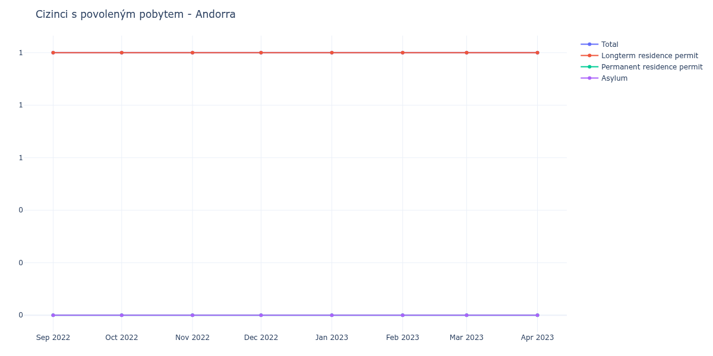

# Andorra

## Souhrnné statistiky (Min/Max pro rok) / Summary Statistics (Min/Max per year)

| Year   | Total Min/Max   | Longterm Residence Permit Min/Max   | Permanent Residence Permit Min/Max   | Asylum Min/Max   |
|--------|-----------------|-------------------------------------|--------------------------------------|------------------|
| 2022   | 1 / 1           | 1 / 1                               | 0 / 0                                | 0 / 0            |
| 2023   | 1 / 1           | 1 / 1                               | 0 / 0                                | 0 / 0            |

## Detailní tabulka / Detailed Data Table

| Date     | Total      | Longterm Residence Permit   | Permanent Residence Permit   | Asylum   |
|----------|------------|-----------------------------|------------------------------|----------|
| **2022** |            |                             |                              |          |
| 09.2022  | 1          | 1                           | 0                            | 0        |
| 10.2022  | 1 (+0.00%) | 1 (+0.00%)                  | 0                            | 0        |
| 11.2022  | 1 (+0.00%) | 1 (+0.00%)                  | 0                            | 0        |
| 12.2022  | 1 (+0.00%) | 1 (+0.00%)                  | 0                            | 0        |
| **2023** |            |                             |                              |          |
| 01.2023  | 1 (+0.00%) | 1 (+0.00%)                  | 0                            | 0        |
| 02.2023  | 1 (+0.00%) | 1 (+0.00%)                  | 0                            | 0        |
| 03.2023  | 1 (+0.00%) | 1 (+0.00%)                  | 0                            | 0        |
| 04.2023  | 1 (+0.00%) | 1 (+0.00%)                  | 0                            | 0        |
