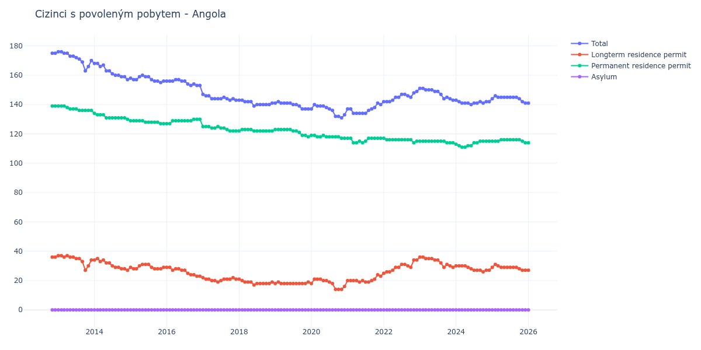

# Angola

## Souhrnné statistiky (Min/Max pro rok) / Summary Statistics (Min/Max per year)

| Year   | Total     | Longterm Residence Permit   | Permanent Residence Permit   | Asylum   |
|--------|-----------|-----------------------------|------------------------------|----------|
| 2012   | 175 / 175 | 36 / 36                     | 139 / 139                    | 0 / 0    |
| 2013   | 163 / 176 | 27 / 37                     | 136 / 139                    | 0 / 0    |
| 2014   | 157 / 168 | 27 / 35                     | 130 / 134                    | 0 / 0    |
| 2015   | 155 / 160 | 28 / 31                     | 127 / 129                    | 0 / 0    |
| 2016   | 153 / 157 | 23 / 29                     | 127 / 130                    | 0 / 0    |
| 2017   | 143 / 147 | 19 / 22                     | 122 / 125                    | 0 / 0    |
| 2018   | 139 / 143 | 17 / 21                     | 122 / 123                    | 0 / 0    |
| 2019   | 137 / 142 | 18 / 19                     | 118 / 123                    | 0 / 0    |
| 2020   | 131 / 140 | 14 / 21                     | 117 / 119                    | 0 / 0    |
| 2021   | 134 / 141 | 19 / 24                     | 114 / 117                    | 0 / 0    |
| 2022   | 142 / 149 | 25 / 34                     | 114 / 117                    | 0 / 0    |
| 2023   | 143 / 151 | 29 / 36                     | 114 / 115                    | 0 / 0    |
| 2024   | 140 / 143 | 26 / 30                     | 111 / 115                    | 0 / 0    |
| 2025   | 141 / 146 | 27 / 31                     | 114 / 116                    | 0 / 0    |
| 2026   | 141 / 141 | 27 / 27                     | 114 / 114                    | 0 / 0    |

## Detailní tabulka / Detailed Data Table

| Date     | Total        | Longterm Residence Permit   | Permanent Residence Permit   | Asylum   |
|----------|--------------|-----------------------------|------------------------------|----------|
| **2012** |              |                             |                              |          |
| 11.2012  | 175          | 36                          | 139                          | 0        |
| 12.2012  | 175 (+0.00%) | 36 (+0.00%)                 | 139 (+0.00%)                 | 0        |
| **2013** |              |                             |                              |          |
| 01.2013  | 176 (+0.57%) | 37 (+2.78%)                 | 139 (+0.00%)                 | 0        |
| 02.2013  | 176 (+0.00%) | 37 (+0.00%)                 | 139 (+0.00%)                 | 0        |
| 03.2013  | 175 (-0.57%) | 36 (-2.70%)                 | 139 (+0.00%)                 | 0        |
| 04.2013  | 175 (+0.00%) | 37 (+2.78%)                 | 138 (-0.72%)                 | 0        |
| 05.2013  | 173 (-1.14%) | 36 (-2.70%)                 | 137 (-0.72%)                 | 0        |
| 06.2013  | 173 (+0.00%) | 36 (+0.00%)                 | 137 (+0.00%)                 | 0        |
| 07.2013  | 172 (-0.58%) | 35 (-2.78%)                 | 137 (+0.00%)                 | 0        |
| 08.2013  | 171 (-0.58%) | 35 (+0.00%)                 | 136 (-0.73%)                 | 0        |
| 09.2013  | 169 (-1.17%) | 33 (-5.71%)                 | 136 (+0.00%)                 | 0        |
| 10.2013  | 163 (-3.55%) | 27 (-18.18%)                | 136 (+0.00%)                 | 0        |
| 11.2013  | 166 (+1.84%) | 30 (+11.11%)                | 136 (+0.00%)                 | 0        |
| 12.2013  | 170 (+2.41%) | 34 (+13.33%)                | 136 (+0.00%)                 | 0        |
| **2014** |              |                             |                              |          |
| 01.2014  | 168 (-1.18%) | 34 (+0.00%)                 | 134 (-1.47%)                 | 0        |
| 02.2014  | 168 (+0.00%) | 35 (+2.94%)                 | 133 (-0.75%)                 | 0        |
| 03.2014  | 166 (-1.19%) | 33 (-5.71%)                 | 133 (+0.00%)                 | 0        |
| 04.2014  | 167 (+0.60%) | 34 (+3.03%)                 | 133 (+0.00%)                 | 0        |
| 05.2014  | 163 (-2.40%) | 32 (-5.88%)                 | 131 (-1.50%)                 | 0        |
| 06.2014  | 163 (+0.00%) | 32 (+0.00%)                 | 131 (+0.00%)                 | 0        |
| 07.2014  | 161 (-1.23%) | 30 (-6.25%)                 | 131 (+0.00%)                 | 0        |
| 08.2014  | 160 (-0.62%) | 29 (-3.33%)                 | 131 (+0.00%)                 | 0        |
| 09.2014  | 160 (+0.00%) | 29 (+0.00%)                 | 131 (+0.00%)                 | 0        |
| 10.2014  | 159 (-0.62%) | 28 (-3.45%)                 | 131 (+0.00%)                 | 0        |
| 11.2014  | 159 (+0.00%) | 28 (+0.00%)                 | 131 (+0.00%)                 | 0        |
| 12.2014  | 157 (-1.26%) | 27 (-3.57%)                 | 130 (-0.76%)                 | 0        |
| **2015** |              |                             |                              |          |
| 01.2015  | 158 (+0.64%) | 29 (+7.41%)                 | 129 (-0.77%)                 | 0        |
| 02.2015  | 157 (-0.63%) | 28 (-3.45%)                 | 129 (+0.00%)                 | 0        |
| 03.2015  | 157 (+0.00%) | 28 (+0.00%)                 | 129 (+0.00%)                 | 0        |
| 04.2015  | 159 (+1.27%) | 30 (+7.14%)                 | 129 (+0.00%)                 | 0        |
| 05.2015  | 160 (+0.63%) | 31 (+3.33%)                 | 129 (+0.00%)                 | 0        |
| 06.2015  | 159 (-0.62%) | 31 (+0.00%)                 | 128 (-0.78%)                 | 0        |
| 07.2015  | 159 (+0.00%) | 31 (+0.00%)                 | 128 (+0.00%)                 | 0        |
| 08.2015  | 157 (-1.26%) | 29 (-6.45%)                 | 128 (+0.00%)                 | 0        |
| 09.2015  | 156 (-0.64%) | 28 (-3.45%)                 | 128 (+0.00%)                 | 0        |
| 10.2015  | 156 (+0.00%) | 28 (+0.00%)                 | 128 (+0.00%)                 | 0        |
| 11.2015  | 155 (-0.64%) | 28 (+0.00%)                 | 127 (-0.78%)                 | 0        |
| 12.2015  | 156 (+0.65%) | 29 (+3.57%)                 | 127 (+0.00%)                 | 0        |
| **2016** |              |                             |                              |          |
| 01.2016  | 156 (+0.00%) | 29 (+0.00%)                 | 127 (+0.00%)                 | 0        |
| 02.2016  | 156 (+0.00%) | 29 (+0.00%)                 | 127 (+0.00%)                 | 0        |
| 03.2016  | 156 (+0.00%) | 27 (-6.90%)                 | 129 (+1.57%)                 | 0        |
| 04.2016  | 157 (+0.64%) | 28 (+3.70%)                 | 129 (+0.00%)                 | 0        |
| 05.2016  | 157 (+0.00%) | 28 (+0.00%)                 | 129 (+0.00%)                 | 0        |
| 06.2016  | 156 (-0.64%) | 27 (-3.57%)                 | 129 (+0.00%)                 | 0        |
| 07.2016  | 156 (+0.00%) | 27 (+0.00%)                 | 129 (+0.00%)                 | 0        |
| 08.2016  | 154 (-1.28%) | 25 (-7.41%)                 | 129 (+0.00%)                 | 0        |
| 09.2016  | 153 (-0.65%) | 24 (-4.00%)                 | 129 (+0.00%)                 | 0        |
| 10.2016  | 154 (+0.65%) | 24 (+0.00%)                 | 130 (+0.78%)                 | 0        |
| 11.2016  | 153 (-0.65%) | 23 (-4.17%)                 | 130 (+0.00%)                 | 0        |
| 12.2016  | 153 (+0.00%) | 23 (+0.00%)                 | 130 (+0.00%)                 | 0        |
| **2017** |              |                             |                              |          |
| 01.2017  | 147 (-3.92%) | 22 (-4.35%)                 | 125 (-3.85%)                 | 0        |
| 02.2017  | 146 (-0.68%) | 21 (-4.55%)                 | 125 (+0.00%)                 | 0        |
| 03.2017  | 146 (+0.00%) | 21 (+0.00%)                 | 125 (+0.00%)                 | 0        |
| 04.2017  | 144 (-1.37%) | 20 (-4.76%)                 | 124 (-0.80%)                 | 0        |
| 05.2017  | 144 (+0.00%) | 20 (+0.00%)                 | 124 (+0.00%)                 | 0        |
| 06.2017  | 144 (+0.00%) | 19 (-5.00%)                 | 125 (+0.81%)                 | 0        |
| 07.2017  | 144 (+0.00%) | 20 (+5.26%)                 | 124 (-0.80%)                 | 0        |
| 08.2017  | 145 (+0.69%) | 21 (+5.00%)                 | 124 (+0.00%)                 | 0        |
| 09.2017  | 144 (-0.69%) | 21 (+0.00%)                 | 123 (-0.81%)                 | 0        |
| 10.2017  | 143 (-0.69%) | 21 (+0.00%)                 | 122 (-0.81%)                 | 0        |
| 11.2017  | 144 (+0.70%) | 22 (+4.76%)                 | 122 (+0.00%)                 | 0        |
| 12.2017  | 143 (-0.69%) | 21 (-4.55%)                 | 122 (+0.00%)                 | 0        |
| **2018** |              |                             |                              |          |
| 01.2018  | 143 (+0.00%) | 21 (+0.00%)                 | 122 (+0.00%)                 | 0        |
| 02.2018  | 143 (+0.00%) | 20 (-4.76%)                 | 123 (+0.82%)                 | 0        |
| 03.2018  | 142 (-0.70%) | 19 (-5.00%)                 | 123 (+0.00%)                 | 0        |
| 04.2018  | 142 (+0.00%) | 19 (+0.00%)                 | 123 (+0.00%)                 | 0        |
| 05.2018  | 142 (+0.00%) | 19 (+0.00%)                 | 123 (+0.00%)                 | 0        |
| 06.2018  | 139 (-2.11%) | 17 (-10.53%)                | 122 (-0.81%)                 | 0        |
| 07.2018  | 140 (+0.72%) | 18 (+5.88%)                 | 122 (+0.00%)                 | 0        |
| 08.2018  | 140 (+0.00%) | 18 (+0.00%)                 | 122 (+0.00%)                 | 0        |
| 09.2018  | 140 (+0.00%) | 18 (+0.00%)                 | 122 (+0.00%)                 | 0        |
| 10.2018  | 140 (+0.00%) | 18 (+0.00%)                 | 122 (+0.00%)                 | 0        |
| 11.2018  | 140 (+0.00%) | 18 (+0.00%)                 | 122 (+0.00%)                 | 0        |
| 12.2018  | 141 (+0.71%) | 19 (+5.56%)                 | 122 (+0.00%)                 | 0        |
| **2019** |              |                             |                              |          |
| 01.2019  | 141 (+0.00%) | 18 (-5.26%)                 | 123 (+0.82%)                 | 0        |
| 02.2019  | 142 (+0.71%) | 19 (+5.56%)                 | 123 (+0.00%)                 | 0        |
| 03.2019  | 141 (-0.70%) | 18 (-5.26%)                 | 123 (+0.00%)                 | 0        |
| 04.2019  | 141 (+0.00%) | 18 (+0.00%)                 | 123 (+0.00%)                 | 0        |
| 05.2019  | 141 (+0.00%) | 18 (+0.00%)                 | 123 (+0.00%)                 | 0        |
| 06.2019  | 141 (+0.00%) | 18 (+0.00%)                 | 123 (+0.00%)                 | 0        |
| 07.2019  | 140 (-0.71%) | 18 (+0.00%)                 | 122 (-0.81%)                 | 0        |
| 08.2019  | 140 (+0.00%) | 18 (+0.00%)                 | 122 (+0.00%)                 | 0        |
| 09.2019  | 139 (-0.71%) | 18 (+0.00%)                 | 121 (-0.82%)                 | 0        |
| 10.2019  | 137 (-1.44%) | 18 (+0.00%)                 | 119 (-1.65%)                 | 0        |
| 11.2019  | 137 (+0.00%) | 18 (+0.00%)                 | 119 (+0.00%)                 | 0        |
| 12.2019  | 137 (+0.00%) | 19 (+5.56%)                 | 118 (-0.84%)                 | 0        |
| **2020** |              |                             |                              |          |
| 01.2020  | 137 (+0.00%) | 18 (-5.26%)                 | 119 (+0.85%)                 | 0        |
| 02.2020  | 140 (+2.19%) | 21 (+16.67%)                | 119 (+0.00%)                 | 0        |
| 03.2020  | 139 (-0.71%) | 21 (+0.00%)                 | 118 (-0.84%)                 | 0        |
| 04.2020  | 139 (+0.00%) | 21 (+0.00%)                 | 118 (+0.00%)                 | 0        |
| 05.2020  | 139 (+0.00%) | 20 (-4.76%)                 | 119 (+0.85%)                 | 0        |
| 06.2020  | 138 (-0.72%) | 20 (+0.00%)                 | 118 (-0.84%)                 | 0        |
| 07.2020  | 137 (-0.72%) | 19 (-5.00%)                 | 118 (+0.00%)                 | 0        |
| 08.2020  | 136 (-0.73%) | 18 (-5.26%)                 | 118 (+0.00%)                 | 0        |
| 09.2020  | 132 (-2.94%) | 14 (-22.22%)                | 118 (+0.00%)                 | 0        |
| 10.2020  | 132 (+0.00%) | 14 (+0.00%)                 | 118 (+0.00%)                 | 0        |
| 11.2020  | 131 (-0.76%) | 14 (+0.00%)                 | 117 (-0.85%)                 | 0        |
| 12.2020  | 133 (+1.53%) | 16 (+14.29%)                | 117 (+0.00%)                 | 0        |
| **2021** |              |                             |                              |          |
| 01.2021  | 137 (+3.01%) | 20 (+25.00%)                | 117 (+0.00%)                 | 0        |
| 02.2021  | 137 (+0.00%) | 20 (+0.00%)                 | 117 (+0.00%)                 | 0        |
| 03.2021  | 134 (-2.19%) | 20 (+0.00%)                 | 114 (-2.56%)                 | 0        |
| 04.2021  | 134 (+0.00%) | 20 (+0.00%)                 | 114 (+0.00%)                 | 0        |
| 05.2021  | 134 (+0.00%) | 19 (-5.00%)                 | 115 (+0.88%)                 | 0        |
| 06.2021  | 134 (+0.00%) | 20 (+5.26%)                 | 114 (-0.87%)                 | 0        |
| 07.2021  | 134 (+0.00%) | 19 (-5.00%)                 | 115 (+0.88%)                 | 0        |
| 08.2021  | 136 (+1.49%) | 19 (+0.00%)                 | 117 (+1.74%)                 | 0        |
| 09.2021  | 137 (+0.74%) | 20 (+5.26%)                 | 117 (+0.00%)                 | 0        |
| 10.2021  | 138 (+0.73%) | 21 (+5.00%)                 | 117 (+0.00%)                 | 0        |
| 11.2021  | 141 (+2.17%) | 24 (+14.29%)                | 117 (+0.00%)                 | 0        |
| 12.2021  | 140 (-0.71%) | 23 (-4.17%)                 | 117 (+0.00%)                 | 0        |
| **2022** |              |                             |                              |          |
| 01.2022  | 142 (+1.43%) | 25 (+8.70%)                 | 117 (+0.00%)                 | 0        |
| 02.2022  | 142 (+0.00%) | 26 (+4.00%)                 | 116 (-0.85%)                 | 0        |
| 03.2022  | 142 (+0.00%) | 26 (+0.00%)                 | 116 (+0.00%)                 | 0        |
| 04.2022  | 143 (+0.70%) | 27 (+3.85%)                 | 116 (+0.00%)                 | 0        |
| 05.2022  | 145 (+1.40%) | 29 (+7.41%)                 | 116 (+0.00%)                 | 0        |
| 06.2022  | 145 (+0.00%) | 29 (+0.00%)                 | 116 (+0.00%)                 | 0        |
| 07.2022  | 147 (+1.38%) | 31 (+6.90%)                 | 116 (+0.00%)                 | 0        |
| 08.2022  | 147 (+0.00%) | 31 (+0.00%)                 | 116 (+0.00%)                 | 0        |
| 09.2022  | 146 (-0.68%) | 30 (-3.23%)                 | 116 (+0.00%)                 | 0        |
| 10.2022  | 145 (-0.68%) | 29 (-3.33%)                 | 116 (+0.00%)                 | 0        |
| 11.2022  | 148 (+2.07%) | 34 (+17.24%)                | 114 (-1.72%)                 | 0        |
| 12.2022  | 149 (+0.68%) | 34 (+0.00%)                 | 115 (+0.88%)                 | 0        |
| **2023** |              |                             |                              |          |
| 01.2023  | 151 (+1.34%) | 36 (+5.88%)                 | 115 (+0.00%)                 | 0        |
| 02.2023  | 151 (+0.00%) | 36 (+0.00%)                 | 115 (+0.00%)                 | 0        |
| 03.2023  | 150 (-0.66%) | 35 (-2.78%)                 | 115 (+0.00%)                 | 0        |
| 04.2023  | 150 (+0.00%) | 35 (+0.00%)                 | 115 (+0.00%)                 | 0        |
| 05.2023  | 150 (+0.00%) | 35 (+0.00%)                 | 115 (+0.00%)                 | 0        |
| 06.2023  | 149 (-0.67%) | 34 (-2.86%)                 | 115 (+0.00%)                 | 0        |
| 07.2023  | 149 (+0.00%) | 34 (+0.00%)                 | 115 (+0.00%)                 | 0        |
| 08.2023  | 147 (-1.34%) | 32 (-5.88%)                 | 115 (+0.00%)                 | 0        |
| 09.2023  | 144 (-2.04%) | 29 (-9.38%)                 | 115 (+0.00%)                 | 0        |
| 10.2023  | 145 (+0.69%) | 31 (+6.90%)                 | 114 (-0.87%)                 | 0        |
| 11.2023  | 144 (-0.69%) | 30 (-3.23%)                 | 114 (+0.00%)                 | 0        |
| 12.2023  | 143 (-0.69%) | 29 (-3.33%)                 | 114 (+0.00%)                 | 0        |
| **2024** |              |                             |                              |          |
| 01.2024  | 143 (+0.00%) | 30 (+3.45%)                 | 113 (-0.88%)                 | 0        |
| 02.2024  | 142 (-0.70%) | 30 (+0.00%)                 | 112 (-0.88%)                 | 0        |
| 03.2024  | 141 (-0.70%) | 30 (+0.00%)                 | 111 (-0.89%)                 | 0        |
| 04.2024  | 141 (+0.00%) | 30 (+0.00%)                 | 111 (+0.00%)                 | 0        |
| 05.2024  | 141 (+0.00%) | 29 (-3.33%)                 | 112 (+0.90%)                 | 0        |
| 06.2024  | 140 (-0.71%) | 28 (-3.45%)                 | 112 (+0.00%)                 | 0        |
| 07.2024  | 141 (+0.71%) | 27 (-3.57%)                 | 114 (+1.79%)                 | 0        |
| 08.2024  | 141 (+0.00%) | 27 (+0.00%)                 | 114 (+0.00%)                 | 0        |
| 09.2024  | 142 (+0.71%) | 27 (+0.00%)                 | 115 (+0.88%)                 | 0        |
| 10.2024  | 141 (-0.70%) | 26 (-3.70%)                 | 115 (+0.00%)                 | 0        |
| 11.2024  | 142 (+0.71%) | 27 (+3.85%)                 | 115 (+0.00%)                 | 0        |
| 12.2024  | 142 (+0.00%) | 27 (+0.00%)                 | 115 (+0.00%)                 | 0        |
| **2025** |              |                             |                              |          |
| 01.2025  | 144 (+1.41%) | 29 (+7.41%)                 | 115 (+0.00%)                 | 0        |
| 02.2025  | 146 (+1.39%) | 31 (+6.90%)                 | 115 (+0.00%)                 | 0        |
| 03.2025  | 145 (-0.68%) | 30 (-3.23%)                 | 115 (+0.00%)                 | 0        |
| 04.2025  | 145 (+0.00%) | 29 (-3.33%)                 | 116 (+0.87%)                 | 0        |
| 05.2025  | 145 (+0.00%) | 29 (+0.00%)                 | 116 (+0.00%)                 | 0        |
| 06.2025  | 145 (+0.00%) | 29 (+0.00%)                 | 116 (+0.00%)                 | 0        |
| 07.2025  | 145 (+0.00%) | 29 (+0.00%)                 | 116 (+0.00%)                 | 0        |
| 08.2025  | 145 (+0.00%) | 29 (+0.00%)                 | 116 (+0.00%)                 | 0        |
| 09.2025  | 145 (+0.00%) | 29 (+0.00%)                 | 116 (+0.00%)                 | 0        |
| 10.2025  | 144 (-0.69%) | 28 (-3.45%)                 | 116 (+0.00%)                 | 0        |
| 11.2025  | 142 (-1.39%) | 27 (-3.57%)                 | 115 (-0.86%)                 | 0        |
| 12.2025  | 141 (-0.70%) | 27 (+0.00%)                 | 114 (-0.87%)                 | 0        |
| **2026** |              |                             |                              |          |
| 01.2026  | 141 (+0.00%) | 27 (+0.00%)                 | 114 (+0.00%)                 | 0        |
