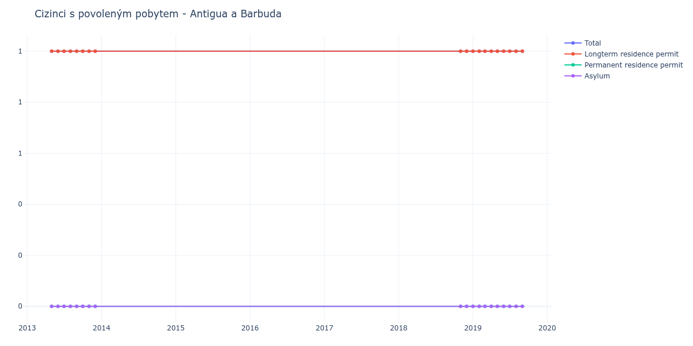

# Antigua a Barbuda

## Souhrnné statistiky (Min/Max pro rok) / Summary Statistics (Min/Max per year)

| Year   | Total   | Longterm Residence Permit   | Permanent Residence Permit   | Asylum   |
|--------|---------|-----------------------------|------------------------------|----------|
| 2013   | 1 / 1   | 1 / 1                       | 0 / 0                        | 0 / 0    |
| 2018   | 1 / 1   | 1 / 1                       | 0 / 0                        | 0 / 0    |
| 2019   | 1 / 1   | 1 / 1                       | 0 / 0                        | 0 / 0    |

## Detailní tabulka / Detailed Data Table

| Date     | Total      | Longterm Residence Permit   | Permanent Residence Permit   | Asylum   |
|----------|------------|-----------------------------|------------------------------|----------|
| **2013** |            |                             |                              |          |
| 05.2013  | 1          | 1                           | 0                            | 0        |
| 06.2013  | 1 (+0.00%) | 1 (+0.00%)                  | 0                            | 0        |
| 07.2013  | 1 (+0.00%) | 1 (+0.00%)                  | 0                            | 0        |
| 08.2013  | 1 (+0.00%) | 1 (+0.00%)                  | 0                            | 0        |
| 09.2013  | 1 (+0.00%) | 1 (+0.00%)                  | 0                            | 0        |
| 10.2013  | 1 (+0.00%) | 1 (+0.00%)                  | 0                            | 0        |
| 11.2013  | 1 (+0.00%) | 1 (+0.00%)                  | 0                            | 0        |
| 12.2013  | 1 (+0.00%) | 1 (+0.00%)                  | 0                            | 0        |
| **2018** |            |                             |                              |          |
| 11.2018  | 1 (+0.00%) | 1 (+0.00%)                  | 0                            | 0        |
| 12.2018  | 1 (+0.00%) | 1 (+0.00%)                  | 0                            | 0        |
| **2019** |            |                             |                              |          |
| 01.2019  | 1 (+0.00%) | 1 (+0.00%)                  | 0                            | 0        |
| 02.2019  | 1 (+0.00%) | 1 (+0.00%)                  | 0                            | 0        |
| 03.2019  | 1 (+0.00%) | 1 (+0.00%)                  | 0                            | 0        |
| 04.2019  | 1 (+0.00%) | 1 (+0.00%)                  | 0                            | 0        |
| 05.2019  | 1 (+0.00%) | 1 (+0.00%)                  | 0                            | 0        |
| 06.2019  | 1 (+0.00%) | 1 (+0.00%)                  | 0                            | 0        |
| 07.2019  | 1 (+0.00%) | 1 (+0.00%)                  | 0                            | 0        |
| 08.2019  | 1 (+0.00%) | 1 (+0.00%)                  | 0                            | 0        |
| 09.2019  | 1 (+0.00%) | 1 (+0.00%)                  | 0                            | 0        |
