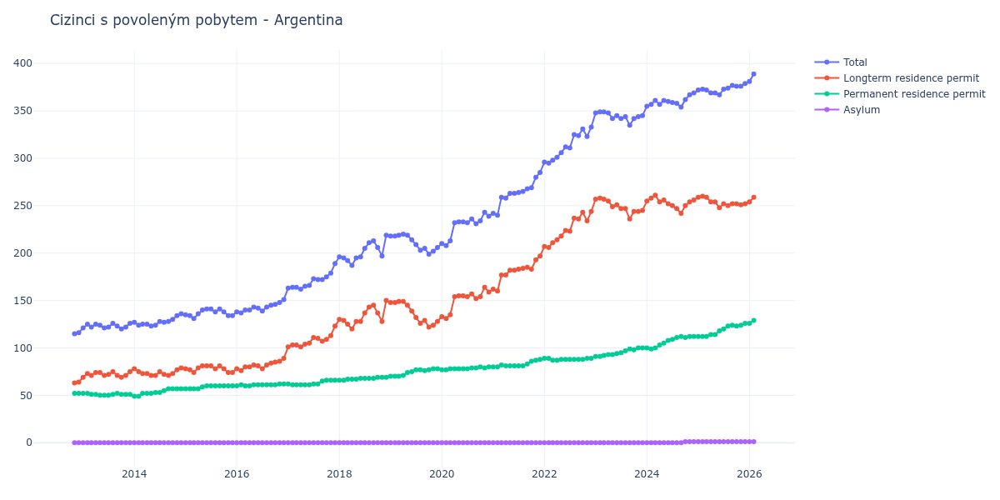

# Argentina

## Souhrnné statistiky (Min/Max pro rok) / Summary Statistics (Min/Max per year)

| Year   | Total     | Longterm Residence Permit   | Permanent Residence Permit   | Asylum   |
|--------|-----------|-----------------------------|------------------------------|----------|
| 2012   | 115 / 116 | 63 / 64                     | 52 / 52                      | 0 / 0    |
| 2013   | 120 / 126 | 69 / 75                     | 50 / 52                      | 0 / 0    |
| 2014   | 123 / 136 | 71 / 79                     | 49 / 57                      | 0 / 0    |
| 2015   | 131 / 141 | 74 / 81                     | 57 / 60                      | 0 / 0    |
| 2016   | 137 / 151 | 76 / 89                     | 60 / 62                      | 0 / 0    |
| 2017   | 162 / 189 | 101 / 123                   | 61 / 66                      | 0 / 0    |
| 2018   | 187 / 219 | 120 / 150                   | 66 / 69                      | 0 / 0    |
| 2019   | 199 / 220 | 122 / 149                   | 70 / 78                      | 0 / 0    |
| 2020   | 208 / 243 | 131 / 164                   | 77 / 80                      | 0 / 0    |
| 2021   | 240 / 285 | 160 / 197                   | 80 / 88                      | 0 / 0    |
| 2022   | 295 / 333 | 206 / 244                   | 87 / 89                      | 0 / 0    |
| 2023   | 335 / 349 | 236 / 258                   | 91 / 100                     | 0 / 0    |
| 2024   | 354 / 369 | 242 / 261                   | 99 / 112                     | 0 / 1    |
| 2025   | 367 / 379 | 248 / 260                   | 112 / 126                    | 1 / 1    |

## Detailní tabulka / Detailed Data Table

| Date     | Total         | Longterm Residence Permit   | Permanent Residence Permit   | Asylum     |
|----------|---------------|-----------------------------|------------------------------|------------|
| **2012** |               |                             |                              |            |
| 11.2012  | 115           | 63                          | 52                           | 0          |
| 12.2012  | 116 (+0.87%)  | 64 (+1.59%)                 | 52 (+0.00%)                  | 0          |
| **2013** |               |                             |                              |            |
| 01.2013  | 121 (+4.31%)  | 69 (+7.81%)                 | 52 (+0.00%)                  | 0          |
| 02.2013  | 125 (+3.31%)  | 73 (+5.80%)                 | 52 (+0.00%)                  | 0          |
| 03.2013  | 122 (-2.40%)  | 71 (-2.74%)                 | 51 (-1.92%)                  | 0          |
| 04.2013  | 125 (+2.46%)  | 74 (+4.23%)                 | 51 (+0.00%)                  | 0          |
| 05.2013  | 124 (-0.80%)  | 74 (+0.00%)                 | 50 (-1.96%)                  | 0          |
| 06.2013  | 121 (-2.42%)  | 71 (-4.05%)                 | 50 (+0.00%)                  | 0          |
| 07.2013  | 122 (+0.83%)  | 72 (+1.41%)                 | 50 (+0.00%)                  | 0          |
| 08.2013  | 126 (+3.28%)  | 75 (+4.17%)                 | 51 (+2.00%)                  | 0          |
| 09.2013  | 123 (-2.38%)  | 71 (-5.33%)                 | 52 (+1.96%)                  | 0          |
| 10.2013  | 120 (-2.44%)  | 69 (-2.82%)                 | 51 (-1.92%)                  | 0          |
| 11.2013  | 122 (+1.67%)  | 71 (+2.90%)                 | 51 (+0.00%)                  | 0          |
| 12.2013  | 126 (+3.28%)  | 75 (+5.63%)                 | 51 (+0.00%)                  | 0          |
| **2014** |               |                             |                              |            |
| 01.2014  | 127 (+0.79%)  | 78 (+4.00%)                 | 49 (-3.92%)                  | 0          |
| 02.2014  | 124 (-2.36%)  | 75 (-3.85%)                 | 49 (+0.00%)                  | 0          |
| 03.2014  | 125 (+0.81%)  | 73 (-2.67%)                 | 52 (+6.12%)                  | 0          |
| 04.2014  | 125 (+0.00%)  | 73 (+0.00%)                 | 52 (+0.00%)                  | 0          |
| 05.2014  | 123 (-1.60%)  | 71 (-2.74%)                 | 52 (+0.00%)                  | 0          |
| 06.2014  | 124 (+0.81%)  | 71 (+0.00%)                 | 53 (+1.92%)                  | 0          |
| 07.2014  | 128 (+3.23%)  | 75 (+5.63%)                 | 53 (+0.00%)                  | 0          |
| 08.2014  | 127 (-0.78%)  | 72 (-4.00%)                 | 55 (+3.77%)                  | 0          |
| 09.2014  | 128 (+0.79%)  | 71 (-1.39%)                 | 57 (+3.64%)                  | 0          |
| 10.2014  | 130 (+1.56%)  | 73 (+2.82%)                 | 57 (+0.00%)                  | 0          |
| 11.2014  | 134 (+3.08%)  | 77 (+5.48%)                 | 57 (+0.00%)                  | 0          |
| 12.2014  | 136 (+1.49%)  | 79 (+2.60%)                 | 57 (+0.00%)                  | 0          |
| **2015** |               |                             |                              |            |
| 01.2015  | 135 (-0.74%)  | 78 (-1.27%)                 | 57 (+0.00%)                  | 0          |
| 02.2015  | 134 (-0.74%)  | 77 (-1.28%)                 | 57 (+0.00%)                  | 0          |
| 03.2015  | 131 (-2.24%)  | 74 (-3.90%)                 | 57 (+0.00%)                  | 0          |
| 04.2015  | 136 (+3.82%)  | 79 (+6.76%)                 | 57 (+0.00%)                  | 0          |
| 05.2015  | 140 (+2.94%)  | 81 (+2.53%)                 | 59 (+3.51%)                  | 0          |
| 06.2015  | 141 (+0.71%)  | 81 (+0.00%)                 | 60 (+1.69%)                  | 0          |
| 07.2015  | 141 (+0.00%)  | 81 (+0.00%)                 | 60 (+0.00%)                  | 0          |
| 08.2015  | 138 (-2.13%)  | 78 (-3.70%)                 | 60 (+0.00%)                  | 0          |
| 09.2015  | 141 (+2.17%)  | 81 (+3.85%)                 | 60 (+0.00%)                  | 0          |
| 10.2015  | 138 (-2.13%)  | 78 (-3.70%)                 | 60 (+0.00%)                  | 0          |
| 11.2015  | 134 (-2.90%)  | 74 (-5.13%)                 | 60 (+0.00%)                  | 0          |
| 12.2015  | 134 (+0.00%)  | 74 (+0.00%)                 | 60 (+0.00%)                  | 0          |
| **2016** |               |                             |                              |            |
| 01.2016  | 138 (+2.99%)  | 78 (+5.41%)                 | 60 (+0.00%)                  | 0          |
| 02.2016  | 137 (-0.72%)  | 76 (-2.56%)                 | 61 (+1.67%)                  | 0          |
| 03.2016  | 140 (+2.19%)  | 80 (+5.26%)                 | 60 (-1.64%)                  | 0          |
| 04.2016  | 140 (+0.00%)  | 80 (+0.00%)                 | 60 (+0.00%)                  | 0          |
| 05.2016  | 143 (+2.14%)  | 82 (+2.50%)                 | 61 (+1.67%)                  | 0          |
| 06.2016  | 142 (-0.70%)  | 81 (-1.22%)                 | 61 (+0.00%)                  | 0          |
| 07.2016  | 139 (-2.11%)  | 78 (-3.70%)                 | 61 (+0.00%)                  | 0          |
| 08.2016  | 143 (+2.88%)  | 82 (+5.13%)                 | 61 (+0.00%)                  | 0          |
| 09.2016  | 145 (+1.40%)  | 84 (+2.44%)                 | 61 (+0.00%)                  | 0          |
| 10.2016  | 146 (+0.69%)  | 85 (+1.19%)                 | 61 (+0.00%)                  | 0          |
| 11.2016  | 148 (+1.37%)  | 86 (+1.18%)                 | 62 (+1.64%)                  | 0          |
| 12.2016  | 151 (+2.03%)  | 89 (+3.49%)                 | 62 (+0.00%)                  | 0          |
| **2017** |               |                             |                              |            |
| 01.2017  | 163 (+7.95%)  | 101 (+13.48%)               | 62 (+0.00%)                  | 0          |
| 02.2017  | 164 (+0.61%)  | 103 (+1.98%)                | 61 (-1.61%)                  | 0          |
| 03.2017  | 164 (+0.00%)  | 103 (+0.00%)                | 61 (+0.00%)                  | 0          |
| 04.2017  | 162 (-1.22%)  | 101 (-1.94%)                | 61 (+0.00%)                  | 0          |
| 05.2017  | 165 (+1.85%)  | 104 (+2.97%)                | 61 (+0.00%)                  | 0          |
| 06.2017  | 166 (+0.61%)  | 105 (+0.96%)                | 61 (+0.00%)                  | 0          |
| 07.2017  | 173 (+4.22%)  | 111 (+5.71%)                | 62 (+1.64%)                  | 0          |
| 08.2017  | 172 (-0.58%)  | 110 (-0.90%)                | 62 (+0.00%)                  | 0          |
| 09.2017  | 172 (+0.00%)  | 107 (-2.73%)                | 65 (+4.84%)                  | 0          |
| 10.2017  | 175 (+1.74%)  | 109 (+1.87%)                | 66 (+1.54%)                  | 0          |
| 11.2017  | 179 (+2.29%)  | 113 (+3.67%)                | 66 (+0.00%)                  | 0          |
| 12.2017  | 189 (+5.59%)  | 123 (+8.85%)                | 66 (+0.00%)                  | 0          |
| **2018** |               |                             |                              |            |
| 01.2018  | 196 (+3.70%)  | 130 (+5.69%)                | 66 (+0.00%)                  | 0          |
| 02.2018  | 195 (-0.51%)  | 129 (-0.77%)                | 66 (+0.00%)                  | 0          |
| 03.2018  | 192 (-1.54%)  | 125 (-3.10%)                | 67 (+1.52%)                  | 0          |
| 04.2018  | 187 (-2.60%)  | 120 (-4.00%)                | 67 (+0.00%)                  | 0          |
| 05.2018  | 195 (+4.28%)  | 128 (+6.67%)                | 67 (+0.00%)                  | 0          |
| 06.2018  | 196 (+0.51%)  | 128 (+0.00%)                | 68 (+1.49%)                  | 0          |
| 07.2018  | 205 (+4.59%)  | 137 (+7.03%)                | 68 (+0.00%)                  | 0          |
| 08.2018  | 211 (+2.93%)  | 143 (+4.38%)                | 68 (+0.00%)                  | 0          |
| 09.2018  | 213 (+0.95%)  | 145 (+1.40%)                | 68 (+0.00%)                  | 0          |
| 10.2018  | 206 (-3.29%)  | 137 (-5.52%)                | 69 (+1.47%)                  | 0          |
| 11.2018  | 197 (-4.37%)  | 128 (-6.57%)                | 69 (+0.00%)                  | 0          |
| 12.2018  | 219 (+11.17%) | 150 (+17.19%)               | 69 (+0.00%)                  | 0          |
| **2019** |               |                             |                              |            |
| 01.2019  | 218 (-0.46%)  | 148 (-1.33%)                | 70 (+1.45%)                  | 0          |
| 02.2019  | 218 (+0.00%)  | 148 (+0.00%)                | 70 (+0.00%)                  | 0          |
| 03.2019  | 219 (+0.46%)  | 149 (+0.68%)                | 70 (+0.00%)                  | 0          |
| 04.2019  | 220 (+0.46%)  | 149 (+0.00%)                | 71 (+1.43%)                  | 0          |
| 05.2019  | 219 (-0.45%)  | 145 (-2.68%)                | 74 (+4.23%)                  | 0          |
| 06.2019  | 214 (-2.28%)  | 139 (-4.14%)                | 75 (+1.35%)                  | 0          |
| 07.2019  | 209 (-2.34%)  | 132 (-5.04%)                | 77 (+2.67%)                  | 0          |
| 08.2019  | 203 (-2.87%)  | 126 (-4.55%)                | 77 (+0.00%)                  | 0          |
| 09.2019  | 205 (+0.99%)  | 129 (+2.38%)                | 76 (-1.30%)                  | 0          |
| 10.2019  | 199 (-2.93%)  | 122 (-5.43%)                | 77 (+1.32%)                  | 0          |
| 11.2019  | 202 (+1.51%)  | 124 (+1.64%)                | 78 (+1.30%)                  | 0          |
| 12.2019  | 206 (+1.98%)  | 128 (+3.23%)                | 78 (+0.00%)                  | 0          |
| **2020** |               |                             |                              |            |
| 01.2020  | 210 (+1.94%)  | 133 (+3.91%)                | 77 (-1.28%)                  | 0          |
| 02.2020  | 208 (-0.95%)  | 131 (-1.50%)                | 77 (+0.00%)                  | 0          |
| 03.2020  | 213 (+2.40%)  | 135 (+3.05%)                | 78 (+1.30%)                  | 0          |
| 04.2020  | 232 (+8.92%)  | 154 (+14.07%)               | 78 (+0.00%)                  | 0          |
| 05.2020  | 233 (+0.43%)  | 155 (+0.65%)                | 78 (+0.00%)                  | 0          |
| 06.2020  | 233 (+0.00%)  | 155 (+0.00%)                | 78 (+0.00%)                  | 0          |
| 07.2020  | 232 (-0.43%)  | 154 (-0.65%)                | 78 (+0.00%)                  | 0          |
| 08.2020  | 236 (+1.72%)  | 157 (+1.95%)                | 79 (+1.28%)                  | 0          |
| 09.2020  | 231 (-2.12%)  | 152 (-3.18%)                | 79 (+0.00%)                  | 0          |
| 10.2020  | 234 (+1.30%)  | 154 (+1.32%)                | 80 (+1.27%)                  | 0          |
| 11.2020  | 243 (+3.85%)  | 164 (+6.49%)                | 79 (-1.25%)                  | 0          |
| 12.2020  | 239 (-1.65%)  | 159 (-3.05%)                | 80 (+1.27%)                  | 0          |
| **2021** |               |                             |                              |            |
| 01.2021  | 242 (+1.26%)  | 162 (+1.89%)                | 80 (+0.00%)                  | 0          |
| 02.2021  | 240 (-0.83%)  | 160 (-1.23%)                | 80 (+0.00%)                  | 0          |
| 03.2021  | 259 (+7.92%)  | 177 (+10.62%)               | 82 (+2.50%)                  | 0          |
| 04.2021  | 258 (-0.39%)  | 177 (+0.00%)                | 81 (-1.22%)                  | 0          |
| 05.2021  | 263 (+1.94%)  | 182 (+2.82%)                | 81 (+0.00%)                  | 0          |
| 06.2021  | 263 (+0.00%)  | 182 (+0.00%)                | 81 (+0.00%)                  | 0          |
| 07.2021  | 264 (+0.38%)  | 183 (+0.55%)                | 81 (+0.00%)                  | 0          |
| 08.2021  | 265 (+0.38%)  | 184 (+0.55%)                | 81 (+0.00%)                  | 0          |
| 09.2021  | 268 (+1.13%)  | 185 (+0.54%)                | 83 (+2.47%)                  | 0          |
| 10.2021  | 269 (+0.37%)  | 183 (-1.08%)                | 86 (+3.61%)                  | 0          |
| 11.2021  | 280 (+4.09%)  | 193 (+5.46%)                | 87 (+1.16%)                  | 0          |
| 12.2021  | 285 (+1.79%)  | 197 (+2.07%)                | 88 (+1.15%)                  | 0          |
| **2022** |               |                             |                              |            |
| 01.2022  | 296 (+3.86%)  | 207 (+5.08%)                | 89 (+1.14%)                  | 0          |
| 02.2022  | 295 (-0.34%)  | 206 (-0.48%)                | 89 (+0.00%)                  | 0          |
| 03.2022  | 298 (+1.02%)  | 211 (+2.43%)                | 87 (-2.25%)                  | 0          |
| 04.2022  | 301 (+1.01%)  | 214 (+1.42%)                | 87 (+0.00%)                  | 0          |
| 05.2022  | 306 (+1.66%)  | 218 (+1.87%)                | 88 (+1.15%)                  | 0          |
| 06.2022  | 312 (+1.96%)  | 224 (+2.75%)                | 88 (+0.00%)                  | 0          |
| 07.2022  | 311 (-0.32%)  | 223 (-0.45%)                | 88 (+0.00%)                  | 0          |
| 08.2022  | 325 (+4.50%)  | 237 (+6.28%)                | 88 (+0.00%)                  | 0          |
| 09.2022  | 324 (-0.31%)  | 236 (-0.42%)                | 88 (+0.00%)                  | 0          |
| 10.2022  | 331 (+2.16%)  | 243 (+2.97%)                | 88 (+0.00%)                  | 0          |
| 11.2022  | 323 (-2.42%)  | 234 (-3.70%)                | 89 (+1.14%)                  | 0          |
| 12.2022  | 333 (+3.10%)  | 244 (+4.27%)                | 89 (+0.00%)                  | 0          |
| **2023** |               |                             |                              |            |
| 01.2023  | 348 (+4.50%)  | 257 (+5.33%)                | 91 (+2.25%)                  | 0          |
| 02.2023  | 349 (+0.29%)  | 258 (+0.39%)                | 91 (+0.00%)                  | 0          |
| 03.2023  | 349 (+0.00%)  | 257 (-0.39%)                | 92 (+1.10%)                  | 0          |
| 04.2023  | 348 (-0.29%)  | 255 (-0.78%)                | 93 (+1.09%)                  | 0          |
| 05.2023  | 342 (-1.72%)  | 249 (-2.35%)                | 93 (+0.00%)                  | 0          |
| 06.2023  | 345 (+0.88%)  | 251 (+0.80%)                | 94 (+1.08%)                  | 0          |
| 07.2023  | 342 (-0.87%)  | 247 (-1.59%)                | 95 (+1.06%)                  | 0          |
| 08.2023  | 344 (+0.58%)  | 247 (+0.00%)                | 97 (+2.11%)                  | 0          |
| 09.2023  | 335 (-2.62%)  | 236 (-4.45%)                | 99 (+2.06%)                  | 0          |
| 10.2023  | 342 (+2.09%)  | 244 (+3.39%)                | 98 (-1.01%)                  | 0          |
| 11.2023  | 344 (+0.58%)  | 244 (+0.00%)                | 100 (+2.04%)                 | 0          |
| 12.2023  | 345 (+0.29%)  | 245 (+0.41%)                | 100 (+0.00%)                 | 0          |
| **2024** |               |                             |                              |            |
| 01.2024  | 355 (+2.90%)  | 255 (+4.08%)                | 100 (+0.00%)                 | 0          |
| 02.2024  | 357 (+0.56%)  | 258 (+1.18%)                | 99 (-1.00%)                  | 0          |
| 03.2024  | 361 (+1.12%)  | 261 (+1.16%)                | 100 (+1.01%)                 | 0          |
| 04.2024  | 357 (-1.11%)  | 254 (-2.68%)                | 103 (+3.00%)                 | 0          |
| 05.2024  | 361 (+1.12%)  | 256 (+0.79%)                | 105 (+1.94%)                 | 0          |
| 06.2024  | 360 (-0.28%)  | 252 (-1.56%)                | 108 (+2.86%)                 | 0          |
| 07.2024  | 359 (-0.28%)  | 250 (-0.79%)                | 109 (+0.93%)                 | 0          |
| 08.2024  | 358 (-0.28%)  | 247 (-1.20%)                | 111 (+1.83%)                 | 0          |
| 09.2024  | 354 (-1.12%)  | 242 (-2.02%)                | 112 (+0.90%)                 | 0          |
| 10.2024  | 362 (+2.26%)  | 250 (+3.31%)                | 111 (-0.89%)                 | 1          |
| 11.2024  | 367 (+1.38%)  | 254 (+1.60%)                | 112 (+0.90%)                 | 1 (+0.00%) |
| 12.2024  | 369 (+0.54%)  | 256 (+0.79%)                | 112 (+0.00%)                 | 1 (+0.00%) |
| **2025** |               |                             |                              |            |
| 01.2025  | 372 (+0.81%)  | 259 (+1.17%)                | 112 (+0.00%)                 | 1 (+0.00%) |
| 02.2025  | 373 (+0.27%)  | 260 (+0.39%)                | 112 (+0.00%)                 | 1 (+0.00%) |
| 03.2025  | 372 (-0.27%)  | 259 (-0.38%)                | 112 (+0.00%)                 | 1 (+0.00%) |
| 04.2025  | 369 (-0.81%)  | 254 (-1.93%)                | 114 (+1.79%)                 | 1 (+0.00%) |
| 05.2025  | 369 (+0.00%)  | 254 (+0.00%)                | 114 (+0.00%)                 | 1 (+0.00%) |
| 06.2025  | 367 (-0.54%)  | 248 (-2.36%)                | 118 (+3.51%)                 | 1 (+0.00%) |
| 07.2025  | 373 (+1.63%)  | 252 (+1.61%)                | 120 (+1.69%)                 | 1 (+0.00%) |
| 08.2025  | 374 (+0.27%)  | 250 (-0.79%)                | 123 (+2.50%)                 | 1 (+0.00%) |
| 09.2025  | 377 (+0.80%)  | 252 (+0.80%)                | 124 (+0.81%)                 | 1 (+0.00%) |
| 10.2025  | 376 (-0.27%)  | 252 (+0.00%)                | 123 (-0.81%)                 | 1 (+0.00%) |
| 11.2025  | 376 (+0.00%)  | 251 (-0.40%)                | 124 (+0.81%)                 | 1 (+0.00%) |
| 12.2025  | 379 (+0.80%)  | 252 (+0.40%)                | 126 (+1.61%)                 | 1 (+0.00%) |
