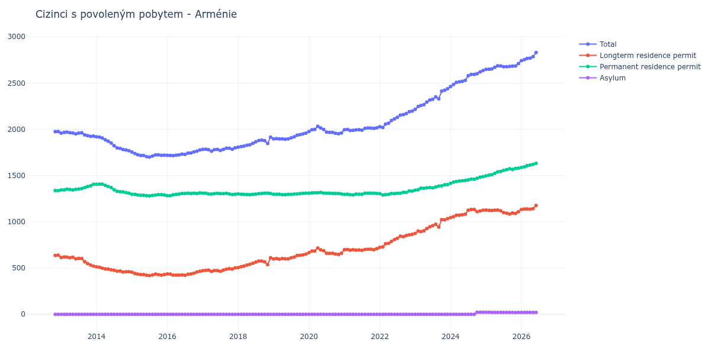

# Arménie

## Souhrnné statistiky (Min/Max pro rok) / Summary Statistics (Min/Max per year)

| Year   | Total         | Longterm Residence Permit   | Permanent Residence Permit   | Asylum   |
|--------|---------------|-----------------------------|------------------------------|----------|
| 2012   | 1 974 / 1 976 | 636 / 640                   | 1 336 / 1 338                | 0 / 0    |
| 2013   | 1 923 / 1 970 | 521 / 621                   | 1 344 / 1 405                | 0 / 0    |
| 2014   | 1 769 / 1 918 | 457 / 513                   | 1 309 / 1 407                | 0 / 0    |
| 2015   | 1 699 / 1 754 | 419 / 455                   | 1 280 / 1 299                | 0 / 0    |
| 2016   | 1 715 / 1 777 | 422 / 465                   | 1 282 / 1 312                | 0 / 0    |
| 2017   | 1 763 / 1 801 | 463 / 502                   | 1 295 / 1 310                | 0 / 0    |
| 2018   | 1 807 / 1 916 | 506 / 610                   | 1 293 / 1 309                | 0 / 0    |
| 2019   | 1 893 / 1 959 | 597 / 650                   | 1 293 / 1 309                | 0 / 0    |
| 2020   | 1 953 / 2 032 | 647 / 717                   | 1 301 / 1 318                | 0 / 0    |
| 2021   | 1 987 / 2 016 | 692 / 710                   | 1 291 / 1 310                | 0 / 0    |
| 2022   | 2 020 / 2 197 | 724 / 865                   | 1 291 / 1 333                | 0 / 0    |
| 2023   | 2 216 / 2 438 | 875 / 1 035                 | 1 341 / 1 403                | 0 / 0    |
| 2024   | 2 462 / 2 635 | 1 046 / 1 134               | 1 416 / 1 488                | 0 / 22   |
| 2025   | 2 647 / 2 710 | 1 084 / 1 128               | 1 497 / 1 580                | 19 / 22  |
| 2026   | 2 742 / 2 830 | 1 134 / 1 176               | 1 588 / 1 633                | 20 / 21  |

## Detailní tabulka / Detailed Data Table

| Date     | Total          | Longterm Residence Permit   | Permanent Residence Permit   | Asylum      |
|----------|----------------|-----------------------------|------------------------------|-------------|
| **2012** |                |                             |                              |             |
| 11.2012  | 1 974          | 636                         | 1 338                        | 0           |
| 12.2012  | 1 976 (+0.10%) | 640 (+0.63%)                | 1 336 (-0.15%)               | 0           |
| **2013** |                |                             |                              |             |
| 01.2013  | 1 958 (-0.91%) | 614 (-4.06%)                | 1 344 (+0.60%)               | 0           |
| 02.2013  | 1 966 (+0.41%) | 621 (+1.14%)                | 1 345 (+0.07%)               | 0           |
| 03.2013  | 1 970 (+0.20%) | 618 (-0.48%)                | 1 352 (+0.52%)               | 0           |
| 04.2013  | 1 963 (-0.36%) | 613 (-0.81%)                | 1 350 (-0.15%)               | 0           |
| 05.2013  | 1 961 (-0.10%) | 617 (+0.65%)                | 1 344 (-0.44%)               | 0           |
| 06.2013  | 1 950 (-0.56%) | 599 (-2.92%)                | 1 351 (+0.52%)               | 0           |
| 07.2013  | 1 959 (+0.46%) | 605 (+1.00%)                | 1 354 (+0.22%)               | 0           |
| 08.2013  | 1 962 (+0.15%) | 603 (-0.33%)                | 1 359 (+0.37%)               | 0           |
| 09.2013  | 1 939 (-1.17%) | 569 (-5.64%)                | 1 370 (+0.81%)               | 0           |
| 10.2013  | 1 931 (-0.41%) | 549 (-3.51%)                | 1 382 (+0.88%)               | 0           |
| 11.2013  | 1 923 (-0.41%) | 533 (-2.91%)                | 1 390 (+0.58%)               | 0           |
| 12.2013  | 1 926 (+0.16%) | 521 (-2.25%)                | 1 405 (+1.08%)               | 0           |
| **2014** |                |                             |                              |             |
| 01.2014  | 1 918 (-0.42%) | 513 (-1.54%)                | 1 405 (+0.00%)               | 0           |
| 02.2014  | 1 916 (-0.10%) | 509 (-0.78%)                | 1 407 (+0.14%)               | 0           |
| 03.2014  | 1 906 (-0.52%) | 499 (-1.96%)                | 1 407 (+0.00%)               | 0           |
| 04.2014  | 1 886 (-1.05%) | 491 (-1.60%)                | 1 395 (-0.85%)               | 0           |
| 05.2014  | 1 870 (-0.85%) | 489 (-0.41%)                | 1 381 (-1.00%)               | 0           |
| 06.2014  | 1 851 (-1.02%) | 481 (-1.64%)                | 1 370 (-0.80%)               | 0           |
| 07.2014  | 1 822 (-1.57%) | 476 (-1.04%)                | 1 346 (-1.75%)               | 0           |
| 08.2014  | 1 798 (-1.32%) | 467 (-1.89%)                | 1 331 (-1.11%)               | 0           |
| 09.2014  | 1 794 (-0.22%) | 468 (+0.21%)                | 1 326 (-0.38%)               | 0           |
| 10.2014  | 1 781 (-0.72%) | 457 (-2.35%)                | 1 324 (-0.15%)               | 0           |
| 11.2014  | 1 777 (-0.22%) | 461 (+0.88%)                | 1 316 (-0.60%)               | 0           |
| 12.2014  | 1 769 (-0.45%) | 460 (-0.22%)                | 1 309 (-0.53%)               | 0           |
| **2015** |                |                             |                              |             |
| 01.2015  | 1 754 (-0.85%) | 455 (-1.09%)                | 1 299 (-0.76%)               | 0           |
| 02.2015  | 1 738 (-0.91%) | 441 (-3.08%)                | 1 297 (-0.15%)               | 0           |
| 03.2015  | 1 725 (-0.75%) | 435 (-1.36%)                | 1 290 (-0.54%)               | 0           |
| 04.2015  | 1 717 (-0.46%) | 430 (-1.15%)                | 1 287 (-0.23%)               | 0           |
| 05.2015  | 1 717 (+0.00%) | 430 (+0.00%)                | 1 287 (+0.00%)               | 0           |
| 06.2015  | 1 704 (-0.76%) | 422 (-1.86%)                | 1 282 (-0.39%)               | 0           |
| 07.2015  | 1 699 (-0.29%) | 419 (-0.71%)                | 1 280 (-0.16%)               | 0           |
| 08.2015  | 1 711 (+0.71%) | 425 (+1.43%)                | 1 286 (+0.47%)               | 0           |
| 09.2015  | 1 723 (+0.70%) | 435 (+2.35%)                | 1 288 (+0.16%)               | 0           |
| 10.2015  | 1 723 (+0.00%) | 429 (-1.38%)                | 1 294 (+0.47%)               | 0           |
| 11.2015  | 1 718 (-0.29%) | 424 (-1.17%)                | 1 294 (+0.00%)               | 0           |
| 12.2015  | 1 720 (+0.12%) | 430 (+1.42%)                | 1 290 (-0.31%)               | 0           |
| **2016** |                |                             |                              |             |
| 01.2016  | 1 719 (-0.06%) | 436 (+1.40%)                | 1 283 (-0.54%)               | 0           |
| 02.2016  | 1 717 (-0.12%) | 435 (-0.23%)                | 1 282 (-0.08%)               | 0           |
| 03.2016  | 1 715 (-0.12%) | 423 (-2.76%)                | 1 292 (+0.78%)               | 0           |
| 04.2016  | 1 720 (+0.29%) | 423 (+0.00%)                | 1 297 (+0.39%)               | 0           |
| 05.2016  | 1 724 (+0.23%) | 424 (+0.24%)                | 1 300 (+0.23%)               | 0           |
| 06.2016  | 1 731 (+0.41%) | 425 (+0.24%)                | 1 306 (+0.46%)               | 0           |
| 07.2016  | 1 729 (-0.12%) | 422 (-0.71%)                | 1 307 (+0.08%)               | 0           |
| 08.2016  | 1 743 (+0.81%) | 433 (+2.61%)                | 1 310 (+0.23%)               | 0           |
| 09.2016  | 1 744 (+0.06%) | 437 (+0.92%)                | 1 307 (-0.23%)               | 0           |
| 10.2016  | 1 755 (+0.63%) | 445 (+1.83%)                | 1 310 (+0.23%)               | 0           |
| 11.2016  | 1 763 (+0.46%) | 457 (+2.70%)                | 1 306 (-0.31%)               | 0           |
| 12.2016  | 1 777 (+0.79%) | 465 (+1.75%)                | 1 312 (+0.46%)               | 0           |
| **2017** |                |                             |                              |             |
| 01.2017  | 1 782 (+0.28%) | 472 (+1.51%)                | 1 310 (-0.15%)               | 0           |
| 02.2017  | 1 784 (+0.11%) | 475 (+0.64%)                | 1 309 (-0.08%)               | 0           |
| 03.2017  | 1 780 (-0.22%) | 478 (+0.63%)                | 1 302 (-0.53%)               | 0           |
| 04.2017  | 1 763 (-0.96%) | 463 (-3.14%)                | 1 300 (-0.15%)               | 0           |
| 05.2017  | 1 779 (+0.91%) | 474 (+2.38%)                | 1 305 (+0.38%)               | 0           |
| 06.2017  | 1 782 (+0.17%) | 474 (+0.00%)                | 1 308 (+0.23%)               | 0           |
| 07.2017  | 1 771 (-0.62%) | 466 (-1.69%)                | 1 305 (-0.23%)               | 0           |
| 08.2017  | 1 782 (+0.62%) | 478 (+2.58%)                | 1 304 (-0.08%)               | 0           |
| 09.2017  | 1 795 (+0.73%) | 487 (+1.88%)                | 1 308 (+0.31%)               | 0           |
| 10.2017  | 1 796 (+0.06%) | 494 (+1.44%)                | 1 302 (-0.46%)               | 0           |
| 11.2017  | 1 784 (-0.67%) | 489 (-1.01%)                | 1 295 (-0.54%)               | 0           |
| 12.2017  | 1 801 (+0.95%) | 502 (+2.66%)                | 1 299 (+0.31%)               | 0           |
| **2018** |                |                             |                              |             |
| 01.2018  | 1 807 (+0.33%) | 506 (+0.80%)                | 1 301 (+0.15%)               | 0           |
| 02.2018  | 1 813 (+0.33%) | 515 (+1.78%)                | 1 298 (-0.23%)               | 0           |
| 03.2018  | 1 818 (+0.28%) | 521 (+1.17%)                | 1 297 (-0.08%)               | 0           |
| 04.2018  | 1 827 (+0.50%) | 532 (+2.11%)                | 1 295 (-0.15%)               | 0           |
| 05.2018  | 1 833 (+0.33%) | 540 (+1.50%)                | 1 293 (-0.15%)               | 0           |
| 06.2018  | 1 848 (+0.82%) | 551 (+2.04%)                | 1 297 (+0.31%)               | 0           |
| 07.2018  | 1 864 (+0.87%) | 564 (+2.36%)                | 1 300 (+0.23%)               | 0           |
| 08.2018  | 1 879 (+0.80%) | 575 (+1.95%)                | 1 304 (+0.31%)               | 0           |
| 09.2018  | 1 883 (+0.21%) | 576 (+0.17%)                | 1 307 (+0.23%)               | 0           |
| 10.2018  | 1 877 (-0.32%) | 568 (-1.39%)                | 1 309 (+0.15%)               | 0           |
| 11.2018  | 1 846 (-1.65%) | 537 (-5.46%)                | 1 309 (+0.00%)               | 0           |
| 12.2018  | 1 916 (+3.79%) | 610 (+13.59%)               | 1 306 (-0.23%)               | 0           |
| **2019** |                |                             |                              |             |
| 01.2019  | 1 896 (-1.04%) | 598 (-1.97%)                | 1 298 (-0.61%)               | 0           |
| 02.2019  | 1 900 (+0.21%) | 602 (+0.67%)                | 1 298 (+0.00%)               | 0           |
| 03.2019  | 1 896 (-0.21%) | 597 (-0.83%)                | 1 299 (+0.08%)               | 0           |
| 04.2019  | 1 896 (+0.00%) | 603 (+1.01%)                | 1 293 (-0.46%)               | 0           |
| 05.2019  | 1 893 (-0.16%) | 600 (-0.50%)                | 1 293 (+0.00%)               | 0           |
| 06.2019  | 1 897 (+0.21%) | 600 (+0.00%)                | 1 297 (+0.31%)               | 0           |
| 07.2019  | 1 907 (+0.53%) | 610 (+1.67%)                | 1 297 (+0.00%)               | 0           |
| 08.2019  | 1 918 (+0.58%) | 618 (+1.31%)                | 1 300 (+0.23%)               | 0           |
| 09.2019  | 1 937 (+0.99%) | 636 (+2.91%)                | 1 301 (+0.08%)               | 0           |
| 10.2019  | 1 942 (+0.26%) | 638 (+0.31%)                | 1 304 (+0.23%)               | 0           |
| 11.2019  | 1 951 (+0.46%) | 643 (+0.78%)                | 1 308 (+0.31%)               | 0           |
| 12.2019  | 1 959 (+0.41%) | 650 (+1.09%)                | 1 309 (+0.08%)               | 0           |
| **2020** |                |                             |                              |             |
| 01.2020  | 1 976 (+0.87%) | 667 (+2.62%)                | 1 309 (+0.00%)               | 0           |
| 02.2020  | 1 996 (+1.01%) | 684 (+2.55%)                | 1 312 (+0.23%)               | 0           |
| 03.2020  | 1 999 (+0.15%) | 685 (+0.15%)                | 1 314 (+0.15%)               | 0           |
| 04.2020  | 2 032 (+1.65%) | 717 (+4.67%)                | 1 315 (+0.08%)               | 0           |
| 05.2020  | 2 015 (-0.84%) | 697 (-2.79%)                | 1 318 (+0.23%)               | 0           |
| 06.2020  | 1 999 (-0.79%) | 688 (-1.29%)                | 1 311 (-0.53%)               | 0           |
| 07.2020  | 1 970 (-1.45%) | 660 (-4.07%)                | 1 310 (-0.08%)               | 0           |
| 08.2020  | 1 967 (-0.15%) | 658 (-0.30%)                | 1 309 (-0.08%)               | 0           |
| 09.2020  | 1 967 (+0.00%) | 660 (+0.30%)                | 1 307 (-0.15%)               | 0           |
| 10.2020  | 1 957 (-0.51%) | 650 (-1.52%)                | 1 307 (+0.00%)               | 0           |
| 11.2020  | 1 953 (-0.20%) | 647 (-0.46%)                | 1 306 (-0.08%)               | 0           |
| 12.2020  | 1 961 (+0.41%) | 660 (+2.01%)                | 1 301 (-0.38%)               | 0           |
| **2021** |                |                             |                              |             |
| 01.2021  | 1 995 (+1.73%) | 699 (+5.91%)                | 1 296 (-0.38%)               | 0           |
| 02.2021  | 1 999 (+0.20%) | 700 (+0.14%)                | 1 299 (+0.23%)               | 0           |
| 03.2021  | 1 987 (-0.60%) | 694 (-0.86%)                | 1 293 (-0.46%)               | 0           |
| 04.2021  | 1 989 (+0.10%) | 698 (+0.58%)                | 1 291 (-0.15%)               | 0           |
| 05.2021  | 1 994 (+0.25%) | 694 (-0.57%)                | 1 300 (+0.70%)               | 0           |
| 06.2021  | 1 995 (+0.05%) | 696 (+0.29%)                | 1 299 (-0.08%)               | 0           |
| 07.2021  | 1 990 (-0.25%) | 692 (-0.57%)                | 1 298 (-0.08%)               | 0           |
| 08.2021  | 2 010 (+1.01%) | 700 (+1.16%)                | 1 310 (+0.92%)               | 0           |
| 09.2021  | 2 014 (+0.20%) | 704 (+0.57%)                | 1 310 (+0.00%)               | 0           |
| 10.2021  | 2 013 (-0.05%) | 703 (-0.14%)                | 1 310 (+0.00%)               | 0           |
| 11.2021  | 2 009 (-0.20%) | 699 (-0.57%)                | 1 310 (+0.00%)               | 0           |
| 12.2021  | 2 016 (+0.35%) | 710 (+1.57%)                | 1 306 (-0.31%)               | 0           |
| **2022** |                |                             |                              |             |
| 01.2022  | 2 028 (+0.60%) | 724 (+1.97%)                | 1 304 (-0.15%)               | 0           |
| 02.2022  | 2 020 (-0.39%) | 729 (+0.69%)                | 1 291 (-1.00%)               | 0           |
| 03.2022  | 2 056 (+1.78%) | 763 (+4.66%)                | 1 293 (+0.15%)               | 0           |
| 04.2022  | 2 065 (+0.44%) | 768 (+0.66%)                | 1 297 (+0.31%)               | 0           |
| 05.2022  | 2 095 (+1.45%) | 789 (+2.73%)                | 1 306 (+0.69%)               | 0           |
| 06.2022  | 2 112 (+0.81%) | 807 (+2.28%)                | 1 305 (-0.08%)               | 0           |
| 07.2022  | 2 130 (+0.85%) | 822 (+1.86%)                | 1 308 (+0.23%)               | 0           |
| 08.2022  | 2 154 (+1.13%) | 844 (+2.68%)                | 1 310 (+0.15%)               | 0           |
| 09.2022  | 2 158 (+0.19%) | 839 (-0.59%)                | 1 319 (+0.69%)               | 0           |
| 10.2022  | 2 170 (+0.56%) | 852 (+1.55%)                | 1 318 (-0.08%)               | 0           |
| 11.2022  | 2 191 (+0.97%) | 858 (+0.70%)                | 1 333 (+1.14%)               | 0           |
| 12.2022  | 2 197 (+0.27%) | 865 (+0.82%)                | 1 332 (-0.08%)               | 0           |
| **2023** |                |                             |                              |             |
| 01.2023  | 2 216 (+0.86%) | 875 (+1.16%)                | 1 341 (+0.68%)               | 0           |
| 02.2023  | 2 247 (+1.40%) | 900 (+2.86%)                | 1 347 (+0.45%)               | 0           |
| 03.2023  | 2 258 (+0.49%) | 894 (-0.67%)                | 1 364 (+1.26%)               | 0           |
| 04.2023  | 2 266 (+0.35%) | 904 (+1.12%)                | 1 362 (-0.15%)               | 0           |
| 05.2023  | 2 295 (+1.28%) | 928 (+2.65%)                | 1 367 (+0.37%)               | 0           |
| 06.2023  | 2 317 (+0.96%) | 947 (+2.05%)                | 1 370 (+0.22%)               | 0           |
| 07.2023  | 2 324 (+0.30%) | 957 (+1.06%)                | 1 367 (-0.22%)               | 0           |
| 08.2023  | 2 350 (+1.12%) | 974 (+1.78%)                | 1 376 (+0.66%)               | 0           |
| 09.2023  | 2 329 (-0.89%) | 943 (-3.18%)                | 1 386 (+0.73%)               | 0           |
| 10.2023  | 2 412 (+3.56%) | 1 023 (+8.48%)              | 1 389 (+0.22%)               | 0           |
| 11.2023  | 2 422 (+0.41%) | 1 021 (-0.20%)              | 1 401 (+0.86%)               | 0           |
| 12.2023  | 2 438 (+0.66%) | 1 035 (+1.37%)              | 1 403 (+0.14%)               | 0           |
| **2024** |                |                             |                              |             |
| 01.2024  | 2 462 (+0.98%) | 1 046 (+1.06%)              | 1 416 (+0.93%)               | 0           |
| 02.2024  | 2 484 (+0.89%) | 1 055 (+0.86%)              | 1 429 (+0.92%)               | 0           |
| 03.2024  | 2 507 (+0.93%) | 1 071 (+1.52%)              | 1 436 (+0.49%)               | 0           |
| 04.2024  | 2 513 (+0.24%) | 1 072 (+0.09%)              | 1 441 (+0.35%)               | 0           |
| 05.2024  | 2 519 (+0.24%) | 1 076 (+0.37%)              | 1 443 (+0.14%)               | 0           |
| 06.2024  | 2 530 (+0.44%) | 1 083 (+0.65%)              | 1 447 (+0.28%)               | 0           |
| 07.2024  | 2 579 (+1.94%) | 1 125 (+3.88%)              | 1 454 (+0.48%)               | 0           |
| 08.2024  | 2 594 (+0.58%) | 1 133 (+0.71%)              | 1 461 (+0.48%)               | 0           |
| 09.2024  | 2 594 (+0.00%) | 1 134 (+0.09%)              | 1 460 (-0.07%)               | 0           |
| 10.2024  | 2 602 (+0.31%) | 1 109 (-2.20%)              | 1 471 (+0.75%)               | 22          |
| 11.2024  | 2 621 (+0.73%) | 1 117 (+0.72%)              | 1 482 (+0.75%)               | 22 (+0.00%) |
| 12.2024  | 2 635 (+0.53%) | 1 125 (+0.72%)              | 1 488 (+0.40%)               | 22 (+0.00%) |
| **2025** |                |                             |                              |             |
| 01.2025  | 2 647 (+0.46%) | 1 128 (+0.27%)              | 1 497 (+0.60%)               | 22 (+0.00%) |
| 02.2025  | 2 650 (+0.11%) | 1 124 (-0.35%)              | 1 504 (+0.47%)               | 22 (+0.00%) |
| 03.2025  | 2 653 (+0.11%) | 1 122 (-0.18%)              | 1 510 (+0.40%)               | 21 (-4.55%) |
| 04.2025  | 2 670 (+0.64%) | 1 125 (+0.27%)              | 1 524 (+0.93%)               | 21 (+0.00%) |
| 05.2025  | 2 686 (+0.60%) | 1 127 (+0.18%)              | 1 539 (+0.98%)               | 20 (-4.76%) |
| 06.2025  | 2 684 (-0.07%) | 1 119 (-0.71%)              | 1 544 (+0.32%)               | 21 (+5.00%) |
| 07.2025  | 2 677 (-0.26%) | 1 100 (-1.70%)              | 1 556 (+0.78%)               | 21 (+0.00%) |
| 08.2025  | 2 677 (+0.00%) | 1 093 (-0.64%)              | 1 563 (+0.45%)               | 21 (+0.00%) |
| 09.2025  | 2 679 (+0.07%) | 1 084 (-0.82%)              | 1 574 (+0.70%)               | 21 (+0.00%) |
| 10.2025  | 2 683 (+0.15%) | 1 095 (+1.01%)              | 1 567 (-0.44%)               | 21 (+0.00%) |
| 11.2025  | 2 685 (+0.07%) | 1 090 (-0.46%)              | 1 576 (+0.57%)               | 19 (-9.52%) |
| 12.2025  | 2 710 (+0.93%) | 1 110 (+1.83%)              | 1 580 (+0.25%)               | 20 (+5.26%) |
| **2026** |                |                             |                              |             |
| 01.2026  | 2 742 (+1.18%) | 1 134 (+2.16%)              | 1 588 (+0.51%)               | 20 (+0.00%) |
| 02.2026  | 2 754 (+0.44%) | 1 139 (+0.44%)              | 1 594 (+0.38%)               | 21 (+5.00%) |
| 03.2026  | 2 766 (+0.44%) | 1 138 (-0.09%)              | 1 607 (+0.82%)               | 21 (+0.00%) |
| 04.2026  | 2 770 (+0.14%) | 1 136 (-0.18%)              | 1 613 (+0.37%)               | 21 (+0.00%) |
| 05.2026  | 2 785 (+0.54%) | 1 142 (+0.53%)              | 1 622 (+0.56%)               | 21 (+0.00%) |
| 06.2026  | 2 830 (+1.62%) | 1 176 (+2.98%)              | 1 633 (+0.68%)               | 21 (+0.00%) |
