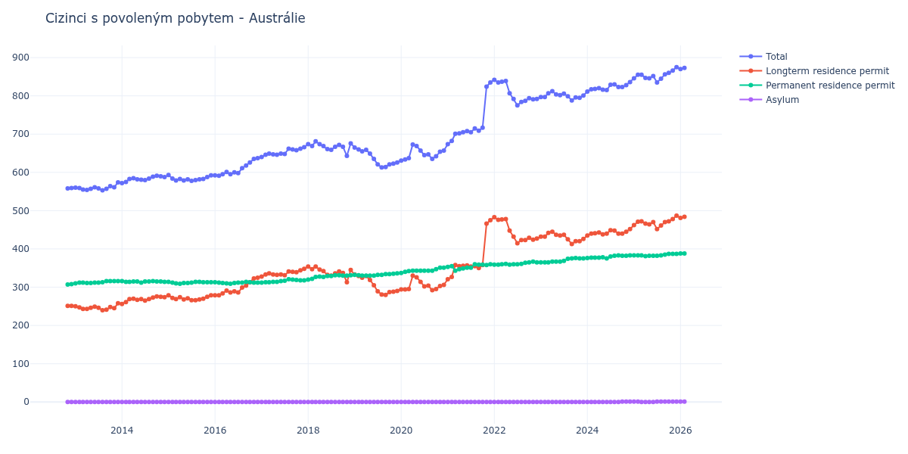

# Austrálie

## Souhrnné statistiky (Min/Max pro rok) / Summary Statistics (Min/Max per year)

| Year   | Total     | Longterm Residence Permit   | Permanent Residence Permit   | Asylum   |
|--------|-----------|-----------------------------|------------------------------|----------|
| 2012   | 558 / 559 | 251 / 251                   | 307 / 308                    | 0 / 0    |
| 2013   | 553 / 574 | 240 / 258                   | 310 / 316                    | 0 / 0    |
| 2014   | 572 / 591 | 256 / 276                   | 312 / 316                    | 0 / 0    |
| 2015   | 578 / 593 | 266 / 279                   | 309 / 314                    | 0 / 0    |
| 2016   | 591 / 637 | 279 / 325                   | 309 / 314                    | 0 / 0    |
| 2017   | 640 / 666 | 328 / 348                   | 312 / 321                    | 0 / 0    |
| 2018   | 643 / 681 | 313 / 354                   | 320 / 331                    | 0 / 0    |
| 2019   | 613 / 665 | 280 / 333                   | 330 / 336                    | 0 / 0    |
| 2020   | 631 / 673 | 292 / 330                   | 337 / 351                    | 0 / 0    |
| 2021   | 674 / 835 | 321 / 475                   | 343 / 360                    | 0 / 0    |
| 2022   | 775 / 842 | 415 / 483                   | 359 / 367                    | 0 / 0    |
| 2023   | 788 / 812 | 413 / 445                   | 365 / 376                    | 0 / 0    |
| 2024   | 811 / 836 | 435 / 452                   | 375 / 383                    | 0 / 1    |
| 2025   | 835 / 875 | 452 / 487                   | 381 / 387                    | 0 / 1    |
| 2026   | 870 / 873 | 481 / 484                   | 388 / 388                    | 1 / 1    |

## Detailní tabulka / Detailed Data Table

| Date     | Total         | Longterm Residence Permit   | Permanent Residence Permit   | Asylum       |
|----------|---------------|-----------------------------|------------------------------|--------------|
| **2012** |               |                             |                              |              |
| 11.2012  | 558           | 251                         | 307                          | 0            |
| 12.2012  | 559 (+0.18%)  | 251 (+0.00%)                | 308 (+0.33%)                 | 0            |
| **2013** |               |                             |                              |              |
| 01.2013  | 560 (+0.18%)  | 250 (-0.40%)                | 310 (+0.65%)                 | 0            |
| 02.2013  | 559 (-0.18%)  | 247 (-1.20%)                | 312 (+0.65%)                 | 0            |
| 03.2013  | 555 (-0.72%)  | 243 (-1.62%)                | 312 (+0.00%)                 | 0            |
| 04.2013  | 554 (-0.18%)  | 243 (+0.00%)                | 311 (-0.32%)                 | 0            |
| 05.2013  | 557 (+0.54%)  | 246 (+1.23%)                | 311 (+0.00%)                 | 0            |
| 06.2013  | 561 (+0.72%)  | 249 (+1.22%)                | 312 (+0.32%)                 | 0            |
| 07.2013  | 558 (-0.53%)  | 246 (-1.20%)                | 312 (+0.00%)                 | 0            |
| 08.2013  | 553 (-0.90%)  | 240 (-2.44%)                | 313 (+0.32%)                 | 0            |
| 09.2013  | 557 (+0.72%)  | 241 (+0.42%)                | 316 (+0.96%)                 | 0            |
| 10.2013  | 564 (+1.26%)  | 248 (+2.90%)                | 316 (+0.00%)                 | 0            |
| 11.2013  | 561 (-0.53%)  | 245 (-1.21%)                | 316 (+0.00%)                 | 0            |
| 12.2013  | 574 (+2.32%)  | 258 (+5.31%)                | 316 (+0.00%)                 | 0            |
| **2014** |               |                             |                              |              |
| 01.2014  | 572 (-0.35%)  | 256 (-0.78%)                | 316 (+0.00%)                 | 0            |
| 02.2014  | 575 (+0.52%)  | 261 (+1.95%)                | 314 (-0.63%)                 | 0            |
| 03.2014  | 583 (+1.39%)  | 269 (+3.07%)                | 314 (+0.00%)                 | 0            |
| 04.2014  | 585 (+0.34%)  | 270 (+0.37%)                | 315 (+0.32%)                 | 0            |
| 05.2014  | 582 (-0.51%)  | 267 (-1.11%)                | 315 (+0.00%)                 | 0            |
| 06.2014  | 581 (-0.17%)  | 269 (+0.75%)                | 312 (-0.95%)                 | 0            |
| 07.2014  | 580 (-0.17%)  | 265 (-1.49%)                | 315 (+0.96%)                 | 0            |
| 08.2014  | 584 (+0.69%)  | 269 (+1.51%)                | 315 (+0.00%)                 | 0            |
| 09.2014  | 589 (+0.86%)  | 273 (+1.49%)                | 316 (+0.32%)                 | 0            |
| 10.2014  | 591 (+0.34%)  | 276 (+1.10%)                | 315 (-0.32%)                 | 0            |
| 11.2014  | 590 (-0.17%)  | 275 (-0.36%)                | 315 (+0.00%)                 | 0            |
| 12.2014  | 588 (-0.34%)  | 274 (-0.36%)                | 314 (-0.32%)                 | 0            |
| **2015** |               |                             |                              |              |
| 01.2015  | 593 (+0.85%)  | 279 (+1.82%)                | 314 (+0.00%)                 | 0            |
| 02.2015  | 584 (-1.52%)  | 272 (-2.51%)                | 312 (-0.64%)                 | 0            |
| 03.2015  | 579 (-0.86%)  | 269 (-1.10%)                | 310 (-0.64%)                 | 0            |
| 04.2015  | 583 (+0.69%)  | 274 (+1.86%)                | 309 (-0.32%)                 | 0            |
| 05.2015  | 579 (-0.69%)  | 268 (-2.19%)                | 311 (+0.65%)                 | 0            |
| 06.2015  | 582 (+0.52%)  | 271 (+1.12%)                | 311 (+0.00%)                 | 0            |
| 07.2015  | 578 (-0.69%)  | 266 (-1.85%)                | 312 (+0.32%)                 | 0            |
| 08.2015  | 580 (+0.35%)  | 266 (+0.00%)                | 314 (+0.64%)                 | 0            |
| 09.2015  | 582 (+0.34%)  | 268 (+0.75%)                | 314 (+0.00%)                 | 0            |
| 10.2015  | 583 (+0.17%)  | 270 (+0.75%)                | 313 (-0.32%)                 | 0            |
| 11.2015  | 588 (+0.86%)  | 275 (+1.85%)                | 313 (+0.00%)                 | 0            |
| 12.2015  | 592 (+0.68%)  | 279 (+1.45%)                | 313 (+0.00%)                 | 0            |
| **2016** |               |                             |                              |              |
| 01.2016  | 592 (+0.00%)  | 279 (+0.00%)                | 313 (+0.00%)                 | 0            |
| 02.2016  | 591 (-0.17%)  | 279 (+0.00%)                | 312 (-0.32%)                 | 0            |
| 03.2016  | 595 (+0.68%)  | 284 (+1.79%)                | 311 (-0.32%)                 | 0            |
| 04.2016  | 601 (+1.01%)  | 291 (+2.46%)                | 310 (-0.32%)                 | 0            |
| 05.2016  | 595 (-1.00%)  | 286 (-1.72%)                | 309 (-0.32%)                 | 0            |
| 06.2016  | 600 (+0.84%)  | 289 (+1.05%)                | 311 (+0.65%)                 | 0            |
| 07.2016  | 598 (-0.33%)  | 286 (-1.04%)                | 312 (+0.32%)                 | 0            |
| 08.2016  | 611 (+2.17%)  | 299 (+4.55%)                | 312 (+0.00%)                 | 0            |
| 09.2016  | 618 (+1.15%)  | 304 (+1.67%)                | 314 (+0.64%)                 | 0            |
| 10.2016  | 626 (+1.29%)  | 313 (+2.96%)                | 313 (-0.32%)                 | 0            |
| 11.2016  | 635 (+1.44%)  | 323 (+3.19%)                | 312 (-0.32%)                 | 0            |
| 12.2016  | 637 (+0.31%)  | 325 (+0.62%)                | 312 (+0.00%)                 | 0            |
| **2017** |               |                             |                              |              |
| 01.2017  | 640 (+0.47%)  | 328 (+0.92%)                | 312 (+0.00%)                 | 0            |
| 02.2017  | 646 (+0.94%)  | 333 (+1.52%)                | 313 (+0.32%)                 | 0            |
| 03.2017  | 649 (+0.46%)  | 336 (+0.90%)                | 313 (+0.00%)                 | 0            |
| 04.2017  | 647 (-0.31%)  | 333 (-0.89%)                | 314 (+0.32%)                 | 0            |
| 05.2017  | 646 (-0.15%)  | 332 (-0.30%)                | 314 (+0.00%)                 | 0            |
| 06.2017  | 649 (+0.46%)  | 333 (+0.30%)                | 316 (+0.64%)                 | 0            |
| 07.2017  | 648 (-0.15%)  | 331 (-0.60%)                | 317 (+0.32%)                 | 0            |
| 08.2017  | 662 (+2.16%)  | 341 (+3.02%)                | 321 (+1.26%)                 | 0            |
| 09.2017  | 660 (-0.30%)  | 340 (-0.29%)                | 320 (-0.31%)                 | 0            |
| 10.2017  | 658 (-0.30%)  | 339 (-0.29%)                | 319 (-0.31%)                 | 0            |
| 11.2017  | 662 (+0.61%)  | 344 (+1.47%)                | 318 (-0.31%)                 | 0            |
| 12.2017  | 666 (+0.60%)  | 348 (+1.16%)                | 318 (+0.00%)                 | 0            |
| **2018** |               |                             |                              |              |
| 01.2018  | 674 (+1.20%)  | 354 (+1.72%)                | 320 (+0.63%)                 | 0            |
| 02.2018  | 669 (-0.74%)  | 347 (-1.98%)                | 322 (+0.63%)                 | 0            |
| 03.2018  | 681 (+1.79%)  | 354 (+2.02%)                | 327 (+1.55%)                 | 0            |
| 04.2018  | 674 (-1.03%)  | 346 (-2.26%)                | 328 (+0.31%)                 | 0            |
| 05.2018  | 669 (-0.74%)  | 342 (-1.16%)                | 327 (-0.30%)                 | 0            |
| 06.2018  | 661 (-1.20%)  | 332 (-2.92%)                | 329 (+0.61%)                 | 0            |
| 07.2018  | 659 (-0.30%)  | 330 (-0.60%)                | 329 (+0.00%)                 | 0            |
| 08.2018  | 667 (+1.21%)  | 336 (+1.82%)                | 331 (+0.61%)                 | 0            |
| 09.2018  | 672 (+0.75%)  | 341 (+1.49%)                | 331 (+0.00%)                 | 0            |
| 10.2018  | 667 (-0.74%)  | 337 (-1.17%)                | 330 (-0.30%)                 | 0            |
| 11.2018  | 643 (-3.60%)  | 313 (-7.12%)                | 330 (+0.00%)                 | 0            |
| 12.2018  | 676 (+5.13%)  | 345 (+10.22%)               | 331 (+0.30%)                 | 0            |
| **2019** |               |                             |                              |              |
| 01.2019  | 665 (-1.63%)  | 333 (-3.48%)                | 332 (+0.30%)                 | 0            |
| 02.2019  | 660 (-0.75%)  | 329 (-1.20%)                | 331 (-0.30%)                 | 0            |
| 03.2019  | 655 (-0.76%)  | 325 (-1.22%)                | 330 (-0.30%)                 | 0            |
| 04.2019  | 659 (+0.61%)  | 329 (+1.23%)                | 330 (+0.00%)                 | 0            |
| 05.2019  | 649 (-1.52%)  | 319 (-3.04%)                | 330 (+0.00%)                 | 0            |
| 06.2019  | 635 (-2.16%)  | 305 (-4.39%)                | 330 (+0.00%)                 | 0            |
| 07.2019  | 621 (-2.20%)  | 289 (-5.25%)                | 332 (+0.61%)                 | 0            |
| 08.2019  | 613 (-1.29%)  | 281 (-2.77%)                | 332 (+0.00%)                 | 0            |
| 09.2019  | 614 (+0.16%)  | 280 (-0.36%)                | 334 (+0.60%)                 | 0            |
| 10.2019  | 621 (+1.14%)  | 287 (+2.50%)                | 334 (+0.00%)                 | 0            |
| 11.2019  | 623 (+0.32%)  | 288 (+0.35%)                | 335 (+0.30%)                 | 0            |
| 12.2019  | 626 (+0.48%)  | 290 (+0.69%)                | 336 (+0.30%)                 | 0            |
| **2020** |               |                             |                              |              |
| 01.2020  | 631 (+0.80%)  | 294 (+1.38%)                | 337 (+0.30%)                 | 0            |
| 02.2020  | 634 (+0.48%)  | 294 (+0.00%)                | 340 (+0.89%)                 | 0            |
| 03.2020  | 637 (+0.47%)  | 295 (+0.34%)                | 342 (+0.59%)                 | 0            |
| 04.2020  | 673 (+5.65%)  | 330 (+11.86%)               | 343 (+0.29%)                 | 0            |
| 05.2020  | 669 (-0.59%)  | 326 (-1.21%)                | 343 (+0.00%)                 | 0            |
| 06.2020  | 657 (-1.79%)  | 314 (-3.68%)                | 343 (+0.00%)                 | 0            |
| 07.2020  | 645 (-1.83%)  | 302 (-3.82%)                | 343 (+0.00%)                 | 0            |
| 08.2020  | 647 (+0.31%)  | 304 (+0.66%)                | 343 (+0.00%)                 | 0            |
| 09.2020  | 635 (-1.85%)  | 292 (-3.95%)                | 343 (+0.00%)                 | 0            |
| 10.2020  | 642 (+1.10%)  | 295 (+1.03%)                | 347 (+1.17%)                 | 0            |
| 11.2020  | 654 (+1.87%)  | 303 (+2.71%)                | 351 (+1.15%)                 | 0            |
| 12.2020  | 657 (+0.46%)  | 306 (+0.99%)                | 351 (+0.00%)                 | 0            |
| **2021** |               |                             |                              |              |
| 01.2021  | 674 (+2.59%)  | 321 (+4.90%)                | 353 (+0.57%)                 | 0            |
| 02.2021  | 682 (+1.19%)  | 327 (+1.87%)                | 355 (+0.57%)                 | 0            |
| 03.2021  | 701 (+2.79%)  | 358 (+9.48%)                | 343 (-3.38%)                 | 0            |
| 04.2021  | 702 (+0.14%)  | 355 (-0.84%)                | 347 (+1.17%)                 | 0            |
| 05.2021  | 705 (+0.43%)  | 356 (+0.28%)                | 349 (+0.58%)                 | 0            |
| 06.2021  | 708 (+0.43%)  | 357 (+0.28%)                | 351 (+0.57%)                 | 0            |
| 07.2021  | 705 (-0.42%)  | 354 (-0.84%)                | 351 (+0.00%)                 | 0            |
| 08.2021  | 715 (+1.42%)  | 355 (+0.28%)                | 360 (+2.56%)                 | 0            |
| 09.2021  | 709 (-0.84%)  | 350 (-1.41%)                | 359 (-0.28%)                 | 0            |
| 10.2021  | 717 (+1.13%)  | 358 (+2.29%)                | 359 (+0.00%)                 | 0            |
| 11.2021  | 824 (+14.92%) | 466 (+30.17%)               | 358 (-0.28%)                 | 0            |
| 12.2021  | 835 (+1.33%)  | 475 (+1.93%)                | 360 (+0.56%)                 | 0            |
| **2022** |               |                             |                              |              |
| 01.2022  | 842 (+0.84%)  | 483 (+1.68%)                | 359 (-0.28%)                 | 0            |
| 02.2022  | 835 (-0.83%)  | 476 (-1.45%)                | 359 (+0.00%)                 | 0            |
| 03.2022  | 837 (+0.24%)  | 477 (+0.21%)                | 360 (+0.28%)                 | 0            |
| 04.2022  | 839 (+0.24%)  | 478 (+0.21%)                | 361 (+0.28%)                 | 0            |
| 05.2022  | 807 (-3.81%)  | 448 (-6.28%)                | 359 (-0.55%)                 | 0            |
| 06.2022  | 792 (-1.86%)  | 432 (-3.57%)                | 360 (+0.28%)                 | 0            |
| 07.2022  | 775 (-2.15%)  | 415 (-3.94%)                | 360 (+0.00%)                 | 0            |
| 08.2022  | 784 (+1.16%)  | 423 (+1.93%)                | 361 (+0.28%)                 | 0            |
| 09.2022  | 787 (+0.38%)  | 423 (+0.00%)                | 364 (+0.83%)                 | 0            |
| 10.2022  | 794 (+0.89%)  | 429 (+1.42%)                | 365 (+0.27%)                 | 0            |
| 11.2022  | 791 (-0.38%)  | 424 (-1.17%)                | 367 (+0.55%)                 | 0            |
| 12.2022  | 792 (+0.13%)  | 427 (+0.71%)                | 365 (-0.54%)                 | 0            |
| **2023** |               |                             |                              |              |
| 01.2023  | 797 (+0.63%)  | 432 (+1.17%)                | 365 (+0.00%)                 | 0            |
| 02.2023  | 797 (+0.00%)  | 432 (+0.00%)                | 365 (+0.00%)                 | 0            |
| 03.2023  | 807 (+1.25%)  | 442 (+2.31%)                | 365 (+0.00%)                 | 0            |
| 04.2023  | 812 (+0.62%)  | 445 (+0.68%)                | 367 (+0.55%)                 | 0            |
| 05.2023  | 804 (-0.99%)  | 437 (-1.80%)                | 367 (+0.00%)                 | 0            |
| 06.2023  | 802 (-0.25%)  | 435 (-0.46%)                | 367 (+0.00%)                 | 0            |
| 07.2023  | 806 (+0.50%)  | 437 (+0.46%)                | 369 (+0.54%)                 | 0            |
| 08.2023  | 799 (-0.87%)  | 425 (-2.75%)                | 374 (+1.36%)                 | 0            |
| 09.2023  | 788 (-1.38%)  | 413 (-2.82%)                | 375 (+0.27%)                 | 0            |
| 10.2023  | 796 (+1.02%)  | 420 (+1.69%)                | 376 (+0.27%)                 | 0            |
| 11.2023  | 795 (-0.13%)  | 420 (+0.00%)                | 375 (-0.27%)                 | 0            |
| 12.2023  | 801 (+0.75%)  | 426 (+1.43%)                | 375 (+0.00%)                 | 0            |
| **2024** |               |                             |                              |              |
| 01.2024  | 811 (+1.25%)  | 435 (+2.11%)                | 376 (+0.27%)                 | 0            |
| 02.2024  | 817 (+0.74%)  | 440 (+1.15%)                | 377 (+0.27%)                 | 0            |
| 03.2024  | 818 (+0.12%)  | 441 (+0.23%)                | 377 (+0.00%)                 | 0            |
| 04.2024  | 820 (+0.24%)  | 443 (+0.45%)                | 377 (+0.00%)                 | 0            |
| 05.2024  | 816 (-0.49%)  | 438 (-1.13%)                | 378 (+0.27%)                 | 0            |
| 06.2024  | 815 (-0.12%)  | 440 (+0.46%)                | 375 (-0.79%)                 | 0            |
| 07.2024  | 829 (+1.72%)  | 449 (+2.05%)                | 380 (+1.33%)                 | 0            |
| 08.2024  | 830 (+0.12%)  | 448 (-0.22%)                | 382 (+0.53%)                 | 0            |
| 09.2024  | 823 (-0.84%)  | 440 (-1.79%)                | 383 (+0.26%)                 | 0            |
| 10.2024  | 823 (+0.00%)  | 440 (+0.00%)                | 382 (-0.26%)                 | 1            |
| 11.2024  | 828 (+0.61%)  | 445 (+1.14%)                | 382 (+0.00%)                 | 1 (+0.00%)   |
| 12.2024  | 836 (+0.97%)  | 452 (+1.57%)                | 383 (+0.26%)                 | 1 (+0.00%)   |
| **2025** |               |                             |                              |              |
| 01.2025  | 846 (+1.20%)  | 462 (+2.21%)                | 383 (+0.00%)                 | 1 (+0.00%)   |
| 02.2025  | 855 (+1.06%)  | 471 (+1.95%)                | 383 (+0.00%)                 | 1 (+0.00%)   |
| 03.2025  | 855 (+0.00%)  | 472 (+0.21%)                | 383 (+0.00%)                 | 0 (-100.00%) |
| 04.2025  | 847 (-0.94%)  | 466 (-1.27%)                | 381 (-0.52%)                 | 0            |
| 05.2025  | 846 (-0.12%)  | 464 (-0.43%)                | 382 (+0.26%)                 | 0            |
| 06.2025  | 852 (+0.71%)  | 470 (+1.29%)                | 382 (+0.00%)                 | 0            |
| 07.2025  | 835 (-2.00%)  | 452 (-3.83%)                | 382 (+0.00%)                 | 1            |
| 08.2025  | 845 (+1.20%)  | 461 (+1.99%)                | 383 (+0.26%)                 | 1 (+0.00%)   |
| 09.2025  | 856 (+1.30%)  | 470 (+1.95%)                | 385 (+0.52%)                 | 1 (+0.00%)   |
| 10.2025  | 860 (+0.47%)  | 472 (+0.43%)                | 387 (+0.52%)                 | 1 (+0.00%)   |
| 11.2025  | 866 (+0.70%)  | 478 (+1.27%)                | 387 (+0.00%)                 | 1 (+0.00%)   |
| 12.2025  | 875 (+1.04%)  | 487 (+1.88%)                | 387 (+0.00%)                 | 1 (+0.00%)   |
| **2026** |               |                             |                              |              |
| 01.2026  | 870 (-0.57%)  | 481 (-1.23%)                | 388 (+0.26%)                 | 1 (+0.00%)   |
| 02.2026  | 873 (+0.34%)  | 484 (+0.62%)                | 388 (+0.00%)                 | 1 (+0.00%)   |
