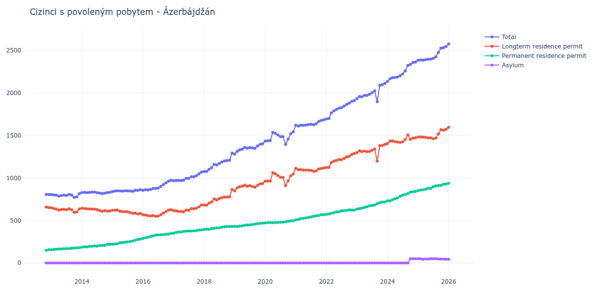

# Ázerbájdžán

## Souhrnné statistiky (Min/Max pro rok) / Summary Statistics (Min/Max per year)

| Year   | Total         | Longterm Residence Permit   | Permanent Residence Permit   | Asylum   |
|--------|---------------|-----------------------------|------------------------------|----------|
| 2012   | 805 / 807     | 650 / 658                   | 149 / 155                    | 0 / 0    |
| 2013   | 771 / 815     | 595 / 649                   | 156 / 180                    | 0 / 0    |
| 2014   | 815 / 834     | 608 / 643                   | 185 / 220                    | 0 / 0    |
| 2015   | 840 / 861     | 577 / 623                   | 220 / 279                    | 0 / 0    |
| 2016   | 855 / 973     | 548 / 627                   | 288 / 346                    | 0 / 0    |
| 2017   | 966 / 1 070   | 603 / 682                   | 351 / 388                    | 0 / 0    |
| 2018   | 1 075 / 1 293 | 680 / 864                   | 394 / 430                    | 0 / 0    |
| 2019   | 1 280 / 1 402 | 849 / 934                   | 430 / 468                    | 0 / 0    |
| 2020   | 1 394 / 1 542 | 910 / 1 062                 | 472 / 497                    | 0 / 0    |
| 2021   | 1 609 / 1 684 | 1 077 / 1 117               | 506 / 567                    | 0 / 0    |
| 2022   | 1 694 / 1 909 | 1 122 / 1 287               | 572 / 625                    | 0 / 0    |
| 2023   | 1 896 / 2 112 | 1 199 / 1 394               | 635 / 718                    | 0 / 0    |
| 2024   | 2 135 / 2 364 | 1 405 / 1 507               | 730 / 841                    | 0 / 50   |
| 2025   | 2 384 / 2 546 | 1 461 / 1 573               | 852 / 929                    | 44 / 50  |
| 2026   | 2 576 / 2 576 | 1 595 / 1 595               | 937 / 937                    | 44 / 44  |

## Detailní tabulka / Detailed Data Table

| Date     | Total           | Longterm Residence Permit   | Permanent Residence Permit   | Asylum       |
|----------|-----------------|-----------------------------|------------------------------|--------------|
| **2012** |                 |                             |                              |              |
| 11.2012  | 807             | 658                         | 149                          | 0            |
| 12.2012  | 805 (-0.25%)    | 650 (-1.22%)                | 155 (+4.03%)                 | 0            |
| **2013** |                 |                             |                              |              |
| 01.2013  | 805 (+0.00%)    | 649 (-0.15%)                | 156 (+0.65%)                 | 0            |
| 02.2013  | 800 (-0.62%)    | 641 (-1.23%)                | 159 (+1.92%)                 | 0            |
| 03.2013  | 797 (-0.38%)    | 635 (-0.94%)                | 162 (+1.89%)                 | 0            |
| 04.2013  | 786 (-1.38%)    | 621 (-2.20%)                | 165 (+1.85%)                 | 0            |
| 05.2013  | 793 (+0.89%)    | 629 (+1.29%)                | 164 (-0.61%)                 | 0            |
| 06.2013  | 798 (+0.63%)    | 631 (+0.32%)                | 167 (+1.83%)                 | 0            |
| 07.2013  | 795 (-0.38%)    | 626 (-0.79%)                | 169 (+1.20%)                 | 0            |
| 08.2013  | 807 (+1.51%)    | 638 (+1.92%)                | 169 (+0.00%)                 | 0            |
| 09.2013  | 799 (-0.99%)    | 626 (-1.88%)                | 173 (+2.37%)                 | 0            |
| 10.2013  | 771 (-3.50%)    | 595 (-4.95%)                | 176 (+1.73%)                 | 0            |
| 11.2013  | 777 (+0.78%)    | 599 (+0.67%)                | 178 (+1.14%)                 | 0            |
| 12.2013  | 815 (+4.89%)    | 635 (+6.01%)                | 180 (+1.12%)                 | 0            |
| **2014** |                 |                             |                              |              |
| 01.2014  | 828 (+1.60%)    | 643 (+1.26%)                | 185 (+2.78%)                 | 0            |
| 02.2014  | 831 (+0.36%)    | 641 (-0.31%)                | 190 (+2.70%)                 | 0            |
| 03.2014  | 827 (-0.48%)    | 638 (-0.47%)                | 189 (-0.53%)                 | 0            |
| 04.2014  | 829 (+0.24%)    | 634 (-0.63%)                | 195 (+3.17%)                 | 0            |
| 05.2014  | 832 (+0.36%)    | 635 (+0.16%)                | 197 (+1.03%)                 | 0            |
| 06.2014  | 834 (+0.24%)    | 633 (-0.31%)                | 201 (+2.03%)                 | 0            |
| 07.2014  | 826 (-0.96%)    | 628 (-0.79%)                | 198 (-1.49%)                 | 0            |
| 08.2014  | 822 (-0.48%)    | 617 (-1.75%)                | 205 (+3.54%)                 | 0            |
| 09.2014  | 815 (-0.85%)    | 608 (-1.46%)                | 207 (+0.98%)                 | 0            |
| 10.2014  | 821 (+0.74%)    | 615 (+1.15%)                | 206 (-0.48%)                 | 0            |
| 11.2014  | 828 (+0.85%)    | 609 (-0.98%)                | 219 (+6.31%)                 | 0            |
| 12.2014  | 831 (+0.36%)    | 611 (+0.33%)                | 220 (+0.46%)                 | 0            |
| **2015** |                 |                             |                              |              |
| 01.2015  | 840 (+1.08%)    | 620 (+1.47%)                | 220 (+0.00%)                 | 0            |
| 02.2015  | 845 (+0.60%)    | 621 (+0.16%)                | 224 (+1.82%)                 | 0            |
| 03.2015  | 849 (+0.47%)    | 623 (+0.32%)                | 226 (+0.89%)                 | 0            |
| 04.2015  | 847 (-0.24%)    | 609 (-2.25%)                | 238 (+5.31%)                 | 0            |
| 05.2015  | 844 (-0.35%)    | 604 (-0.82%)                | 240 (+0.84%)                 | 0            |
| 06.2015  | 849 (+0.59%)    | 604 (+0.00%)                | 245 (+2.08%)                 | 0            |
| 07.2015  | 849 (+0.00%)    | 602 (-0.33%)                | 247 (+0.82%)                 | 0            |
| 08.2015  | 846 (-0.35%)    | 593 (-1.50%)                | 253 (+2.43%)                 | 0            |
| 09.2015  | 843 (-0.35%)    | 584 (-1.52%)                | 259 (+2.37%)                 | 0            |
| 10.2015  | 855 (+1.42%)    | 587 (+0.51%)                | 268 (+3.47%)                 | 0            |
| 11.2015  | 854 (-0.12%)    | 577 (-1.70%)                | 277 (+3.36%)                 | 0            |
| 12.2015  | 861 (+0.82%)    | 582 (+0.87%)                | 279 (+0.72%)                 | 0            |
| **2016** |                 |                             |                              |              |
| 01.2016  | 855 (-0.70%)    | 567 (-2.58%)                | 288 (+3.23%)                 | 0            |
| 02.2016  | 861 (+0.70%)    | 564 (-0.53%)                | 297 (+3.12%)                 | 0            |
| 03.2016  | 859 (-0.23%)    | 556 (-1.42%)                | 303 (+2.02%)                 | 0            |
| 04.2016  | 865 (+0.70%)    | 553 (-0.54%)                | 312 (+2.97%)                 | 0            |
| 05.2016  | 876 (+1.27%)    | 557 (+0.72%)                | 319 (+2.24%)                 | 0            |
| 06.2016  | 876 (+0.00%)    | 548 (-1.62%)                | 328 (+2.82%)                 | 0            |
| 07.2016  | 881 (+0.57%)    | 551 (+0.55%)                | 330 (+0.61%)                 | 0            |
| 08.2016  | 900 (+2.16%)    | 568 (+3.09%)                | 332 (+0.61%)                 | 0            |
| 09.2016  | 921 (+2.33%)    | 587 (+3.35%)                | 334 (+0.60%)                 | 0            |
| 10.2016  | 941 (+2.17%)    | 604 (+2.90%)                | 337 (+0.90%)                 | 0            |
| 11.2016  | 962 (+2.23%)    | 622 (+2.98%)                | 340 (+0.89%)                 | 0            |
| 12.2016  | 973 (+1.14%)    | 627 (+0.80%)                | 346 (+1.76%)                 | 0            |
| **2017** |                 |                             |                              |              |
| 01.2017  | 966 (-0.72%)    | 615 (-1.91%)                | 351 (+1.45%)                 | 0            |
| 02.2017  | 971 (+0.52%)    | 612 (-0.49%)                | 359 (+2.28%)                 | 0            |
| 03.2017  | 971 (+0.00%)    | 607 (-0.82%)                | 364 (+1.39%)                 | 0            |
| 04.2017  | 970 (-0.10%)    | 605 (-0.33%)                | 365 (+0.27%)                 | 0            |
| 05.2017  | 974 (+0.41%)    | 603 (-0.33%)                | 371 (+1.64%)                 | 0            |
| 06.2017  | 996 (+2.26%)    | 622 (+3.15%)                | 374 (+0.81%)                 | 0            |
| 07.2017  | 994 (-0.20%)    | 619 (-0.48%)                | 375 (+0.27%)                 | 0            |
| 08.2017  | 1 015 (+2.11%)  | 640 (+3.39%)                | 375 (+0.00%)                 | 0            |
| 09.2017  | 1 015 (+0.00%)  | 638 (-0.31%)                | 377 (+0.53%)                 | 0            |
| 10.2017  | 1 026 (+1.08%)  | 645 (+1.10%)                | 381 (+1.06%)                 | 0            |
| 11.2017  | 1 048 (+2.14%)  | 661 (+2.48%)                | 387 (+1.57%)                 | 0            |
| 12.2017  | 1 070 (+2.10%)  | 682 (+3.18%)                | 388 (+0.26%)                 | 0            |
| **2018** |                 |                             |                              |              |
| 01.2018  | 1 075 (+0.47%)  | 681 (-0.15%)                | 394 (+1.55%)                 | 0            |
| 02.2018  | 1 077 (+0.19%)  | 680 (-0.15%)                | 397 (+0.76%)                 | 0            |
| 03.2018  | 1 101 (+2.23%)  | 705 (+3.68%)                | 396 (-0.25%)                 | 0            |
| 04.2018  | 1 121 (+1.82%)  | 717 (+1.70%)                | 404 (+2.02%)                 | 0            |
| 05.2018  | 1 160 (+3.48%)  | 752 (+4.88%)                | 408 (+0.99%)                 | 0            |
| 06.2018  | 1 153 (-0.60%)  | 741 (-1.46%)                | 412 (+0.98%)                 | 0            |
| 07.2018  | 1 170 (+1.47%)  | 757 (+2.16%)                | 413 (+0.24%)                 | 0            |
| 08.2018  | 1 188 (+1.54%)  | 768 (+1.45%)                | 420 (+1.69%)                 | 0            |
| 09.2018  | 1 200 (+1.01%)  | 775 (+0.91%)                | 425 (+1.19%)                 | 0            |
| 10.2018  | 1 203 (+0.25%)  | 774 (-0.13%)                | 429 (+0.94%)                 | 0            |
| 11.2018  | 1 209 (+0.50%)  | 779 (+0.65%)                | 430 (+0.23%)                 | 0            |
| 12.2018  | 1 293 (+6.95%)  | 864 (+10.91%)               | 429 (-0.23%)                 | 0            |
| **2019** |                 |                             |                              |              |
| 01.2019  | 1 280 (-1.01%)  | 849 (-1.74%)                | 431 (+0.47%)                 | 0            |
| 02.2019  | 1 313 (+2.58%)  | 883 (+4.00%)                | 430 (-0.23%)                 | 0            |
| 03.2019  | 1 330 (+1.29%)  | 896 (+1.47%)                | 434 (+0.93%)                 | 0            |
| 04.2019  | 1 339 (+0.68%)  | 902 (+0.67%)                | 437 (+0.69%)                 | 0            |
| 05.2019  | 1 359 (+1.49%)  | 915 (+1.44%)                | 444 (+1.60%)                 | 0            |
| 06.2019  | 1 350 (-0.66%)  | 903 (-1.31%)                | 447 (+0.68%)                 | 0            |
| 07.2019  | 1 358 (+0.59%)  | 910 (+0.78%)                | 448 (+0.22%)                 | 0            |
| 08.2019  | 1 352 (-0.44%)  | 899 (-1.21%)                | 453 (+1.12%)                 | 0            |
| 09.2019  | 1 348 (-0.30%)  | 890 (-1.00%)                | 458 (+1.10%)                 | 0            |
| 10.2019  | 1 375 (+2.00%)  | 912 (+2.47%)                | 463 (+1.09%)                 | 0            |
| 11.2019  | 1 395 (+1.45%)  | 930 (+1.97%)                | 465 (+0.43%)                 | 0            |
| 12.2019  | 1 402 (+0.50%)  | 934 (+0.43%)                | 468 (+0.65%)                 | 0            |
| **2020** |                 |                             |                              |              |
| 01.2020  | 1 434 (+2.28%)  | 962 (+3.00%)                | 472 (+0.85%)                 | 0            |
| 02.2020  | 1 438 (+0.28%)  | 963 (+0.10%)                | 475 (+0.64%)                 | 0            |
| 03.2020  | 1 439 (+0.07%)  | 964 (+0.10%)                | 475 (+0.00%)                 | 0            |
| 04.2020  | 1 537 (+6.81%)  | 1 062 (+10.17%)             | 475 (+0.00%)                 | 0            |
| 05.2020  | 1 525 (-0.78%)  | 1 049 (-1.22%)              | 476 (+0.21%)                 | 0            |
| 06.2020  | 1 505 (-1.31%)  | 1 029 (-1.91%)              | 476 (+0.00%)                 | 0            |
| 07.2020  | 1 486 (-1.26%)  | 1 007 (-2.14%)              | 479 (+0.63%)                 | 0            |
| 08.2020  | 1 486 (+0.00%)  | 1 006 (-0.10%)              | 480 (+0.21%)                 | 0            |
| 09.2020  | 1 394 (-6.19%)  | 910 (-9.54%)                | 484 (+0.83%)                 | 0            |
| 10.2020  | 1 457 (+4.52%)  | 966 (+6.15%)                | 491 (+1.45%)                 | 0            |
| 11.2020  | 1 519 (+4.26%)  | 1 024 (+6.00%)              | 495 (+0.81%)                 | 0            |
| 12.2020  | 1 542 (+1.51%)  | 1 045 (+2.05%)              | 497 (+0.40%)                 | 0            |
| **2021** |                 |                             |                              |              |
| 01.2021  | 1 620 (+5.06%)  | 1 114 (+6.60%)              | 506 (+1.81%)                 | 0            |
| 02.2021  | 1 609 (-0.68%)  | 1 097 (-1.53%)              | 512 (+1.19%)                 | 0            |
| 03.2021  | 1 620 (+0.68%)  | 1 098 (+0.09%)              | 522 (+1.95%)                 | 0            |
| 04.2021  | 1 619 (-0.06%)  | 1 093 (-0.46%)              | 526 (+0.77%)                 | 0            |
| 05.2021  | 1 621 (+0.12%)  | 1 091 (-0.18%)              | 530 (+0.76%)                 | 0            |
| 06.2021  | 1 627 (+0.37%)  | 1 092 (+0.09%)              | 535 (+0.94%)                 | 0            |
| 07.2021  | 1 631 (+0.25%)  | 1 089 (-0.27%)              | 542 (+1.31%)                 | 0            |
| 08.2021  | 1 625 (-0.37%)  | 1 077 (-1.10%)              | 548 (+1.11%)                 | 0            |
| 09.2021  | 1 637 (+0.74%)  | 1 083 (+0.56%)              | 554 (+1.09%)                 | 0            |
| 10.2021  | 1 663 (+1.59%)  | 1 105 (+2.03%)              | 558 (+0.72%)                 | 0            |
| 11.2021  | 1 677 (+0.84%)  | 1 110 (+0.45%)              | 567 (+1.61%)                 | 0            |
| 12.2021  | 1 684 (+0.42%)  | 1 117 (+0.63%)              | 567 (+0.00%)                 | 0            |
| **2022** |                 |                             |                              |              |
| 01.2022  | 1 694 (+0.59%)  | 1 122 (+0.45%)              | 572 (+0.88%)                 | 0            |
| 02.2022  | 1 700 (+0.35%)  | 1 124 (+0.18%)              | 576 (+0.70%)                 | 0            |
| 03.2022  | 1 764 (+3.76%)  | 1 180 (+4.98%)              | 584 (+1.39%)                 | 0            |
| 04.2022  | 1 789 (+1.42%)  | 1 198 (+1.53%)              | 591 (+1.20%)                 | 0            |
| 05.2022  | 1 806 (+0.95%)  | 1 207 (+0.75%)              | 599 (+1.35%)                 | 0            |
| 06.2022  | 1 820 (+0.78%)  | 1 217 (+0.83%)              | 603 (+0.67%)                 | 0            |
| 07.2022  | 1 827 (+0.38%)  | 1 215 (-0.16%)              | 612 (+1.49%)                 | 0            |
| 08.2022  | 1 846 (+1.04%)  | 1 230 (+1.23%)              | 616 (+0.65%)                 | 0            |
| 09.2022  | 1 865 (+1.03%)  | 1 247 (+1.38%)              | 618 (+0.32%)                 | 0            |
| 10.2022  | 1 880 (+0.80%)  | 1 255 (+0.64%)              | 625 (+1.13%)                 | 0            |
| 11.2022  | 1 900 (+1.06%)  | 1 277 (+1.75%)              | 623 (-0.32%)                 | 0            |
| 12.2022  | 1 909 (+0.47%)  | 1 287 (+0.78%)              | 622 (-0.16%)                 | 0            |
| **2023** |                 |                             |                              |              |
| 01.2023  | 1 933 (+1.26%)  | 1 298 (+0.85%)              | 635 (+2.09%)                 | 0            |
| 02.2023  | 1 957 (+1.24%)  | 1 318 (+1.54%)              | 639 (+0.63%)                 | 0            |
| 03.2023  | 1 955 (-0.10%)  | 1 310 (-0.61%)              | 645 (+0.94%)                 | 0            |
| 04.2023  | 1 970 (+0.77%)  | 1 316 (+0.46%)              | 654 (+1.40%)                 | 0            |
| 05.2023  | 1 971 (+0.05%)  | 1 310 (-0.46%)              | 661 (+1.07%)                 | 0            |
| 06.2023  | 1 984 (+0.66%)  | 1 312 (+0.15%)              | 672 (+1.66%)                 | 0            |
| 07.2023  | 2 002 (+0.91%)  | 1 326 (+1.07%)              | 676 (+0.60%)                 | 0            |
| 08.2023  | 2 024 (+1.10%)  | 1 341 (+1.13%)              | 683 (+1.04%)                 | 0            |
| 09.2023  | 1 896 (-6.32%)  | 1 199 (-10.59%)             | 697 (+2.05%)                 | 0            |
| 10.2023  | 2 088 (+10.13%) | 1 381 (+15.18%)             | 707 (+1.43%)                 | 0            |
| 11.2023  | 2 097 (+0.43%)  | 1 381 (+0.00%)              | 716 (+1.27%)                 | 0            |
| 12.2023  | 2 112 (+0.72%)  | 1 394 (+0.94%)              | 718 (+0.28%)                 | 0            |
| **2024** |                 |                             |                              |              |
| 01.2024  | 2 135 (+1.09%)  | 1 405 (+0.79%)              | 730 (+1.67%)                 | 0            |
| 02.2024  | 2 165 (+1.41%)  | 1 434 (+2.06%)              | 731 (+0.14%)                 | 0            |
| 03.2024  | 2 179 (+0.65%)  | 1 436 (+0.14%)              | 743 (+1.64%)                 | 0            |
| 04.2024  | 2 181 (+0.09%)  | 1 426 (-0.70%)              | 755 (+1.62%)                 | 0            |
| 05.2024  | 2 187 (+0.28%)  | 1 422 (-0.28%)              | 765 (+1.32%)                 | 0            |
| 06.2024  | 2 202 (+0.69%)  | 1 417 (-0.35%)              | 785 (+2.61%)                 | 0            |
| 07.2024  | 2 223 (+0.95%)  | 1 425 (+0.56%)              | 798 (+1.66%)                 | 0            |
| 08.2024  | 2 259 (+1.62%)  | 1 453 (+1.96%)              | 806 (+1.00%)                 | 0            |
| 09.2024  | 2 323 (+2.83%)  | 1 507 (+3.72%)              | 816 (+1.24%)                 | 0            |
| 10.2024  | 2 336 (+0.56%)  | 1 454 (-3.52%)              | 832 (+1.96%)                 | 50           |
| 11.2024  | 2 357 (+0.90%)  | 1 468 (+0.96%)              | 839 (+0.84%)                 | 50 (+0.00%)  |
| 12.2024  | 2 364 (+0.30%)  | 1 473 (+0.34%)              | 841 (+0.24%)                 | 50 (+0.00%)  |
| **2025** |                 |                             |                              |              |
| 01.2025  | 2 384 (+0.85%)  | 1 482 (+0.61%)              | 852 (+1.31%)                 | 50 (+0.00%)  |
| 02.2025  | 2 388 (+0.17%)  | 1 481 (-0.07%)              | 857 (+0.59%)                 | 50 (+0.00%)  |
| 03.2025  | 2 386 (-0.08%)  | 1 480 (-0.07%)              | 862 (+0.58%)                 | 44 (-12.00%) |
| 04.2025  | 2 391 (+0.21%)  | 1 477 (-0.20%)              | 867 (+0.58%)                 | 47 (+6.82%)  |
| 05.2025  | 2 396 (+0.21%)  | 1 472 (-0.34%)              | 877 (+1.15%)                 | 47 (+0.00%)  |
| 06.2025  | 2 398 (+0.08%)  | 1 471 (-0.07%)              | 878 (+0.11%)                 | 49 (+4.26%)  |
| 07.2025  | 2 406 (+0.33%)  | 1 461 (-0.68%)              | 896 (+2.05%)                 | 49 (+0.00%)  |
| 08.2025  | 2 425 (+0.79%)  | 1 469 (+0.55%)              | 907 (+1.23%)                 | 49 (+0.00%)  |
| 09.2025  | 2 475 (+2.06%)  | 1 517 (+3.27%)              | 911 (+0.44%)                 | 47 (-4.08%)  |
| 10.2025  | 2 527 (+2.10%)  | 1 568 (+3.36%)              | 913 (+0.22%)                 | 46 (-2.13%)  |
| 11.2025  | 2 533 (+0.24%)  | 1 562 (-0.38%)              | 926 (+1.42%)                 | 45 (-2.17%)  |
| 12.2025  | 2 546 (+0.51%)  | 1 573 (+0.70%)              | 929 (+0.32%)                 | 44 (-2.22%)  |
| **2026** |                 |                             |                              |              |
| 01.2026  | 2 576 (+1.18%)  | 1 595 (+1.40%)              | 937 (+0.86%)                 | 44 (+0.00%)  |
