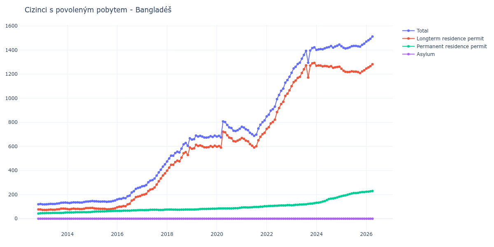

# Bangladéš

## Souhrnné statistiky (Min/Max pro rok) / Summary Statistics (Min/Max per year)

| Year   | Total         | Longterm Residence Permit   | Permanent Residence Permit   | Asylum   |
|--------|---------------|-----------------------------|------------------------------|----------|
| 2012   | 120 / 122     | 77 / 77                     | 43 / 45                      | 0 / 0    |
| 2013   | 119 / 134     | 73 / 84                     | 46 / 51                      | 0 / 0    |
| 2014   | 130 / 144     | 78 / 89                     | 52 / 55                      | 0 / 0    |
| 2015   | 140 / 151     | 78 / 90                     | 57 / 65                      | 0 / 0    |
| 2016   | 160 / 260     | 95 / 188                    | 65 / 72                      | 0 / 0    |
| 2017   | 269 / 451     | 197 / 376                   | 71 / 75                      | 0 / 0    |
| 2018   | 475 / 667     | 399 / 591                   | 74 / 76                      | 0 / 0    |
| 2019   | 657 / 690     | 581 / 613                   | 76 / 83                      | 0 / 0    |
| 2020   | 675 / 807     | 590 / 722                   | 84 / 90                      | 0 / 0    |
| 2021   | 688 / 816     | 591 / 713                   | 93 / 103                     | 0 / 0    |
| 2022   | 849 / 1 178   | 746 / 1 065                 | 103 / 113                    | 0 / 0    |
| 2023   | 1 211 / 1 422 | 1 100 / 1 293               | 111 / 129                    | 0 / 0    |
| 2024   | 1 401 / 1 445 | 1 252 / 1 272               | 132 / 183                    | 0 / 0    |
| 2025   | 1 413 / 1 453 | 1 209 / 1 245               | 187 / 221                    | 0 / 0    |
| 2026   | 1 470 / 1 512 | 1 246 / 1 282               | 224 / 230                    | 0 / 0    |

## Detailní tabulka / Detailed Data Table

| Date     | Total          | Longterm Residence Permit   | Permanent Residence Permit   | Asylum   |
|----------|----------------|-----------------------------|------------------------------|----------|
| **2012** |                |                             |                              |          |
| 11.2012  | 120            | 77                          | 43                           | 0        |
| 12.2012  | 122 (+1.67%)   | 77 (+0.00%)                 | 45 (+4.65%)                  | 0        |
| **2013** |                |                             |                              |          |
| 01.2013  | 119 (-2.46%)   | 73 (-5.19%)                 | 46 (+2.22%)                  | 0        |
| 02.2013  | 119 (+0.00%)   | 73 (+0.00%)                 | 46 (+0.00%)                  | 0        |
| 03.2013  | 120 (+0.84%)   | 73 (+0.00%)                 | 47 (+2.17%)                  | 0        |
| 04.2013  | 121 (+0.83%)   | 74 (+1.37%)                 | 47 (+0.00%)                  | 0        |
| 05.2013  | 123 (+1.65%)   | 76 (+2.70%)                 | 47 (+0.00%)                  | 0        |
| 06.2013  | 122 (-0.81%)   | 74 (-2.63%)                 | 48 (+2.13%)                  | 0        |
| 07.2013  | 122 (+0.00%)   | 74 (+0.00%)                 | 48 (+0.00%)                  | 0        |
| 08.2013  | 126 (+3.28%)   | 78 (+5.41%)                 | 48 (+0.00%)                  | 0        |
| 09.2013  | 127 (+0.79%)   | 79 (+1.28%)                 | 48 (+0.00%)                  | 0        |
| 10.2013  | 132 (+3.94%)   | 84 (+6.33%)                 | 48 (+0.00%)                  | 0        |
| 11.2013  | 133 (+0.76%)   | 84 (+0.00%)                 | 49 (+2.08%)                  | 0        |
| 12.2013  | 134 (+0.75%)   | 83 (-1.19%)                 | 51 (+4.08%)                  | 0        |
| **2014** |                |                             |                              |          |
| 01.2014  | 132 (-1.49%)   | 80 (-3.61%)                 | 52 (+1.96%)                  | 0        |
| 02.2014  | 130 (-1.52%)   | 78 (-2.50%)                 | 52 (+0.00%)                  | 0        |
| 03.2014  | 133 (+2.31%)   | 81 (+3.85%)                 | 52 (+0.00%)                  | 0        |
| 04.2014  | 136 (+2.26%)   | 84 (+3.70%)                 | 52 (+0.00%)                  | 0        |
| 05.2014  | 135 (-0.74%)   | 81 (-3.57%)                 | 54 (+3.85%)                  | 0        |
| 06.2014  | 136 (+0.74%)   | 82 (+1.23%)                 | 54 (+0.00%)                  | 0        |
| 07.2014  | 134 (-1.47%)   | 80 (-2.44%)                 | 54 (+0.00%)                  | 0        |
| 08.2014  | 134 (+0.00%)   | 80 (+0.00%)                 | 54 (+0.00%)                  | 0        |
| 09.2014  | 138 (+2.99%)   | 83 (+3.75%)                 | 55 (+1.85%)                  | 0        |
| 10.2014  | 142 (+2.90%)   | 88 (+6.02%)                 | 54 (-1.82%)                  | 0        |
| 11.2014  | 143 (+0.70%)   | 88 (+0.00%)                 | 55 (+1.85%)                  | 0        |
| 12.2014  | 144 (+0.70%)   | 89 (+1.14%)                 | 55 (+0.00%)                  | 0        |
| **2015** |                |                             |                              |          |
| 01.2015  | 147 (+2.08%)   | 90 (+1.12%)                 | 57 (+3.64%)                  | 0        |
| 02.2015  | 144 (-2.04%)   | 85 (-5.56%)                 | 59 (+3.51%)                  | 0        |
| 03.2015  | 144 (+0.00%)   | 84 (-1.18%)                 | 60 (+1.69%)                  | 0        |
| 04.2015  | 143 (-0.69%)   | 83 (-1.19%)                 | 60 (+0.00%)                  | 0        |
| 05.2015  | 142 (-0.70%)   | 82 (-1.20%)                 | 60 (+0.00%)                  | 0        |
| 06.2015  | 143 (+0.70%)   | 82 (+0.00%)                 | 61 (+1.67%)                  | 0        |
| 07.2015  | 143 (+0.00%)   | 82 (+0.00%)                 | 61 (+0.00%)                  | 0        |
| 08.2015  | 140 (-2.10%)   | 78 (-4.88%)                 | 62 (+1.64%)                  | 0        |
| 09.2015  | 142 (+1.43%)   | 79 (+1.28%)                 | 63 (+1.61%)                  | 0        |
| 10.2015  | 143 (+0.70%)   | 80 (+1.27%)                 | 63 (+0.00%)                  | 0        |
| 11.2015  | 147 (+2.80%)   | 83 (+3.75%)                 | 64 (+1.59%)                  | 0        |
| 12.2015  | 151 (+2.72%)   | 86 (+3.61%)                 | 65 (+1.56%)                  | 0        |
| **2016** |                |                             |                              |          |
| 01.2016  | 160 (+5.96%)   | 95 (+10.47%)                | 65 (+0.00%)                  | 0        |
| 02.2016  | 165 (+3.12%)   | 100 (+5.26%)                | 65 (+0.00%)                  | 0        |
| 03.2016  | 165 (+0.00%)   | 100 (+0.00%)                | 65 (+0.00%)                  | 0        |
| 04.2016  | 172 (+4.24%)   | 105 (+5.00%)                | 67 (+3.08%)                  | 0        |
| 05.2016  | 170 (-1.16%)   | 103 (-1.90%)                | 67 (+0.00%)                  | 0        |
| 06.2016  | 186 (+9.41%)   | 119 (+15.53%)               | 67 (+0.00%)                  | 0        |
| 07.2016  | 191 (+2.69%)   | 124 (+4.20%)                | 67 (+0.00%)                  | 0        |
| 08.2016  | 218 (+14.14%)  | 150 (+20.97%)               | 68 (+1.49%)                  | 0        |
| 09.2016  | 228 (+4.59%)   | 159 (+6.00%)                | 69 (+1.47%)                  | 0        |
| 10.2016  | 248 (+8.77%)   | 179 (+12.58%)               | 69 (+0.00%)                  | 0        |
| 11.2016  | 255 (+2.82%)   | 184 (+2.79%)                | 71 (+2.90%)                  | 0        |
| 12.2016  | 260 (+1.96%)   | 188 (+2.17%)                | 72 (+1.41%)                  | 0        |
| **2017** |                |                             |                              |          |
| 01.2017  | 269 (+3.46%)   | 197 (+4.79%)                | 72 (+0.00%)                  | 0        |
| 02.2017  | 272 (+1.12%)   | 201 (+2.03%)                | 71 (-1.39%)                  | 0        |
| 03.2017  | 279 (+2.57%)   | 207 (+2.99%)                | 72 (+1.41%)                  | 0        |
| 04.2017  | 302 (+8.24%)   | 230 (+11.11%)               | 72 (+0.00%)                  | 0        |
| 05.2017  | 316 (+4.64%)   | 242 (+5.22%)                | 74 (+2.78%)                  | 0        |
| 06.2017  | 320 (+1.27%)   | 246 (+1.65%)                | 74 (+0.00%)                  | 0        |
| 07.2017  | 333 (+4.06%)   | 259 (+5.28%)                | 74 (+0.00%)                  | 0        |
| 08.2017  | 358 (+7.51%)   | 284 (+9.65%)                | 74 (+0.00%)                  | 0        |
| 09.2017  | 384 (+7.26%)   | 311 (+9.51%)                | 73 (-1.35%)                  | 0        |
| 10.2017  | 407 (+5.99%)   | 334 (+7.40%)                | 73 (+0.00%)                  | 0        |
| 11.2017  | 432 (+6.14%)   | 359 (+7.49%)                | 73 (+0.00%)                  | 0        |
| 12.2017  | 451 (+4.40%)   | 376 (+4.74%)                | 75 (+2.74%)                  | 0        |
| **2018** |                |                             |                              |          |
| 01.2018  | 475 (+5.32%)   | 399 (+6.12%)                | 76 (+1.33%)                  | 0        |
| 02.2018  | 500 (+5.26%)   | 424 (+6.27%)                | 76 (+0.00%)                  | 0        |
| 03.2018  | 524 (+4.80%)   | 448 (+5.66%)                | 76 (+0.00%)                  | 0        |
| 04.2018  | 523 (-0.19%)   | 448 (+0.00%)                | 75 (-1.32%)                  | 0        |
| 05.2018  | 545 (+4.21%)   | 470 (+4.91%)                | 75 (+0.00%)                  | 0        |
| 06.2018  | 556 (+2.02%)   | 482 (+2.55%)                | 74 (-1.33%)                  | 0        |
| 07.2018  | 550 (-1.08%)   | 476 (-1.24%)                | 74 (+0.00%)                  | 0        |
| 08.2018  | 582 (+5.82%)   | 507 (+6.51%)                | 75 (+1.35%)                  | 0        |
| 09.2018  | 618 (+6.19%)   | 543 (+7.10%)                | 75 (+0.00%)                  | 0        |
| 10.2018  | 629 (+1.78%)   | 553 (+1.84%)                | 76 (+1.33%)                  | 0        |
| 11.2018  | 605 (-3.82%)   | 529 (-4.34%)                | 76 (+0.00%)                  | 0        |
| 12.2018  | 667 (+10.25%)  | 591 (+11.72%)               | 76 (+0.00%)                  | 0        |
| **2019** |                |                             |                              |          |
| 01.2019  | 657 (-1.50%)   | 581 (-1.69%)                | 76 (+0.00%)                  | 0        |
| 02.2019  | 660 (+0.46%)   | 584 (+0.52%)                | 76 (+0.00%)                  | 0        |
| 03.2019  | 690 (+4.55%)   | 613 (+4.97%)                | 77 (+1.32%)                  | 0        |
| 04.2019  | 682 (-1.16%)   | 604 (-1.47%)                | 78 (+1.30%)                  | 0        |
| 05.2019  | 688 (+0.88%)   | 608 (+0.66%)                | 80 (+2.56%)                  | 0        |
| 06.2019  | 682 (-0.87%)   | 601 (-1.15%)                | 81 (+1.25%)                  | 0        |
| 07.2019  | 674 (-1.17%)   | 593 (-1.33%)                | 81 (+0.00%)                  | 0        |
| 08.2019  | 673 (-0.15%)   | 592 (-0.17%)                | 81 (+0.00%)                  | 0        |
| 09.2019  | 676 (+0.45%)   | 594 (+0.34%)                | 82 (+1.23%)                  | 0        |
| 10.2019  | 685 (+1.33%)   | 603 (+1.52%)                | 82 (+0.00%)                  | 0        |
| 11.2019  | 678 (-1.02%)   | 595 (-1.33%)                | 83 (+1.22%)                  | 0        |
| 12.2019  | 689 (+1.62%)   | 606 (+1.85%)                | 83 (+0.00%)                  | 0        |
| **2020** |                |                             |                              |          |
| 01.2020  | 682 (-1.02%)   | 598 (-1.32%)                | 84 (+1.20%)                  | 0        |
| 02.2020  | 688 (+0.88%)   | 603 (+0.84%)                | 85 (+1.19%)                  | 0        |
| 03.2020  | 675 (-1.89%)   | 590 (-2.16%)                | 85 (+0.00%)                  | 0        |
| 04.2020  | 807 (+19.56%)  | 722 (+22.37%)               | 85 (+0.00%)                  | 0        |
| 05.2020  | 802 (-0.62%)   | 717 (-0.69%)                | 85 (+0.00%)                  | 0        |
| 06.2020  | 778 (-2.99%)   | 693 (-3.35%)                | 85 (+0.00%)                  | 0        |
| 07.2020  | 758 (-2.57%)   | 673 (-2.89%)                | 85 (+0.00%)                  | 0        |
| 08.2020  | 753 (-0.66%)   | 668 (-0.74%)                | 85 (+0.00%)                  | 0        |
| 09.2020  | 730 (-3.05%)   | 644 (-3.59%)                | 86 (+1.18%)                  | 0        |
| 10.2020  | 728 (-0.27%)   | 641 (-0.47%)                | 87 (+1.16%)                  | 0        |
| 11.2020  | 735 (+0.96%)   | 648 (+1.09%)                | 87 (+0.00%)                  | 0        |
| 12.2020  | 747 (+1.63%)   | 657 (+1.39%)                | 90 (+3.45%)                  | 0        |
| **2021** |                |                             |                              |          |
| 01.2021  | 763 (+2.14%)   | 670 (+1.98%)                | 93 (+3.33%)                  | 0        |
| 02.2021  | 757 (-0.79%)   | 663 (-1.04%)                | 94 (+1.08%)                  | 0        |
| 03.2021  | 742 (-1.98%)   | 648 (-2.26%)                | 94 (+0.00%)                  | 0        |
| 04.2021  | 735 (-0.94%)   | 642 (-0.93%)                | 93 (-1.06%)                  | 0        |
| 05.2021  | 713 (-2.99%)   | 619 (-3.58%)                | 94 (+1.08%)                  | 0        |
| 06.2021  | 701 (-1.68%)   | 606 (-2.10%)                | 95 (+1.06%)                  | 0        |
| 07.2021  | 688 (-1.85%)   | 591 (-2.48%)                | 97 (+2.11%)                  | 0        |
| 08.2021  | 698 (+1.45%)   | 601 (+1.69%)                | 97 (+0.00%)                  | 0        |
| 09.2021  | 748 (+7.16%)   | 651 (+8.32%)                | 97 (+0.00%)                  | 0        |
| 10.2021  | 780 (+4.28%)   | 680 (+4.45%)                | 100 (+3.09%)                 | 0        |
| 11.2021  | 801 (+2.69%)   | 701 (+3.09%)                | 100 (+0.00%)                 | 0        |
| 12.2021  | 816 (+1.87%)   | 713 (+1.71%)                | 103 (+3.00%)                 | 0        |
| **2022** |                |                             |                              |          |
| 01.2022  | 849 (+4.04%)   | 746 (+4.63%)                | 103 (+0.00%)                 | 0        |
| 02.2022  | 864 (+1.77%)   | 759 (+1.74%)                | 105 (+1.94%)                 | 0        |
| 03.2022  | 897 (+3.82%)   | 791 (+4.22%)                | 106 (+0.95%)                 | 0        |
| 04.2022  | 909 (+1.34%)   | 803 (+1.52%)                | 106 (+0.00%)                 | 0        |
| 05.2022  | 930 (+2.31%)   | 822 (+2.37%)                | 108 (+1.89%)                 | 0        |
| 06.2022  | 993 (+6.77%)   | 885 (+7.66%)                | 108 (+0.00%)                 | 0        |
| 07.2022  | 1 027 (+3.42%) | 918 (+3.73%)                | 109 (+0.93%)                 | 0        |
| 08.2022  | 1 062 (+3.41%) | 952 (+3.70%)                | 110 (+0.92%)                 | 0        |
| 09.2022  | 1 080 (+1.69%) | 970 (+1.89%)                | 110 (+0.00%)                 | 0        |
| 10.2022  | 1 129 (+4.54%) | 1 019 (+5.05%)              | 110 (+0.00%)                 | 0        |
| 11.2022  | 1 151 (+1.95%) | 1 038 (+1.86%)              | 113 (+2.73%)                 | 0        |
| 12.2022  | 1 178 (+2.35%) | 1 065 (+2.60%)              | 113 (+0.00%)                 | 0        |
| **2023** |                |                             |                              |          |
| 01.2023  | 1 211 (+2.80%) | 1 100 (+3.29%)              | 111 (-1.77%)                 | 0        |
| 02.2023  | 1 247 (+2.97%) | 1 134 (+3.09%)              | 113 (+1.80%)                 | 0        |
| 03.2023  | 1 261 (+1.12%) | 1 146 (+1.06%)              | 115 (+1.77%)                 | 0        |
| 04.2023  | 1 284 (+1.82%) | 1 169 (+2.01%)              | 115 (+0.00%)                 | 0        |
| 05.2023  | 1 295 (+0.86%) | 1 177 (+0.68%)              | 118 (+2.61%)                 | 0        |
| 06.2023  | 1 328 (+2.55%) | 1 210 (+2.80%)              | 118 (+0.00%)                 | 0        |
| 07.2023  | 1 359 (+2.33%) | 1 240 (+2.48%)              | 119 (+0.85%)                 | 0        |
| 08.2023  | 1 393 (+2.50%) | 1 273 (+2.66%)              | 120 (+0.84%)                 | 0        |
| 09.2023  | 1 295 (-7.04%) | 1 172 (-7.93%)              | 123 (+2.50%)                 | 0        |
| 10.2023  | 1 396 (+7.80%) | 1 271 (+8.45%)              | 125 (+1.63%)                 | 0        |
| 11.2023  | 1 416 (+1.43%) | 1 290 (+1.49%)              | 126 (+0.80%)                 | 0        |
| 12.2023  | 1 422 (+0.42%) | 1 293 (+0.23%)              | 129 (+2.38%)                 | 0        |
| **2024** |                |                             |                              |          |
| 01.2024  | 1 401 (-1.48%) | 1 269 (-1.86%)              | 132 (+2.33%)                 | 0        |
| 02.2024  | 1 405 (+0.29%) | 1 272 (+0.24%)              | 133 (+0.76%)                 | 0        |
| 03.2024  | 1 408 (+0.21%) | 1 271 (-0.08%)              | 137 (+3.01%)                 | 0        |
| 04.2024  | 1 406 (-0.14%) | 1 264 (-0.55%)              | 142 (+3.65%)                 | 0        |
| 05.2024  | 1 414 (+0.57%) | 1 268 (+0.32%)              | 146 (+2.82%)                 | 0        |
| 06.2024  | 1 421 (+0.50%) | 1 266 (-0.16%)              | 155 (+6.16%)                 | 0        |
| 07.2024  | 1 424 (+0.21%) | 1 261 (-0.39%)              | 163 (+5.16%)                 | 0        |
| 08.2024  | 1 433 (+0.63%) | 1 266 (+0.40%)              | 167 (+2.45%)                 | 0        |
| 09.2024  | 1 420 (-0.91%) | 1 252 (-1.11%)              | 168 (+0.60%)                 | 0        |
| 10.2024  | 1 429 (+0.63%) | 1 257 (+0.40%)              | 172 (+2.38%)                 | 0        |
| 11.2024  | 1 436 (+0.49%) | 1 259 (+0.16%)              | 177 (+2.91%)                 | 0        |
| 12.2024  | 1 445 (+0.63%) | 1 262 (+0.24%)              | 183 (+3.39%)                 | 0        |
| **2025** |                |                             |                              |          |
| 01.2025  | 1 432 (-0.90%) | 1 245 (-1.35%)              | 187 (+2.19%)                 | 0        |
| 02.2025  | 1 419 (-0.91%) | 1 228 (-1.37%)              | 191 (+2.14%)                 | 0        |
| 03.2025  | 1 413 (-0.42%) | 1 219 (-0.73%)              | 194 (+1.57%)                 | 0        |
| 04.2025  | 1 416 (+0.21%) | 1 217 (-0.16%)              | 199 (+2.58%)                 | 0        |
| 05.2025  | 1 422 (+0.42%) | 1 218 (+0.08%)              | 204 (+2.51%)                 | 0        |
| 06.2025  | 1 432 (+0.70%) | 1 223 (+0.41%)              | 209 (+2.45%)                 | 0        |
| 07.2025  | 1 434 (+0.14%) | 1 221 (-0.16%)              | 213 (+1.91%)                 | 0        |
| 08.2025  | 1 434 (+0.00%) | 1 221 (+0.00%)              | 213 (+0.00%)                 | 0        |
| 09.2025  | 1 431 (-0.21%) | 1 217 (-0.33%)              | 214 (+0.47%)                 | 0        |
| 10.2025  | 1 428 (-0.21%) | 1 209 (-0.66%)              | 219 (+2.34%)                 | 0        |
| 11.2025  | 1 443 (+1.05%) | 1 222 (+1.08%)              | 221 (+0.91%)                 | 0        |
| 12.2025  | 1 453 (+0.69%) | 1 232 (+0.82%)              | 221 (+0.00%)                 | 0        |
| **2026** |                |                             |                              |          |
| 01.2026  | 1 470 (+1.17%) | 1 246 (+1.14%)              | 224 (+1.36%)                 | 0        |
| 02.2026  | 1 481 (+0.75%) | 1 256 (+0.80%)              | 225 (+0.45%)                 | 0        |
| 03.2026  | 1 493 (+0.81%) | 1 266 (+0.80%)              | 227 (+0.89%)                 | 0        |
| 04.2026  | 1 512 (+1.27%) | 1 282 (+1.26%)              | 230 (+1.32%)                 | 0        |
