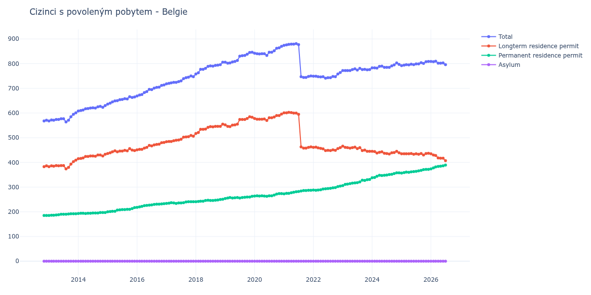

# Belgie

## Souhrnné statistiky (Min/Max pro rok) / Summary Statistics (Min/Max per year)

| Year   | Total     | Longterm Residence Permit   | Permanent Residence Permit   | Asylum   |
|--------|-----------|-----------------------------|------------------------------|----------|
| 2012   | 568 / 571 | 383 / 386                   | 185 / 185                    | 0 / 0    |
| 2013   | 564 / 601 | 374 / 409                   | 185 / 192                    | 0 / 0    |
| 2014   | 608 / 630 | 415 / 433                   | 193 / 197                    | 0 / 0    |
| 2015   | 636 / 666 | 436 / 456                   | 200 / 217                    | 0 / 0    |
| 2016   | 669 / 714 | 451 / 481                   | 218 / 233                    | 0 / 0    |
| 2017   | 718 / 750 | 484 / 509                   | 234 / 241                    | 0 / 0    |
| 2018   | 758 / 806 | 517 / 555                   | 241 / 251                    | 0 / 0    |
| 2019   | 802 / 846 | 545 / 585                   | 254 / 263                    | 0 / 0    |
| 2020   | 833 / 870 | 570 / 596                   | 263 / 274                    | 0 / 0    |
| 2021   | 744 / 881 | 458 / 603                   | 273 / 287                    | 0 / 0    |
| 2022   | 741 / 764 | 448 / 462                   | 287 / 304                    | 0 / 0    |
| 2023   | 772 / 781 | 445 / 466                   | 306 / 331                    | 0 / 0    |
| 2024   | 782 / 803 | 434 / 445                   | 338 / 358                    | 0 / 0    |
| 2025   | 792 / 809 | 430 / 437                   | 357 / 372                    | 0 / 0    |
| 2026   | 796 / 810 | 407 / 435                   | 374 / 389                    | 0 / 0    |

## Detailní tabulka / Detailed Data Table

| Date     | Total         | Longterm Residence Permit   | Permanent Residence Permit   | Asylum   |
|----------|---------------|-----------------------------|------------------------------|----------|
| **2012** |               |                             |                              |          |
| 11.2012  | 568           | 383                         | 185                          | 0        |
| 12.2012  | 571 (+0.53%)  | 386 (+0.78%)                | 185 (+0.00%)                 | 0        |
| **2013** |               |                             |                              |          |
| 01.2013  | 568 (-0.53%)  | 383 (-0.78%)                | 185 (+0.00%)                 | 0        |
| 02.2013  | 572 (+0.70%)  | 386 (+0.78%)                | 186 (+0.54%)                 | 0        |
| 03.2013  | 571 (-0.17%)  | 385 (-0.26%)                | 186 (+0.00%)                 | 0        |
| 04.2013  | 574 (+0.53%)  | 387 (+0.52%)                | 187 (+0.54%)                 | 0        |
| 05.2013  | 574 (+0.00%)  | 386 (-0.26%)                | 188 (+0.53%)                 | 0        |
| 06.2013  | 577 (+0.52%)  | 387 (+0.26%)                | 190 (+1.06%)                 | 0        |
| 07.2013  | 577 (+0.00%)  | 387 (+0.00%)                | 190 (+0.00%)                 | 0        |
| 08.2013  | 564 (-2.25%)  | 374 (-3.36%)                | 190 (+0.00%)                 | 0        |
| 09.2013  | 571 (+1.24%)  | 380 (+1.60%)                | 191 (+0.53%)                 | 0        |
| 10.2013  | 585 (+2.45%)  | 393 (+3.42%)                | 192 (+0.52%)                 | 0        |
| 11.2013  | 595 (+1.71%)  | 403 (+2.54%)                | 192 (+0.00%)                 | 0        |
| 12.2013  | 601 (+1.01%)  | 409 (+1.49%)                | 192 (+0.00%)                 | 0        |
| **2014** |               |                             |                              |          |
| 01.2014  | 608 (+1.16%)  | 415 (+1.47%)                | 193 (+0.52%)                 | 0        |
| 02.2014  | 610 (+0.33%)  | 416 (+0.24%)                | 194 (+0.52%)                 | 0        |
| 03.2014  | 612 (+0.33%)  | 418 (+0.48%)                | 194 (+0.00%)                 | 0        |
| 04.2014  | 617 (+0.82%)  | 424 (+1.44%)                | 193 (-0.52%)                 | 0        |
| 05.2014  | 618 (+0.16%)  | 424 (+0.00%)                | 194 (+0.52%)                 | 0        |
| 06.2014  | 620 (+0.32%)  | 426 (+0.47%)                | 194 (+0.00%)                 | 0        |
| 07.2014  | 621 (+0.16%)  | 426 (+0.00%)                | 195 (+0.52%)                 | 0        |
| 08.2014  | 620 (-0.16%)  | 425 (-0.23%)                | 195 (+0.00%)                 | 0        |
| 09.2014  | 625 (+0.81%)  | 430 (+1.18%)                | 195 (+0.00%)                 | 0        |
| 10.2014  | 627 (+0.32%)  | 430 (+0.00%)                | 197 (+1.03%)                 | 0        |
| 11.2014  | 623 (-0.64%)  | 426 (-0.93%)                | 197 (+0.00%)                 | 0        |
| 12.2014  | 630 (+1.12%)  | 433 (+1.64%)                | 197 (+0.00%)                 | 0        |
| **2015** |               |                             |                              |          |
| 01.2015  | 636 (+0.95%)  | 436 (+0.69%)                | 200 (+1.52%)                 | 0        |
| 02.2015  | 640 (+0.63%)  | 439 (+0.69%)                | 201 (+0.50%)                 | 0        |
| 03.2015  | 645 (+0.78%)  | 443 (+0.91%)                | 202 (+0.50%)                 | 0        |
| 04.2015  | 649 (+0.62%)  | 447 (+0.90%)                | 202 (+0.00%)                 | 0        |
| 05.2015  | 650 (+0.15%)  | 443 (-0.89%)                | 207 (+2.48%)                 | 0        |
| 06.2015  | 654 (+0.62%)  | 446 (+0.68%)                | 208 (+0.48%)                 | 0        |
| 07.2015  | 655 (+0.15%)  | 446 (+0.00%)                | 209 (+0.48%)                 | 0        |
| 08.2015  | 658 (+0.46%)  | 449 (+0.67%)                | 209 (+0.00%)                 | 0        |
| 09.2015  | 657 (-0.15%)  | 447 (-0.45%)                | 210 (+0.48%)                 | 0        |
| 10.2015  | 666 (+1.37%)  | 456 (+2.01%)                | 210 (+0.00%)                 | 0        |
| 11.2015  | 663 (-0.45%)  | 450 (-1.32%)                | 213 (+1.43%)                 | 0        |
| 12.2015  | 665 (+0.30%)  | 448 (-0.44%)                | 217 (+1.88%)                 | 0        |
| **2016** |               |                             |                              |          |
| 01.2016  | 669 (+0.60%)  | 451 (+0.67%)                | 218 (+0.46%)                 | 0        |
| 02.2016  | 673 (+0.60%)  | 453 (+0.44%)                | 220 (+0.92%)                 | 0        |
| 03.2016  | 675 (+0.30%)  | 453 (+0.00%)                | 222 (+0.91%)                 | 0        |
| 04.2016  | 683 (+1.19%)  | 458 (+1.10%)                | 225 (+1.35%)                 | 0        |
| 05.2016  | 687 (+0.59%)  | 461 (+0.66%)                | 226 (+0.44%)                 | 0        |
| 06.2016  | 696 (+1.31%)  | 469 (+1.74%)                | 227 (+0.44%)                 | 0        |
| 07.2016  | 695 (-0.14%)  | 467 (-0.43%)                | 228 (+0.44%)                 | 0        |
| 08.2016  | 701 (+0.86%)  | 471 (+0.86%)                | 230 (+0.88%)                 | 0        |
| 09.2016  | 704 (+0.43%)  | 473 (+0.42%)                | 231 (+0.43%)                 | 0        |
| 10.2016  | 705 (+0.14%)  | 474 (+0.21%)                | 231 (+0.00%)                 | 0        |
| 11.2016  | 712 (+0.99%)  | 480 (+1.27%)                | 232 (+0.43%)                 | 0        |
| 12.2016  | 714 (+0.28%)  | 481 (+0.21%)                | 233 (+0.43%)                 | 0        |
| **2017** |               |                             |                              |          |
| 01.2017  | 718 (+0.56%)  | 484 (+0.62%)                | 234 (+0.43%)                 | 0        |
| 02.2017  | 720 (+0.28%)  | 485 (+0.21%)                | 235 (+0.43%)                 | 0        |
| 03.2017  | 722 (+0.28%)  | 485 (+0.00%)                | 237 (+0.85%)                 | 0        |
| 04.2017  | 724 (+0.28%)  | 488 (+0.62%)                | 236 (-0.42%)                 | 0        |
| 05.2017  | 724 (+0.00%)  | 490 (+0.41%)                | 234 (-0.85%)                 | 0        |
| 06.2017  | 727 (+0.41%)  | 491 (+0.20%)                | 236 (+0.85%)                 | 0        |
| 07.2017  | 730 (+0.41%)  | 494 (+0.61%)                | 236 (+0.00%)                 | 0        |
| 08.2017  | 739 (+1.23%)  | 502 (+1.62%)                | 237 (+0.42%)                 | 0        |
| 09.2017  | 743 (+0.54%)  | 503 (+0.20%)                | 240 (+1.27%)                 | 0        |
| 10.2017  | 745 (+0.27%)  | 504 (+0.20%)                | 241 (+0.42%)                 | 0        |
| 11.2017  | 750 (+0.67%)  | 509 (+0.99%)                | 241 (+0.00%)                 | 0        |
| 12.2017  | 747 (-0.40%)  | 506 (-0.59%)                | 241 (+0.00%)                 | 0        |
| **2018** |               |                             |                              |          |
| 01.2018  | 758 (+1.47%)  | 517 (+2.17%)                | 241 (+0.00%)                 | 0        |
| 02.2018  | 763 (+0.66%)  | 521 (+0.77%)                | 242 (+0.41%)                 | 0        |
| 03.2018  | 777 (+1.83%)  | 534 (+2.50%)                | 243 (+0.41%)                 | 0        |
| 04.2018  | 777 (+0.00%)  | 534 (+0.00%)                | 243 (+0.00%)                 | 0        |
| 05.2018  | 781 (+0.51%)  | 535 (+0.19%)                | 246 (+1.23%)                 | 0        |
| 06.2018  | 789 (+1.02%)  | 542 (+1.31%)                | 247 (+0.41%)                 | 0        |
| 07.2018  | 791 (+0.25%)  | 545 (+0.55%)                | 246 (-0.40%)                 | 0        |
| 08.2018  | 790 (-0.13%)  | 544 (-0.18%)                | 246 (+0.00%)                 | 0        |
| 09.2018  | 793 (+0.38%)  | 546 (+0.37%)                | 247 (+0.41%)                 | 0        |
| 10.2018  | 794 (+0.13%)  | 546 (+0.00%)                | 248 (+0.40%)                 | 0        |
| 11.2018  | 796 (+0.25%)  | 546 (+0.00%)                | 250 (+0.81%)                 | 0        |
| 12.2018  | 806 (+1.26%)  | 555 (+1.65%)                | 251 (+0.40%)                 | 0        |
| **2019** |               |                             |                              |          |
| 01.2019  | 806 (+0.00%)  | 552 (-0.54%)                | 254 (+1.20%)                 | 0        |
| 02.2019  | 802 (-0.50%)  | 546 (-1.09%)                | 256 (+0.79%)                 | 0        |
| 03.2019  | 803 (+0.12%)  | 545 (-0.18%)                | 258 (+0.78%)                 | 0        |
| 04.2019  | 807 (+0.50%)  | 551 (+1.10%)                | 256 (-0.78%)                 | 0        |
| 05.2019  | 809 (+0.25%)  | 552 (+0.18%)                | 257 (+0.39%)                 | 0        |
| 06.2019  | 813 (+0.49%)  | 555 (+0.54%)                | 258 (+0.39%)                 | 0        |
| 07.2019  | 830 (+2.09%)  | 574 (+3.42%)                | 256 (-0.78%)                 | 0        |
| 08.2019  | 832 (+0.24%)  | 574 (+0.00%)                | 258 (+0.78%)                 | 0        |
| 09.2019  | 833 (+0.12%)  | 574 (+0.00%)                | 259 (+0.39%)                 | 0        |
| 10.2019  | 838 (+0.60%)  | 578 (+0.70%)                | 260 (+0.39%)                 | 0        |
| 11.2019  | 845 (+0.84%)  | 585 (+1.21%)                | 260 (+0.00%)                 | 0        |
| 12.2019  | 846 (+0.12%)  | 583 (-0.34%)                | 263 (+1.15%)                 | 0        |
| **2020** |               |                             |                              |          |
| 01.2020  | 842 (-0.47%)  | 578 (-0.86%)                | 264 (+0.38%)                 | 0        |
| 02.2020  | 840 (-0.24%)  | 575 (-0.52%)                | 265 (+0.38%)                 | 0        |
| 03.2020  | 839 (-0.12%)  | 575 (+0.00%)                | 264 (-0.38%)                 | 0        |
| 04.2020  | 840 (+0.12%)  | 575 (+0.00%)                | 265 (+0.38%)                 | 0        |
| 05.2020  | 840 (+0.00%)  | 576 (+0.17%)                | 264 (-0.38%)                 | 0        |
| 06.2020  | 833 (-0.83%)  | 570 (-1.04%)                | 263 (-0.38%)                 | 0        |
| 07.2020  | 846 (+1.56%)  | 581 (+1.93%)                | 265 (+0.76%)                 | 0        |
| 08.2020  | 846 (+0.00%)  | 581 (+0.00%)                | 265 (+0.00%)                 | 0        |
| 09.2020  | 852 (+0.71%)  | 584 (+0.52%)                | 268 (+1.13%)                 | 0        |
| 10.2020  | 862 (+1.17%)  | 590 (+1.03%)                | 272 (+1.49%)                 | 0        |
| 11.2020  | 864 (+0.23%)  | 590 (+0.00%)                | 274 (+0.74%)                 | 0        |
| 12.2020  | 870 (+0.69%)  | 596 (+1.02%)                | 274 (+0.00%)                 | 0        |
| **2021** |               |                             |                              |          |
| 01.2021  | 874 (+0.46%)  | 601 (+0.84%)                | 273 (-0.36%)                 | 0        |
| 02.2021  | 876 (+0.23%)  | 601 (+0.00%)                | 275 (+0.73%)                 | 0        |
| 03.2021  | 878 (+0.23%)  | 603 (+0.33%)                | 275 (+0.00%)                 | 0        |
| 04.2021  | 879 (+0.11%)  | 602 (-0.17%)                | 277 (+0.73%)                 | 0        |
| 05.2021  | 879 (+0.00%)  | 600 (-0.33%)                | 279 (+0.72%)                 | 0        |
| 06.2021  | 881 (+0.23%)  | 600 (+0.00%)                | 281 (+0.72%)                 | 0        |
| 07.2021  | 877 (-0.45%)  | 595 (-0.83%)                | 282 (+0.36%)                 | 0        |
| 08.2021  | 747 (-14.82%) | 463 (-22.18%)               | 284 (+0.71%)                 | 0        |
| 09.2021  | 744 (-0.40%)  | 458 (-1.08%)                | 286 (+0.70%)                 | 0        |
| 10.2021  | 744 (+0.00%)  | 458 (+0.00%)                | 286 (+0.00%)                 | 0        |
| 11.2021  | 748 (+0.54%)  | 461 (+0.66%)                | 287 (+0.35%)                 | 0        |
| 12.2021  | 750 (+0.27%)  | 463 (+0.43%)                | 287 (+0.00%)                 | 0        |
| **2022** |               |                             |                              |          |
| 01.2022  | 749 (-0.13%)  | 461 (-0.43%)                | 288 (+0.35%)                 | 0        |
| 02.2022  | 749 (+0.00%)  | 462 (+0.22%)                | 287 (-0.35%)                 | 0        |
| 03.2022  | 747 (-0.27%)  | 459 (-0.65%)                | 288 (+0.35%)                 | 0        |
| 04.2022  | 746 (-0.13%)  | 457 (-0.44%)                | 289 (+0.35%)                 | 0        |
| 05.2022  | 747 (+0.13%)  | 455 (-0.44%)                | 292 (+1.04%)                 | 0        |
| 06.2022  | 741 (-0.80%)  | 448 (-1.54%)                | 293 (+0.34%)                 | 0        |
| 07.2022  | 743 (+0.27%)  | 449 (+0.22%)                | 294 (+0.34%)                 | 0        |
| 08.2022  | 743 (+0.00%)  | 448 (-0.22%)                | 295 (+0.34%)                 | 0        |
| 09.2022  | 748 (+0.67%)  | 451 (+0.67%)                | 297 (+0.68%)                 | 0        |
| 10.2022  | 747 (-0.13%)  | 449 (-0.44%)                | 298 (+0.34%)                 | 0        |
| 11.2022  | 758 (+1.47%)  | 456 (+1.56%)                | 302 (+1.34%)                 | 0        |
| 12.2022  | 764 (+0.79%)  | 460 (+0.88%)                | 304 (+0.66%)                 | 0        |
| **2023** |               |                             |                              |          |
| 01.2023  | 772 (+1.05%)  | 466 (+1.30%)                | 306 (+0.66%)                 | 0        |
| 02.2023  | 772 (+0.00%)  | 461 (-1.07%)                | 311 (+1.63%)                 | 0        |
| 03.2023  | 772 (+0.00%)  | 460 (-0.22%)                | 312 (+0.32%)                 | 0        |
| 04.2023  | 772 (+0.00%)  | 458 (-0.43%)                | 314 (+0.64%)                 | 0        |
| 05.2023  | 776 (+0.52%)  | 460 (+0.44%)                | 316 (+0.64%)                 | 0        |
| 06.2023  | 779 (+0.39%)  | 462 (+0.43%)                | 317 (+0.32%)                 | 0        |
| 07.2023  | 774 (-0.64%)  | 456 (-1.30%)                | 318 (+0.32%)                 | 0        |
| 08.2023  | 781 (+0.90%)  | 460 (+0.88%)                | 321 (+0.94%)                 | 0        |
| 09.2023  | 776 (-0.64%)  | 448 (-2.61%)                | 328 (+2.18%)                 | 0        |
| 10.2023  | 777 (+0.13%)  | 450 (+0.45%)                | 327 (-0.30%)                 | 0        |
| 11.2023  | 775 (-0.26%)  | 445 (-1.11%)                | 330 (+0.92%)                 | 0        |
| 12.2023  | 776 (+0.13%)  | 445 (+0.00%)                | 331 (+0.30%)                 | 0        |
| **2024** |               |                             |                              |          |
| 01.2024  | 783 (+0.90%)  | 445 (+0.00%)                | 338 (+2.11%)                 | 0        |
| 02.2024  | 783 (+0.00%)  | 444 (-0.22%)                | 339 (+0.30%)                 | 0        |
| 03.2024  | 782 (-0.13%)  | 438 (-1.35%)                | 344 (+1.47%)                 | 0        |
| 04.2024  | 789 (+0.90%)  | 441 (+0.68%)                | 348 (+1.16%)                 | 0        |
| 05.2024  | 790 (+0.13%)  | 443 (+0.45%)                | 347 (-0.29%)                 | 0        |
| 06.2024  | 785 (-0.63%)  | 437 (-1.35%)                | 348 (+0.29%)                 | 0        |
| 07.2024  | 785 (+0.00%)  | 436 (-0.23%)                | 349 (+0.29%)                 | 0        |
| 08.2024  | 785 (+0.00%)  | 434 (-0.46%)                | 351 (+0.57%)                 | 0        |
| 09.2024  | 791 (+0.76%)  | 439 (+1.15%)                | 352 (+0.28%)                 | 0        |
| 10.2024  | 795 (+0.51%)  | 440 (+0.23%)                | 355 (+0.85%)                 | 0        |
| 11.2024  | 803 (+1.01%)  | 445 (+1.14%)                | 358 (+0.85%)                 | 0        |
| 12.2024  | 797 (-0.75%)  | 439 (-1.35%)                | 358 (+0.00%)                 | 0        |
| **2025** |               |                             |                              |          |
| 01.2025  | 792 (-0.63%)  | 435 (-0.91%)                | 357 (-0.28%)                 | 0        |
| 02.2025  | 794 (+0.25%)  | 435 (+0.00%)                | 359 (+0.56%)                 | 0        |
| 03.2025  | 796 (+0.25%)  | 435 (+0.00%)                | 361 (+0.56%)                 | 0        |
| 04.2025  | 795 (-0.13%)  | 435 (+0.00%)                | 360 (-0.28%)                 | 0        |
| 05.2025  | 798 (+0.38%)  | 436 (+0.23%)                | 362 (+0.56%)                 | 0        |
| 06.2025  | 796 (-0.25%)  | 433 (-0.69%)                | 363 (+0.28%)                 | 0        |
| 07.2025  | 799 (+0.38%)  | 435 (+0.46%)                | 364 (+0.28%)                 | 0        |
| 08.2025  | 799 (+0.00%)  | 433 (-0.46%)                | 366 (+0.55%)                 | 0        |
| 09.2025  | 804 (+0.63%)  | 436 (+0.69%)                | 368 (+0.55%)                 | 0        |
| 10.2025  | 801 (-0.37%)  | 430 (-1.38%)                | 371 (+0.82%)                 | 0        |
| 11.2025  | 808 (+0.87%)  | 436 (+1.40%)                | 372 (+0.27%)                 | 0        |
| 12.2025  | 809 (+0.12%)  | 437 (+0.23%)                | 372 (+0.00%)                 | 0        |
| **2026** |               |                             |                              |          |
| 01.2026  | 809 (+0.00%)  | 435 (-0.46%)                | 374 (+0.54%)                 | 0        |
| 02.2026  | 808 (-0.12%)  | 430 (-1.15%)                | 378 (+1.07%)                 | 0        |
| 03.2026  | 810 (+0.25%)  | 428 (-0.47%)                | 382 (+1.06%)                 | 0        |
| 04.2026  | 802 (-0.99%)  | 418 (-2.34%)                | 384 (+0.52%)                 | 0        |
| 05.2026  | 802 (+0.00%)  | 417 (-0.24%)                | 385 (+0.26%)                 | 0        |
| 06.2026  | 803 (+0.12%)  | 417 (+0.00%)                | 386 (+0.26%)                 | 0        |
| 07.2026  | 796 (-0.87%)  | 407 (-2.40%)                | 389 (+0.78%)                 | 0        |
