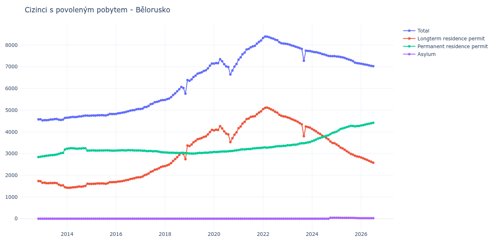

# Bělorusko

## Souhrnné statistiky (Min/Max pro rok) / Summary Statistics (Min/Max per year)

| Year   | Total         | Longterm Residence Permit   | Permanent Residence Permit   | Asylum   |
|--------|---------------|-----------------------------|------------------------------|----------|
| 2012   | 4 577 / 4 579 | 1 724 / 1 735               | 2 842 / 2 855                | 0 / 0    |
| 2013   | 4 530 / 4 642 | 1 451 / 1 661               | 2 874 / 3 191                | 0 / 0    |
| 2014   | 4 654 / 4 754 | 1 422 / 1 613               | 3 140 / 3 248                | 0 / 0    |
| 2015   | 4 750 / 4 827 | 1 605 / 1 690               | 3 135 / 3 151                | 0 / 0    |
| 2016   | 4 828 / 5 054 | 1 689 / 1 908               | 3 139 / 3 160                | 0 / 0    |
| 2017   | 5 054 / 5 468 | 1 910 / 2 409               | 3 059 / 3 144                | 0 / 0    |
| 2018   | 5 474 / 6 390 | 2 422 / 3 372               | 3 018 / 3 052                | 0 / 0    |
| 2019   | 6 356 / 7 150 | 3 347 / 4 092               | 3 002 / 3 058                | 0 / 0    |
| 2020   | 6 645 / 7 349 | 3 527 / 4 262               | 3 071 / 3 147                | 0 / 0    |
| 2021   | 7 330 / 8 211 | 4 168 / 4 948               | 3 162 / 3 263                | 0 / 0    |
| 2022   | 8 064 / 8 394 | 4 705 / 5 120               | 3 270 / 3 359                | 0 / 0    |
| 2023   | 7 280 / 8 050 | 3 803 / 4 666               | 3 382 / 3 528                | 0 / 0    |
| 2024   | 7 488 / 7 702 | 3 475 / 4 133               | 3 569 / 3 977                | 0 / 42   |
| 2025   | 7 157 / 7 473 | 2 856 / 3 417               | 4 014 / 4 277                | 26 / 42  |

## Detailní tabulka / Detailed Data Table

| Date     | Total           | Longterm Residence Permit   | Permanent Residence Permit   | Asylum       |
|----------|-----------------|-----------------------------|------------------------------|--------------|
| **2012** |                 |                             |                              |              |
| 11.2012  | 4 577           | 1 735                       | 2 842                        | 0            |
| 12.2012  | 4 579 (+0.04%)  | 1 724 (-0.63%)              | 2 855 (+0.46%)               | 0            |
| **2013** |                 |                             |                              |              |
| 01.2013  | 4 530 (-1.07%)  | 1 656 (-3.94%)              | 2 874 (+0.67%)               | 0            |
| 02.2013  | 4 545 (+0.33%)  | 1 661 (+0.30%)              | 2 884 (+0.35%)               | 0            |
| 03.2013  | 4 537 (-0.18%)  | 1 635 (-1.57%)              | 2 902 (+0.62%)               | 0            |
| 04.2013  | 4 546 (+0.20%)  | 1 634 (-0.06%)              | 2 912 (+0.34%)               | 0            |
| 05.2013  | 4 570 (+0.53%)  | 1 644 (+0.61%)              | 2 926 (+0.48%)               | 0            |
| 06.2013  | 4 572 (+0.04%)  | 1 639 (-0.30%)              | 2 933 (+0.24%)               | 0            |
| 07.2013  | 4 590 (+0.39%)  | 1 649 (+0.61%)              | 2 941 (+0.27%)               | 0            |
| 08.2013  | 4 594 (+0.09%)  | 1 634 (-0.91%)              | 2 960 (+0.65%)               | 0            |
| 09.2013  | 4 562 (-0.70%)  | 1 572 (-3.79%)              | 2 990 (+1.01%)               | 0            |
| 10.2013  | 4 550 (-0.26%)  | 1 530 (-2.67%)              | 3 020 (+1.00%)               | 0            |
| 11.2013  | 4 567 (+0.37%)  | 1 537 (+0.46%)              | 3 030 (+0.33%)               | 0            |
| 12.2013  | 4 642 (+1.64%)  | 1 451 (-5.60%)              | 3 191 (+5.31%)               | 0            |
| **2014** |                 |                             |                              |              |
| 01.2014  | 4 654 (+0.26%)  | 1 428 (-1.59%)              | 3 226 (+1.10%)               | 0            |
| 02.2014  | 4 663 (+0.19%)  | 1 422 (-0.42%)              | 3 241 (+0.46%)               | 0            |
| 03.2014  | 4 679 (+0.34%)  | 1 431 (+0.63%)              | 3 248 (+0.22%)               | 0            |
| 04.2014  | 4 690 (+0.24%)  | 1 447 (+1.12%)              | 3 243 (-0.15%)               | 0            |
| 05.2014  | 4 682 (-0.17%)  | 1 450 (+0.21%)              | 3 232 (-0.34%)               | 0            |
| 06.2014  | 4 688 (+0.13%)  | 1 465 (+1.03%)              | 3 223 (-0.28%)               | 0            |
| 07.2014  | 4 715 (+0.58%)  | 1 483 (+1.23%)              | 3 232 (+0.28%)               | 0            |
| 08.2014  | 4 712 (-0.06%)  | 1 477 (-0.40%)              | 3 235 (+0.09%)               | 0            |
| 09.2014  | 4 738 (+0.55%)  | 1 491 (+0.95%)              | 3 247 (+0.37%)               | 0            |
| 10.2014  | 4 753 (+0.32%)  | 1 511 (+1.34%)              | 3 242 (-0.15%)               | 0            |
| 11.2014  | 4 754 (+0.02%)  | 1 613 (+6.75%)              | 3 141 (-3.12%)               | 0            |
| 12.2014  | 4 743 (-0.23%)  | 1 603 (-0.62%)              | 3 140 (-0.03%)               | 0            |
| **2015** |                 |                             |                              |              |
| 01.2015  | 4 750 (+0.15%)  | 1 605 (+0.12%)              | 3 145 (+0.16%)               | 0            |
| 02.2015  | 4 758 (+0.17%)  | 1 607 (+0.12%)              | 3 151 (+0.19%)               | 0            |
| 03.2015  | 4 751 (-0.15%)  | 1 611 (+0.25%)              | 3 140 (-0.35%)               | 0            |
| 04.2015  | 4 764 (+0.27%)  | 1 626 (+0.93%)              | 3 138 (-0.06%)               | 0            |
| 05.2015  | 4 765 (+0.02%)  | 1 622 (-0.25%)              | 3 143 (+0.16%)               | 0            |
| 06.2015  | 4 771 (+0.13%)  | 1 629 (+0.43%)              | 3 142 (-0.03%)               | 0            |
| 07.2015  | 4 765 (-0.13%)  | 1 620 (-0.55%)              | 3 145 (+0.10%)               | 0            |
| 08.2015  | 4 757 (-0.17%)  | 1 610 (-0.62%)              | 3 147 (+0.06%)               | 0            |
| 09.2015  | 4 784 (+0.57%)  | 1 635 (+1.55%)              | 3 149 (+0.06%)               | 0            |
| 10.2015  | 4 827 (+0.90%)  | 1 682 (+2.87%)              | 3 145 (-0.13%)               | 0            |
| 11.2015  | 4 822 (-0.10%)  | 1 685 (+0.18%)              | 3 137 (-0.25%)               | 0            |
| 12.2015  | 4 825 (+0.06%)  | 1 690 (+0.30%)              | 3 135 (-0.06%)               | 0            |
| **2016** |                 |                             |                              |              |
| 01.2016  | 4 828 (+0.06%)  | 1 689 (-0.06%)              | 3 139 (+0.13%)               | 0            |
| 02.2016  | 4 857 (+0.60%)  | 1 713 (+1.42%)              | 3 144 (+0.16%)               | 0            |
| 03.2016  | 4 865 (+0.16%)  | 1 717 (+0.23%)              | 3 148 (+0.13%)               | 0            |
| 04.2016  | 4 885 (+0.41%)  | 1 733 (+0.93%)              | 3 152 (+0.13%)               | 0            |
| 05.2016  | 4 899 (+0.29%)  | 1 752 (+1.10%)              | 3 147 (-0.16%)               | 0            |
| 06.2016  | 4 924 (+0.51%)  | 1 778 (+1.48%)              | 3 146 (-0.03%)               | 0            |
| 07.2016  | 4 950 (+0.53%)  | 1 790 (+0.67%)              | 3 160 (+0.45%)               | 0            |
| 08.2016  | 4 981 (+0.63%)  | 1 826 (+2.01%)              | 3 155 (-0.16%)               | 0            |
| 09.2016  | 4 998 (+0.34%)  | 1 844 (+0.99%)              | 3 154 (-0.03%)               | 0            |
| 10.2016  | 5 005 (+0.14%)  | 1 862 (+0.98%)              | 3 143 (-0.35%)               | 0            |
| 11.2016  | 5 042 (+0.74%)  | 1 897 (+1.88%)              | 3 145 (+0.06%)               | 0            |
| 12.2016  | 5 054 (+0.24%)  | 1 908 (+0.58%)              | 3 146 (+0.03%)               | 0            |
| **2017** |                 |                             |                              |              |
| 01.2017  | 5 054 (+0.00%)  | 1 910 (+0.10%)              | 3 144 (-0.06%)               | 0            |
| 02.2017  | 5 075 (+0.42%)  | 1 946 (+1.88%)              | 3 129 (-0.48%)               | 0            |
| 03.2017  | 5 141 (+1.30%)  | 2 007 (+3.13%)              | 3 134 (+0.16%)               | 0            |
| 04.2017  | 5 151 (+0.19%)  | 2 035 (+1.40%)              | 3 116 (-0.57%)               | 0            |
| 05.2017  | 5 200 (+0.95%)  | 2 083 (+2.36%)              | 3 117 (+0.03%)               | 0            |
| 06.2017  | 5 276 (+1.46%)  | 2 156 (+3.50%)              | 3 120 (+0.10%)               | 0            |
| 07.2017  | 5 297 (+0.40%)  | 2 190 (+1.58%)              | 3 107 (-0.42%)               | 0            |
| 08.2017  | 5 369 (+1.36%)  | 2 258 (+3.11%)              | 3 111 (+0.13%)               | 0            |
| 09.2017  | 5 384 (+0.28%)  | 2 277 (+0.84%)              | 3 107 (-0.13%)               | 0            |
| 10.2017  | 5 413 (+0.54%)  | 2 324 (+2.06%)              | 3 089 (-0.58%)               | 0            |
| 11.2017  | 5 452 (+0.72%)  | 2 383 (+2.54%)              | 3 069 (-0.65%)               | 0            |
| 12.2017  | 5 468 (+0.29%)  | 2 409 (+1.09%)              | 3 059 (-0.33%)               | 0            |
| **2018** |                 |                             |                              |              |
| 01.2018  | 5 474 (+0.11%)  | 2 422 (+0.54%)              | 3 052 (-0.23%)               | 0            |
| 02.2018  | 5 511 (+0.68%)  | 2 462 (+1.65%)              | 3 049 (-0.10%)               | 0            |
| 03.2018  | 5 534 (+0.42%)  | 2 493 (+1.26%)              | 3 041 (-0.26%)               | 0            |
| 04.2018  | 5 602 (+1.23%)  | 2 561 (+2.73%)              | 3 041 (+0.00%)               | 0            |
| 05.2018  | 5 698 (+1.71%)  | 2 660 (+3.87%)              | 3 038 (-0.10%)               | 0            |
| 06.2018  | 5 778 (+1.40%)  | 2 746 (+3.23%)              | 3 032 (-0.20%)               | 0            |
| 07.2018  | 5 870 (+1.59%)  | 2 836 (+3.28%)              | 3 034 (+0.07%)               | 0            |
| 08.2018  | 5 965 (+1.62%)  | 2 940 (+3.67%)              | 3 025 (-0.30%)               | 0            |
| 09.2018  | 6 068 (+1.73%)  | 3 036 (+3.27%)              | 3 032 (+0.23%)               | 0            |
| 10.2018  | 6 022 (-0.76%)  | 2 988 (-1.58%)              | 3 034 (+0.07%)               | 0            |
| 11.2018  | 5 764 (-4.28%)  | 2 739 (-8.33%)              | 3 025 (-0.30%)               | 0            |
| 12.2018  | 6 390 (+10.86%) | 3 372 (+23.11%)             | 3 018 (-0.23%)               | 0            |
| **2019** |                 |                             |                              |              |
| 01.2019  | 6 356 (-0.53%)  | 3 347 (-0.74%)              | 3 009 (-0.30%)               | 0            |
| 02.2019  | 6 421 (+1.02%)  | 3 419 (+2.15%)              | 3 002 (-0.23%)               | 0            |
| 03.2019  | 6 525 (+1.62%)  | 3 521 (+2.98%)              | 3 004 (+0.07%)               | 0            |
| 04.2019  | 6 593 (+1.04%)  | 3 586 (+1.85%)              | 3 007 (+0.10%)               | 0            |
| 05.2019  | 6 683 (+1.37%)  | 3 661 (+2.09%)              | 3 022 (+0.50%)               | 0            |
| 06.2019  | 6 717 (+0.51%)  | 3 684 (+0.63%)              | 3 033 (+0.36%)               | 0            |
| 07.2019  | 6 745 (+0.42%)  | 3 718 (+0.92%)              | 3 027 (-0.20%)               | 0            |
| 08.2019  | 6 804 (+0.87%)  | 3 766 (+1.29%)              | 3 038 (+0.36%)               | 0            |
| 09.2019  | 6 837 (+0.49%)  | 3 794 (+0.74%)              | 3 043 (+0.16%)               | 0            |
| 10.2019  | 6 926 (+1.30%)  | 3 884 (+2.37%)              | 3 042 (-0.03%)               | 0            |
| 11.2019  | 7 051 (+1.80%)  | 3 994 (+2.83%)              | 3 057 (+0.49%)               | 0            |
| 12.2019  | 7 150 (+1.40%)  | 4 092 (+2.45%)              | 3 058 (+0.03%)               | 0            |
| **2020** |                 |                             |                              |              |
| 01.2020  | 7 147 (-0.04%)  | 4 069 (-0.56%)              | 3 078 (+0.65%)               | 0            |
| 02.2020  | 7 172 (+0.35%)  | 4 101 (+0.79%)              | 3 071 (-0.23%)               | 0            |
| 03.2020  | 7 165 (-0.10%)  | 4 087 (-0.34%)              | 3 078 (+0.23%)               | 0            |
| 04.2020  | 7 349 (+2.57%)  | 4 262 (+4.28%)              | 3 087 (+0.29%)               | 0            |
| 05.2020  | 7 255 (-1.28%)  | 4 159 (-2.42%)              | 3 096 (+0.29%)               | 0            |
| 06.2020  | 7 118 (-1.89%)  | 4 020 (-3.34%)              | 3 098 (+0.06%)               | 0            |
| 07.2020  | 7 019 (-1.39%)  | 3 921 (-2.46%)              | 3 098 (+0.00%)               | 0            |
| 08.2020  | 6 990 (-0.41%)  | 3 882 (-0.99%)              | 3 108 (+0.32%)               | 0            |
| 09.2020  | 6 645 (-4.94%)  | 3 527 (-9.14%)              | 3 118 (+0.32%)               | 0            |
| 10.2020  | 6 829 (+2.77%)  | 3 708 (+5.13%)              | 3 121 (+0.10%)               | 0            |
| 11.2020  | 7 011 (+2.67%)  | 3 870 (+4.37%)              | 3 141 (+0.64%)               | 0            |
| 12.2020  | 7 127 (+1.65%)  | 3 980 (+2.84%)              | 3 147 (+0.19%)               | 0            |
| **2021** |                 |                             |                              |              |
| 01.2021  | 7 330 (+2.85%)  | 4 168 (+4.72%)              | 3 162 (+0.48%)               | 0            |
| 02.2021  | 7 438 (+1.47%)  | 4 251 (+1.99%)              | 3 187 (+0.79%)               | 0            |
| 03.2021  | 7 577 (+1.87%)  | 4 381 (+3.06%)              | 3 196 (+0.28%)               | 0            |
| 04.2021  | 7 655 (+1.03%)  | 4 464 (+1.89%)              | 3 191 (-0.16%)               | 0            |
| 05.2021  | 7 798 (+1.87%)  | 4 592 (+2.87%)              | 3 206 (+0.47%)               | 0            |
| 06.2021  | 7 825 (+0.35%)  | 4 616 (+0.52%)              | 3 209 (+0.09%)               | 0            |
| 07.2021  | 7 898 (+0.93%)  | 4 689 (+1.58%)              | 3 209 (+0.00%)               | 0            |
| 08.2021  | 7 941 (+0.54%)  | 4 709 (+0.43%)              | 3 232 (+0.72%)               | 0            |
| 09.2021  | 7 969 (+0.35%)  | 4 723 (+0.30%)              | 3 246 (+0.43%)               | 0            |
| 10.2021  | 8 065 (+1.20%)  | 4 814 (+1.93%)              | 3 251 (+0.15%)               | 0            |
| 11.2021  | 8 147 (+1.02%)  | 4 891 (+1.60%)              | 3 256 (+0.15%)               | 0            |
| 12.2021  | 8 211 (+0.79%)  | 4 948 (+1.17%)              | 3 263 (+0.21%)               | 0            |
| **2022** |                 |                             |                              |              |
| 01.2022  | 8 327 (+1.41%)  | 5 049 (+2.04%)              | 3 278 (+0.46%)               | 0            |
| 02.2022  | 8 394 (+0.80%)  | 5 108 (+1.17%)              | 3 286 (+0.24%)               | 0            |
| 03.2022  | 8 390 (-0.05%)  | 5 120 (+0.23%)              | 3 270 (-0.49%)               | 0            |
| 04.2022  | 8 367 (-0.27%)  | 5 082 (-0.74%)              | 3 285 (+0.46%)               | 0            |
| 05.2022  | 8 325 (-0.50%)  | 5 036 (-0.91%)              | 3 289 (+0.12%)               | 0            |
| 06.2022  | 8 301 (-0.29%)  | 4 994 (-0.83%)              | 3 307 (+0.55%)               | 0            |
| 07.2022  | 8 253 (-0.58%)  | 4 929 (-1.30%)              | 3 324 (+0.51%)               | 0            |
| 08.2022  | 8 225 (-0.34%)  | 4 885 (-0.89%)              | 3 340 (+0.48%)               | 0            |
| 09.2022  | 8 134 (-1.11%)  | 4 792 (-1.90%)              | 3 342 (+0.06%)               | 0            |
| 10.2022  | 8 087 (-0.58%)  | 4 742 (-1.04%)              | 3 345 (+0.09%)               | 0            |
| 11.2022  | 8 072 (-0.19%)  | 4 716 (-0.55%)              | 3 356 (+0.33%)               | 0            |
| 12.2022  | 8 064 (-0.10%)  | 4 705 (-0.23%)              | 3 359 (+0.09%)               | 0            |
| **2023** |                 |                             |                              |              |
| 01.2023  | 8 050 (-0.17%)  | 4 666 (-0.83%)              | 3 384 (+0.74%)               | 0            |
| 02.2023  | 8 019 (-0.39%)  | 4 637 (-0.62%)              | 3 382 (-0.06%)               | 0            |
| 03.2023  | 7 986 (-0.41%)  | 4 590 (-1.01%)              | 3 396 (+0.41%)               | 0            |
| 04.2023  | 7 963 (-0.29%)  | 4 554 (-0.78%)              | 3 409 (+0.38%)               | 0            |
| 05.2023  | 7 925 (-0.48%)  | 4 516 (-0.83%)              | 3 409 (+0.00%)               | 0            |
| 06.2023  | 7 896 (-0.37%)  | 4 466 (-1.11%)              | 3 430 (+0.62%)               | 0            |
| 07.2023  | 7 865 (-0.39%)  | 4 405 (-1.37%)              | 3 460 (+0.87%)               | 0            |
| 08.2023  | 7 825 (-0.51%)  | 4 348 (-1.29%)              | 3 477 (+0.49%)               | 0            |
| 09.2023  | 7 280 (-6.96%)  | 3 803 (-12.53%)             | 3 477 (+0.00%)               | 0            |
| 10.2023  | 7 743 (+6.36%)  | 4 250 (+11.75%)             | 3 493 (+0.46%)               | 0            |
| 11.2023  | 7 731 (-0.15%)  | 4 219 (-0.73%)              | 3 512 (+0.54%)               | 0            |
| 12.2023  | 7 726 (-0.06%)  | 4 198 (-0.50%)              | 3 528 (+0.46%)               | 0            |
| **2024** |                 |                             |                              |              |
| 01.2024  | 7 702 (-0.31%)  | 4 133 (-1.55%)              | 3 569 (+1.16%)               | 0            |
| 02.2024  | 7 680 (-0.29%)  | 4 077 (-1.35%)              | 3 603 (+0.95%)               | 0            |
| 03.2024  | 7 671 (-0.12%)  | 4 026 (-1.25%)              | 3 645 (+1.17%)               | 0            |
| 04.2024  | 7 651 (-0.26%)  | 3 957 (-1.71%)              | 3 694 (+1.34%)               | 0            |
| 05.2024  | 7 625 (-0.34%)  | 3 903 (-1.36%)              | 3 722 (+0.76%)               | 0            |
| 06.2024  | 7 586 (-0.51%)  | 3 828 (-1.92%)              | 3 758 (+0.97%)               | 0            |
| 07.2024  | 7 567 (-0.25%)  | 3 784 (-1.15%)              | 3 783 (+0.67%)               | 0            |
| 08.2024  | 7 537 (-0.40%)  | 3 718 (-1.74%)              | 3 819 (+0.95%)               | 0            |
| 09.2024  | 7 501 (-0.48%)  | 3 655 (-1.69%)              | 3 846 (+0.71%)               | 0            |
| 10.2024  | 7 494 (-0.09%)  | 3 555 (-2.74%)              | 3 897 (+1.33%)               | 42           |
| 11.2024  | 7 488 (-0.08%)  | 3 490 (-1.83%)              | 3 956 (+1.51%)               | 42 (+0.00%)  |
| 12.2024  | 7 494 (+0.08%)  | 3 475 (-0.43%)              | 3 977 (+0.53%)               | 42 (+0.00%)  |
| **2025** |                 |                             |                              |              |
| 01.2025  | 7 473 (-0.28%)  | 3 417 (-1.67%)              | 4 014 (+0.93%)               | 42 (+0.00%)  |
| 02.2025  | 7 469 (-0.05%)  | 3 357 (-1.76%)              | 4 071 (+1.42%)               | 41 (-2.38%)  |
| 03.2025  | 7 451 (-0.24%)  | 3 278 (-2.35%)              | 4 133 (+1.52%)               | 40 (-2.44%)  |
| 04.2025  | 7 436 (-0.20%)  | 3 237 (-1.25%)              | 4 159 (+0.63%)               | 40 (+0.00%)  |
| 05.2025  | 7 406 (-0.40%)  | 3 179 (-1.79%)              | 4 187 (+0.67%)               | 40 (+0.00%)  |
| 06.2025  | 7 371 (-0.47%)  | 3 111 (-2.14%)              | 4 220 (+0.79%)               | 40 (+0.00%)  |
| 07.2025  | 7 337 (-0.46%)  | 3 051 (-1.93%)              | 4 247 (+0.64%)               | 39 (-2.50%)  |
| 08.2025  | 7 306 (-0.42%)  | 2 990 (-2.00%)              | 4 277 (+0.71%)               | 39 (+0.00%)  |
| 09.2025  | 7 267 (-0.53%)  | 2 953 (-1.24%)              | 4 275 (-0.05%)               | 39 (+0.00%)  |
| 10.2025  | 7 192 (-1.03%)  | 2 902 (-1.73%)              | 4 256 (-0.44%)               | 34 (-12.82%) |
| 11.2025  | 7 170 (-0.31%)  | 2 871 (-1.07%)              | 4 270 (+0.33%)               | 29 (-14.71%) |
| 12.2025  | 7 157 (-0.18%)  | 2 856 (-0.52%)              | 4 275 (+0.12%)               | 26 (-10.34%) |
