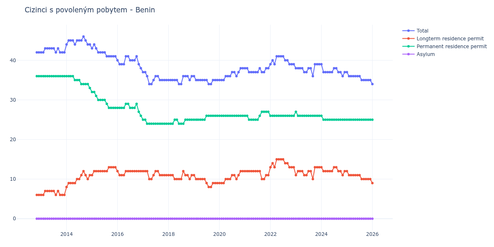

# Benin

## Souhrnné statistiky (Min/Max pro rok) / Summary Statistics (Min/Max per year)

| Year   | Total   | Longterm Residence Permit   | Permanent Residence Permit   | Asylum   |
|--------|---------|-----------------------------|------------------------------|----------|
| 2012   | 42 / 42 | 6 / 6                       | 36 / 36                      | 0 / 0    |
| 2013   | 42 / 43 | 6 / 7                       | 36 / 36                      | 0 / 0    |
| 2014   | 44 / 46 | 8 / 12                      | 33 / 36                      | 0 / 0    |
| 2015   | 41 / 44 | 11 / 13                     | 28 / 32                      | 0 / 0    |
| 2016   | 38 / 41 | 11 / 12                     | 26 / 29                      | 0 / 0    |
| 2017   | 34 / 37 | 10 / 12                     | 24 / 25                      | 0 / 0    |
| 2018   | 34 / 36 | 10 / 12                     | 24 / 25                      | 0 / 0    |
| 2019   | 34 / 36 | 8 / 11                      | 25 / 26                      | 0 / 0    |
| 2020   | 35 / 38 | 9 / 12                      | 26 / 26                      | 0 / 0    |
| 2021   | 37 / 38 | 10 / 12                     | 25 / 27                      | 0 / 0    |
| 2022   | 39 / 41 | 13 / 15                     | 26 / 26                      | 0 / 0    |
| 2023   | 36 / 39 | 10 / 13                     | 26 / 27                      | 0 / 0    |
| 2024   | 36 / 39 | 11 / 13                     | 25 / 26                      | 0 / 0    |
| 2025   | 35 / 37 | 10 / 12                     | 25 / 25                      | 0 / 0    |
| 2026   | 34 / 34 | 9 / 9                       | 25 / 25                      | 0 / 0    |

## Detailní tabulka / Detailed Data Table

| Date     | Total       | Longterm Residence Permit   | Permanent Residence Permit   | Asylum   |
|----------|-------------|-----------------------------|------------------------------|----------|
| **2012** |             |                             |                              |          |
| 11.2012  | 42          | 6                           | 36                           | 0        |
| 12.2012  | 42 (+0.00%) | 6 (+0.00%)                  | 36 (+0.00%)                  | 0        |
| **2013** |             |                             |                              |          |
| 01.2013  | 42 (+0.00%) | 6 (+0.00%)                  | 36 (+0.00%)                  | 0        |
| 02.2013  | 42 (+0.00%) | 6 (+0.00%)                  | 36 (+0.00%)                  | 0        |
| 03.2013  | 43 (+2.38%) | 7 (+16.67%)                 | 36 (+0.00%)                  | 0        |
| 04.2013  | 43 (+0.00%) | 7 (+0.00%)                  | 36 (+0.00%)                  | 0        |
| 05.2013  | 43 (+0.00%) | 7 (+0.00%)                  | 36 (+0.00%)                  | 0        |
| 06.2013  | 43 (+0.00%) | 7 (+0.00%)                  | 36 (+0.00%)                  | 0        |
| 07.2013  | 43 (+0.00%) | 7 (+0.00%)                  | 36 (+0.00%)                  | 0        |
| 08.2013  | 42 (-2.33%) | 6 (-14.29%)                 | 36 (+0.00%)                  | 0        |
| 09.2013  | 43 (+2.38%) | 7 (+16.67%)                 | 36 (+0.00%)                  | 0        |
| 10.2013  | 42 (-2.33%) | 6 (-14.29%)                 | 36 (+0.00%)                  | 0        |
| 11.2013  | 42 (+0.00%) | 6 (+0.00%)                  | 36 (+0.00%)                  | 0        |
| 12.2013  | 42 (+0.00%) | 6 (+0.00%)                  | 36 (+0.00%)                  | 0        |
| **2014** |             |                             |                              |          |
| 01.2014  | 44 (+4.76%) | 8 (+33.33%)                 | 36 (+0.00%)                  | 0        |
| 02.2014  | 45 (+2.27%) | 9 (+12.50%)                 | 36 (+0.00%)                  | 0        |
| 03.2014  | 45 (+0.00%) | 9 (+0.00%)                  | 36 (+0.00%)                  | 0        |
| 04.2014  | 45 (+0.00%) | 9 (+0.00%)                  | 36 (+0.00%)                  | 0        |
| 05.2014  | 44 (-2.22%) | 9 (+0.00%)                  | 35 (-2.78%)                  | 0        |
| 06.2014  | 45 (+2.27%) | 10 (+11.11%)                | 35 (+0.00%)                  | 0        |
| 07.2014  | 45 (+0.00%) | 10 (+0.00%)                 | 35 (+0.00%)                  | 0        |
| 08.2014  | 45 (+0.00%) | 11 (+10.00%)                | 34 (-2.86%)                  | 0        |
| 09.2014  | 46 (+2.22%) | 12 (+9.09%)                 | 34 (+0.00%)                  | 0        |
| 10.2014  | 45 (-2.17%) | 11 (-8.33%)                 | 34 (+0.00%)                  | 0        |
| 11.2014  | 44 (-2.22%) | 10 (-9.09%)                 | 34 (+0.00%)                  | 0        |
| 12.2014  | 44 (+0.00%) | 11 (+10.00%)                | 33 (-2.94%)                  | 0        |
| **2015** |             |                             |                              |          |
| 01.2015  | 43 (-2.27%) | 11 (+0.00%)                 | 32 (-3.03%)                  | 0        |
| 02.2015  | 44 (+2.33%) | 12 (+9.09%)                 | 32 (+0.00%)                  | 0        |
| 03.2015  | 43 (-2.27%) | 12 (+0.00%)                 | 31 (-3.12%)                  | 0        |
| 04.2015  | 42 (-2.33%) | 12 (+0.00%)                 | 30 (-3.23%)                  | 0        |
| 05.2015  | 42 (+0.00%) | 12 (+0.00%)                 | 30 (+0.00%)                  | 0        |
| 06.2015  | 42 (+0.00%) | 12 (+0.00%)                 | 30 (+0.00%)                  | 0        |
| 07.2015  | 42 (+0.00%) | 12 (+0.00%)                 | 30 (+0.00%)                  | 0        |
| 08.2015  | 41 (-2.38%) | 12 (+0.00%)                 | 29 (-3.33%)                  | 0        |
| 09.2015  | 41 (+0.00%) | 13 (+8.33%)                 | 28 (-3.45%)                  | 0        |
| 10.2015  | 41 (+0.00%) | 13 (+0.00%)                 | 28 (+0.00%)                  | 0        |
| 11.2015  | 41 (+0.00%) | 13 (+0.00%)                 | 28 (+0.00%)                  | 0        |
| 12.2015  | 41 (+0.00%) | 13 (+0.00%)                 | 28 (+0.00%)                  | 0        |
| **2016** |             |                             |                              |          |
| 01.2016  | 40 (-2.44%) | 12 (-7.69%)                 | 28 (+0.00%)                  | 0        |
| 02.2016  | 39 (-2.50%) | 11 (-8.33%)                 | 28 (+0.00%)                  | 0        |
| 03.2016  | 39 (+0.00%) | 11 (+0.00%)                 | 28 (+0.00%)                  | 0        |
| 04.2016  | 39 (+0.00%) | 11 (+0.00%)                 | 28 (+0.00%)                  | 0        |
| 05.2016  | 41 (+5.13%) | 12 (+9.09%)                 | 29 (+3.57%)                  | 0        |
| 06.2016  | 41 (+0.00%) | 12 (+0.00%)                 | 29 (+0.00%)                  | 0        |
| 07.2016  | 40 (-2.44%) | 12 (+0.00%)                 | 28 (-3.45%)                  | 0        |
| 08.2016  | 40 (+0.00%) | 12 (+0.00%)                 | 28 (+0.00%)                  | 0        |
| 09.2016  | 40 (+0.00%) | 12 (+0.00%)                 | 28 (+0.00%)                  | 0        |
| 10.2016  | 41 (+2.50%) | 12 (+0.00%)                 | 29 (+3.57%)                  | 0        |
| 11.2016  | 39 (-4.88%) | 12 (+0.00%)                 | 27 (-6.90%)                  | 0        |
| 12.2016  | 38 (-2.56%) | 12 (+0.00%)                 | 26 (-3.70%)                  | 0        |
| **2017** |             |                             |                              |          |
| 01.2017  | 37 (-2.63%) | 12 (+0.00%)                 | 25 (-3.85%)                  | 0        |
| 02.2017  | 37 (+0.00%) | 12 (+0.00%)                 | 25 (+0.00%)                  | 0        |
| 03.2017  | 36 (-2.70%) | 12 (+0.00%)                 | 24 (-4.00%)                  | 0        |
| 04.2017  | 34 (-5.56%) | 10 (-16.67%)                | 24 (+0.00%)                  | 0        |
| 05.2017  | 34 (+0.00%) | 10 (+0.00%)                 | 24 (+0.00%)                  | 0        |
| 06.2017  | 35 (+2.94%) | 11 (+10.00%)                | 24 (+0.00%)                  | 0        |
| 07.2017  | 36 (+2.86%) | 12 (+9.09%)                 | 24 (+0.00%)                  | 0        |
| 08.2017  | 36 (+0.00%) | 12 (+0.00%)                 | 24 (+0.00%)                  | 0        |
| 09.2017  | 35 (-2.78%) | 11 (-8.33%)                 | 24 (+0.00%)                  | 0        |
| 10.2017  | 35 (+0.00%) | 11 (+0.00%)                 | 24 (+0.00%)                  | 0        |
| 11.2017  | 35 (+0.00%) | 11 (+0.00%)                 | 24 (+0.00%)                  | 0        |
| 12.2017  | 35 (+0.00%) | 11 (+0.00%)                 | 24 (+0.00%)                  | 0        |
| **2018** |             |                             |                              |          |
| 01.2018  | 35 (+0.00%) | 11 (+0.00%)                 | 24 (+0.00%)                  | 0        |
| 02.2018  | 35 (+0.00%) | 11 (+0.00%)                 | 24 (+0.00%)                  | 0        |
| 03.2018  | 35 (+0.00%) | 11 (+0.00%)                 | 24 (+0.00%)                  | 0        |
| 04.2018  | 35 (+0.00%) | 10 (-9.09%)                 | 25 (+4.17%)                  | 0        |
| 05.2018  | 35 (+0.00%) | 10 (+0.00%)                 | 25 (+0.00%)                  | 0        |
| 06.2018  | 34 (-2.86%) | 10 (+0.00%)                 | 24 (-4.00%)                  | 0        |
| 07.2018  | 34 (+0.00%) | 10 (+0.00%)                 | 24 (+0.00%)                  | 0        |
| 08.2018  | 36 (+5.88%) | 12 (+20.00%)                | 24 (+0.00%)                  | 0        |
| 09.2018  | 36 (+0.00%) | 11 (-8.33%)                 | 25 (+4.17%)                  | 0        |
| 10.2018  | 36 (+0.00%) | 11 (+0.00%)                 | 25 (+0.00%)                  | 0        |
| 11.2018  | 35 (-2.78%) | 10 (-9.09%)                 | 25 (+0.00%)                  | 0        |
| 12.2018  | 36 (+2.86%) | 11 (+10.00%)                | 25 (+0.00%)                  | 0        |
| **2019** |             |                             |                              |          |
| 01.2019  | 36 (+0.00%) | 11 (+0.00%)                 | 25 (+0.00%)                  | 0        |
| 02.2019  | 35 (-2.78%) | 10 (-9.09%)                 | 25 (+0.00%)                  | 0        |
| 03.2019  | 35 (+0.00%) | 10 (+0.00%)                 | 25 (+0.00%)                  | 0        |
| 04.2019  | 35 (+0.00%) | 10 (+0.00%)                 | 25 (+0.00%)                  | 0        |
| 05.2019  | 35 (+0.00%) | 10 (+0.00%)                 | 25 (+0.00%)                  | 0        |
| 06.2019  | 35 (+0.00%) | 10 (+0.00%)                 | 25 (+0.00%)                  | 0        |
| 07.2019  | 35 (+0.00%) | 9 (-10.00%)                 | 26 (+4.00%)                  | 0        |
| 08.2019  | 34 (-2.86%) | 8 (-11.11%)                 | 26 (+0.00%)                  | 0        |
| 09.2019  | 34 (+0.00%) | 8 (+0.00%)                  | 26 (+0.00%)                  | 0        |
| 10.2019  | 35 (+2.94%) | 9 (+12.50%)                 | 26 (+0.00%)                  | 0        |
| 11.2019  | 35 (+0.00%) | 9 (+0.00%)                  | 26 (+0.00%)                  | 0        |
| 12.2019  | 35 (+0.00%) | 9 (+0.00%)                  | 26 (+0.00%)                  | 0        |
| **2020** |             |                             |                              |          |
| 01.2020  | 35 (+0.00%) | 9 (+0.00%)                  | 26 (+0.00%)                  | 0        |
| 02.2020  | 35 (+0.00%) | 9 (+0.00%)                  | 26 (+0.00%)                  | 0        |
| 03.2020  | 35 (+0.00%) | 9 (+0.00%)                  | 26 (+0.00%)                  | 0        |
| 04.2020  | 36 (+2.86%) | 10 (+11.11%)                | 26 (+0.00%)                  | 0        |
| 05.2020  | 36 (+0.00%) | 10 (+0.00%)                 | 26 (+0.00%)                  | 0        |
| 06.2020  | 36 (+0.00%) | 10 (+0.00%)                 | 26 (+0.00%)                  | 0        |
| 07.2020  | 37 (+2.78%) | 11 (+10.00%)                | 26 (+0.00%)                  | 0        |
| 08.2020  | 37 (+0.00%) | 11 (+0.00%)                 | 26 (+0.00%)                  | 0        |
| 09.2020  | 36 (-2.70%) | 10 (-9.09%)                 | 26 (+0.00%)                  | 0        |
| 10.2020  | 37 (+2.78%) | 11 (+10.00%)                | 26 (+0.00%)                  | 0        |
| 11.2020  | 38 (+2.70%) | 12 (+9.09%)                 | 26 (+0.00%)                  | 0        |
| 12.2020  | 38 (+0.00%) | 12 (+0.00%)                 | 26 (+0.00%)                  | 0        |
| **2021** |             |                             |                              |          |
| 01.2021  | 38 (+0.00%) | 12 (+0.00%)                 | 26 (+0.00%)                  | 0        |
| 02.2021  | 38 (+0.00%) | 12 (+0.00%)                 | 26 (+0.00%)                  | 0        |
| 03.2021  | 37 (-2.63%) | 12 (+0.00%)                 | 25 (-3.85%)                  | 0        |
| 04.2021  | 37 (+0.00%) | 12 (+0.00%)                 | 25 (+0.00%)                  | 0        |
| 05.2021  | 37 (+0.00%) | 12 (+0.00%)                 | 25 (+0.00%)                  | 0        |
| 06.2021  | 37 (+0.00%) | 12 (+0.00%)                 | 25 (+0.00%)                  | 0        |
| 07.2021  | 37 (+0.00%) | 12 (+0.00%)                 | 25 (+0.00%)                  | 0        |
| 08.2021  | 38 (+2.70%) | 12 (+0.00%)                 | 26 (+4.00%)                  | 0        |
| 09.2021  | 37 (-2.63%) | 10 (-16.67%)                | 27 (+3.85%)                  | 0        |
| 10.2021  | 37 (+0.00%) | 10 (+0.00%)                 | 27 (+0.00%)                  | 0        |
| 11.2021  | 38 (+2.70%) | 11 (+10.00%)                | 27 (+0.00%)                  | 0        |
| 12.2021  | 38 (+0.00%) | 11 (+0.00%)                 | 27 (+0.00%)                  | 0        |
| **2022** |             |                             |                              |          |
| 01.2022  | 39 (+2.63%) | 13 (+18.18%)                | 26 (-3.70%)                  | 0        |
| 02.2022  | 40 (+2.56%) | 14 (+7.69%)                 | 26 (+0.00%)                  | 0        |
| 03.2022  | 39 (-2.50%) | 13 (-7.14%)                 | 26 (+0.00%)                  | 0        |
| 04.2022  | 41 (+5.13%) | 15 (+15.38%)                | 26 (+0.00%)                  | 0        |
| 05.2022  | 41 (+0.00%) | 15 (+0.00%)                 | 26 (+0.00%)                  | 0        |
| 06.2022  | 41 (+0.00%) | 15 (+0.00%)                 | 26 (+0.00%)                  | 0        |
| 07.2022  | 41 (+0.00%) | 15 (+0.00%)                 | 26 (+0.00%)                  | 0        |
| 08.2022  | 40 (-2.44%) | 14 (-6.67%)                 | 26 (+0.00%)                  | 0        |
| 09.2022  | 40 (+0.00%) | 14 (+0.00%)                 | 26 (+0.00%)                  | 0        |
| 10.2022  | 39 (-2.50%) | 13 (-7.14%)                 | 26 (+0.00%)                  | 0        |
| 11.2022  | 39 (+0.00%) | 13 (+0.00%)                 | 26 (+0.00%)                  | 0        |
| 12.2022  | 39 (+0.00%) | 13 (+0.00%)                 | 26 (+0.00%)                  | 0        |
| **2023** |             |                             |                              |          |
| 01.2023  | 38 (-2.56%) | 11 (-15.38%)                | 27 (+3.85%)                  | 0        |
| 02.2023  | 38 (+0.00%) | 12 (+9.09%)                 | 26 (-3.70%)                  | 0        |
| 03.2023  | 38 (+0.00%) | 12 (+0.00%)                 | 26 (+0.00%)                  | 0        |
| 04.2023  | 38 (+0.00%) | 12 (+0.00%)                 | 26 (+0.00%)                  | 0        |
| 05.2023  | 37 (-2.63%) | 11 (-8.33%)                 | 26 (+0.00%)                  | 0        |
| 06.2023  | 37 (+0.00%) | 11 (+0.00%)                 | 26 (+0.00%)                  | 0        |
| 07.2023  | 38 (+2.70%) | 12 (+9.09%)                 | 26 (+0.00%)                  | 0        |
| 08.2023  | 38 (+0.00%) | 12 (+0.00%)                 | 26 (+0.00%)                  | 0        |
| 09.2023  | 36 (-5.26%) | 10 (-16.67%)                | 26 (+0.00%)                  | 0        |
| 10.2023  | 39 (+8.33%) | 13 (+30.00%)                | 26 (+0.00%)                  | 0        |
| 11.2023  | 39 (+0.00%) | 13 (+0.00%)                 | 26 (+0.00%)                  | 0        |
| 12.2023  | 39 (+0.00%) | 13 (+0.00%)                 | 26 (+0.00%)                  | 0        |
| **2024** |             |                             |                              |          |
| 01.2024  | 39 (+0.00%) | 13 (+0.00%)                 | 26 (+0.00%)                  | 0        |
| 02.2024  | 37 (-5.13%) | 12 (-7.69%)                 | 25 (-3.85%)                  | 0        |
| 03.2024  | 37 (+0.00%) | 12 (+0.00%)                 | 25 (+0.00%)                  | 0        |
| 04.2024  | 37 (+0.00%) | 12 (+0.00%)                 | 25 (+0.00%)                  | 0        |
| 05.2024  | 37 (+0.00%) | 12 (+0.00%)                 | 25 (+0.00%)                  | 0        |
| 06.2024  | 37 (+0.00%) | 12 (+0.00%)                 | 25 (+0.00%)                  | 0        |
| 07.2024  | 38 (+2.70%) | 13 (+8.33%)                 | 25 (+0.00%)                  | 0        |
| 08.2024  | 38 (+0.00%) | 13 (+0.00%)                 | 25 (+0.00%)                  | 0        |
| 09.2024  | 37 (-2.63%) | 12 (-7.69%)                 | 25 (+0.00%)                  | 0        |
| 10.2024  | 37 (+0.00%) | 12 (+0.00%)                 | 25 (+0.00%)                  | 0        |
| 11.2024  | 36 (-2.70%) | 11 (-8.33%)                 | 25 (+0.00%)                  | 0        |
| 12.2024  | 37 (+2.78%) | 12 (+9.09%)                 | 25 (+0.00%)                  | 0        |
| **2025** |             |                             |                              |          |
| 01.2025  | 37 (+0.00%) | 12 (+0.00%)                 | 25 (+0.00%)                  | 0        |
| 02.2025  | 36 (-2.70%) | 11 (-8.33%)                 | 25 (+0.00%)                  | 0        |
| 03.2025  | 36 (+0.00%) | 11 (+0.00%)                 | 25 (+0.00%)                  | 0        |
| 04.2025  | 36 (+0.00%) | 11 (+0.00%)                 | 25 (+0.00%)                  | 0        |
| 05.2025  | 36 (+0.00%) | 11 (+0.00%)                 | 25 (+0.00%)                  | 0        |
| 06.2025  | 36 (+0.00%) | 11 (+0.00%)                 | 25 (+0.00%)                  | 0        |
| 07.2025  | 36 (+0.00%) | 11 (+0.00%)                 | 25 (+0.00%)                  | 0        |
| 08.2025  | 35 (-2.78%) | 10 (-9.09%)                 | 25 (+0.00%)                  | 0        |
| 09.2025  | 35 (+0.00%) | 10 (+0.00%)                 | 25 (+0.00%)                  | 0        |
| 10.2025  | 35 (+0.00%) | 10 (+0.00%)                 | 25 (+0.00%)                  | 0        |
| 11.2025  | 35 (+0.00%) | 10 (+0.00%)                 | 25 (+0.00%)                  | 0        |
| 12.2025  | 35 (+0.00%) | 10 (+0.00%)                 | 25 (+0.00%)                  | 0        |
| **2026** |             |                             |                              |          |
| 01.2026  | 34 (-2.86%) | 9 (-10.00%)                 | 25 (+0.00%)                  | 0        |
