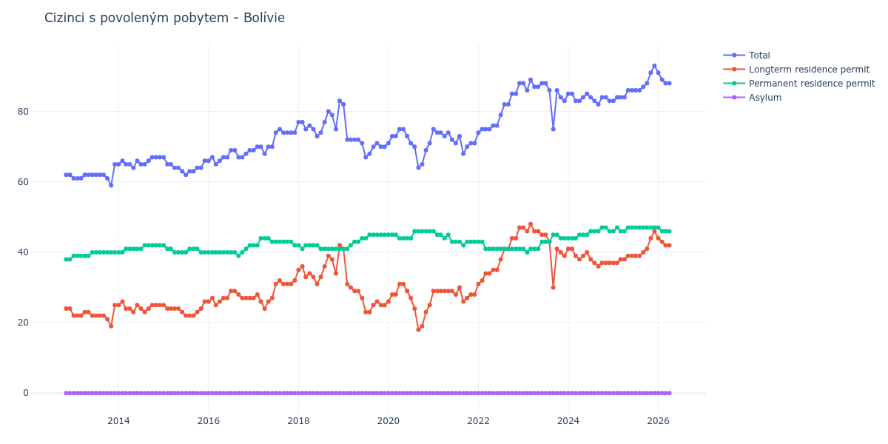

# Bolívie

## Souhrnné statistiky (Min/Max pro rok) / Summary Statistics (Min/Max per year)

| Year   | Total   | Longterm Residence Permit   | Permanent Residence Permit   | Asylum   |
|--------|---------|-----------------------------|------------------------------|----------|
| 2012   | 62 / 62 | 24 / 24                     | 38 / 38                      | 0 / 0    |
| 2013   | 59 / 65 | 19 / 25                     | 39 / 40                      | 0 / 0    |
| 2014   | 64 / 67 | 23 / 26                     | 40 / 42                      | 0 / 0    |
| 2015   | 62 / 67 | 22 / 26                     | 40 / 42                      | 0 / 0    |
| 2016   | 65 / 69 | 25 / 29                     | 39 / 42                      | 0 / 0    |
| 2017   | 68 / 75 | 24 / 32                     | 42 / 44                      | 0 / 0    |
| 2018   | 73 / 83 | 31 / 42                     | 41 / 42                      | 0 / 0    |
| 2019   | 67 / 82 | 23 / 41                     | 41 / 45                      | 0 / 0    |
| 2020   | 64 / 75 | 18 / 31                     | 44 / 46                      | 0 / 0    |
| 2021   | 68 / 75 | 26 / 30                     | 42 / 46                      | 0 / 0    |
| 2022   | 74 / 88 | 31 / 47                     | 41 / 43                      | 0 / 0    |
| 2023   | 75 / 89 | 30 / 48                     | 40 / 45                      | 0 / 0    |
| 2024   | 82 / 85 | 36 / 41                     | 44 / 47                      | 0 / 0    |
| 2025   | 83 / 93 | 37 / 46                     | 46 / 47                      | 0 / 0    |
| 2026   | 88 / 91 | 42 / 44                     | 46 / 47                      | 0 / 0    |

## Detailní tabulka / Detailed Data Table

| Date     | Total        | Longterm Residence Permit   | Permanent Residence Permit   | Asylum   |
|----------|--------------|-----------------------------|------------------------------|----------|
| **2012** |              |                             |                              |          |
| 11.2012  | 62           | 24                          | 38                           | 0        |
| 12.2012  | 62 (+0.00%)  | 24 (+0.00%)                 | 38 (+0.00%)                  | 0        |
| **2013** |              |                             |                              |          |
| 01.2013  | 61 (-1.61%)  | 22 (-8.33%)                 | 39 (+2.63%)                  | 0        |
| 02.2013  | 61 (+0.00%)  | 22 (+0.00%)                 | 39 (+0.00%)                  | 0        |
| 03.2013  | 61 (+0.00%)  | 22 (+0.00%)                 | 39 (+0.00%)                  | 0        |
| 04.2013  | 62 (+1.64%)  | 23 (+4.55%)                 | 39 (+0.00%)                  | 0        |
| 05.2013  | 62 (+0.00%)  | 23 (+0.00%)                 | 39 (+0.00%)                  | 0        |
| 06.2013  | 62 (+0.00%)  | 22 (-4.35%)                 | 40 (+2.56%)                  | 0        |
| 07.2013  | 62 (+0.00%)  | 22 (+0.00%)                 | 40 (+0.00%)                  | 0        |
| 08.2013  | 62 (+0.00%)  | 22 (+0.00%)                 | 40 (+0.00%)                  | 0        |
| 09.2013  | 62 (+0.00%)  | 22 (+0.00%)                 | 40 (+0.00%)                  | 0        |
| 10.2013  | 61 (-1.61%)  | 21 (-4.55%)                 | 40 (+0.00%)                  | 0        |
| 11.2013  | 59 (-3.28%)  | 19 (-9.52%)                 | 40 (+0.00%)                  | 0        |
| 12.2013  | 65 (+10.17%) | 25 (+31.58%)                | 40 (+0.00%)                  | 0        |
| **2014** |              |                             |                              |          |
| 01.2014  | 65 (+0.00%)  | 25 (+0.00%)                 | 40 (+0.00%)                  | 0        |
| 02.2014  | 66 (+1.54%)  | 26 (+4.00%)                 | 40 (+0.00%)                  | 0        |
| 03.2014  | 65 (-1.52%)  | 24 (-7.69%)                 | 41 (+2.50%)                  | 0        |
| 04.2014  | 65 (+0.00%)  | 24 (+0.00%)                 | 41 (+0.00%)                  | 0        |
| 05.2014  | 64 (-1.54%)  | 23 (-4.17%)                 | 41 (+0.00%)                  | 0        |
| 06.2014  | 66 (+3.12%)  | 25 (+8.70%)                 | 41 (+0.00%)                  | 0        |
| 07.2014  | 65 (-1.52%)  | 24 (-4.00%)                 | 41 (+0.00%)                  | 0        |
| 08.2014  | 65 (+0.00%)  | 23 (-4.17%)                 | 42 (+2.44%)                  | 0        |
| 09.2014  | 66 (+1.54%)  | 24 (+4.35%)                 | 42 (+0.00%)                  | 0        |
| 10.2014  | 67 (+1.52%)  | 25 (+4.17%)                 | 42 (+0.00%)                  | 0        |
| 11.2014  | 67 (+0.00%)  | 25 (+0.00%)                 | 42 (+0.00%)                  | 0        |
| 12.2014  | 67 (+0.00%)  | 25 (+0.00%)                 | 42 (+0.00%)                  | 0        |
| **2015** |              |                             |                              |          |
| 01.2015  | 67 (+0.00%)  | 25 (+0.00%)                 | 42 (+0.00%)                  | 0        |
| 02.2015  | 65 (-2.99%)  | 24 (-4.00%)                 | 41 (-2.38%)                  | 0        |
| 03.2015  | 65 (+0.00%)  | 24 (+0.00%)                 | 41 (+0.00%)                  | 0        |
| 04.2015  | 64 (-1.54%)  | 24 (+0.00%)                 | 40 (-2.44%)                  | 0        |
| 05.2015  | 64 (+0.00%)  | 24 (+0.00%)                 | 40 (+0.00%)                  | 0        |
| 06.2015  | 63 (-1.56%)  | 23 (-4.17%)                 | 40 (+0.00%)                  | 0        |
| 07.2015  | 62 (-1.59%)  | 22 (-4.35%)                 | 40 (+0.00%)                  | 0        |
| 08.2015  | 63 (+1.61%)  | 22 (+0.00%)                 | 41 (+2.50%)                  | 0        |
| 09.2015  | 63 (+0.00%)  | 22 (+0.00%)                 | 41 (+0.00%)                  | 0        |
| 10.2015  | 64 (+1.59%)  | 23 (+4.55%)                 | 41 (+0.00%)                  | 0        |
| 11.2015  | 64 (+0.00%)  | 24 (+4.35%)                 | 40 (-2.44%)                  | 0        |
| 12.2015  | 66 (+3.12%)  | 26 (+8.33%)                 | 40 (+0.00%)                  | 0        |
| **2016** |              |                             |                              |          |
| 01.2016  | 66 (+0.00%)  | 26 (+0.00%)                 | 40 (+0.00%)                  | 0        |
| 02.2016  | 67 (+1.52%)  | 27 (+3.85%)                 | 40 (+0.00%)                  | 0        |
| 03.2016  | 65 (-2.99%)  | 25 (-7.41%)                 | 40 (+0.00%)                  | 0        |
| 04.2016  | 66 (+1.54%)  | 26 (+4.00%)                 | 40 (+0.00%)                  | 0        |
| 05.2016  | 67 (+1.52%)  | 27 (+3.85%)                 | 40 (+0.00%)                  | 0        |
| 06.2016  | 67 (+0.00%)  | 27 (+0.00%)                 | 40 (+0.00%)                  | 0        |
| 07.2016  | 69 (+2.99%)  | 29 (+7.41%)                 | 40 (+0.00%)                  | 0        |
| 08.2016  | 69 (+0.00%)  | 29 (+0.00%)                 | 40 (+0.00%)                  | 0        |
| 09.2016  | 67 (-2.90%)  | 28 (-3.45%)                 | 39 (-2.50%)                  | 0        |
| 10.2016  | 67 (+0.00%)  | 27 (-3.57%)                 | 40 (+2.56%)                  | 0        |
| 11.2016  | 68 (+1.49%)  | 27 (+0.00%)                 | 41 (+2.50%)                  | 0        |
| 12.2016  | 69 (+1.47%)  | 27 (+0.00%)                 | 42 (+2.44%)                  | 0        |
| **2017** |              |                             |                              |          |
| 01.2017  | 69 (+0.00%)  | 27 (+0.00%)                 | 42 (+0.00%)                  | 0        |
| 02.2017  | 70 (+1.45%)  | 28 (+3.70%)                 | 42 (+0.00%)                  | 0        |
| 03.2017  | 70 (+0.00%)  | 26 (-7.14%)                 | 44 (+4.76%)                  | 0        |
| 04.2017  | 68 (-2.86%)  | 24 (-7.69%)                 | 44 (+0.00%)                  | 0        |
| 05.2017  | 70 (+2.94%)  | 26 (+8.33%)                 | 44 (+0.00%)                  | 0        |
| 06.2017  | 70 (+0.00%)  | 27 (+3.85%)                 | 43 (-2.27%)                  | 0        |
| 07.2017  | 74 (+5.71%)  | 31 (+14.81%)                | 43 (+0.00%)                  | 0        |
| 08.2017  | 75 (+1.35%)  | 32 (+3.23%)                 | 43 (+0.00%)                  | 0        |
| 09.2017  | 74 (-1.33%)  | 31 (-3.12%)                 | 43 (+0.00%)                  | 0        |
| 10.2017  | 74 (+0.00%)  | 31 (+0.00%)                 | 43 (+0.00%)                  | 0        |
| 11.2017  | 74 (+0.00%)  | 31 (+0.00%)                 | 43 (+0.00%)                  | 0        |
| 12.2017  | 74 (+0.00%)  | 32 (+3.23%)                 | 42 (-2.33%)                  | 0        |
| **2018** |              |                             |                              |          |
| 01.2018  | 77 (+4.05%)  | 35 (+9.38%)                 | 42 (+0.00%)                  | 0        |
| 02.2018  | 77 (+0.00%)  | 36 (+2.86%)                 | 41 (-2.38%)                  | 0        |
| 03.2018  | 75 (-2.60%)  | 33 (-8.33%)                 | 42 (+2.44%)                  | 0        |
| 04.2018  | 76 (+1.33%)  | 34 (+3.03%)                 | 42 (+0.00%)                  | 0        |
| 05.2018  | 75 (-1.32%)  | 33 (-2.94%)                 | 42 (+0.00%)                  | 0        |
| 06.2018  | 73 (-2.67%)  | 31 (-6.06%)                 | 42 (+0.00%)                  | 0        |
| 07.2018  | 74 (+1.37%)  | 33 (+6.45%)                 | 41 (-2.38%)                  | 0        |
| 08.2018  | 77 (+4.05%)  | 36 (+9.09%)                 | 41 (+0.00%)                  | 0        |
| 09.2018  | 80 (+3.90%)  | 39 (+8.33%)                 | 41 (+0.00%)                  | 0        |
| 10.2018  | 79 (-1.25%)  | 38 (-2.56%)                 | 41 (+0.00%)                  | 0        |
| 11.2018  | 75 (-5.06%)  | 34 (-10.53%)                | 41 (+0.00%)                  | 0        |
| 12.2018  | 83 (+10.67%) | 42 (+23.53%)                | 41 (+0.00%)                  | 0        |
| **2019** |              |                             |                              |          |
| 01.2019  | 82 (-1.20%)  | 41 (-2.38%)                 | 41 (+0.00%)                  | 0        |
| 02.2019  | 72 (-12.20%) | 31 (-24.39%)                | 41 (+0.00%)                  | 0        |
| 03.2019  | 72 (+0.00%)  | 30 (-3.23%)                 | 42 (+2.44%)                  | 0        |
| 04.2019  | 72 (+0.00%)  | 29 (-3.33%)                 | 43 (+2.38%)                  | 0        |
| 05.2019  | 72 (+0.00%)  | 29 (+0.00%)                 | 43 (+0.00%)                  | 0        |
| 06.2019  | 71 (-1.39%)  | 27 (-6.90%)                 | 44 (+2.33%)                  | 0        |
| 07.2019  | 67 (-5.63%)  | 23 (-14.81%)                | 44 (+0.00%)                  | 0        |
| 08.2019  | 68 (+1.49%)  | 23 (+0.00%)                 | 45 (+2.27%)                  | 0        |
| 09.2019  | 70 (+2.94%)  | 25 (+8.70%)                 | 45 (+0.00%)                  | 0        |
| 10.2019  | 71 (+1.43%)  | 26 (+4.00%)                 | 45 (+0.00%)                  | 0        |
| 11.2019  | 70 (-1.41%)  | 25 (-3.85%)                 | 45 (+0.00%)                  | 0        |
| 12.2019  | 70 (+0.00%)  | 25 (+0.00%)                 | 45 (+0.00%)                  | 0        |
| **2020** |              |                             |                              |          |
| 01.2020  | 71 (+1.43%)  | 26 (+4.00%)                 | 45 (+0.00%)                  | 0        |
| 02.2020  | 73 (+2.82%)  | 28 (+7.69%)                 | 45 (+0.00%)                  | 0        |
| 03.2020  | 73 (+0.00%)  | 28 (+0.00%)                 | 45 (+0.00%)                  | 0        |
| 04.2020  | 75 (+2.74%)  | 31 (+10.71%)                | 44 (-2.22%)                  | 0        |
| 05.2020  | 75 (+0.00%)  | 31 (+0.00%)                 | 44 (+0.00%)                  | 0        |
| 06.2020  | 73 (-2.67%)  | 29 (-6.45%)                 | 44 (+0.00%)                  | 0        |
| 07.2020  | 71 (-2.74%)  | 27 (-6.90%)                 | 44 (+0.00%)                  | 0        |
| 08.2020  | 70 (-1.41%)  | 24 (-11.11%)                | 46 (+4.55%)                  | 0        |
| 09.2020  | 64 (-8.57%)  | 18 (-25.00%)                | 46 (+0.00%)                  | 0        |
| 10.2020  | 65 (+1.56%)  | 19 (+5.56%)                 | 46 (+0.00%)                  | 0        |
| 11.2020  | 69 (+6.15%)  | 23 (+21.05%)                | 46 (+0.00%)                  | 0        |
| 12.2020  | 71 (+2.90%)  | 25 (+8.70%)                 | 46 (+0.00%)                  | 0        |
| **2021** |              |                             |                              |          |
| 01.2021  | 75 (+5.63%)  | 29 (+16.00%)                | 46 (+0.00%)                  | 0        |
| 02.2021  | 74 (-1.33%)  | 29 (+0.00%)                 | 45 (-2.17%)                  | 0        |
| 03.2021  | 74 (+0.00%)  | 29 (+0.00%)                 | 45 (+0.00%)                  | 0        |
| 04.2021  | 73 (-1.35%)  | 29 (+0.00%)                 | 44 (-2.22%)                  | 0        |
| 05.2021  | 74 (+1.37%)  | 29 (+0.00%)                 | 45 (+2.27%)                  | 0        |
| 06.2021  | 72 (-2.70%)  | 29 (+0.00%)                 | 43 (-4.44%)                  | 0        |
| 07.2021  | 71 (-1.39%)  | 28 (-3.45%)                 | 43 (+0.00%)                  | 0        |
| 08.2021  | 73 (+2.82%)  | 30 (+7.14%)                 | 43 (+0.00%)                  | 0        |
| 09.2021  | 68 (-6.85%)  | 26 (-13.33%)                | 42 (-2.33%)                  | 0        |
| 10.2021  | 70 (+2.94%)  | 27 (+3.85%)                 | 43 (+2.38%)                  | 0        |
| 11.2021  | 71 (+1.43%)  | 28 (+3.70%)                 | 43 (+0.00%)                  | 0        |
| 12.2021  | 71 (+0.00%)  | 28 (+0.00%)                 | 43 (+0.00%)                  | 0        |
| **2022** |              |                             |                              |          |
| 01.2022  | 74 (+4.23%)  | 31 (+10.71%)                | 43 (+0.00%)                  | 0        |
| 02.2022  | 75 (+1.35%)  | 32 (+3.23%)                 | 43 (+0.00%)                  | 0        |
| 03.2022  | 75 (+0.00%)  | 34 (+6.25%)                 | 41 (-4.65%)                  | 0        |
| 04.2022  | 75 (+0.00%)  | 34 (+0.00%)                 | 41 (+0.00%)                  | 0        |
| 05.2022  | 76 (+1.33%)  | 35 (+2.94%)                 | 41 (+0.00%)                  | 0        |
| 06.2022  | 76 (+0.00%)  | 35 (+0.00%)                 | 41 (+0.00%)                  | 0        |
| 07.2022  | 79 (+3.95%)  | 38 (+8.57%)                 | 41 (+0.00%)                  | 0        |
| 08.2022  | 82 (+3.80%)  | 41 (+7.89%)                 | 41 (+0.00%)                  | 0        |
| 09.2022  | 82 (+0.00%)  | 41 (+0.00%)                 | 41 (+0.00%)                  | 0        |
| 10.2022  | 85 (+3.66%)  | 44 (+7.32%)                 | 41 (+0.00%)                  | 0        |
| 11.2022  | 85 (+0.00%)  | 44 (+0.00%)                 | 41 (+0.00%)                  | 0        |
| 12.2022  | 88 (+3.53%)  | 47 (+6.82%)                 | 41 (+0.00%)                  | 0        |
| **2023** |              |                             |                              |          |
| 01.2023  | 88 (+0.00%)  | 47 (+0.00%)                 | 41 (+0.00%)                  | 0        |
| 02.2023  | 86 (-2.27%)  | 46 (-2.13%)                 | 40 (-2.44%)                  | 0        |
| 03.2023  | 89 (+3.49%)  | 48 (+4.35%)                 | 41 (+2.50%)                  | 0        |
| 04.2023  | 87 (-2.25%)  | 46 (-4.17%)                 | 41 (+0.00%)                  | 0        |
| 05.2023  | 87 (+0.00%)  | 46 (+0.00%)                 | 41 (+0.00%)                  | 0        |
| 06.2023  | 88 (+1.15%)  | 45 (-2.17%)                 | 43 (+4.88%)                  | 0        |
| 07.2023  | 88 (+0.00%)  | 45 (+0.00%)                 | 43 (+0.00%)                  | 0        |
| 08.2023  | 86 (-2.27%)  | 43 (-4.44%)                 | 43 (+0.00%)                  | 0        |
| 09.2023  | 75 (-12.79%) | 30 (-30.23%)                | 45 (+4.65%)                  | 0        |
| 10.2023  | 86 (+14.67%) | 41 (+36.67%)                | 45 (+0.00%)                  | 0        |
| 11.2023  | 84 (-2.33%)  | 40 (-2.44%)                 | 44 (-2.22%)                  | 0        |
| 12.2023  | 83 (-1.19%)  | 39 (-2.50%)                 | 44 (+0.00%)                  | 0        |
| **2024** |              |                             |                              |          |
| 01.2024  | 85 (+2.41%)  | 41 (+5.13%)                 | 44 (+0.00%)                  | 0        |
| 02.2024  | 85 (+0.00%)  | 41 (+0.00%)                 | 44 (+0.00%)                  | 0        |
| 03.2024  | 83 (-2.35%)  | 39 (-4.88%)                 | 44 (+0.00%)                  | 0        |
| 04.2024  | 83 (+0.00%)  | 38 (-2.56%)                 | 45 (+2.27%)                  | 0        |
| 05.2024  | 84 (+1.20%)  | 39 (+2.63%)                 | 45 (+0.00%)                  | 0        |
| 06.2024  | 85 (+1.19%)  | 40 (+2.56%)                 | 45 (+0.00%)                  | 0        |
| 07.2024  | 84 (-1.18%)  | 38 (-5.00%)                 | 46 (+2.22%)                  | 0        |
| 08.2024  | 83 (-1.19%)  | 37 (-2.63%)                 | 46 (+0.00%)                  | 0        |
| 09.2024  | 82 (-1.20%)  | 36 (-2.70%)                 | 46 (+0.00%)                  | 0        |
| 10.2024  | 84 (+2.44%)  | 37 (+2.78%)                 | 47 (+2.17%)                  | 0        |
| 11.2024  | 84 (+0.00%)  | 37 (+0.00%)                 | 47 (+0.00%)                  | 0        |
| 12.2024  | 83 (-1.19%)  | 37 (+0.00%)                 | 46 (-2.13%)                  | 0        |
| **2025** |              |                             |                              |          |
| 01.2025  | 83 (+0.00%)  | 37 (+0.00%)                 | 46 (+0.00%)                  | 0        |
| 02.2025  | 84 (+1.20%)  | 37 (+0.00%)                 | 47 (+2.17%)                  | 0        |
| 03.2025  | 84 (+0.00%)  | 38 (+2.70%)                 | 46 (-2.13%)                  | 0        |
| 04.2025  | 84 (+0.00%)  | 38 (+0.00%)                 | 46 (+0.00%)                  | 0        |
| 05.2025  | 86 (+2.38%)  | 39 (+2.63%)                 | 47 (+2.17%)                  | 0        |
| 06.2025  | 86 (+0.00%)  | 39 (+0.00%)                 | 47 (+0.00%)                  | 0        |
| 07.2025  | 86 (+0.00%)  | 39 (+0.00%)                 | 47 (+0.00%)                  | 0        |
| 08.2025  | 86 (+0.00%)  | 39 (+0.00%)                 | 47 (+0.00%)                  | 0        |
| 09.2025  | 87 (+1.16%)  | 40 (+2.56%)                 | 47 (+0.00%)                  | 0        |
| 10.2025  | 88 (+1.15%)  | 41 (+2.50%)                 | 47 (+0.00%)                  | 0        |
| 11.2025  | 91 (+3.41%)  | 44 (+7.32%)                 | 47 (+0.00%)                  | 0        |
| 12.2025  | 93 (+2.20%)  | 46 (+4.55%)                 | 47 (+0.00%)                  | 0        |
| **2026** |              |                             |                              |          |
| 01.2026  | 91 (-2.15%)  | 44 (-4.35%)                 | 47 (+0.00%)                  | 0        |
| 02.2026  | 89 (-2.20%)  | 43 (-2.27%)                 | 46 (-2.13%)                  | 0        |
| 03.2026  | 88 (-1.12%)  | 42 (-2.33%)                 | 46 (+0.00%)                  | 0        |
| 04.2026  | 88 (+0.00%)  | 42 (+0.00%)                 | 46 (+0.00%)                  | 0        |
