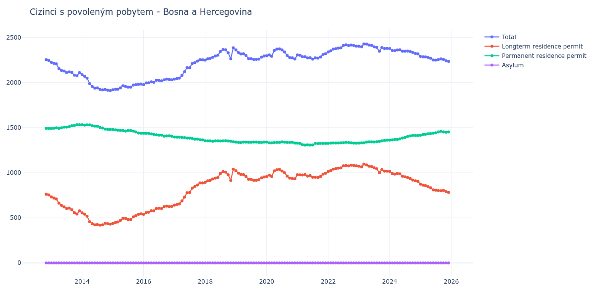

# Bosna a Hercegovina

## Souhrnné statistiky (Min/Max pro rok) / Summary Statistics (Min/Max per year)

| Year   | Total Min/Max   | Longterm Residence Permit Min/Max   | Permanent Residence Permit Min/Max   | Asylum Min/Max   |
|--------|-----------------|-------------------------------------|--------------------------------------|------------------|
| 2012   | 2 244 / 2 253   | 754 / 761                           | 1 490 / 1 492                        | 0 / 0            |
| 2013   | 2 073 / 2 223   | 542 / 732                           | 1 491 / 1 532                        | 0 / 0            |
| 2014   | 1 910 / 2 086   | 419 / 555                           | 1 479 / 1 531                        | 0 / 0            |
| 2015   | 1 919 / 1 983   | 439 / 544                           | 1 439 / 1 480                        | 0 / 0            |
| 2016   | 1 976 / 2 037   | 539 / 629                           | 1 404 / 1 437                        | 0 / 0            |
| 2017   | 2 037 / 2 253   | 641 / 887                           | 1 365 / 1 396                        | 0 / 0            |
| 2018   | 2 247 / 2 384   | 892 / 1 040                         | 1 344 / 1 355                        | 0 / 0            |
| 2019   | 2 255 / 2 361   | 916 / 1 021                         | 1 334 / 1 340                        | 0 / 0            |
| 2020   | 2 260 / 2 372   | 932 / 1 036                         | 1 328 / 1 342                        | 0 / 0            |
| 2021   | 2 258 / 2 319   | 946 / 994                           | 1 307 / 1 327                        | 0 / 0            |
| 2022   | 2 338 / 2 417   | 1 013 / 1 083                       | 1 325 / 1 337                        | 0 / 0            |
| 2023   | 2 346 / 2 427   | 999 / 1 095                         | 1 329 / 1 361                        | 0 / 0            |
| 2024   | 2 317 / 2 376   | 905 / 1 015                         | 1 361 / 1 414                        | 0 / 0            |
| 2025   | 2 233 / 2 289   | 781 / 874                           | 1 415 / 1 460                        | 0 / 0            |

## Detailní tabulka / Detailed Data Table

| Date     | Total          | Longterm Residence Permit   | Permanent Residence Permit   | Asylum   |
|----------|----------------|-----------------------------|------------------------------|----------|
| **2012** |                |                             |                              |          |
| 11.2012  | 2 253          | 761                         | 1 492                        | 0        |
| 12.2012  | 2 244 (-0.40%) | 754 (-0.92%)                | 1 490 (-0.13%)               | 0        |
| **2013** |                |                             |                              |          |
| 01.2013  | 2 223 (-0.94%) | 732 (-2.92%)                | 1 491 (+0.07%)               | 0        |
| 02.2013  | 2 212 (-0.49%) | 719 (-1.78%)                | 1 493 (+0.13%)               | 0        |
| 03.2013  | 2 206 (-0.27%) | 709 (-1.39%)                | 1 497 (+0.27%)               | 0        |
| 04.2013  | 2 154 (-2.36%) | 662 (-6.63%)                | 1 492 (-0.33%)               | 0        |
| 05.2013  | 2 134 (-0.93%) | 637 (-3.78%)                | 1 497 (+0.34%)               | 0        |
| 06.2013  | 2 127 (-0.33%) | 621 (-2.51%)                | 1 506 (+0.60%)               | 0        |
| 07.2013  | 2 110 (-0.80%) | 604 (-2.74%)                | 1 506 (+0.00%)               | 0        |
| 08.2013  | 2 117 (+0.33%) | 607 (+0.50%)                | 1 510 (+0.27%)               | 0        |
| 09.2013  | 2 111 (-0.28%) | 590 (-2.80%)                | 1 521 (+0.73%)               | 0        |
| 10.2013  | 2 081 (-1.42%) | 558 (-5.42%)                | 1 523 (+0.13%)               | 0        |
| 11.2013  | 2 073 (-0.38%) | 542 (-2.87%)                | 1 531 (+0.53%)               | 0        |
| 12.2013  | 2 109 (+1.74%) | 577 (+6.46%)                | 1 532 (+0.07%)               | 0        |
| **2014** |                |                             |                              |          |
| 01.2014  | 2 086 (-1.09%) | 555 (-3.81%)                | 1 531 (-0.07%)               | 0        |
| 02.2014  | 2 068 (-0.86%) | 540 (-2.70%)                | 1 528 (-0.20%)               | 0        |
| 03.2014  | 2 048 (-0.97%) | 518 (-4.07%)                | 1 530 (+0.13%)               | 0        |
| 04.2014  | 1 987 (-2.98%) | 457 (-11.78%)               | 1 530 (+0.00%)               | 0        |
| 05.2014  | 1 955 (-1.61%) | 435 (-4.81%)                | 1 520 (-0.65%)               | 0        |
| 06.2014  | 1 938 (-0.87%) | 422 (-2.99%)                | 1 516 (-0.26%)               | 0        |
| 07.2014  | 1 940 (+0.10%) | 425 (+0.71%)                | 1 515 (-0.07%)               | 0        |
| 08.2014  | 1 922 (-0.93%) | 419 (-1.41%)                | 1 503 (-0.79%)               | 0        |
| 09.2014  | 1 918 (-0.21%) | 422 (+0.72%)                | 1 496 (-0.47%)               | 0        |
| 10.2014  | 1 923 (+0.26%) | 440 (+4.27%)                | 1 483 (-0.87%)               | 0        |
| 11.2014  | 1 914 (-0.47%) | 435 (-1.14%)                | 1 479 (-0.27%)               | 0        |
| 12.2014  | 1 910 (-0.21%) | 431 (-0.92%)                | 1 479 (+0.00%)               | 0        |
| **2015** |                |                             |                              |          |
| 01.2015  | 1 919 (+0.47%) | 439 (+1.86%)                | 1 480 (+0.07%)               | 0        |
| 02.2015  | 1 924 (+0.26%) | 448 (+2.05%)                | 1 476 (-0.27%)               | 0        |
| 03.2015  | 1 925 (+0.05%) | 454 (+1.34%)                | 1 471 (-0.34%)               | 0        |
| 04.2015  | 1 940 (+0.78%) | 472 (+3.96%)                | 1 468 (-0.20%)               | 0        |
| 05.2015  | 1 963 (+1.19%) | 495 (+4.87%)                | 1 468 (+0.00%)               | 0        |
| 06.2015  | 1 955 (-0.41%) | 493 (-0.40%)                | 1 462 (-0.41%)               | 0        |
| 07.2015  | 1 949 (-0.31%) | 481 (-2.43%)                | 1 468 (+0.41%)               | 0        |
| 08.2015  | 1 948 (-0.05%) | 481 (+0.00%)                | 1 467 (-0.07%)               | 0        |
| 09.2015  | 1 972 (+1.23%) | 510 (+6.03%)                | 1 462 (-0.34%)               | 0        |
| 10.2015  | 1 976 (+0.20%) | 524 (+2.75%)                | 1 452 (-0.68%)               | 0        |
| 11.2015  | 1 979 (+0.15%) | 539 (+2.86%)                | 1 440 (-0.83%)               | 0        |
| 12.2015  | 1 983 (+0.20%) | 544 (+0.93%)                | 1 439 (-0.07%)               | 0        |
| **2016** |                |                             |                              |          |
| 01.2016  | 1 976 (-0.35%) | 539 (-0.92%)                | 1 437 (-0.14%)               | 0        |
| 02.2016  | 1 995 (+0.96%) | 558 (+3.53%)                | 1 437 (+0.00%)               | 0        |
| 03.2016  | 1 997 (+0.10%) | 562 (+0.72%)                | 1 435 (-0.14%)               | 0        |
| 04.2016  | 2 008 (+0.55%) | 578 (+2.85%)                | 1 430 (-0.35%)               | 0        |
| 05.2016  | 2 002 (-0.30%) | 577 (-0.17%)                | 1 425 (-0.35%)               | 0        |
| 06.2016  | 2 025 (+1.15%) | 604 (+4.68%)                | 1 421 (-0.28%)               | 0        |
| 07.2016  | 2 022 (-0.15%) | 606 (+0.33%)                | 1 416 (-0.35%)               | 0        |
| 08.2016  | 2 019 (-0.15%) | 603 (-0.50%)                | 1 416 (+0.00%)               | 0        |
| 09.2016  | 2 030 (+0.54%) | 625 (+3.65%)                | 1 405 (-0.78%)               | 0        |
| 10.2016  | 2 037 (+0.34%) | 629 (+0.64%)                | 1 408 (+0.21%)               | 0        |
| 11.2016  | 2 034 (-0.15%) | 625 (-0.64%)                | 1 409 (+0.07%)               | 0        |
| 12.2016  | 2 030 (-0.20%) | 626 (+0.16%)                | 1 404 (-0.35%)               | 0        |
| **2017** |                |                             |                              |          |
| 01.2017  | 2 037 (+0.34%) | 641 (+2.40%)                | 1 396 (-0.57%)               | 0        |
| 02.2017  | 2 043 (+0.29%) | 648 (+1.09%)                | 1 395 (-0.07%)               | 0        |
| 03.2017  | 2 048 (+0.24%) | 654 (+0.93%)                | 1 394 (-0.07%)               | 0        |
| 04.2017  | 2 079 (+1.51%) | 688 (+5.20%)                | 1 391 (-0.22%)               | 0        |
| 05.2017  | 2 118 (+1.88%) | 729 (+5.96%)                | 1 389 (-0.14%)               | 0        |
| 06.2017  | 2 164 (+2.17%) | 779 (+6.86%)                | 1 385 (-0.29%)               | 0        |
| 07.2017  | 2 163 (-0.05%) | 780 (+0.13%)                | 1 383 (-0.14%)               | 0        |
| 08.2017  | 2 210 (+2.17%) | 830 (+6.41%)                | 1 380 (-0.22%)               | 0        |
| 09.2017  | 2 220 (+0.45%) | 848 (+2.17%)                | 1 372 (-0.58%)               | 0        |
| 10.2017  | 2 236 (+0.72%) | 864 (+1.89%)                | 1 372 (+0.00%)               | 0        |
| 11.2017  | 2 253 (+0.76%) | 887 (+2.66%)                | 1 366 (-0.44%)               | 0        |
| 12.2017  | 2 252 (-0.04%) | 887 (+0.00%)                | 1 365 (-0.07%)               | 0        |
| **2018** |                |                             |                              |          |
| 01.2018  | 2 247 (-0.22%) | 892 (+0.56%)                | 1 355 (-0.73%)               | 0        |
| 02.2018  | 2 263 (+0.71%) | 910 (+2.02%)                | 1 353 (-0.15%)               | 0        |
| 03.2018  | 2 267 (+0.18%) | 914 (+0.44%)                | 1 353 (+0.00%)               | 0        |
| 04.2018  | 2 279 (+0.53%) | 931 (+1.86%)                | 1 348 (-0.37%)               | 0        |
| 05.2018  | 2 293 (+0.61%) | 940 (+0.97%)                | 1 353 (+0.37%)               | 0        |
| 06.2018  | 2 302 (+0.39%) | 949 (+0.96%)                | 1 353 (+0.00%)               | 0        |
| 07.2018  | 2 344 (+1.82%) | 992 (+4.53%)                | 1 352 (-0.07%)               | 0        |
| 08.2018  | 2 365 (+0.90%) | 1 012 (+2.02%)              | 1 353 (+0.07%)               | 0        |
| 09.2018  | 2 362 (-0.13%) | 1 007 (-0.49%)              | 1 355 (+0.15%)               | 0        |
| 10.2018  | 2 330 (-1.35%) | 978 (-2.88%)                | 1 352 (-0.22%)               | 0        |
| 11.2018  | 2 262 (-2.92%) | 914 (-6.54%)                | 1 348 (-0.30%)               | 0        |
| 12.2018  | 2 384 (+5.39%) | 1 040 (+13.79%)             | 1 344 (-0.30%)               | 0        |
| **2019** |                |                             |                              |          |
| 01.2019  | 2 361 (-0.96%) | 1 021 (-1.83%)              | 1 340 (-0.30%)               | 0        |
| 02.2019  | 2 331 (-1.27%) | 996 (-2.45%)                | 1 335 (-0.37%)               | 0        |
| 03.2019  | 2 316 (-0.64%) | 982 (-1.41%)                | 1 334 (-0.07%)               | 0        |
| 04.2019  | 2 319 (+0.13%) | 979 (-0.31%)                | 1 340 (+0.45%)               | 0        |
| 05.2019  | 2 299 (-0.86%) | 959 (-2.04%)                | 1 340 (+0.00%)               | 0        |
| 06.2019  | 2 264 (-1.52%) | 927 (-3.34%)                | 1 337 (-0.22%)               | 0        |
| 07.2019  | 2 264 (+0.00%) | 927 (+0.00%)                | 1 337 (+0.00%)               | 0        |
| 08.2019  | 2 255 (-0.40%) | 916 (-1.19%)                | 1 339 (+0.15%)               | 0        |
| 09.2019  | 2 256 (+0.04%) | 916 (+0.00%)                | 1 340 (+0.07%)               | 0        |
| 10.2019  | 2 259 (+0.13%) | 923 (+0.76%)                | 1 336 (-0.30%)               | 0        |
| 11.2019  | 2 280 (+0.93%) | 944 (+2.28%)                | 1 336 (+0.00%)               | 0        |
| 12.2019  | 2 292 (+0.53%) | 953 (+0.95%)                | 1 339 (+0.22%)               | 0        |
| **2020** |                |                             |                              |          |
| 01.2020  | 2 297 (+0.22%) | 957 (+0.42%)                | 1 340 (+0.07%)               | 0        |
| 02.2020  | 2 305 (+0.35%) | 973 (+1.67%)                | 1 332 (-0.60%)               | 0        |
| 03.2020  | 2 290 (-0.65%) | 959 (-1.44%)                | 1 331 (-0.08%)               | 0        |
| 04.2020  | 2 354 (+2.79%) | 1 020 (+6.36%)              | 1 334 (+0.23%)               | 0        |
| 05.2020  | 2 369 (+0.64%) | 1 033 (+1.27%)              | 1 336 (+0.15%)               | 0        |
| 06.2020  | 2 372 (+0.13%) | 1 036 (+0.29%)              | 1 336 (+0.00%)               | 0        |
| 07.2020  | 2 361 (-0.46%) | 1 019 (-1.64%)              | 1 342 (+0.45%)               | 0        |
| 08.2020  | 2 338 (-0.97%) | 1 000 (-1.86%)              | 1 338 (-0.30%)               | 0        |
| 09.2020  | 2 299 (-1.67%) | 963 (-3.70%)                | 1 336 (-0.15%)               | 0        |
| 10.2020  | 2 276 (-1.00%) | 941 (-2.28%)                | 1 335 (-0.07%)               | 0        |
| 11.2020  | 2 274 (-0.09%) | 937 (-0.43%)                | 1 337 (+0.15%)               | 0        |
| 12.2020  | 2 260 (-0.62%) | 932 (-0.53%)                | 1 328 (-0.67%)               | 0        |
| **2021** |                |                             |                              |          |
| 01.2021  | 2 305 (+1.99%) | 978 (+4.94%)                | 1 327 (-0.08%)               | 0        |
| 02.2021  | 2 301 (-0.17%) | 976 (-0.20%)                | 1 325 (-0.15%)               | 0        |
| 03.2021  | 2 286 (-0.65%) | 975 (-0.10%)                | 1 311 (-1.06%)               | 0        |
| 04.2021  | 2 286 (+0.00%) | 979 (+0.41%)                | 1 307 (-0.31%)               | 0        |
| 05.2021  | 2 272 (-0.61%) | 962 (-1.74%)                | 1 310 (+0.23%)               | 0        |
| 06.2021  | 2 275 (+0.13%) | 968 (+0.62%)                | 1 307 (-0.23%)               | 0        |
| 07.2021  | 2 258 (-0.75%) | 950 (-1.86%)                | 1 308 (+0.08%)               | 0        |
| 08.2021  | 2 274 (+0.71%) | 950 (+0.00%)                | 1 324 (+1.22%)               | 0        |
| 09.2021  | 2 269 (-0.22%) | 946 (-0.42%)                | 1 323 (-0.08%)               | 0        |
| 10.2021  | 2 282 (+0.57%) | 957 (+1.16%)                | 1 325 (+0.15%)               | 0        |
| 11.2021  | 2 310 (+1.23%) | 985 (+2.93%)                | 1 325 (+0.00%)               | 0        |
| 12.2021  | 2 319 (+0.39%) | 994 (+0.91%)                | 1 325 (+0.00%)               | 0        |
| **2022** |                |                             |                              |          |
| 01.2022  | 2 338 (+0.82%) | 1 013 (+1.91%)              | 1 325 (+0.00%)               | 0        |
| 02.2022  | 2 352 (+0.60%) | 1 024 (+1.09%)              | 1 328 (+0.23%)               | 0        |
| 03.2022  | 2 370 (+0.77%) | 1 040 (+1.56%)              | 1 330 (+0.15%)               | 0        |
| 04.2022  | 2 375 (+0.21%) | 1 045 (+0.48%)              | 1 330 (+0.00%)               | 0        |
| 05.2022  | 2 380 (+0.21%) | 1 050 (+0.48%)              | 1 330 (+0.00%)               | 0        |
| 06.2022  | 2 384 (+0.17%) | 1 053 (+0.29%)              | 1 331 (+0.08%)               | 0        |
| 07.2022  | 2 410 (+1.09%) | 1 077 (+2.28%)              | 1 333 (+0.15%)               | 0        |
| 08.2022  | 2 417 (+0.29%) | 1 080 (+0.28%)              | 1 337 (+0.30%)               | 0        |
| 09.2022  | 2 409 (-0.33%) | 1 075 (-0.46%)              | 1 334 (-0.22%)               | 0        |
| 10.2022  | 2 414 (+0.21%) | 1 083 (+0.74%)              | 1 331 (-0.22%)               | 0        |
| 11.2022  | 2 409 (-0.21%) | 1 080 (-0.28%)              | 1 329 (-0.15%)               | 0        |
| 12.2022  | 2 403 (-0.25%) | 1 076 (-0.37%)              | 1 327 (-0.15%)               | 0        |
| **2023** |                |                             |                              |          |
| 01.2023  | 2 401 (-0.08%) | 1 072 (-0.37%)              | 1 329 (+0.15%)               | 0        |
| 02.2023  | 2 396 (-0.21%) | 1 064 (-0.75%)              | 1 332 (+0.23%)               | 0        |
| 03.2023  | 2 427 (+1.29%) | 1 095 (+2.91%)              | 1 332 (+0.00%)               | 0        |
| 04.2023  | 2 425 (-0.08%) | 1 086 (-0.82%)              | 1 339 (+0.53%)               | 0        |
| 05.2023  | 2 414 (-0.45%) | 1 072 (-1.29%)              | 1 342 (+0.22%)               | 0        |
| 06.2023  | 2 410 (-0.17%) | 1 068 (-0.37%)              | 1 342 (+0.00%)               | 0        |
| 07.2023  | 2 395 (-0.62%) | 1 054 (-1.31%)              | 1 341 (-0.07%)               | 0        |
| 08.2023  | 2 388 (-0.29%) | 1 044 (-0.95%)              | 1 344 (+0.22%)               | 0        |
| 09.2023  | 2 346 (-1.76%) | 999 (-4.31%)                | 1 347 (+0.22%)               | 0        |
| 10.2023  | 2 387 (+1.75%) | 1 034 (+3.50%)              | 1 353 (+0.45%)               | 0        |
| 11.2023  | 2 376 (-0.46%) | 1 018 (-1.55%)              | 1 358 (+0.37%)               | 0        |
| 12.2023  | 2 378 (+0.08%) | 1 017 (-0.10%)              | 1 361 (+0.22%)               | 0        |
| **2024** |                |                             |                              |          |
| 01.2024  | 2 376 (-0.08%) | 1 015 (-0.20%)              | 1 361 (+0.00%)               | 0        |
| 02.2024  | 2 355 (-0.88%) | 991 (-2.36%)                | 1 364 (+0.22%)               | 0        |
| 03.2024  | 2 353 (-0.08%) | 985 (-0.61%)                | 1 368 (+0.29%)               | 0        |
| 04.2024  | 2 360 (+0.30%) | 991 (+0.61%)                | 1 369 (+0.07%)               | 0        |
| 05.2024  | 2 362 (+0.08%) | 987 (-0.40%)                | 1 375 (+0.44%)               | 0        |
| 06.2024  | 2 346 (-0.68%) | 961 (-2.63%)                | 1 385 (+0.73%)               | 0        |
| 07.2024  | 2 346 (+0.00%) | 955 (-0.62%)                | 1 391 (+0.43%)               | 0        |
| 08.2024  | 2 347 (+0.04%) | 946 (-0.94%)                | 1 401 (+0.72%)               | 0        |
| 09.2024  | 2 343 (-0.17%) | 935 (-1.16%)                | 1 408 (+0.50%)               | 0        |
| 10.2024  | 2 333 (-0.43%) | 919 (-1.71%)                | 1 414 (+0.43%)               | 0        |
| 11.2024  | 2 322 (-0.47%) | 910 (-0.98%)                | 1 412 (-0.14%)               | 0        |
| 12.2024  | 2 317 (-0.22%) | 905 (-0.55%)                | 1 412 (+0.00%)               | 0        |
| **2025** |                |                             |                              |          |
| 01.2025  | 2 289 (-1.21%) | 874 (-3.43%)                | 1 415 (+0.21%)               | 0        |
| 02.2025  | 2 285 (-0.17%) | 862 (-1.37%)                | 1 423 (+0.57%)               | 0        |
| 03.2025  | 2 283 (-0.09%) | 857 (-0.58%)                | 1 426 (+0.21%)               | 0        |
| 04.2025  | 2 277 (-0.26%) | 846 (-1.28%)                | 1 431 (+0.35%)               | 0        |
| 05.2025  | 2 268 (-0.40%) | 834 (-1.42%)                | 1 434 (+0.21%)               | 0        |
| 06.2025  | 2 249 (-0.84%) | 810 (-2.88%)                | 1 439 (+0.35%)               | 0        |
| 07.2025  | 2 248 (-0.04%) | 806 (-0.49%)                | 1 442 (+0.21%)               | 0        |
| 08.2025  | 2 254 (+0.27%) | 802 (-0.50%)                | 1 452 (+0.69%)               | 0        |
| 09.2025  | 2 261 (+0.31%) | 801 (-0.12%)                | 1 460 (+0.55%)               | 0        |
| 10.2025  | 2 255 (-0.27%) | 803 (+0.25%)                | 1 452 (-0.55%)               | 0        |
| 11.2025  | 2 240 (-0.67%) | 791 (-1.49%)                | 1 449 (-0.21%)               | 0        |
| 12.2025  | 2 233 (-0.31%) | 781 (-1.26%)                | 1 452 (+0.21%)               | 0        |
