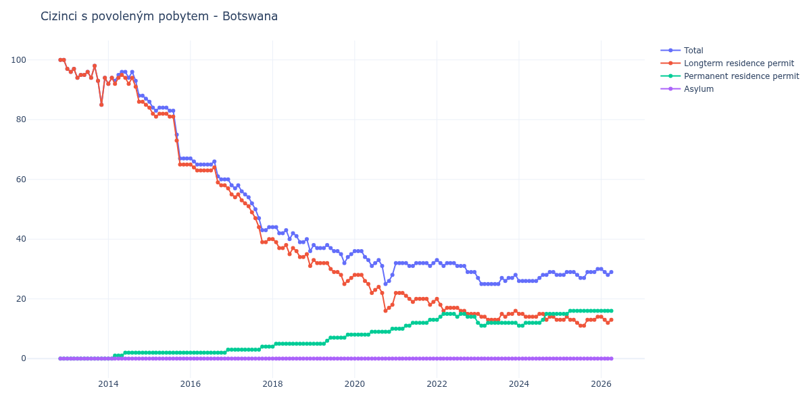

# Botswana

## Souhrnné statistiky (Min/Max pro rok) / Summary Statistics (Min/Max per year)

| Year   | Total     | Longterm Residence Permit   | Permanent Residence Permit   | Asylum   |
|--------|-----------|-----------------------------|------------------------------|----------|
| 2012   | 100 / 100 | 100 / 100                   | 0 / 0                        | 0 / 0    |
| 2013   | 85 / 98   | 85 / 98                     | 0 / 0                        | 0 / 0    |
| 2014   | 87 / 96   | 85 / 95                     | 0 / 2                        | 0 / 0    |
| 2015   | 67 / 86   | 65 / 84                     | 2 / 2                        | 0 / 0    |
| 2016   | 60 / 67   | 57 / 65                     | 2 / 3                        | 0 / 0    |
| 2017   | 43 / 58   | 39 / 55                     | 3 / 4                        | 0 / 0    |
| 2018   | 36 / 44   | 31 / 40                     | 4 / 5                        | 0 / 0    |
| 2019   | 32 / 38   | 25 / 33                     | 5 / 8                        | 0 / 0    |
| 2020   | 25 / 36   | 16 / 28                     | 8 / 10                       | 0 / 0    |
| 2021   | 31 / 32   | 18 / 22                     | 10 / 13                      | 0 / 0    |
| 2022   | 29 / 33   | 15 / 20                     | 13 / 15                      | 0 / 0    |
| 2023   | 25 / 28   | 13 / 16                     | 11 / 12                      | 0 / 0    |
| 2024   | 26 / 29   | 13 / 15                     | 11 / 15                      | 0 / 0    |
| 2025   | 27 / 30   | 11 / 14                     | 15 / 16                      | 0 / 0    |
| 2026   | 28 / 30   | 12 / 14                     | 16 / 16                      | 0 / 0    |

## Detailní tabulka / Detailed Data Table

| Date     | Total        | Longterm Residence Permit   | Permanent Residence Permit   | Asylum   |
|----------|--------------|-----------------------------|------------------------------|----------|
| **2012** |              |                             |                              |          |
| 11.2012  | 100          | 100                         | 0                            | 0        |
| 12.2012  | 100 (+0.00%) | 100 (+0.00%)                | 0                            | 0        |
| **2013** |              |                             |                              |          |
| 01.2013  | 97 (-3.00%)  | 97 (-3.00%)                 | 0                            | 0        |
| 02.2013  | 96 (-1.03%)  | 96 (-1.03%)                 | 0                            | 0        |
| 03.2013  | 97 (+1.04%)  | 97 (+1.04%)                 | 0                            | 0        |
| 04.2013  | 94 (-3.09%)  | 94 (-3.09%)                 | 0                            | 0        |
| 05.2013  | 95 (+1.06%)  | 95 (+1.06%)                 | 0                            | 0        |
| 06.2013  | 95 (+0.00%)  | 95 (+0.00%)                 | 0                            | 0        |
| 07.2013  | 96 (+1.05%)  | 96 (+1.05%)                 | 0                            | 0        |
| 08.2013  | 94 (-2.08%)  | 94 (-2.08%)                 | 0                            | 0        |
| 09.2013  | 98 (+4.26%)  | 98 (+4.26%)                 | 0                            | 0        |
| 10.2013  | 93 (-5.10%)  | 93 (-5.10%)                 | 0                            | 0        |
| 11.2013  | 85 (-8.60%)  | 85 (-8.60%)                 | 0                            | 0        |
| 12.2013  | 94 (+10.59%) | 94 (+10.59%)                | 0                            | 0        |
| **2014** |              |                             |                              |          |
| 01.2014  | 92 (-2.13%)  | 92 (-2.13%)                 | 0                            | 0        |
| 02.2014  | 94 (+2.17%)  | 94 (+2.17%)                 | 0                            | 0        |
| 03.2014  | 93 (-1.06%)  | 92 (-2.13%)                 | 1                            | 0        |
| 04.2014  | 95 (+2.15%)  | 94 (+2.17%)                 | 1 (+0.00%)                   | 0        |
| 05.2014  | 96 (+1.05%)  | 95 (+1.06%)                 | 1 (+0.00%)                   | 0        |
| 06.2014  | 96 (+0.00%)  | 94 (-1.05%)                 | 2 (+100.00%)                 | 0        |
| 07.2014  | 94 (-2.08%)  | 92 (-2.13%)                 | 2 (+0.00%)                   | 0        |
| 08.2014  | 96 (+2.13%)  | 94 (+2.17%)                 | 2 (+0.00%)                   | 0        |
| 09.2014  | 93 (-3.12%)  | 91 (-3.19%)                 | 2 (+0.00%)                   | 0        |
| 10.2014  | 88 (-5.38%)  | 86 (-5.49%)                 | 2 (+0.00%)                   | 0        |
| 11.2014  | 88 (+0.00%)  | 86 (+0.00%)                 | 2 (+0.00%)                   | 0        |
| 12.2014  | 87 (-1.14%)  | 85 (-1.16%)                 | 2 (+0.00%)                   | 0        |
| **2015** |              |                             |                              |          |
| 01.2015  | 86 (-1.15%)  | 84 (-1.18%)                 | 2 (+0.00%)                   | 0        |
| 02.2015  | 84 (-2.33%)  | 82 (-2.38%)                 | 2 (+0.00%)                   | 0        |
| 03.2015  | 83 (-1.19%)  | 81 (-1.22%)                 | 2 (+0.00%)                   | 0        |
| 04.2015  | 84 (+1.20%)  | 82 (+1.23%)                 | 2 (+0.00%)                   | 0        |
| 05.2015  | 84 (+0.00%)  | 82 (+0.00%)                 | 2 (+0.00%)                   | 0        |
| 06.2015  | 84 (+0.00%)  | 82 (+0.00%)                 | 2 (+0.00%)                   | 0        |
| 07.2015  | 83 (-1.19%)  | 81 (-1.22%)                 | 2 (+0.00%)                   | 0        |
| 08.2015  | 83 (+0.00%)  | 81 (+0.00%)                 | 2 (+0.00%)                   | 0        |
| 09.2015  | 75 (-9.64%)  | 73 (-9.88%)                 | 2 (+0.00%)                   | 0        |
| 10.2015  | 67 (-10.67%) | 65 (-10.96%)                | 2 (+0.00%)                   | 0        |
| 11.2015  | 67 (+0.00%)  | 65 (+0.00%)                 | 2 (+0.00%)                   | 0        |
| 12.2015  | 67 (+0.00%)  | 65 (+0.00%)                 | 2 (+0.00%)                   | 0        |
| **2016** |              |                             |                              |          |
| 01.2016  | 67 (+0.00%)  | 65 (+0.00%)                 | 2 (+0.00%)                   | 0        |
| 02.2016  | 66 (-1.49%)  | 64 (-1.54%)                 | 2 (+0.00%)                   | 0        |
| 03.2016  | 65 (-1.52%)  | 63 (-1.56%)                 | 2 (+0.00%)                   | 0        |
| 04.2016  | 65 (+0.00%)  | 63 (+0.00%)                 | 2 (+0.00%)                   | 0        |
| 05.2016  | 65 (+0.00%)  | 63 (+0.00%)                 | 2 (+0.00%)                   | 0        |
| 06.2016  | 65 (+0.00%)  | 63 (+0.00%)                 | 2 (+0.00%)                   | 0        |
| 07.2016  | 65 (+0.00%)  | 63 (+0.00%)                 | 2 (+0.00%)                   | 0        |
| 08.2016  | 66 (+1.54%)  | 64 (+1.59%)                 | 2 (+0.00%)                   | 0        |
| 09.2016  | 61 (-7.58%)  | 59 (-7.81%)                 | 2 (+0.00%)                   | 0        |
| 10.2016  | 60 (-1.64%)  | 58 (-1.69%)                 | 2 (+0.00%)                   | 0        |
| 11.2016  | 60 (+0.00%)  | 58 (+0.00%)                 | 2 (+0.00%)                   | 0        |
| 12.2016  | 60 (+0.00%)  | 57 (-1.72%)                 | 3 (+50.00%)                  | 0        |
| **2017** |              |                             |                              |          |
| 01.2017  | 58 (-3.33%)  | 55 (-3.51%)                 | 3 (+0.00%)                   | 0        |
| 02.2017  | 57 (-1.72%)  | 54 (-1.82%)                 | 3 (+0.00%)                   | 0        |
| 03.2017  | 58 (+1.75%)  | 55 (+1.85%)                 | 3 (+0.00%)                   | 0        |
| 04.2017  | 56 (-3.45%)  | 53 (-3.64%)                 | 3 (+0.00%)                   | 0        |
| 05.2017  | 55 (-1.79%)  | 52 (-1.89%)                 | 3 (+0.00%)                   | 0        |
| 06.2017  | 54 (-1.82%)  | 51 (-1.92%)                 | 3 (+0.00%)                   | 0        |
| 07.2017  | 52 (-3.70%)  | 49 (-3.92%)                 | 3 (+0.00%)                   | 0        |
| 08.2017  | 50 (-3.85%)  | 47 (-4.08%)                 | 3 (+0.00%)                   | 0        |
| 09.2017  | 47 (-6.00%)  | 44 (-6.38%)                 | 3 (+0.00%)                   | 0        |
| 10.2017  | 43 (-8.51%)  | 39 (-11.36%)                | 4 (+33.33%)                  | 0        |
| 11.2017  | 43 (+0.00%)  | 39 (+0.00%)                 | 4 (+0.00%)                   | 0        |
| 12.2017  | 44 (+2.33%)  | 40 (+2.56%)                 | 4 (+0.00%)                   | 0        |
| **2018** |              |                             |                              |          |
| 01.2018  | 44 (+0.00%)  | 40 (+0.00%)                 | 4 (+0.00%)                   | 0        |
| 02.2018  | 44 (+0.00%)  | 39 (-2.50%)                 | 5 (+25.00%)                  | 0        |
| 03.2018  | 42 (-4.55%)  | 37 (-5.13%)                 | 5 (+0.00%)                   | 0        |
| 04.2018  | 42 (+0.00%)  | 37 (+0.00%)                 | 5 (+0.00%)                   | 0        |
| 05.2018  | 43 (+2.38%)  | 38 (+2.70%)                 | 5 (+0.00%)                   | 0        |
| 06.2018  | 40 (-6.98%)  | 35 (-7.89%)                 | 5 (+0.00%)                   | 0        |
| 07.2018  | 42 (+5.00%)  | 37 (+5.71%)                 | 5 (+0.00%)                   | 0        |
| 08.2018  | 41 (-2.38%)  | 36 (-2.70%)                 | 5 (+0.00%)                   | 0        |
| 09.2018  | 39 (-4.88%)  | 34 (-5.56%)                 | 5 (+0.00%)                   | 0        |
| 10.2018  | 39 (+0.00%)  | 34 (+0.00%)                 | 5 (+0.00%)                   | 0        |
| 11.2018  | 40 (+2.56%)  | 35 (+2.94%)                 | 5 (+0.00%)                   | 0        |
| 12.2018  | 36 (-10.00%) | 31 (-11.43%)                | 5 (+0.00%)                   | 0        |
| **2019** |              |                             |                              |          |
| 01.2019  | 38 (+5.56%)  | 33 (+6.45%)                 | 5 (+0.00%)                   | 0        |
| 02.2019  | 37 (-2.63%)  | 32 (-3.03%)                 | 5 (+0.00%)                   | 0        |
| 03.2019  | 37 (+0.00%)  | 32 (+0.00%)                 | 5 (+0.00%)                   | 0        |
| 04.2019  | 37 (+0.00%)  | 32 (+0.00%)                 | 5 (+0.00%)                   | 0        |
| 05.2019  | 38 (+2.70%)  | 32 (+0.00%)                 | 6 (+20.00%)                  | 0        |
| 06.2019  | 37 (-2.63%)  | 30 (-6.25%)                 | 7 (+16.67%)                  | 0        |
| 07.2019  | 36 (-2.70%)  | 29 (-3.33%)                 | 7 (+0.00%)                   | 0        |
| 08.2019  | 36 (+0.00%)  | 29 (+0.00%)                 | 7 (+0.00%)                   | 0        |
| 09.2019  | 35 (-2.78%)  | 28 (-3.45%)                 | 7 (+0.00%)                   | 0        |
| 10.2019  | 32 (-8.57%)  | 25 (-10.71%)                | 7 (+0.00%)                   | 0        |
| 11.2019  | 34 (+6.25%)  | 26 (+4.00%)                 | 8 (+14.29%)                  | 0        |
| 12.2019  | 35 (+2.94%)  | 27 (+3.85%)                 | 8 (+0.00%)                   | 0        |
| **2020** |              |                             |                              |          |
| 01.2020  | 36 (+2.86%)  | 28 (+3.70%)                 | 8 (+0.00%)                   | 0        |
| 02.2020  | 36 (+0.00%)  | 28 (+0.00%)                 | 8 (+0.00%)                   | 0        |
| 03.2020  | 36 (+0.00%)  | 28 (+0.00%)                 | 8 (+0.00%)                   | 0        |
| 04.2020  | 34 (-5.56%)  | 26 (-7.14%)                 | 8 (+0.00%)                   | 0        |
| 05.2020  | 33 (-2.94%)  | 25 (-3.85%)                 | 8 (+0.00%)                   | 0        |
| 06.2020  | 31 (-6.06%)  | 22 (-12.00%)                | 9 (+12.50%)                  | 0        |
| 07.2020  | 32 (+3.23%)  | 23 (+4.55%)                 | 9 (+0.00%)                   | 0        |
| 08.2020  | 33 (+3.12%)  | 24 (+4.35%)                 | 9 (+0.00%)                   | 0        |
| 09.2020  | 31 (-6.06%)  | 22 (-8.33%)                 | 9 (+0.00%)                   | 0        |
| 10.2020  | 25 (-19.35%) | 16 (-27.27%)                | 9 (+0.00%)                   | 0        |
| 11.2020  | 26 (+4.00%)  | 17 (+6.25%)                 | 9 (+0.00%)                   | 0        |
| 12.2020  | 28 (+7.69%)  | 18 (+5.88%)                 | 10 (+11.11%)                 | 0        |
| **2021** |              |                             |                              |          |
| 01.2021  | 32 (+14.29%) | 22 (+22.22%)                | 10 (+0.00%)                  | 0        |
| 02.2021  | 32 (+0.00%)  | 22 (+0.00%)                 | 10 (+0.00%)                  | 0        |
| 03.2021  | 32 (+0.00%)  | 22 (+0.00%)                 | 10 (+0.00%)                  | 0        |
| 04.2021  | 32 (+0.00%)  | 21 (-4.55%)                 | 11 (+10.00%)                 | 0        |
| 05.2021  | 31 (-3.12%)  | 20 (-4.76%)                 | 11 (+0.00%)                  | 0        |
| 06.2021  | 31 (+0.00%)  | 19 (-5.00%)                 | 12 (+9.09%)                  | 0        |
| 07.2021  | 32 (+3.23%)  | 20 (+5.26%)                 | 12 (+0.00%)                  | 0        |
| 08.2021  | 32 (+0.00%)  | 20 (+0.00%)                 | 12 (+0.00%)                  | 0        |
| 09.2021  | 32 (+0.00%)  | 20 (+0.00%)                 | 12 (+0.00%)                  | 0        |
| 10.2021  | 32 (+0.00%)  | 20 (+0.00%)                 | 12 (+0.00%)                  | 0        |
| 11.2021  | 31 (-3.12%)  | 18 (-10.00%)                | 13 (+8.33%)                  | 0        |
| 12.2021  | 32 (+3.23%)  | 19 (+5.56%)                 | 13 (+0.00%)                  | 0        |
| **2022** |              |                             |                              |          |
| 01.2022  | 33 (+3.12%)  | 20 (+5.26%)                 | 13 (+0.00%)                  | 0        |
| 02.2022  | 32 (-3.03%)  | 18 (-10.00%)                | 14 (+7.69%)                  | 0        |
| 03.2022  | 31 (-3.12%)  | 16 (-11.11%)                | 15 (+7.14%)                  | 0        |
| 04.2022  | 32 (+3.23%)  | 17 (+6.25%)                 | 15 (+0.00%)                  | 0        |
| 05.2022  | 32 (+0.00%)  | 17 (+0.00%)                 | 15 (+0.00%)                  | 0        |
| 06.2022  | 32 (+0.00%)  | 17 (+0.00%)                 | 15 (+0.00%)                  | 0        |
| 07.2022  | 31 (-3.12%)  | 17 (+0.00%)                 | 14 (-6.67%)                  | 0        |
| 08.2022  | 31 (+0.00%)  | 16 (-5.88%)                 | 15 (+7.14%)                  | 0        |
| 09.2022  | 31 (+0.00%)  | 16 (+0.00%)                 | 15 (+0.00%)                  | 0        |
| 10.2022  | 29 (-6.45%)  | 15 (-6.25%)                 | 14 (-6.67%)                  | 0        |
| 11.2022  | 29 (+0.00%)  | 15 (+0.00%)                 | 14 (+0.00%)                  | 0        |
| 12.2022  | 29 (+0.00%)  | 15 (+0.00%)                 | 14 (+0.00%)                  | 0        |
| **2023** |              |                             |                              |          |
| 01.2023  | 27 (-6.90%)  | 15 (+0.00%)                 | 12 (-14.29%)                 | 0        |
| 02.2023  | 25 (-7.41%)  | 14 (-6.67%)                 | 11 (-8.33%)                  | 0        |
| 03.2023  | 25 (+0.00%)  | 14 (+0.00%)                 | 11 (+0.00%)                  | 0        |
| 04.2023  | 25 (+0.00%)  | 13 (-7.14%)                 | 12 (+9.09%)                  | 0        |
| 05.2023  | 25 (+0.00%)  | 13 (+0.00%)                 | 12 (+0.00%)                  | 0        |
| 06.2023  | 25 (+0.00%)  | 13 (+0.00%)                 | 12 (+0.00%)                  | 0        |
| 07.2023  | 25 (+0.00%)  | 13 (+0.00%)                 | 12 (+0.00%)                  | 0        |
| 08.2023  | 27 (+8.00%)  | 15 (+15.38%)                | 12 (+0.00%)                  | 0        |
| 09.2023  | 26 (-3.70%)  | 14 (-6.67%)                 | 12 (+0.00%)                  | 0        |
| 10.2023  | 27 (+3.85%)  | 15 (+7.14%)                 | 12 (+0.00%)                  | 0        |
| 11.2023  | 27 (+0.00%)  | 15 (+0.00%)                 | 12 (+0.00%)                  | 0        |
| 12.2023  | 28 (+3.70%)  | 16 (+6.67%)                 | 12 (+0.00%)                  | 0        |
| **2024** |              |                             |                              |          |
| 01.2024  | 26 (-7.14%)  | 15 (-6.25%)                 | 11 (-8.33%)                  | 0        |
| 02.2024  | 26 (+0.00%)  | 15 (+0.00%)                 | 11 (+0.00%)                  | 0        |
| 03.2024  | 26 (+0.00%)  | 14 (-6.67%)                 | 12 (+9.09%)                  | 0        |
| 04.2024  | 26 (+0.00%)  | 14 (+0.00%)                 | 12 (+0.00%)                  | 0        |
| 05.2024  | 26 (+0.00%)  | 14 (+0.00%)                 | 12 (+0.00%)                  | 0        |
| 06.2024  | 26 (+0.00%)  | 14 (+0.00%)                 | 12 (+0.00%)                  | 0        |
| 07.2024  | 27 (+3.85%)  | 15 (+7.14%)                 | 12 (+0.00%)                  | 0        |
| 08.2024  | 28 (+3.70%)  | 15 (+0.00%)                 | 13 (+8.33%)                  | 0        |
| 09.2024  | 28 (+0.00%)  | 13 (-13.33%)                | 15 (+15.38%)                 | 0        |
| 10.2024  | 29 (+3.57%)  | 14 (+7.69%)                 | 15 (+0.00%)                  | 0        |
| 11.2024  | 29 (+0.00%)  | 14 (+0.00%)                 | 15 (+0.00%)                  | 0        |
| 12.2024  | 28 (-3.45%)  | 13 (-7.14%)                 | 15 (+0.00%)                  | 0        |
| **2025** |              |                             |                              |          |
| 01.2025  | 28 (+0.00%)  | 13 (+0.00%)                 | 15 (+0.00%)                  | 0        |
| 02.2025  | 28 (+0.00%)  | 13 (+0.00%)                 | 15 (+0.00%)                  | 0        |
| 03.2025  | 29 (+3.57%)  | 14 (+7.69%)                 | 15 (+0.00%)                  | 0        |
| 04.2025  | 29 (+0.00%)  | 13 (-7.14%)                 | 16 (+6.67%)                  | 0        |
| 05.2025  | 29 (+0.00%)  | 13 (+0.00%)                 | 16 (+0.00%)                  | 0        |
| 06.2025  | 28 (-3.45%)  | 12 (-7.69%)                 | 16 (+0.00%)                  | 0        |
| 07.2025  | 27 (-3.57%)  | 11 (-8.33%)                 | 16 (+0.00%)                  | 0        |
| 08.2025  | 27 (+0.00%)  | 11 (+0.00%)                 | 16 (+0.00%)                  | 0        |
| 09.2025  | 29 (+7.41%)  | 13 (+18.18%)                | 16 (+0.00%)                  | 0        |
| 10.2025  | 29 (+0.00%)  | 13 (+0.00%)                 | 16 (+0.00%)                  | 0        |
| 11.2025  | 29 (+0.00%)  | 13 (+0.00%)                 | 16 (+0.00%)                  | 0        |
| 12.2025  | 30 (+3.45%)  | 14 (+7.69%)                 | 16 (+0.00%)                  | 0        |
| **2026** |              |                             |                              |          |
| 01.2026  | 30 (+0.00%)  | 14 (+0.00%)                 | 16 (+0.00%)                  | 0        |
| 02.2026  | 29 (-3.33%)  | 13 (-7.14%)                 | 16 (+0.00%)                  | 0        |
| 03.2026  | 28 (-3.45%)  | 12 (-7.69%)                 | 16 (+0.00%)                  | 0        |
| 04.2026  | 29 (+3.57%)  | 13 (+8.33%)                 | 16 (+0.00%)                  | 0        |
