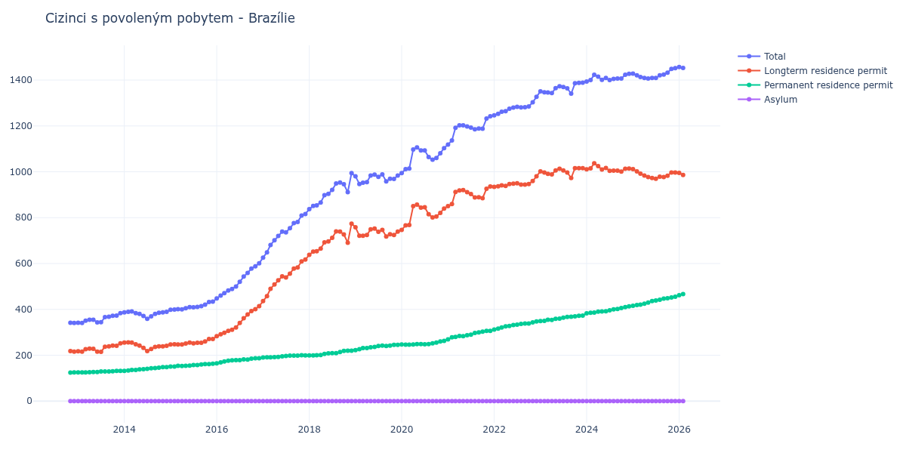

# Brazílie

## Souhrnné statistiky (Min/Max pro rok) / Summary Statistics (Min/Max per year)

| Year   | Total         | Longterm Residence Permit   | Permanent Residence Permit   | Asylum   |
|--------|---------------|-----------------------------|------------------------------|----------|
| 2012   | 341 / 342     | 216 / 218                   | 124 / 125                    | 0 / 0    |
| 2013   | 341 / 384     | 215 / 252                   | 125 / 132                    | 0 / 0    |
| 2014   | 359 / 391     | 218 / 256                   | 132 / 148                    | 0 / 0    |
| 2015   | 398 / 434     | 247 / 271                   | 151 / 163                    | 0 / 0    |
| 2016   | 448 / 601     | 283 / 414                   | 165 / 187                    | 0 / 0    |
| 2017   | 626 / 816     | 436 / 617                   | 190 / 200                    | 0 / 0    |
| 2018   | 837 / 994     | 638 / 774                   | 199 / 220                    | 0 / 0    |
| 2019   | 947 / 989     | 718 / 758                   | 222 / 245                    | 0 / 0    |
| 2020   | 994 / 1 106   | 747 / 857                   | 246 / 263                    | 0 / 0    |
| 2021   | 1 119 / 1 242 | 850 / 936                   | 269 / 306                    | 0 / 0    |
| 2022   | 1 246 / 1 327 | 934 / 980                   | 312 / 347                    | 0 / 0    |
| 2023   | 1 341 / 1 389 | 973 / 1 016                 | 349 / 373                    | 0 / 0    |
| 2024   | 1 394 / 1 427 | 1 001 / 1 037               | 383 / 413                    | 0 / 0    |
| 2025   | 1 407 / 1 452 | 970 / 1 012                 | 416 / 455                    | 0 / 0    |
| 2026   | 1 453 / 1 457 | 986 / 995                   | 462 / 467                    | 0 / 0    |

## Detailní tabulka / Detailed Data Table

| Date     | Total          | Longterm Residence Permit   | Permanent Residence Permit   | Asylum   |
|----------|----------------|-----------------------------|------------------------------|----------|
| **2012** |                |                             |                              |          |
| 11.2012  | 342            | 218                         | 124                          | 0        |
| 12.2012  | 341 (-0.29%)   | 216 (-0.92%)                | 125 (+0.81%)                 | 0        |
| **2013** |                |                             |                              |          |
| 01.2013  | 342 (+0.29%)   | 217 (+0.46%)                | 125 (+0.00%)                 | 0        |
| 02.2013  | 341 (-0.29%)   | 216 (-0.46%)                | 125 (+0.00%)                 | 0        |
| 03.2013  | 351 (+2.93%)   | 226 (+4.63%)                | 125 (+0.00%)                 | 0        |
| 04.2013  | 355 (+1.14%)   | 229 (+1.33%)                | 126 (+0.80%)                 | 0        |
| 05.2013  | 355 (+0.00%)   | 228 (-0.44%)                | 127 (+0.79%)                 | 0        |
| 06.2013  | 343 (-3.38%)   | 216 (-5.26%)                | 127 (+0.00%)                 | 0        |
| 07.2013  | 344 (+0.29%)   | 215 (-0.46%)                | 129 (+1.57%)                 | 0        |
| 08.2013  | 366 (+6.40%)   | 237 (+10.23%)               | 129 (+0.00%)                 | 0        |
| 09.2013  | 368 (+0.55%)   | 239 (+0.84%)                | 129 (+0.00%)                 | 0        |
| 10.2013  | 372 (+1.09%)   | 242 (+1.26%)                | 130 (+0.78%)                 | 0        |
| 11.2013  | 373 (+0.27%)   | 241 (-0.41%)                | 132 (+1.54%)                 | 0        |
| 12.2013  | 384 (+2.95%)   | 252 (+4.56%)                | 132 (+0.00%)                 | 0        |
| **2014** |                |                             |                              |          |
| 01.2014  | 387 (+0.78%)   | 255 (+1.19%)                | 132 (+0.00%)                 | 0        |
| 02.2014  | 389 (+0.52%)   | 256 (+0.39%)                | 133 (+0.76%)                 | 0        |
| 03.2014  | 391 (+0.51%)   | 255 (-0.39%)                | 136 (+2.26%)                 | 0        |
| 04.2014  | 384 (-1.79%)   | 248 (-2.75%)                | 136 (+0.00%)                 | 0        |
| 05.2014  | 380 (-1.04%)   | 242 (-2.42%)                | 138 (+1.47%)                 | 0        |
| 06.2014  | 371 (-2.37%)   | 232 (-4.13%)                | 139 (+0.72%)                 | 0        |
| 07.2014  | 359 (-3.23%)   | 218 (-6.03%)                | 141 (+1.44%)                 | 0        |
| 08.2014  | 370 (+3.06%)   | 227 (+4.13%)                | 143 (+1.42%)                 | 0        |
| 09.2014  | 380 (+2.70%)   | 236 (+3.96%)                | 144 (+0.70%)                 | 0        |
| 10.2014  | 385 (+1.32%)   | 239 (+1.27%)                | 146 (+1.39%)                 | 0        |
| 11.2014  | 387 (+0.52%)   | 239 (+0.00%)                | 148 (+1.37%)                 | 0        |
| 12.2014  | 389 (+0.52%)   | 241 (+0.84%)                | 148 (+0.00%)                 | 0        |
| **2015** |                |                             |                              |          |
| 01.2015  | 398 (+2.31%)   | 247 (+2.49%)                | 151 (+2.03%)                 | 0        |
| 02.2015  | 399 (+0.25%)   | 248 (+0.40%)                | 151 (+0.00%)                 | 0        |
| 03.2015  | 401 (+0.50%)   | 247 (-0.40%)                | 154 (+1.99%)                 | 0        |
| 04.2015  | 400 (-0.25%)   | 247 (+0.00%)                | 153 (-0.65%)                 | 0        |
| 05.2015  | 405 (+1.25%)   | 251 (+1.62%)                | 154 (+0.65%)                 | 0        |
| 06.2015  | 410 (+1.23%)   | 255 (+1.59%)                | 155 (+0.65%)                 | 0        |
| 07.2015  | 409 (-0.24%)   | 252 (-1.18%)                | 157 (+1.29%)                 | 0        |
| 08.2015  | 411 (+0.49%)   | 254 (+0.79%)                | 157 (+0.00%)                 | 0        |
| 09.2015  | 414 (+0.73%)   | 254 (+0.00%)                | 160 (+1.91%)                 | 0        |
| 10.2015  | 421 (+1.69%)   | 260 (+2.36%)                | 161 (+0.63%)                 | 0        |
| 11.2015  | 432 (+2.61%)   | 271 (+4.23%)                | 161 (+0.00%)                 | 0        |
| 12.2015  | 434 (+0.46%)   | 271 (+0.00%)                | 163 (+1.24%)                 | 0        |
| **2016** |                |                             |                              |          |
| 01.2016  | 448 (+3.23%)   | 283 (+4.43%)                | 165 (+1.23%)                 | 0        |
| 02.2016  | 460 (+2.68%)   | 291 (+2.83%)                | 169 (+2.42%)                 | 0        |
| 03.2016  | 471 (+2.39%)   | 298 (+2.41%)                | 173 (+2.37%)                 | 0        |
| 04.2016  | 482 (+2.34%)   | 306 (+2.68%)                | 176 (+1.73%)                 | 0        |
| 05.2016  | 489 (+1.45%)   | 311 (+1.63%)                | 178 (+1.14%)                 | 0        |
| 06.2016  | 500 (+2.25%)   | 321 (+3.22%)                | 179 (+0.56%)                 | 0        |
| 07.2016  | 520 (+4.00%)   | 341 (+6.23%)                | 179 (+0.00%)                 | 0        |
| 08.2016  | 543 (+4.42%)   | 361 (+5.87%)                | 182 (+1.68%)                 | 0        |
| 09.2016  | 559 (+2.95%)   | 378 (+4.71%)                | 181 (-0.55%)                 | 0        |
| 10.2016  | 578 (+3.40%)   | 393 (+3.97%)                | 185 (+2.21%)                 | 0        |
| 11.2016  | 588 (+1.73%)   | 401 (+2.04%)                | 187 (+1.08%)                 | 0        |
| 12.2016  | 601 (+2.21%)   | 414 (+3.24%)                | 187 (+0.00%)                 | 0        |
| **2017** |                |                             |                              |          |
| 01.2017  | 626 (+4.16%)   | 436 (+5.31%)                | 190 (+1.60%)                 | 0        |
| 02.2017  | 649 (+3.67%)   | 458 (+5.05%)                | 191 (+0.53%)                 | 0        |
| 03.2017  | 681 (+4.93%)   | 490 (+6.99%)                | 191 (+0.00%)                 | 0        |
| 04.2017  | 701 (+2.94%)   | 509 (+3.88%)                | 192 (+0.52%)                 | 0        |
| 05.2017  | 720 (+2.71%)   | 527 (+3.54%)                | 193 (+0.52%)                 | 0        |
| 06.2017  | 739 (+2.64%)   | 544 (+3.23%)                | 195 (+1.04%)                 | 0        |
| 07.2017  | 736 (-0.41%)   | 539 (-0.92%)                | 197 (+1.03%)                 | 0        |
| 08.2017  | 754 (+2.45%)   | 556 (+3.15%)                | 198 (+0.51%)                 | 0        |
| 09.2017  | 776 (+2.92%)   | 578 (+3.96%)                | 198 (+0.00%)                 | 0        |
| 10.2017  | 781 (+0.64%)   | 583 (+0.87%)                | 198 (+0.00%)                 | 0        |
| 11.2017  | 809 (+3.59%)   | 609 (+4.46%)                | 200 (+1.01%)                 | 0        |
| 12.2017  | 816 (+0.87%)   | 617 (+1.31%)                | 199 (-0.50%)                 | 0        |
| **2018** |                |                             |                              |          |
| 01.2018  | 837 (+2.57%)   | 638 (+3.40%)                | 199 (+0.00%)                 | 0        |
| 02.2018  | 851 (+1.67%)   | 652 (+2.19%)                | 199 (+0.00%)                 | 0        |
| 03.2018  | 854 (+0.35%)   | 654 (+0.31%)                | 200 (+0.50%)                 | 0        |
| 04.2018  | 866 (+1.41%)   | 665 (+1.68%)                | 201 (+0.50%)                 | 0        |
| 05.2018  | 898 (+3.70%)   | 692 (+4.06%)                | 206 (+2.49%)                 | 0        |
| 06.2018  | 904 (+0.67%)   | 696 (+0.58%)                | 208 (+0.97%)                 | 0        |
| 07.2018  | 921 (+1.88%)   | 712 (+2.30%)                | 209 (+0.48%)                 | 0        |
| 08.2018  | 949 (+3.04%)   | 740 (+3.93%)                | 209 (+0.00%)                 | 0        |
| 09.2018  | 953 (+0.42%)   | 739 (-0.14%)                | 214 (+2.39%)                 | 0        |
| 10.2018  | 946 (-0.73%)   | 727 (-1.62%)                | 219 (+2.34%)                 | 0        |
| 11.2018  | 911 (-3.70%)   | 691 (-4.95%)                | 220 (+0.46%)                 | 0        |
| 12.2018  | 994 (+9.11%)   | 774 (+12.01%)               | 220 (+0.00%)                 | 0        |
| **2019** |                |                             |                              |          |
| 01.2019  | 980 (-1.41%)   | 758 (-2.07%)                | 222 (+0.91%)                 | 0        |
| 02.2019  | 947 (-3.37%)   | 721 (-4.88%)                | 226 (+1.80%)                 | 0        |
| 03.2019  | 952 (+0.53%)   | 721 (+0.00%)                | 231 (+2.21%)                 | 0        |
| 04.2019  | 955 (+0.32%)   | 724 (+0.42%)                | 231 (+0.00%)                 | 0        |
| 05.2019  | 984 (+3.04%)   | 749 (+3.45%)                | 235 (+1.73%)                 | 0        |
| 06.2019  | 988 (+0.41%)   | 752 (+0.40%)                | 236 (+0.43%)                 | 0        |
| 07.2019  | 978 (-1.01%)   | 738 (-1.86%)                | 240 (+1.69%)                 | 0        |
| 08.2019  | 989 (+1.12%)   | 747 (+1.22%)                | 242 (+0.83%)                 | 0        |
| 09.2019  | 958 (-3.13%)   | 718 (-3.88%)                | 240 (-0.83%)                 | 0        |
| 10.2019  | 970 (+1.25%)   | 728 (+1.39%)                | 242 (+0.83%)                 | 0        |
| 11.2019  | 969 (-0.10%)   | 724 (-0.55%)                | 245 (+1.24%)                 | 0        |
| 12.2019  | 984 (+1.55%)   | 739 (+2.07%)                | 245 (+0.00%)                 | 0        |
| **2020** |                |                             |                              |          |
| 01.2020  | 994 (+1.02%)   | 747 (+1.08%)                | 247 (+0.82%)                 | 0        |
| 02.2020  | 1 012 (+1.81%) | 766 (+2.54%)                | 246 (-0.40%)                 | 0        |
| 03.2020  | 1 014 (+0.20%) | 768 (+0.26%)                | 246 (+0.00%)                 | 0        |
| 04.2020  | 1 097 (+8.19%) | 850 (+10.68%)               | 247 (+0.41%)                 | 0        |
| 05.2020  | 1 106 (+0.82%) | 857 (+0.82%)                | 249 (+0.81%)                 | 0        |
| 06.2020  | 1 093 (-1.18%) | 844 (-1.52%)                | 249 (+0.00%)                 | 0        |
| 07.2020  | 1 093 (+0.00%) | 845 (+0.12%)                | 248 (-0.40%)                 | 0        |
| 08.2020  | 1 064 (-2.65%) | 815 (-3.55%)                | 249 (+0.40%)                 | 0        |
| 09.2020  | 1 053 (-1.03%) | 801 (-1.72%)                | 252 (+1.20%)                 | 0        |
| 10.2020  | 1 060 (+0.66%) | 805 (+0.50%)                | 255 (+1.19%)                 | 0        |
| 11.2020  | 1 081 (+1.98%) | 821 (+1.99%)                | 260 (+1.96%)                 | 0        |
| 12.2020  | 1 103 (+2.04%) | 840 (+2.31%)                | 263 (+1.15%)                 | 0        |
| **2021** |                |                             |                              |          |
| 01.2021  | 1 119 (+1.45%) | 850 (+1.19%)                | 269 (+2.28%)                 | 0        |
| 02.2021  | 1 137 (+1.61%) | 859 (+1.06%)                | 278 (+3.35%)                 | 0        |
| 03.2021  | 1 192 (+4.84%) | 912 (+6.17%)                | 280 (+0.72%)                 | 0        |
| 04.2021  | 1 203 (+0.92%) | 919 (+0.77%)                | 284 (+1.43%)                 | 0        |
| 05.2021  | 1 203 (+0.00%) | 920 (+0.11%)                | 283 (-0.35%)                 | 0        |
| 06.2021  | 1 198 (-0.42%) | 911 (-0.98%)                | 287 (+1.41%)                 | 0        |
| 07.2021  | 1 193 (-0.42%) | 903 (-0.88%)                | 290 (+1.05%)                 | 0        |
| 08.2021  | 1 185 (-0.67%) | 888 (-1.66%)                | 297 (+2.41%)                 | 0        |
| 09.2021  | 1 189 (+0.34%) | 889 (+0.11%)                | 300 (+1.01%)                 | 0        |
| 10.2021  | 1 188 (-0.08%) | 885 (-0.45%)                | 303 (+1.00%)                 | 0        |
| 11.2021  | 1 232 (+3.70%) | 926 (+4.63%)                | 306 (+0.99%)                 | 0        |
| 12.2021  | 1 242 (+0.81%) | 936 (+1.08%)                | 306 (+0.00%)                 | 0        |
| **2022** |                |                             |                              |          |
| 01.2022  | 1 246 (+0.32%) | 934 (-0.21%)                | 312 (+1.96%)                 | 0        |
| 02.2022  | 1 253 (+0.56%) | 937 (+0.32%)                | 316 (+1.28%)                 | 0        |
| 03.2022  | 1 262 (+0.72%) | 941 (+0.43%)                | 321 (+1.58%)                 | 0        |
| 04.2022  | 1 264 (+0.16%) | 938 (-0.32%)                | 326 (+1.56%)                 | 0        |
| 05.2022  | 1 275 (+0.87%) | 947 (+0.96%)                | 328 (+0.61%)                 | 0        |
| 06.2022  | 1 280 (+0.39%) | 948 (+0.11%)                | 332 (+1.22%)                 | 0        |
| 07.2022  | 1 283 (+0.23%) | 950 (+0.21%)                | 333 (+0.30%)                 | 0        |
| 08.2022  | 1 281 (-0.16%) | 944 (-0.63%)                | 337 (+1.20%)                 | 0        |
| 09.2022  | 1 282 (+0.08%) | 944 (+0.00%)                | 338 (+0.30%)                 | 0        |
| 10.2022  | 1 285 (+0.23%) | 947 (+0.32%)                | 338 (+0.00%)                 | 0        |
| 11.2022  | 1 303 (+1.40%) | 960 (+1.37%)                | 343 (+1.48%)                 | 0        |
| 12.2022  | 1 327 (+1.84%) | 980 (+2.08%)                | 347 (+1.17%)                 | 0        |
| **2023** |                |                             |                              |          |
| 01.2023  | 1 351 (+1.81%) | 1 002 (+2.24%)              | 349 (+0.58%)                 | 0        |
| 02.2023  | 1 347 (-0.30%) | 997 (-0.50%)                | 350 (+0.29%)                 | 0        |
| 03.2023  | 1 346 (-0.07%) | 991 (-0.60%)                | 355 (+1.43%)                 | 0        |
| 04.2023  | 1 343 (-0.22%) | 989 (-0.20%)                | 354 (-0.28%)                 | 0        |
| 05.2023  | 1 365 (+1.64%) | 1 006 (+1.72%)              | 359 (+1.41%)                 | 0        |
| 06.2023  | 1 373 (+0.59%) | 1 013 (+0.70%)              | 360 (+0.28%)                 | 0        |
| 07.2023  | 1 370 (-0.22%) | 1 006 (-0.69%)              | 364 (+1.11%)                 | 0        |
| 08.2023  | 1 364 (-0.44%) | 997 (-0.89%)                | 367 (+0.82%)                 | 0        |
| 09.2023  | 1 341 (-1.69%) | 973 (-2.41%)                | 368 (+0.27%)                 | 0        |
| 10.2023  | 1 386 (+3.36%) | 1 016 (+4.42%)              | 370 (+0.54%)                 | 0        |
| 11.2023  | 1 388 (+0.14%) | 1 016 (+0.00%)              | 372 (+0.54%)                 | 0        |
| 12.2023  | 1 389 (+0.07%) | 1 016 (+0.00%)              | 373 (+0.27%)                 | 0        |
| **2024** |                |                             |                              |          |
| 01.2024  | 1 394 (+0.36%) | 1 011 (-0.49%)              | 383 (+2.68%)                 | 0        |
| 02.2024  | 1 400 (+0.43%) | 1 015 (+0.40%)              | 385 (+0.52%)                 | 0        |
| 03.2024  | 1 423 (+1.64%) | 1 037 (+2.17%)              | 386 (+0.26%)                 | 0        |
| 04.2024  | 1 415 (-0.56%) | 1 025 (-1.16%)              | 390 (+1.04%)                 | 0        |
| 05.2024  | 1 401 (-0.99%) | 1 010 (-1.46%)              | 391 (+0.26%)                 | 0        |
| 06.2024  | 1 409 (+0.57%) | 1 017 (+0.69%)              | 392 (+0.26%)                 | 0        |
| 07.2024  | 1 400 (-0.64%) | 1 004 (-1.28%)              | 396 (+1.02%)                 | 0        |
| 08.2024  | 1 405 (+0.36%) | 1 005 (+0.10%)              | 400 (+1.01%)                 | 0        |
| 09.2024  | 1 407 (+0.14%) | 1 005 (+0.00%)              | 402 (+0.50%)                 | 0        |
| 10.2024  | 1 407 (+0.00%) | 1 001 (-0.40%)              | 406 (+1.00%)                 | 0        |
| 11.2024  | 1 423 (+1.14%) | 1 013 (+1.20%)              | 410 (+0.99%)                 | 0        |
| 12.2024  | 1 427 (+0.28%) | 1 014 (+0.10%)              | 413 (+0.73%)                 | 0        |
| **2025** |                |                             |                              |          |
| 01.2025  | 1 428 (+0.07%) | 1 012 (-0.20%)              | 416 (+0.73%)                 | 0        |
| 02.2025  | 1 421 (-0.49%) | 1 002 (-0.99%)              | 419 (+0.72%)                 | 0        |
| 03.2025  | 1 413 (-0.56%) | 992 (-1.00%)                | 421 (+0.48%)                 | 0        |
| 04.2025  | 1 409 (-0.28%) | 984 (-0.81%)                | 425 (+0.95%)                 | 0        |
| 05.2025  | 1 407 (-0.14%) | 977 (-0.71%)                | 430 (+1.18%)                 | 0        |
| 06.2025  | 1 409 (+0.14%) | 973 (-0.41%)                | 436 (+1.40%)                 | 0        |
| 07.2025  | 1 409 (+0.00%) | 970 (-0.31%)                | 439 (+0.69%)                 | 0        |
| 08.2025  | 1 421 (+0.85%) | 979 (+0.93%)                | 442 (+0.68%)                 | 0        |
| 09.2025  | 1 424 (+0.21%) | 977 (-0.20%)                | 447 (+1.13%)                 | 0        |
| 10.2025  | 1 432 (+0.56%) | 983 (+0.61%)                | 449 (+0.45%)                 | 0        |
| 11.2025  | 1 449 (+1.19%) | 997 (+1.42%)                | 452 (+0.67%)                 | 0        |
| 12.2025  | 1 452 (+0.21%) | 997 (+0.00%)                | 455 (+0.66%)                 | 0        |
| **2026** |                |                             |                              |          |
| 01.2026  | 1 457 (+0.34%) | 995 (-0.20%)                | 462 (+1.54%)                 | 0        |
| 02.2026  | 1 453 (-0.27%) | 986 (-0.90%)                | 467 (+1.08%)                 | 0        |
