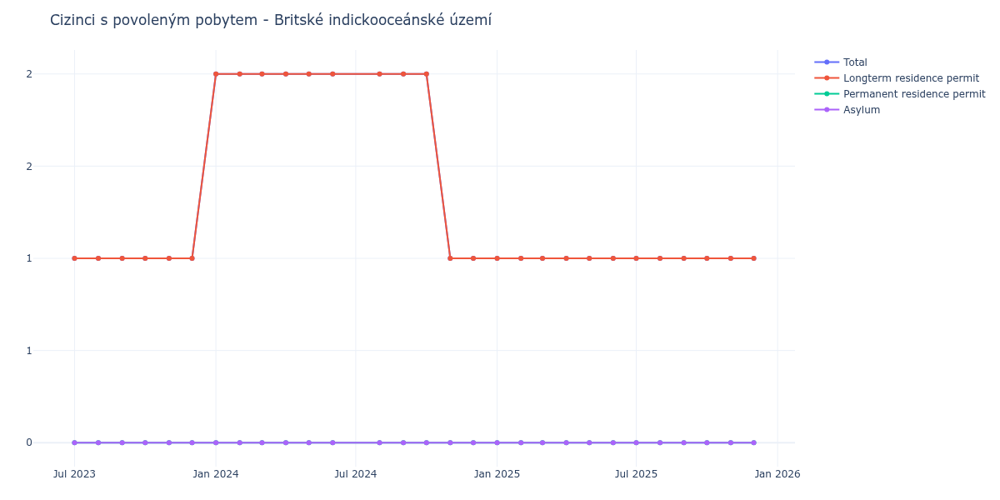

# Britské indickooceánské území

## Souhrnné statistiky (Min/Max pro rok) / Summary Statistics (Min/Max per year)

| Year   | Total Min/Max   | Longterm Residence Permit Min/Max   | Permanent Residence Permit Min/Max   | Asylum Min/Max   |
|--------|-----------------|-------------------------------------|--------------------------------------|------------------|
| 2023   | 1 / 1           | 1 / 1                               | 0 / 0                                | 0 / 0            |
| 2024   | 1 / 2           | 1 / 2                               | 0 / 0                                | 0 / 0            |
| 2025   | 1 / 1           | 1 / 1                               | 0 / 0                                | 0 / 0            |

## Detailní tabulka / Detailed Data Table

| Date     | Total        | Longterm Residence Permit   | Permanent Residence Permit   | Asylum   |
|----------|--------------|-----------------------------|------------------------------|----------|
| **2023** |              |                             |                              |          |
| 07.2023  | 1            | 1                           | 0                            | 0        |
| 08.2023  | 1 (+0.00%)   | 1 (+0.00%)                  | 0                            | 0        |
| 09.2023  | 1 (+0.00%)   | 1 (+0.00%)                  | 0                            | 0        |
| 10.2023  | 1 (+0.00%)   | 1 (+0.00%)                  | 0                            | 0        |
| 11.2023  | 1 (+0.00%)   | 1 (+0.00%)                  | 0                            | 0        |
| 12.2023  | 1 (+0.00%)   | 1 (+0.00%)                  | 0                            | 0        |
| **2024** |              |                             |                              |          |
| 01.2024  | 2 (+100.00%) | 2 (+100.00%)                | 0                            | 0        |
| 02.2024  | 2 (+0.00%)   | 2 (+0.00%)                  | 0                            | 0        |
| 03.2024  | 2 (+0.00%)   | 2 (+0.00%)                  | 0                            | 0        |
| 04.2024  | 2 (+0.00%)   | 2 (+0.00%)                  | 0                            | 0        |
| 05.2024  | 2 (+0.00%)   | 2 (+0.00%)                  | 0                            | 0        |
| 06.2024  | 2 (+0.00%)   | 2 (+0.00%)                  | 0                            | 0        |
| 08.2024  | 2 (+0.00%)   | 2 (+0.00%)                  | 0                            | 0        |
| 09.2024  | 2 (+0.00%)   | 2 (+0.00%)                  | 0                            | 0        |
| 10.2024  | 2 (+0.00%)   | 2 (+0.00%)                  | 0                            | 0        |
| 11.2024  | 1 (-50.00%)  | 1 (-50.00%)                 | 0                            | 0        |
| 12.2024  | 1 (+0.00%)   | 1 (+0.00%)                  | 0                            | 0        |
| **2025** |              |                             |                              |          |
| 01.2025  | 1 (+0.00%)   | 1 (+0.00%)                  | 0                            | 0        |
| 02.2025  | 1 (+0.00%)   | 1 (+0.00%)                  | 0                            | 0        |
| 03.2025  | 1 (+0.00%)   | 1 (+0.00%)                  | 0                            | 0        |
| 04.2025  | 1 (+0.00%)   | 1 (+0.00%)                  | 0                            | 0        |
| 05.2025  | 1 (+0.00%)   | 1 (+0.00%)                  | 0                            | 0        |
| 06.2025  | 1 (+0.00%)   | 1 (+0.00%)                  | 0                            | 0        |
| 07.2025  | 1 (+0.00%)   | 1 (+0.00%)                  | 0                            | 0        |
| 08.2025  | 1 (+0.00%)   | 1 (+0.00%)                  | 0                            | 0        |
| 09.2025  | 1 (+0.00%)   | 1 (+0.00%)                  | 0                            | 0        |
| 10.2025  | 1 (+0.00%)   | 1 (+0.00%)                  | 0                            | 0        |
| 11.2025  | 1 (+0.00%)   | 1 (+0.00%)                  | 0                            | 0        |
| 12.2025  | 1 (+0.00%)   | 1 (+0.00%)                  | 0                            | 0        |
