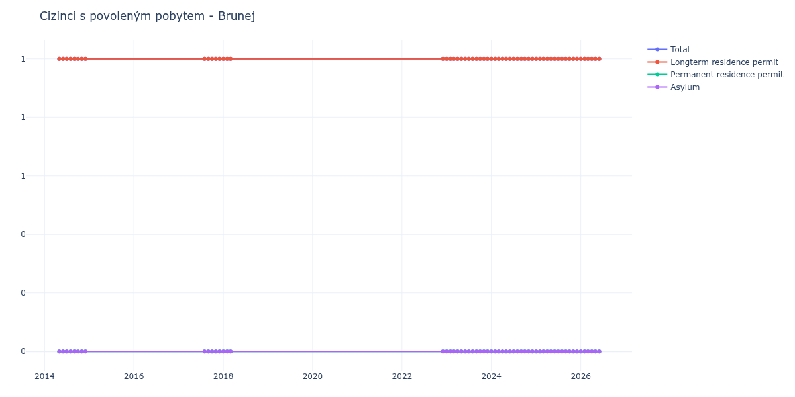

# Brunej

## Souhrnné statistiky (Min/Max pro rok) / Summary Statistics (Min/Max per year)

| Year   | Total   | Longterm Residence Permit   | Permanent Residence Permit   | Asylum   |
|--------|---------|-----------------------------|------------------------------|----------|
| 2014   | 1 / 1   | 1 / 1                       | 0 / 0                        | 0 / 0    |
| 2017   | 1 / 1   | 1 / 1                       | 0 / 0                        | 0 / 0    |
| 2018   | 1 / 1   | 1 / 1                       | 0 / 0                        | 0 / 0    |
| 2022   | 1 / 1   | 1 / 1                       | 0 / 0                        | 0 / 0    |
| 2023   | 1 / 1   | 1 / 1                       | 0 / 0                        | 0 / 0    |
| 2024   | 1 / 1   | 1 / 1                       | 0 / 0                        | 0 / 0    |
| 2025   | 1 / 1   | 1 / 1                       | 0 / 0                        | 0 / 0    |
| 2026   | 1 / 1   | 1 / 1                       | 0 / 0                        | 0 / 0    |

## Detailní tabulka / Detailed Data Table

| Date     | Total      | Longterm Residence Permit   | Permanent Residence Permit   | Asylum   |
|----------|------------|-----------------------------|------------------------------|----------|
| **2014** |            |                             |                              |          |
| 05.2014  | 1          | 1                           | 0                            | 0        |
| 06.2014  | 1 (+0.00%) | 1 (+0.00%)                  | 0                            | 0        |
| 07.2014  | 1 (+0.00%) | 1 (+0.00%)                  | 0                            | 0        |
| 08.2014  | 1 (+0.00%) | 1 (+0.00%)                  | 0                            | 0        |
| 09.2014  | 1 (+0.00%) | 1 (+0.00%)                  | 0                            | 0        |
| 10.2014  | 1 (+0.00%) | 1 (+0.00%)                  | 0                            | 0        |
| 11.2014  | 1 (+0.00%) | 1 (+0.00%)                  | 0                            | 0        |
| 12.2014  | 1 (+0.00%) | 1 (+0.00%)                  | 0                            | 0        |
| **2017** |            |                             |                              |          |
| 08.2017  | 1 (+0.00%) | 1 (+0.00%)                  | 0                            | 0        |
| 09.2017  | 1 (+0.00%) | 1 (+0.00%)                  | 0                            | 0        |
| 10.2017  | 1 (+0.00%) | 1 (+0.00%)                  | 0                            | 0        |
| 11.2017  | 1 (+0.00%) | 1 (+0.00%)                  | 0                            | 0        |
| 12.2017  | 1 (+0.00%) | 1 (+0.00%)                  | 0                            | 0        |
| **2018** |            |                             |                              |          |
| 01.2018  | 1 (+0.00%) | 1 (+0.00%)                  | 0                            | 0        |
| 02.2018  | 1 (+0.00%) | 1 (+0.00%)                  | 0                            | 0        |
| 03.2018  | 1 (+0.00%) | 1 (+0.00%)                  | 0                            | 0        |
| **2022** |            |                             |                              |          |
| 12.2022  | 1 (+0.00%) | 1 (+0.00%)                  | 0                            | 0        |
| **2023** |            |                             |                              |          |
| 01.2023  | 1 (+0.00%) | 1 (+0.00%)                  | 0                            | 0        |
| 02.2023  | 1 (+0.00%) | 1 (+0.00%)                  | 0                            | 0        |
| 03.2023  | 1 (+0.00%) | 1 (+0.00%)                  | 0                            | 0        |
| 04.2023  | 1 (+0.00%) | 1 (+0.00%)                  | 0                            | 0        |
| 05.2023  | 1 (+0.00%) | 1 (+0.00%)                  | 0                            | 0        |
| 06.2023  | 1 (+0.00%) | 1 (+0.00%)                  | 0                            | 0        |
| 07.2023  | 1 (+0.00%) | 1 (+0.00%)                  | 0                            | 0        |
| 08.2023  | 1 (+0.00%) | 1 (+0.00%)                  | 0                            | 0        |
| 09.2023  | 1 (+0.00%) | 1 (+0.00%)                  | 0                            | 0        |
| 10.2023  | 1 (+0.00%) | 1 (+0.00%)                  | 0                            | 0        |
| 11.2023  | 1 (+0.00%) | 1 (+0.00%)                  | 0                            | 0        |
| 12.2023  | 1 (+0.00%) | 1 (+0.00%)                  | 0                            | 0        |
| **2024** |            |                             |                              |          |
| 01.2024  | 1 (+0.00%) | 1 (+0.00%)                  | 0                            | 0        |
| 02.2024  | 1 (+0.00%) | 1 (+0.00%)                  | 0                            | 0        |
| 03.2024  | 1 (+0.00%) | 1 (+0.00%)                  | 0                            | 0        |
| 04.2024  | 1 (+0.00%) | 1 (+0.00%)                  | 0                            | 0        |
| 05.2024  | 1 (+0.00%) | 1 (+0.00%)                  | 0                            | 0        |
| 06.2024  | 1 (+0.00%) | 1 (+0.00%)                  | 0                            | 0        |
| 07.2024  | 1 (+0.00%) | 1 (+0.00%)                  | 0                            | 0        |
| 08.2024  | 1 (+0.00%) | 1 (+0.00%)                  | 0                            | 0        |
| 09.2024  | 1 (+0.00%) | 1 (+0.00%)                  | 0                            | 0        |
| 10.2024  | 1 (+0.00%) | 1 (+0.00%)                  | 0                            | 0        |
| 11.2024  | 1 (+0.00%) | 1 (+0.00%)                  | 0                            | 0        |
| 12.2024  | 1 (+0.00%) | 1 (+0.00%)                  | 0                            | 0        |
| **2025** |            |                             |                              |          |
| 01.2025  | 1 (+0.00%) | 1 (+0.00%)                  | 0                            | 0        |
| 02.2025  | 1 (+0.00%) | 1 (+0.00%)                  | 0                            | 0        |
| 03.2025  | 1 (+0.00%) | 1 (+0.00%)                  | 0                            | 0        |
| 04.2025  | 1 (+0.00%) | 1 (+0.00%)                  | 0                            | 0        |
| 05.2025  | 1 (+0.00%) | 1 (+0.00%)                  | 0                            | 0        |
| 06.2025  | 1 (+0.00%) | 1 (+0.00%)                  | 0                            | 0        |
| 07.2025  | 1 (+0.00%) | 1 (+0.00%)                  | 0                            | 0        |
| 08.2025  | 1 (+0.00%) | 1 (+0.00%)                  | 0                            | 0        |
| 09.2025  | 1 (+0.00%) | 1 (+0.00%)                  | 0                            | 0        |
| 10.2025  | 1 (+0.00%) | 1 (+0.00%)                  | 0                            | 0        |
| 11.2025  | 1 (+0.00%) | 1 (+0.00%)                  | 0                            | 0        |
| 12.2025  | 1 (+0.00%) | 1 (+0.00%)                  | 0                            | 0        |
| **2026** |            |                             |                              |          |
| 01.2026  | 1 (+0.00%) | 1 (+0.00%)                  | 0                            | 0        |
| 02.2026  | 1 (+0.00%) | 1 (+0.00%)                  | 0                            | 0        |
| 03.2026  | 1 (+0.00%) | 1 (+0.00%)                  | 0                            | 0        |
| 04.2026  | 1 (+0.00%) | 1 (+0.00%)                  | 0                            | 0        |
| 05.2026  | 1 (+0.00%) | 1 (+0.00%)                  | 0                            | 0        |
| 06.2026  | 1 (+0.00%) | 1 (+0.00%)                  | 0                            | 0        |
