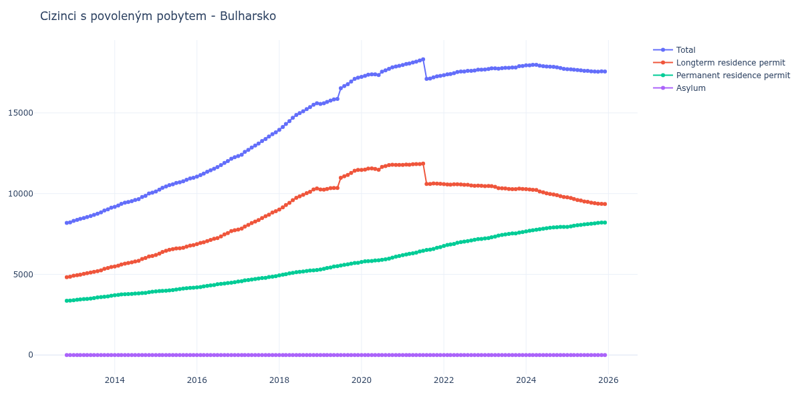

# Bulharsko

## Souhrnné statistiky (Min/Max pro rok) / Summary Statistics (Min/Max per year)

| Year   | Total Min/Max   | Longterm Residence Permit Min/Max   | Permanent Residence Permit Min/Max   | Asylum Min/Max   |
|--------|-----------------|-------------------------------------|--------------------------------------|------------------|
| 2012   | 8 185 / 8 222   | 4 824 / 4 849                       | 3 361 / 3 373                        | 0 / 0            |
| 2013   | 8 312 / 9 132   | 4 916 / 5 455                       | 3 396 / 3 677                        | 0 / 0            |
| 2014   | 9 182 / 10 058  | 5 481 / 6 137                       | 3 701 / 3 921                        | 0 / 0            |
| 2015   | 10 136 / 10 984 | 6 197 / 6 809                       | 3 939 / 4 175                        | 0 / 0            |
| 2016   | 11 058 / 12 250 | 6 868 / 7 734                       | 4 190 / 4 516                        | 0 / 0            |
| 2017   | 12 321 / 13 795 | 7 772 / 8 907                       | 4 549 / 4 888                        | 0 / 0            |
| 2018   | 13 951 / 15 593 | 9 013 / 10 322                      | 4 938 / 5 271                        | 0 / 0            |
| 2019   | 15 557 / 17 183 | 10 250 / 11 469                     | 5 297 / 5 714                        | 0 / 0            |
| 2020   | 17 230 / 17 917 | 11 462 / 11 784                     | 5 768 / 6 140                        | 0 / 0            |
| 2021   | 17 107 / 18 318 | 10 596 / 11 862                     | 6 187 / 6 687                        | 0 / 0            |
| 2022   | 17 340 / 17 675 | 10 481 / 10 583                     | 6 757 / 7 192                        | 0 / 0            |
| 2023   | 17 684 / 17 907 | 10 276 / 10 476                     | 7 220 / 7 615                        | 0 / 0            |
| 2024   | 17 733 / 17 980 | 9 791 / 10 281                      | 7 660 / 7 942                        | 0 / 0            |
| 2025   | 17 556 / 17 709 | 9 356 / 9 767                       | 7 942 / 8 206                        | 0 / 0            |

## Detailní tabulka / Detailed Data Table

| Date     | Total           | Longterm Residence Permit   | Permanent Residence Permit   | Asylum   |
|----------|-----------------|-----------------------------|------------------------------|----------|
| **2012** |                 |                             |                              |          |
| 11.2012  | 8 185           | 4 824                       | 3 361                        | 0        |
| 12.2012  | 8 222 (+0.45%)  | 4 849 (+0.52%)              | 3 373 (+0.36%)               | 0        |
| **2013** |                 |                             |                              |          |
| 01.2013  | 8 312 (+1.09%)  | 4 916 (+1.38%)              | 3 396 (+0.68%)               | 0        |
| 02.2013  | 8 368 (+0.67%)  | 4 943 (+0.55%)              | 3 425 (+0.85%)               | 0        |
| 03.2013  | 8 433 (+0.78%)  | 4 982 (+0.79%)              | 3 451 (+0.76%)               | 0        |
| 04.2013  | 8 489 (+0.66%)  | 5 027 (+0.90%)              | 3 462 (+0.32%)               | 0        |
| 05.2013  | 8 544 (+0.65%)  | 5 067 (+0.80%)              | 3 477 (+0.43%)               | 0        |
| 06.2013  | 8 614 (+0.82%)  | 5 112 (+0.89%)              | 3 502 (+0.72%)               | 0        |
| 07.2013  | 8 683 (+0.80%)  | 5 154 (+0.82%)              | 3 529 (+0.77%)               | 0        |
| 08.2013  | 8 758 (+0.86%)  | 5 192 (+0.74%)              | 3 566 (+1.05%)               | 0        |
| 09.2013  | 8 837 (+0.90%)  | 5 251 (+1.14%)              | 3 586 (+0.56%)               | 0        |
| 10.2013  | 8 953 (+1.31%)  | 5 340 (+1.69%)              | 3 613 (+0.75%)               | 0        |
| 11.2013  | 9 027 (+0.83%)  | 5 391 (+0.96%)              | 3 636 (+0.64%)               | 0        |
| 12.2013  | 9 132 (+1.16%)  | 5 455 (+1.19%)              | 3 677 (+1.13%)               | 0        |
| **2014** |                 |                             |                              |          |
| 01.2014  | 9 182 (+0.55%)  | 5 481 (+0.48%)              | 3 701 (+0.65%)               | 0        |
| 02.2014  | 9 266 (+0.91%)  | 5 536 (+1.00%)              | 3 730 (+0.78%)               | 0        |
| 03.2014  | 9 370 (+1.12%)  | 5 614 (+1.41%)              | 3 756 (+0.70%)               | 0        |
| 04.2014  | 9 435 (+0.69%)  | 5 664 (+0.89%)              | 3 771 (+0.40%)               | 0        |
| 05.2014  | 9 478 (+0.46%)  | 5 705 (+0.72%)              | 3 773 (+0.05%)               | 0        |
| 06.2014  | 9 530 (+0.55%)  | 5 745 (+0.70%)              | 3 785 (+0.32%)               | 0        |
| 07.2014  | 9 605 (+0.79%)  | 5 794 (+0.85%)              | 3 811 (+0.69%)               | 0        |
| 08.2014  | 9 657 (+0.54%)  | 5 835 (+0.71%)              | 3 822 (+0.29%)               | 0        |
| 09.2014  | 9 792 (+1.40%)  | 5 954 (+2.04%)              | 3 838 (+0.42%)               | 0        |
| 10.2014  | 9 865 (+0.75%)  | 6 011 (+0.96%)              | 3 854 (+0.42%)               | 0        |
| 11.2014  | 10 003 (+1.40%) | 6 109 (+1.63%)              | 3 894 (+1.04%)               | 0        |
| 12.2014  | 10 058 (+0.55%) | 6 137 (+0.46%)              | 3 921 (+0.69%)               | 0        |
| **2015** |                 |                             |                              |          |
| 01.2015  | 10 136 (+0.78%) | 6 197 (+0.98%)              | 3 939 (+0.46%)               | 0        |
| 02.2015  | 10 244 (+1.07%) | 6 282 (+1.37%)              | 3 962 (+0.58%)               | 0        |
| 03.2015  | 10 357 (+1.10%) | 6 385 (+1.64%)              | 3 972 (+0.25%)               | 0        |
| 04.2015  | 10 441 (+0.81%) | 6 455 (+1.10%)              | 3 986 (+0.35%)               | 0        |
| 05.2015  | 10 526 (+0.81%) | 6 516 (+0.95%)              | 4 010 (+0.60%)               | 0        |
| 06.2015  | 10 582 (+0.53%) | 6 557 (+0.63%)              | 4 025 (+0.37%)               | 0        |
| 07.2015  | 10 657 (+0.71%) | 6 603 (+0.70%)              | 4 054 (+0.72%)               | 0        |
| 08.2015  | 10 704 (+0.44%) | 6 611 (+0.12%)              | 4 093 (+0.96%)               | 0        |
| 09.2015  | 10 763 (+0.55%) | 6 645 (+0.51%)              | 4 118 (+0.61%)               | 0        |
| 10.2015  | 10 854 (+0.85%) | 6 712 (+1.01%)              | 4 142 (+0.58%)               | 0        |
| 11.2015  | 10 936 (+0.76%) | 6 779 (+1.00%)              | 4 157 (+0.36%)               | 0        |
| 12.2015  | 10 984 (+0.44%) | 6 809 (+0.44%)              | 4 175 (+0.43%)               | 0        |
| **2016** |                 |                             |                              |          |
| 01.2016  | 11 058 (+0.67%) | 6 868 (+0.87%)              | 4 190 (+0.36%)               | 0        |
| 02.2016  | 11 150 (+0.83%) | 6 940 (+1.05%)              | 4 210 (+0.48%)               | 0        |
| 03.2016  | 11 240 (+0.81%) | 6 984 (+0.63%)              | 4 256 (+1.09%)               | 0        |
| 04.2016  | 11 348 (+0.96%) | 7 061 (+1.10%)              | 4 287 (+0.73%)               | 0        |
| 05.2016  | 11 441 (+0.82%) | 7 126 (+0.92%)              | 4 315 (+0.65%)               | 0        |
| 06.2016  | 11 539 (+0.86%) | 7 198 (+1.01%)              | 4 341 (+0.60%)               | 0        |
| 07.2016  | 11 638 (+0.86%) | 7 246 (+0.67%)              | 4 392 (+1.17%)               | 0        |
| 08.2016  | 11 763 (+1.07%) | 7 353 (+1.48%)              | 4 410 (+0.41%)               | 0        |
| 09.2016  | 11 902 (+1.18%) | 7 473 (+1.63%)              | 4 429 (+0.43%)               | 0        |
| 10.2016  | 12 013 (+0.93%) | 7 557 (+1.12%)              | 4 456 (+0.61%)               | 0        |
| 11.2016  | 12 159 (+1.22%) | 7 674 (+1.55%)              | 4 485 (+0.65%)               | 0        |
| 12.2016  | 12 250 (+0.75%) | 7 734 (+0.78%)              | 4 516 (+0.69%)               | 0        |
| **2017** |                 |                             |                              |          |
| 01.2017  | 12 321 (+0.58%) | 7 772 (+0.49%)              | 4 549 (+0.73%)               | 0        |
| 02.2017  | 12 404 (+0.67%) | 7 834 (+0.80%)              | 4 570 (+0.46%)               | 0        |
| 03.2017  | 12 582 (+1.44%) | 7 960 (+1.61%)              | 4 622 (+1.14%)               | 0        |
| 04.2017  | 12 706 (+0.99%) | 8 057 (+1.22%)              | 4 649 (+0.58%)               | 0        |
| 05.2017  | 12 858 (+1.20%) | 8 176 (+1.48%)              | 4 682 (+0.71%)               | 0        |
| 06.2017  | 12 981 (+0.96%) | 8 269 (+1.14%)              | 4 712 (+0.64%)               | 0        |
| 07.2017  | 13 097 (+0.89%) | 8 362 (+1.12%)              | 4 735 (+0.49%)               | 0        |
| 08.2017  | 13 254 (+1.20%) | 8 485 (+1.47%)              | 4 769 (+0.72%)               | 0        |
| 09.2017  | 13 384 (+0.98%) | 8 602 (+1.38%)              | 4 782 (+0.27%)               | 0        |
| 10.2017  | 13 534 (+1.12%) | 8 698 (+1.12%)              | 4 836 (+1.13%)               | 0        |
| 11.2017  | 13 682 (+1.09%) | 8 830 (+1.52%)              | 4 852 (+0.33%)               | 0        |
| 12.2017  | 13 795 (+0.83%) | 8 907 (+0.87%)              | 4 888 (+0.74%)               | 0        |
| **2018** |                 |                             |                              |          |
| 01.2018  | 13 951 (+1.13%) | 9 013 (+1.19%)              | 4 938 (+1.02%)               | 0        |
| 02.2018  | 14 128 (+1.27%) | 9 150 (+1.52%)              | 4 978 (+0.81%)               | 0        |
| 03.2018  | 14 312 (+1.30%) | 9 298 (+1.62%)              | 5 014 (+0.72%)               | 0        |
| 04.2018  | 14 489 (+1.24%) | 9 426 (+1.38%)              | 5 063 (+0.98%)               | 0        |
| 05.2018  | 14 691 (+1.39%) | 9 597 (+1.81%)              | 5 094 (+0.61%)               | 0        |
| 06.2018  | 14 869 (+1.21%) | 9 740 (+1.49%)              | 5 129 (+0.69%)               | 0        |
| 07.2018  | 14 981 (+0.75%) | 9 832 (+0.94%)              | 5 149 (+0.39%)               | 0        |
| 08.2018  | 15 101 (+0.80%) | 9 930 (+1.00%)              | 5 171 (+0.43%)               | 0        |
| 09.2018  | 15 236 (+0.89%) | 10 030 (+1.01%)             | 5 206 (+0.68%)               | 0        |
| 10.2018  | 15 354 (+0.77%) | 10 113 (+0.83%)             | 5 241 (+0.67%)               | 0        |
| 11.2018  | 15 508 (+1.00%) | 10 256 (+1.41%)             | 5 252 (+0.21%)               | 0        |
| 12.2018  | 15 593 (+0.55%) | 10 322 (+0.64%)             | 5 271 (+0.36%)               | 0        |
| **2019** |                 |                             |                              |          |
| 01.2019  | 15 557 (-0.23%) | 10 260 (-0.60%)             | 5 297 (+0.49%)               | 0        |
| 02.2019  | 15 594 (+0.24%) | 10 250 (-0.10%)             | 5 344 (+0.89%)               | 0        |
| 03.2019  | 15 681 (+0.56%) | 10 291 (+0.40%)             | 5 390 (+0.86%)               | 0        |
| 04.2019  | 15 765 (+0.54%) | 10 341 (+0.49%)             | 5 424 (+0.63%)               | 0        |
| 05.2019  | 15 831 (+0.42%) | 10 350 (+0.09%)             | 5 481 (+1.05%)               | 0        |
| 06.2019  | 15 861 (+0.19%) | 10 352 (+0.02%)             | 5 509 (+0.51%)               | 0        |
| 07.2019  | 16 523 (+4.17%) | 10 978 (+6.05%)             | 5 545 (+0.65%)               | 0        |
| 08.2019  | 16 662 (+0.84%) | 11 075 (+0.88%)             | 5 587 (+0.76%)               | 0        |
| 09.2019  | 16 776 (+0.68%) | 11 154 (+0.71%)             | 5 622 (+0.63%)               | 0        |
| 10.2019  | 16 942 (+0.99%) | 11 278 (+1.11%)             | 5 664 (+0.75%)               | 0        |
| 11.2019  | 17 108 (+0.98%) | 11 410 (+1.17%)             | 5 698 (+0.60%)               | 0        |
| 12.2019  | 17 183 (+0.44%) | 11 469 (+0.52%)             | 5 714 (+0.28%)               | 0        |
| **2020** |                 |                             |                              |          |
| 01.2020  | 17 230 (+0.27%) | 11 462 (-0.06%)             | 5 768 (+0.95%)               | 0        |
| 02.2020  | 17 295 (+0.38%) | 11 492 (+0.26%)             | 5 803 (+0.61%)               | 0        |
| 03.2020  | 17 363 (+0.39%) | 11 550 (+0.50%)             | 5 813 (+0.17%)               | 0        |
| 04.2020  | 17 390 (+0.16%) | 11 559 (+0.08%)             | 5 831 (+0.31%)               | 0        |
| 05.2020  | 17 388 (-0.01%) | 11 534 (-0.22%)             | 5 854 (+0.39%)               | 0        |
| 06.2020  | 17 346 (-0.24%) | 11 476 (-0.50%)             | 5 870 (+0.27%)               | 0        |
| 07.2020  | 17 556 (+1.21%) | 11 658 (+1.59%)             | 5 898 (+0.48%)               | 0        |
| 08.2020  | 17 639 (+0.47%) | 11 709 (+0.44%)             | 5 930 (+0.54%)               | 0        |
| 09.2020  | 17 733 (+0.53%) | 11 762 (+0.45%)             | 5 971 (+0.69%)               | 0        |
| 10.2020  | 17 821 (+0.50%) | 11 784 (+0.19%)             | 6 037 (+1.11%)               | 0        |
| 11.2020  | 17 871 (+0.28%) | 11 778 (-0.05%)             | 6 093 (+0.93%)               | 0        |
| 12.2020  | 17 917 (+0.26%) | 11 777 (-0.01%)             | 6 140 (+0.77%)               | 0        |
| **2021** |                 |                             |                              |          |
| 01.2021  | 17 966 (+0.27%) | 11 779 (+0.02%)             | 6 187 (+0.77%)               | 0        |
| 02.2021  | 18 028 (+0.35%) | 11 801 (+0.19%)             | 6 227 (+0.65%)               | 0        |
| 03.2021  | 18 060 (+0.18%) | 11 791 (-0.08%)             | 6 269 (+0.67%)               | 0        |
| 04.2021  | 18 117 (+0.32%) | 11 819 (+0.24%)             | 6 298 (+0.46%)               | 0        |
| 05.2021  | 18 175 (+0.32%) | 11 829 (+0.08%)             | 6 346 (+0.76%)               | 0        |
| 06.2021  | 18 245 (+0.39%) | 11 830 (+0.01%)             | 6 415 (+1.09%)               | 0        |
| 07.2021  | 18 318 (+0.40%) | 11 862 (+0.27%)             | 6 456 (+0.64%)               | 0        |
| 08.2021  | 17 107 (-6.61%) | 10 599 (-10.65%)            | 6 508 (+0.81%)               | 0        |
| 09.2021  | 17 129 (+0.13%) | 10 596 (-0.03%)             | 6 533 (+0.38%)               | 0        |
| 10.2021  | 17 196 (+0.39%) | 10 626 (+0.28%)             | 6 570 (+0.57%)               | 0        |
| 11.2021  | 17 261 (+0.38%) | 10 622 (-0.04%)             | 6 639 (+1.05%)               | 0        |
| 12.2021  | 17 295 (+0.20%) | 10 608 (-0.13%)             | 6 687 (+0.72%)               | 0        |
| **2022** |                 |                             |                              |          |
| 01.2022  | 17 340 (+0.26%) | 10 583 (-0.24%)             | 6 757 (+1.05%)               | 0        |
| 02.2022  | 17 388 (+0.28%) | 10 566 (-0.16%)             | 6 822 (+0.96%)               | 0        |
| 03.2022  | 17 404 (+0.09%) | 10 556 (-0.09%)             | 6 848 (+0.38%)               | 0        |
| 04.2022  | 17 461 (+0.33%) | 10 574 (+0.17%)             | 6 887 (+0.57%)               | 0        |
| 05.2022  | 17 532 (+0.41%) | 10 578 (+0.04%)             | 6 954 (+0.97%)               | 0        |
| 06.2022  | 17 559 (+0.15%) | 10 567 (-0.10%)             | 6 992 (+0.55%)               | 0        |
| 07.2022  | 17 563 (+0.02%) | 10 541 (-0.25%)             | 7 022 (+0.43%)               | 0        |
| 08.2022  | 17 600 (+0.21%) | 10 541 (+0.00%)             | 7 059 (+0.53%)               | 0        |
| 09.2022  | 17 601 (+0.01%) | 10 504 (-0.35%)             | 7 097 (+0.54%)               | 0        |
| 10.2022  | 17 627 (+0.15%) | 10 484 (-0.19%)             | 7 143 (+0.65%)               | 0        |
| 11.2022  | 17 675 (+0.27%) | 10 495 (+0.10%)             | 7 180 (+0.52%)               | 0        |
| 12.2022  | 17 673 (-0.01%) | 10 481 (-0.13%)             | 7 192 (+0.17%)               | 0        |
| **2023** |                 |                             |                              |          |
| 01.2023  | 17 684 (+0.06%) | 10 464 (-0.16%)             | 7 220 (+0.39%)               | 0        |
| 02.2023  | 17 722 (+0.21%) | 10 476 (+0.11%)             | 7 246 (+0.36%)               | 0        |
| 03.2023  | 17 756 (+0.19%) | 10 463 (-0.12%)             | 7 293 (+0.65%)               | 0        |
| 04.2023  | 17 761 (+0.03%) | 10 423 (-0.38%)             | 7 338 (+0.62%)               | 0        |
| 05.2023  | 17 738 (-0.13%) | 10 334 (-0.85%)             | 7 404 (+0.90%)               | 0        |
| 06.2023  | 17 769 (+0.17%) | 10 328 (-0.06%)             | 7 441 (+0.50%)               | 0        |
| 07.2023  | 17 788 (+0.11%) | 10 320 (-0.08%)             | 7 468 (+0.36%)               | 0        |
| 08.2023  | 17 793 (+0.03%) | 10 287 (-0.32%)             | 7 506 (+0.51%)               | 0        |
| 09.2023  | 17 808 (+0.08%) | 10 276 (-0.11%)             | 7 532 (+0.35%)               | 0        |
| 10.2023  | 17 816 (+0.04%) | 10 278 (+0.02%)             | 7 538 (+0.08%)               | 0        |
| 11.2023  | 17 895 (+0.44%) | 10 312 (+0.33%)             | 7 583 (+0.60%)               | 0        |
| 12.2023  | 17 907 (+0.07%) | 10 292 (-0.19%)             | 7 615 (+0.42%)               | 0        |
| **2024** |                 |                             |                              |          |
| 01.2024  | 17 941 (+0.19%) | 10 281 (-0.11%)             | 7 660 (+0.59%)               | 0        |
| 02.2024  | 17 949 (+0.04%) | 10 251 (-0.29%)             | 7 698 (+0.50%)               | 0        |
| 03.2024  | 17 973 (+0.13%) | 10 240 (-0.11%)             | 7 733 (+0.45%)               | 0        |
| 04.2024  | 17 980 (+0.04%) | 10 223 (-0.17%)             | 7 757 (+0.31%)               | 0        |
| 05.2024  | 17 923 (-0.32%) | 10 133 (-0.88%)             | 7 790 (+0.43%)               | 0        |
| 06.2024  | 17 897 (-0.15%) | 10 078 (-0.54%)             | 7 819 (+0.37%)               | 0        |
| 07.2024  | 17 878 (-0.11%) | 10 021 (-0.57%)             | 7 857 (+0.49%)               | 0        |
| 08.2024  | 17 865 (-0.07%) | 9 978 (-0.43%)              | 7 887 (+0.38%)               | 0        |
| 09.2024  | 17 849 (-0.09%) | 9 944 (-0.34%)              | 7 905 (+0.23%)               | 0        |
| 10.2024  | 17 822 (-0.15%) | 9 902 (-0.42%)              | 7 920 (+0.19%)               | 0        |
| 11.2024  | 17 780 (-0.24%) | 9 847 (-0.56%)              | 7 933 (+0.16%)               | 0        |
| 12.2024  | 17 733 (-0.26%) | 9 791 (-0.57%)              | 7 942 (+0.11%)               | 0        |
| **2025** |                 |                             |                              |          |
| 01.2025  | 17 709 (-0.14%) | 9 767 (-0.25%)              | 7 942 (+0.00%)               | 0        |
| 02.2025  | 17 694 (-0.08%) | 9 724 (-0.44%)              | 7 970 (+0.35%)               | 0        |
| 03.2025  | 17 677 (-0.10%) | 9 669 (-0.57%)              | 8 008 (+0.48%)               | 0        |
| 04.2025  | 17 655 (-0.12%) | 9 609 (-0.62%)              | 8 046 (+0.47%)               | 0        |
| 05.2025  | 17 638 (-0.10%) | 9 571 (-0.40%)              | 8 067 (+0.26%)               | 0        |
| 06.2025  | 17 602 (-0.20%) | 9 506 (-0.68%)              | 8 096 (+0.36%)               | 0        |
| 07.2025  | 17 602 (+0.00%) | 9 486 (-0.21%)              | 8 116 (+0.25%)               | 0        |
| 08.2025  | 17 572 (-0.17%) | 9 440 (-0.48%)              | 8 132 (+0.20%)               | 0        |
| 09.2025  | 17 560 (-0.07%) | 9 407 (-0.35%)              | 8 153 (+0.26%)               | 0        |
| 10.2025  | 17 556 (-0.02%) | 9 373 (-0.36%)              | 8 183 (+0.37%)               | 0        |
| 11.2025  | 17 575 (+0.11%) | 9 369 (-0.04%)              | 8 206 (+0.28%)               | 0        |
| 12.2025  | 17 562 (-0.07%) | 9 356 (-0.14%)              | 8 206 (+0.00%)               | 0        |
