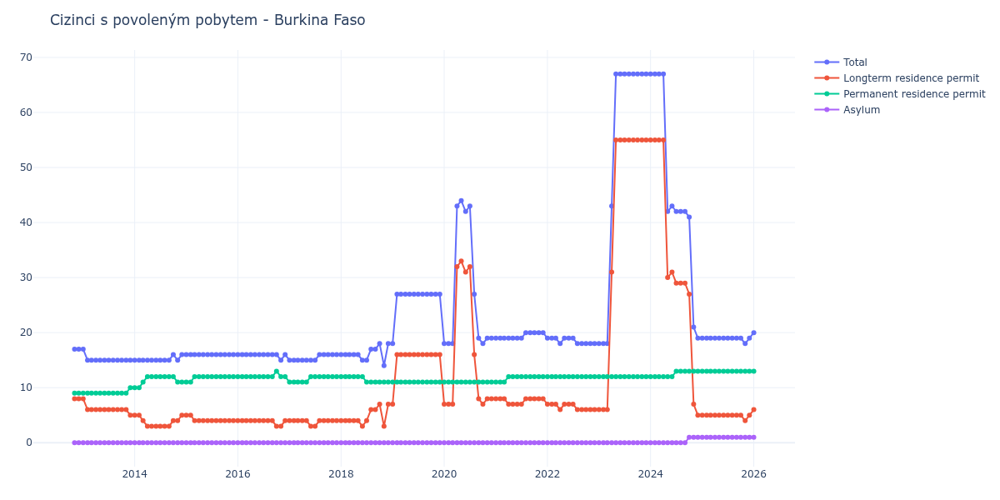

# Burkina Faso

## Souhrnné statistiky (Min/Max pro rok) / Summary Statistics (Min/Max per year)

| Year   | Total   | Longterm Residence Permit   | Permanent Residence Permit   | Asylum   |
|--------|---------|-----------------------------|------------------------------|----------|
| 2012   | 17 / 17 | 8 / 8                       | 9 / 9                        | 0 / 0    |
| 2013   | 15 / 17 | 5 / 8                       | 9 / 10                       | 0 / 0    |
| 2014   | 15 / 16 | 3 / 5                       | 10 / 12                      | 0 / 0    |
| 2015   | 16 / 16 | 4 / 5                       | 11 / 12                      | 0 / 0    |
| 2016   | 15 / 16 | 3 / 4                       | 12 / 13                      | 0 / 0    |
| 2017   | 15 / 16 | 3 / 4                       | 11 / 12                      | 0 / 0    |
| 2018   | 14 / 18 | 3 / 7                       | 11 / 12                      | 0 / 0    |
| 2019   | 18 / 27 | 7 / 16                      | 11 / 11                      | 0 / 0    |
| 2020   | 18 / 44 | 7 / 33                      | 11 / 11                      | 0 / 0    |
| 2021   | 19 / 20 | 7 / 8                       | 11 / 12                      | 0 / 0    |
| 2022   | 18 / 19 | 6 / 7                       | 12 / 12                      | 0 / 0    |
| 2023   | 18 / 67 | 6 / 55                      | 12 / 12                      | 0 / 0    |
| 2024   | 19 / 67 | 5 / 55                      | 12 / 13                      | 0 / 1    |
| 2025   | 18 / 19 | 4 / 5                       | 13 / 13                      | 1 / 1    |
| 2026   | 20 / 20 | 6 / 6                       | 13 / 13                      | 1 / 1    |

## Detailní tabulka / Detailed Data Table

| Date     | Total         | Longterm Residence Permit   | Permanent Residence Permit   | Asylum     |
|----------|---------------|-----------------------------|------------------------------|------------|
| **2012** |               |                             |                              |            |
| 11.2012  | 17            | 8                           | 9                            | 0          |
| 12.2012  | 17 (+0.00%)   | 8 (+0.00%)                  | 9 (+0.00%)                   | 0          |
| **2013** |               |                             |                              |            |
| 01.2013  | 17 (+0.00%)   | 8 (+0.00%)                  | 9 (+0.00%)                   | 0          |
| 02.2013  | 15 (-11.76%)  | 6 (-25.00%)                 | 9 (+0.00%)                   | 0          |
| 03.2013  | 15 (+0.00%)   | 6 (+0.00%)                  | 9 (+0.00%)                   | 0          |
| 04.2013  | 15 (+0.00%)   | 6 (+0.00%)                  | 9 (+0.00%)                   | 0          |
| 05.2013  | 15 (+0.00%)   | 6 (+0.00%)                  | 9 (+0.00%)                   | 0          |
| 06.2013  | 15 (+0.00%)   | 6 (+0.00%)                  | 9 (+0.00%)                   | 0          |
| 07.2013  | 15 (+0.00%)   | 6 (+0.00%)                  | 9 (+0.00%)                   | 0          |
| 08.2013  | 15 (+0.00%)   | 6 (+0.00%)                  | 9 (+0.00%)                   | 0          |
| 09.2013  | 15 (+0.00%)   | 6 (+0.00%)                  | 9 (+0.00%)                   | 0          |
| 10.2013  | 15 (+0.00%)   | 6 (+0.00%)                  | 9 (+0.00%)                   | 0          |
| 11.2013  | 15 (+0.00%)   | 6 (+0.00%)                  | 9 (+0.00%)                   | 0          |
| 12.2013  | 15 (+0.00%)   | 5 (-16.67%)                 | 10 (+11.11%)                 | 0          |
| **2014** |               |                             |                              |            |
| 01.2014  | 15 (+0.00%)   | 5 (+0.00%)                  | 10 (+0.00%)                  | 0          |
| 02.2014  | 15 (+0.00%)   | 5 (+0.00%)                  | 10 (+0.00%)                  | 0          |
| 03.2014  | 15 (+0.00%)   | 4 (-20.00%)                 | 11 (+10.00%)                 | 0          |
| 04.2014  | 15 (+0.00%)   | 3 (-25.00%)                 | 12 (+9.09%)                  | 0          |
| 05.2014  | 15 (+0.00%)   | 3 (+0.00%)                  | 12 (+0.00%)                  | 0          |
| 06.2014  | 15 (+0.00%)   | 3 (+0.00%)                  | 12 (+0.00%)                  | 0          |
| 07.2014  | 15 (+0.00%)   | 3 (+0.00%)                  | 12 (+0.00%)                  | 0          |
| 08.2014  | 15 (+0.00%)   | 3 (+0.00%)                  | 12 (+0.00%)                  | 0          |
| 09.2014  | 15 (+0.00%)   | 3 (+0.00%)                  | 12 (+0.00%)                  | 0          |
| 10.2014  | 16 (+6.67%)   | 4 (+33.33%)                 | 12 (+0.00%)                  | 0          |
| 11.2014  | 15 (-6.25%)   | 4 (+0.00%)                  | 11 (-8.33%)                  | 0          |
| 12.2014  | 16 (+6.67%)   | 5 (+25.00%)                 | 11 (+0.00%)                  | 0          |
| **2015** |               |                             |                              |            |
| 01.2015  | 16 (+0.00%)   | 5 (+0.00%)                  | 11 (+0.00%)                  | 0          |
| 02.2015  | 16 (+0.00%)   | 5 (+0.00%)                  | 11 (+0.00%)                  | 0          |
| 03.2015  | 16 (+0.00%)   | 4 (-20.00%)                 | 12 (+9.09%)                  | 0          |
| 04.2015  | 16 (+0.00%)   | 4 (+0.00%)                  | 12 (+0.00%)                  | 0          |
| 05.2015  | 16 (+0.00%)   | 4 (+0.00%)                  | 12 (+0.00%)                  | 0          |
| 06.2015  | 16 (+0.00%)   | 4 (+0.00%)                  | 12 (+0.00%)                  | 0          |
| 07.2015  | 16 (+0.00%)   | 4 (+0.00%)                  | 12 (+0.00%)                  | 0          |
| 08.2015  | 16 (+0.00%)   | 4 (+0.00%)                  | 12 (+0.00%)                  | 0          |
| 09.2015  | 16 (+0.00%)   | 4 (+0.00%)                  | 12 (+0.00%)                  | 0          |
| 10.2015  | 16 (+0.00%)   | 4 (+0.00%)                  | 12 (+0.00%)                  | 0          |
| 11.2015  | 16 (+0.00%)   | 4 (+0.00%)                  | 12 (+0.00%)                  | 0          |
| 12.2015  | 16 (+0.00%)   | 4 (+0.00%)                  | 12 (+0.00%)                  | 0          |
| **2016** |               |                             |                              |            |
| 01.2016  | 16 (+0.00%)   | 4 (+0.00%)                  | 12 (+0.00%)                  | 0          |
| 02.2016  | 16 (+0.00%)   | 4 (+0.00%)                  | 12 (+0.00%)                  | 0          |
| 03.2016  | 16 (+0.00%)   | 4 (+0.00%)                  | 12 (+0.00%)                  | 0          |
| 04.2016  | 16 (+0.00%)   | 4 (+0.00%)                  | 12 (+0.00%)                  | 0          |
| 05.2016  | 16 (+0.00%)   | 4 (+0.00%)                  | 12 (+0.00%)                  | 0          |
| 06.2016  | 16 (+0.00%)   | 4 (+0.00%)                  | 12 (+0.00%)                  | 0          |
| 07.2016  | 16 (+0.00%)   | 4 (+0.00%)                  | 12 (+0.00%)                  | 0          |
| 08.2016  | 16 (+0.00%)   | 4 (+0.00%)                  | 12 (+0.00%)                  | 0          |
| 09.2016  | 16 (+0.00%)   | 4 (+0.00%)                  | 12 (+0.00%)                  | 0          |
| 10.2016  | 16 (+0.00%)   | 3 (-25.00%)                 | 13 (+8.33%)                  | 0          |
| 11.2016  | 15 (-6.25%)   | 3 (+0.00%)                  | 12 (-7.69%)                  | 0          |
| 12.2016  | 16 (+6.67%)   | 4 (+33.33%)                 | 12 (+0.00%)                  | 0          |
| **2017** |               |                             |                              |            |
| 01.2017  | 15 (-6.25%)   | 4 (+0.00%)                  | 11 (-8.33%)                  | 0          |
| 02.2017  | 15 (+0.00%)   | 4 (+0.00%)                  | 11 (+0.00%)                  | 0          |
| 03.2017  | 15 (+0.00%)   | 4 (+0.00%)                  | 11 (+0.00%)                  | 0          |
| 04.2017  | 15 (+0.00%)   | 4 (+0.00%)                  | 11 (+0.00%)                  | 0          |
| 05.2017  | 15 (+0.00%)   | 4 (+0.00%)                  | 11 (+0.00%)                  | 0          |
| 06.2017  | 15 (+0.00%)   | 3 (-25.00%)                 | 12 (+9.09%)                  | 0          |
| 07.2017  | 15 (+0.00%)   | 3 (+0.00%)                  | 12 (+0.00%)                  | 0          |
| 08.2017  | 16 (+6.67%)   | 4 (+33.33%)                 | 12 (+0.00%)                  | 0          |
| 09.2017  | 16 (+0.00%)   | 4 (+0.00%)                  | 12 (+0.00%)                  | 0          |
| 10.2017  | 16 (+0.00%)   | 4 (+0.00%)                  | 12 (+0.00%)                  | 0          |
| 11.2017  | 16 (+0.00%)   | 4 (+0.00%)                  | 12 (+0.00%)                  | 0          |
| 12.2017  | 16 (+0.00%)   | 4 (+0.00%)                  | 12 (+0.00%)                  | 0          |
| **2018** |               |                             |                              |            |
| 01.2018  | 16 (+0.00%)   | 4 (+0.00%)                  | 12 (+0.00%)                  | 0          |
| 02.2018  | 16 (+0.00%)   | 4 (+0.00%)                  | 12 (+0.00%)                  | 0          |
| 03.2018  | 16 (+0.00%)   | 4 (+0.00%)                  | 12 (+0.00%)                  | 0          |
| 04.2018  | 16 (+0.00%)   | 4 (+0.00%)                  | 12 (+0.00%)                  | 0          |
| 05.2018  | 16 (+0.00%)   | 4 (+0.00%)                  | 12 (+0.00%)                  | 0          |
| 06.2018  | 15 (-6.25%)   | 3 (-25.00%)                 | 12 (+0.00%)                  | 0          |
| 07.2018  | 15 (+0.00%)   | 4 (+33.33%)                 | 11 (-8.33%)                  | 0          |
| 08.2018  | 17 (+13.33%)  | 6 (+50.00%)                 | 11 (+0.00%)                  | 0          |
| 09.2018  | 17 (+0.00%)   | 6 (+0.00%)                  | 11 (+0.00%)                  | 0          |
| 10.2018  | 18 (+5.88%)   | 7 (+16.67%)                 | 11 (+0.00%)                  | 0          |
| 11.2018  | 14 (-22.22%)  | 3 (-57.14%)                 | 11 (+0.00%)                  | 0          |
| 12.2018  | 18 (+28.57%)  | 7 (+133.33%)                | 11 (+0.00%)                  | 0          |
| **2019** |               |                             |                              |            |
| 01.2019  | 18 (+0.00%)   | 7 (+0.00%)                  | 11 (+0.00%)                  | 0          |
| 02.2019  | 27 (+50.00%)  | 16 (+128.57%)               | 11 (+0.00%)                  | 0          |
| 03.2019  | 27 (+0.00%)   | 16 (+0.00%)                 | 11 (+0.00%)                  | 0          |
| 04.2019  | 27 (+0.00%)   | 16 (+0.00%)                 | 11 (+0.00%)                  | 0          |
| 05.2019  | 27 (+0.00%)   | 16 (+0.00%)                 | 11 (+0.00%)                  | 0          |
| 06.2019  | 27 (+0.00%)   | 16 (+0.00%)                 | 11 (+0.00%)                  | 0          |
| 07.2019  | 27 (+0.00%)   | 16 (+0.00%)                 | 11 (+0.00%)                  | 0          |
| 08.2019  | 27 (+0.00%)   | 16 (+0.00%)                 | 11 (+0.00%)                  | 0          |
| 09.2019  | 27 (+0.00%)   | 16 (+0.00%)                 | 11 (+0.00%)                  | 0          |
| 10.2019  | 27 (+0.00%)   | 16 (+0.00%)                 | 11 (+0.00%)                  | 0          |
| 11.2019  | 27 (+0.00%)   | 16 (+0.00%)                 | 11 (+0.00%)                  | 0          |
| 12.2019  | 27 (+0.00%)   | 16 (+0.00%)                 | 11 (+0.00%)                  | 0          |
| **2020** |               |                             |                              |            |
| 01.2020  | 18 (-33.33%)  | 7 (-56.25%)                 | 11 (+0.00%)                  | 0          |
| 02.2020  | 18 (+0.00%)   | 7 (+0.00%)                  | 11 (+0.00%)                  | 0          |
| 03.2020  | 18 (+0.00%)   | 7 (+0.00%)                  | 11 (+0.00%)                  | 0          |
| 04.2020  | 43 (+138.89%) | 32 (+357.14%)               | 11 (+0.00%)                  | 0          |
| 05.2020  | 44 (+2.33%)   | 33 (+3.12%)                 | 11 (+0.00%)                  | 0          |
| 06.2020  | 42 (-4.55%)   | 31 (-6.06%)                 | 11 (+0.00%)                  | 0          |
| 07.2020  | 43 (+2.38%)   | 32 (+3.23%)                 | 11 (+0.00%)                  | 0          |
| 08.2020  | 27 (-37.21%)  | 16 (-50.00%)                | 11 (+0.00%)                  | 0          |
| 09.2020  | 19 (-29.63%)  | 8 (-50.00%)                 | 11 (+0.00%)                  | 0          |
| 10.2020  | 18 (-5.26%)   | 7 (-12.50%)                 | 11 (+0.00%)                  | 0          |
| 11.2020  | 19 (+5.56%)   | 8 (+14.29%)                 | 11 (+0.00%)                  | 0          |
| 12.2020  | 19 (+0.00%)   | 8 (+0.00%)                  | 11 (+0.00%)                  | 0          |
| **2021** |               |                             |                              |            |
| 01.2021  | 19 (+0.00%)   | 8 (+0.00%)                  | 11 (+0.00%)                  | 0          |
| 02.2021  | 19 (+0.00%)   | 8 (+0.00%)                  | 11 (+0.00%)                  | 0          |
| 03.2021  | 19 (+0.00%)   | 8 (+0.00%)                  | 11 (+0.00%)                  | 0          |
| 04.2021  | 19 (+0.00%)   | 7 (-12.50%)                 | 12 (+9.09%)                  | 0          |
| 05.2021  | 19 (+0.00%)   | 7 (+0.00%)                  | 12 (+0.00%)                  | 0          |
| 06.2021  | 19 (+0.00%)   | 7 (+0.00%)                  | 12 (+0.00%)                  | 0          |
| 07.2021  | 19 (+0.00%)   | 7 (+0.00%)                  | 12 (+0.00%)                  | 0          |
| 08.2021  | 20 (+5.26%)   | 8 (+14.29%)                 | 12 (+0.00%)                  | 0          |
| 09.2021  | 20 (+0.00%)   | 8 (+0.00%)                  | 12 (+0.00%)                  | 0          |
| 10.2021  | 20 (+0.00%)   | 8 (+0.00%)                  | 12 (+0.00%)                  | 0          |
| 11.2021  | 20 (+0.00%)   | 8 (+0.00%)                  | 12 (+0.00%)                  | 0          |
| 12.2021  | 20 (+0.00%)   | 8 (+0.00%)                  | 12 (+0.00%)                  | 0          |
| **2022** |               |                             |                              |            |
| 01.2022  | 19 (-5.00%)   | 7 (-12.50%)                 | 12 (+0.00%)                  | 0          |
| 02.2022  | 19 (+0.00%)   | 7 (+0.00%)                  | 12 (+0.00%)                  | 0          |
| 03.2022  | 19 (+0.00%)   | 7 (+0.00%)                  | 12 (+0.00%)                  | 0          |
| 04.2022  | 18 (-5.26%)   | 6 (-14.29%)                 | 12 (+0.00%)                  | 0          |
| 05.2022  | 19 (+5.56%)   | 7 (+16.67%)                 | 12 (+0.00%)                  | 0          |
| 06.2022  | 19 (+0.00%)   | 7 (+0.00%)                  | 12 (+0.00%)                  | 0          |
| 07.2022  | 19 (+0.00%)   | 7 (+0.00%)                  | 12 (+0.00%)                  | 0          |
| 08.2022  | 18 (-5.26%)   | 6 (-14.29%)                 | 12 (+0.00%)                  | 0          |
| 09.2022  | 18 (+0.00%)   | 6 (+0.00%)                  | 12 (+0.00%)                  | 0          |
| 10.2022  | 18 (+0.00%)   | 6 (+0.00%)                  | 12 (+0.00%)                  | 0          |
| 11.2022  | 18 (+0.00%)   | 6 (+0.00%)                  | 12 (+0.00%)                  | 0          |
| 12.2022  | 18 (+0.00%)   | 6 (+0.00%)                  | 12 (+0.00%)                  | 0          |
| **2023** |               |                             |                              |            |
| 01.2023  | 18 (+0.00%)   | 6 (+0.00%)                  | 12 (+0.00%)                  | 0          |
| 02.2023  | 18 (+0.00%)   | 6 (+0.00%)                  | 12 (+0.00%)                  | 0          |
| 03.2023  | 18 (+0.00%)   | 6 (+0.00%)                  | 12 (+0.00%)                  | 0          |
| 04.2023  | 43 (+138.89%) | 31 (+416.67%)               | 12 (+0.00%)                  | 0          |
| 05.2023  | 67 (+55.81%)  | 55 (+77.42%)                | 12 (+0.00%)                  | 0          |
| 06.2023  | 67 (+0.00%)   | 55 (+0.00%)                 | 12 (+0.00%)                  | 0          |
| 07.2023  | 67 (+0.00%)   | 55 (+0.00%)                 | 12 (+0.00%)                  | 0          |
| 08.2023  | 67 (+0.00%)   | 55 (+0.00%)                 | 12 (+0.00%)                  | 0          |
| 09.2023  | 67 (+0.00%)   | 55 (+0.00%)                 | 12 (+0.00%)                  | 0          |
| 10.2023  | 67 (+0.00%)   | 55 (+0.00%)                 | 12 (+0.00%)                  | 0          |
| 11.2023  | 67 (+0.00%)   | 55 (+0.00%)                 | 12 (+0.00%)                  | 0          |
| 12.2023  | 67 (+0.00%)   | 55 (+0.00%)                 | 12 (+0.00%)                  | 0          |
| **2024** |               |                             |                              |            |
| 01.2024  | 67 (+0.00%)   | 55 (+0.00%)                 | 12 (+0.00%)                  | 0          |
| 02.2024  | 67 (+0.00%)   | 55 (+0.00%)                 | 12 (+0.00%)                  | 0          |
| 03.2024  | 67 (+0.00%)   | 55 (+0.00%)                 | 12 (+0.00%)                  | 0          |
| 04.2024  | 67 (+0.00%)   | 55 (+0.00%)                 | 12 (+0.00%)                  | 0          |
| 05.2024  | 42 (-37.31%)  | 30 (-45.45%)                | 12 (+0.00%)                  | 0          |
| 06.2024  | 43 (+2.38%)   | 31 (+3.33%)                 | 12 (+0.00%)                  | 0          |
| 07.2024  | 42 (-2.33%)   | 29 (-6.45%)                 | 13 (+8.33%)                  | 0          |
| 08.2024  | 42 (+0.00%)   | 29 (+0.00%)                 | 13 (+0.00%)                  | 0          |
| 09.2024  | 42 (+0.00%)   | 29 (+0.00%)                 | 13 (+0.00%)                  | 0          |
| 10.2024  | 41 (-2.38%)   | 27 (-6.90%)                 | 13 (+0.00%)                  | 1          |
| 11.2024  | 21 (-48.78%)  | 7 (-74.07%)                 | 13 (+0.00%)                  | 1 (+0.00%) |
| 12.2024  | 19 (-9.52%)   | 5 (-28.57%)                 | 13 (+0.00%)                  | 1 (+0.00%) |
| **2025** |               |                             |                              |            |
| 01.2025  | 19 (+0.00%)   | 5 (+0.00%)                  | 13 (+0.00%)                  | 1 (+0.00%) |
| 02.2025  | 19 (+0.00%)   | 5 (+0.00%)                  | 13 (+0.00%)                  | 1 (+0.00%) |
| 03.2025  | 19 (+0.00%)   | 5 (+0.00%)                  | 13 (+0.00%)                  | 1 (+0.00%) |
| 04.2025  | 19 (+0.00%)   | 5 (+0.00%)                  | 13 (+0.00%)                  | 1 (+0.00%) |
| 05.2025  | 19 (+0.00%)   | 5 (+0.00%)                  | 13 (+0.00%)                  | 1 (+0.00%) |
| 06.2025  | 19 (+0.00%)   | 5 (+0.00%)                  | 13 (+0.00%)                  | 1 (+0.00%) |
| 07.2025  | 19 (+0.00%)   | 5 (+0.00%)                  | 13 (+0.00%)                  | 1 (+0.00%) |
| 08.2025  | 19 (+0.00%)   | 5 (+0.00%)                  | 13 (+0.00%)                  | 1 (+0.00%) |
| 09.2025  | 19 (+0.00%)   | 5 (+0.00%)                  | 13 (+0.00%)                  | 1 (+0.00%) |
| 10.2025  | 19 (+0.00%)   | 5 (+0.00%)                  | 13 (+0.00%)                  | 1 (+0.00%) |
| 11.2025  | 18 (-5.26%)   | 4 (-20.00%)                 | 13 (+0.00%)                  | 1 (+0.00%) |
| 12.2025  | 19 (+5.56%)   | 5 (+25.00%)                 | 13 (+0.00%)                  | 1 (+0.00%) |
| **2026** |               |                             |                              |            |
| 01.2026  | 20 (+5.26%)   | 6 (+20.00%)                 | 13 (+0.00%)                  | 1 (+0.00%) |
