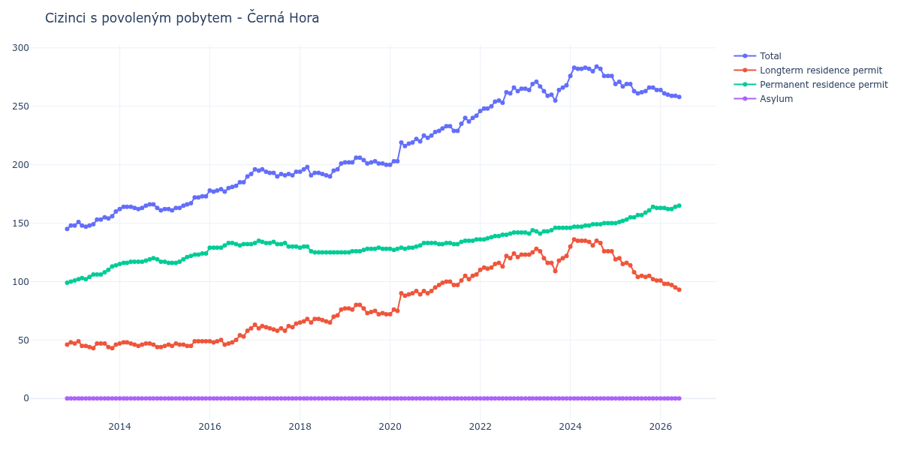

# Černá Hora

## Souhrnné statistiky (Min/Max pro rok) / Summary Statistics (Min/Max per year)

| Year   | Total     | Longterm Residence Permit   | Permanent Residence Permit   | Asylum   |
|--------|-----------|-----------------------------|------------------------------|----------|
| 2012   | 145 / 148 | 46 / 48                     | 99 / 100                     | 0 / 0    |
| 2013   | 147 / 160 | 43 / 49                     | 101 / 114                    | 0 / 0    |
| 2014   | 161 / 166 | 44 / 48                     | 115 / 120                    | 0 / 0    |
| 2015   | 161 / 173 | 45 / 49                     | 116 / 124                    | 0 / 0    |
| 2016   | 177 / 192 | 46 / 60                     | 129 / 133                    | 0 / 0    |
| 2017   | 190 / 196 | 58 / 64                     | 130 / 135                    | 0 / 0    |
| 2018   | 190 / 201 | 65 / 76                     | 125 / 130                    | 0 / 0    |
| 2019   | 200 / 206 | 72 / 80                     | 125 / 129                    | 0 / 0    |
| 2020   | 200 / 225 | 72 / 92                     | 127 / 133                    | 0 / 0    |
| 2021   | 228 / 242 | 95 / 106                    | 132 / 136                    | 0 / 0    |
| 2022   | 246 / 266 | 110 / 124                   | 136 / 142                    | 0 / 0    |
| 2023   | 255 / 271 | 109 / 128                   | 141 / 146                    | 0 / 0    |
| 2024   | 276 / 284 | 126 / 136                   | 146 / 150                    | 0 / 0    |
| 2025   | 261 / 271 | 101 / 120                   | 150 / 164                    | 0 / 0    |
| 2026   | 258 / 264 | 93 / 101                    | 162 / 165                    | 0 / 0    |

## Detailní tabulka / Detailed Data Table

| Date     | Total        | Longterm Residence Permit   | Permanent Residence Permit   | Asylum   |
|----------|--------------|-----------------------------|------------------------------|----------|
| **2012** |              |                             |                              |          |
| 11.2012  | 145          | 46                          | 99                           | 0        |
| 12.2012  | 148 (+2.07%) | 48 (+4.35%)                 | 100 (+1.01%)                 | 0        |
| **2013** |              |                             |                              |          |
| 01.2013  | 148 (+0.00%) | 47 (-2.08%)                 | 101 (+1.00%)                 | 0        |
| 02.2013  | 151 (+2.03%) | 49 (+4.26%)                 | 102 (+0.99%)                 | 0        |
| 03.2013  | 148 (-1.99%) | 45 (-8.16%)                 | 103 (+0.98%)                 | 0        |
| 04.2013  | 147 (-0.68%) | 45 (+0.00%)                 | 102 (-0.97%)                 | 0        |
| 05.2013  | 148 (+0.68%) | 44 (-2.22%)                 | 104 (+1.96%)                 | 0        |
| 06.2013  | 149 (+0.68%) | 43 (-2.27%)                 | 106 (+1.92%)                 | 0        |
| 07.2013  | 153 (+2.68%) | 47 (+9.30%)                 | 106 (+0.00%)                 | 0        |
| 08.2013  | 153 (+0.00%) | 47 (+0.00%)                 | 106 (+0.00%)                 | 0        |
| 09.2013  | 155 (+1.31%) | 47 (+0.00%)                 | 108 (+1.89%)                 | 0        |
| 10.2013  | 154 (-0.65%) | 44 (-6.38%)                 | 110 (+1.85%)                 | 0        |
| 11.2013  | 156 (+1.30%) | 43 (-2.27%)                 | 113 (+2.73%)                 | 0        |
| 12.2013  | 160 (+2.56%) | 46 (+6.98%)                 | 114 (+0.88%)                 | 0        |
| **2014** |              |                             |                              |          |
| 01.2014  | 162 (+1.25%) | 47 (+2.17%)                 | 115 (+0.88%)                 | 0        |
| 02.2014  | 164 (+1.23%) | 48 (+2.13%)                 | 116 (+0.87%)                 | 0        |
| 03.2014  | 164 (+0.00%) | 48 (+0.00%)                 | 116 (+0.00%)                 | 0        |
| 04.2014  | 164 (+0.00%) | 47 (-2.08%)                 | 117 (+0.86%)                 | 0        |
| 05.2014  | 163 (-0.61%) | 46 (-2.13%)                 | 117 (+0.00%)                 | 0        |
| 06.2014  | 162 (-0.61%) | 45 (-2.17%)                 | 117 (+0.00%)                 | 0        |
| 07.2014  | 163 (+0.62%) | 46 (+2.22%)                 | 117 (+0.00%)                 | 0        |
| 08.2014  | 165 (+1.23%) | 47 (+2.17%)                 | 118 (+0.85%)                 | 0        |
| 09.2014  | 166 (+0.61%) | 47 (+0.00%)                 | 119 (+0.85%)                 | 0        |
| 10.2014  | 166 (+0.00%) | 46 (-2.13%)                 | 120 (+0.84%)                 | 0        |
| 11.2014  | 163 (-1.81%) | 44 (-4.35%)                 | 119 (-0.83%)                 | 0        |
| 12.2014  | 161 (-1.23%) | 44 (+0.00%)                 | 117 (-1.68%)                 | 0        |
| **2015** |              |                             |                              |          |
| 01.2015  | 162 (+0.62%) | 45 (+2.27%)                 | 117 (+0.00%)                 | 0        |
| 02.2015  | 162 (+0.00%) | 46 (+2.22%)                 | 116 (-0.85%)                 | 0        |
| 03.2015  | 161 (-0.62%) | 45 (-2.17%)                 | 116 (+0.00%)                 | 0        |
| 04.2015  | 163 (+1.24%) | 47 (+4.44%)                 | 116 (+0.00%)                 | 0        |
| 05.2015  | 163 (+0.00%) | 46 (-2.13%)                 | 117 (+0.86%)                 | 0        |
| 06.2015  | 165 (+1.23%) | 46 (+0.00%)                 | 119 (+1.71%)                 | 0        |
| 07.2015  | 166 (+0.61%) | 45 (-2.17%)                 | 121 (+1.68%)                 | 0        |
| 08.2015  | 167 (+0.60%) | 45 (+0.00%)                 | 122 (+0.83%)                 | 0        |
| 09.2015  | 172 (+2.99%) | 49 (+8.89%)                 | 123 (+0.82%)                 | 0        |
| 10.2015  | 172 (+0.00%) | 49 (+0.00%)                 | 123 (+0.00%)                 | 0        |
| 11.2015  | 173 (+0.58%) | 49 (+0.00%)                 | 124 (+0.81%)                 | 0        |
| 12.2015  | 173 (+0.00%) | 49 (+0.00%)                 | 124 (+0.00%)                 | 0        |
| **2016** |              |                             |                              |          |
| 01.2016  | 178 (+2.89%) | 49 (+0.00%)                 | 129 (+4.03%)                 | 0        |
| 02.2016  | 177 (-0.56%) | 48 (-2.04%)                 | 129 (+0.00%)                 | 0        |
| 03.2016  | 178 (+0.56%) | 49 (+2.08%)                 | 129 (+0.00%)                 | 0        |
| 04.2016  | 179 (+0.56%) | 50 (+2.04%)                 | 129 (+0.00%)                 | 0        |
| 05.2016  | 177 (-1.12%) | 46 (-8.00%)                 | 131 (+1.55%)                 | 0        |
| 06.2016  | 180 (+1.69%) | 47 (+2.17%)                 | 133 (+1.53%)                 | 0        |
| 07.2016  | 181 (+0.56%) | 48 (+2.13%)                 | 133 (+0.00%)                 | 0        |
| 08.2016  | 182 (+0.55%) | 50 (+4.17%)                 | 132 (-0.75%)                 | 0        |
| 09.2016  | 185 (+1.65%) | 54 (+8.00%)                 | 131 (-0.76%)                 | 0        |
| 10.2016  | 185 (+0.00%) | 53 (-1.85%)                 | 132 (+0.76%)                 | 0        |
| 11.2016  | 190 (+2.70%) | 58 (+9.43%)                 | 132 (+0.00%)                 | 0        |
| 12.2016  | 192 (+1.05%) | 60 (+3.45%)                 | 132 (+0.00%)                 | 0        |
| **2017** |              |                             |                              |          |
| 01.2017  | 196 (+2.08%) | 63 (+5.00%)                 | 133 (+0.76%)                 | 0        |
| 02.2017  | 195 (-0.51%) | 60 (-4.76%)                 | 135 (+1.50%)                 | 0        |
| 03.2017  | 196 (+0.51%) | 62 (+3.33%)                 | 134 (-0.74%)                 | 0        |
| 04.2017  | 194 (-1.02%) | 61 (-1.61%)                 | 133 (-0.75%)                 | 0        |
| 05.2017  | 193 (-0.52%) | 60 (-1.64%)                 | 133 (+0.00%)                 | 0        |
| 06.2017  | 193 (+0.00%) | 59 (-1.67%)                 | 134 (+0.75%)                 | 0        |
| 07.2017  | 190 (-1.55%) | 58 (-1.69%)                 | 132 (-1.49%)                 | 0        |
| 08.2017  | 192 (+1.05%) | 60 (+3.45%)                 | 132 (+0.00%)                 | 0        |
| 09.2017  | 191 (-0.52%) | 58 (-3.33%)                 | 133 (+0.76%)                 | 0        |
| 10.2017  | 192 (+0.52%) | 62 (+6.90%)                 | 130 (-2.26%)                 | 0        |
| 11.2017  | 191 (-0.52%) | 61 (-1.61%)                 | 130 (+0.00%)                 | 0        |
| 12.2017  | 194 (+1.57%) | 64 (+4.92%)                 | 130 (+0.00%)                 | 0        |
| **2018** |              |                             |                              |          |
| 01.2018  | 194 (+0.00%) | 65 (+1.56%)                 | 129 (-0.77%)                 | 0        |
| 02.2018  | 196 (+1.03%) | 66 (+1.54%)                 | 130 (+0.78%)                 | 0        |
| 03.2018  | 198 (+1.02%) | 68 (+3.03%)                 | 130 (+0.00%)                 | 0        |
| 04.2018  | 191 (-3.54%) | 65 (-4.41%)                 | 126 (-3.08%)                 | 0        |
| 05.2018  | 193 (+1.05%) | 68 (+4.62%)                 | 125 (-0.79%)                 | 0        |
| 06.2018  | 193 (+0.00%) | 68 (+0.00%)                 | 125 (+0.00%)                 | 0        |
| 07.2018  | 192 (-0.52%) | 67 (-1.47%)                 | 125 (+0.00%)                 | 0        |
| 08.2018  | 191 (-0.52%) | 66 (-1.49%)                 | 125 (+0.00%)                 | 0        |
| 09.2018  | 190 (-0.52%) | 65 (-1.52%)                 | 125 (+0.00%)                 | 0        |
| 10.2018  | 195 (+2.63%) | 70 (+7.69%)                 | 125 (+0.00%)                 | 0        |
| 11.2018  | 196 (+0.51%) | 71 (+1.43%)                 | 125 (+0.00%)                 | 0        |
| 12.2018  | 201 (+2.55%) | 76 (+7.04%)                 | 125 (+0.00%)                 | 0        |
| **2019** |              |                             |                              |          |
| 01.2019  | 202 (+0.50%) | 77 (+1.32%)                 | 125 (+0.00%)                 | 0        |
| 02.2019  | 202 (+0.00%) | 77 (+0.00%)                 | 125 (+0.00%)                 | 0        |
| 03.2019  | 202 (+0.00%) | 76 (-1.30%)                 | 126 (+0.80%)                 | 0        |
| 04.2019  | 206 (+1.98%) | 80 (+5.26%)                 | 126 (+0.00%)                 | 0        |
| 05.2019  | 206 (+0.00%) | 80 (+0.00%)                 | 126 (+0.00%)                 | 0        |
| 06.2019  | 204 (-0.97%) | 77 (-3.75%)                 | 127 (+0.79%)                 | 0        |
| 07.2019  | 201 (-1.47%) | 73 (-5.19%)                 | 128 (+0.79%)                 | 0        |
| 08.2019  | 202 (+0.50%) | 74 (+1.37%)                 | 128 (+0.00%)                 | 0        |
| 09.2019  | 203 (+0.50%) | 75 (+1.35%)                 | 128 (+0.00%)                 | 0        |
| 10.2019  | 201 (-0.99%) | 72 (-4.00%)                 | 129 (+0.78%)                 | 0        |
| 11.2019  | 201 (+0.00%) | 73 (+1.39%)                 | 128 (-0.78%)                 | 0        |
| 12.2019  | 200 (-0.50%) | 72 (-1.37%)                 | 128 (+0.00%)                 | 0        |
| **2020** |              |                             |                              |          |
| 01.2020  | 200 (+0.00%) | 72 (+0.00%)                 | 128 (+0.00%)                 | 0        |
| 02.2020  | 203 (+1.50%) | 76 (+5.56%)                 | 127 (-0.78%)                 | 0        |
| 03.2020  | 203 (+0.00%) | 75 (-1.32%)                 | 128 (+0.79%)                 | 0        |
| 04.2020  | 219 (+7.88%) | 90 (+20.00%)                | 129 (+0.78%)                 | 0        |
| 05.2020  | 216 (-1.37%) | 88 (-2.22%)                 | 128 (-0.78%)                 | 0        |
| 06.2020  | 218 (+0.93%) | 89 (+1.14%)                 | 129 (+0.78%)                 | 0        |
| 07.2020  | 219 (+0.46%) | 90 (+1.12%)                 | 129 (+0.00%)                 | 0        |
| 08.2020  | 222 (+1.37%) | 92 (+2.22%)                 | 130 (+0.78%)                 | 0        |
| 09.2020  | 220 (-0.90%) | 89 (-3.26%)                 | 131 (+0.77%)                 | 0        |
| 10.2020  | 225 (+2.27%) | 92 (+3.37%)                 | 133 (+1.53%)                 | 0        |
| 11.2020  | 223 (-0.89%) | 90 (-2.17%)                 | 133 (+0.00%)                 | 0        |
| 12.2020  | 225 (+0.90%) | 92 (+2.22%)                 | 133 (+0.00%)                 | 0        |
| **2021** |              |                             |                              |          |
| 01.2021  | 228 (+1.33%) | 95 (+3.26%)                 | 133 (+0.00%)                 | 0        |
| 02.2021  | 229 (+0.44%) | 97 (+2.11%)                 | 132 (-0.75%)                 | 0        |
| 03.2021  | 231 (+0.87%) | 99 (+2.06%)                 | 132 (+0.00%)                 | 0        |
| 04.2021  | 233 (+0.87%) | 100 (+1.01%)                | 133 (+0.76%)                 | 0        |
| 05.2021  | 233 (+0.00%) | 100 (+0.00%)                | 133 (+0.00%)                 | 0        |
| 06.2021  | 229 (-1.72%) | 97 (-3.00%)                 | 132 (-0.75%)                 | 0        |
| 07.2021  | 229 (+0.00%) | 97 (+0.00%)                 | 132 (+0.00%)                 | 0        |
| 08.2021  | 235 (+2.62%) | 101 (+4.12%)                | 134 (+1.52%)                 | 0        |
| 09.2021  | 240 (+2.13%) | 105 (+3.96%)                | 135 (+0.75%)                 | 0        |
| 10.2021  | 237 (-1.25%) | 102 (-2.86%)                | 135 (+0.00%)                 | 0        |
| 11.2021  | 240 (+1.27%) | 105 (+2.94%)                | 135 (+0.00%)                 | 0        |
| 12.2021  | 242 (+0.83%) | 106 (+0.95%)                | 136 (+0.74%)                 | 0        |
| **2022** |              |                             |                              |          |
| 01.2022  | 246 (+1.65%) | 110 (+3.77%)                | 136 (+0.00%)                 | 0        |
| 02.2022  | 248 (+0.81%) | 112 (+1.82%)                | 136 (+0.00%)                 | 0        |
| 03.2022  | 248 (+0.00%) | 111 (-0.89%)                | 137 (+0.74%)                 | 0        |
| 04.2022  | 250 (+0.81%) | 112 (+0.90%)                | 138 (+0.73%)                 | 0        |
| 05.2022  | 254 (+1.60%) | 115 (+2.68%)                | 139 (+0.72%)                 | 0        |
| 06.2022  | 255 (+0.39%) | 116 (+0.87%)                | 139 (+0.00%)                 | 0        |
| 07.2022  | 253 (-0.78%) | 113 (-2.59%)                | 140 (+0.72%)                 | 0        |
| 08.2022  | 262 (+3.56%) | 122 (+7.96%)                | 140 (+0.00%)                 | 0        |
| 09.2022  | 261 (-0.38%) | 120 (-1.64%)                | 141 (+0.71%)                 | 0        |
| 10.2022  | 266 (+1.92%) | 124 (+3.33%)                | 142 (+0.71%)                 | 0        |
| 11.2022  | 263 (-1.13%) | 121 (-2.42%)                | 142 (+0.00%)                 | 0        |
| 12.2022  | 265 (+0.76%) | 123 (+1.65%)                | 142 (+0.00%)                 | 0        |
| **2023** |              |                             |                              |          |
| 01.2023  | 265 (+0.00%) | 123 (+0.00%)                | 142 (+0.00%)                 | 0        |
| 02.2023  | 264 (-0.38%) | 123 (+0.00%)                | 141 (-0.70%)                 | 0        |
| 03.2023  | 269 (+1.89%) | 125 (+1.63%)                | 144 (+2.13%)                 | 0        |
| 04.2023  | 271 (+0.74%) | 128 (+2.40%)                | 143 (-0.69%)                 | 0        |
| 05.2023  | 267 (-1.48%) | 126 (-1.56%)                | 141 (-1.40%)                 | 0        |
| 06.2023  | 263 (-1.50%) | 120 (-4.76%)                | 143 (+1.42%)                 | 0        |
| 07.2023  | 259 (-1.52%) | 116 (-3.33%)                | 143 (+0.00%)                 | 0        |
| 08.2023  | 260 (+0.39%) | 116 (+0.00%)                | 144 (+0.70%)                 | 0        |
| 09.2023  | 255 (-1.92%) | 109 (-6.03%)                | 146 (+1.39%)                 | 0        |
| 10.2023  | 264 (+3.53%) | 118 (+8.26%)                | 146 (+0.00%)                 | 0        |
| 11.2023  | 266 (+0.76%) | 120 (+1.69%)                | 146 (+0.00%)                 | 0        |
| 12.2023  | 268 (+0.75%) | 122 (+1.67%)                | 146 (+0.00%)                 | 0        |
| **2024** |              |                             |                              |          |
| 01.2024  | 276 (+2.99%) | 130 (+6.56%)                | 146 (+0.00%)                 | 0        |
| 02.2024  | 283 (+2.54%) | 136 (+4.62%)                | 147 (+0.68%)                 | 0        |
| 03.2024  | 282 (-0.35%) | 135 (-0.74%)                | 147 (+0.00%)                 | 0        |
| 04.2024  | 282 (+0.00%) | 135 (+0.00%)                | 147 (+0.00%)                 | 0        |
| 05.2024  | 283 (+0.35%) | 135 (+0.00%)                | 148 (+0.68%)                 | 0        |
| 06.2024  | 282 (-0.35%) | 134 (-0.74%)                | 148 (+0.00%)                 | 0        |
| 07.2024  | 280 (-0.71%) | 131 (-2.24%)                | 149 (+0.68%)                 | 0        |
| 08.2024  | 284 (+1.43%) | 135 (+3.05%)                | 149 (+0.00%)                 | 0        |
| 09.2024  | 282 (-0.70%) | 133 (-1.48%)                | 149 (+0.00%)                 | 0        |
| 10.2024  | 276 (-2.13%) | 126 (-5.26%)                | 150 (+0.67%)                 | 0        |
| 11.2024  | 276 (+0.00%) | 126 (+0.00%)                | 150 (+0.00%)                 | 0        |
| 12.2024  | 276 (+0.00%) | 126 (+0.00%)                | 150 (+0.00%)                 | 0        |
| **2025** |              |                             |                              |          |
| 01.2025  | 269 (-2.54%) | 119 (-5.56%)                | 150 (+0.00%)                 | 0        |
| 02.2025  | 271 (+0.74%) | 120 (+0.84%)                | 151 (+0.67%)                 | 0        |
| 03.2025  | 267 (-1.48%) | 115 (-4.17%)                | 152 (+0.66%)                 | 0        |
| 04.2025  | 269 (+0.75%) | 116 (+0.87%)                | 153 (+0.66%)                 | 0        |
| 05.2025  | 269 (+0.00%) | 114 (-1.72%)                | 155 (+1.31%)                 | 0        |
| 06.2025  | 263 (-2.23%) | 108 (-5.26%)                | 155 (+0.00%)                 | 0        |
| 07.2025  | 261 (-0.76%) | 104 (-3.70%)                | 157 (+1.29%)                 | 0        |
| 08.2025  | 262 (+0.38%) | 105 (+0.96%)                | 157 (+0.00%)                 | 0        |
| 09.2025  | 263 (+0.38%) | 104 (-0.95%)                | 159 (+1.27%)                 | 0        |
| 10.2025  | 266 (+1.14%) | 105 (+0.96%)                | 161 (+1.26%)                 | 0        |
| 11.2025  | 266 (+0.00%) | 102 (-2.86%)                | 164 (+1.86%)                 | 0        |
| 12.2025  | 264 (-0.75%) | 101 (-0.98%)                | 163 (-0.61%)                 | 0        |
| **2026** |              |                             |                              |          |
| 01.2026  | 264 (+0.00%) | 101 (+0.00%)                | 163 (+0.00%)                 | 0        |
| 02.2026  | 261 (-1.14%) | 98 (-2.97%)                 | 163 (+0.00%)                 | 0        |
| 03.2026  | 260 (-0.38%) | 98 (+0.00%)                 | 162 (-0.61%)                 | 0        |
| 04.2026  | 259 (-0.38%) | 97 (-1.02%)                 | 162 (+0.00%)                 | 0        |
| 05.2026  | 259 (+0.00%) | 95 (-2.06%)                 | 164 (+1.23%)                 | 0        |
| 06.2026  | 258 (-0.39%) | 93 (-2.11%)                 | 165 (+0.61%)                 | 0        |
