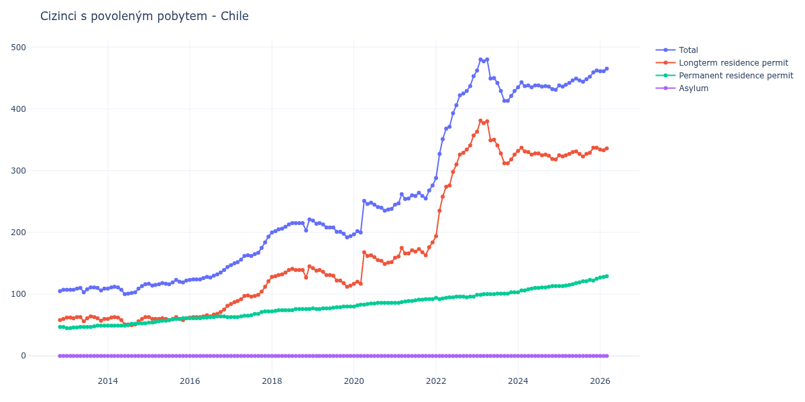

# Chile

## Souhrnné statistiky (Min/Max pro rok) / Summary Statistics (Min/Max per year)

| Year   | Total     | Longterm Residence Permit   | Permanent Residence Permit   | Asylum   |
|--------|-----------|-----------------------------|------------------------------|----------|
| 2012   | 105 / 107 | 58 / 60                     | 47 / 47                      | 0 / 0    |
| 2013   | 103 / 111 | 56 / 64                     | 45 / 49                      | 0 / 0    |
| 2014   | 100 / 116 | 50 / 63                     | 49 / 53                      | 0 / 0    |
| 2015   | 114 / 123 | 58 / 63                     | 54 / 61                      | 0 / 0    |
| 2016   | 123 / 144 | 62 / 81                     | 61 / 64                      | 0 / 0    |
| 2017   | 147 / 193 | 84 / 121                    | 63 / 72                      | 0 / 0    |
| 2018   | 200 / 221 | 127 / 145                   | 72 / 76                      | 0 / 0    |
| 2019   | 192 / 219 | 112 / 142                   | 76 / 80                      | 0 / 0    |
| 2020   | 197 / 251 | 117 / 168                   | 80 / 86                      | 0 / 0    |
| 2021   | 245 / 276 | 159 / 184                   | 86 / 92                      | 0 / 0    |
| 2022   | 288 / 453 | 194 / 357                   | 92 / 96                      | 0 / 0    |
| 2023   | 413 / 480 | 312 / 381                   | 99 / 103                     | 0 / 0    |
| 2024   | 431 / 443 | 318 / 337                   | 103 / 113                    | 0 / 0    |
| 2025   | 436 / 462 | 323 / 337                   | 113 / 125                    | 0 / 0    |
| 2026   | 461 / 465 | 333 / 336                   | 127 / 129                    | 0 / 0    |

## Detailní tabulka / Detailed Data Table

| Date     | Total         | Longterm Residence Permit   | Permanent Residence Permit   | Asylum   |
|----------|---------------|-----------------------------|------------------------------|----------|
| **2012** |               |                             |                              |          |
| 11.2012  | 105           | 58                          | 47                           | 0        |
| 12.2012  | 107 (+1.90%)  | 60 (+3.45%)                 | 47 (+0.00%)                  | 0        |
| **2013** |               |                             |                              |          |
| 01.2013  | 107 (+0.00%)  | 62 (+3.33%)                 | 45 (-4.26%)                  | 0        |
| 02.2013  | 107 (+0.00%)  | 62 (+0.00%)                 | 45 (+0.00%)                  | 0        |
| 03.2013  | 107 (+0.00%)  | 61 (-1.61%)                 | 46 (+2.22%)                  | 0        |
| 04.2013  | 109 (+1.87%)  | 63 (+3.28%)                 | 46 (+0.00%)                  | 0        |
| 05.2013  | 110 (+0.92%)  | 63 (+0.00%)                 | 47 (+2.17%)                  | 0        |
| 06.2013  | 103 (-6.36%)  | 56 (-11.11%)                | 47 (+0.00%)                  | 0        |
| 07.2013  | 108 (+4.85%)  | 61 (+8.93%)                 | 47 (+0.00%)                  | 0        |
| 08.2013  | 111 (+2.78%)  | 64 (+4.92%)                 | 47 (+0.00%)                  | 0        |
| 09.2013  | 111 (+0.00%)  | 63 (-1.56%)                 | 48 (+2.13%)                  | 0        |
| 10.2013  | 110 (-0.90%)  | 61 (-3.17%)                 | 49 (+2.08%)                  | 0        |
| 11.2013  | 106 (-3.64%)  | 57 (-6.56%)                 | 49 (+0.00%)                  | 0        |
| 12.2013  | 109 (+2.83%)  | 60 (+5.26%)                 | 49 (+0.00%)                  | 0        |
| **2014** |               |                             |                              |          |
| 01.2014  | 109 (+0.00%)  | 60 (+0.00%)                 | 49 (+0.00%)                  | 0        |
| 02.2014  | 111 (+1.83%)  | 62 (+3.33%)                 | 49 (+0.00%)                  | 0        |
| 03.2014  | 112 (+0.90%)  | 63 (+1.61%)                 | 49 (+0.00%)                  | 0        |
| 04.2014  | 111 (-0.89%)  | 62 (-1.59%)                 | 49 (+0.00%)                  | 0        |
| 05.2014  | 107 (-3.60%)  | 58 (-6.45%)                 | 49 (+0.00%)                  | 0        |
| 06.2014  | 100 (-6.54%)  | 51 (-12.07%)                | 49 (+0.00%)                  | 0        |
| 07.2014  | 101 (+1.00%)  | 51 (+0.00%)                 | 50 (+2.04%)                  | 0        |
| 08.2014  | 102 (+0.99%)  | 50 (-1.96%)                 | 52 (+4.00%)                  | 0        |
| 09.2014  | 103 (+0.98%)  | 51 (+2.00%)                 | 52 (+0.00%)                  | 0        |
| 10.2014  | 109 (+5.83%)  | 56 (+9.80%)                 | 53 (+1.92%)                  | 0        |
| 11.2014  | 113 (+3.67%)  | 60 (+7.14%)                 | 53 (+0.00%)                  | 0        |
| 12.2014  | 116 (+2.65%)  | 63 (+5.00%)                 | 53 (+0.00%)                  | 0        |
| **2015** |               |                             |                              |          |
| 01.2015  | 117 (+0.86%)  | 63 (+0.00%)                 | 54 (+1.89%)                  | 0        |
| 02.2015  | 114 (-2.56%)  | 60 (-4.76%)                 | 54 (+0.00%)                  | 0        |
| 03.2015  | 115 (+0.88%)  | 60 (+0.00%)                 | 55 (+1.85%)                  | 0        |
| 04.2015  | 116 (+0.87%)  | 60 (+0.00%)                 | 56 (+1.82%)                  | 0        |
| 05.2015  | 118 (+1.72%)  | 61 (+1.67%)                 | 57 (+1.79%)                  | 0        |
| 06.2015  | 117 (-0.85%)  | 60 (-1.64%)                 | 57 (+0.00%)                  | 0        |
| 07.2015  | 116 (-0.85%)  | 58 (-3.33%)                 | 58 (+1.75%)                  | 0        |
| 08.2015  | 119 (+2.59%)  | 60 (+3.45%)                 | 59 (+1.72%)                  | 0        |
| 09.2015  | 123 (+3.36%)  | 63 (+5.00%)                 | 60 (+1.69%)                  | 0        |
| 10.2015  | 120 (-2.44%)  | 60 (-4.76%)                 | 60 (+0.00%)                  | 0        |
| 11.2015  | 119 (-0.83%)  | 58 (-3.33%)                 | 61 (+1.67%)                  | 0        |
| 12.2015  | 122 (+2.52%)  | 61 (+5.17%)                 | 61 (+0.00%)                  | 0        |
| **2016** |               |                             |                              |          |
| 01.2016  | 123 (+0.82%)  | 62 (+1.64%)                 | 61 (+0.00%)                  | 0        |
| 02.2016  | 124 (+0.81%)  | 63 (+1.61%)                 | 61 (+0.00%)                  | 0        |
| 03.2016  | 124 (+0.00%)  | 63 (+0.00%)                 | 61 (+0.00%)                  | 0        |
| 04.2016  | 124 (+0.00%)  | 63 (+0.00%)                 | 61 (+0.00%)                  | 0        |
| 05.2016  | 126 (+1.61%)  | 64 (+1.59%)                 | 62 (+1.64%)                  | 0        |
| 06.2016  | 128 (+1.59%)  | 66 (+3.12%)                 | 62 (+0.00%)                  | 0        |
| 07.2016  | 127 (-0.78%)  | 64 (-3.03%)                 | 63 (+1.61%)                  | 0        |
| 08.2016  | 130 (+2.36%)  | 67 (+4.69%)                 | 63 (+0.00%)                  | 0        |
| 09.2016  | 132 (+1.54%)  | 68 (+1.49%)                 | 64 (+1.59%)                  | 0        |
| 10.2016  | 135 (+2.27%)  | 71 (+4.41%)                 | 64 (+0.00%)                  | 0        |
| 11.2016  | 139 (+2.96%)  | 75 (+5.63%)                 | 64 (+0.00%)                  | 0        |
| 12.2016  | 144 (+3.60%)  | 81 (+8.00%)                 | 63 (-1.56%)                  | 0        |
| **2017** |               |                             |                              |          |
| 01.2017  | 147 (+2.08%)  | 84 (+3.70%)                 | 63 (+0.00%)                  | 0        |
| 02.2017  | 150 (+2.04%)  | 87 (+3.57%)                 | 63 (+0.00%)                  | 0        |
| 03.2017  | 152 (+1.33%)  | 89 (+2.30%)                 | 63 (+0.00%)                  | 0        |
| 04.2017  | 156 (+2.63%)  | 92 (+3.37%)                 | 64 (+1.59%)                  | 0        |
| 05.2017  | 162 (+3.85%)  | 97 (+5.43%)                 | 65 (+1.56%)                  | 0        |
| 06.2017  | 163 (+0.62%)  | 98 (+1.03%)                 | 65 (+0.00%)                  | 0        |
| 07.2017  | 162 (-0.61%)  | 96 (-2.04%)                 | 66 (+1.54%)                  | 0        |
| 08.2017  | 165 (+1.85%)  | 97 (+1.04%)                 | 68 (+3.03%)                  | 0        |
| 09.2017  | 167 (+1.21%)  | 99 (+2.06%)                 | 68 (+0.00%)                  | 0        |
| 10.2017  | 175 (+4.79%)  | 104 (+5.05%)                | 71 (+4.41%)                  | 0        |
| 11.2017  | 184 (+5.14%)  | 112 (+7.69%)                | 72 (+1.41%)                  | 0        |
| 12.2017  | 193 (+4.89%)  | 121 (+8.04%)                | 72 (+0.00%)                  | 0        |
| **2018** |               |                             |                              |          |
| 01.2018  | 200 (+3.63%)  | 128 (+5.79%)                | 72 (+0.00%)                  | 0        |
| 02.2018  | 202 (+1.00%)  | 129 (+0.78%)                | 73 (+1.39%)                  | 0        |
| 03.2018  | 205 (+1.49%)  | 131 (+1.55%)                | 74 (+1.37%)                  | 0        |
| 04.2018  | 206 (+0.49%)  | 132 (+0.76%)                | 74 (+0.00%)                  | 0        |
| 05.2018  | 209 (+1.46%)  | 135 (+2.27%)                | 74 (+0.00%)                  | 0        |
| 06.2018  | 213 (+1.91%)  | 139 (+2.96%)                | 74 (+0.00%)                  | 0        |
| 07.2018  | 215 (+0.94%)  | 141 (+1.44%)                | 74 (+0.00%)                  | 0        |
| 08.2018  | 215 (+0.00%)  | 139 (-1.42%)                | 76 (+2.70%)                  | 0        |
| 09.2018  | 215 (+0.00%)  | 139 (+0.00%)                | 76 (+0.00%)                  | 0        |
| 10.2018  | 215 (+0.00%)  | 139 (+0.00%)                | 76 (+0.00%)                  | 0        |
| 11.2018  | 203 (-5.58%)  | 127 (-8.63%)                | 76 (+0.00%)                  | 0        |
| 12.2018  | 221 (+8.87%)  | 145 (+14.17%)               | 76 (+0.00%)                  | 0        |
| **2019** |               |                             |                              |          |
| 01.2019  | 219 (-0.90%)  | 142 (-2.07%)                | 77 (+1.32%)                  | 0        |
| 02.2019  | 214 (-2.28%)  | 138 (-2.82%)                | 76 (-1.30%)                  | 0        |
| 03.2019  | 215 (+0.47%)  | 139 (+0.72%)                | 76 (+0.00%)                  | 0        |
| 04.2019  | 213 (-0.93%)  | 136 (-2.16%)                | 77 (+1.32%)                  | 0        |
| 05.2019  | 208 (-2.35%)  | 131 (-3.68%)                | 77 (+0.00%)                  | 0        |
| 06.2019  | 208 (+0.00%)  | 131 (+0.00%)                | 77 (+0.00%)                  | 0        |
| 07.2019  | 208 (+0.00%)  | 130 (-0.76%)                | 78 (+1.30%)                  | 0        |
| 08.2019  | 201 (-3.37%)  | 122 (-6.15%)                | 79 (+1.28%)                  | 0        |
| 09.2019  | 201 (+0.00%)  | 122 (+0.00%)                | 79 (+0.00%)                  | 0        |
| 10.2019  | 198 (-1.49%)  | 118 (-3.28%)                | 80 (+1.27%)                  | 0        |
| 11.2019  | 192 (-3.03%)  | 112 (-5.08%)                | 80 (+0.00%)                  | 0        |
| 12.2019  | 194 (+1.04%)  | 114 (+1.79%)                | 80 (+0.00%)                  | 0        |
| **2020** |               |                             |                              |          |
| 01.2020  | 197 (+1.55%)  | 117 (+2.63%)                | 80 (+0.00%)                  | 0        |
| 02.2020  | 202 (+2.54%)  | 120 (+2.56%)                | 82 (+2.50%)                  | 0        |
| 03.2020  | 200 (-0.99%)  | 117 (-2.50%)                | 83 (+1.22%)                  | 0        |
| 04.2020  | 251 (+25.50%) | 168 (+43.59%)               | 83 (+0.00%)                  | 0        |
| 05.2020  | 246 (-1.99%)  | 162 (-3.57%)                | 84 (+1.20%)                  | 0        |
| 06.2020  | 248 (+0.81%)  | 163 (+0.62%)                | 85 (+1.19%)                  | 0        |
| 07.2020  | 245 (-1.21%)  | 160 (-1.84%)                | 85 (+0.00%)                  | 0        |
| 08.2020  | 241 (-1.63%)  | 155 (-3.12%)                | 86 (+1.18%)                  | 0        |
| 09.2020  | 240 (-0.41%)  | 154 (-0.65%)                | 86 (+0.00%)                  | 0        |
| 10.2020  | 235 (-2.08%)  | 149 (-3.25%)                | 86 (+0.00%)                  | 0        |
| 11.2020  | 237 (+0.85%)  | 151 (+1.34%)                | 86 (+0.00%)                  | 0        |
| 12.2020  | 238 (+0.42%)  | 152 (+0.66%)                | 86 (+0.00%)                  | 0        |
| **2021** |               |                             |                              |          |
| 01.2021  | 245 (+2.94%)  | 159 (+4.61%)                | 86 (+0.00%)                  | 0        |
| 02.2021  | 247 (+0.82%)  | 161 (+1.26%)                | 86 (+0.00%)                  | 0        |
| 03.2021  | 262 (+6.07%)  | 175 (+8.70%)                | 87 (+1.16%)                  | 0        |
| 04.2021  | 254 (-3.05%)  | 166 (-5.14%)                | 88 (+1.15%)                  | 0        |
| 05.2021  | 255 (+0.39%)  | 166 (+0.00%)                | 89 (+1.14%)                  | 0        |
| 06.2021  | 260 (+1.96%)  | 171 (+3.01%)                | 89 (+0.00%)                  | 0        |
| 07.2021  | 259 (-0.38%)  | 169 (-1.17%)                | 90 (+1.12%)                  | 0        |
| 08.2021  | 264 (+1.93%)  | 173 (+2.37%)                | 91 (+1.11%)                  | 0        |
| 09.2021  | 259 (-1.89%)  | 168 (-2.89%)                | 91 (+0.00%)                  | 0        |
| 10.2021  | 255 (-1.54%)  | 163 (-2.98%)                | 92 (+1.10%)                  | 0        |
| 11.2021  | 268 (+5.10%)  | 176 (+7.98%)                | 92 (+0.00%)                  | 0        |
| 12.2021  | 276 (+2.99%)  | 184 (+4.55%)                | 92 (+0.00%)                  | 0        |
| **2022** |               |                             |                              |          |
| 01.2022  | 288 (+4.35%)  | 194 (+5.43%)                | 94 (+2.17%)                  | 0        |
| 02.2022  | 327 (+13.54%) | 235 (+21.13%)               | 92 (-2.13%)                  | 0        |
| 03.2022  | 351 (+7.34%)  | 258 (+9.79%)                | 93 (+1.09%)                  | 0        |
| 04.2022  | 368 (+4.84%)  | 274 (+6.20%)                | 94 (+1.08%)                  | 0        |
| 05.2022  | 371 (+0.82%)  | 276 (+0.73%)                | 95 (+1.06%)                  | 0        |
| 06.2022  | 393 (+5.93%)  | 298 (+7.97%)                | 95 (+0.00%)                  | 0        |
| 07.2022  | 406 (+3.31%)  | 310 (+4.03%)                | 96 (+1.05%)                  | 0        |
| 08.2022  | 422 (+3.94%)  | 326 (+5.16%)                | 96 (+0.00%)                  | 0        |
| 09.2022  | 425 (+0.71%)  | 329 (+0.92%)                | 96 (+0.00%)                  | 0        |
| 10.2022  | 429 (+0.94%)  | 334 (+1.52%)                | 95 (-1.04%)                  | 0        |
| 11.2022  | 437 (+1.86%)  | 341 (+2.10%)                | 96 (+1.05%)                  | 0        |
| 12.2022  | 453 (+3.66%)  | 357 (+4.69%)                | 96 (+0.00%)                  | 0        |
| **2023** |               |                             |                              |          |
| 01.2023  | 462 (+1.99%)  | 363 (+1.68%)                | 99 (+3.12%)                  | 0        |
| 02.2023  | 480 (+3.90%)  | 381 (+4.96%)                | 99 (+0.00%)                  | 0        |
| 03.2023  | 477 (-0.62%)  | 377 (-1.05%)                | 100 (+1.01%)                 | 0        |
| 04.2023  | 480 (+0.63%)  | 380 (+0.80%)                | 100 (+0.00%)                 | 0        |
| 05.2023  | 449 (-6.46%)  | 349 (-8.16%)                | 100 (+0.00%)                 | 0        |
| 06.2023  | 450 (+0.22%)  | 350 (+0.29%)                | 100 (+0.00%)                 | 0        |
| 07.2023  | 442 (-1.78%)  | 341 (-2.57%)                | 101 (+1.00%)                 | 0        |
| 08.2023  | 429 (-2.94%)  | 328 (-3.81%)                | 101 (+0.00%)                 | 0        |
| 09.2023  | 413 (-3.73%)  | 312 (-4.88%)                | 101 (+0.00%)                 | 0        |
| 10.2023  | 413 (+0.00%)  | 312 (+0.00%)                | 101 (+0.00%)                 | 0        |
| 11.2023  | 421 (+1.94%)  | 318 (+1.92%)                | 103 (+1.98%)                 | 0        |
| 12.2023  | 429 (+1.90%)  | 326 (+2.52%)                | 103 (+0.00%)                 | 0        |
| **2024** |               |                             |                              |          |
| 01.2024  | 435 (+1.40%)  | 332 (+1.84%)                | 103 (+0.00%)                 | 0        |
| 02.2024  | 443 (+1.84%)  | 337 (+1.51%)                | 106 (+2.91%)                 | 0        |
| 03.2024  | 437 (-1.35%)  | 331 (-1.78%)                | 106 (+0.00%)                 | 0        |
| 04.2024  | 438 (+0.23%)  | 330 (-0.30%)                | 108 (+1.89%)                 | 0        |
| 05.2024  | 435 (-0.68%)  | 326 (-1.21%)                | 109 (+0.93%)                 | 0        |
| 06.2024  | 438 (+0.69%)  | 328 (+0.61%)                | 110 (+0.92%)                 | 0        |
| 07.2024  | 438 (+0.00%)  | 328 (+0.00%)                | 110 (+0.00%)                 | 0        |
| 08.2024  | 436 (-0.46%)  | 325 (-0.91%)                | 111 (+0.91%)                 | 0        |
| 09.2024  | 437 (+0.23%)  | 326 (+0.31%)                | 111 (+0.00%)                 | 0        |
| 10.2024  | 436 (-0.23%)  | 324 (-0.61%)                | 112 (+0.90%)                 | 0        |
| 11.2024  | 432 (-0.92%)  | 319 (-1.54%)                | 113 (+0.89%)                 | 0        |
| 12.2024  | 431 (-0.23%)  | 318 (-0.31%)                | 113 (+0.00%)                 | 0        |
| **2025** |               |                             |                              |          |
| 01.2025  | 438 (+1.62%)  | 325 (+2.20%)                | 113 (+0.00%)                 | 0        |
| 02.2025  | 436 (-0.46%)  | 323 (-0.62%)                | 113 (+0.00%)                 | 0        |
| 03.2025  | 439 (+0.69%)  | 325 (+0.62%)                | 114 (+0.88%)                 | 0        |
| 04.2025  | 442 (+0.68%)  | 327 (+0.62%)                | 115 (+0.88%)                 | 0        |
| 05.2025  | 446 (+0.90%)  | 330 (+0.92%)                | 116 (+0.87%)                 | 0        |
| 06.2025  | 449 (+0.67%)  | 331 (+0.30%)                | 118 (+1.72%)                 | 0        |
| 07.2025  | 446 (-0.67%)  | 327 (-1.21%)                | 119 (+0.85%)                 | 0        |
| 08.2025  | 444 (-0.45%)  | 323 (-1.22%)                | 121 (+1.68%)                 | 0        |
| 09.2025  | 448 (+0.90%)  | 327 (+1.24%)                | 121 (+0.00%)                 | 0        |
| 10.2025  | 452 (+0.89%)  | 329 (+0.61%)                | 123 (+1.65%)                 | 0        |
| 11.2025  | 459 (+1.55%)  | 337 (+2.43%)                | 122 (-0.81%)                 | 0        |
| 12.2025  | 462 (+0.65%)  | 337 (+0.00%)                | 125 (+2.46%)                 | 0        |
| **2026** |               |                             |                              |          |
| 01.2026  | 461 (-0.22%)  | 334 (-0.89%)                | 127 (+1.60%)                 | 0        |
| 02.2026  | 461 (+0.00%)  | 333 (-0.30%)                | 128 (+0.79%)                 | 0        |
| 03.2026  | 465 (+0.87%)  | 336 (+0.90%)                | 129 (+0.78%)                 | 0        |
