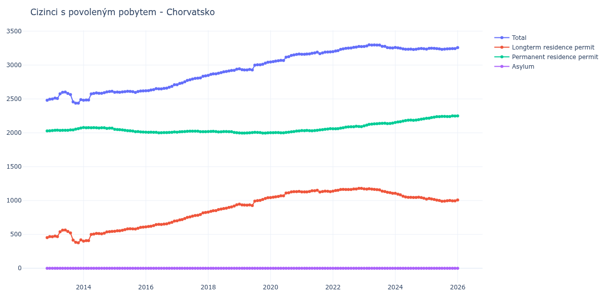

# Chorvatsko

## Souhrnné statistiky (Min/Max pro rok) / Summary Statistics (Min/Max per year)

| Year   | Total         | Longterm Residence Permit   | Permanent Residence Permit   | Asylum   |
|--------|---------------|-----------------------------|------------------------------|----------|
| 2012   | 2 480 / 2 496 | 453 / 467                   | 2 027 / 2 029                | 0 / 0    |
| 2013   | 2 437 / 2 602 | 376 / 564                   | 2 034 / 2 070                | 0 / 0    |
| 2014   | 2 480 / 2 613 | 401 / 544                   | 2 066 / 2 079                | 0 / 0    |
| 2015   | 2 597 / 2 619 | 546 / 608                   | 2 011 / 2 053                | 0 / 0    |
| 2016   | 2 621 / 2 710 | 612 / 697                   | 1 999 / 2 013                | 0 / 0    |
| 2017   | 2 710 / 2 841 | 701 / 824                   | 2 009 / 2 024                | 0 / 0    |
| 2018   | 2 848 / 2 940 | 830 / 938                   | 2 002 / 2 022                | 0 / 0    |
| 2019   | 2 929 / 3 041 | 926 / 1 041                 | 1 996 / 2 007                | 0 / 0    |
| 2020   | 3 045 / 3 163 | 1 043 / 1 135               | 1 999 / 2 028                | 0 / 0    |
| 2021   | 3 160 / 3 194 | 1 126 / 1 152               | 2 029 / 2 062                | 0 / 0    |
| 2022   | 3 199 / 3 274 | 1 139 / 1 180               | 2 059 / 2 096                | 0 / 0    |
| 2023   | 3 252 / 3 299 | 1 108 / 1 175               | 2 102 / 2 144                | 0 / 0    |
| 2024   | 3 230 / 3 260 | 1 034 / 1 108               | 2 152 / 2 207                | 0 / 0    |
| 2025   | 3 232 / 3 249 | 990 / 1 030                 | 2 214 / 2 249                | 0 / 0    |
| 2026   | 3 258 / 3 258 | 1 008 / 1 008               | 2 250 / 2 250                | 0 / 0    |

## Detailní tabulka / Detailed Data Table

| Date     | Total          | Longterm Residence Permit   | Permanent Residence Permit   | Asylum   |
|----------|----------------|-----------------------------|------------------------------|----------|
| **2012** |                |                             |                              |          |
| 11.2012  | 2 480          | 453                         | 2 027                        | 0        |
| 12.2012  | 2 496 (+0.65%) | 467 (+3.09%)                | 2 029 (+0.10%)               | 0        |
| **2013** |                |                             |                              |          |
| 01.2013  | 2 500 (+0.16%) | 466 (-0.21%)                | 2 034 (+0.25%)               | 0        |
| 02.2013  | 2 512 (+0.48%) | 475 (+1.93%)                | 2 037 (+0.15%)               | 0        |
| 03.2013  | 2 506 (-0.24%) | 467 (-1.68%)                | 2 039 (+0.10%)               | 0        |
| 04.2013  | 2 575 (+2.75%) | 539 (+15.42%)               | 2 036 (-0.15%)               | 0        |
| 05.2013  | 2 599 (+0.93%) | 562 (+4.27%)                | 2 037 (+0.05%)               | 0        |
| 06.2013  | 2 602 (+0.12%) | 564 (+0.36%)                | 2 038 (+0.05%)               | 0        |
| 07.2013  | 2 582 (-0.77%) | 544 (-3.55%)                | 2 038 (+0.00%)               | 0        |
| 08.2013  | 2 564 (-0.70%) | 521 (-4.23%)                | 2 043 (+0.25%)               | 0        |
| 09.2013  | 2 457 (-4.17%) | 415 (-20.35%)               | 2 042 (-0.05%)               | 0        |
| 10.2013  | 2 438 (-0.77%) | 384 (-7.47%)                | 2 054 (+0.59%)               | 0        |
| 11.2013  | 2 437 (-0.04%) | 376 (-2.08%)                | 2 061 (+0.34%)               | 0        |
| 12.2013  | 2 490 (+2.17%) | 420 (+11.70%)               | 2 070 (+0.44%)               | 0        |
| **2014** |                |                             |                              |          |
| 01.2014  | 2 480 (-0.40%) | 401 (-4.52%)                | 2 079 (+0.43%)               | 0        |
| 02.2014  | 2 484 (+0.16%) | 409 (+2.00%)                | 2 075 (-0.19%)               | 0        |
| 03.2014  | 2 484 (+0.00%) | 408 (-0.24%)                | 2 076 (+0.05%)               | 0        |
| 04.2014  | 2 574 (+3.62%) | 500 (+22.55%)               | 2 074 (-0.10%)               | 0        |
| 05.2014  | 2 582 (+0.31%) | 506 (+1.20%)                | 2 076 (+0.10%)               | 0        |
| 06.2014  | 2 588 (+0.23%) | 514 (+1.58%)                | 2 074 (-0.10%)               | 0        |
| 07.2014  | 2 584 (-0.15%) | 513 (-0.19%)                | 2 071 (-0.14%)               | 0        |
| 08.2014  | 2 584 (+0.00%) | 509 (-0.78%)                | 2 075 (+0.19%)               | 0        |
| 09.2014  | 2 592 (+0.31%) | 518 (+1.77%)                | 2 074 (-0.05%)               | 0        |
| 10.2014  | 2 603 (+0.42%) | 537 (+3.67%)                | 2 066 (-0.39%)               | 0        |
| 11.2014  | 2 609 (+0.23%) | 540 (+0.56%)                | 2 069 (+0.15%)               | 0        |
| 12.2014  | 2 613 (+0.15%) | 544 (+0.74%)                | 2 069 (+0.00%)               | 0        |
| **2015** |                |                             |                              |          |
| 01.2015  | 2 599 (-0.54%) | 546 (+0.37%)                | 2 053 (-0.77%)               | 0        |
| 02.2015  | 2 602 (+0.12%) | 554 (+1.47%)                | 2 048 (-0.24%)               | 0        |
| 03.2015  | 2 599 (-0.12%) | 553 (-0.18%)                | 2 046 (-0.10%)               | 0        |
| 04.2015  | 2 604 (+0.19%) | 561 (+1.45%)                | 2 043 (-0.15%)               | 0        |
| 05.2015  | 2 607 (+0.12%) | 570 (+1.60%)                | 2 037 (-0.29%)               | 0        |
| 06.2015  | 2 614 (+0.27%) | 582 (+2.11%)                | 2 032 (-0.25%)               | 0        |
| 07.2015  | 2 612 (-0.08%) | 583 (+0.17%)                | 2 029 (-0.15%)               | 0        |
| 08.2015  | 2 607 (-0.19%) | 581 (-0.34%)                | 2 026 (-0.15%)               | 0        |
| 09.2015  | 2 597 (-0.38%) | 580 (-0.17%)                | 2 017 (-0.44%)               | 0        |
| 10.2015  | 2 609 (+0.46%) | 590 (+1.72%)                | 2 019 (+0.10%)               | 0        |
| 11.2015  | 2 617 (+0.31%) | 604 (+2.37%)                | 2 013 (-0.30%)               | 0        |
| 12.2015  | 2 619 (+0.08%) | 608 (+0.66%)                | 2 011 (-0.10%)               | 0        |
| **2016** |                |                             |                              |          |
| 01.2016  | 2 621 (+0.08%) | 612 (+0.66%)                | 2 009 (-0.10%)               | 0        |
| 02.2016  | 2 623 (+0.08%) | 616 (+0.65%)                | 2 007 (-0.10%)               | 0        |
| 03.2016  | 2 631 (+0.30%) | 621 (+0.81%)                | 2 010 (+0.15%)               | 0        |
| 04.2016  | 2 638 (+0.27%) | 630 (+1.45%)                | 2 008 (-0.10%)               | 0        |
| 05.2016  | 2 653 (+0.57%) | 645 (+2.38%)                | 2 008 (+0.00%)               | 0        |
| 06.2016  | 2 648 (-0.19%) | 649 (+0.62%)                | 1 999 (-0.45%)               | 0        |
| 07.2016  | 2 648 (+0.00%) | 647 (-0.31%)                | 2 001 (+0.10%)               | 0        |
| 08.2016  | 2 656 (+0.30%) | 652 (+0.77%)                | 2 004 (+0.15%)               | 0        |
| 09.2016  | 2 659 (+0.11%) | 656 (+0.61%)                | 2 003 (-0.05%)               | 0        |
| 10.2016  | 2 673 (+0.53%) | 667 (+1.68%)                | 2 006 (+0.15%)               | 0        |
| 11.2016  | 2 686 (+0.49%) | 679 (+1.80%)                | 2 007 (+0.05%)               | 0        |
| 12.2016  | 2 710 (+0.89%) | 697 (+2.65%)                | 2 013 (+0.30%)               | 0        |
| **2017** |                |                             |                              |          |
| 01.2017  | 2 710 (+0.00%) | 701 (+0.57%)                | 2 009 (-0.20%)               | 0        |
| 02.2017  | 2 728 (+0.66%) | 714 (+1.85%)                | 2 014 (+0.25%)               | 0        |
| 03.2017  | 2 736 (+0.29%) | 720 (+0.84%)                | 2 016 (+0.10%)               | 0        |
| 04.2017  | 2 752 (+0.58%) | 734 (+1.94%)                | 2 018 (+0.10%)               | 0        |
| 05.2017  | 2 773 (+0.76%) | 751 (+2.32%)                | 2 022 (+0.20%)               | 0        |
| 06.2017  | 2 782 (+0.32%) | 758 (+0.93%)                | 2 024 (+0.10%)               | 0        |
| 07.2017  | 2 794 (+0.43%) | 770 (+1.58%)                | 2 024 (+0.00%)               | 0        |
| 08.2017  | 2 804 (+0.36%) | 780 (+1.30%)                | 2 024 (+0.00%)               | 0        |
| 09.2017  | 2 807 (+0.11%) | 783 (+0.38%)                | 2 024 (+0.00%)               | 0        |
| 10.2017  | 2 810 (+0.11%) | 794 (+1.40%)                | 2 016 (-0.40%)               | 0        |
| 11.2017  | 2 834 (+0.85%) | 818 (+3.02%)                | 2 016 (+0.00%)               | 0        |
| 12.2017  | 2 841 (+0.25%) | 824 (+0.73%)                | 2 017 (+0.05%)               | 0        |
| **2018** |                |                             |                              |          |
| 01.2018  | 2 848 (+0.25%) | 830 (+0.73%)                | 2 018 (+0.05%)               | 0        |
| 02.2018  | 2 862 (+0.49%) | 841 (+1.33%)                | 2 021 (+0.15%)               | 0        |
| 03.2018  | 2 871 (+0.31%) | 849 (+0.95%)                | 2 022 (+0.05%)               | 0        |
| 04.2018  | 2 871 (+0.00%) | 852 (+0.35%)                | 2 019 (-0.15%)               | 0        |
| 05.2018  | 2 879 (+0.28%) | 866 (+1.64%)                | 2 013 (-0.30%)               | 0        |
| 06.2018  | 2 889 (+0.35%) | 875 (+1.04%)                | 2 014 (+0.05%)               | 0        |
| 07.2018  | 2 900 (+0.38%) | 881 (+0.69%)                | 2 019 (+0.25%)               | 0        |
| 08.2018  | 2 906 (+0.21%) | 888 (+0.79%)                | 2 018 (-0.05%)               | 0        |
| 09.2018  | 2 914 (+0.28%) | 898 (+1.13%)                | 2 016 (-0.10%)               | 0        |
| 10.2018  | 2 921 (+0.24%) | 905 (+0.78%)                | 2 016 (+0.00%)               | 0        |
| 11.2018  | 2 923 (+0.07%) | 918 (+1.44%)                | 2 005 (-0.55%)               | 0        |
| 12.2018  | 2 940 (+0.58%) | 938 (+2.18%)                | 2 002 (-0.15%)               | 0        |
| **2019** |                |                             |                              |          |
| 01.2019  | 2 944 (+0.14%) | 946 (+0.85%)                | 1 998 (-0.20%)               | 0        |
| 02.2019  | 2 932 (-0.41%) | 936 (-1.06%)                | 1 996 (-0.10%)               | 0        |
| 03.2019  | 2 929 (-0.10%) | 933 (-0.32%)                | 1 996 (+0.00%)               | 0        |
| 04.2019  | 2 929 (+0.00%) | 931 (-0.21%)                | 1 998 (+0.10%)               | 0        |
| 05.2019  | 2 935 (+0.20%) | 935 (+0.43%)                | 2 000 (+0.10%)               | 0        |
| 06.2019  | 2 929 (-0.20%) | 926 (-0.96%)                | 2 003 (+0.15%)               | 0        |
| 07.2019  | 2 998 (+2.36%) | 991 (+7.02%)                | 2 007 (+0.20%)               | 0        |
| 08.2019  | 3 005 (+0.23%) | 999 (+0.81%)                | 2 006 (-0.05%)               | 0        |
| 09.2019  | 3 005 (+0.00%) | 1 002 (+0.30%)              | 2 003 (-0.15%)               | 0        |
| 10.2019  | 3 012 (+0.23%) | 1 015 (+1.30%)              | 1 997 (-0.30%)               | 0        |
| 11.2019  | 3 028 (+0.53%) | 1 031 (+1.58%)              | 1 997 (+0.00%)               | 0        |
| 12.2019  | 3 041 (+0.43%) | 1 041 (+0.97%)              | 2 000 (+0.15%)               | 0        |
| **2020** |                |                             |                              |          |
| 01.2020  | 3 045 (+0.13%) | 1 043 (+0.19%)              | 2 002 (+0.10%)               | 0        |
| 02.2020  | 3 051 (+0.20%) | 1 050 (+0.67%)              | 2 001 (-0.05%)               | 0        |
| 03.2020  | 3 058 (+0.23%) | 1 055 (+0.48%)              | 2 003 (+0.10%)               | 0        |
| 04.2020  | 3 065 (+0.23%) | 1 061 (+0.57%)              | 2 004 (+0.05%)               | 0        |
| 05.2020  | 3 069 (+0.13%) | 1 069 (+0.75%)              | 2 000 (-0.20%)               | 0        |
| 06.2020  | 3 068 (-0.03%) | 1 069 (+0.00%)              | 1 999 (-0.05%)               | 0        |
| 07.2020  | 3 116 (+1.56%) | 1 111 (+3.93%)              | 2 005 (+0.30%)               | 0        |
| 08.2020  | 3 123 (+0.22%) | 1 114 (+0.27%)              | 2 009 (+0.20%)               | 0        |
| 09.2020  | 3 142 (+0.61%) | 1 127 (+1.17%)              | 2 015 (+0.30%)               | 0        |
| 10.2020  | 3 150 (+0.25%) | 1 132 (+0.44%)              | 2 018 (+0.15%)               | 0        |
| 11.2020  | 3 157 (+0.22%) | 1 131 (-0.09%)              | 2 026 (+0.40%)               | 0        |
| 12.2020  | 3 163 (+0.19%) | 1 135 (+0.35%)              | 2 028 (+0.10%)               | 0        |
| **2021** |                |                             |                              |          |
| 01.2021  | 3 160 (-0.09%) | 1 127 (-0.70%)              | 2 033 (+0.25%)               | 0        |
| 02.2021  | 3 160 (+0.00%) | 1 128 (+0.09%)              | 2 032 (-0.05%)               | 0        |
| 03.2021  | 3 163 (+0.09%) | 1 128 (+0.00%)              | 2 035 (+0.15%)               | 0        |
| 04.2021  | 3 164 (+0.03%) | 1 133 (+0.44%)              | 2 031 (-0.20%)               | 0        |
| 05.2021  | 3 174 (+0.32%) | 1 145 (+1.06%)              | 2 029 (-0.10%)               | 0        |
| 06.2021  | 3 179 (+0.16%) | 1 145 (+0.00%)              | 2 034 (+0.25%)               | 0        |
| 07.2021  | 3 190 (+0.35%) | 1 152 (+0.61%)              | 2 038 (+0.20%)               | 0        |
| 08.2021  | 3 169 (-0.66%) | 1 126 (-2.26%)              | 2 043 (+0.25%)               | 0        |
| 09.2021  | 3 180 (+0.35%) | 1 133 (+0.62%)              | 2 047 (+0.20%)               | 0        |
| 10.2021  | 3 191 (+0.35%) | 1 139 (+0.53%)              | 2 052 (+0.24%)               | 0        |
| 11.2021  | 3 193 (+0.06%) | 1 137 (-0.18%)              | 2 056 (+0.19%)               | 0        |
| 12.2021  | 3 194 (+0.03%) | 1 132 (-0.44%)              | 2 062 (+0.29%)               | 0        |
| **2022** |                |                             |                              |          |
| 01.2022  | 3 199 (+0.16%) | 1 139 (+0.62%)              | 2 060 (-0.10%)               | 0        |
| 02.2022  | 3 208 (+0.28%) | 1 149 (+0.88%)              | 2 059 (-0.05%)               | 0        |
| 03.2022  | 3 213 (+0.16%) | 1 152 (+0.26%)              | 2 061 (+0.10%)               | 0        |
| 04.2022  | 3 231 (+0.56%) | 1 163 (+0.95%)              | 2 068 (+0.34%)               | 0        |
| 05.2022  | 3 240 (+0.28%) | 1 165 (+0.17%)              | 2 075 (+0.34%)               | 0        |
| 06.2022  | 3 246 (+0.19%) | 1 163 (-0.17%)              | 2 083 (+0.39%)               | 0        |
| 07.2022  | 3 250 (+0.12%) | 1 163 (+0.00%)              | 2 087 (+0.19%)               | 0        |
| 08.2022  | 3 252 (+0.06%) | 1 163 (+0.00%)              | 2 089 (+0.10%)               | 0        |
| 09.2022  | 3 261 (+0.28%) | 1 171 (+0.69%)              | 2 090 (+0.05%)               | 0        |
| 10.2022  | 3 266 (+0.15%) | 1 170 (-0.09%)              | 2 096 (+0.29%)               | 0        |
| 11.2022  | 3 274 (+0.24%) | 1 180 (+0.85%)              | 2 094 (-0.10%)               | 0        |
| 12.2022  | 3 272 (-0.06%) | 1 180 (+0.00%)              | 2 092 (-0.10%)               | 0        |
| **2023** |                |                             |                              |          |
| 01.2023  | 3 274 (+0.06%) | 1 172 (-0.68%)              | 2 102 (+0.48%)               | 0        |
| 02.2023  | 3 283 (+0.27%) | 1 169 (-0.26%)              | 2 114 (+0.57%)               | 0        |
| 03.2023  | 3 299 (+0.49%) | 1 175 (+0.51%)              | 2 124 (+0.47%)               | 0        |
| 04.2023  | 3 296 (-0.09%) | 1 168 (-0.60%)              | 2 128 (+0.19%)               | 0        |
| 05.2023  | 3 297 (+0.03%) | 1 165 (-0.26%)              | 2 132 (+0.19%)               | 0        |
| 06.2023  | 3 295 (-0.06%) | 1 161 (-0.34%)              | 2 134 (+0.09%)               | 0        |
| 07.2023  | 3 295 (+0.00%) | 1 157 (-0.34%)              | 2 138 (+0.19%)               | 0        |
| 08.2023  | 3 277 (-0.55%) | 1 138 (-1.64%)              | 2 139 (+0.05%)               | 0        |
| 09.2023  | 3 276 (-0.03%) | 1 134 (-0.35%)              | 2 142 (+0.14%)               | 0        |
| 10.2023  | 3 258 (-0.55%) | 1 122 (-1.06%)              | 2 136 (-0.28%)               | 0        |
| 11.2023  | 3 255 (-0.09%) | 1 117 (-0.45%)              | 2 138 (+0.09%)               | 0        |
| 12.2023  | 3 252 (-0.09%) | 1 108 (-0.81%)              | 2 144 (+0.28%)               | 0        |
| **2024** |                |                             |                              |          |
| 01.2024  | 3 260 (+0.25%) | 1 108 (+0.00%)              | 2 152 (+0.37%)               | 0        |
| 02.2024  | 3 255 (-0.15%) | 1 094 (-1.26%)              | 2 161 (+0.42%)               | 0        |
| 03.2024  | 3 249 (-0.18%) | 1 085 (-0.82%)              | 2 164 (+0.14%)               | 0        |
| 04.2024  | 3 239 (-0.31%) | 1 065 (-1.84%)              | 2 174 (+0.46%)               | 0        |
| 05.2024  | 3 233 (-0.19%) | 1 053 (-1.13%)              | 2 180 (+0.28%)               | 0        |
| 06.2024  | 3 234 (+0.03%) | 1 047 (-0.57%)              | 2 187 (+0.32%)               | 0        |
| 07.2024  | 3 235 (+0.03%) | 1 047 (+0.00%)              | 2 188 (+0.05%)               | 0        |
| 08.2024  | 3 230 (-0.15%) | 1 045 (-0.19%)              | 2 185 (-0.14%)               | 0        |
| 09.2024  | 3 234 (+0.12%) | 1 046 (+0.10%)              | 2 188 (+0.14%)               | 0        |
| 10.2024  | 3 242 (+0.25%) | 1 049 (+0.29%)              | 2 193 (+0.23%)               | 0        |
| 11.2024  | 3 245 (+0.09%) | 1 043 (-0.57%)              | 2 202 (+0.41%)               | 0        |
| 12.2024  | 3 241 (-0.12%) | 1 034 (-0.86%)              | 2 207 (+0.23%)               | 0        |
| **2025** |                |                             |                              |          |
| 01.2025  | 3 235 (-0.19%) | 1 021 (-1.26%)              | 2 214 (+0.32%)               | 0        |
| 02.2025  | 3 247 (+0.37%) | 1 030 (+0.88%)              | 2 217 (+0.14%)               | 0        |
| 03.2025  | 3 249 (+0.06%) | 1 024 (-0.58%)              | 2 225 (+0.36%)               | 0        |
| 04.2025  | 3 246 (-0.09%) | 1 015 (-0.88%)              | 2 231 (+0.27%)               | 0        |
| 05.2025  | 3 244 (-0.06%) | 1 006 (-0.89%)              | 2 238 (+0.31%)               | 0        |
| 06.2025  | 3 239 (-0.15%) | 1 001 (-0.50%)              | 2 238 (+0.00%)               | 0        |
| 07.2025  | 3 232 (-0.22%) | 990 (-1.10%)                | 2 242 (+0.18%)               | 0        |
| 08.2025  | 3 235 (+0.09%) | 992 (+0.20%)                | 2 243 (+0.04%)               | 0        |
| 09.2025  | 3 239 (+0.12%) | 998 (+0.60%)                | 2 241 (-0.09%)               | 0        |
| 10.2025  | 3 241 (+0.06%) | 1 000 (+0.20%)              | 2 241 (+0.00%)               | 0        |
| 11.2025  | 3 244 (+0.09%) | 995 (-0.50%)                | 2 249 (+0.36%)               | 0        |
| 12.2025  | 3 243 (-0.03%) | 995 (+0.00%)                | 2 248 (-0.04%)               | 0        |
| **2026** |                |                             |                              |          |
| 01.2026  | 3 258 (+0.46%) | 1 008 (+1.31%)              | 2 250 (+0.09%)               | 0        |
