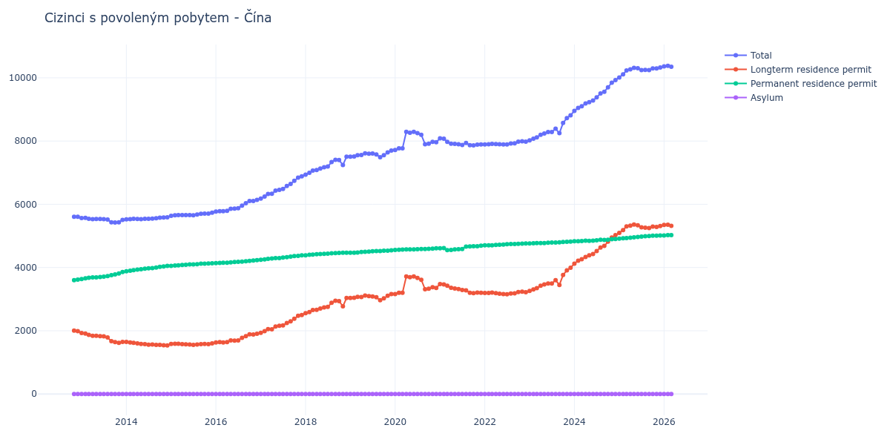

# Čína

## Souhrnné statistiky (Min/Max pro rok) / Summary Statistics (Min/Max per year)

| Year   | Total           | Longterm Residence Permit   | Permanent Residence Permit   | Asylum   |
|--------|-----------------|-----------------------------|------------------------------|----------|
| 2012   | 5 604 / 5 607   | 1 990 / 2 003               | 3 601 / 3 617                | 0 / 0    |
| 2013   | 5 425 / 5 570   | 1 618 / 1 930               | 3 636 / 3 858                | 0 / 0    |
| 2014   | 5 526 / 5 587   | 1 538 / 1 645               | 3 881 / 4 049                | 0 / 0    |
| 2015   | 5 636 / 5 734   | 1 554 / 1 599               | 4 052 / 4 135                | 0 / 0    |
| 2016   | 5 771 / 6 139   | 1 628 / 1 906               | 4 139 / 4 233                | 0 / 0    |
| 2017   | 6 181 / 6 885   | 1 937 / 2 500               | 4 244 / 4 385                | 0 / 0    |
| 2018   | 6 939 / 7 506   | 2 555 / 3 038               | 4 384 / 4 468                | 0 / 0    |
| 2019   | 7 487 / 7 702   | 2 967 / 3 160               | 4 467 / 4 542                | 0 / 0    |
| 2020   | 7 717 / 8 293   | 3 163 / 3 719               | 4 554 / 4 607                | 0 / 0    |
| 2021   | 7 862 / 8 084   | 3 191 / 3 475               | 4 550 / 4 690                | 0 / 0    |
| 2022   | 7 890 / 7 993   | 3 153 / 3 236               | 4 701 / 4 759                | 0 / 0    |
| 2023   | 8 019 / 8 813   | 3 258 / 3 991               | 4 761 / 4 822                | 0 / 0    |
| 2024   | 8 952 / 9 927   | 4 121 / 5 024               | 4 831 / 4 901                | 0 / 2    |
| 2025   | 10 009 / 10 326 | 5 093 / 5 361               | 4 914 / 5 013                | 0 / 2    |
| 2026   | 10 347 / 10 379 | 5 321 / 5 355               | 5 016 / 5 026                | 0 / 0    |

## Detailní tabulka / Detailed Data Table

| Date     | Total           | Longterm Residence Permit   | Permanent Residence Permit   | Asylum       |
|----------|-----------------|-----------------------------|------------------------------|--------------|
| **2012** |                 |                             |                              |              |
| 11.2012  | 5 604           | 2 003                       | 3 601                        | 0            |
| 12.2012  | 5 607 (+0.05%)  | 1 990 (-0.65%)              | 3 617 (+0.44%)               | 0            |
| **2013** |                 |                             |                              |              |
| 01.2013  | 5 566 (-0.73%)  | 1 930 (-3.02%)              | 3 636 (+0.53%)               | 0            |
| 02.2013  | 5 570 (+0.07%)  | 1 912 (-0.93%)              | 3 658 (+0.61%)               | 0            |
| 03.2013  | 5 544 (-0.47%)  | 1 870 (-2.20%)              | 3 674 (+0.44%)               | 0            |
| 04.2013  | 5 527 (-0.31%)  | 1 841 (-1.55%)              | 3 686 (+0.33%)               | 0            |
| 05.2013  | 5 534 (+0.13%)  | 1 843 (+0.11%)              | 3 691 (+0.14%)               | 0            |
| 06.2013  | 5 534 (+0.00%)  | 1 832 (-0.60%)              | 3 702 (+0.30%)               | 0            |
| 07.2013  | 5 532 (-0.04%)  | 1 821 (-0.60%)              | 3 711 (+0.24%)               | 0            |
| 08.2013  | 5 520 (-0.22%)  | 1 788 (-1.81%)              | 3 732 (+0.57%)               | 0            |
| 09.2013  | 5 427 (-1.68%)  | 1 669 (-6.66%)              | 3 758 (+0.70%)               | 0            |
| 10.2013  | 5 425 (-0.04%)  | 1 642 (-1.62%)              | 3 783 (+0.67%)               | 0            |
| 11.2013  | 5 431 (+0.11%)  | 1 618 (-1.46%)              | 3 813 (+0.79%)               | 0            |
| 12.2013  | 5 508 (+1.42%)  | 1 650 (+1.98%)              | 3 858 (+1.18%)               | 0            |
| **2014** |                 |                             |                              |              |
| 01.2014  | 5 526 (+0.33%)  | 1 645 (-0.30%)              | 3 881 (+0.60%)               | 0            |
| 02.2014  | 5 530 (+0.07%)  | 1 631 (-0.85%)              | 3 899 (+0.46%)               | 0            |
| 03.2014  | 5 539 (+0.16%)  | 1 620 (-0.67%)              | 3 919 (+0.51%)               | 0            |
| 04.2014  | 5 537 (-0.04%)  | 1 600 (-1.23%)              | 3 937 (+0.46%)               | 0            |
| 05.2014  | 5 529 (-0.14%)  | 1 582 (-1.12%)              | 3 947 (+0.25%)               | 0            |
| 06.2014  | 5 540 (+0.20%)  | 1 578 (-0.25%)              | 3 962 (+0.38%)               | 0            |
| 07.2014  | 5 539 (-0.02%)  | 1 562 (-1.01%)              | 3 977 (+0.38%)               | 0            |
| 08.2014  | 5 548 (+0.16%)  | 1 568 (+0.38%)              | 3 980 (+0.08%)               | 0            |
| 09.2014  | 5 556 (+0.14%)  | 1 555 (-0.83%)              | 4 001 (+0.53%)               | 0            |
| 10.2014  | 5 574 (+0.32%)  | 1 551 (-0.26%)              | 4 023 (+0.55%)               | 0            |
| 11.2014  | 5 580 (+0.11%)  | 1 543 (-0.52%)              | 4 037 (+0.35%)               | 0            |
| 12.2014  | 5 587 (+0.13%)  | 1 538 (-0.32%)              | 4 049 (+0.30%)               | 0            |
| **2015** |                 |                             |                              |              |
| 01.2015  | 5 636 (+0.88%)  | 1 584 (+2.99%)              | 4 052 (+0.07%)               | 0            |
| 02.2015  | 5 652 (+0.28%)  | 1 589 (+0.32%)              | 4 063 (+0.27%)               | 0            |
| 03.2015  | 5 657 (+0.09%)  | 1 588 (-0.06%)              | 4 069 (+0.15%)               | 0            |
| 04.2015  | 5 656 (-0.02%)  | 1 575 (-0.82%)              | 4 081 (+0.29%)               | 0            |
| 05.2015  | 5 660 (+0.07%)  | 1 574 (-0.06%)              | 4 086 (+0.12%)               | 0            |
| 06.2015  | 5 660 (+0.00%)  | 1 563 (-0.70%)              | 4 097 (+0.27%)               | 0            |
| 07.2015  | 5 655 (-0.09%)  | 1 554 (-0.58%)              | 4 101 (+0.10%)               | 0            |
| 08.2015  | 5 675 (+0.35%)  | 1 568 (+0.90%)              | 4 107 (+0.15%)               | 0            |
| 09.2015  | 5 702 (+0.48%)  | 1 580 (+0.77%)              | 4 122 (+0.37%)               | 0            |
| 10.2015  | 5 703 (+0.02%)  | 1 583 (+0.19%)              | 4 120 (-0.05%)               | 0            |
| 11.2015  | 5 706 (+0.05%)  | 1 577 (-0.38%)              | 4 129 (+0.22%)               | 0            |
| 12.2015  | 5 734 (+0.49%)  | 1 599 (+1.40%)              | 4 135 (+0.15%)               | 0            |
| **2016** |                 |                             |                              |              |
| 01.2016  | 5 771 (+0.65%)  | 1 632 (+2.06%)              | 4 139 (+0.10%)               | 0            |
| 02.2016  | 5 784 (+0.23%)  | 1 641 (+0.55%)              | 4 143 (+0.10%)               | 0            |
| 03.2016  | 5 780 (-0.07%)  | 1 628 (-0.79%)              | 4 152 (+0.22%)               | 0            |
| 04.2016  | 5 796 (+0.28%)  | 1 642 (+0.86%)              | 4 154 (+0.05%)               | 0            |
| 05.2016  | 5 860 (+1.10%)  | 1 694 (+3.17%)              | 4 166 (+0.29%)               | 0            |
| 06.2016  | 5 863 (+0.05%)  | 1 690 (-0.24%)              | 4 173 (+0.17%)               | 0            |
| 07.2016  | 5 877 (+0.24%)  | 1 694 (+0.24%)              | 4 183 (+0.24%)               | 0            |
| 08.2016  | 5 960 (+1.41%)  | 1 775 (+4.78%)              | 4 185 (+0.05%)               | 0            |
| 09.2016  | 6 032 (+1.21%)  | 1 832 (+3.21%)              | 4 200 (+0.36%)               | 0            |
| 10.2016  | 6 104 (+1.19%)  | 1 891 (+3.22%)              | 4 213 (+0.31%)               | 0            |
| 11.2016  | 6 106 (+0.03%)  | 1 884 (-0.37%)              | 4 222 (+0.21%)               | 0            |
| 12.2016  | 6 139 (+0.54%)  | 1 906 (+1.17%)              | 4 233 (+0.26%)               | 0            |
| **2017** |                 |                             |                              |              |
| 01.2017  | 6 181 (+0.68%)  | 1 937 (+1.63%)              | 4 244 (+0.26%)               | 0            |
| 02.2017  | 6 244 (+1.02%)  | 1 988 (+2.63%)              | 4 256 (+0.28%)               | 0            |
| 03.2017  | 6 326 (+1.31%)  | 2 054 (+3.32%)              | 4 272 (+0.38%)               | 0            |
| 04.2017  | 6 333 (+0.11%)  | 2 044 (-0.49%)              | 4 289 (+0.40%)               | 0            |
| 05.2017  | 6 430 (+1.53%)  | 2 133 (+4.35%)              | 4 297 (+0.19%)               | 0            |
| 06.2017  | 6 458 (+0.44%)  | 2 157 (+1.13%)              | 4 301 (+0.09%)               | 0            |
| 07.2017  | 6 485 (+0.42%)  | 2 167 (+0.46%)              | 4 318 (+0.40%)               | 0            |
| 08.2017  | 6 578 (+1.43%)  | 2 248 (+3.74%)              | 4 330 (+0.28%)               | 0            |
| 09.2017  | 6 643 (+0.99%)  | 2 297 (+2.18%)              | 4 346 (+0.37%)               | 0            |
| 10.2017  | 6 742 (+1.49%)  | 2 382 (+3.70%)              | 4 360 (+0.32%)               | 0            |
| 11.2017  | 6 842 (+1.48%)  | 2 472 (+3.78%)              | 4 370 (+0.23%)               | 0            |
| 12.2017  | 6 885 (+0.63%)  | 2 500 (+1.13%)              | 4 385 (+0.34%)               | 0            |
| **2018** |                 |                             |                              |              |
| 01.2018  | 6 939 (+0.78%)  | 2 555 (+2.20%)              | 4 384 (-0.02%)               | 0            |
| 02.2018  | 6 994 (+0.79%)  | 2 589 (+1.33%)              | 4 405 (+0.48%)               | 0            |
| 03.2018  | 7 066 (+1.03%)  | 2 654 (+2.51%)              | 4 412 (+0.16%)               | 0            |
| 04.2018  | 7 083 (+0.24%)  | 2 662 (+0.30%)              | 4 421 (+0.20%)               | 0            |
| 05.2018  | 7 129 (+0.65%)  | 2 704 (+1.58%)              | 4 425 (+0.09%)               | 0            |
| 06.2018  | 7 171 (+0.59%)  | 2 739 (+1.29%)              | 4 432 (+0.16%)               | 0            |
| 07.2018  | 7 193 (+0.31%)  | 2 754 (+0.55%)              | 4 439 (+0.16%)               | 0            |
| 08.2018  | 7 333 (+1.95%)  | 2 884 (+4.72%)              | 4 449 (+0.23%)               | 0            |
| 09.2018  | 7 408 (+1.02%)  | 2 951 (+2.32%)              | 4 457 (+0.18%)               | 0            |
| 10.2018  | 7 400 (-0.11%)  | 2 937 (-0.47%)              | 4 463 (+0.13%)               | 0            |
| 11.2018  | 7 239 (-2.18%)  | 2 773 (-5.58%)              | 4 466 (+0.07%)               | 0            |
| 12.2018  | 7 506 (+3.69%)  | 3 038 (+9.56%)              | 4 468 (+0.04%)               | 0            |
| **2019** |                 |                             |                              |              |
| 01.2019  | 7 503 (-0.04%)  | 3 036 (-0.07%)              | 4 467 (-0.02%)               | 0            |
| 02.2019  | 7 510 (+0.09%)  | 3 042 (+0.20%)              | 4 468 (+0.02%)               | 0            |
| 03.2019  | 7 551 (+0.55%)  | 3 074 (+1.05%)              | 4 477 (+0.20%)               | 0            |
| 04.2019  | 7 557 (+0.08%)  | 3 068 (-0.20%)              | 4 489 (+0.27%)               | 0            |
| 05.2019  | 7 614 (+0.75%)  | 3 116 (+1.56%)              | 4 498 (+0.20%)               | 0            |
| 06.2019  | 7 601 (-0.17%)  | 3 096 (-0.64%)              | 4 505 (+0.16%)               | 0            |
| 07.2019  | 7 605 (+0.05%)  | 3 087 (-0.29%)              | 4 518 (+0.29%)               | 0            |
| 08.2019  | 7 578 (-0.36%)  | 3 058 (-0.94%)              | 4 520 (+0.04%)               | 0            |
| 09.2019  | 7 487 (-1.20%)  | 2 967 (-2.98%)              | 4 520 (+0.00%)               | 0            |
| 10.2019  | 7 555 (+0.91%)  | 3 024 (+1.92%)              | 4 531 (+0.24%)               | 0            |
| 11.2019  | 7 641 (+1.14%)  | 3 107 (+2.74%)              | 4 534 (+0.07%)               | 0            |
| 12.2019  | 7 702 (+0.80%)  | 3 160 (+1.71%)              | 4 542 (+0.18%)               | 0            |
| **2020** |                 |                             |                              |              |
| 01.2020  | 7 717 (+0.19%)  | 3 163 (+0.09%)              | 4 554 (+0.26%)               | 0            |
| 02.2020  | 7 769 (+0.67%)  | 3 204 (+1.30%)              | 4 565 (+0.24%)               | 0            |
| 03.2020  | 7 770 (+0.01%)  | 3 201 (-0.09%)              | 4 569 (+0.09%)               | 0            |
| 04.2020  | 8 291 (+6.71%)  | 3 719 (+16.18%)             | 4 572 (+0.07%)               | 0            |
| 05.2020  | 8 263 (-0.34%)  | 3 692 (-0.73%)              | 4 571 (-0.02%)               | 0            |
| 06.2020  | 8 293 (+0.36%)  | 3 719 (+0.73%)              | 4 574 (+0.07%)               | 0            |
| 07.2020  | 8 250 (-0.52%)  | 3 670 (-1.32%)              | 4 580 (+0.13%)               | 0            |
| 08.2020  | 8 199 (-0.62%)  | 3 615 (-1.50%)              | 4 584 (+0.09%)               | 0            |
| 09.2020  | 7 899 (-3.66%)  | 3 313 (-8.35%)              | 4 586 (+0.04%)               | 0            |
| 10.2020  | 7 919 (+0.25%)  | 3 328 (+0.45%)              | 4 591 (+0.11%)               | 0            |
| 11.2020  | 7 972 (+0.67%)  | 3 377 (+1.47%)              | 4 595 (+0.09%)               | 0            |
| 12.2020  | 7 964 (-0.10%)  | 3 357 (-0.59%)              | 4 607 (+0.26%)               | 0            |
| **2021** |                 |                             |                              |              |
| 01.2021  | 8 084 (+1.51%)  | 3 475 (+3.52%)              | 4 609 (+0.04%)               | 0            |
| 02.2021  | 8 076 (-0.10%)  | 3 464 (-0.32%)              | 4 612 (+0.07%)               | 0            |
| 03.2021  | 7 975 (-1.25%)  | 3 425 (-1.13%)              | 4 550 (-1.34%)               | 0            |
| 04.2021  | 7 916 (-0.74%)  | 3 361 (-1.87%)              | 4 555 (+0.11%)               | 0            |
| 05.2021  | 7 908 (-0.10%)  | 3 335 (-0.77%)              | 4 573 (+0.40%)               | 0            |
| 06.2021  | 7 901 (-0.09%)  | 3 321 (-0.42%)              | 4 580 (+0.15%)               | 0            |
| 07.2021  | 7 878 (-0.29%)  | 3 291 (-0.90%)              | 4 587 (+0.15%)               | 0            |
| 08.2021  | 7 938 (+0.76%)  | 3 277 (-0.43%)              | 4 661 (+1.61%)               | 0            |
| 09.2021  | 7 871 (-0.84%)  | 3 204 (-2.23%)              | 4 667 (+0.13%)               | 0            |
| 10.2021  | 7 862 (-0.11%)  | 3 191 (-0.41%)              | 4 671 (+0.09%)               | 0            |
| 11.2021  | 7 885 (+0.29%)  | 3 209 (+0.56%)              | 4 676 (+0.11%)               | 0            |
| 12.2021  | 7 890 (+0.06%)  | 3 200 (-0.28%)              | 4 690 (+0.30%)               | 0            |
| **2022** |                 |                             |                              |              |
| 01.2022  | 7 895 (+0.06%)  | 3 194 (-0.19%)              | 4 701 (+0.23%)               | 0            |
| 02.2022  | 7 896 (+0.01%)  | 3 193 (-0.03%)              | 4 703 (+0.04%)               | 0            |
| 03.2022  | 7 910 (+0.18%)  | 3 205 (+0.38%)              | 4 705 (+0.04%)               | 0            |
| 04.2022  | 7 904 (-0.08%)  | 3 187 (-0.56%)              | 4 717 (+0.26%)               | 0            |
| 05.2022  | 7 897 (-0.09%)  | 3 174 (-0.41%)              | 4 723 (+0.13%)               | 0            |
| 06.2022  | 7 890 (-0.09%)  | 3 163 (-0.35%)              | 4 727 (+0.08%)               | 0            |
| 07.2022  | 7 891 (+0.01%)  | 3 153 (-0.32%)              | 4 738 (+0.23%)               | 0            |
| 08.2022  | 7 924 (+0.42%)  | 3 180 (+0.86%)              | 4 744 (+0.13%)               | 0            |
| 09.2022  | 7 926 (+0.03%)  | 3 182 (+0.06%)              | 4 744 (+0.00%)               | 0            |
| 10.2022  | 7 979 (+0.67%)  | 3 228 (+1.45%)              | 4 751 (+0.15%)               | 0            |
| 11.2022  | 7 993 (+0.18%)  | 3 236 (+0.25%)              | 4 757 (+0.13%)               | 0            |
| 12.2022  | 7 981 (-0.15%)  | 3 222 (-0.43%)              | 4 759 (+0.04%)               | 0            |
| **2023** |                 |                             |                              |              |
| 01.2023  | 8 019 (+0.48%)  | 3 258 (+1.12%)              | 4 761 (+0.04%)               | 0            |
| 02.2023  | 8 074 (+0.69%)  | 3 309 (+1.57%)              | 4 765 (+0.08%)               | 0            |
| 03.2023  | 8 118 (+0.54%)  | 3 347 (+1.15%)              | 4 771 (+0.13%)               | 0            |
| 04.2023  | 8 200 (+1.01%)  | 3 427 (+2.39%)              | 4 773 (+0.04%)               | 0            |
| 05.2023  | 8 238 (+0.46%)  | 3 463 (+1.05%)              | 4 775 (+0.04%)               | 0            |
| 06.2023  | 8 284 (+0.56%)  | 3 497 (+0.98%)              | 4 787 (+0.25%)               | 0            |
| 07.2023  | 8 286 (+0.02%)  | 3 495 (-0.06%)              | 4 791 (+0.08%)               | 0            |
| 08.2023  | 8 390 (+1.26%)  | 3 599 (+2.98%)              | 4 791 (+0.00%)               | 0            |
| 09.2023  | 8 249 (-1.68%)  | 3 450 (-4.14%)              | 4 799 (+0.17%)               | 0            |
| 10.2023  | 8 571 (+3.90%)  | 3 763 (+9.07%)              | 4 808 (+0.19%)               | 0            |
| 11.2023  | 8 728 (+1.83%)  | 3 912 (+3.96%)              | 4 816 (+0.17%)               | 0            |
| 12.2023  | 8 813 (+0.97%)  | 3 991 (+2.02%)              | 4 822 (+0.12%)               | 0            |
| **2024** |                 |                             |                              |              |
| 01.2024  | 8 952 (+1.58%)  | 4 121 (+3.26%)              | 4 831 (+0.19%)               | 0            |
| 02.2024  | 9 050 (+1.09%)  | 4 218 (+2.35%)              | 4 832 (+0.02%)               | 0            |
| 03.2024  | 9 101 (+0.56%)  | 4 265 (+1.11%)              | 4 836 (+0.08%)               | 0            |
| 04.2024  | 9 186 (+0.93%)  | 4 336 (+1.66%)              | 4 850 (+0.29%)               | 0            |
| 05.2024  | 9 232 (+0.50%)  | 4 388 (+1.20%)              | 4 844 (-0.12%)               | 0            |
| 06.2024  | 9 280 (+0.52%)  | 4 428 (+0.91%)              | 4 852 (+0.17%)               | 0            |
| 07.2024  | 9 380 (+1.08%)  | 4 520 (+2.08%)              | 4 860 (+0.16%)               | 0            |
| 08.2024  | 9 508 (+1.36%)  | 4 631 (+2.46%)              | 4 877 (+0.35%)               | 0            |
| 09.2024  | 9 558 (+0.53%)  | 4 683 (+1.12%)              | 4 875 (-0.04%)               | 0            |
| 10.2024  | 9 700 (+1.49%)  | 4 818 (+2.88%)              | 4 880 (+0.10%)               | 2            |
| 11.2024  | 9 847 (+1.52%)  | 4 951 (+2.76%)              | 4 894 (+0.29%)               | 2 (+0.00%)   |
| 12.2024  | 9 927 (+0.81%)  | 5 024 (+1.47%)              | 4 901 (+0.14%)               | 2 (+0.00%)   |
| **2025** |                 |                             |                              |              |
| 01.2025  | 10 009 (+0.83%) | 5 093 (+1.37%)              | 4 914 (+0.27%)               | 2 (+0.00%)   |
| 02.2025  | 10 108 (+0.99%) | 5 184 (+1.79%)              | 4 923 (+0.18%)               | 1 (-50.00%)  |
| 03.2025  | 10 233 (+1.24%) | 5 301 (+2.26%)              | 4 932 (+0.18%)               | 0 (-100.00%) |
| 04.2025  | 10 269 (+0.35%) | 5 327 (+0.49%)              | 4 942 (+0.20%)               | 0            |
| 05.2025  | 10 314 (+0.44%) | 5 361 (+0.64%)              | 4 953 (+0.22%)               | 0            |
| 06.2025  | 10 303 (-0.11%) | 5 335 (-0.48%)              | 4 968 (+0.30%)               | 0            |
| 07.2025  | 10 247 (-0.54%) | 5 271 (-1.20%)              | 4 976 (+0.16%)               | 0            |
| 08.2025  | 10 248 (+0.01%) | 5 257 (-0.27%)              | 4 991 (+0.30%)               | 0            |
| 09.2025  | 10 247 (-0.01%) | 5 249 (-0.15%)              | 4 998 (+0.14%)               | 0            |
| 10.2025  | 10 299 (+0.51%) | 5 294 (+0.86%)              | 5 005 (+0.14%)               | 0            |
| 11.2025  | 10 295 (-0.04%) | 5 286 (-0.15%)              | 5 009 (+0.08%)               | 0            |
| 12.2025  | 10 326 (+0.30%) | 5 313 (+0.51%)              | 5 013 (+0.08%)               | 0            |
| **2026** |                 |                             |                              |              |
| 01.2026  | 10 362 (+0.35%) | 5 346 (+0.62%)              | 5 016 (+0.06%)               | 0            |
| 02.2026  | 10 379 (+0.16%) | 5 355 (+0.17%)              | 5 024 (+0.16%)               | 0            |
| 03.2026  | 10 347 (-0.31%) | 5 321 (-0.63%)              | 5 026 (+0.04%)               | 0            |
