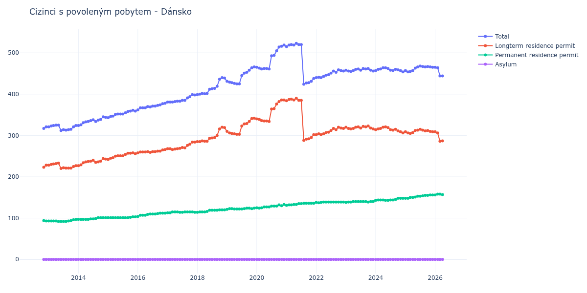

# Dánsko

## Souhrnné statistiky (Min/Max pro rok) / Summary Statistics (Min/Max per year)

| Year   | Total     | Longterm Residence Permit   | Permanent Residence Permit   | Asylum   |
|--------|-----------|-----------------------------|------------------------------|----------|
| 2012   | 317 / 321 | 223 / 228                   | 93 / 94                      | 0 / 0    |
| 2013   | 312 / 325 | 220 / 233                   | 92 / 97                      | 0 / 0    |
| 2014   | 324 / 345 | 227 / 244                   | 97 / 101                     | 0 / 0    |
| 2015   | 343 / 361 | 242 / 258                   | 101 / 103                    | 0 / 0    |
| 2016   | 362 / 378 | 258 / 266                   | 104 / 112                    | 0 / 0    |
| 2017   | 381 / 399 | 266 / 284                   | 113 / 115                    | 0 / 0    |
| 2018   | 399 / 440 | 285 / 320                   | 114 / 120                    | 0 / 0    |
| 2019   | 425 / 466 | 303 / 342                   | 121 / 124                    | 0 / 0    |
| 2020   | 461 / 519 | 334 / 386                   | 124 / 133                    | 0 / 0    |
| 2021   | 424 / 523 | 288 / 390                   | 131 / 136                    | 0 / 0    |
| 2022   | 440 / 459 | 302 / 320                   | 137 / 139                    | 0 / 0    |
| 2023   | 455 / 462 | 316 / 323                   | 138 / 140                    | 0 / 0    |
| 2024   | 454 / 464 | 306 / 321                   | 143 / 148                    | 0 / 0    |
| 2025   | 454 / 468 | 305 / 315                   | 148 / 156                    | 0 / 0    |
| 2026   | 444 / 465 | 286 / 309                   | 156 / 158                    | 0 / 0    |

## Detailní tabulka / Detailed Data Table

| Date     | Total         | Longterm Residence Permit   | Permanent Residence Permit   | Asylum   |
|----------|---------------|-----------------------------|------------------------------|----------|
| **2012** |               |                             |                              |          |
| 11.2012  | 317           | 223                         | 94                           | 0        |
| 12.2012  | 321 (+1.26%)  | 228 (+2.24%)                | 93 (-1.06%)                  | 0        |
| **2013** |               |                             |                              |          |
| 01.2013  | 321 (+0.00%)  | 228 (+0.00%)                | 93 (+0.00%)                  | 0        |
| 02.2013  | 323 (+0.62%)  | 230 (+0.88%)                | 93 (+0.00%)                  | 0        |
| 03.2013  | 324 (+0.31%)  | 231 (+0.43%)                | 93 (+0.00%)                  | 0        |
| 04.2013  | 325 (+0.31%)  | 232 (+0.43%)                | 93 (+0.00%)                  | 0        |
| 05.2013  | 325 (+0.00%)  | 233 (+0.43%)                | 92 (-1.08%)                  | 0        |
| 06.2013  | 312 (-4.00%)  | 220 (-5.58%)                | 92 (+0.00%)                  | 0        |
| 07.2013  | 314 (+0.64%)  | 222 (+0.91%)                | 92 (+0.00%)                  | 0        |
| 08.2013  | 313 (-0.32%)  | 221 (-0.45%)                | 92 (+0.00%)                  | 0        |
| 09.2013  | 314 (+0.32%)  | 221 (+0.00%)                | 93 (+1.09%)                  | 0        |
| 10.2013  | 315 (+0.32%)  | 221 (+0.00%)                | 94 (+1.08%)                  | 0        |
| 11.2013  | 321 (+1.90%)  | 225 (+1.81%)                | 96 (+2.13%)                  | 0        |
| 12.2013  | 324 (+0.93%)  | 227 (+0.89%)                | 97 (+1.04%)                  | 0        |
| **2014** |               |                             |                              |          |
| 01.2014  | 324 (+0.00%)  | 227 (+0.00%)                | 97 (+0.00%)                  | 0        |
| 02.2014  | 326 (+0.62%)  | 229 (+0.88%)                | 97 (+0.00%)                  | 0        |
| 03.2014  | 331 (+1.53%)  | 234 (+2.18%)                | 97 (+0.00%)                  | 0        |
| 04.2014  | 333 (+0.60%)  | 236 (+0.85%)                | 97 (+0.00%)                  | 0        |
| 05.2014  | 334 (+0.30%)  | 237 (+0.42%)                | 97 (+0.00%)                  | 0        |
| 06.2014  | 336 (+0.60%)  | 238 (+0.42%)                | 98 (+1.03%)                  | 0        |
| 07.2014  | 338 (+0.60%)  | 240 (+0.84%)                | 98 (+0.00%)                  | 0        |
| 08.2014  | 334 (-1.18%)  | 235 (-2.08%)                | 99 (+1.02%)                  | 0        |
| 09.2014  | 337 (+0.90%)  | 236 (+0.43%)                | 101 (+2.02%)                 | 0        |
| 10.2014  | 339 (+0.59%)  | 238 (+0.85%)                | 101 (+0.00%)                 | 0        |
| 11.2014  | 345 (+1.77%)  | 244 (+2.52%)                | 101 (+0.00%)                 | 0        |
| 12.2014  | 344 (-0.29%)  | 243 (-0.41%)                | 101 (+0.00%)                 | 0        |
| **2015** |               |                             |                              |          |
| 01.2015  | 343 (-0.29%)  | 242 (-0.41%)                | 101 (+0.00%)                 | 0        |
| 02.2015  | 346 (+0.87%)  | 245 (+1.24%)                | 101 (+0.00%)                 | 0        |
| 03.2015  | 347 (+0.29%)  | 246 (+0.41%)                | 101 (+0.00%)                 | 0        |
| 04.2015  | 351 (+1.15%)  | 250 (+1.63%)                | 101 (+0.00%)                 | 0        |
| 05.2015  | 352 (+0.28%)  | 251 (+0.40%)                | 101 (+0.00%)                 | 0        |
| 06.2015  | 352 (+0.00%)  | 251 (+0.00%)                | 101 (+0.00%)                 | 0        |
| 07.2015  | 352 (+0.00%)  | 251 (+0.00%)                | 101 (+0.00%)                 | 0        |
| 08.2015  | 355 (+0.85%)  | 254 (+1.20%)                | 101 (+0.00%)                 | 0        |
| 09.2015  | 358 (+0.85%)  | 257 (+1.18%)                | 101 (+0.00%)                 | 0        |
| 10.2015  | 359 (+0.28%)  | 257 (+0.00%)                | 102 (+0.99%)                 | 0        |
| 11.2015  | 361 (+0.56%)  | 258 (+0.39%)                | 103 (+0.98%)                 | 0        |
| 12.2015  | 359 (-0.55%)  | 256 (-0.78%)                | 103 (+0.00%)                 | 0        |
| **2016** |               |                             |                              |          |
| 01.2016  | 362 (+0.84%)  | 258 (+0.78%)                | 104 (+0.97%)                 | 0        |
| 02.2016  | 367 (+1.38%)  | 260 (+0.78%)                | 107 (+2.88%)                 | 0        |
| 03.2016  | 367 (+0.00%)  | 260 (+0.00%)                | 107 (+0.00%)                 | 0        |
| 04.2016  | 367 (+0.00%)  | 260 (+0.00%)                | 107 (+0.00%)                 | 0        |
| 05.2016  | 370 (+0.82%)  | 261 (+0.38%)                | 109 (+1.87%)                 | 0        |
| 06.2016  | 369 (-0.27%)  | 259 (-0.77%)                | 110 (+0.92%)                 | 0        |
| 07.2016  | 371 (+0.54%)  | 261 (+0.77%)                | 110 (+0.00%)                 | 0        |
| 08.2016  | 371 (+0.00%)  | 261 (+0.00%)                | 110 (+0.00%)                 | 0        |
| 09.2016  | 373 (+0.54%)  | 262 (+0.38%)                | 111 (+0.91%)                 | 0        |
| 10.2016  | 374 (+0.27%)  | 262 (+0.00%)                | 112 (+0.90%)                 | 0        |
| 11.2016  | 377 (+0.80%)  | 265 (+1.15%)                | 112 (+0.00%)                 | 0        |
| 12.2016  | 378 (+0.27%)  | 266 (+0.38%)                | 112 (+0.00%)                 | 0        |
| **2017** |               |                             |                              |          |
| 01.2017  | 381 (+0.79%)  | 268 (+0.75%)                | 113 (+0.89%)                 | 0        |
| 02.2017  | 381 (+0.00%)  | 268 (+0.00%)                | 113 (+0.00%)                 | 0        |
| 03.2017  | 381 (+0.00%)  | 266 (-0.75%)                | 115 (+1.77%)                 | 0        |
| 04.2017  | 382 (+0.26%)  | 267 (+0.38%)                | 115 (+0.00%)                 | 0        |
| 05.2017  | 383 (+0.26%)  | 268 (+0.37%)                | 115 (+0.00%)                 | 0        |
| 06.2017  | 383 (+0.00%)  | 269 (+0.37%)                | 114 (-0.87%)                 | 0        |
| 07.2017  | 385 (+0.52%)  | 271 (+0.74%)                | 114 (+0.00%)                 | 0        |
| 08.2017  | 385 (+0.00%)  | 270 (-0.37%)                | 115 (+0.88%)                 | 0        |
| 09.2017  | 391 (+1.56%)  | 276 (+2.22%)                | 115 (+0.00%)                 | 0        |
| 10.2017  | 394 (+0.77%)  | 279 (+1.09%)                | 115 (+0.00%)                 | 0        |
| 11.2017  | 399 (+1.27%)  | 284 (+1.79%)                | 115 (+0.00%)                 | 0        |
| 12.2017  | 398 (-0.25%)  | 284 (+0.00%)                | 114 (-0.87%)                 | 0        |
| **2018** |               |                             |                              |          |
| 01.2018  | 399 (+0.25%)  | 285 (+0.35%)                | 114 (+0.00%)                 | 0        |
| 02.2018  | 400 (+0.25%)  | 285 (+0.00%)                | 115 (+0.88%)                 | 0        |
| 03.2018  | 402 (+0.50%)  | 287 (+0.70%)                | 115 (+0.00%)                 | 0        |
| 04.2018  | 401 (-0.25%)  | 286 (-0.35%)                | 115 (+0.00%)                 | 0        |
| 05.2018  | 402 (+0.25%)  | 286 (+0.00%)                | 116 (+0.87%)                 | 0        |
| 06.2018  | 412 (+2.49%)  | 293 (+2.45%)                | 119 (+2.59%)                 | 0        |
| 07.2018  | 413 (+0.24%)  | 294 (+0.34%)                | 119 (+0.00%)                 | 0        |
| 08.2018  | 414 (+0.24%)  | 295 (+0.34%)                | 119 (+0.00%)                 | 0        |
| 09.2018  | 419 (+1.21%)  | 300 (+1.69%)                | 119 (+0.00%)                 | 0        |
| 10.2018  | 436 (+4.06%)  | 316 (+5.33%)                | 120 (+0.84%)                 | 0        |
| 11.2018  | 440 (+0.92%)  | 320 (+1.27%)                | 120 (+0.00%)                 | 0        |
| 12.2018  | 439 (-0.23%)  | 319 (-0.31%)                | 120 (+0.00%)                 | 0        |
| **2019** |               |                             |                              |          |
| 01.2019  | 431 (-1.82%)  | 310 (-2.82%)                | 121 (+0.83%)                 | 0        |
| 02.2019  | 429 (-0.46%)  | 306 (-1.29%)                | 123 (+1.65%)                 | 0        |
| 03.2019  | 428 (-0.23%)  | 305 (-0.33%)                | 123 (+0.00%)                 | 0        |
| 04.2019  | 426 (-0.47%)  | 304 (-0.33%)                | 122 (-0.81%)                 | 0        |
| 05.2019  | 425 (-0.23%)  | 303 (-0.33%)                | 122 (+0.00%)                 | 0        |
| 06.2019  | 425 (+0.00%)  | 303 (+0.00%)                | 122 (+0.00%)                 | 0        |
| 07.2019  | 445 (+4.71%)  | 323 (+6.60%)                | 122 (+0.00%)                 | 0        |
| 08.2019  | 451 (+1.35%)  | 328 (+1.55%)                | 123 (+0.82%)                 | 0        |
| 09.2019  | 453 (+0.44%)  | 329 (+0.30%)                | 124 (+0.81%)                 | 0        |
| 10.2019  | 458 (+1.10%)  | 334 (+1.52%)                | 124 (+0.00%)                 | 0        |
| 11.2019  | 464 (+1.31%)  | 341 (+2.10%)                | 123 (-0.81%)                 | 0        |
| 12.2019  | 466 (+0.43%)  | 342 (+0.29%)                | 124 (+0.81%)                 | 0        |
| **2020** |               |                             |                              |          |
| 01.2020  | 465 (-0.21%)  | 340 (-0.58%)                | 125 (+0.81%)                 | 0        |
| 02.2020  | 463 (-0.43%)  | 339 (-0.29%)                | 124 (-0.80%)                 | 0        |
| 03.2020  | 461 (-0.43%)  | 336 (-0.88%)                | 125 (+0.81%)                 | 0        |
| 04.2020  | 462 (+0.22%)  | 335 (-0.30%)                | 127 (+1.60%)                 | 0        |
| 05.2020  | 462 (+0.00%)  | 335 (+0.00%)                | 127 (+0.00%)                 | 0        |
| 06.2020  | 461 (-0.22%)  | 334 (-0.30%)                | 127 (+0.00%)                 | 0        |
| 07.2020  | 493 (+6.94%)  | 364 (+8.98%)                | 129 (+1.57%)                 | 0        |
| 08.2020  | 494 (+0.20%)  | 365 (+0.27%)                | 129 (+0.00%)                 | 0        |
| 09.2020  | 505 (+2.23%)  | 376 (+3.01%)                | 129 (+0.00%)                 | 0        |
| 10.2020  | 514 (+1.78%)  | 382 (+1.60%)                | 132 (+2.33%)                 | 0        |
| 11.2020  | 516 (+0.39%)  | 386 (+1.05%)                | 130 (-1.52%)                 | 0        |
| 12.2020  | 519 (+0.58%)  | 386 (+0.00%)                | 133 (+2.31%)                 | 0        |
| **2021** |               |                             |                              |          |
| 01.2021  | 515 (-0.77%)  | 384 (-0.52%)                | 131 (-1.50%)                 | 0        |
| 02.2021  | 519 (+0.78%)  | 387 (+0.78%)                | 132 (+0.76%)                 | 0        |
| 03.2021  | 520 (+0.19%)  | 388 (+0.26%)                | 132 (+0.00%)                 | 0        |
| 04.2021  | 519 (-0.19%)  | 386 (-0.52%)                | 133 (+0.76%)                 | 0        |
| 05.2021  | 523 (+0.77%)  | 390 (+1.04%)                | 133 (+0.00%)                 | 0        |
| 06.2021  | 520 (-0.57%)  | 385 (-1.28%)                | 135 (+1.50%)                 | 0        |
| 07.2021  | 520 (+0.00%)  | 385 (+0.00%)                | 135 (+0.00%)                 | 0        |
| 08.2021  | 424 (-18.46%) | 288 (-25.19%)               | 136 (+0.74%)                 | 0        |
| 09.2021  | 427 (+0.71%)  | 291 (+1.04%)                | 136 (+0.00%)                 | 0        |
| 10.2021  | 428 (+0.23%)  | 292 (+0.34%)                | 136 (+0.00%)                 | 0        |
| 11.2021  | 431 (+0.70%)  | 295 (+1.03%)                | 136 (+0.00%)                 | 0        |
| 12.2021  | 438 (+1.62%)  | 302 (+2.37%)                | 136 (+0.00%)                 | 0        |
| **2022** |               |                             |                              |          |
| 01.2022  | 440 (+0.46%)  | 302 (+0.00%)                | 138 (+1.47%)                 | 0        |
| 02.2022  | 441 (+0.23%)  | 304 (+0.66%)                | 137 (-0.72%)                 | 0        |
| 03.2022  | 440 (-0.23%)  | 302 (-0.66%)                | 138 (+0.73%)                 | 0        |
| 04.2022  | 443 (+0.68%)  | 304 (+0.66%)                | 139 (+0.72%)                 | 0        |
| 05.2022  | 446 (+0.68%)  | 307 (+0.99%)                | 139 (+0.00%)                 | 0        |
| 06.2022  | 447 (+0.22%)  | 308 (+0.33%)                | 139 (+0.00%)                 | 0        |
| 07.2022  | 451 (+0.89%)  | 312 (+1.30%)                | 139 (+0.00%)                 | 0        |
| 08.2022  | 456 (+1.11%)  | 317 (+1.60%)                | 139 (+0.00%)                 | 0        |
| 09.2022  | 453 (-0.66%)  | 314 (-0.95%)                | 139 (+0.00%)                 | 0        |
| 10.2022  | 459 (+1.32%)  | 320 (+1.91%)                | 139 (+0.00%)                 | 0        |
| 11.2022  | 457 (-0.44%)  | 318 (-0.62%)                | 139 (+0.00%)                 | 0        |
| 12.2022  | 456 (-0.22%)  | 317 (-0.31%)                | 139 (+0.00%)                 | 0        |
| **2023** |               |                             |                              |          |
| 01.2023  | 458 (+0.44%)  | 320 (+0.95%)                | 138 (-0.72%)                 | 0        |
| 02.2023  | 456 (-0.44%)  | 317 (-0.94%)                | 139 (+0.72%)                 | 0        |
| 03.2023  | 455 (-0.22%)  | 316 (-0.32%)                | 139 (+0.00%)                 | 0        |
| 04.2023  | 457 (+0.44%)  | 317 (+0.32%)                | 140 (+0.72%)                 | 0        |
| 05.2023  | 460 (+0.66%)  | 320 (+0.95%)                | 140 (+0.00%)                 | 0        |
| 06.2023  | 461 (+0.22%)  | 321 (+0.31%)                | 140 (+0.00%)                 | 0        |
| 07.2023  | 458 (-0.65%)  | 318 (-0.93%)                | 140 (+0.00%)                 | 0        |
| 08.2023  | 462 (+0.87%)  | 322 (+1.26%)                | 140 (+0.00%)                 | 0        |
| 09.2023  | 461 (-0.22%)  | 321 (-0.31%)                | 140 (+0.00%)                 | 0        |
| 10.2023  | 462 (+0.22%)  | 323 (+0.62%)                | 139 (-0.71%)                 | 0        |
| 11.2023  | 458 (-0.87%)  | 318 (-1.55%)                | 140 (+0.72%)                 | 0        |
| 12.2023  | 456 (-0.44%)  | 316 (-0.63%)                | 140 (+0.00%)                 | 0        |
| **2024** |               |                             |                              |          |
| 01.2024  | 457 (+0.22%)  | 314 (-0.63%)                | 143 (+2.14%)                 | 0        |
| 02.2024  | 460 (+0.66%)  | 316 (+0.64%)                | 144 (+0.70%)                 | 0        |
| 03.2024  | 461 (+0.22%)  | 317 (+0.32%)                | 144 (+0.00%)                 | 0        |
| 04.2024  | 464 (+0.65%)  | 320 (+0.95%)                | 144 (+0.00%)                 | 0        |
| 05.2024  | 464 (+0.00%)  | 321 (+0.31%)                | 143 (-0.69%)                 | 0        |
| 06.2024  | 462 (-0.43%)  | 319 (-0.62%)                | 143 (+0.00%)                 | 0        |
| 07.2024  | 458 (-0.87%)  | 314 (-1.57%)                | 144 (+0.70%)                 | 0        |
| 08.2024  | 457 (-0.22%)  | 313 (-0.32%)                | 144 (+0.00%)                 | 0        |
| 09.2024  | 460 (+0.66%)  | 315 (+0.64%)                | 145 (+0.69%)                 | 0        |
| 10.2024  | 459 (-0.22%)  | 311 (-1.27%)                | 148 (+2.07%)                 | 0        |
| 11.2024  | 457 (-0.44%)  | 309 (-0.64%)                | 148 (+0.00%)                 | 0        |
| 12.2024  | 454 (-0.66%)  | 306 (-0.97%)                | 148 (+0.00%)                 | 0        |
| **2025** |               |                             |                              |          |
| 01.2025  | 457 (+0.66%)  | 309 (+0.98%)                | 148 (+0.00%)                 | 0        |
| 02.2025  | 454 (-0.66%)  | 306 (-0.97%)                | 148 (+0.00%)                 | 0        |
| 03.2025  | 455 (+0.22%)  | 305 (-0.33%)                | 150 (+1.35%)                 | 0        |
| 04.2025  | 457 (+0.44%)  | 307 (+0.66%)                | 150 (+0.00%)                 | 0        |
| 05.2025  | 463 (+1.31%)  | 312 (+1.63%)                | 151 (+0.67%)                 | 0        |
| 06.2025  | 466 (+0.65%)  | 313 (+0.32%)                | 153 (+1.32%)                 | 0        |
| 07.2025  | 468 (+0.43%)  | 315 (+0.64%)                | 153 (+0.00%)                 | 0        |
| 08.2025  | 467 (-0.21%)  | 313 (-0.63%)                | 154 (+0.65%)                 | 0        |
| 09.2025  | 466 (-0.21%)  | 311 (-0.64%)                | 155 (+0.65%)                 | 0        |
| 10.2025  | 467 (+0.21%)  | 312 (+0.32%)                | 155 (+0.00%)                 | 0        |
| 11.2025  | 466 (-0.21%)  | 310 (-0.64%)                | 156 (+0.65%)                 | 0        |
| 12.2025  | 465 (-0.21%)  | 309 (-0.32%)                | 156 (+0.00%)                 | 0        |
| **2026** |               |                             |                              |          |
| 01.2026  | 465 (+0.00%)  | 309 (+0.00%)                | 156 (+0.00%)                 | 0        |
| 02.2026  | 464 (-0.22%)  | 306 (-0.97%)                | 158 (+1.28%)                 | 0        |
| 03.2026  | 444 (-4.31%)  | 286 (-6.54%)                | 158 (+0.00%)                 | 0        |
| 04.2026  | 444 (+0.00%)  | 287 (+0.35%)                | 157 (-0.63%)                 | 0        |
