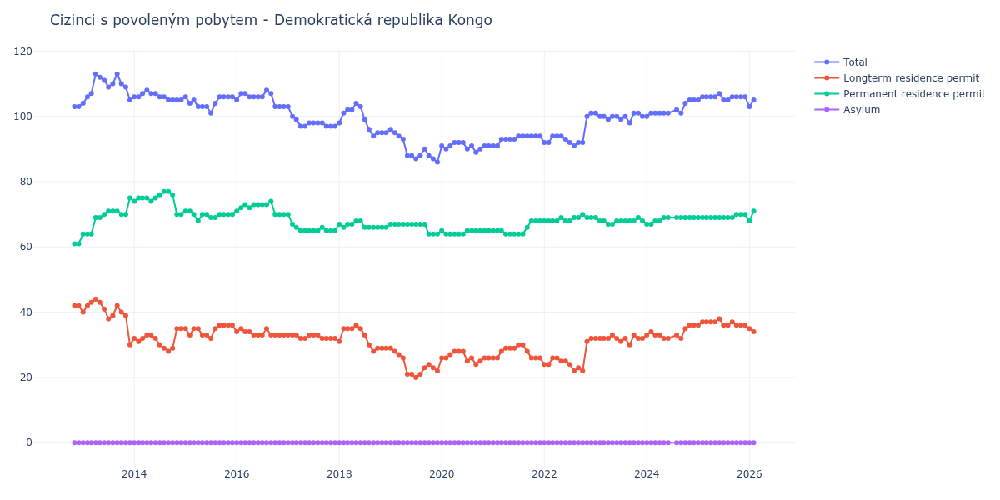

# Demokratická republika Kongo

## Souhrnné statistiky (Min/Max pro rok) / Summary Statistics (Min/Max per year)

| Year   | Total     | Longterm Residence Permit   | Permanent Residence Permit   | Asylum   |
|--------|-----------|-----------------------------|------------------------------|----------|
| 2012   | 103 / 103 | 42 / 42                     | 61 / 61                      | 0 / 0    |
| 2013   | 104 / 113 | 30 / 44                     | 64 / 75                      | 0 / 0    |
| 2014   | 105 / 108 | 28 / 35                     | 70 / 77                      | 0 / 0    |
| 2015   | 101 / 106 | 32 / 36                     | 68 / 71                      | 0 / 0    |
| 2016   | 103 / 108 | 33 / 35                     | 70 / 74                      | 0 / 0    |
| 2017   | 97 / 103  | 32 / 33                     | 65 / 70                      | 0 / 0    |
| 2018   | 94 / 104  | 28 / 36                     | 66 / 68                      | 0 / 0    |
| 2019   | 86 / 96   | 20 / 29                     | 64 / 67                      | 0 / 0    |
| 2020   | 89 / 92   | 24 / 28                     | 64 / 65                      | 0 / 0    |
| 2021   | 91 / 94   | 26 / 30                     | 64 / 68                      | 0 / 0    |
| 2022   | 91 / 101  | 22 / 32                     | 68 / 70                      | 0 / 0    |
| 2023   | 98 / 101  | 30 / 33                     | 67 / 69                      | 0 / 0    |
| 2024   | 100 / 105 | 32 / 36                     | 67 / 69                      | 0 / 0    |
| 2025   | 105 / 107 | 36 / 38                     | 69 / 70                      | 0 / 0    |

## Detailní tabulka / Detailed Data Table

| Date     | Total        | Longterm Residence Permit   | Permanent Residence Permit   | Asylum   |
|----------|--------------|-----------------------------|------------------------------|----------|
| **2012** |              |                             |                              |          |
| 11.2012  | 103          | 42                          | 61                           | 0        |
| 12.2012  | 103 (+0.00%) | 42 (+0.00%)                 | 61 (+0.00%)                  | 0        |
| **2013** |              |                             |                              |          |
| 01.2013  | 104 (+0.97%) | 40 (-4.76%)                 | 64 (+4.92%)                  | 0        |
| 02.2013  | 106 (+1.92%) | 42 (+5.00%)                 | 64 (+0.00%)                  | 0        |
| 03.2013  | 107 (+0.94%) | 43 (+2.38%)                 | 64 (+0.00%)                  | 0        |
| 04.2013  | 113 (+5.61%) | 44 (+2.33%)                 | 69 (+7.81%)                  | 0        |
| 05.2013  | 112 (-0.88%) | 43 (-2.27%)                 | 69 (+0.00%)                  | 0        |
| 06.2013  | 111 (-0.89%) | 41 (-4.65%)                 | 70 (+1.45%)                  | 0        |
| 07.2013  | 109 (-1.80%) | 38 (-7.32%)                 | 71 (+1.43%)                  | 0        |
| 08.2013  | 110 (+0.92%) | 39 (+2.63%)                 | 71 (+0.00%)                  | 0        |
| 09.2013  | 113 (+2.73%) | 42 (+7.69%)                 | 71 (+0.00%)                  | 0        |
| 10.2013  | 110 (-2.65%) | 40 (-4.76%)                 | 70 (-1.41%)                  | 0        |
| 11.2013  | 109 (-0.91%) | 39 (-2.50%)                 | 70 (+0.00%)                  | 0        |
| 12.2013  | 105 (-3.67%) | 30 (-23.08%)                | 75 (+7.14%)                  | 0        |
| **2014** |              |                             |                              |          |
| 01.2014  | 106 (+0.95%) | 32 (+6.67%)                 | 74 (-1.33%)                  | 0        |
| 02.2014  | 106 (+0.00%) | 31 (-3.12%)                 | 75 (+1.35%)                  | 0        |
| 03.2014  | 107 (+0.94%) | 32 (+3.23%)                 | 75 (+0.00%)                  | 0        |
| 04.2014  | 108 (+0.93%) | 33 (+3.12%)                 | 75 (+0.00%)                  | 0        |
| 05.2014  | 107 (-0.93%) | 33 (+0.00%)                 | 74 (-1.33%)                  | 0        |
| 06.2014  | 107 (+0.00%) | 32 (-3.03%)                 | 75 (+1.35%)                  | 0        |
| 07.2014  | 106 (-0.93%) | 30 (-6.25%)                 | 76 (+1.33%)                  | 0        |
| 08.2014  | 106 (+0.00%) | 29 (-3.33%)                 | 77 (+1.32%)                  | 0        |
| 09.2014  | 105 (-0.94%) | 28 (-3.45%)                 | 77 (+0.00%)                  | 0        |
| 10.2014  | 105 (+0.00%) | 29 (+3.57%)                 | 76 (-1.30%)                  | 0        |
| 11.2014  | 105 (+0.00%) | 35 (+20.69%)                | 70 (-7.89%)                  | 0        |
| 12.2014  | 105 (+0.00%) | 35 (+0.00%)                 | 70 (+0.00%)                  | 0        |
| **2015** |              |                             |                              |          |
| 01.2015  | 106 (+0.95%) | 35 (+0.00%)                 | 71 (+1.43%)                  | 0        |
| 02.2015  | 104 (-1.89%) | 33 (-5.71%)                 | 71 (+0.00%)                  | 0        |
| 03.2015  | 105 (+0.96%) | 35 (+6.06%)                 | 70 (-1.41%)                  | 0        |
| 04.2015  | 103 (-1.90%) | 35 (+0.00%)                 | 68 (-2.86%)                  | 0        |
| 05.2015  | 103 (+0.00%) | 33 (-5.71%)                 | 70 (+2.94%)                  | 0        |
| 06.2015  | 103 (+0.00%) | 33 (+0.00%)                 | 70 (+0.00%)                  | 0        |
| 07.2015  | 101 (-1.94%) | 32 (-3.03%)                 | 69 (-1.43%)                  | 0        |
| 08.2015  | 104 (+2.97%) | 35 (+9.38%)                 | 69 (+0.00%)                  | 0        |
| 09.2015  | 106 (+1.92%) | 36 (+2.86%)                 | 70 (+1.45%)                  | 0        |
| 10.2015  | 106 (+0.00%) | 36 (+0.00%)                 | 70 (+0.00%)                  | 0        |
| 11.2015  | 106 (+0.00%) | 36 (+0.00%)                 | 70 (+0.00%)                  | 0        |
| 12.2015  | 106 (+0.00%) | 36 (+0.00%)                 | 70 (+0.00%)                  | 0        |
| **2016** |              |                             |                              |          |
| 01.2016  | 105 (-0.94%) | 34 (-5.56%)                 | 71 (+1.43%)                  | 0        |
| 02.2016  | 107 (+1.90%) | 35 (+2.94%)                 | 72 (+1.41%)                  | 0        |
| 03.2016  | 107 (+0.00%) | 34 (-2.86%)                 | 73 (+1.39%)                  | 0        |
| 04.2016  | 106 (-0.93%) | 34 (+0.00%)                 | 72 (-1.37%)                  | 0        |
| 05.2016  | 106 (+0.00%) | 33 (-2.94%)                 | 73 (+1.39%)                  | 0        |
| 06.2016  | 106 (+0.00%) | 33 (+0.00%)                 | 73 (+0.00%)                  | 0        |
| 07.2016  | 106 (+0.00%) | 33 (+0.00%)                 | 73 (+0.00%)                  | 0        |
| 08.2016  | 108 (+1.89%) | 35 (+6.06%)                 | 73 (+0.00%)                  | 0        |
| 09.2016  | 107 (-0.93%) | 33 (-5.71%)                 | 74 (+1.37%)                  | 0        |
| 10.2016  | 103 (-3.74%) | 33 (+0.00%)                 | 70 (-5.41%)                  | 0        |
| 11.2016  | 103 (+0.00%) | 33 (+0.00%)                 | 70 (+0.00%)                  | 0        |
| 12.2016  | 103 (+0.00%) | 33 (+0.00%)                 | 70 (+0.00%)                  | 0        |
| **2017** |              |                             |                              |          |
| 01.2017  | 103 (+0.00%) | 33 (+0.00%)                 | 70 (+0.00%)                  | 0        |
| 02.2017  | 100 (-2.91%) | 33 (+0.00%)                 | 67 (-4.29%)                  | 0        |
| 03.2017  | 99 (-1.00%)  | 33 (+0.00%)                 | 66 (-1.49%)                  | 0        |
| 04.2017  | 97 (-2.02%)  | 32 (-3.03%)                 | 65 (-1.52%)                  | 0        |
| 05.2017  | 97 (+0.00%)  | 32 (+0.00%)                 | 65 (+0.00%)                  | 0        |
| 06.2017  | 98 (+1.03%)  | 33 (+3.12%)                 | 65 (+0.00%)                  | 0        |
| 07.2017  | 98 (+0.00%)  | 33 (+0.00%)                 | 65 (+0.00%)                  | 0        |
| 08.2017  | 98 (+0.00%)  | 33 (+0.00%)                 | 65 (+0.00%)                  | 0        |
| 09.2017  | 98 (+0.00%)  | 32 (-3.03%)                 | 66 (+1.54%)                  | 0        |
| 10.2017  | 97 (-1.02%)  | 32 (+0.00%)                 | 65 (-1.52%)                  | 0        |
| 11.2017  | 97 (+0.00%)  | 32 (+0.00%)                 | 65 (+0.00%)                  | 0        |
| 12.2017  | 97 (+0.00%)  | 32 (+0.00%)                 | 65 (+0.00%)                  | 0        |
| **2018** |              |                             |                              |          |
| 01.2018  | 98 (+1.03%)  | 31 (-3.12%)                 | 67 (+3.08%)                  | 0        |
| 02.2018  | 101 (+3.06%) | 35 (+12.90%)                | 66 (-1.49%)                  | 0        |
| 03.2018  | 102 (+0.99%) | 35 (+0.00%)                 | 67 (+1.52%)                  | 0        |
| 04.2018  | 102 (+0.00%) | 35 (+0.00%)                 | 67 (+0.00%)                  | 0        |
| 05.2018  | 104 (+1.96%) | 36 (+2.86%)                 | 68 (+1.49%)                  | 0        |
| 06.2018  | 103 (-0.96%) | 35 (-2.78%)                 | 68 (+0.00%)                  | 0        |
| 07.2018  | 99 (-3.88%)  | 33 (-5.71%)                 | 66 (-2.94%)                  | 0        |
| 08.2018  | 96 (-3.03%)  | 30 (-9.09%)                 | 66 (+0.00%)                  | 0        |
| 09.2018  | 94 (-2.08%)  | 28 (-6.67%)                 | 66 (+0.00%)                  | 0        |
| 10.2018  | 95 (+1.06%)  | 29 (+3.57%)                 | 66 (+0.00%)                  | 0        |
| 11.2018  | 95 (+0.00%)  | 29 (+0.00%)                 | 66 (+0.00%)                  | 0        |
| 12.2018  | 95 (+0.00%)  | 29 (+0.00%)                 | 66 (+0.00%)                  | 0        |
| **2019** |              |                             |                              |          |
| 01.2019  | 96 (+1.05%)  | 29 (+0.00%)                 | 67 (+1.52%)                  | 0        |
| 02.2019  | 95 (-1.04%)  | 28 (-3.45%)                 | 67 (+0.00%)                  | 0        |
| 03.2019  | 94 (-1.05%)  | 27 (-3.57%)                 | 67 (+0.00%)                  | 0        |
| 04.2019  | 93 (-1.06%)  | 26 (-3.70%)                 | 67 (+0.00%)                  | 0        |
| 05.2019  | 88 (-5.38%)  | 21 (-19.23%)                | 67 (+0.00%)                  | 0        |
| 06.2019  | 88 (+0.00%)  | 21 (+0.00%)                 | 67 (+0.00%)                  | 0        |
| 07.2019  | 87 (-1.14%)  | 20 (-4.76%)                 | 67 (+0.00%)                  | 0        |
| 08.2019  | 88 (+1.15%)  | 21 (+5.00%)                 | 67 (+0.00%)                  | 0        |
| 09.2019  | 90 (+2.27%)  | 23 (+9.52%)                 | 67 (+0.00%)                  | 0        |
| 10.2019  | 88 (-2.22%)  | 24 (+4.35%)                 | 64 (-4.48%)                  | 0        |
| 11.2019  | 87 (-1.14%)  | 23 (-4.17%)                 | 64 (+0.00%)                  | 0        |
| 12.2019  | 86 (-1.15%)  | 22 (-4.35%)                 | 64 (+0.00%)                  | 0        |
| **2020** |              |                             |                              |          |
| 01.2020  | 91 (+5.81%)  | 26 (+18.18%)                | 65 (+1.56%)                  | 0        |
| 02.2020  | 90 (-1.10%)  | 26 (+0.00%)                 | 64 (-1.54%)                  | 0        |
| 03.2020  | 91 (+1.11%)  | 27 (+3.85%)                 | 64 (+0.00%)                  | 0        |
| 04.2020  | 92 (+1.10%)  | 28 (+3.70%)                 | 64 (+0.00%)                  | 0        |
| 05.2020  | 92 (+0.00%)  | 28 (+0.00%)                 | 64 (+0.00%)                  | 0        |
| 06.2020  | 92 (+0.00%)  | 28 (+0.00%)                 | 64 (+0.00%)                  | 0        |
| 07.2020  | 90 (-2.17%)  | 25 (-10.71%)                | 65 (+1.56%)                  | 0        |
| 08.2020  | 91 (+1.11%)  | 26 (+4.00%)                 | 65 (+0.00%)                  | 0        |
| 09.2020  | 89 (-2.20%)  | 24 (-7.69%)                 | 65 (+0.00%)                  | 0        |
| 10.2020  | 90 (+1.12%)  | 25 (+4.17%)                 | 65 (+0.00%)                  | 0        |
| 11.2020  | 91 (+1.11%)  | 26 (+4.00%)                 | 65 (+0.00%)                  | 0        |
| 12.2020  | 91 (+0.00%)  | 26 (+0.00%)                 | 65 (+0.00%)                  | 0        |
| **2021** |              |                             |                              |          |
| 01.2021  | 91 (+0.00%)  | 26 (+0.00%)                 | 65 (+0.00%)                  | 0        |
| 02.2021  | 91 (+0.00%)  | 26 (+0.00%)                 | 65 (+0.00%)                  | 0        |
| 03.2021  | 93 (+2.20%)  | 28 (+7.69%)                 | 65 (+0.00%)                  | 0        |
| 04.2021  | 93 (+0.00%)  | 29 (+3.57%)                 | 64 (-1.54%)                  | 0        |
| 05.2021  | 93 (+0.00%)  | 29 (+0.00%)                 | 64 (+0.00%)                  | 0        |
| 06.2021  | 93 (+0.00%)  | 29 (+0.00%)                 | 64 (+0.00%)                  | 0        |
| 07.2021  | 94 (+1.08%)  | 30 (+3.45%)                 | 64 (+0.00%)                  | 0        |
| 08.2021  | 94 (+0.00%)  | 30 (+0.00%)                 | 64 (+0.00%)                  | 0        |
| 09.2021  | 94 (+0.00%)  | 28 (-6.67%)                 | 66 (+3.12%)                  | 0        |
| 10.2021  | 94 (+0.00%)  | 26 (-7.14%)                 | 68 (+3.03%)                  | 0        |
| 11.2021  | 94 (+0.00%)  | 26 (+0.00%)                 | 68 (+0.00%)                  | 0        |
| 12.2021  | 94 (+0.00%)  | 26 (+0.00%)                 | 68 (+0.00%)                  | 0        |
| **2022** |              |                             |                              |          |
| 01.2022  | 92 (-2.13%)  | 24 (-7.69%)                 | 68 (+0.00%)                  | 0        |
| 02.2022  | 92 (+0.00%)  | 24 (+0.00%)                 | 68 (+0.00%)                  | 0        |
| 03.2022  | 94 (+2.17%)  | 26 (+8.33%)                 | 68 (+0.00%)                  | 0        |
| 04.2022  | 94 (+0.00%)  | 26 (+0.00%)                 | 68 (+0.00%)                  | 0        |
| 05.2022  | 94 (+0.00%)  | 25 (-3.85%)                 | 69 (+1.47%)                  | 0        |
| 06.2022  | 93 (-1.06%)  | 25 (+0.00%)                 | 68 (-1.45%)                  | 0        |
| 07.2022  | 92 (-1.08%)  | 24 (-4.00%)                 | 68 (+0.00%)                  | 0        |
| 08.2022  | 91 (-1.09%)  | 22 (-8.33%)                 | 69 (+1.47%)                  | 0        |
| 09.2022  | 92 (+1.10%)  | 23 (+4.55%)                 | 69 (+0.00%)                  | 0        |
| 10.2022  | 92 (+0.00%)  | 22 (-4.35%)                 | 70 (+1.45%)                  | 0        |
| 11.2022  | 100 (+8.70%) | 31 (+40.91%)                | 69 (-1.43%)                  | 0        |
| 12.2022  | 101 (+1.00%) | 32 (+3.23%)                 | 69 (+0.00%)                  | 0        |
| **2023** |              |                             |                              |          |
| 01.2023  | 101 (+0.00%) | 32 (+0.00%)                 | 69 (+0.00%)                  | 0        |
| 02.2023  | 100 (-0.99%) | 32 (+0.00%)                 | 68 (-1.45%)                  | 0        |
| 03.2023  | 100 (+0.00%) | 32 (+0.00%)                 | 68 (+0.00%)                  | 0        |
| 04.2023  | 99 (-1.00%)  | 32 (+0.00%)                 | 67 (-1.47%)                  | 0        |
| 05.2023  | 100 (+1.01%) | 33 (+3.12%)                 | 67 (+0.00%)                  | 0        |
| 06.2023  | 100 (+0.00%) | 32 (-3.03%)                 | 68 (+1.49%)                  | 0        |
| 07.2023  | 99 (-1.00%)  | 31 (-3.12%)                 | 68 (+0.00%)                  | 0        |
| 08.2023  | 100 (+1.01%) | 32 (+3.23%)                 | 68 (+0.00%)                  | 0        |
| 09.2023  | 98 (-2.00%)  | 30 (-6.25%)                 | 68 (+0.00%)                  | 0        |
| 10.2023  | 101 (+3.06%) | 33 (+10.00%)                | 68 (+0.00%)                  | 0        |
| 11.2023  | 101 (+0.00%) | 32 (-3.03%)                 | 69 (+1.47%)                  | 0        |
| 12.2023  | 100 (-0.99%) | 32 (+0.00%)                 | 68 (-1.45%)                  | 0        |
| **2024** |              |                             |                              |          |
| 01.2024  | 100 (+0.00%) | 33 (+3.12%)                 | 67 (-1.47%)                  | 0        |
| 02.2024  | 101 (+1.00%) | 34 (+3.03%)                 | 67 (+0.00%)                  | 0        |
| 03.2024  | 101 (+0.00%) | 33 (-2.94%)                 | 68 (+1.49%)                  | 0        |
| 04.2024  | 101 (+0.00%) | 33 (+0.00%)                 | 68 (+0.00%)                  | 0        |
| 05.2024  | 101 (+0.00%) | 32 (-3.03%)                 | 69 (+1.47%)                  | 0        |
| 06.2024  | 101 (+0.00%) | 32 (+0.00%)                 | 69 (+0.00%)                  | 0        |
| 08.2024  | 102 (+0.99%) | 33 (+3.12%)                 | 69 (+0.00%)                  | 0        |
| 09.2024  | 101 (-0.98%) | 32 (-3.03%)                 | 69 (+0.00%)                  | 0        |
| 10.2024  | 104 (+2.97%) | 35 (+9.38%)                 | 69 (+0.00%)                  | 0        |
| 11.2024  | 105 (+0.96%) | 36 (+2.86%)                 | 69 (+0.00%)                  | 0        |
| 12.2024  | 105 (+0.00%) | 36 (+0.00%)                 | 69 (+0.00%)                  | 0        |
| **2025** |              |                             |                              |          |
| 01.2025  | 105 (+0.00%) | 36 (+0.00%)                 | 69 (+0.00%)                  | 0        |
| 02.2025  | 106 (+0.95%) | 37 (+2.78%)                 | 69 (+0.00%)                  | 0        |
| 03.2025  | 106 (+0.00%) | 37 (+0.00%)                 | 69 (+0.00%)                  | 0        |
| 04.2025  | 106 (+0.00%) | 37 (+0.00%)                 | 69 (+0.00%)                  | 0        |
| 05.2025  | 106 (+0.00%) | 37 (+0.00%)                 | 69 (+0.00%)                  | 0        |
| 06.2025  | 107 (+0.94%) | 38 (+2.70%)                 | 69 (+0.00%)                  | 0        |
| 07.2025  | 105 (-1.87%) | 36 (-5.26%)                 | 69 (+0.00%)                  | 0        |
| 08.2025  | 105 (+0.00%) | 36 (+0.00%)                 | 69 (+0.00%)                  | 0        |
| 09.2025  | 106 (+0.95%) | 37 (+2.78%)                 | 69 (+0.00%)                  | 0        |
| 10.2025  | 106 (+0.00%) | 36 (-2.70%)                 | 70 (+1.45%)                  | 0        |
| 11.2025  | 106 (+0.00%) | 36 (+0.00%)                 | 70 (+0.00%)                  | 0        |
| 12.2025  | 106 (+0.00%) | 36 (+0.00%)                 | 70 (+0.00%)                  | 0        |
