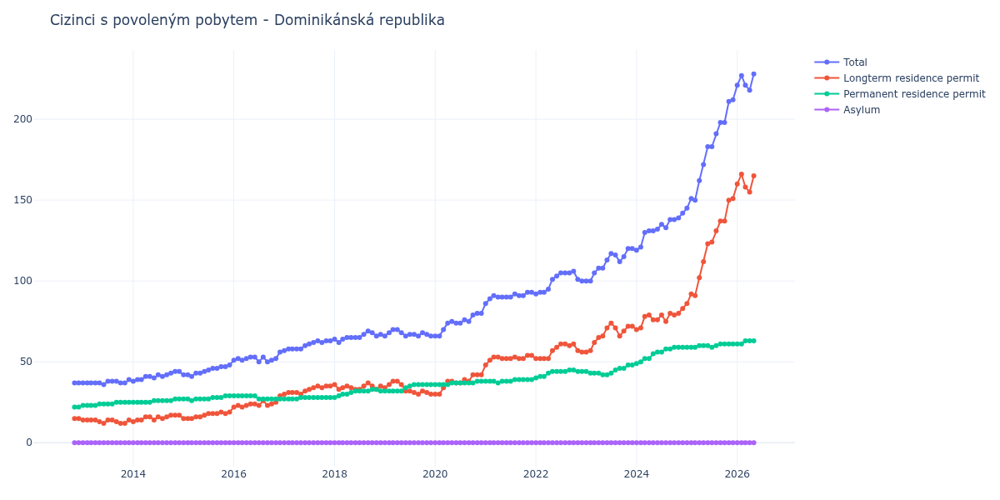

# Dominikánská republika

## Souhrnné statistiky (Min/Max pro rok) / Summary Statistics (Min/Max per year)

| Year   | Total     | Longterm Residence Permit   | Permanent Residence Permit   | Asylum   |
|--------|-----------|-----------------------------|------------------------------|----------|
| 2012   | 37 / 37   | 15 / 15                     | 22 / 22                      | 0 / 0    |
| 2013   | 36 / 39   | 12 / 14                     | 23 / 25                      | 0 / 0    |
| 2014   | 38 / 44   | 13 / 17                     | 25 / 27                      | 0 / 0    |
| 2015   | 41 / 48   | 15 / 19                     | 26 / 29                      | 0 / 0    |
| 2016   | 50 / 56   | 22 / 29                     | 27 / 29                      | 0 / 0    |
| 2017   | 57 / 63   | 30 / 35                     | 27 / 28                      | 0 / 0    |
| 2018   | 62 / 69   | 33 / 37                     | 28 / 33                      | 0 / 0    |
| 2019   | 66 / 70   | 30 / 38                     | 32 / 36                      | 0 / 0    |
| 2020   | 66 / 80   | 30 / 42                     | 36 / 38                      | 0 / 0    |
| 2021   | 86 / 93   | 48 / 54                     | 37 / 39                      | 0 / 0    |
| 2022   | 92 / 106  | 52 / 61                     | 40 / 45                      | 0 / 0    |
| 2023   | 100 / 120 | 56 / 74                     | 42 / 48                      | 0 / 0    |
| 2024   | 119 / 142 | 70 / 83                     | 49 / 59                      | 0 / 0    |
| 2025   | 145 / 212 | 86 / 151                    | 59 / 61                      | 0 / 0    |
| 2026   | 218 / 228 | 155 / 166                   | 61 / 63                      | 0 / 0    |

## Detailní tabulka / Detailed Data Table

| Date     | Total        | Longterm Residence Permit   | Permanent Residence Permit   | Asylum   |
|----------|--------------|-----------------------------|------------------------------|----------|
| **2012** |              |                             |                              |          |
| 11.2012  | 37           | 15                          | 22                           | 0        |
| 12.2012  | 37 (+0.00%)  | 15 (+0.00%)                 | 22 (+0.00%)                  | 0        |
| **2013** |              |                             |                              |          |
| 01.2013  | 37 (+0.00%)  | 14 (-6.67%)                 | 23 (+4.55%)                  | 0        |
| 02.2013  | 37 (+0.00%)  | 14 (+0.00%)                 | 23 (+0.00%)                  | 0        |
| 03.2013  | 37 (+0.00%)  | 14 (+0.00%)                 | 23 (+0.00%)                  | 0        |
| 04.2013  | 37 (+0.00%)  | 14 (+0.00%)                 | 23 (+0.00%)                  | 0        |
| 05.2013  | 37 (+0.00%)  | 13 (-7.14%)                 | 24 (+4.35%)                  | 0        |
| 06.2013  | 36 (-2.70%)  | 12 (-7.69%)                 | 24 (+0.00%)                  | 0        |
| 07.2013  | 38 (+5.56%)  | 14 (+16.67%)                | 24 (+0.00%)                  | 0        |
| 08.2013  | 38 (+0.00%)  | 14 (+0.00%)                 | 24 (+0.00%)                  | 0        |
| 09.2013  | 38 (+0.00%)  | 13 (-7.14%)                 | 25 (+4.17%)                  | 0        |
| 10.2013  | 37 (-2.63%)  | 12 (-7.69%)                 | 25 (+0.00%)                  | 0        |
| 11.2013  | 37 (+0.00%)  | 12 (+0.00%)                 | 25 (+0.00%)                  | 0        |
| 12.2013  | 39 (+5.41%)  | 14 (+16.67%)                | 25 (+0.00%)                  | 0        |
| **2014** |              |                             |                              |          |
| 01.2014  | 38 (-2.56%)  | 13 (-7.14%)                 | 25 (+0.00%)                  | 0        |
| 02.2014  | 39 (+2.63%)  | 14 (+7.69%)                 | 25 (+0.00%)                  | 0        |
| 03.2014  | 39 (+0.00%)  | 14 (+0.00%)                 | 25 (+0.00%)                  | 0        |
| 04.2014  | 41 (+5.13%)  | 16 (+14.29%)                | 25 (+0.00%)                  | 0        |
| 05.2014  | 41 (+0.00%)  | 16 (+0.00%)                 | 25 (+0.00%)                  | 0        |
| 06.2014  | 40 (-2.44%)  | 14 (-12.50%)                | 26 (+4.00%)                  | 0        |
| 07.2014  | 42 (+5.00%)  | 16 (+14.29%)                | 26 (+0.00%)                  | 0        |
| 08.2014  | 41 (-2.38%)  | 15 (-6.25%)                 | 26 (+0.00%)                  | 0        |
| 09.2014  | 42 (+2.44%)  | 16 (+6.67%)                 | 26 (+0.00%)                  | 0        |
| 10.2014  | 43 (+2.38%)  | 17 (+6.25%)                 | 26 (+0.00%)                  | 0        |
| 11.2014  | 44 (+2.33%)  | 17 (+0.00%)                 | 27 (+3.85%)                  | 0        |
| 12.2014  | 44 (+0.00%)  | 17 (+0.00%)                 | 27 (+0.00%)                  | 0        |
| **2015** |              |                             |                              |          |
| 01.2015  | 42 (-4.55%)  | 15 (-11.76%)                | 27 (+0.00%)                  | 0        |
| 02.2015  | 42 (+0.00%)  | 15 (+0.00%)                 | 27 (+0.00%)                  | 0        |
| 03.2015  | 41 (-2.38%)  | 15 (+0.00%)                 | 26 (-3.70%)                  | 0        |
| 04.2015  | 43 (+4.88%)  | 16 (+6.67%)                 | 27 (+3.85%)                  | 0        |
| 05.2015  | 43 (+0.00%)  | 16 (+0.00%)                 | 27 (+0.00%)                  | 0        |
| 06.2015  | 44 (+2.33%)  | 17 (+6.25%)                 | 27 (+0.00%)                  | 0        |
| 07.2015  | 45 (+2.27%)  | 18 (+5.88%)                 | 27 (+0.00%)                  | 0        |
| 08.2015  | 46 (+2.22%)  | 18 (+0.00%)                 | 28 (+3.70%)                  | 0        |
| 09.2015  | 46 (+0.00%)  | 18 (+0.00%)                 | 28 (+0.00%)                  | 0        |
| 10.2015  | 47 (+2.17%)  | 19 (+5.56%)                 | 28 (+0.00%)                  | 0        |
| 11.2015  | 47 (+0.00%)  | 18 (-5.26%)                 | 29 (+3.57%)                  | 0        |
| 12.2015  | 48 (+2.13%)  | 19 (+5.56%)                 | 29 (+0.00%)                  | 0        |
| **2016** |              |                             |                              |          |
| 01.2016  | 51 (+6.25%)  | 22 (+15.79%)                | 29 (+0.00%)                  | 0        |
| 02.2016  | 52 (+1.96%)  | 23 (+4.55%)                 | 29 (+0.00%)                  | 0        |
| 03.2016  | 51 (-1.92%)  | 22 (-4.35%)                 | 29 (+0.00%)                  | 0        |
| 04.2016  | 52 (+1.96%)  | 23 (+4.55%)                 | 29 (+0.00%)                  | 0        |
| 05.2016  | 53 (+1.92%)  | 24 (+4.35%)                 | 29 (+0.00%)                  | 0        |
| 06.2016  | 53 (+0.00%)  | 24 (+0.00%)                 | 29 (+0.00%)                  | 0        |
| 07.2016  | 50 (-5.66%)  | 23 (-4.17%)                 | 27 (-6.90%)                  | 0        |
| 08.2016  | 53 (+6.00%)  | 26 (+13.04%)                | 27 (+0.00%)                  | 0        |
| 09.2016  | 50 (-5.66%)  | 23 (-11.54%)                | 27 (+0.00%)                  | 0        |
| 10.2016  | 51 (+2.00%)  | 24 (+4.35%)                 | 27 (+0.00%)                  | 0        |
| 11.2016  | 52 (+1.96%)  | 25 (+4.17%)                 | 27 (+0.00%)                  | 0        |
| 12.2016  | 56 (+7.69%)  | 29 (+16.00%)                | 27 (+0.00%)                  | 0        |
| **2017** |              |                             |                              |          |
| 01.2017  | 57 (+1.79%)  | 30 (+3.45%)                 | 27 (+0.00%)                  | 0        |
| 02.2017  | 58 (+1.75%)  | 31 (+3.33%)                 | 27 (+0.00%)                  | 0        |
| 03.2017  | 58 (+0.00%)  | 31 (+0.00%)                 | 27 (+0.00%)                  | 0        |
| 04.2017  | 58 (+0.00%)  | 31 (+0.00%)                 | 27 (+0.00%)                  | 0        |
| 05.2017  | 58 (+0.00%)  | 30 (-3.23%)                 | 28 (+3.70%)                  | 0        |
| 06.2017  | 60 (+3.45%)  | 32 (+6.67%)                 | 28 (+0.00%)                  | 0        |
| 07.2017  | 61 (+1.67%)  | 33 (+3.12%)                 | 28 (+0.00%)                  | 0        |
| 08.2017  | 62 (+1.64%)  | 34 (+3.03%)                 | 28 (+0.00%)                  | 0        |
| 09.2017  | 63 (+1.61%)  | 35 (+2.94%)                 | 28 (+0.00%)                  | 0        |
| 10.2017  | 62 (-1.59%)  | 34 (-2.86%)                 | 28 (+0.00%)                  | 0        |
| 11.2017  | 63 (+1.61%)  | 35 (+2.94%)                 | 28 (+0.00%)                  | 0        |
| 12.2017  | 63 (+0.00%)  | 35 (+0.00%)                 | 28 (+0.00%)                  | 0        |
| **2018** |              |                             |                              |          |
| 01.2018  | 64 (+1.59%)  | 36 (+2.86%)                 | 28 (+0.00%)                  | 0        |
| 02.2018  | 62 (-3.12%)  | 33 (-8.33%)                 | 29 (+3.57%)                  | 0        |
| 03.2018  | 64 (+3.23%)  | 34 (+3.03%)                 | 30 (+3.45%)                  | 0        |
| 04.2018  | 65 (+1.56%)  | 35 (+2.94%)                 | 30 (+0.00%)                  | 0        |
| 05.2018  | 65 (+0.00%)  | 34 (-2.86%)                 | 31 (+3.33%)                  | 0        |
| 06.2018  | 65 (+0.00%)  | 33 (-2.94%)                 | 32 (+3.23%)                  | 0        |
| 07.2018  | 65 (+0.00%)  | 33 (+0.00%)                 | 32 (+0.00%)                  | 0        |
| 08.2018  | 67 (+3.08%)  | 35 (+6.06%)                 | 32 (+0.00%)                  | 0        |
| 09.2018  | 69 (+2.99%)  | 37 (+5.71%)                 | 32 (+0.00%)                  | 0        |
| 10.2018  | 68 (-1.45%)  | 35 (-5.41%)                 | 33 (+3.12%)                  | 0        |
| 11.2018  | 66 (-2.94%)  | 33 (-5.71%)                 | 33 (+0.00%)                  | 0        |
| 12.2018  | 67 (+1.52%)  | 35 (+6.06%)                 | 32 (-3.03%)                  | 0        |
| **2019** |              |                             |                              |          |
| 01.2019  | 66 (-1.49%)  | 34 (-2.86%)                 | 32 (+0.00%)                  | 0        |
| 02.2019  | 68 (+3.03%)  | 36 (+5.88%)                 | 32 (+0.00%)                  | 0        |
| 03.2019  | 70 (+2.94%)  | 38 (+5.56%)                 | 32 (+0.00%)                  | 0        |
| 04.2019  | 70 (+0.00%)  | 38 (+0.00%)                 | 32 (+0.00%)                  | 0        |
| 05.2019  | 68 (-2.86%)  | 36 (-5.26%)                 | 32 (+0.00%)                  | 0        |
| 06.2019  | 66 (-2.94%)  | 32 (-11.11%)                | 34 (+6.25%)                  | 0        |
| 07.2019  | 67 (+1.52%)  | 32 (+0.00%)                 | 35 (+2.94%)                  | 0        |
| 08.2019  | 67 (+0.00%)  | 31 (-3.12%)                 | 36 (+2.86%)                  | 0        |
| 09.2019  | 66 (-1.49%)  | 30 (-3.23%)                 | 36 (+0.00%)                  | 0        |
| 10.2019  | 68 (+3.03%)  | 32 (+6.67%)                 | 36 (+0.00%)                  | 0        |
| 11.2019  | 67 (-1.47%)  | 31 (-3.12%)                 | 36 (+0.00%)                  | 0        |
| 12.2019  | 66 (-1.49%)  | 30 (-3.23%)                 | 36 (+0.00%)                  | 0        |
| **2020** |              |                             |                              |          |
| 01.2020  | 66 (+0.00%)  | 30 (+0.00%)                 | 36 (+0.00%)                  | 0        |
| 02.2020  | 66 (+0.00%)  | 30 (+0.00%)                 | 36 (+0.00%)                  | 0        |
| 03.2020  | 70 (+6.06%)  | 34 (+13.33%)                | 36 (+0.00%)                  | 0        |
| 04.2020  | 74 (+5.71%)  | 38 (+11.76%)                | 36 (+0.00%)                  | 0        |
| 05.2020  | 75 (+1.35%)  | 38 (+0.00%)                 | 37 (+2.78%)                  | 0        |
| 06.2020  | 74 (-1.33%)  | 37 (-2.63%)                 | 37 (+0.00%)                  | 0        |
| 07.2020  | 74 (+0.00%)  | 37 (+0.00%)                 | 37 (+0.00%)                  | 0        |
| 08.2020  | 76 (+2.70%)  | 39 (+5.41%)                 | 37 (+0.00%)                  | 0        |
| 09.2020  | 75 (-1.32%)  | 38 (-2.56%)                 | 37 (+0.00%)                  | 0        |
| 10.2020  | 79 (+5.33%)  | 42 (+10.53%)                | 37 (+0.00%)                  | 0        |
| 11.2020  | 80 (+1.27%)  | 42 (+0.00%)                 | 38 (+2.70%)                  | 0        |
| 12.2020  | 80 (+0.00%)  | 42 (+0.00%)                 | 38 (+0.00%)                  | 0        |
| **2021** |              |                             |                              |          |
| 01.2021  | 86 (+7.50%)  | 48 (+14.29%)                | 38 (+0.00%)                  | 0        |
| 02.2021  | 89 (+3.49%)  | 51 (+6.25%)                 | 38 (+0.00%)                  | 0        |
| 03.2021  | 91 (+2.25%)  | 53 (+3.92%)                 | 38 (+0.00%)                  | 0        |
| 04.2021  | 90 (-1.10%)  | 53 (+0.00%)                 | 37 (-2.63%)                  | 0        |
| 05.2021  | 90 (+0.00%)  | 52 (-1.89%)                 | 38 (+2.70%)                  | 0        |
| 06.2021  | 90 (+0.00%)  | 52 (+0.00%)                 | 38 (+0.00%)                  | 0        |
| 07.2021  | 90 (+0.00%)  | 52 (+0.00%)                 | 38 (+0.00%)                  | 0        |
| 08.2021  | 92 (+2.22%)  | 53 (+1.92%)                 | 39 (+2.63%)                  | 0        |
| 09.2021  | 91 (-1.09%)  | 52 (-1.89%)                 | 39 (+0.00%)                  | 0        |
| 10.2021  | 91 (+0.00%)  | 52 (+0.00%)                 | 39 (+0.00%)                  | 0        |
| 11.2021  | 93 (+2.20%)  | 54 (+3.85%)                 | 39 (+0.00%)                  | 0        |
| 12.2021  | 93 (+0.00%)  | 54 (+0.00%)                 | 39 (+0.00%)                  | 0        |
| **2022** |              |                             |                              |          |
| 01.2022  | 92 (-1.08%)  | 52 (-3.70%)                 | 40 (+2.56%)                  | 0        |
| 02.2022  | 93 (+1.09%)  | 52 (+0.00%)                 | 41 (+2.50%)                  | 0        |
| 03.2022  | 93 (+0.00%)  | 52 (+0.00%)                 | 41 (+0.00%)                  | 0        |
| 04.2022  | 95 (+2.15%)  | 52 (+0.00%)                 | 43 (+4.88%)                  | 0        |
| 05.2022  | 101 (+6.32%) | 57 (+9.62%)                 | 44 (+2.33%)                  | 0        |
| 06.2022  | 103 (+1.98%) | 59 (+3.51%)                 | 44 (+0.00%)                  | 0        |
| 07.2022  | 105 (+1.94%) | 61 (+3.39%)                 | 44 (+0.00%)                  | 0        |
| 08.2022  | 105 (+0.00%) | 61 (+0.00%)                 | 44 (+0.00%)                  | 0        |
| 09.2022  | 105 (+0.00%) | 60 (-1.64%)                 | 45 (+2.27%)                  | 0        |
| 10.2022  | 106 (+0.95%) | 61 (+1.67%)                 | 45 (+0.00%)                  | 0        |
| 11.2022  | 101 (-4.72%) | 57 (-6.56%)                 | 44 (-2.22%)                  | 0        |
| 12.2022  | 100 (-0.99%) | 56 (-1.75%)                 | 44 (+0.00%)                  | 0        |
| **2023** |              |                             |                              |          |
| 01.2023  | 100 (+0.00%) | 56 (+0.00%)                 | 44 (+0.00%)                  | 0        |
| 02.2023  | 100 (+0.00%) | 57 (+1.79%)                 | 43 (-2.27%)                  | 0        |
| 03.2023  | 105 (+5.00%) | 62 (+8.77%)                 | 43 (+0.00%)                  | 0        |
| 04.2023  | 108 (+2.86%) | 65 (+4.84%)                 | 43 (+0.00%)                  | 0        |
| 05.2023  | 108 (+0.00%) | 66 (+1.54%)                 | 42 (-2.33%)                  | 0        |
| 06.2023  | 113 (+4.63%) | 71 (+7.58%)                 | 42 (+0.00%)                  | 0        |
| 07.2023  | 117 (+3.54%) | 74 (+4.23%)                 | 43 (+2.38%)                  | 0        |
| 08.2023  | 116 (-0.85%) | 71 (-4.05%)                 | 45 (+4.65%)                  | 0        |
| 09.2023  | 112 (-3.45%) | 66 (-7.04%)                 | 46 (+2.22%)                  | 0        |
| 10.2023  | 115 (+2.68%) | 69 (+4.55%)                 | 46 (+0.00%)                  | 0        |
| 11.2023  | 120 (+4.35%) | 72 (+4.35%)                 | 48 (+4.35%)                  | 0        |
| 12.2023  | 120 (+0.00%) | 72 (+0.00%)                 | 48 (+0.00%)                  | 0        |
| **2024** |              |                             |                              |          |
| 01.2024  | 119 (-0.83%) | 70 (-2.78%)                 | 49 (+2.08%)                  | 0        |
| 02.2024  | 121 (+1.68%) | 71 (+1.43%)                 | 50 (+2.04%)                  | 0        |
| 03.2024  | 130 (+7.44%) | 78 (+9.86%)                 | 52 (+4.00%)                  | 0        |
| 04.2024  | 131 (+0.77%) | 79 (+1.28%)                 | 52 (+0.00%)                  | 0        |
| 05.2024  | 131 (+0.00%) | 76 (-3.80%)                 | 55 (+5.77%)                  | 0        |
| 06.2024  | 132 (+0.76%) | 76 (+0.00%)                 | 56 (+1.82%)                  | 0        |
| 07.2024  | 135 (+2.27%) | 79 (+3.95%)                 | 56 (+0.00%)                  | 0        |
| 08.2024  | 133 (-1.48%) | 75 (-5.06%)                 | 58 (+3.57%)                  | 0        |
| 09.2024  | 138 (+3.76%) | 80 (+6.67%)                 | 58 (+0.00%)                  | 0        |
| 10.2024  | 138 (+0.00%) | 79 (-1.25%)                 | 59 (+1.72%)                  | 0        |
| 11.2024  | 139 (+0.72%) | 80 (+1.27%)                 | 59 (+0.00%)                  | 0        |
| 12.2024  | 142 (+2.16%) | 83 (+3.75%)                 | 59 (+0.00%)                  | 0        |
| **2025** |              |                             |                              |          |
| 01.2025  | 145 (+2.11%) | 86 (+3.61%)                 | 59 (+0.00%)                  | 0        |
| 02.2025  | 151 (+4.14%) | 92 (+6.98%)                 | 59 (+0.00%)                  | 0        |
| 03.2025  | 150 (-0.66%) | 91 (-1.09%)                 | 59 (+0.00%)                  | 0        |
| 04.2025  | 162 (+8.00%) | 102 (+12.09%)               | 60 (+1.69%)                  | 0        |
| 05.2025  | 172 (+6.17%) | 112 (+9.80%)                | 60 (+0.00%)                  | 0        |
| 06.2025  | 183 (+6.40%) | 123 (+9.82%)                | 60 (+0.00%)                  | 0        |
| 07.2025  | 183 (+0.00%) | 124 (+0.81%)                | 59 (-1.67%)                  | 0        |
| 08.2025  | 191 (+4.37%) | 131 (+5.65%)                | 60 (+1.69%)                  | 0        |
| 09.2025  | 198 (+3.66%) | 137 (+4.58%)                | 61 (+1.67%)                  | 0        |
| 10.2025  | 198 (+0.00%) | 137 (+0.00%)                | 61 (+0.00%)                  | 0        |
| 11.2025  | 211 (+6.57%) | 150 (+9.49%)                | 61 (+0.00%)                  | 0        |
| 12.2025  | 212 (+0.47%) | 151 (+0.67%)                | 61 (+0.00%)                  | 0        |
| **2026** |              |                             |                              |          |
| 01.2026  | 221 (+4.25%) | 160 (+5.96%)                | 61 (+0.00%)                  | 0        |
| 02.2026  | 227 (+2.71%) | 166 (+3.75%)                | 61 (+0.00%)                  | 0        |
| 03.2026  | 221 (-2.64%) | 158 (-4.82%)                | 63 (+3.28%)                  | 0        |
| 04.2026  | 218 (-1.36%) | 155 (-1.90%)                | 63 (+0.00%)                  | 0        |
| 05.2026  | 228 (+4.59%) | 165 (+6.45%)                | 63 (+0.00%)                  | 0        |
