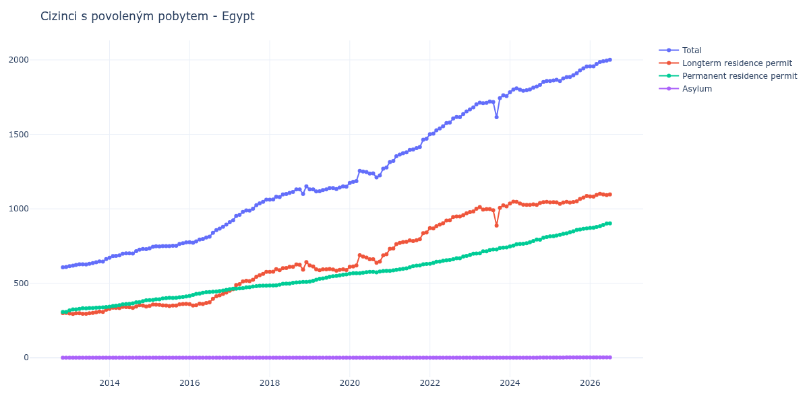

# Egypt

## Souhrnné statistiky (Min/Max pro rok) / Summary Statistics (Min/Max per year)

| Year   | Total         | Longterm Residence Permit   | Permanent Residence Permit   | Asylum   |
|--------|---------------|-----------------------------|------------------------------|----------|
| 2012   | 607 / 609     | 300 / 301                   | 307 / 308                    | 0 / 0    |
| 2013   | 615 / 662     | 294 / 322                   | 318 / 340                    | 0 / 0    |
| 2014   | 671 / 730     | 328 / 353                   | 343 / 385                    | 0 / 0    |
| 2015   | 735 / 774     | 347 / 362                   | 387 / 412                    | 0 / 0    |
| 2016   | 772 / 894     | 350 / 438                   | 415 / 456                    | 0 / 0    |
| 2017   | 910 / 1 061   | 450 / 577                   | 460 / 484                    | 0 / 0    |
| 2018   | 1 061 / 1 151 | 576 / 642                   | 485 / 509                    | 0 / 0    |
| 2019   | 1 117 / 1 151 | 584 / 619                   | 511 / 560                    | 0 / 0    |
| 2020   | 1 174 / 1 278 | 610 / 695                   | 564 / 583                    | 0 / 0    |
| 2021   | 1 314 / 1 471 | 731 / 841                   | 583 / 630                    | 0 / 0    |
| 2022   | 1 501 / 1 654 | 868 / 970                   | 631 / 684                    | 0 / 0    |
| 2023   | 1 615 / 1 762 | 888 / 1 023                 | 690 / 741                    | 0 / 0    |
| 2024   | 1 783 / 1 859 | 1 026 / 1 048               | 747 / 811                    | 0 / 1    |
| 2025   | 1 859 / 1 956 | 1 033 / 1 086               | 815 / 868                    | 1 / 2    |
| 2026   | 1 957 / 2 001 | 1 082 / 1 101               | 872 / 902                    | 2 / 2    |

## Detailní tabulka / Detailed Data Table

| Date     | Total          | Longterm Residence Permit   | Permanent Residence Permit   | Asylum       |
|----------|----------------|-----------------------------|------------------------------|--------------|
| **2012** |                |                             |                              |              |
| 11.2012  | 607            | 300                         | 307                          | 0            |
| 12.2012  | 609 (+0.33%)   | 301 (+0.33%)                | 308 (+0.33%)                 | 0            |
| **2013** |                |                             |                              |              |
| 01.2013  | 615 (+0.99%)   | 297 (-1.33%)                | 318 (+3.25%)                 | 0            |
| 02.2013  | 618 (+0.49%)   | 294 (-1.01%)                | 324 (+1.89%)                 | 0            |
| 03.2013  | 623 (+0.81%)   | 298 (+1.36%)                | 325 (+0.31%)                 | 0            |
| 04.2013  | 627 (+0.64%)   | 299 (+0.34%)                | 328 (+0.92%)                 | 0            |
| 05.2013  | 627 (+0.00%)   | 295 (-1.34%)                | 332 (+1.22%)                 | 0            |
| 06.2013  | 626 (-0.16%)   | 295 (+0.00%)                | 331 (-0.30%)                 | 0            |
| 07.2013  | 631 (+0.80%)   | 298 (+1.02%)                | 333 (+0.60%)                 | 0            |
| 08.2013  | 635 (+0.63%)   | 301 (+1.01%)                | 334 (+0.30%)                 | 0            |
| 09.2013  | 641 (+0.94%)   | 305 (+1.33%)                | 336 (+0.60%)                 | 0            |
| 10.2013  | 647 (+0.94%)   | 310 (+1.64%)                | 337 (+0.30%)                 | 0            |
| 11.2013  | 646 (-0.15%)   | 308 (-0.65%)                | 338 (+0.30%)                 | 0            |
| 12.2013  | 662 (+2.48%)   | 322 (+4.55%)                | 340 (+0.59%)                 | 0            |
| **2014** |                |                             |                              |              |
| 01.2014  | 671 (+1.36%)   | 328 (+1.86%)                | 343 (+0.88%)                 | 0            |
| 02.2014  | 683 (+1.79%)   | 336 (+2.44%)                | 347 (+1.17%)                 | 0            |
| 03.2014  | 684 (+0.15%)   | 335 (-0.30%)                | 349 (+0.58%)                 | 0            |
| 04.2014  | 687 (+0.44%)   | 334 (-0.30%)                | 353 (+1.15%)                 | 0            |
| 05.2014  | 699 (+1.75%)   | 341 (+2.10%)                | 358 (+1.42%)                 | 0            |
| 06.2014  | 701 (+0.29%)   | 340 (-0.29%)                | 361 (+0.84%)                 | 0            |
| 07.2014  | 701 (+0.00%)   | 339 (-0.29%)                | 362 (+0.28%)                 | 0            |
| 08.2014  | 700 (-0.14%)   | 335 (-1.18%)                | 365 (+0.83%)                 | 0            |
| 09.2014  | 716 (+2.29%)   | 344 (+2.69%)                | 372 (+1.92%)                 | 0            |
| 10.2014  | 726 (+1.40%)   | 353 (+2.62%)                | 373 (+0.27%)                 | 0            |
| 11.2014  | 730 (+0.55%)   | 350 (-0.85%)                | 380 (+1.88%)                 | 0            |
| 12.2014  | 729 (-0.14%)   | 344 (-1.71%)                | 385 (+1.32%)                 | 0            |
| **2015** |                |                             |                              |              |
| 01.2015  | 735 (+0.82%)   | 348 (+1.16%)                | 387 (+0.52%)                 | 0            |
| 02.2015  | 745 (+1.36%)   | 357 (+2.59%)                | 388 (+0.26%)                 | 0            |
| 03.2015  | 748 (+0.40%)   | 356 (-0.28%)                | 392 (+1.03%)                 | 0            |
| 04.2015  | 747 (-0.13%)   | 355 (-0.28%)                | 392 (+0.00%)                 | 0            |
| 05.2015  | 750 (+0.40%)   | 352 (-0.85%)                | 398 (+1.53%)                 | 0            |
| 06.2015  | 750 (+0.00%)   | 350 (-0.57%)                | 400 (+0.50%)                 | 0            |
| 07.2015  | 749 (-0.13%)   | 347 (-0.86%)                | 402 (+0.50%)                 | 0            |
| 08.2015  | 752 (+0.40%)   | 351 (+1.15%)                | 401 (-0.25%)                 | 0            |
| 09.2015  | 752 (+0.00%)   | 350 (-0.28%)                | 402 (+0.25%)                 | 0            |
| 10.2015  | 764 (+1.60%)   | 358 (+2.29%)                | 406 (+1.00%)                 | 0            |
| 11.2015  | 769 (+0.65%)   | 361 (+0.84%)                | 408 (+0.49%)                 | 0            |
| 12.2015  | 774 (+0.65%)   | 362 (+0.28%)                | 412 (+0.98%)                 | 0            |
| **2016** |                |                             |                              |              |
| 01.2016  | 775 (+0.13%)   | 360 (-0.55%)                | 415 (+0.73%)                 | 0            |
| 02.2016  | 772 (-0.39%)   | 350 (-2.78%)                | 422 (+1.69%)                 | 0            |
| 03.2016  | 781 (+1.17%)   | 353 (+0.86%)                | 428 (+1.42%)                 | 0            |
| 04.2016  | 794 (+1.66%)   | 363 (+2.83%)                | 431 (+0.70%)                 | 0            |
| 05.2016  | 797 (+0.38%)   | 361 (-0.55%)                | 436 (+1.16%)                 | 0            |
| 06.2016  | 807 (+1.25%)   | 367 (+1.66%)                | 440 (+0.92%)                 | 0            |
| 07.2016  | 813 (+0.74%)   | 372 (+1.36%)                | 441 (+0.23%)                 | 0            |
| 08.2016  | 839 (+3.20%)   | 396 (+6.45%)                | 443 (+0.45%)                 | 0            |
| 09.2016  | 857 (+2.15%)   | 413 (+4.29%)                | 444 (+0.23%)                 | 0            |
| 10.2016  | 867 (+1.17%)   | 419 (+1.45%)                | 448 (+0.90%)                 | 0            |
| 11.2016  | 880 (+1.50%)   | 429 (+2.39%)                | 451 (+0.67%)                 | 0            |
| 12.2016  | 894 (+1.59%)   | 438 (+2.10%)                | 456 (+1.11%)                 | 0            |
| **2017** |                |                             |                              |              |
| 01.2017  | 910 (+1.79%)   | 450 (+2.74%)                | 460 (+0.88%)                 | 0            |
| 02.2017  | 923 (+1.43%)   | 460 (+2.22%)                | 463 (+0.65%)                 | 0            |
| 03.2017  | 952 (+3.14%)   | 488 (+6.09%)                | 464 (+0.22%)                 | 0            |
| 04.2017  | 960 (+0.84%)   | 494 (+1.23%)                | 466 (+0.43%)                 | 0            |
| 05.2017  | 979 (+1.98%)   | 512 (+3.64%)                | 467 (+0.21%)                 | 0            |
| 06.2017  | 989 (+1.02%)   | 517 (+0.98%)                | 472 (+1.07%)                 | 0            |
| 07.2017  | 988 (-0.10%)   | 514 (-0.58%)                | 474 (+0.42%)                 | 0            |
| 08.2017  | 1 001 (+1.32%) | 523 (+1.75%)                | 478 (+0.84%)                 | 0            |
| 09.2017  | 1 024 (+2.30%) | 544 (+4.02%)                | 480 (+0.42%)                 | 0            |
| 10.2017  | 1 037 (+1.27%) | 554 (+1.84%)                | 483 (+0.63%)                 | 0            |
| 11.2017  | 1 047 (+0.96%) | 563 (+1.62%)                | 484 (+0.21%)                 | 0            |
| 12.2017  | 1 061 (+1.34%) | 577 (+2.49%)                | 484 (+0.00%)                 | 0            |
| **2018** |                |                             |                              |              |
| 01.2018  | 1 061 (+0.00%) | 576 (-0.17%)                | 485 (+0.21%)                 | 0            |
| 02.2018  | 1 063 (+0.19%) | 578 (+0.35%)                | 485 (+0.00%)                 | 0            |
| 03.2018  | 1 081 (+1.69%) | 595 (+2.94%)                | 486 (+0.21%)                 | 0            |
| 04.2018  | 1 079 (-0.19%) | 588 (-1.18%)                | 491 (+1.03%)                 | 0            |
| 05.2018  | 1 097 (+1.67%) | 601 (+2.21%)                | 496 (+1.02%)                 | 0            |
| 06.2018  | 1 100 (+0.27%) | 603 (+0.33%)                | 497 (+0.20%)                 | 0            |
| 07.2018  | 1 107 (+0.64%) | 610 (+1.16%)                | 497 (+0.00%)                 | 0            |
| 08.2018  | 1 113 (+0.54%) | 610 (+0.00%)                | 503 (+1.21%)                 | 0            |
| 09.2018  | 1 131 (+1.62%) | 626 (+2.62%)                | 505 (+0.40%)                 | 0            |
| 10.2018  | 1 131 (+0.00%) | 624 (-0.32%)                | 507 (+0.40%)                 | 0            |
| 11.2018  | 1 100 (-2.74%) | 591 (-5.29%)                | 509 (+0.39%)                 | 0            |
| 12.2018  | 1 151 (+4.64%) | 642 (+8.63%)                | 509 (+0.00%)                 | 0            |
| **2019** |                |                             |                              |              |
| 01.2019  | 1 130 (-1.82%) | 619 (-3.58%)                | 511 (+0.39%)                 | 0            |
| 02.2019  | 1 130 (+0.00%) | 613 (-0.97%)                | 517 (+1.17%)                 | 0            |
| 03.2019  | 1 117 (-1.15%) | 594 (-3.10%)                | 523 (+1.16%)                 | 0            |
| 04.2019  | 1 118 (+0.09%) | 588 (-1.01%)                | 530 (+1.34%)                 | 0            |
| 05.2019  | 1 126 (+0.72%) | 594 (+1.02%)                | 532 (+0.38%)                 | 0            |
| 06.2019  | 1 131 (+0.44%) | 594 (+0.00%)                | 537 (+0.94%)                 | 0            |
| 07.2019  | 1 140 (+0.80%) | 596 (+0.34%)                | 544 (+1.30%)                 | 0            |
| 08.2019  | 1 139 (-0.09%) | 592 (-0.67%)                | 547 (+0.55%)                 | 0            |
| 09.2019  | 1 133 (-0.53%) | 584 (-1.35%)                | 549 (+0.37%)                 | 0            |
| 10.2019  | 1 143 (+0.88%) | 590 (+1.03%)                | 553 (+0.73%)                 | 0            |
| 11.2019  | 1 151 (+0.70%) | 594 (+0.68%)                | 557 (+0.72%)                 | 0            |
| 12.2019  | 1 149 (-0.17%) | 589 (-0.84%)                | 560 (+0.54%)                 | 0            |
| **2020** |                |                             |                              |              |
| 01.2020  | 1 174 (+2.18%) | 610 (+3.57%)                | 564 (+0.71%)                 | 0            |
| 02.2020  | 1 181 (+0.60%) | 613 (+0.49%)                | 568 (+0.71%)                 | 0            |
| 03.2020  | 1 186 (+0.42%) | 619 (+0.98%)                | 567 (-0.18%)                 | 0            |
| 04.2020  | 1 255 (+5.82%) | 688 (+11.15%)               | 567 (+0.00%)                 | 0            |
| 05.2020  | 1 250 (-0.40%) | 679 (-1.31%)                | 571 (+0.71%)                 | 0            |
| 06.2020  | 1 247 (-0.24%) | 673 (-0.88%)                | 574 (+0.53%)                 | 0            |
| 07.2020  | 1 237 (-0.80%) | 661 (-1.78%)                | 576 (+0.35%)                 | 0            |
| 08.2020  | 1 238 (+0.08%) | 661 (+0.00%)                | 577 (+0.17%)                 | 0            |
| 09.2020  | 1 211 (-2.18%) | 638 (-3.48%)                | 573 (-0.69%)                 | 0            |
| 10.2020  | 1 224 (+1.07%) | 645 (+1.10%)                | 579 (+1.05%)                 | 0            |
| 11.2020  | 1 269 (+3.68%) | 687 (+6.51%)                | 582 (+0.52%)                 | 0            |
| 12.2020  | 1 278 (+0.71%) | 695 (+1.16%)                | 583 (+0.17%)                 | 0            |
| **2021** |                |                             |                              |              |
| 01.2021  | 1 314 (+2.82%) | 731 (+5.18%)                | 583 (+0.00%)                 | 0            |
| 02.2021  | 1 321 (+0.53%) | 734 (+0.41%)                | 587 (+0.69%)                 | 0            |
| 03.2021  | 1 353 (+2.42%) | 763 (+3.95%)                | 590 (+0.51%)                 | 0            |
| 04.2021  | 1 364 (+0.81%) | 771 (+1.05%)                | 593 (+0.51%)                 | 0            |
| 05.2021  | 1 374 (+0.73%) | 777 (+0.78%)                | 597 (+0.67%)                 | 0            |
| 06.2021  | 1 379 (+0.36%) | 779 (+0.26%)                | 600 (+0.50%)                 | 0            |
| 07.2021  | 1 395 (+1.16%) | 788 (+1.16%)                | 607 (+1.17%)                 | 0            |
| 08.2021  | 1 398 (+0.22%) | 783 (-0.63%)                | 615 (+1.32%)                 | 0            |
| 09.2021  | 1 407 (+0.64%) | 789 (+0.77%)                | 618 (+0.49%)                 | 0            |
| 10.2021  | 1 415 (+0.57%) | 796 (+0.89%)                | 619 (+0.16%)                 | 0            |
| 11.2021  | 1 464 (+3.46%) | 837 (+5.15%)                | 627 (+1.29%)                 | 0            |
| 12.2021  | 1 471 (+0.48%) | 841 (+0.48%)                | 630 (+0.48%)                 | 0            |
| **2022** |                |                             |                              |              |
| 01.2022  | 1 501 (+2.04%) | 870 (+3.45%)                | 631 (+0.16%)                 | 0            |
| 02.2022  | 1 505 (+0.27%) | 868 (-0.23%)                | 637 (+0.95%)                 | 0            |
| 03.2022  | 1 527 (+1.46%) | 883 (+1.73%)                | 644 (+1.10%)                 | 0            |
| 04.2022  | 1 540 (+0.85%) | 894 (+1.25%)                | 646 (+0.31%)                 | 0            |
| 05.2022  | 1 554 (+0.91%) | 903 (+1.01%)                | 651 (+0.77%)                 | 0            |
| 06.2022  | 1 576 (+1.42%) | 921 (+1.99%)                | 655 (+0.61%)                 | 0            |
| 07.2022  | 1 579 (+0.19%) | 922 (+0.11%)                | 657 (+0.31%)                 | 0            |
| 08.2022  | 1 606 (+1.71%) | 945 (+2.49%)                | 661 (+0.61%)                 | 0            |
| 09.2022  | 1 617 (+0.68%) | 949 (+0.42%)                | 668 (+1.06%)                 | 0            |
| 10.2022  | 1 616 (-0.06%) | 948 (-0.11%)                | 668 (+0.00%)                 | 0            |
| 11.2022  | 1 637 (+1.30%) | 958 (+1.05%)                | 679 (+1.65%)                 | 0            |
| 12.2022  | 1 654 (+1.04%) | 970 (+1.25%)                | 684 (+0.74%)                 | 0            |
| **2023** |                |                             |                              |              |
| 01.2023  | 1 668 (+0.85%) | 978 (+0.82%)                | 690 (+0.88%)                 | 0            |
| 02.2023  | 1 681 (+0.78%) | 982 (+0.41%)                | 699 (+1.30%)                 | 0            |
| 03.2023  | 1 701 (+1.19%) | 1 001 (+1.93%)              | 700 (+0.14%)                 | 0            |
| 04.2023  | 1 713 (+0.71%) | 1 012 (+1.10%)              | 701 (+0.14%)                 | 0            |
| 05.2023  | 1 709 (-0.23%) | 995 (-1.68%)                | 714 (+1.85%)                 | 0            |
| 06.2023  | 1 712 (+0.18%) | 998 (+0.30%)                | 714 (+0.00%)                 | 0            |
| 07.2023  | 1 721 (+0.53%) | 998 (+0.00%)                | 723 (+1.26%)                 | 0            |
| 08.2023  | 1 717 (-0.23%) | 990 (-0.80%)                | 727 (+0.55%)                 | 0            |
| 09.2023  | 1 615 (-5.94%) | 888 (-10.30%)               | 727 (+0.00%)                 | 0            |
| 10.2023  | 1 743 (+7.93%) | 1 006 (+13.29%)             | 737 (+1.38%)                 | 0            |
| 11.2023  | 1 762 (+1.09%) | 1 023 (+1.69%)              | 739 (+0.27%)                 | 0            |
| 12.2023  | 1 757 (-0.28%) | 1 016 (-0.68%)              | 741 (+0.27%)                 | 0            |
| **2024** |                |                             |                              |              |
| 01.2024  | 1 783 (+1.48%) | 1 036 (+1.97%)              | 747 (+0.81%)                 | 0            |
| 02.2024  | 1 801 (+1.01%) | 1 048 (+1.16%)              | 753 (+0.80%)                 | 0            |
| 03.2024  | 1 809 (+0.44%) | 1 047 (-0.10%)              | 762 (+1.20%)                 | 0            |
| 04.2024  | 1 800 (-0.50%) | 1 036 (-1.05%)              | 764 (+0.26%)                 | 0            |
| 05.2024  | 1 793 (-0.39%) | 1 028 (-0.77%)              | 765 (+0.13%)                 | 0            |
| 06.2024  | 1 796 (+0.17%) | 1 027 (-0.10%)              | 769 (+0.52%)                 | 0            |
| 07.2024  | 1 802 (+0.33%) | 1 026 (-0.10%)              | 776 (+0.91%)                 | 0            |
| 08.2024  | 1 813 (+0.61%) | 1 030 (+0.39%)              | 783 (+0.90%)                 | 0            |
| 09.2024  | 1 821 (+0.44%) | 1 027 (-0.29%)              | 794 (+1.40%)                 | 0            |
| 10.2024  | 1 833 (+0.66%) | 1 039 (+1.17%)              | 793 (-0.13%)                 | 1            |
| 11.2024  | 1 852 (+1.04%) | 1 045 (+0.58%)              | 806 (+1.64%)                 | 1 (+0.00%)   |
| 12.2024  | 1 859 (+0.38%) | 1 047 (+0.19%)              | 811 (+0.62%)                 | 1 (+0.00%)   |
| **2025** |                |                             |                              |              |
| 01.2025  | 1 859 (+0.00%) | 1 043 (-0.38%)              | 815 (+0.49%)                 | 1 (+0.00%)   |
| 02.2025  | 1 862 (+0.16%) | 1 045 (+0.19%)              | 816 (+0.12%)                 | 1 (+0.00%)   |
| 03.2025  | 1 866 (+0.21%) | 1 044 (-0.10%)              | 821 (+0.61%)                 | 1 (+0.00%)   |
| 04.2025  | 1 859 (-0.38%) | 1 033 (-1.05%)              | 825 (+0.49%)                 | 1 (+0.00%)   |
| 05.2025  | 1 875 (+0.86%) | 1 042 (+0.87%)              | 832 (+0.85%)                 | 1 (+0.00%)   |
| 06.2025  | 1 885 (+0.53%) | 1 047 (+0.48%)              | 836 (+0.48%)                 | 2 (+100.00%) |
| 07.2025  | 1 886 (+0.05%) | 1 042 (-0.48%)              | 842 (+0.72%)                 | 2 (+0.00%)   |
| 08.2025  | 1 897 (+0.58%) | 1 046 (+0.38%)              | 849 (+0.83%)                 | 2 (+0.00%)   |
| 09.2025  | 1 910 (+0.69%) | 1 050 (+0.38%)              | 858 (+1.06%)                 | 2 (+0.00%)   |
| 10.2025  | 1 930 (+1.05%) | 1 066 (+1.52%)              | 862 (+0.47%)                 | 2 (+0.00%)   |
| 11.2025  | 1 943 (+0.67%) | 1 075 (+0.84%)              | 866 (+0.46%)                 | 2 (+0.00%)   |
| 12.2025  | 1 956 (+0.67%) | 1 086 (+1.02%)              | 868 (+0.23%)                 | 2 (+0.00%)   |
| **2026** |                |                             |                              |              |
| 01.2026  | 1 957 (+0.05%) | 1 083 (-0.28%)              | 872 (+0.46%)                 | 2 (+0.00%)   |
| 02.2026  | 1 957 (+0.00%) | 1 082 (-0.09%)              | 873 (+0.11%)                 | 2 (+0.00%)   |
| 03.2026  | 1 973 (+0.82%) | 1 093 (+1.02%)              | 878 (+0.57%)                 | 2 (+0.00%)   |
| 04.2026  | 1 986 (+0.66%) | 1 101 (+0.73%)              | 883 (+0.57%)                 | 2 (+0.00%)   |
| 05.2026  | 1 991 (+0.25%) | 1 097 (-0.36%)              | 892 (+1.02%)                 | 2 (+0.00%)   |
| 06.2026  | 1 995 (+0.20%) | 1 092 (-0.46%)              | 901 (+1.01%)                 | 2 (+0.00%)   |
| 07.2026  | 2 001 (+0.30%) | 1 097 (+0.46%)              | 902 (+0.11%)                 | 2 (+0.00%)   |
