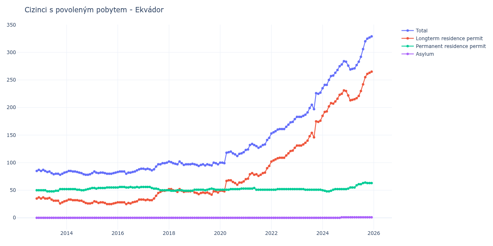

# Ekvádor

## Souhrnné statistiky (Min/Max pro rok) / Summary Statistics (Min/Max per year)

| Year   | Total     | Longterm Residence Permit   | Permanent Residence Permit   | Asylum   |
|--------|-----------|-----------------------------|------------------------------|----------|
| 2012   | 85 / 87   | 35 / 37                     | 50 / 50                      | 0 / 0    |
| 2013   | 78 / 87   | 26 / 37                     | 48 / 52                      | 0 / 0    |
| 2014   | 78 / 85   | 26 / 33                     | 50 / 53                      | 0 / 0    |
| 2015   | 80 / 84   | 25 / 30                     | 53 / 55                      | 0 / 0    |
| 2016   | 80 / 89   | 25 / 33                     | 55 / 56                      | 0 / 0    |
| 2017   | 86 / 100  | 32 / 50                     | 50 / 56                      | 0 / 0    |
| 2018   | 96 / 102  | 47 / 52                     | 49 / 50                      | 0 / 0    |
| 2019   | 94 / 100  | 42 / 48                     | 50 / 53                      | 0 / 0    |
| 2020   | 99 / 120  | 48 / 68                     | 51 / 53                      | 0 / 0    |
| 2021   | 123 / 145 | 70 / 94                     | 51 / 54                      | 0 / 0    |
| 2022   | 153 / 179 | 102 / 127                   | 51 / 52                      | 0 / 0    |
| 2023   | 183 / 227 | 131 / 176                   | 51 / 52                      | 0 / 0    |
| 2024   | 235 / 284 | 185 / 231                   | 48 / 52                      | 0 / 1    |
| 2025   | 269 / 329 | 213 / 265                   | 53 / 64                      | 1 / 1    |

## Detailní tabulka / Detailed Data Table

| Date     | Total         | Longterm Residence Permit   | Permanent Residence Permit   | Asylum     |
|----------|---------------|-----------------------------|------------------------------|------------|
| **2012** |               |                             |                              |            |
| 11.2012  | 85            | 35                          | 50                           | 0          |
| 12.2012  | 87 (+2.35%)   | 37 (+5.71%)                 | 50 (+0.00%)                  | 0          |
| **2013** |               |                             |                              |            |
| 01.2013  | 85 (-2.30%)   | 35 (-5.41%)                 | 50 (+0.00%)                  | 0          |
| 02.2013  | 87 (+2.35%)   | 37 (+5.71%)                 | 50 (+0.00%)                  | 0          |
| 03.2013  | 85 (-2.30%)   | 35 (-5.41%)                 | 50 (+0.00%)                  | 0          |
| 04.2013  | 83 (-2.35%)   | 35 (+0.00%)                 | 48 (-4.00%)                  | 0          |
| 05.2013  | 84 (+1.20%)   | 36 (+2.86%)                 | 48 (+0.00%)                  | 0          |
| 06.2013  | 81 (-3.57%)   | 33 (-8.33%)                 | 48 (+0.00%)                  | 0          |
| 07.2013  | 79 (-2.47%)   | 31 (-6.06%)                 | 48 (+0.00%)                  | 0          |
| 08.2013  | 80 (+1.27%)   | 31 (+0.00%)                 | 49 (+2.08%)                  | 0          |
| 09.2013  | 80 (+0.00%)   | 31 (+0.00%)                 | 49 (+0.00%)                  | 0          |
| 10.2013  | 78 (-2.50%)   | 26 (-16.13%)                | 52 (+6.12%)                  | 0          |
| 11.2013  | 80 (+2.56%)   | 28 (+7.69%)                 | 52 (+0.00%)                  | 0          |
| 12.2013  | 82 (+2.50%)   | 30 (+7.14%)                 | 52 (+0.00%)                  | 0          |
| **2014** |               |                             |                              |            |
| 01.2014  | 83 (+1.22%)   | 31 (+3.33%)                 | 52 (+0.00%)                  | 0          |
| 02.2014  | 85 (+2.41%)   | 33 (+6.45%)                 | 52 (+0.00%)                  | 0          |
| 03.2014  | 85 (+0.00%)   | 33 (+0.00%)                 | 52 (+0.00%)                  | 0          |
| 04.2014  | 84 (-1.18%)   | 32 (-3.03%)                 | 52 (+0.00%)                  | 0          |
| 05.2014  | 84 (+0.00%)   | 32 (+0.00%)                 | 52 (+0.00%)                  | 0          |
| 06.2014  | 83 (-1.19%)   | 32 (+0.00%)                 | 51 (-1.92%)                  | 0          |
| 07.2014  | 82 (-1.20%)   | 31 (-3.12%)                 | 51 (+0.00%)                  | 0          |
| 08.2014  | 81 (-1.22%)   | 31 (+0.00%)                 | 50 (-1.96%)                  | 0          |
| 09.2014  | 79 (-2.47%)   | 29 (-6.45%)                 | 50 (+0.00%)                  | 0          |
| 10.2014  | 78 (-1.27%)   | 27 (-6.90%)                 | 51 (+2.00%)                  | 0          |
| 11.2014  | 78 (+0.00%)   | 26 (-3.70%)                 | 52 (+1.96%)                  | 0          |
| 12.2014  | 79 (+1.28%)   | 26 (+0.00%)                 | 53 (+1.92%)                  | 0          |
| **2015** |               |                             |                              |            |
| 01.2015  | 81 (+2.53%)   | 27 (+3.85%)                 | 54 (+1.89%)                  | 0          |
| 02.2015  | 84 (+3.70%)   | 30 (+11.11%)                | 54 (+0.00%)                  | 0          |
| 03.2015  | 82 (-2.38%)   | 29 (-3.33%)                 | 53 (-1.85%)                  | 0          |
| 04.2015  | 81 (-1.22%)   | 27 (-6.90%)                 | 54 (+1.89%)                  | 0          |
| 05.2015  | 82 (+1.23%)   | 28 (+3.70%)                 | 54 (+0.00%)                  | 0          |
| 06.2015  | 82 (+0.00%)   | 28 (+0.00%)                 | 54 (+0.00%)                  | 0          |
| 07.2015  | 81 (-1.22%)   | 27 (-3.57%)                 | 54 (+0.00%)                  | 0          |
| 08.2015  | 80 (-1.23%)   | 25 (-7.41%)                 | 55 (+1.85%)                  | 0          |
| 09.2015  | 80 (+0.00%)   | 25 (+0.00%)                 | 55 (+0.00%)                  | 0          |
| 10.2015  | 80 (+0.00%)   | 25 (+0.00%)                 | 55 (+0.00%)                  | 0          |
| 11.2015  | 81 (+1.25%)   | 26 (+4.00%)                 | 55 (+0.00%)                  | 0          |
| 12.2015  | 82 (+1.23%)   | 27 (+3.85%)                 | 55 (+0.00%)                  | 0          |
| **2016** |               |                             |                              |            |
| 01.2016  | 83 (+1.22%)   | 28 (+3.70%)                 | 55 (+0.00%)                  | 0          |
| 02.2016  | 84 (+1.20%)   | 28 (+0.00%)                 | 56 (+1.82%)                  | 0          |
| 03.2016  | 84 (+0.00%)   | 28 (+0.00%)                 | 56 (+0.00%)                  | 0          |
| 04.2016  | 84 (+0.00%)   | 28 (+0.00%)                 | 56 (+0.00%)                  | 0          |
| 05.2016  | 80 (-4.76%)   | 25 (-10.71%)                | 55 (-1.79%)                  | 0          |
| 06.2016  | 82 (+2.50%)   | 27 (+8.00%)                 | 55 (+0.00%)                  | 0          |
| 07.2016  | 82 (+0.00%)   | 26 (-3.70%)                 | 56 (+1.82%)                  | 0          |
| 08.2016  | 83 (+1.22%)   | 28 (+7.69%)                 | 55 (-1.79%)                  | 0          |
| 09.2016  | 84 (+1.20%)   | 29 (+3.57%)                 | 55 (+0.00%)                  | 0          |
| 10.2016  | 86 (+2.38%)   | 30 (+3.45%)                 | 56 (+1.82%)                  | 0          |
| 11.2016  | 88 (+2.33%)   | 33 (+10.00%)                | 55 (-1.79%)                  | 0          |
| 12.2016  | 89 (+1.14%)   | 33 (+0.00%)                 | 56 (+1.82%)                  | 0          |
| **2017** |               |                             |                              |            |
| 01.2017  | 89 (+0.00%)   | 33 (+0.00%)                 | 56 (+0.00%)                  | 0          |
| 02.2017  | 88 (-1.12%)   | 32 (-3.03%)                 | 56 (+0.00%)                  | 0          |
| 03.2017  | 89 (+1.14%)   | 33 (+3.12%)                 | 56 (+0.00%)                  | 0          |
| 04.2017  | 88 (-1.12%)   | 32 (-3.03%)                 | 56 (+0.00%)                  | 0          |
| 05.2017  | 86 (-2.27%)   | 32 (+0.00%)                 | 54 (-3.57%)                  | 0          |
| 06.2017  | 88 (+2.33%)   | 35 (+9.38%)                 | 53 (-1.85%)                  | 0          |
| 07.2017  | 93 (+5.68%)   | 40 (+14.29%)                | 53 (+0.00%)                  | 0          |
| 08.2017  | 97 (+4.30%)   | 45 (+12.50%)                | 52 (-1.89%)                  | 0          |
| 09.2017  | 97 (+0.00%)   | 47 (+4.44%)                 | 50 (-3.85%)                  | 0          |
| 10.2017  | 99 (+2.06%)   | 49 (+4.26%)                 | 50 (+0.00%)                  | 0          |
| 11.2017  | 99 (+0.00%)   | 49 (+0.00%)                 | 50 (+0.00%)                  | 0          |
| 12.2017  | 100 (+1.01%)  | 50 (+2.04%)                 | 50 (+0.00%)                  | 0          |
| **2018** |               |                             |                              |            |
| 01.2018  | 102 (+2.00%)  | 52 (+4.00%)                 | 50 (+0.00%)                  | 0          |
| 02.2018  | 101 (-0.98%)  | 52 (+0.00%)                 | 49 (-2.00%)                  | 0          |
| 03.2018  | 99 (-1.98%)   | 50 (-3.85%)                 | 49 (+0.00%)                  | 0          |
| 04.2018  | 98 (-1.01%)   | 49 (-2.00%)                 | 49 (+0.00%)                  | 0          |
| 05.2018  | 97 (-1.02%)   | 47 (-4.08%)                 | 50 (+2.04%)                  | 0          |
| 06.2018  | 102 (+5.15%)  | 52 (+10.64%)                | 50 (+0.00%)                  | 0          |
| 07.2018  | 99 (-2.94%)   | 49 (-5.77%)                 | 50 (+0.00%)                  | 0          |
| 08.2018  | 96 (-3.03%)   | 47 (-4.08%)                 | 49 (-2.00%)                  | 0          |
| 09.2018  | 97 (+1.04%)   | 48 (+2.13%)                 | 49 (+0.00%)                  | 0          |
| 10.2018  | 97 (+0.00%)   | 48 (+0.00%)                 | 49 (+0.00%)                  | 0          |
| 11.2018  | 97 (+0.00%)   | 48 (+0.00%)                 | 49 (+0.00%)                  | 0          |
| 12.2018  | 98 (+1.03%)   | 49 (+2.08%)                 | 49 (+0.00%)                  | 0          |
| **2019** |               |                             |                              |            |
| 01.2019  | 97 (-1.02%)   | 46 (-6.12%)                 | 51 (+4.08%)                  | 0          |
| 02.2019  | 96 (-1.03%)   | 45 (-2.17%)                 | 51 (+0.00%)                  | 0          |
| 03.2019  | 94 (-2.08%)   | 43 (-4.44%)                 | 51 (+0.00%)                  | 0          |
| 04.2019  | 96 (+2.13%)   | 45 (+4.65%)                 | 51 (+0.00%)                  | 0          |
| 05.2019  | 97 (+1.04%)   | 46 (+2.22%)                 | 51 (+0.00%)                  | 0          |
| 06.2019  | 95 (-2.06%)   | 45 (-2.17%)                 | 50 (-1.96%)                  | 0          |
| 07.2019  | 97 (+2.11%)   | 46 (+2.22%)                 | 51 (+2.00%)                  | 0          |
| 08.2019  | 96 (-1.03%)   | 44 (-4.35%)                 | 52 (+1.96%)                  | 0          |
| 09.2019  | 95 (-1.04%)   | 42 (-4.55%)                 | 53 (+1.92%)                  | 0          |
| 10.2019  | 100 (+5.26%)  | 48 (+14.29%)                | 52 (-1.89%)                  | 0          |
| 11.2019  | 99 (-1.00%)   | 48 (+0.00%)                 | 51 (-1.92%)                  | 0          |
| 12.2019  | 97 (-2.02%)   | 46 (-4.17%)                 | 51 (+0.00%)                  | 0          |
| **2020** |               |                             |                              |            |
| 01.2020  | 100 (+3.09%)  | 49 (+6.52%)                 | 51 (+0.00%)                  | 0          |
| 02.2020  | 100 (+0.00%)  | 49 (+0.00%)                 | 51 (+0.00%)                  | 0          |
| 03.2020  | 99 (-1.00%)   | 48 (-2.04%)                 | 51 (+0.00%)                  | 0          |
| 04.2020  | 118 (+19.19%) | 67 (+39.58%)                | 51 (+0.00%)                  | 0          |
| 05.2020  | 119 (+0.85%)  | 68 (+1.49%)                 | 51 (+0.00%)                  | 0          |
| 06.2020  | 120 (+0.84%)  | 68 (+0.00%)                 | 52 (+1.96%)                  | 0          |
| 07.2020  | 117 (-2.50%)  | 65 (-4.41%)                 | 52 (+0.00%)                  | 0          |
| 08.2020  | 115 (-1.71%)  | 63 (-3.08%)                 | 52 (+0.00%)                  | 0          |
| 09.2020  | 112 (-2.61%)  | 60 (-4.76%)                 | 52 (+0.00%)                  | 0          |
| 10.2020  | 116 (+3.57%)  | 64 (+6.67%)                 | 52 (+0.00%)                  | 0          |
| 11.2020  | 117 (+0.86%)  | 64 (+0.00%)                 | 53 (+1.92%)                  | 0          |
| 12.2020  | 119 (+1.71%)  | 66 (+3.12%)                 | 53 (+0.00%)                  | 0          |
| **2021** |               |                             |                              |            |
| 01.2021  | 123 (+3.36%)  | 70 (+6.06%)                 | 53 (+0.00%)                  | 0          |
| 02.2021  | 124 (+0.81%)  | 71 (+1.43%)                 | 53 (+0.00%)                  | 0          |
| 03.2021  | 132 (+6.45%)  | 79 (+11.27%)                | 53 (+0.00%)                  | 0          |
| 04.2021  | 134 (+1.52%)  | 81 (+2.53%)                 | 53 (+0.00%)                  | 0          |
| 05.2021  | 132 (-1.49%)  | 78 (-3.70%)                 | 54 (+1.89%)                  | 0          |
| 06.2021  | 130 (-1.52%)  | 79 (+1.28%)                 | 51 (-5.56%)                  | 0          |
| 07.2021  | 127 (-2.31%)  | 76 (-3.80%)                 | 51 (+0.00%)                  | 0          |
| 08.2021  | 129 (+1.57%)  | 78 (+2.63%)                 | 51 (+0.00%)                  | 0          |
| 09.2021  | 132 (+2.33%)  | 81 (+3.85%)                 | 51 (+0.00%)                  | 0          |
| 10.2021  | 133 (+0.76%)  | 82 (+1.23%)                 | 51 (+0.00%)                  | 0          |
| 11.2021  | 141 (+6.02%)  | 90 (+9.76%)                 | 51 (+0.00%)                  | 0          |
| 12.2021  | 145 (+2.84%)  | 94 (+4.44%)                 | 51 (+0.00%)                  | 0          |
| **2022** |               |                             |                              |            |
| 01.2022  | 153 (+5.52%)  | 102 (+8.51%)                | 51 (+0.00%)                  | 0          |
| 02.2022  | 155 (+1.31%)  | 104 (+1.96%)                | 51 (+0.00%)                  | 0          |
| 03.2022  | 157 (+1.29%)  | 106 (+1.92%)                | 51 (+0.00%)                  | 0          |
| 04.2022  | 160 (+1.91%)  | 108 (+1.89%)                | 52 (+1.96%)                  | 0          |
| 05.2022  | 161 (+0.63%)  | 109 (+0.93%)                | 52 (+0.00%)                  | 0          |
| 06.2022  | 161 (+0.00%)  | 109 (+0.00%)                | 52 (+0.00%)                  | 0          |
| 07.2022  | 161 (+0.00%)  | 109 (+0.00%)                | 52 (+0.00%)                  | 0          |
| 08.2022  | 165 (+2.48%)  | 113 (+3.67%)                | 52 (+0.00%)                  | 0          |
| 09.2022  | 169 (+2.42%)  | 117 (+3.54%)                | 52 (+0.00%)                  | 0          |
| 10.2022  | 173 (+2.37%)  | 121 (+3.42%)                | 52 (+0.00%)                  | 0          |
| 11.2022  | 174 (+0.58%)  | 122 (+0.83%)                | 52 (+0.00%)                  | 0          |
| 12.2022  | 179 (+2.87%)  | 127 (+4.10%)                | 52 (+0.00%)                  | 0          |
| **2023** |               |                             |                              |            |
| 01.2023  | 183 (+2.23%)  | 131 (+3.15%)                | 52 (+0.00%)                  | 0          |
| 02.2023  | 183 (+0.00%)  | 131 (+0.00%)                | 52 (+0.00%)                  | 0          |
| 03.2023  | 183 (+0.00%)  | 131 (+0.00%)                | 52 (+0.00%)                  | 0          |
| 04.2023  | 185 (+1.09%)  | 133 (+1.53%)                | 52 (+0.00%)                  | 0          |
| 05.2023  | 187 (+1.08%)  | 136 (+2.26%)                | 51 (-1.92%)                  | 0          |
| 06.2023  | 191 (+2.14%)  | 140 (+2.94%)                | 51 (+0.00%)                  | 0          |
| 07.2023  | 199 (+4.19%)  | 148 (+5.71%)                | 51 (+0.00%)                  | 0          |
| 08.2023  | 205 (+3.02%)  | 154 (+4.05%)                | 51 (+0.00%)                  | 0          |
| 09.2023  | 197 (-3.90%)  | 146 (-5.19%)                | 51 (+0.00%)                  | 0          |
| 10.2023  | 226 (+14.72%) | 175 (+19.86%)               | 51 (+0.00%)                  | 0          |
| 11.2023  | 225 (-0.44%)  | 174 (-0.57%)                | 51 (+0.00%)                  | 0          |
| 12.2023  | 227 (+0.89%)  | 176 (+1.15%)                | 51 (+0.00%)                  | 0          |
| **2024** |               |                             |                              |            |
| 01.2024  | 235 (+3.52%)  | 185 (+5.11%)                | 50 (-1.96%)                  | 0          |
| 02.2024  | 241 (+2.55%)  | 192 (+3.78%)                | 49 (-2.00%)                  | 0          |
| 03.2024  | 241 (+0.00%)  | 193 (+0.52%)                | 48 (-2.04%)                  | 0          |
| 04.2024  | 250 (+3.73%)  | 202 (+4.66%)                | 48 (+0.00%)                  | 0          |
| 05.2024  | 257 (+2.80%)  | 208 (+2.97%)                | 49 (+2.08%)                  | 0          |
| 06.2024  | 258 (+0.39%)  | 207 (-0.48%)                | 51 (+4.08%)                  | 0          |
| 07.2024  | 263 (+1.94%)  | 211 (+1.93%)                | 52 (+1.96%)                  | 0          |
| 08.2024  | 268 (+1.90%)  | 216 (+2.37%)                | 52 (+0.00%)                  | 0          |
| 09.2024  | 275 (+2.61%)  | 223 (+3.24%)                | 52 (+0.00%)                  | 0          |
| 10.2024  | 278 (+1.09%)  | 225 (+0.90%)                | 52 (+0.00%)                  | 1          |
| 11.2024  | 284 (+2.16%)  | 231 (+2.67%)                | 52 (+0.00%)                  | 1 (+0.00%) |
| 12.2024  | 283 (-0.35%)  | 230 (-0.43%)                | 52 (+0.00%)                  | 1 (+0.00%) |
| **2025** |               |                             |                              |            |
| 01.2025  | 276 (-2.47%)  | 222 (-3.48%)                | 53 (+1.92%)                  | 1 (+0.00%) |
| 02.2025  | 269 (-2.54%)  | 213 (-4.05%)                | 55 (+3.77%)                  | 1 (+0.00%) |
| 03.2025  | 270 (+0.37%)  | 214 (+0.47%)                | 55 (+0.00%)                  | 1 (+0.00%) |
| 04.2025  | 271 (+0.37%)  | 215 (+0.47%)                | 55 (+0.00%)                  | 1 (+0.00%) |
| 05.2025  | 277 (+2.21%)  | 217 (+0.93%)                | 59 (+7.27%)                  | 1 (+0.00%) |
| 06.2025  | 283 (+2.17%)  | 221 (+1.84%)                | 61 (+3.39%)                  | 1 (+0.00%) |
| 07.2025  | 292 (+3.18%)  | 230 (+4.07%)                | 61 (+0.00%)                  | 1 (+0.00%) |
| 08.2025  | 306 (+4.79%)  | 242 (+5.22%)                | 63 (+3.28%)                  | 1 (+0.00%) |
| 09.2025  | 320 (+4.58%)  | 255 (+5.37%)                | 64 (+1.59%)                  | 1 (+0.00%) |
| 10.2025  | 325 (+1.56%)  | 261 (+2.35%)                | 63 (-1.56%)                  | 1 (+0.00%) |
| 11.2025  | 327 (+0.62%)  | 263 (+0.77%)                | 63 (+0.00%)                  | 1 (+0.00%) |
| 12.2025  | 329 (+0.61%)  | 265 (+0.76%)                | 63 (+0.00%)                  | 1 (+0.00%) |
