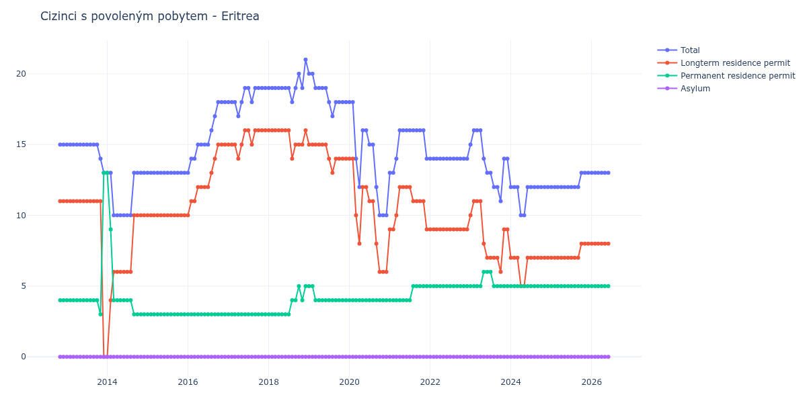

# Eritrea

## Souhrnné statistiky (Min/Max pro rok) / Summary Statistics (Min/Max per year)

| Year   | Total   | Longterm Residence Permit   | Permanent Residence Permit   | Asylum   |
|--------|---------|-----------------------------|------------------------------|----------|
| 2012   | 15 / 15 | 11 / 11                     | 4 / 4                        | 0 / 0    |
| 2013   | 13 / 15 | 0 / 11                      | 3 / 13                       | 0 / 0    |
| 2014   | 10 / 13 | 0 / 10                      | 3 / 13                       | 0 / 0    |
| 2015   | 13 / 13 | 10 / 10                     | 3 / 3                        | 0 / 0    |
| 2016   | 13 / 18 | 10 / 15                     | 3 / 3                        | 0 / 0    |
| 2017   | 17 / 19 | 14 / 16                     | 3 / 3                        | 0 / 0    |
| 2018   | 18 / 21 | 14 / 16                     | 3 / 5                        | 0 / 0    |
| 2019   | 17 / 20 | 13 / 15                     | 4 / 5                        | 0 / 0    |
| 2020   | 10 / 18 | 6 / 14                      | 4 / 4                        | 0 / 0    |
| 2021   | 13 / 16 | 9 / 12                      | 4 / 5                        | 0 / 0    |
| 2022   | 14 / 14 | 9 / 9                       | 5 / 5                        | 0 / 0    |
| 2023   | 11 / 16 | 6 / 11                      | 5 / 6                        | 0 / 0    |
| 2024   | 10 / 12 | 5 / 7                       | 5 / 5                        | 0 / 0    |
| 2025   | 12 / 13 | 7 / 8                       | 5 / 5                        | 0 / 0    |

## Detailní tabulka / Detailed Data Table

| Date     | Total        | Longterm Residence Permit   | Permanent Residence Permit   | Asylum   |
|----------|--------------|-----------------------------|------------------------------|----------|
| **2012** |              |                             |                              |          |
| 11.2012  | 15           | 11                          | 4                            | 0        |
| 12.2012  | 15 (+0.00%)  | 11 (+0.00%)                 | 4 (+0.00%)                   | 0        |
| **2013** |              |                             |                              |          |
| 01.2013  | 15 (+0.00%)  | 11 (+0.00%)                 | 4 (+0.00%)                   | 0        |
| 02.2013  | 15 (+0.00%)  | 11 (+0.00%)                 | 4 (+0.00%)                   | 0        |
| 03.2013  | 15 (+0.00%)  | 11 (+0.00%)                 | 4 (+0.00%)                   | 0        |
| 04.2013  | 15 (+0.00%)  | 11 (+0.00%)                 | 4 (+0.00%)                   | 0        |
| 05.2013  | 15 (+0.00%)  | 11 (+0.00%)                 | 4 (+0.00%)                   | 0        |
| 06.2013  | 15 (+0.00%)  | 11 (+0.00%)                 | 4 (+0.00%)                   | 0        |
| 07.2013  | 15 (+0.00%)  | 11 (+0.00%)                 | 4 (+0.00%)                   | 0        |
| 08.2013  | 15 (+0.00%)  | 11 (+0.00%)                 | 4 (+0.00%)                   | 0        |
| 09.2013  | 15 (+0.00%)  | 11 (+0.00%)                 | 4 (+0.00%)                   | 0        |
| 10.2013  | 15 (+0.00%)  | 11 (+0.00%)                 | 4 (+0.00%)                   | 0        |
| 11.2013  | 14 (-6.67%)  | 11 (+0.00%)                 | 3 (-25.00%)                  | 0        |
| 12.2013  | 13 (-7.14%)  | 0 (-100.00%)                | 13 (+333.33%)                | 0        |
| **2014** |              |                             |                              |          |
| 01.2014  | 13 (+0.00%)  | 0                           | 13 (+0.00%)                  | 0        |
| 02.2014  | 13 (+0.00%)  | 4                           | 9 (-30.77%)                  | 0        |
| 03.2014  | 10 (-23.08%) | 6 (+50.00%)                 | 4 (-55.56%)                  | 0        |
| 04.2014  | 10 (+0.00%)  | 6 (+0.00%)                  | 4 (+0.00%)                   | 0        |
| 05.2014  | 10 (+0.00%)  | 6 (+0.00%)                  | 4 (+0.00%)                   | 0        |
| 06.2014  | 10 (+0.00%)  | 6 (+0.00%)                  | 4 (+0.00%)                   | 0        |
| 07.2014  | 10 (+0.00%)  | 6 (+0.00%)                  | 4 (+0.00%)                   | 0        |
| 08.2014  | 10 (+0.00%)  | 6 (+0.00%)                  | 4 (+0.00%)                   | 0        |
| 09.2014  | 13 (+30.00%) | 10 (+66.67%)                | 3 (-25.00%)                  | 0        |
| 10.2014  | 13 (+0.00%)  | 10 (+0.00%)                 | 3 (+0.00%)                   | 0        |
| 11.2014  | 13 (+0.00%)  | 10 (+0.00%)                 | 3 (+0.00%)                   | 0        |
| 12.2014  | 13 (+0.00%)  | 10 (+0.00%)                 | 3 (+0.00%)                   | 0        |
| **2015** |              |                             |                              |          |
| 01.2015  | 13 (+0.00%)  | 10 (+0.00%)                 | 3 (+0.00%)                   | 0        |
| 02.2015  | 13 (+0.00%)  | 10 (+0.00%)                 | 3 (+0.00%)                   | 0        |
| 03.2015  | 13 (+0.00%)  | 10 (+0.00%)                 | 3 (+0.00%)                   | 0        |
| 04.2015  | 13 (+0.00%)  | 10 (+0.00%)                 | 3 (+0.00%)                   | 0        |
| 05.2015  | 13 (+0.00%)  | 10 (+0.00%)                 | 3 (+0.00%)                   | 0        |
| 06.2015  | 13 (+0.00%)  | 10 (+0.00%)                 | 3 (+0.00%)                   | 0        |
| 07.2015  | 13 (+0.00%)  | 10 (+0.00%)                 | 3 (+0.00%)                   | 0        |
| 08.2015  | 13 (+0.00%)  | 10 (+0.00%)                 | 3 (+0.00%)                   | 0        |
| 09.2015  | 13 (+0.00%)  | 10 (+0.00%)                 | 3 (+0.00%)                   | 0        |
| 10.2015  | 13 (+0.00%)  | 10 (+0.00%)                 | 3 (+0.00%)                   | 0        |
| 11.2015  | 13 (+0.00%)  | 10 (+0.00%)                 | 3 (+0.00%)                   | 0        |
| 12.2015  | 13 (+0.00%)  | 10 (+0.00%)                 | 3 (+0.00%)                   | 0        |
| **2016** |              |                             |                              |          |
| 01.2016  | 13 (+0.00%)  | 10 (+0.00%)                 | 3 (+0.00%)                   | 0        |
| 02.2016  | 14 (+7.69%)  | 11 (+10.00%)                | 3 (+0.00%)                   | 0        |
| 03.2016  | 14 (+0.00%)  | 11 (+0.00%)                 | 3 (+0.00%)                   | 0        |
| 04.2016  | 15 (+7.14%)  | 12 (+9.09%)                 | 3 (+0.00%)                   | 0        |
| 05.2016  | 15 (+0.00%)  | 12 (+0.00%)                 | 3 (+0.00%)                   | 0        |
| 06.2016  | 15 (+0.00%)  | 12 (+0.00%)                 | 3 (+0.00%)                   | 0        |
| 07.2016  | 15 (+0.00%)  | 12 (+0.00%)                 | 3 (+0.00%)                   | 0        |
| 08.2016  | 16 (+6.67%)  | 13 (+8.33%)                 | 3 (+0.00%)                   | 0        |
| 09.2016  | 17 (+6.25%)  | 14 (+7.69%)                 | 3 (+0.00%)                   | 0        |
| 10.2016  | 18 (+5.88%)  | 15 (+7.14%)                 | 3 (+0.00%)                   | 0        |
| 11.2016  | 18 (+0.00%)  | 15 (+0.00%)                 | 3 (+0.00%)                   | 0        |
| 12.2016  | 18 (+0.00%)  | 15 (+0.00%)                 | 3 (+0.00%)                   | 0        |
| **2017** |              |                             |                              |          |
| 01.2017  | 18 (+0.00%)  | 15 (+0.00%)                 | 3 (+0.00%)                   | 0        |
| 02.2017  | 18 (+0.00%)  | 15 (+0.00%)                 | 3 (+0.00%)                   | 0        |
| 03.2017  | 18 (+0.00%)  | 15 (+0.00%)                 | 3 (+0.00%)                   | 0        |
| 04.2017  | 17 (-5.56%)  | 14 (-6.67%)                 | 3 (+0.00%)                   | 0        |
| 05.2017  | 18 (+5.88%)  | 15 (+7.14%)                 | 3 (+0.00%)                   | 0        |
| 06.2017  | 19 (+5.56%)  | 16 (+6.67%)                 | 3 (+0.00%)                   | 0        |
| 07.2017  | 19 (+0.00%)  | 16 (+0.00%)                 | 3 (+0.00%)                   | 0        |
| 08.2017  | 18 (-5.26%)  | 15 (-6.25%)                 | 3 (+0.00%)                   | 0        |
| 09.2017  | 19 (+5.56%)  | 16 (+6.67%)                 | 3 (+0.00%)                   | 0        |
| 10.2017  | 19 (+0.00%)  | 16 (+0.00%)                 | 3 (+0.00%)                   | 0        |
| 11.2017  | 19 (+0.00%)  | 16 (+0.00%)                 | 3 (+0.00%)                   | 0        |
| 12.2017  | 19 (+0.00%)  | 16 (+0.00%)                 | 3 (+0.00%)                   | 0        |
| **2018** |              |                             |                              |          |
| 01.2018  | 19 (+0.00%)  | 16 (+0.00%)                 | 3 (+0.00%)                   | 0        |
| 02.2018  | 19 (+0.00%)  | 16 (+0.00%)                 | 3 (+0.00%)                   | 0        |
| 03.2018  | 19 (+0.00%)  | 16 (+0.00%)                 | 3 (+0.00%)                   | 0        |
| 04.2018  | 19 (+0.00%)  | 16 (+0.00%)                 | 3 (+0.00%)                   | 0        |
| 05.2018  | 19 (+0.00%)  | 16 (+0.00%)                 | 3 (+0.00%)                   | 0        |
| 06.2018  | 19 (+0.00%)  | 16 (+0.00%)                 | 3 (+0.00%)                   | 0        |
| 07.2018  | 19 (+0.00%)  | 16 (+0.00%)                 | 3 (+0.00%)                   | 0        |
| 08.2018  | 18 (-5.26%)  | 14 (-12.50%)                | 4 (+33.33%)                  | 0        |
| 09.2018  | 19 (+5.56%)  | 15 (+7.14%)                 | 4 (+0.00%)                   | 0        |
| 10.2018  | 20 (+5.26%)  | 15 (+0.00%)                 | 5 (+25.00%)                  | 0        |
| 11.2018  | 19 (-5.00%)  | 15 (+0.00%)                 | 4 (-20.00%)                  | 0        |
| 12.2018  | 21 (+10.53%) | 16 (+6.67%)                 | 5 (+25.00%)                  | 0        |
| **2019** |              |                             |                              |          |
| 01.2019  | 20 (-4.76%)  | 15 (-6.25%)                 | 5 (+0.00%)                   | 0        |
| 02.2019  | 20 (+0.00%)  | 15 (+0.00%)                 | 5 (+0.00%)                   | 0        |
| 03.2019  | 19 (-5.00%)  | 15 (+0.00%)                 | 4 (-20.00%)                  | 0        |
| 04.2019  | 19 (+0.00%)  | 15 (+0.00%)                 | 4 (+0.00%)                   | 0        |
| 05.2019  | 19 (+0.00%)  | 15 (+0.00%)                 | 4 (+0.00%)                   | 0        |
| 06.2019  | 19 (+0.00%)  | 15 (+0.00%)                 | 4 (+0.00%)                   | 0        |
| 07.2019  | 18 (-5.26%)  | 14 (-6.67%)                 | 4 (+0.00%)                   | 0        |
| 08.2019  | 17 (-5.56%)  | 13 (-7.14%)                 | 4 (+0.00%)                   | 0        |
| 09.2019  | 18 (+5.88%)  | 14 (+7.69%)                 | 4 (+0.00%)                   | 0        |
| 10.2019  | 18 (+0.00%)  | 14 (+0.00%)                 | 4 (+0.00%)                   | 0        |
| 11.2019  | 18 (+0.00%)  | 14 (+0.00%)                 | 4 (+0.00%)                   | 0        |
| 12.2019  | 18 (+0.00%)  | 14 (+0.00%)                 | 4 (+0.00%)                   | 0        |
| **2020** |              |                             |                              |          |
| 01.2020  | 18 (+0.00%)  | 14 (+0.00%)                 | 4 (+0.00%)                   | 0        |
| 02.2020  | 18 (+0.00%)  | 14 (+0.00%)                 | 4 (+0.00%)                   | 0        |
| 03.2020  | 14 (-22.22%) | 10 (-28.57%)                | 4 (+0.00%)                   | 0        |
| 04.2020  | 12 (-14.29%) | 8 (-20.00%)                 | 4 (+0.00%)                   | 0        |
| 05.2020  | 16 (+33.33%) | 12 (+50.00%)                | 4 (+0.00%)                   | 0        |
| 06.2020  | 16 (+0.00%)  | 12 (+0.00%)                 | 4 (+0.00%)                   | 0        |
| 07.2020  | 15 (-6.25%)  | 11 (-8.33%)                 | 4 (+0.00%)                   | 0        |
| 08.2020  | 15 (+0.00%)  | 11 (+0.00%)                 | 4 (+0.00%)                   | 0        |
| 09.2020  | 12 (-20.00%) | 8 (-27.27%)                 | 4 (+0.00%)                   | 0        |
| 10.2020  | 10 (-16.67%) | 6 (-25.00%)                 | 4 (+0.00%)                   | 0        |
| 11.2020  | 10 (+0.00%)  | 6 (+0.00%)                  | 4 (+0.00%)                   | 0        |
| 12.2020  | 10 (+0.00%)  | 6 (+0.00%)                  | 4 (+0.00%)                   | 0        |
| **2021** |              |                             |                              |          |
| 01.2021  | 13 (+30.00%) | 9 (+50.00%)                 | 4 (+0.00%)                   | 0        |
| 02.2021  | 13 (+0.00%)  | 9 (+0.00%)                  | 4 (+0.00%)                   | 0        |
| 03.2021  | 14 (+7.69%)  | 10 (+11.11%)                | 4 (+0.00%)                   | 0        |
| 04.2021  | 16 (+14.29%) | 12 (+20.00%)                | 4 (+0.00%)                   | 0        |
| 05.2021  | 16 (+0.00%)  | 12 (+0.00%)                 | 4 (+0.00%)                   | 0        |
| 06.2021  | 16 (+0.00%)  | 12 (+0.00%)                 | 4 (+0.00%)                   | 0        |
| 07.2021  | 16 (+0.00%)  | 12 (+0.00%)                 | 4 (+0.00%)                   | 0        |
| 08.2021  | 16 (+0.00%)  | 11 (-8.33%)                 | 5 (+25.00%)                  | 0        |
| 09.2021  | 16 (+0.00%)  | 11 (+0.00%)                 | 5 (+0.00%)                   | 0        |
| 10.2021  | 16 (+0.00%)  | 11 (+0.00%)                 | 5 (+0.00%)                   | 0        |
| 11.2021  | 16 (+0.00%)  | 11 (+0.00%)                 | 5 (+0.00%)                   | 0        |
| 12.2021  | 14 (-12.50%) | 9 (-18.18%)                 | 5 (+0.00%)                   | 0        |
| **2022** |              |                             |                              |          |
| 01.2022  | 14 (+0.00%)  | 9 (+0.00%)                  | 5 (+0.00%)                   | 0        |
| 02.2022  | 14 (+0.00%)  | 9 (+0.00%)                  | 5 (+0.00%)                   | 0        |
| 03.2022  | 14 (+0.00%)  | 9 (+0.00%)                  | 5 (+0.00%)                   | 0        |
| 04.2022  | 14 (+0.00%)  | 9 (+0.00%)                  | 5 (+0.00%)                   | 0        |
| 05.2022  | 14 (+0.00%)  | 9 (+0.00%)                  | 5 (+0.00%)                   | 0        |
| 06.2022  | 14 (+0.00%)  | 9 (+0.00%)                  | 5 (+0.00%)                   | 0        |
| 07.2022  | 14 (+0.00%)  | 9 (+0.00%)                  | 5 (+0.00%)                   | 0        |
| 08.2022  | 14 (+0.00%)  | 9 (+0.00%)                  | 5 (+0.00%)                   | 0        |
| 09.2022  | 14 (+0.00%)  | 9 (+0.00%)                  | 5 (+0.00%)                   | 0        |
| 10.2022  | 14 (+0.00%)  | 9 (+0.00%)                  | 5 (+0.00%)                   | 0        |
| 11.2022  | 14 (+0.00%)  | 9 (+0.00%)                  | 5 (+0.00%)                   | 0        |
| 12.2022  | 14 (+0.00%)  | 9 (+0.00%)                  | 5 (+0.00%)                   | 0        |
| **2023** |              |                             |                              |          |
| 01.2023  | 15 (+7.14%)  | 10 (+11.11%)                | 5 (+0.00%)                   | 0        |
| 02.2023  | 16 (+6.67%)  | 11 (+10.00%)                | 5 (+0.00%)                   | 0        |
| 03.2023  | 16 (+0.00%)  | 11 (+0.00%)                 | 5 (+0.00%)                   | 0        |
| 04.2023  | 16 (+0.00%)  | 11 (+0.00%)                 | 5 (+0.00%)                   | 0        |
| 05.2023  | 14 (-12.50%) | 8 (-27.27%)                 | 6 (+20.00%)                  | 0        |
| 06.2023  | 13 (-7.14%)  | 7 (-12.50%)                 | 6 (+0.00%)                   | 0        |
| 07.2023  | 13 (+0.00%)  | 7 (+0.00%)                  | 6 (+0.00%)                   | 0        |
| 08.2023  | 12 (-7.69%)  | 7 (+0.00%)                  | 5 (-16.67%)                  | 0        |
| 09.2023  | 12 (+0.00%)  | 7 (+0.00%)                  | 5 (+0.00%)                   | 0        |
| 10.2023  | 11 (-8.33%)  | 6 (-14.29%)                 | 5 (+0.00%)                   | 0        |
| 11.2023  | 14 (+27.27%) | 9 (+50.00%)                 | 5 (+0.00%)                   | 0        |
| 12.2023  | 14 (+0.00%)  | 9 (+0.00%)                  | 5 (+0.00%)                   | 0        |
| **2024** |              |                             |                              |          |
| 01.2024  | 12 (-14.29%) | 7 (-22.22%)                 | 5 (+0.00%)                   | 0        |
| 02.2024  | 12 (+0.00%)  | 7 (+0.00%)                  | 5 (+0.00%)                   | 0        |
| 03.2024  | 12 (+0.00%)  | 7 (+0.00%)                  | 5 (+0.00%)                   | 0        |
| 04.2024  | 10 (-16.67%) | 5 (-28.57%)                 | 5 (+0.00%)                   | 0        |
| 05.2024  | 10 (+0.00%)  | 5 (+0.00%)                  | 5 (+0.00%)                   | 0        |
| 06.2024  | 12 (+20.00%) | 7 (+40.00%)                 | 5 (+0.00%)                   | 0        |
| 07.2024  | 12 (+0.00%)  | 7 (+0.00%)                  | 5 (+0.00%)                   | 0        |
| 08.2024  | 12 (+0.00%)  | 7 (+0.00%)                  | 5 (+0.00%)                   | 0        |
| 09.2024  | 12 (+0.00%)  | 7 (+0.00%)                  | 5 (+0.00%)                   | 0        |
| 10.2024  | 12 (+0.00%)  | 7 (+0.00%)                  | 5 (+0.00%)                   | 0        |
| 11.2024  | 12 (+0.00%)  | 7 (+0.00%)                  | 5 (+0.00%)                   | 0        |
| 12.2024  | 12 (+0.00%)  | 7 (+0.00%)                  | 5 (+0.00%)                   | 0        |
| **2025** |              |                             |                              |          |
| 01.2025  | 12 (+0.00%)  | 7 (+0.00%)                  | 5 (+0.00%)                   | 0        |
| 02.2025  | 12 (+0.00%)  | 7 (+0.00%)                  | 5 (+0.00%)                   | 0        |
| 03.2025  | 12 (+0.00%)  | 7 (+0.00%)                  | 5 (+0.00%)                   | 0        |
| 04.2025  | 12 (+0.00%)  | 7 (+0.00%)                  | 5 (+0.00%)                   | 0        |
| 05.2025  | 12 (+0.00%)  | 7 (+0.00%)                  | 5 (+0.00%)                   | 0        |
| 06.2025  | 12 (+0.00%)  | 7 (+0.00%)                  | 5 (+0.00%)                   | 0        |
| 07.2025  | 12 (+0.00%)  | 7 (+0.00%)                  | 5 (+0.00%)                   | 0        |
| 08.2025  | 12 (+0.00%)  | 7 (+0.00%)                  | 5 (+0.00%)                   | 0        |
| 09.2025  | 12 (+0.00%)  | 7 (+0.00%)                  | 5 (+0.00%)                   | 0        |
| 10.2025  | 13 (+8.33%)  | 8 (+14.29%)                 | 5 (+0.00%)                   | 0        |
| 11.2025  | 13 (+0.00%)  | 8 (+0.00%)                  | 5 (+0.00%)                   | 0        |
| 12.2025  | 13 (+0.00%)  | 8 (+0.00%)                  | 5 (+0.00%)                   | 0        |
