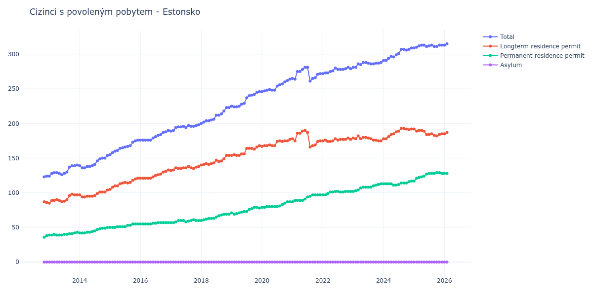

# Estonsko

## Souhrnné statistiky (Min/Max pro rok) / Summary Statistics (Min/Max per year)

| Year   | Total     | Longterm Residence Permit   | Permanent Residence Permit   | Asylum   |
|--------|-----------|-----------------------------|------------------------------|----------|
| 2012   | 123 / 124 | 86 / 87                     | 36 / 38                      | 0 / 0    |
| 2013   | 124 / 140 | 85 / 98                     | 39 / 43                      | 0 / 0    |
| 2014   | 136 / 154 | 94 / 104                    | 42 / 50                      | 0 / 0    |
| 2015   | 155 / 176 | 105 / 121                   | 50 / 55                      | 0 / 0    |
| 2016   | 176 / 190 | 121 / 133                   | 55 / 57                      | 0 / 0    |
| 2017   | 189 / 198 | 132 / 138                   | 57 / 61                      | 0 / 0    |
| 2018   | 200 / 223 | 140 / 154                   | 60 / 69                      | 0 / 0    |
| 2019   | 224 / 246 | 154 / 168                   | 69 / 79                      | 0 / 0    |
| 2020   | 246 / 264 | 167 / 177                   | 79 / 87                      | 0 / 0    |
| 2021   | 261 / 281 | 166 / 190                   | 87 / 97                      | 0 / 0    |
| 2022   | 272 / 281 | 174 / 179                   | 97 / 102                     | 0 / 0    |
| 2023   | 281 / 288 | 175 / 182                   | 102 / 113                    | 0 / 0    |
| 2024   | 291 / 309 | 178 / 193                   | 111 / 117                    | 0 / 0    |
| 2025   | 309 / 313 | 182 / 192                   | 117 / 129                    | 0 / 0    |
| 2026   | 313 / 315 | 185 / 187                   | 128 / 128                    | 0 / 0    |

## Detailní tabulka / Detailed Data Table

| Date     | Total        | Longterm Residence Permit   | Permanent Residence Permit   | Asylum   |
|----------|--------------|-----------------------------|------------------------------|----------|
| **2012** |              |                             |                              |          |
| 11.2012  | 123          | 87                          | 36                           | 0        |
| 12.2012  | 124 (+0.81%) | 86 (-1.15%)                 | 38 (+5.56%)                  | 0        |
| **2013** |              |                             |                              |          |
| 01.2013  | 124 (+0.00%) | 85 (-1.16%)                 | 39 (+2.63%)                  | 0        |
| 02.2013  | 128 (+3.23%) | 89 (+4.71%)                 | 39 (+0.00%)                  | 0        |
| 03.2013  | 129 (+0.78%) | 89 (+0.00%)                 | 40 (+2.56%)                  | 0        |
| 04.2013  | 129 (+0.00%) | 90 (+1.12%)                 | 39 (-2.50%)                  | 0        |
| 05.2013  | 128 (-0.78%) | 89 (-1.11%)                 | 39 (+0.00%)                  | 0        |
| 06.2013  | 126 (-1.56%) | 87 (-2.25%)                 | 39 (+0.00%)                  | 0        |
| 07.2013  | 128 (+1.59%) | 88 (+1.15%)                 | 40 (+2.56%)                  | 0        |
| 08.2013  | 130 (+1.56%) | 90 (+2.27%)                 | 40 (+0.00%)                  | 0        |
| 09.2013  | 137 (+5.38%) | 96 (+6.67%)                 | 41 (+2.50%)                  | 0        |
| 10.2013  | 139 (+1.46%) | 98 (+2.08%)                 | 41 (+0.00%)                  | 0        |
| 11.2013  | 139 (+0.00%) | 97 (-1.02%)                 | 42 (+2.44%)                  | 0        |
| 12.2013  | 140 (+0.72%) | 97 (+0.00%)                 | 43 (+2.38%)                  | 0        |
| **2014** |              |                             |                              |          |
| 01.2014  | 139 (-0.71%) | 97 (+0.00%)                 | 42 (-2.33%)                  | 0        |
| 02.2014  | 136 (-2.16%) | 94 (-3.09%)                 | 42 (+0.00%)                  | 0        |
| 03.2014  | 136 (+0.00%) | 94 (+0.00%)                 | 42 (+0.00%)                  | 0        |
| 04.2014  | 138 (+1.47%) | 95 (+1.06%)                 | 43 (+2.38%)                  | 0        |
| 05.2014  | 138 (+0.00%) | 95 (+0.00%)                 | 43 (+0.00%)                  | 0        |
| 06.2014  | 139 (+0.72%) | 95 (+0.00%)                 | 44 (+2.33%)                  | 0        |
| 07.2014  | 141 (+1.44%) | 96 (+1.05%)                 | 45 (+2.27%)                  | 0        |
| 08.2014  | 146 (+3.55%) | 99 (+3.12%)                 | 47 (+4.44%)                  | 0        |
| 09.2014  | 149 (+2.05%) | 101 (+2.02%)                | 48 (+2.13%)                  | 0        |
| 10.2014  | 150 (+0.67%) | 101 (+0.00%)                | 49 (+2.08%)                  | 0        |
| 11.2014  | 150 (+0.00%) | 101 (+0.00%)                | 49 (+0.00%)                  | 0        |
| 12.2014  | 154 (+2.67%) | 104 (+2.97%)                | 50 (+2.04%)                  | 0        |
| **2015** |              |                             |                              |          |
| 01.2015  | 155 (+0.65%) | 105 (+0.96%)                | 50 (+0.00%)                  | 0        |
| 02.2015  | 158 (+1.94%) | 108 (+2.86%)                | 50 (+0.00%)                  | 0        |
| 03.2015  | 160 (+1.27%) | 110 (+1.85%)                | 50 (+0.00%)                  | 0        |
| 04.2015  | 161 (+0.63%) | 110 (+0.00%)                | 51 (+2.00%)                  | 0        |
| 05.2015  | 164 (+1.86%) | 113 (+2.73%)                | 51 (+0.00%)                  | 0        |
| 06.2015  | 165 (+0.61%) | 114 (+0.88%)                | 51 (+0.00%)                  | 0        |
| 07.2015  | 166 (+0.61%) | 115 (+0.88%)                | 51 (+0.00%)                  | 0        |
| 08.2015  | 167 (+0.60%) | 114 (-0.87%)                | 53 (+3.92%)                  | 0        |
| 09.2015  | 168 (+0.60%) | 115 (+0.88%)                | 53 (+0.00%)                  | 0        |
| 10.2015  | 173 (+2.98%) | 118 (+2.61%)                | 55 (+3.77%)                  | 0        |
| 11.2015  | 175 (+1.16%) | 120 (+1.69%)                | 55 (+0.00%)                  | 0        |
| 12.2015  | 176 (+0.57%) | 121 (+0.83%)                | 55 (+0.00%)                  | 0        |
| **2016** |              |                             |                              |          |
| 01.2016  | 176 (+0.00%) | 121 (+0.00%)                | 55 (+0.00%)                  | 0        |
| 02.2016  | 176 (+0.00%) | 121 (+0.00%)                | 55 (+0.00%)                  | 0        |
| 03.2016  | 176 (+0.00%) | 121 (+0.00%)                | 55 (+0.00%)                  | 0        |
| 04.2016  | 176 (+0.00%) | 121 (+0.00%)                | 55 (+0.00%)                  | 0        |
| 05.2016  | 176 (+0.00%) | 121 (+0.00%)                | 55 (+0.00%)                  | 0        |
| 06.2016  | 179 (+1.70%) | 123 (+1.65%)                | 56 (+1.82%)                  | 0        |
| 07.2016  | 181 (+1.12%) | 125 (+1.63%)                | 56 (+0.00%)                  | 0        |
| 08.2016  | 183 (+1.10%) | 126 (+0.80%)                | 57 (+1.79%)                  | 0        |
| 09.2016  | 184 (+0.55%) | 127 (+0.79%)                | 57 (+0.00%)                  | 0        |
| 10.2016  | 187 (+1.63%) | 130 (+2.36%)                | 57 (+0.00%)                  | 0        |
| 11.2016  | 188 (+0.53%) | 131 (+0.77%)                | 57 (+0.00%)                  | 0        |
| 12.2016  | 190 (+1.06%) | 133 (+1.53%)                | 57 (+0.00%)                  | 0        |
| **2017** |              |                             |                              |          |
| 01.2017  | 189 (-0.53%) | 132 (-0.75%)                | 57 (+0.00%)                  | 0        |
| 02.2017  | 190 (+0.53%) | 133 (+0.76%)                | 57 (+0.00%)                  | 0        |
| 03.2017  | 194 (+2.11%) | 136 (+2.26%)                | 58 (+1.75%)                  | 0        |
| 04.2017  | 195 (+0.52%) | 135 (-0.74%)                | 60 (+3.45%)                  | 0        |
| 05.2017  | 195 (+0.00%) | 135 (+0.00%)                | 60 (+0.00%)                  | 0        |
| 06.2017  | 196 (+0.51%) | 136 (+0.74%)                | 60 (+0.00%)                  | 0        |
| 07.2017  | 194 (-1.02%) | 136 (+0.00%)                | 58 (-3.33%)                  | 0        |
| 08.2017  | 197 (+1.55%) | 138 (+1.47%)                | 59 (+1.72%)                  | 0        |
| 09.2017  | 196 (-0.51%) | 136 (-1.45%)                | 60 (+1.69%)                  | 0        |
| 10.2017  | 196 (+0.00%) | 135 (-0.74%)                | 61 (+1.67%)                  | 0        |
| 11.2017  | 197 (+0.51%) | 137 (+1.48%)                | 60 (-1.64%)                  | 0        |
| 12.2017  | 198 (+0.51%) | 138 (+0.73%)                | 60 (+0.00%)                  | 0        |
| **2018** |              |                             |                              |          |
| 01.2018  | 200 (+1.01%) | 140 (+1.45%)                | 60 (+0.00%)                  | 0        |
| 02.2018  | 202 (+1.00%) | 141 (+0.71%)                | 61 (+1.67%)                  | 0        |
| 03.2018  | 204 (+0.99%) | 142 (+0.71%)                | 62 (+1.64%)                  | 0        |
| 04.2018  | 204 (+0.00%) | 141 (-0.70%)                | 63 (+1.61%)                  | 0        |
| 05.2018  | 205 (+0.49%) | 142 (+0.71%)                | 63 (+0.00%)                  | 0        |
| 06.2018  | 206 (+0.49%) | 143 (+0.70%)                | 63 (+0.00%)                  | 0        |
| 07.2018  | 212 (+2.91%) | 147 (+2.80%)                | 65 (+3.17%)                  | 0        |
| 08.2018  | 212 (+0.00%) | 145 (-1.36%)                | 67 (+3.08%)                  | 0        |
| 09.2018  | 214 (+0.94%) | 146 (+0.69%)                | 68 (+1.49%)                  | 0        |
| 10.2018  | 218 (+1.87%) | 149 (+2.05%)                | 69 (+1.47%)                  | 0        |
| 11.2018  | 223 (+2.29%) | 154 (+3.36%)                | 69 (+0.00%)                  | 0        |
| 12.2018  | 223 (+0.00%) | 154 (+0.00%)                | 69 (+0.00%)                  | 0        |
| **2019** |              |                             |                              |          |
| 01.2019  | 225 (+0.90%) | 154 (+0.00%)                | 71 (+2.90%)                  | 0        |
| 02.2019  | 224 (-0.44%) | 155 (+0.65%)                | 69 (-2.82%)                  | 0        |
| 03.2019  | 224 (+0.00%) | 154 (-0.65%)                | 70 (+1.45%)                  | 0        |
| 04.2019  | 225 (+0.45%) | 154 (+0.00%)                | 71 (+1.43%)                  | 0        |
| 05.2019  | 228 (+1.33%) | 156 (+1.30%)                | 72 (+1.41%)                  | 0        |
| 06.2019  | 229 (+0.44%) | 156 (+0.00%)                | 73 (+1.39%)                  | 0        |
| 07.2019  | 237 (+3.49%) | 164 (+5.13%)                | 73 (+0.00%)                  | 0        |
| 08.2019  | 240 (+1.27%) | 164 (+0.00%)                | 76 (+4.11%)                  | 0        |
| 09.2019  | 241 (+0.42%) | 164 (+0.00%)                | 77 (+1.32%)                  | 0        |
| 10.2019  | 242 (+0.41%) | 163 (-0.61%)                | 79 (+2.60%)                  | 0        |
| 11.2019  | 245 (+1.24%) | 166 (+1.84%)                | 79 (+0.00%)                  | 0        |
| 12.2019  | 246 (+0.41%) | 168 (+1.20%)                | 78 (-1.27%)                  | 0        |
| **2020** |              |                             |                              |          |
| 01.2020  | 246 (+0.00%) | 167 (-0.60%)                | 79 (+1.28%)                  | 0        |
| 02.2020  | 247 (+0.41%) | 168 (+0.60%)                | 79 (+0.00%)                  | 0        |
| 03.2020  | 248 (+0.40%) | 168 (+0.00%)                | 80 (+1.27%)                  | 0        |
| 04.2020  | 249 (+0.40%) | 169 (+0.60%)                | 80 (+0.00%)                  | 0        |
| 05.2020  | 248 (-0.40%) | 168 (-0.59%)                | 80 (+0.00%)                  | 0        |
| 06.2020  | 248 (+0.00%) | 168 (+0.00%)                | 80 (+0.00%)                  | 0        |
| 07.2020  | 254 (+2.42%) | 174 (+3.57%)                | 80 (+0.00%)                  | 0        |
| 08.2020  | 256 (+0.79%) | 175 (+0.57%)                | 81 (+1.25%)                  | 0        |
| 09.2020  | 257 (+0.39%) | 174 (-0.57%)                | 83 (+2.47%)                  | 0        |
| 10.2020  | 260 (+1.17%) | 175 (+0.57%)                | 85 (+2.41%)                  | 0        |
| 11.2020  | 262 (+0.77%) | 175 (+0.00%)                | 87 (+2.35%)                  | 0        |
| 12.2020  | 264 (+0.76%) | 177 (+1.14%)                | 87 (+0.00%)                  | 0        |
| **2021** |              |                             |                              |          |
| 01.2021  | 265 (+0.38%) | 178 (+0.56%)                | 87 (+0.00%)                  | 0        |
| 02.2021  | 264 (-0.38%) | 175 (-1.69%)                | 89 (+2.30%)                  | 0        |
| 03.2021  | 275 (+4.17%) | 186 (+6.29%)                | 89 (+0.00%)                  | 0        |
| 04.2021  | 275 (+0.00%) | 186 (+0.00%)                | 89 (+0.00%)                  | 0        |
| 05.2021  | 278 (+1.09%) | 189 (+1.61%)                | 89 (+0.00%)                  | 0        |
| 06.2021  | 281 (+1.08%) | 190 (+0.53%)                | 91 (+2.25%)                  | 0        |
| 07.2021  | 281 (+0.00%) | 187 (-1.58%)                | 94 (+3.30%)                  | 0        |
| 08.2021  | 261 (-7.12%) | 166 (-11.23%)               | 95 (+1.06%)                  | 0        |
| 09.2021  | 265 (+1.53%) | 168 (+1.20%)                | 97 (+2.11%)                  | 0        |
| 10.2021  | 266 (+0.38%) | 169 (+0.60%)                | 97 (+0.00%)                  | 0        |
| 11.2021  | 271 (+1.88%) | 174 (+2.96%)                | 97 (+0.00%)                  | 0        |
| 12.2021  | 272 (+0.37%) | 175 (+0.57%)                | 97 (+0.00%)                  | 0        |
| **2022** |              |                             |                              |          |
| 01.2022  | 272 (+0.00%) | 175 (+0.00%)                | 97 (+0.00%)                  | 0        |
| 02.2022  | 273 (+0.37%) | 176 (+0.57%)                | 97 (+0.00%)                  | 0        |
| 03.2022  | 273 (+0.00%) | 174 (-1.14%)                | 99 (+2.06%)                  | 0        |
| 04.2022  | 275 (+0.73%) | 174 (+0.00%)                | 101 (+2.02%)                 | 0        |
| 05.2022  | 276 (+0.36%) | 175 (+0.57%)                | 101 (+0.00%)                 | 0        |
| 06.2022  | 280 (+1.45%) | 178 (+1.71%)                | 102 (+0.99%)                 | 0        |
| 07.2022  | 278 (-0.71%) | 176 (-1.12%)                | 102 (+0.00%)                 | 0        |
| 08.2022  | 278 (+0.00%) | 177 (+0.57%)                | 101 (-0.98%)                 | 0        |
| 09.2022  | 278 (+0.00%) | 177 (+0.00%)                | 101 (+0.00%)                 | 0        |
| 10.2022  | 279 (+0.36%) | 177 (+0.00%)                | 102 (+0.99%)                 | 0        |
| 11.2022  | 281 (+0.72%) | 179 (+1.13%)                | 102 (+0.00%)                 | 0        |
| 12.2022  | 279 (-0.71%) | 177 (-1.12%)                | 102 (+0.00%)                 | 0        |
| **2023** |              |                             |                              |          |
| 01.2023  | 281 (+0.72%) | 179 (+1.13%)                | 102 (+0.00%)                 | 0        |
| 02.2023  | 281 (+0.00%) | 178 (-0.56%)                | 103 (+0.98%)                 | 0        |
| 03.2023  | 286 (+1.78%) | 182 (+2.25%)                | 104 (+0.97%)                 | 0        |
| 04.2023  | 285 (-0.35%) | 178 (-2.20%)                | 107 (+2.88%)                 | 0        |
| 05.2023  | 288 (+1.05%) | 180 (+1.12%)                | 108 (+0.93%)                 | 0        |
| 06.2023  | 288 (+0.00%) | 180 (+0.00%)                | 108 (+0.00%)                 | 0        |
| 07.2023  | 287 (-0.35%) | 179 (-0.56%)                | 108 (+0.00%)                 | 0        |
| 08.2023  | 286 (-0.35%) | 178 (-0.56%)                | 108 (+0.00%)                 | 0        |
| 09.2023  | 286 (+0.00%) | 176 (-1.12%)                | 110 (+1.85%)                 | 0        |
| 10.2023  | 287 (+0.35%) | 176 (+0.00%)                | 111 (+0.91%)                 | 0        |
| 11.2023  | 287 (+0.00%) | 175 (-0.57%)                | 112 (+0.90%)                 | 0        |
| 12.2023  | 288 (+0.35%) | 175 (+0.00%)                | 113 (+0.89%)                 | 0        |
| **2024** |              |                             |                              |          |
| 01.2024  | 291 (+1.04%) | 178 (+1.71%)                | 113 (+0.00%)                 | 0        |
| 02.2024  | 291 (+0.00%) | 178 (+0.00%)                | 113 (+0.00%)                 | 0        |
| 03.2024  | 294 (+1.03%) | 181 (+1.69%)                | 113 (+0.00%)                 | 0        |
| 04.2024  | 297 (+1.02%) | 184 (+1.66%)                | 113 (+0.00%)                 | 0        |
| 05.2024  | 296 (-0.34%) | 185 (+0.54%)                | 111 (-1.77%)                 | 0        |
| 06.2024  | 299 (+1.01%) | 188 (+1.62%)                | 111 (+0.00%)                 | 0        |
| 07.2024  | 301 (+0.67%) | 189 (+0.53%)                | 112 (+0.90%)                 | 0        |
| 08.2024  | 307 (+1.99%) | 193 (+2.12%)                | 114 (+1.79%)                 | 0        |
| 09.2024  | 307 (+0.00%) | 193 (+0.00%)                | 114 (+0.00%)                 | 0        |
| 10.2024  | 306 (-0.33%) | 192 (-0.52%)                | 114 (+0.00%)                 | 0        |
| 11.2024  | 307 (+0.33%) | 191 (-0.52%)                | 116 (+1.75%)                 | 0        |
| 12.2024  | 309 (+0.65%) | 192 (+0.52%)                | 117 (+0.86%)                 | 0        |
| **2025** |              |                             |                              |          |
| 01.2025  | 309 (+0.00%) | 192 (+0.00%)                | 117 (+0.00%)                 | 0        |
| 02.2025  | 310 (+0.32%) | 189 (-1.56%)                | 121 (+3.42%)                 | 0        |
| 03.2025  | 312 (+0.65%) | 190 (+0.53%)                | 122 (+0.83%)                 | 0        |
| 04.2025  | 313 (+0.32%) | 190 (+0.00%)                | 123 (+0.82%)                 | 0        |
| 05.2025  | 313 (+0.00%) | 189 (-0.53%)                | 124 (+0.81%)                 | 0        |
| 06.2025  | 311 (-0.64%) | 184 (-2.65%)                | 127 (+2.42%)                 | 0        |
| 07.2025  | 312 (+0.32%) | 184 (+0.00%)                | 128 (+0.79%)                 | 0        |
| 08.2025  | 313 (+0.32%) | 185 (+0.54%)                | 128 (+0.00%)                 | 0        |
| 09.2025  | 311 (-0.64%) | 183 (-1.08%)                | 128 (+0.00%)                 | 0        |
| 10.2025  | 311 (+0.00%) | 182 (-0.55%)                | 129 (+0.78%)                 | 0        |
| 11.2025  | 313 (+0.64%) | 184 (+1.10%)                | 129 (+0.00%)                 | 0        |
| 12.2025  | 313 (+0.00%) | 185 (+0.54%)                | 128 (-0.78%)                 | 0        |
| **2026** |              |                             |                              |          |
| 01.2026  | 313 (+0.00%) | 185 (+0.00%)                | 128 (+0.00%)                 | 0        |
| 02.2026  | 315 (+0.64%) | 187 (+1.08%)                | 128 (+0.00%)                 | 0        |
