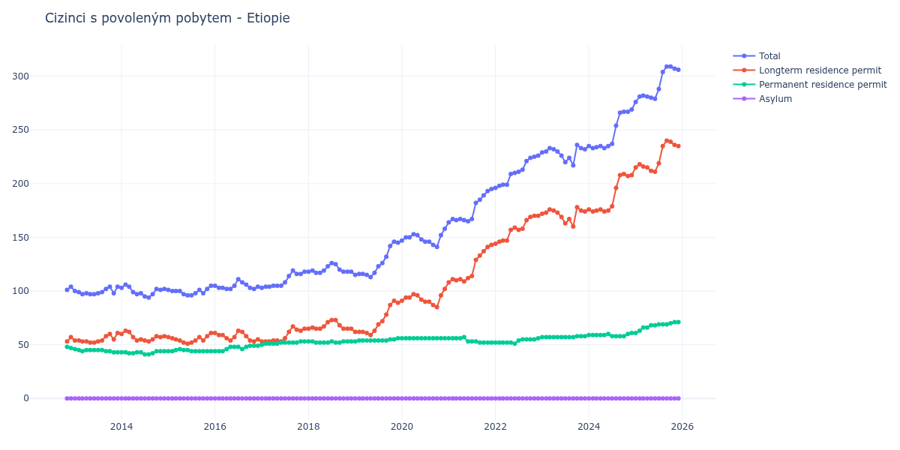

# Etiopie

## Souhrnné statistiky (Min/Max pro rok) / Summary Statistics (Min/Max per year)

| Year   | Total Min/Max   | Longterm Residence Permit Min/Max   | Permanent Residence Permit Min/Max   | Asylum Min/Max   |
|--------|-----------------|-------------------------------------|--------------------------------------|------------------|
| 2012   | 101 / 104       | 53 / 57                             | 47 / 48                              | 0 / 0            |
| 2013   | 97 / 104        | 52 / 61                             | 43 / 46                              | 0 / 0            |
| 2014   | 94 / 106        | 53 / 63                             | 41 / 44                              | 0 / 0            |
| 2015   | 96 / 105        | 51 / 61                             | 44 / 46                              | 0 / 0            |
| 2016   | 102 / 111       | 53 / 63                             | 44 / 49                              | 0 / 0            |
| 2017   | 103 / 119       | 53 / 67                             | 50 / 53                              | 0 / 0            |
| 2018   | 117 / 126       | 65 / 73                             | 52 / 53                              | 0 / 0            |
| 2019   | 113 / 146       | 59 / 91                             | 53 / 56                              | 0 / 0            |
| 2020   | 141 / 158       | 85 / 102                            | 56 / 56                              | 0 / 0            |
| 2021   | 164 / 195       | 108 / 143                           | 52 / 57                              | 0 / 0            |
| 2022   | 196 / 226       | 144 / 170                           | 51 / 56                              | 0 / 0            |
| 2023   | 217 / 236       | 160 / 178                           | 57 / 58                              | 0 / 0            |
| 2024   | 233 / 269       | 174 / 209                           | 58 / 61                              | 0 / 0            |
| 2025   | 276 / 309       | 211 / 240                           | 61 / 71                              | 0 / 0            |

## Detailní tabulka / Detailed Data Table

| Date     | Total        | Longterm Residence Permit   | Permanent Residence Permit   | Asylum   |
|----------|--------------|-----------------------------|------------------------------|----------|
| **2012** |              |                             |                              |          |
| 11.2012  | 101          | 53                          | 48                           | 0        |
| 12.2012  | 104 (+2.97%) | 57 (+7.55%)                 | 47 (-2.08%)                  | 0        |
| **2013** |              |                             |                              |          |
| 01.2013  | 100 (-3.85%) | 54 (-5.26%)                 | 46 (-2.13%)                  | 0        |
| 02.2013  | 99 (-1.00%)  | 54 (+0.00%)                 | 45 (-2.17%)                  | 0        |
| 03.2013  | 97 (-2.02%)  | 53 (-1.85%)                 | 44 (-2.22%)                  | 0        |
| 04.2013  | 98 (+1.03%)  | 53 (+0.00%)                 | 45 (+2.27%)                  | 0        |
| 05.2013  | 97 (-1.02%)  | 52 (-1.89%)                 | 45 (+0.00%)                  | 0        |
| 06.2013  | 97 (+0.00%)  | 52 (+0.00%)                 | 45 (+0.00%)                  | 0        |
| 07.2013  | 98 (+1.03%)  | 53 (+1.92%)                 | 45 (+0.00%)                  | 0        |
| 08.2013  | 99 (+1.02%)  | 54 (+1.89%)                 | 45 (+0.00%)                  | 0        |
| 09.2013  | 102 (+3.03%) | 58 (+7.41%)                 | 44 (-2.22%)                  | 0        |
| 10.2013  | 104 (+1.96%) | 60 (+3.45%)                 | 44 (+0.00%)                  | 0        |
| 11.2013  | 98 (-5.77%)  | 55 (-8.33%)                 | 43 (-2.27%)                  | 0        |
| 12.2013  | 104 (+6.12%) | 61 (+10.91%)                | 43 (+0.00%)                  | 0        |
| **2014** |              |                             |                              |          |
| 01.2014  | 103 (-0.96%) | 60 (-1.64%)                 | 43 (+0.00%)                  | 0        |
| 02.2014  | 106 (+2.91%) | 63 (+5.00%)                 | 43 (+0.00%)                  | 0        |
| 03.2014  | 104 (-1.89%) | 62 (-1.59%)                 | 42 (-2.33%)                  | 0        |
| 04.2014  | 99 (-4.81%)  | 57 (-8.06%)                 | 42 (+0.00%)                  | 0        |
| 05.2014  | 97 (-2.02%)  | 54 (-5.26%)                 | 43 (+2.38%)                  | 0        |
| 06.2014  | 98 (+1.03%)  | 55 (+1.85%)                 | 43 (+0.00%)                  | 0        |
| 07.2014  | 95 (-3.06%)  | 54 (-1.82%)                 | 41 (-4.65%)                  | 0        |
| 08.2014  | 94 (-1.05%)  | 53 (-1.85%)                 | 41 (+0.00%)                  | 0        |
| 09.2014  | 97 (+3.19%)  | 55 (+3.77%)                 | 42 (+2.44%)                  | 0        |
| 10.2014  | 102 (+5.15%) | 58 (+5.45%)                 | 44 (+4.76%)                  | 0        |
| 11.2014  | 101 (-0.98%) | 57 (-1.72%)                 | 44 (+0.00%)                  | 0        |
| 12.2014  | 102 (+0.99%) | 58 (+1.75%)                 | 44 (+0.00%)                  | 0        |
| **2015** |              |                             |                              |          |
| 01.2015  | 101 (-0.98%) | 57 (-1.72%)                 | 44 (+0.00%)                  | 0        |
| 02.2015  | 100 (-0.99%) | 56 (-1.75%)                 | 44 (+0.00%)                  | 0        |
| 03.2015  | 100 (+0.00%) | 55 (-1.79%)                 | 45 (+2.27%)                  | 0        |
| 04.2015  | 100 (+0.00%) | 54 (-1.82%)                 | 46 (+2.22%)                  | 0        |
| 05.2015  | 97 (-3.00%)  | 52 (-3.70%)                 | 45 (-2.17%)                  | 0        |
| 06.2015  | 96 (-1.03%)  | 51 (-1.92%)                 | 45 (+0.00%)                  | 0        |
| 07.2015  | 96 (+0.00%)  | 52 (+1.96%)                 | 44 (-2.22%)                  | 0        |
| 08.2015  | 98 (+2.08%)  | 54 (+3.85%)                 | 44 (+0.00%)                  | 0        |
| 09.2015  | 101 (+3.06%) | 57 (+5.56%)                 | 44 (+0.00%)                  | 0        |
| 10.2015  | 98 (-2.97%)  | 54 (-5.26%)                 | 44 (+0.00%)                  | 0        |
| 11.2015  | 102 (+4.08%) | 58 (+7.41%)                 | 44 (+0.00%)                  | 0        |
| 12.2015  | 105 (+2.94%) | 61 (+5.17%)                 | 44 (+0.00%)                  | 0        |
| **2016** |              |                             |                              |          |
| 01.2016  | 105 (+0.00%) | 61 (+0.00%)                 | 44 (+0.00%)                  | 0        |
| 02.2016  | 103 (-1.90%) | 59 (-3.28%)                 | 44 (+0.00%)                  | 0        |
| 03.2016  | 103 (+0.00%) | 59 (+0.00%)                 | 44 (+0.00%)                  | 0        |
| 04.2016  | 102 (-0.97%) | 56 (-5.08%)                 | 46 (+4.55%)                  | 0        |
| 05.2016  | 102 (+0.00%) | 54 (-3.57%)                 | 48 (+4.35%)                  | 0        |
| 06.2016  | 105 (+2.94%) | 57 (+5.56%)                 | 48 (+0.00%)                  | 0        |
| 07.2016  | 111 (+5.71%) | 63 (+10.53%)                | 48 (+0.00%)                  | 0        |
| 08.2016  | 108 (-2.70%) | 62 (-1.59%)                 | 46 (-4.17%)                  | 0        |
| 09.2016  | 106 (-1.85%) | 58 (-6.45%)                 | 48 (+4.35%)                  | 0        |
| 10.2016  | 103 (-2.83%) | 54 (-6.90%)                 | 49 (+2.08%)                  | 0        |
| 11.2016  | 102 (-0.97%) | 53 (-1.85%)                 | 49 (+0.00%)                  | 0        |
| 12.2016  | 104 (+1.96%) | 55 (+3.77%)                 | 49 (+0.00%)                  | 0        |
| **2017** |              |                             |                              |          |
| 01.2017  | 103 (-0.96%) | 53 (-3.64%)                 | 50 (+2.04%)                  | 0        |
| 02.2017  | 104 (+0.97%) | 53 (+0.00%)                 | 51 (+2.00%)                  | 0        |
| 03.2017  | 104 (+0.00%) | 53 (+0.00%)                 | 51 (+0.00%)                  | 0        |
| 04.2017  | 105 (+0.96%) | 54 (+1.89%)                 | 51 (+0.00%)                  | 0        |
| 05.2017  | 105 (+0.00%) | 54 (+0.00%)                 | 51 (+0.00%)                  | 0        |
| 06.2017  | 105 (+0.00%) | 53 (-1.85%)                 | 52 (+1.96%)                  | 0        |
| 07.2017  | 108 (+2.86%) | 56 (+5.66%)                 | 52 (+0.00%)                  | 0        |
| 08.2017  | 114 (+5.56%) | 62 (+10.71%)                | 52 (+0.00%)                  | 0        |
| 09.2017  | 119 (+4.39%) | 67 (+8.06%)                 | 52 (+0.00%)                  | 0        |
| 10.2017  | 116 (-2.52%) | 64 (-4.48%)                 | 52 (+0.00%)                  | 0        |
| 11.2017  | 116 (+0.00%) | 63 (-1.56%)                 | 53 (+1.92%)                  | 0        |
| 12.2017  | 118 (+1.72%) | 65 (+3.17%)                 | 53 (+0.00%)                  | 0        |
| **2018** |              |                             |                              |          |
| 01.2018  | 118 (+0.00%) | 65 (+0.00%)                 | 53 (+0.00%)                  | 0        |
| 02.2018  | 119 (+0.85%) | 66 (+1.54%)                 | 53 (+0.00%)                  | 0        |
| 03.2018  | 117 (-1.68%) | 65 (-1.52%)                 | 52 (-1.89%)                  | 0        |
| 04.2018  | 117 (+0.00%) | 65 (+0.00%)                 | 52 (+0.00%)                  | 0        |
| 05.2018  | 119 (+1.71%) | 67 (+3.08%)                 | 52 (+0.00%)                  | 0        |
| 06.2018  | 123 (+3.36%) | 71 (+5.97%)                 | 52 (+0.00%)                  | 0        |
| 07.2018  | 126 (+2.44%) | 73 (+2.82%)                 | 53 (+1.92%)                  | 0        |
| 08.2018  | 125 (-0.79%) | 73 (+0.00%)                 | 52 (-1.89%)                  | 0        |
| 09.2018  | 120 (-4.00%) | 68 (-6.85%)                 | 52 (+0.00%)                  | 0        |
| 10.2018  | 118 (-1.67%) | 65 (-4.41%)                 | 53 (+1.92%)                  | 0        |
| 11.2018  | 118 (+0.00%) | 65 (+0.00%)                 | 53 (+0.00%)                  | 0        |
| 12.2018  | 118 (+0.00%) | 65 (+0.00%)                 | 53 (+0.00%)                  | 0        |
| **2019** |              |                             |                              |          |
| 01.2019  | 115 (-2.54%) | 62 (-4.62%)                 | 53 (+0.00%)                  | 0        |
| 02.2019  | 116 (+0.87%) | 62 (+0.00%)                 | 54 (+1.89%)                  | 0        |
| 03.2019  | 116 (+0.00%) | 62 (+0.00%)                 | 54 (+0.00%)                  | 0        |
| 04.2019  | 115 (-0.86%) | 61 (-1.61%)                 | 54 (+0.00%)                  | 0        |
| 05.2019  | 113 (-1.74%) | 59 (-3.28%)                 | 54 (+0.00%)                  | 0        |
| 06.2019  | 117 (+3.54%) | 63 (+6.78%)                 | 54 (+0.00%)                  | 0        |
| 07.2019  | 123 (+5.13%) | 69 (+9.52%)                 | 54 (+0.00%)                  | 0        |
| 08.2019  | 126 (+2.44%) | 72 (+4.35%)                 | 54 (+0.00%)                  | 0        |
| 09.2019  | 132 (+4.76%) | 78 (+8.33%)                 | 54 (+0.00%)                  | 0        |
| 10.2019  | 142 (+7.58%) | 87 (+11.54%)                | 55 (+1.85%)                  | 0        |
| 11.2019  | 146 (+2.82%) | 91 (+4.60%)                 | 55 (+0.00%)                  | 0        |
| 12.2019  | 145 (-0.68%) | 89 (-2.20%)                 | 56 (+1.82%)                  | 0        |
| **2020** |              |                             |                              |          |
| 01.2020  | 147 (+1.38%) | 91 (+2.25%)                 | 56 (+0.00%)                  | 0        |
| 02.2020  | 150 (+2.04%) | 94 (+3.30%)                 | 56 (+0.00%)                  | 0        |
| 03.2020  | 150 (+0.00%) | 94 (+0.00%)                 | 56 (+0.00%)                  | 0        |
| 04.2020  | 153 (+2.00%) | 97 (+3.19%)                 | 56 (+0.00%)                  | 0        |
| 05.2020  | 152 (-0.65%) | 96 (-1.03%)                 | 56 (+0.00%)                  | 0        |
| 06.2020  | 148 (-2.63%) | 92 (-4.17%)                 | 56 (+0.00%)                  | 0        |
| 07.2020  | 146 (-1.35%) | 90 (-2.17%)                 | 56 (+0.00%)                  | 0        |
| 08.2020  | 146 (+0.00%) | 90 (+0.00%)                 | 56 (+0.00%)                  | 0        |
| 09.2020  | 143 (-2.05%) | 87 (-3.33%)                 | 56 (+0.00%)                  | 0        |
| 10.2020  | 141 (-1.40%) | 85 (-2.30%)                 | 56 (+0.00%)                  | 0        |
| 11.2020  | 152 (+7.80%) | 96 (+12.94%)                | 56 (+0.00%)                  | 0        |
| 12.2020  | 158 (+3.95%) | 102 (+6.25%)                | 56 (+0.00%)                  | 0        |
| **2021** |              |                             |                              |          |
| 01.2021  | 164 (+3.80%) | 108 (+5.88%)                | 56 (+0.00%)                  | 0        |
| 02.2021  | 167 (+1.83%) | 111 (+2.78%)                | 56 (+0.00%)                  | 0        |
| 03.2021  | 166 (-0.60%) | 110 (-0.90%)                | 56 (+0.00%)                  | 0        |
| 04.2021  | 167 (+0.60%) | 111 (+0.91%)                | 56 (+0.00%)                  | 0        |
| 05.2021  | 166 (-0.60%) | 109 (-1.80%)                | 57 (+1.79%)                  | 0        |
| 06.2021  | 165 (-0.60%) | 112 (+2.75%)                | 53 (-7.02%)                  | 0        |
| 07.2021  | 167 (+1.21%) | 114 (+1.79%)                | 53 (+0.00%)                  | 0        |
| 08.2021  | 182 (+8.98%) | 129 (+13.16%)               | 53 (+0.00%)                  | 0        |
| 09.2021  | 185 (+1.65%) | 133 (+3.10%)                | 52 (-1.89%)                  | 0        |
| 10.2021  | 189 (+2.16%) | 137 (+3.01%)                | 52 (+0.00%)                  | 0        |
| 11.2021  | 193 (+2.12%) | 141 (+2.92%)                | 52 (+0.00%)                  | 0        |
| 12.2021  | 195 (+1.04%) | 143 (+1.42%)                | 52 (+0.00%)                  | 0        |
| **2022** |              |                             |                              |          |
| 01.2022  | 196 (+0.51%) | 144 (+0.70%)                | 52 (+0.00%)                  | 0        |
| 02.2022  | 198 (+1.02%) | 146 (+1.39%)                | 52 (+0.00%)                  | 0        |
| 03.2022  | 199 (+0.51%) | 147 (+0.68%)                | 52 (+0.00%)                  | 0        |
| 04.2022  | 199 (+0.00%) | 147 (+0.00%)                | 52 (+0.00%)                  | 0        |
| 05.2022  | 209 (+5.03%) | 157 (+6.80%)                | 52 (+0.00%)                  | 0        |
| 06.2022  | 210 (+0.48%) | 159 (+1.27%)                | 51 (-1.92%)                  | 0        |
| 07.2022  | 211 (+0.48%) | 157 (-1.26%)                | 54 (+5.88%)                  | 0        |
| 08.2022  | 213 (+0.95%) | 158 (+0.64%)                | 55 (+1.85%)                  | 0        |
| 09.2022  | 221 (+3.76%) | 166 (+5.06%)                | 55 (+0.00%)                  | 0        |
| 10.2022  | 224 (+1.36%) | 169 (+1.81%)                | 55 (+0.00%)                  | 0        |
| 11.2022  | 225 (+0.45%) | 170 (+0.59%)                | 55 (+0.00%)                  | 0        |
| 12.2022  | 226 (+0.44%) | 170 (+0.00%)                | 56 (+1.82%)                  | 0        |
| **2023** |              |                             |                              |          |
| 01.2023  | 229 (+1.33%) | 172 (+1.18%)                | 57 (+1.79%)                  | 0        |
| 02.2023  | 230 (+0.44%) | 173 (+0.58%)                | 57 (+0.00%)                  | 0        |
| 03.2023  | 233 (+1.30%) | 176 (+1.73%)                | 57 (+0.00%)                  | 0        |
| 04.2023  | 232 (-0.43%) | 175 (-0.57%)                | 57 (+0.00%)                  | 0        |
| 05.2023  | 230 (-0.86%) | 173 (-1.14%)                | 57 (+0.00%)                  | 0        |
| 06.2023  | 226 (-1.74%) | 169 (-2.31%)                | 57 (+0.00%)                  | 0        |
| 07.2023  | 220 (-2.65%) | 163 (-3.55%)                | 57 (+0.00%)                  | 0        |
| 08.2023  | 224 (+1.82%) | 167 (+2.45%)                | 57 (+0.00%)                  | 0        |
| 09.2023  | 217 (-3.12%) | 160 (-4.19%)                | 57 (+0.00%)                  | 0        |
| 10.2023  | 236 (+8.76%) | 178 (+11.25%)               | 58 (+1.75%)                  | 0        |
| 11.2023  | 233 (-1.27%) | 175 (-1.69%)                | 58 (+0.00%)                  | 0        |
| 12.2023  | 232 (-0.43%) | 174 (-0.57%)                | 58 (+0.00%)                  | 0        |
| **2024** |              |                             |                              |          |
| 01.2024  | 235 (+1.29%) | 176 (+1.15%)                | 59 (+1.72%)                  | 0        |
| 02.2024  | 233 (-0.85%) | 174 (-1.14%)                | 59 (+0.00%)                  | 0        |
| 03.2024  | 234 (+0.43%) | 175 (+0.57%)                | 59 (+0.00%)                  | 0        |
| 04.2024  | 235 (+0.43%) | 176 (+0.57%)                | 59 (+0.00%)                  | 0        |
| 05.2024  | 233 (-0.85%) | 174 (-1.14%)                | 59 (+0.00%)                  | 0        |
| 06.2024  | 235 (+0.86%) | 175 (+0.57%)                | 60 (+1.69%)                  | 0        |
| 07.2024  | 237 (+0.85%) | 179 (+2.29%)                | 58 (-3.33%)                  | 0        |
| 08.2024  | 254 (+7.17%) | 196 (+9.50%)                | 58 (+0.00%)                  | 0        |
| 09.2024  | 266 (+4.72%) | 208 (+6.12%)                | 58 (+0.00%)                  | 0        |
| 10.2024  | 267 (+0.38%) | 209 (+0.48%)                | 58 (+0.00%)                  | 0        |
| 11.2024  | 267 (+0.00%) | 207 (-0.96%)                | 60 (+3.45%)                  | 0        |
| 12.2024  | 269 (+0.75%) | 208 (+0.48%)                | 61 (+1.67%)                  | 0        |
| **2025** |              |                             |                              |          |
| 01.2025  | 276 (+2.60%) | 215 (+3.37%)                | 61 (+0.00%)                  | 0        |
| 02.2025  | 281 (+1.81%) | 218 (+1.40%)                | 63 (+3.28%)                  | 0        |
| 03.2025  | 282 (+0.36%) | 216 (-0.92%)                | 66 (+4.76%)                  | 0        |
| 04.2025  | 281 (-0.35%) | 215 (-0.46%)                | 66 (+0.00%)                  | 0        |
| 05.2025  | 280 (-0.36%) | 212 (-1.40%)                | 68 (+3.03%)                  | 0        |
| 06.2025  | 279 (-0.36%) | 211 (-0.47%)                | 68 (+0.00%)                  | 0        |
| 07.2025  | 288 (+3.23%) | 219 (+3.79%)                | 69 (+1.47%)                  | 0        |
| 08.2025  | 304 (+5.56%) | 235 (+7.31%)                | 69 (+0.00%)                  | 0        |
| 09.2025  | 309 (+1.64%) | 240 (+2.13%)                | 69 (+0.00%)                  | 0        |
| 10.2025  | 309 (+0.00%) | 239 (-0.42%)                | 70 (+1.45%)                  | 0        |
| 11.2025  | 307 (-0.65%) | 236 (-1.26%)                | 71 (+1.43%)                  | 0        |
| 12.2025  | 306 (-0.33%) | 235 (-0.42%)                | 71 (+0.00%)                  | 0        |
