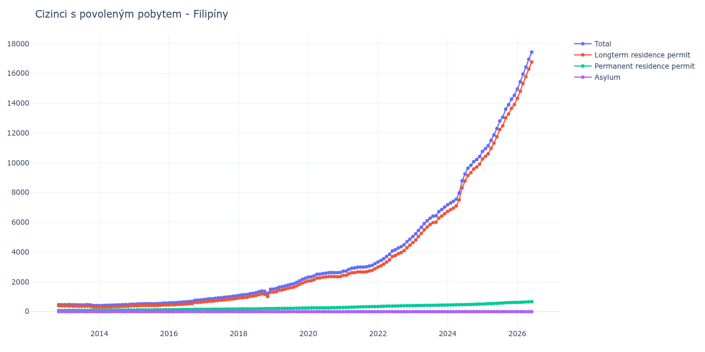

# Filipíny

## Souhrnné statistiky (Min/Max pro rok) / Summary Statistics (Min/Max per year)

| Year   | Total           | Longterm Residence Permit   | Permanent Residence Permit   | Asylum   |
|--------|-----------------|-----------------------------|------------------------------|----------|
| 2012   | 473 / 475       | 392 / 394                   | 81 / 81                      | 0 / 0    |
| 2013   | 409 / 476       | 313 / 390                   | 84 / 99                      | 0 / 0    |
| 2014   | 407 / 505       | 308 / 394                   | 99 / 111                     | 0 / 0    |
| 2015   | 504 / 580       | 391 / 446                   | 113 / 134                    | 0 / 0    |
| 2016   | 589 / 790       | 455 / 632                   | 134 / 158                    | 0 / 0    |
| 2017   | 816 / 1 059     | 657 / 877                   | 159 / 182                    | 0 / 0    |
| 2018   | 1 098 / 1 512   | 915 / 1 308                 | 183 / 205                    | 0 / 0    |
| 2019   | 1 517 / 2 250   | 1 306 / 2 003               | 211 / 247                    | 0 / 0    |
| 2020   | 2 321 / 2 631   | 2 071 / 2 360               | 250 / 278                    | 0 / 0    |
| 2021   | 2 716 / 3 230   | 2 435 / 2 884               | 281 / 346                    | 0 / 0    |
| 2022   | 3 341 / 4 864   | 2 992 / 4 460               | 349 / 404                    | 0 / 0    |
| 2023   | 5 044 / 7 026   | 4 636 / 6 583               | 408 / 443                    | 0 / 0    |
| 2024   | 7 186 / 10 418  | 6 739 / 9 910               | 447 / 508                    | 0 / 0    |
| 2025   | 10 770 / 14 530 | 10 257 / 13 912             | 513 / 618                    | 0 / 0    |
| 2026   | 14 955 / 17 437 | 14 331 / 16 771             | 624 / 666                    | 0 / 0    |

## Detailní tabulka / Detailed Data Table

| Date     | Total           | Longterm Residence Permit   | Permanent Residence Permit   | Asylum   |
|----------|-----------------|-----------------------------|------------------------------|----------|
| **2012** |                 |                             |                              |          |
| 11.2012  | 473             | 392                         | 81                           | 0        |
| 12.2012  | 475 (+0.42%)    | 394 (+0.51%)                | 81 (+0.00%)                  | 0        |
| **2013** |                 |                             |                              |          |
| 01.2013  | 473 (-0.42%)    | 389 (-1.27%)                | 84 (+3.70%)                  | 0        |
| 02.2013  | 476 (+0.63%)    | 390 (+0.26%)                | 86 (+2.38%)                  | 0        |
| 03.2013  | 473 (-0.63%)    | 384 (-1.54%)                | 89 (+3.49%)                  | 0        |
| 04.2013  | 463 (-2.11%)    | 374 (-2.60%)                | 89 (+0.00%)                  | 0        |
| 05.2013  | 459 (-0.86%)    | 370 (-1.07%)                | 89 (+0.00%)                  | 0        |
| 06.2013  | 457 (-0.44%)    | 368 (-0.54%)                | 89 (+0.00%)                  | 0        |
| 07.2013  | 454 (-0.66%)    | 365 (-0.82%)                | 89 (+0.00%)                  | 0        |
| 08.2013  | 458 (+0.88%)    | 367 (+0.55%)                | 91 (+2.25%)                  | 0        |
| 09.2013  | 468 (+2.18%)    | 375 (+2.18%)                | 93 (+2.20%)                  | 0        |
| 10.2013  | 449 (-4.06%)    | 354 (-5.60%)                | 95 (+2.15%)                  | 0        |
| 11.2013  | 409 (-8.91%)    | 313 (-11.58%)               | 96 (+1.05%)                  | 0        |
| 12.2013  | 415 (+1.47%)    | 316 (+0.96%)                | 99 (+3.12%)                  | 0        |
| **2014** |                 |                             |                              |          |
| 01.2014  | 407 (-1.93%)    | 308 (-2.53%)                | 99 (+0.00%)                  | 0        |
| 02.2014  | 411 (+0.98%)    | 310 (+0.65%)                | 101 (+2.02%)                 | 0        |
| 03.2014  | 421 (+2.43%)    | 316 (+1.94%)                | 105 (+3.96%)                 | 0        |
| 04.2014  | 436 (+3.56%)    | 330 (+4.43%)                | 106 (+0.95%)                 | 0        |
| 05.2014  | 436 (+0.00%)    | 330 (+0.00%)                | 106 (+0.00%)                 | 0        |
| 06.2014  | 439 (+0.69%)    | 331 (+0.30%)                | 108 (+1.89%)                 | 0        |
| 07.2014  | 449 (+2.28%)    | 339 (+2.42%)                | 110 (+1.85%)                 | 0        |
| 08.2014  | 457 (+1.78%)    | 347 (+2.36%)                | 110 (+0.00%)                 | 0        |
| 09.2014  | 470 (+2.84%)    | 359 (+3.46%)                | 111 (+0.91%)                 | 0        |
| 10.2014  | 476 (+1.28%)    | 365 (+1.67%)                | 111 (+0.00%)                 | 0        |
| 11.2014  | 476 (+0.00%)    | 365 (+0.00%)                | 111 (+0.00%)                 | 0        |
| 12.2014  | 505 (+6.09%)    | 394 (+7.95%)                | 111 (+0.00%)                 | 0        |
| **2015** |                 |                             |                              |          |
| 01.2015  | 504 (-0.20%)    | 391 (-0.76%)                | 113 (+1.80%)                 | 0        |
| 02.2015  | 514 (+1.98%)    | 397 (+1.53%)                | 117 (+3.54%)                 | 0        |
| 03.2015  | 521 (+1.36%)    | 402 (+1.26%)                | 119 (+1.71%)                 | 0        |
| 04.2015  | 530 (+1.73%)    | 409 (+1.74%)                | 121 (+1.68%)                 | 0        |
| 05.2015  | 528 (-0.38%)    | 406 (-0.73%)                | 122 (+0.83%)                 | 0        |
| 06.2015  | 538 (+1.89%)    | 416 (+2.46%)                | 122 (+0.00%)                 | 0        |
| 07.2015  | 535 (-0.56%)    | 412 (-0.96%)                | 123 (+0.82%)                 | 0        |
| 08.2015  | 536 (+0.19%)    | 406 (-1.46%)                | 130 (+5.69%)                 | 0        |
| 09.2015  | 544 (+1.49%)    | 414 (+1.97%)                | 130 (+0.00%)                 | 0        |
| 10.2015  | 555 (+2.02%)    | 424 (+2.42%)                | 131 (+0.77%)                 | 0        |
| 11.2015  | 573 (+3.24%)    | 441 (+4.01%)                | 132 (+0.76%)                 | 0        |
| 12.2015  | 580 (+1.22%)    | 446 (+1.13%)                | 134 (+1.52%)                 | 0        |
| **2016** |                 |                             |                              |          |
| 01.2016  | 589 (+1.55%)    | 455 (+2.02%)                | 134 (+0.00%)                 | 0        |
| 02.2016  | 598 (+1.53%)    | 463 (+1.76%)                | 135 (+0.75%)                 | 0        |
| 03.2016  | 603 (+0.84%)    | 465 (+0.43%)                | 138 (+2.22%)                 | 0        |
| 04.2016  | 624 (+3.48%)    | 482 (+3.66%)                | 142 (+2.90%)                 | 0        |
| 05.2016  | 635 (+1.76%)    | 491 (+1.87%)                | 144 (+1.41%)                 | 0        |
| 06.2016  | 647 (+1.89%)    | 502 (+2.24%)                | 145 (+0.69%)                 | 0        |
| 07.2016  | 662 (+2.32%)    | 515 (+2.59%)                | 147 (+1.38%)                 | 0        |
| 08.2016  | 680 (+2.72%)    | 530 (+2.91%)                | 150 (+2.04%)                 | 0        |
| 09.2016  | 691 (+1.62%)    | 540 (+1.89%)                | 151 (+0.67%)                 | 0        |
| 10.2016  | 769 (+11.29%)   | 616 (+14.07%)               | 153 (+1.32%)                 | 0        |
| 11.2016  | 776 (+0.91%)    | 619 (+0.49%)                | 157 (+2.61%)                 | 0        |
| 12.2016  | 790 (+1.80%)    | 632 (+2.10%)                | 158 (+0.64%)                 | 0        |
| **2017** |                 |                             |                              |          |
| 01.2017  | 816 (+3.29%)    | 657 (+3.96%)                | 159 (+0.63%)                 | 0        |
| 02.2017  | 838 (+2.70%)    | 677 (+3.04%)                | 161 (+1.26%)                 | 0        |
| 03.2017  | 865 (+3.22%)    | 703 (+3.84%)                | 162 (+0.62%)                 | 0        |
| 04.2017  | 868 (+0.35%)    | 704 (+0.14%)                | 164 (+1.23%)                 | 0        |
| 05.2017  | 895 (+3.11%)    | 730 (+3.69%)                | 165 (+0.61%)                 | 0        |
| 06.2017  | 927 (+3.58%)    | 761 (+4.25%)                | 166 (+0.61%)                 | 0        |
| 07.2017  | 934 (+0.76%)    | 766 (+0.66%)                | 168 (+1.20%)                 | 0        |
| 08.2017  | 963 (+3.10%)    | 792 (+3.39%)                | 171 (+1.79%)                 | 0        |
| 09.2017  | 982 (+1.97%)    | 805 (+1.64%)                | 177 (+3.51%)                 | 0        |
| 10.2017  | 1 006 (+2.44%)  | 829 (+2.98%)                | 177 (+0.00%)                 | 0        |
| 11.2017  | 1 037 (+3.08%)  | 858 (+3.50%)                | 179 (+1.13%)                 | 0        |
| 12.2017  | 1 059 (+2.12%)  | 877 (+2.21%)                | 182 (+1.68%)                 | 0        |
| **2018** |                 |                             |                              |          |
| 01.2018  | 1 098 (+3.68%)  | 915 (+4.33%)                | 183 (+0.55%)                 | 0        |
| 02.2018  | 1 120 (+2.00%)  | 934 (+2.08%)                | 186 (+1.64%)                 | 0        |
| 03.2018  | 1 138 (+1.61%)  | 951 (+1.82%)                | 187 (+0.54%)                 | 0        |
| 04.2018  | 1 153 (+1.32%)  | 967 (+1.68%)                | 186 (-0.53%)                 | 0        |
| 05.2018  | 1 208 (+4.77%)  | 1 020 (+5.48%)              | 188 (+1.08%)                 | 0        |
| 06.2018  | 1 233 (+2.07%)  | 1 041 (+2.06%)              | 192 (+2.13%)                 | 0        |
| 07.2018  | 1 270 (+3.00%)  | 1 079 (+3.65%)              | 191 (-0.52%)                 | 0        |
| 08.2018  | 1 335 (+5.12%)  | 1 142 (+5.84%)              | 193 (+1.05%)                 | 0        |
| 09.2018  | 1 387 (+3.90%)  | 1 189 (+4.12%)              | 198 (+2.59%)                 | 0        |
| 10.2018  | 1 362 (-1.80%)  | 1 159 (-2.52%)              | 203 (+2.53%)                 | 0        |
| 11.2018  | 1 223 (-10.21%) | 1 018 (-12.17%)             | 205 (+0.99%)                 | 0        |
| 12.2018  | 1 512 (+23.63%) | 1 308 (+28.49%)             | 204 (-0.49%)                 | 0        |
| **2019** |                 |                             |                              |          |
| 01.2019  | 1 517 (+0.33%)  | 1 306 (-0.15%)              | 211 (+3.43%)                 | 0        |
| 02.2019  | 1 558 (+2.70%)  | 1 344 (+2.91%)              | 214 (+1.42%)                 | 0        |
| 03.2019  | 1 650 (+5.91%)  | 1 434 (+6.70%)              | 216 (+0.93%)                 | 0        |
| 04.2019  | 1 673 (+1.39%)  | 1 454 (+1.39%)              | 219 (+1.39%)                 | 0        |
| 05.2019  | 1 728 (+3.29%)  | 1 508 (+3.71%)              | 220 (+0.46%)                 | 0        |
| 06.2019  | 1 788 (+3.47%)  | 1 565 (+3.78%)              | 223 (+1.36%)                 | 0        |
| 07.2019  | 1 835 (+2.63%)  | 1 609 (+2.81%)              | 226 (+1.35%)                 | 0        |
| 08.2019  | 1 873 (+2.07%)  | 1 643 (+2.11%)              | 230 (+1.77%)                 | 0        |
| 09.2019  | 1 967 (+5.02%)  | 1 732 (+5.42%)              | 235 (+2.17%)                 | 0        |
| 10.2019  | 2 070 (+5.24%)  | 1 831 (+5.72%)              | 239 (+1.70%)                 | 0        |
| 11.2019  | 2 175 (+5.07%)  | 1 932 (+5.52%)              | 243 (+1.67%)                 | 0        |
| 12.2019  | 2 250 (+3.45%)  | 2 003 (+3.67%)              | 247 (+1.65%)                 | 0        |
| **2020** |                 |                             |                              |          |
| 01.2020  | 2 321 (+3.16%)  | 2 071 (+3.39%)              | 250 (+1.21%)                 | 0        |
| 02.2020  | 2 332 (+0.47%)  | 2 079 (+0.39%)              | 253 (+1.20%)                 | 0        |
| 03.2020  | 2 405 (+3.13%)  | 2 152 (+3.51%)              | 253 (+0.00%)                 | 0        |
| 04.2020  | 2 512 (+4.45%)  | 2 256 (+4.83%)              | 256 (+1.19%)                 | 0        |
| 05.2020  | 2 523 (+0.44%)  | 2 267 (+0.49%)              | 256 (+0.00%)                 | 0        |
| 06.2020  | 2 566 (+1.70%)  | 2 311 (+1.94%)              | 255 (-0.39%)                 | 0        |
| 07.2020  | 2 579 (+0.51%)  | 2 321 (+0.43%)              | 258 (+1.18%)                 | 0        |
| 08.2020  | 2 617 (+1.47%)  | 2 356 (+1.51%)              | 261 (+1.16%)                 | 0        |
| 09.2020  | 2 626 (+0.34%)  | 2 360 (+0.17%)              | 266 (+1.92%)                 | 0        |
| 10.2020  | 2 624 (-0.08%)  | 2 354 (-0.25%)              | 270 (+1.50%)                 | 0        |
| 11.2020  | 2 618 (-0.23%)  | 2 343 (-0.47%)              | 275 (+1.85%)                 | 0        |
| 12.2020  | 2 631 (+0.50%)  | 2 353 (+0.43%)              | 278 (+1.09%)                 | 0        |
| **2021** |                 |                             |                              |          |
| 01.2021  | 2 716 (+3.23%)  | 2 435 (+3.48%)              | 281 (+1.08%)                 | 0        |
| 02.2021  | 2 733 (+0.63%)  | 2 445 (+0.41%)              | 288 (+2.49%)                 | 0        |
| 03.2021  | 2 838 (+3.84%)  | 2 546 (+4.13%)              | 292 (+1.39%)                 | 0        |
| 04.2021  | 2 917 (+2.78%)  | 2 616 (+2.75%)              | 301 (+3.08%)                 | 0        |
| 05.2021  | 2 934 (+0.58%)  | 2 624 (+0.31%)              | 310 (+2.99%)                 | 0        |
| 06.2021  | 2 985 (+1.74%)  | 2 666 (+1.60%)              | 319 (+2.90%)                 | 0        |
| 07.2021  | 2 995 (+0.34%)  | 2 670 (+0.15%)              | 325 (+1.88%)                 | 0        |
| 08.2021  | 2 992 (-0.10%)  | 2 662 (-0.30%)              | 330 (+1.54%)                 | 0        |
| 09.2021  | 3 017 (+0.84%)  | 2 683 (+0.79%)              | 334 (+1.21%)                 | 0        |
| 10.2021  | 3 067 (+1.66%)  | 2 730 (+1.75%)              | 337 (+0.90%)                 | 0        |
| 11.2021  | 3 117 (+1.63%)  | 2 775 (+1.65%)              | 342 (+1.48%)                 | 0        |
| 12.2021  | 3 230 (+3.63%)  | 2 884 (+3.93%)              | 346 (+1.17%)                 | 0        |
| **2022** |                 |                             |                              |          |
| 01.2022  | 3 341 (+3.44%)  | 2 992 (+3.74%)              | 349 (+0.87%)                 | 0        |
| 02.2022  | 3 440 (+2.96%)  | 3 086 (+3.14%)              | 354 (+1.43%)                 | 0        |
| 03.2022  | 3 553 (+3.28%)  | 3 188 (+3.31%)              | 365 (+3.11%)                 | 0        |
| 04.2022  | 3 703 (+4.22%)  | 3 333 (+4.55%)              | 370 (+1.37%)                 | 0        |
| 05.2022  | 3 852 (+4.02%)  | 3 478 (+4.35%)              | 374 (+1.08%)                 | 0        |
| 06.2022  | 4 079 (+5.89%)  | 3 700 (+6.38%)              | 379 (+1.34%)                 | 0        |
| 07.2022  | 4 162 (+2.03%)  | 3 778 (+2.11%)              | 384 (+1.32%)                 | 0        |
| 08.2022  | 4 276 (+2.74%)  | 3 887 (+2.89%)              | 389 (+1.30%)                 | 0        |
| 09.2022  | 4 360 (+1.96%)  | 3 968 (+2.08%)              | 392 (+0.77%)                 | 0        |
| 10.2022  | 4 496 (+3.12%)  | 4 099 (+3.30%)              | 397 (+1.28%)                 | 0        |
| 11.2022  | 4 701 (+4.56%)  | 4 298 (+4.85%)              | 403 (+1.51%)                 | 0        |
| 12.2022  | 4 864 (+3.47%)  | 4 460 (+3.77%)              | 404 (+0.25%)                 | 0        |
| **2023** |                 |                             |                              |          |
| 01.2023  | 5 044 (+3.70%)  | 4 636 (+3.95%)              | 408 (+0.99%)                 | 0        |
| 02.2023  | 5 227 (+3.63%)  | 4 817 (+3.90%)              | 410 (+0.49%)                 | 0        |
| 03.2023  | 5 461 (+4.48%)  | 5 048 (+4.80%)              | 413 (+0.73%)                 | 0        |
| 04.2023  | 5 674 (+3.90%)  | 5 260 (+4.20%)              | 414 (+0.24%)                 | 0        |
| 05.2023  | 5 917 (+4.28%)  | 5 497 (+4.51%)              | 420 (+1.45%)                 | 0        |
| 06.2023  | 6 105 (+3.18%)  | 5 682 (+3.37%)              | 423 (+0.71%)                 | 0        |
| 07.2023  | 6 274 (+2.77%)  | 5 848 (+2.92%)              | 426 (+0.71%)                 | 0        |
| 08.2023  | 6 412 (+2.20%)  | 5 984 (+2.33%)              | 428 (+0.47%)                 | 0        |
| 09.2023  | 6 446 (+0.53%)  | 6 012 (+0.47%)              | 434 (+1.40%)                 | 0        |
| 10.2023  | 6 717 (+4.20%)  | 6 281 (+4.47%)              | 436 (+0.46%)                 | 0        |
| 11.2023  | 6 867 (+2.23%)  | 6 428 (+2.34%)              | 439 (+0.69%)                 | 0        |
| 12.2023  | 7 026 (+2.32%)  | 6 583 (+2.41%)              | 443 (+0.91%)                 | 0        |
| **2024** |                 |                             |                              |          |
| 01.2024  | 7 186 (+2.28%)  | 6 739 (+2.37%)              | 447 (+0.90%)                 | 0        |
| 02.2024  | 7 303 (+1.63%)  | 6 851 (+1.66%)              | 452 (+1.12%)                 | 0        |
| 03.2024  | 7 416 (+1.55%)  | 6 960 (+1.59%)              | 456 (+0.88%)                 | 0        |
| 04.2024  | 7 558 (+1.91%)  | 7 099 (+2.00%)              | 459 (+0.66%)                 | 0        |
| 05.2024  | 7 968 (+5.42%)  | 7 503 (+5.69%)              | 465 (+1.31%)                 | 0        |
| 06.2024  | 8 783 (+10.23%) | 8 313 (+10.80%)             | 470 (+1.08%)                 | 0        |
| 07.2024  | 9 253 (+5.35%)  | 8 781 (+5.63%)              | 472 (+0.43%)                 | 0        |
| 08.2024  | 9 632 (+4.10%)  | 9 153 (+4.24%)              | 479 (+1.48%)                 | 0        |
| 09.2024  | 9 828 (+2.03%)  | 9 344 (+2.09%)              | 484 (+1.04%)                 | 0        |
| 10.2024  | 10 075 (+2.51%) | 9 585 (+2.58%)              | 490 (+1.24%)                 | 0        |
| 11.2024  | 10 220 (+1.44%) | 9 716 (+1.37%)              | 504 (+2.86%)                 | 0        |
| 12.2024  | 10 418 (+1.94%) | 9 910 (+2.00%)              | 508 (+0.79%)                 | 0        |
| **2025** |                 |                             |                              |          |
| 01.2025  | 10 770 (+3.38%) | 10 257 (+3.50%)             | 513 (+0.98%)                 | 0        |
| 02.2025  | 10 959 (+1.75%) | 10 432 (+1.71%)             | 527 (+2.73%)                 | 0        |
| 03.2025  | 11 138 (+1.63%) | 10 601 (+1.62%)             | 537 (+1.90%)                 | 0        |
| 04.2025  | 11 511 (+3.35%) | 10 971 (+3.49%)             | 540 (+0.56%)                 | 0        |
| 05.2025  | 11 872 (+3.14%) | 11 324 (+3.22%)             | 548 (+1.48%)                 | 0        |
| 06.2025  | 12 303 (+3.63%) | 11 744 (+3.71%)             | 559 (+2.01%)                 | 0        |
| 07.2025  | 12 811 (+4.13%) | 12 239 (+4.21%)             | 572 (+2.33%)                 | 0        |
| 08.2025  | 13 062 (+1.96%) | 12 483 (+1.99%)             | 579 (+1.22%)                 | 0        |
| 09.2025  | 13 607 (+4.17%) | 13 009 (+4.21%)             | 598 (+3.28%)                 | 0        |
| 10.2025  | 13 896 (+2.12%) | 13 284 (+2.11%)             | 612 (+2.34%)                 | 0        |
| 11.2025  | 14 276 (+2.73%) | 13 661 (+2.84%)             | 615 (+0.49%)                 | 0        |
| 12.2025  | 14 530 (+1.78%) | 13 912 (+1.84%)             | 618 (+0.49%)                 | 0        |
| **2026** |                 |                             |                              |          |
| 01.2026  | 14 955 (+2.92%) | 14 331 (+3.01%)             | 624 (+0.97%)                 | 0        |
| 02.2026  | 15 443 (+3.26%) | 14 811 (+3.35%)             | 632 (+1.28%)                 | 0        |
| 03.2026  | 15 959 (+3.34%) | 15 322 (+3.45%)             | 637 (+0.79%)                 | 0        |
| 04.2026  | 16 429 (+2.95%) | 15 783 (+3.01%)             | 646 (+1.41%)                 | 0        |
| 05.2026  | 16 952 (+3.18%) | 16 293 (+3.23%)             | 659 (+2.01%)                 | 0        |
| 06.2026  | 17 437 (+2.86%) | 16 771 (+2.93%)             | 666 (+1.06%)                 | 0        |
