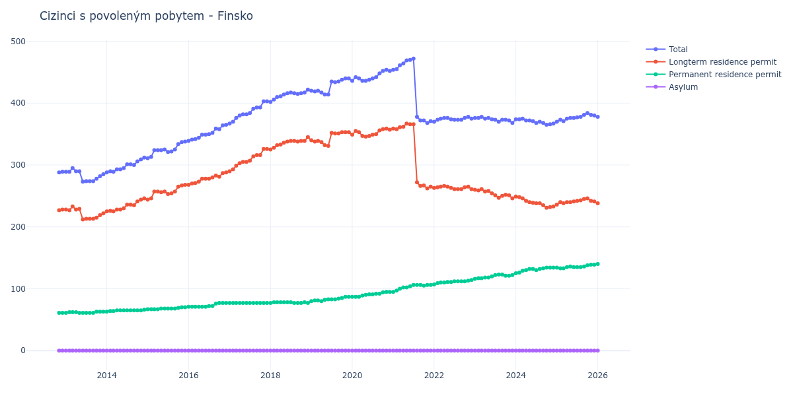

# Finsko

## Souhrnné statistiky (Min/Max pro rok) / Summary Statistics (Min/Max per year)

| Year   | Total     | Longterm Residence Permit   | Permanent Residence Permit   | Asylum   |
|--------|-----------|-----------------------------|------------------------------|----------|
| 2012   | 288 / 289 | 227 / 228                   | 61 / 61                      | 0 / 0    |
| 2013   | 273 / 295 | 212 / 233                   | 61 / 63                      | 0 / 0    |
| 2014   | 288 / 312 | 225 / 246                   | 63 / 66                      | 0 / 0    |
| 2015   | 311 / 338 | 244 / 268                   | 67 / 70                      | 0 / 0    |
| 2016   | 339 / 365 | 268 / 288                   | 71 / 77                      | 0 / 0    |
| 2017   | 367 / 403 | 290 / 326                   | 77 / 77                      | 0 / 0    |
| 2018   | 402 / 422 | 325 / 345                   | 77 / 78                      | 0 / 0    |
| 2019   | 414 / 440 | 331 / 353                   | 80 / 87                      | 0 / 0    |
| 2020   | 436 / 454 | 346 / 359                   | 87 / 95                      | 0 / 0    |
| 2021   | 368 / 472 | 262 / 367                   | 95 / 106                     | 0 / 0    |
| 2022   | 370 / 378 | 261 / 266                   | 107 / 114                    | 0 / 0    |
| 2023   | 368 / 378 | 246 / 261                   | 116 / 123                    | 0 / 0    |
| 2024   | 365 / 375 | 231 / 249                   | 125 / 134                    | 0 / 0    |
| 2025   | 370 / 384 | 236 / 246                   | 133 / 139                    | 0 / 0    |

## Detailní tabulka / Detailed Data Table

| Date     | Total         | Longterm Residence Permit   | Permanent Residence Permit   | Asylum   |
|----------|---------------|-----------------------------|------------------------------|----------|
| **2012** |               |                             |                              |          |
| 11.2012  | 288           | 227                         | 61                           | 0        |
| 12.2012  | 289 (+0.35%)  | 228 (+0.44%)                | 61 (+0.00%)                  | 0        |
| **2013** |               |                             |                              |          |
| 01.2013  | 289 (+0.00%)  | 228 (+0.00%)                | 61 (+0.00%)                  | 0        |
| 02.2013  | 289 (+0.00%)  | 227 (-0.44%)                | 62 (+1.64%)                  | 0        |
| 03.2013  | 295 (+2.08%)  | 233 (+2.64%)                | 62 (+0.00%)                  | 0        |
| 04.2013  | 290 (-1.69%)  | 228 (-2.15%)                | 62 (+0.00%)                  | 0        |
| 05.2013  | 290 (+0.00%)  | 229 (+0.44%)                | 61 (-1.61%)                  | 0        |
| 06.2013  | 273 (-5.86%)  | 212 (-7.42%)                | 61 (+0.00%)                  | 0        |
| 07.2013  | 274 (+0.37%)  | 213 (+0.47%)                | 61 (+0.00%)                  | 0        |
| 08.2013  | 274 (+0.00%)  | 213 (+0.00%)                | 61 (+0.00%)                  | 0        |
| 09.2013  | 274 (+0.00%)  | 213 (+0.00%)                | 61 (+0.00%)                  | 0        |
| 10.2013  | 278 (+1.46%)  | 215 (+0.94%)                | 63 (+3.28%)                  | 0        |
| 11.2013  | 282 (+1.44%)  | 219 (+1.86%)                | 63 (+0.00%)                  | 0        |
| 12.2013  | 285 (+1.06%)  | 222 (+1.37%)                | 63 (+0.00%)                  | 0        |
| **2014** |               |                             |                              |          |
| 01.2014  | 288 (+1.05%)  | 225 (+1.35%)                | 63 (+0.00%)                  | 0        |
| 02.2014  | 290 (+0.69%)  | 226 (+0.44%)                | 64 (+1.59%)                  | 0        |
| 03.2014  | 289 (-0.34%)  | 225 (-0.44%)                | 64 (+0.00%)                  | 0        |
| 04.2014  | 293 (+1.38%)  | 228 (+1.33%)                | 65 (+1.56%)                  | 0        |
| 05.2014  | 293 (+0.00%)  | 228 (+0.00%)                | 65 (+0.00%)                  | 0        |
| 06.2014  | 295 (+0.68%)  | 230 (+0.88%)                | 65 (+0.00%)                  | 0        |
| 07.2014  | 301 (+2.03%)  | 236 (+2.61%)                | 65 (+0.00%)                  | 0        |
| 08.2014  | 301 (+0.00%)  | 236 (+0.00%)                | 65 (+0.00%)                  | 0        |
| 09.2014  | 300 (-0.33%)  | 235 (-0.42%)                | 65 (+0.00%)                  | 0        |
| 10.2014  | 306 (+2.00%)  | 241 (+2.55%)                | 65 (+0.00%)                  | 0        |
| 11.2014  | 309 (+0.98%)  | 244 (+1.24%)                | 65 (+0.00%)                  | 0        |
| 12.2014  | 312 (+0.97%)  | 246 (+0.82%)                | 66 (+1.54%)                  | 0        |
| **2015** |               |                             |                              |          |
| 01.2015  | 311 (-0.32%)  | 244 (-0.81%)                | 67 (+1.52%)                  | 0        |
| 02.2015  | 313 (+0.64%)  | 246 (+0.82%)                | 67 (+0.00%)                  | 0        |
| 03.2015  | 324 (+3.51%)  | 257 (+4.47%)                | 67 (+0.00%)                  | 0        |
| 04.2015  | 324 (+0.00%)  | 257 (+0.00%)                | 67 (+0.00%)                  | 0        |
| 05.2015  | 324 (+0.00%)  | 256 (-0.39%)                | 68 (+1.49%)                  | 0        |
| 06.2015  | 325 (+0.31%)  | 257 (+0.39%)                | 68 (+0.00%)                  | 0        |
| 07.2015  | 321 (-1.23%)  | 253 (-1.56%)                | 68 (+0.00%)                  | 0        |
| 08.2015  | 322 (+0.31%)  | 254 (+0.40%)                | 68 (+0.00%)                  | 0        |
| 09.2015  | 325 (+0.93%)  | 257 (+1.18%)                | 68 (+0.00%)                  | 0        |
| 10.2015  | 334 (+2.77%)  | 265 (+3.11%)                | 69 (+1.47%)                  | 0        |
| 11.2015  | 337 (+0.90%)  | 267 (+0.75%)                | 70 (+1.45%)                  | 0        |
| 12.2015  | 338 (+0.30%)  | 268 (+0.37%)                | 70 (+0.00%)                  | 0        |
| **2016** |               |                             |                              |          |
| 01.2016  | 339 (+0.30%)  | 268 (+0.00%)                | 71 (+1.43%)                  | 0        |
| 02.2016  | 341 (+0.59%)  | 270 (+0.75%)                | 71 (+0.00%)                  | 0        |
| 03.2016  | 342 (+0.29%)  | 271 (+0.37%)                | 71 (+0.00%)                  | 0        |
| 04.2016  | 344 (+0.58%)  | 273 (+0.74%)                | 71 (+0.00%)                  | 0        |
| 05.2016  | 349 (+1.45%)  | 278 (+1.83%)                | 71 (+0.00%)                  | 0        |
| 06.2016  | 349 (+0.00%)  | 278 (+0.00%)                | 71 (+0.00%)                  | 0        |
| 07.2016  | 350 (+0.29%)  | 278 (+0.00%)                | 72 (+1.41%)                  | 0        |
| 08.2016  | 352 (+0.57%)  | 280 (+0.72%)                | 72 (+0.00%)                  | 0        |
| 09.2016  | 359 (+1.99%)  | 283 (+1.07%)                | 76 (+5.56%)                  | 0        |
| 10.2016  | 358 (-0.28%)  | 281 (-0.71%)                | 77 (+1.32%)                  | 0        |
| 11.2016  | 364 (+1.68%)  | 287 (+2.14%)                | 77 (+0.00%)                  | 0        |
| 12.2016  | 365 (+0.27%)  | 288 (+0.35%)                | 77 (+0.00%)                  | 0        |
| **2017** |               |                             |                              |          |
| 01.2017  | 367 (+0.55%)  | 290 (+0.69%)                | 77 (+0.00%)                  | 0        |
| 02.2017  | 370 (+0.82%)  | 293 (+1.03%)                | 77 (+0.00%)                  | 0        |
| 03.2017  | 376 (+1.62%)  | 299 (+2.05%)                | 77 (+0.00%)                  | 0        |
| 04.2017  | 380 (+1.06%)  | 303 (+1.34%)                | 77 (+0.00%)                  | 0        |
| 05.2017  | 382 (+0.53%)  | 305 (+0.66%)                | 77 (+0.00%)                  | 0        |
| 06.2017  | 382 (+0.00%)  | 305 (+0.00%)                | 77 (+0.00%)                  | 0        |
| 07.2017  | 384 (+0.52%)  | 307 (+0.66%)                | 77 (+0.00%)                  | 0        |
| 08.2017  | 391 (+1.82%)  | 314 (+2.28%)                | 77 (+0.00%)                  | 0        |
| 09.2017  | 393 (+0.51%)  | 316 (+0.64%)                | 77 (+0.00%)                  | 0        |
| 10.2017  | 393 (+0.00%)  | 316 (+0.00%)                | 77 (+0.00%)                  | 0        |
| 11.2017  | 403 (+2.54%)  | 326 (+3.16%)                | 77 (+0.00%)                  | 0        |
| 12.2017  | 403 (+0.00%)  | 326 (+0.00%)                | 77 (+0.00%)                  | 0        |
| **2018** |               |                             |                              |          |
| 01.2018  | 402 (-0.25%)  | 325 (-0.31%)                | 77 (+0.00%)                  | 0        |
| 02.2018  | 406 (+1.00%)  | 328 (+0.92%)                | 78 (+1.30%)                  | 0        |
| 03.2018  | 410 (+0.99%)  | 332 (+1.22%)                | 78 (+0.00%)                  | 0        |
| 04.2018  | 411 (+0.24%)  | 333 (+0.30%)                | 78 (+0.00%)                  | 0        |
| 05.2018  | 414 (+0.73%)  | 336 (+0.90%)                | 78 (+0.00%)                  | 0        |
| 06.2018  | 416 (+0.48%)  | 338 (+0.60%)                | 78 (+0.00%)                  | 0        |
| 07.2018  | 417 (+0.24%)  | 339 (+0.30%)                | 78 (+0.00%)                  | 0        |
| 08.2018  | 416 (-0.24%)  | 339 (+0.00%)                | 77 (-1.28%)                  | 0        |
| 09.2018  | 415 (-0.24%)  | 338 (-0.29%)                | 77 (+0.00%)                  | 0        |
| 10.2018  | 416 (+0.24%)  | 339 (+0.30%)                | 77 (+0.00%)                  | 0        |
| 11.2018  | 417 (+0.24%)  | 339 (+0.00%)                | 78 (+1.30%)                  | 0        |
| 12.2018  | 422 (+1.20%)  | 345 (+1.77%)                | 77 (-1.28%)                  | 0        |
| **2019** |               |                             |                              |          |
| 01.2019  | 420 (-0.47%)  | 340 (-1.45%)                | 80 (+3.90%)                  | 0        |
| 02.2019  | 419 (-0.24%)  | 338 (-0.59%)                | 81 (+1.25%)                  | 0        |
| 03.2019  | 420 (+0.24%)  | 339 (+0.30%)                | 81 (+0.00%)                  | 0        |
| 04.2019  | 417 (-0.71%)  | 337 (-0.59%)                | 80 (-1.23%)                  | 0        |
| 05.2019  | 414 (-0.72%)  | 332 (-1.48%)                | 82 (+2.50%)                  | 0        |
| 06.2019  | 414 (+0.00%)  | 331 (-0.30%)                | 83 (+1.22%)                  | 0        |
| 07.2019  | 435 (+5.07%)  | 352 (+6.34%)                | 83 (+0.00%)                  | 0        |
| 08.2019  | 434 (-0.23%)  | 351 (-0.28%)                | 83 (+0.00%)                  | 0        |
| 09.2019  | 435 (+0.23%)  | 351 (+0.00%)                | 84 (+1.20%)                  | 0        |
| 10.2019  | 438 (+0.69%)  | 353 (+0.57%)                | 85 (+1.19%)                  | 0        |
| 11.2019  | 440 (+0.46%)  | 353 (+0.00%)                | 87 (+2.35%)                  | 0        |
| 12.2019  | 440 (+0.00%)  | 353 (+0.00%)                | 87 (+0.00%)                  | 0        |
| **2020** |               |                             |                              |          |
| 01.2020  | 436 (-0.91%)  | 349 (-1.13%)                | 87 (+0.00%)                  | 0        |
| 02.2020  | 442 (+1.38%)  | 355 (+1.72%)                | 87 (+0.00%)                  | 0        |
| 03.2020  | 440 (-0.45%)  | 353 (-0.56%)                | 87 (+0.00%)                  | 0        |
| 04.2020  | 436 (-0.91%)  | 347 (-1.70%)                | 89 (+2.30%)                  | 0        |
| 05.2020  | 436 (+0.00%)  | 346 (-0.29%)                | 90 (+1.12%)                  | 0        |
| 06.2020  | 438 (+0.46%)  | 347 (+0.29%)                | 91 (+1.11%)                  | 0        |
| 07.2020  | 440 (+0.46%)  | 349 (+0.58%)                | 91 (+0.00%)                  | 0        |
| 08.2020  | 442 (+0.45%)  | 350 (+0.29%)                | 92 (+1.10%)                  | 0        |
| 09.2020  | 448 (+1.36%)  | 356 (+1.71%)                | 92 (+0.00%)                  | 0        |
| 10.2020  | 452 (+0.89%)  | 358 (+0.56%)                | 94 (+2.17%)                  | 0        |
| 11.2020  | 454 (+0.44%)  | 359 (+0.28%)                | 95 (+1.06%)                  | 0        |
| 12.2020  | 452 (-0.44%)  | 357 (-0.56%)                | 95 (+0.00%)                  | 0        |
| **2021** |               |                             |                              |          |
| 01.2021  | 454 (+0.44%)  | 359 (+0.56%)                | 95 (+0.00%)                  | 0        |
| 02.2021  | 455 (+0.22%)  | 358 (-0.28%)                | 97 (+2.11%)                  | 0        |
| 03.2021  | 461 (+1.32%)  | 361 (+0.84%)                | 100 (+3.09%)                 | 0        |
| 04.2021  | 464 (+0.65%)  | 362 (+0.28%)                | 102 (+2.00%)                 | 0        |
| 05.2021  | 469 (+1.08%)  | 367 (+1.38%)                | 102 (+0.00%)                 | 0        |
| 06.2021  | 470 (+0.21%)  | 366 (-0.27%)                | 104 (+1.96%)                 | 0        |
| 07.2021  | 472 (+0.43%)  | 366 (+0.00%)                | 106 (+1.92%)                 | 0        |
| 08.2021  | 378 (-19.92%) | 272 (-25.68%)               | 106 (+0.00%)                 | 0        |
| 09.2021  | 372 (-1.59%)  | 266 (-2.21%)                | 106 (+0.00%)                 | 0        |
| 10.2021  | 372 (+0.00%)  | 267 (+0.38%)                | 105 (-0.94%)                 | 0        |
| 11.2021  | 368 (-1.08%)  | 262 (-1.87%)                | 106 (+0.95%)                 | 0        |
| 12.2021  | 371 (+0.82%)  | 265 (+1.15%)                | 106 (+0.00%)                 | 0        |
| **2022** |               |                             |                              |          |
| 01.2022  | 370 (-0.27%)  | 263 (-0.75%)                | 107 (+0.94%)                 | 0        |
| 02.2022  | 373 (+0.81%)  | 264 (+0.38%)                | 109 (+1.87%)                 | 0        |
| 03.2022  | 375 (+0.54%)  | 265 (+0.38%)                | 110 (+0.92%)                 | 0        |
| 04.2022  | 376 (+0.27%)  | 266 (+0.38%)                | 110 (+0.00%)                 | 0        |
| 05.2022  | 376 (+0.00%)  | 265 (-0.38%)                | 111 (+0.91%)                 | 0        |
| 06.2022  | 374 (-0.53%)  | 263 (-0.75%)                | 111 (+0.00%)                 | 0        |
| 07.2022  | 373 (-0.27%)  | 261 (-0.76%)                | 112 (+0.90%)                 | 0        |
| 08.2022  | 373 (+0.00%)  | 261 (+0.00%)                | 112 (+0.00%)                 | 0        |
| 09.2022  | 373 (+0.00%)  | 261 (+0.00%)                | 112 (+0.00%)                 | 0        |
| 10.2022  | 376 (+0.80%)  | 264 (+1.15%)                | 112 (+0.00%)                 | 0        |
| 11.2022  | 378 (+0.53%)  | 265 (+0.38%)                | 113 (+0.89%)                 | 0        |
| 12.2022  | 375 (-0.79%)  | 261 (-1.51%)                | 114 (+0.88%)                 | 0        |
| **2023** |               |                             |                              |          |
| 01.2023  | 376 (+0.27%)  | 260 (-0.38%)                | 116 (+1.75%)                 | 0        |
| 02.2023  | 376 (+0.00%)  | 259 (-0.38%)                | 117 (+0.86%)                 | 0        |
| 03.2023  | 378 (+0.53%)  | 261 (+0.77%)                | 117 (+0.00%)                 | 0        |
| 04.2023  | 375 (-0.79%)  | 257 (-1.53%)                | 118 (+0.85%)                 | 0        |
| 05.2023  | 376 (+0.27%)  | 258 (+0.39%)                | 118 (+0.00%)                 | 0        |
| 06.2023  | 374 (-0.53%)  | 254 (-1.55%)                | 120 (+1.69%)                 | 0        |
| 07.2023  | 373 (-0.27%)  | 251 (-1.18%)                | 122 (+1.67%)                 | 0        |
| 08.2023  | 370 (-0.80%)  | 247 (-1.59%)                | 123 (+0.82%)                 | 0        |
| 09.2023  | 373 (+0.81%)  | 250 (+1.21%)                | 123 (+0.00%)                 | 0        |
| 10.2023  | 373 (+0.00%)  | 252 (+0.80%)                | 121 (-1.63%)                 | 0        |
| 11.2023  | 372 (-0.27%)  | 251 (-0.40%)                | 121 (+0.00%)                 | 0        |
| 12.2023  | 368 (-1.08%)  | 246 (-1.99%)                | 122 (+0.83%)                 | 0        |
| **2024** |               |                             |                              |          |
| 01.2024  | 374 (+1.63%)  | 249 (+1.22%)                | 125 (+2.46%)                 | 0        |
| 02.2024  | 374 (+0.00%)  | 248 (-0.40%)                | 126 (+0.80%)                 | 0        |
| 03.2024  | 375 (+0.27%)  | 246 (-0.81%)                | 129 (+2.38%)                 | 0        |
| 04.2024  | 372 (-0.80%)  | 242 (-1.63%)                | 130 (+0.78%)                 | 0        |
| 05.2024  | 372 (+0.00%)  | 240 (-0.83%)                | 132 (+1.54%)                 | 0        |
| 06.2024  | 371 (-0.27%)  | 239 (-0.42%)                | 132 (+0.00%)                 | 0        |
| 07.2024  | 368 (-0.81%)  | 238 (-0.42%)                | 130 (-1.52%)                 | 0        |
| 08.2024  | 370 (+0.54%)  | 238 (+0.00%)                | 132 (+1.54%)                 | 0        |
| 09.2024  | 368 (-0.54%)  | 235 (-1.26%)                | 133 (+0.76%)                 | 0        |
| 10.2024  | 365 (-0.82%)  | 231 (-1.70%)                | 134 (+0.75%)                 | 0        |
| 11.2024  | 366 (+0.27%)  | 232 (+0.43%)                | 134 (+0.00%)                 | 0        |
| 12.2024  | 367 (+0.27%)  | 233 (+0.43%)                | 134 (+0.00%)                 | 0        |
| **2025** |               |                             |                              |          |
| 01.2025  | 370 (+0.82%)  | 236 (+1.29%)                | 134 (+0.00%)                 | 0        |
| 02.2025  | 373 (+0.81%)  | 240 (+1.69%)                | 133 (-0.75%)                 | 0        |
| 03.2025  | 371 (-0.54%)  | 238 (-0.83%)                | 133 (+0.00%)                 | 0        |
| 04.2025  | 375 (+1.08%)  | 240 (+0.84%)                | 135 (+1.50%)                 | 0        |
| 05.2025  | 376 (+0.27%)  | 240 (+0.00%)                | 136 (+0.74%)                 | 0        |
| 06.2025  | 376 (+0.00%)  | 241 (+0.42%)                | 135 (-0.74%)                 | 0        |
| 07.2025  | 377 (+0.27%)  | 242 (+0.41%)                | 135 (+0.00%)                 | 0        |
| 08.2025  | 378 (+0.27%)  | 243 (+0.41%)                | 135 (+0.00%)                 | 0        |
| 09.2025  | 381 (+0.79%)  | 245 (+0.82%)                | 136 (+0.74%)                 | 0        |
| 10.2025  | 384 (+0.79%)  | 246 (+0.41%)                | 138 (+1.47%)                 | 0        |
| 11.2025  | 381 (-0.78%)  | 242 (-1.63%)                | 139 (+0.72%)                 | 0        |
| 12.2025  | 380 (-0.26%)  | 241 (-0.41%)                | 139 (+0.00%)                 | 0        |
