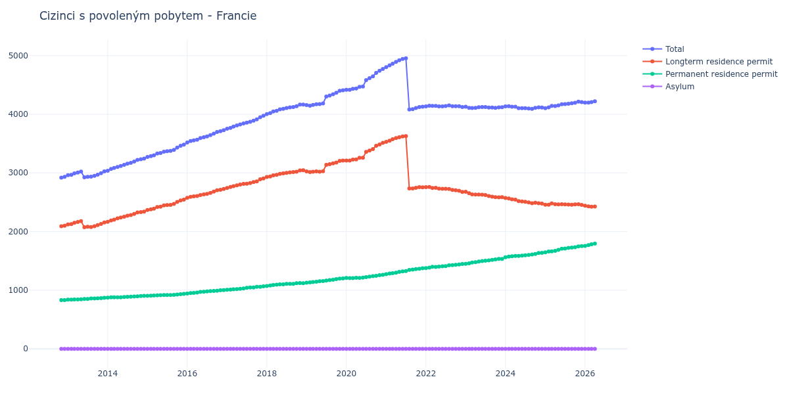

# Francie

## Souhrnné statistiky (Min/Max pro rok) / Summary Statistics (Min/Max per year)

| Year   | Total         | Longterm Residence Permit   | Permanent Residence Permit   | Asylum   |
|--------|---------------|-----------------------------|------------------------------|----------|
| 2012   | 2 920 / 2 932 | 2 090 / 2 100               | 830 / 832                    | 0 / 0    |
| 2013   | 2 924 / 3 025 | 2 073 / 2 177               | 839 / 871                    | 0 / 0    |
| 2014   | 3 038 / 3 244 | 2 166 / 2 340               | 872 / 904                    | 0 / 0    |
| 2015   | 3 271 / 3 483 | 2 368 / 2 545               | 903 / 938                    | 0 / 0    |
| 2016   | 3 518 / 3 728 | 2 574 / 2 725               | 944 / 1 003                  | 0 / 0    |
| 2017   | 3 752 / 3 973 | 2 744 / 2 906               | 1 008 / 1 067                | 0 / 0    |
| 2018   | 4 001 / 4 164 | 2 930 / 3 044               | 1 071 / 1 121                | 0 / 0    |
| 2019   | 4 146 / 4 409 | 3 013 / 3 209               | 1 129 / 1 200                | 0 / 0    |
| 2020   | 4 417 / 4 773 | 3 209 / 3 512               | 1 206 / 1 261                | 0 / 0    |
| 2021   | 4 080 / 4 954 | 2 734 / 3 628               | 1 273 / 1 374                | 0 / 0    |
| 2022   | 4 122 / 4 151 | 2 676 / 2 759               | 1 378 / 1 446                | 0 / 0    |
| 2023   | 4 105 / 4 127 | 2 582 / 2 678               | 1 449 / 1 535                | 0 / 0    |
| 2024   | 4 092 / 4 137 | 2 477 / 2 571               | 1 562 / 1 637                | 0 / 0    |
| 2025   | 4 103 / 4 214 | 2 456 / 2 480               | 1 646 / 1 751                | 0 / 0    |

## Detailní tabulka / Detailed Data Table

| Date     | Total           | Longterm Residence Permit   | Permanent Residence Permit   | Asylum   |
|----------|-----------------|-----------------------------|------------------------------|----------|
| **2012** |                 |                             |                              |          |
| 11.2012  | 2 920           | 2 090                       | 830                          | 0        |
| 12.2012  | 2 932 (+0.41%)  | 2 100 (+0.48%)              | 832 (+0.24%)                 | 0        |
| **2013** |                 |                             |                              |          |
| 01.2013  | 2 961 (+0.99%)  | 2 121 (+1.00%)              | 840 (+0.96%)                 | 0        |
| 02.2013  | 2 966 (+0.17%)  | 2 127 (+0.28%)              | 839 (-0.12%)                 | 0        |
| 03.2013  | 2 992 (+0.88%)  | 2 150 (+1.08%)              | 842 (+0.36%)                 | 0        |
| 04.2013  | 3 007 (+0.50%)  | 2 164 (+0.65%)              | 843 (+0.12%)                 | 0        |
| 05.2013  | 3 023 (+0.53%)  | 2 177 (+0.60%)              | 846 (+0.36%)                 | 0        |
| 06.2013  | 2 924 (-3.27%)  | 2 073 (-4.78%)              | 851 (+0.59%)                 | 0        |
| 07.2013  | 2 932 (+0.27%)  | 2 081 (+0.39%)              | 851 (+0.00%)                 | 0        |
| 08.2013  | 2 935 (+0.10%)  | 2 077 (-0.19%)              | 858 (+0.82%)                 | 0        |
| 09.2013  | 2 950 (+0.51%)  | 2 091 (+0.67%)              | 859 (+0.12%)                 | 0        |
| 10.2013  | 2 971 (+0.71%)  | 2 109 (+0.86%)              | 862 (+0.35%)                 | 0        |
| 11.2013  | 2 996 (+0.84%)  | 2 131 (+1.04%)              | 865 (+0.35%)                 | 0        |
| 12.2013  | 3 025 (+0.97%)  | 2 154 (+1.08%)              | 871 (+0.69%)                 | 0        |
| **2014** |                 |                             |                              |          |
| 01.2014  | 3 038 (+0.43%)  | 2 166 (+0.56%)              | 872 (+0.11%)                 | 0        |
| 02.2014  | 3 067 (+0.95%)  | 2 189 (+1.06%)              | 878 (+0.69%)                 | 0        |
| 03.2014  | 3 083 (+0.52%)  | 2 204 (+0.69%)              | 879 (+0.11%)                 | 0        |
| 04.2014  | 3 102 (+0.62%)  | 2 224 (+0.91%)              | 878 (-0.11%)                 | 0        |
| 05.2014  | 3 117 (+0.48%)  | 2 239 (+0.67%)              | 878 (+0.00%)                 | 0        |
| 06.2014  | 3 138 (+0.67%)  | 2 254 (+0.67%)              | 884 (+0.68%)                 | 0        |
| 07.2014  | 3 157 (+0.61%)  | 2 270 (+0.71%)              | 887 (+0.34%)                 | 0        |
| 08.2014  | 3 171 (+0.44%)  | 2 281 (+0.48%)              | 890 (+0.34%)                 | 0        |
| 09.2014  | 3 194 (+0.73%)  | 2 301 (+0.88%)              | 893 (+0.34%)                 | 0        |
| 10.2014  | 3 222 (+0.88%)  | 2 325 (+1.04%)              | 897 (+0.45%)                 | 0        |
| 11.2014  | 3 232 (+0.31%)  | 2 332 (+0.30%)              | 900 (+0.33%)                 | 0        |
| 12.2014  | 3 244 (+0.37%)  | 2 340 (+0.34%)              | 904 (+0.44%)                 | 0        |
| **2015** |                 |                             |                              |          |
| 01.2015  | 3 271 (+0.83%)  | 2 368 (+1.20%)              | 903 (-0.11%)                 | 0        |
| 02.2015  | 3 286 (+0.46%)  | 2 378 (+0.42%)              | 908 (+0.55%)                 | 0        |
| 03.2015  | 3 299 (+0.40%)  | 2 390 (+0.50%)              | 909 (+0.11%)                 | 0        |
| 04.2015  | 3 330 (+0.94%)  | 2 417 (+1.13%)              | 913 (+0.44%)                 | 0        |
| 05.2015  | 3 339 (+0.27%)  | 2 424 (+0.29%)              | 915 (+0.22%)                 | 0        |
| 06.2015  | 3 362 (+0.69%)  | 2 445 (+0.87%)              | 917 (+0.22%)                 | 0        |
| 07.2015  | 3 370 (+0.24%)  | 2 453 (+0.33%)              | 917 (+0.00%)                 | 0        |
| 08.2015  | 3 375 (+0.15%)  | 2 456 (+0.12%)              | 919 (+0.22%)                 | 0        |
| 09.2015  | 3 393 (+0.53%)  | 2 472 (+0.65%)              | 921 (+0.22%)                 | 0        |
| 10.2015  | 3 432 (+1.15%)  | 2 505 (+1.33%)              | 927 (+0.65%)                 | 0        |
| 11.2015  | 3 462 (+0.87%)  | 2 529 (+0.96%)              | 933 (+0.65%)                 | 0        |
| 12.2015  | 3 483 (+0.61%)  | 2 545 (+0.63%)              | 938 (+0.54%)                 | 0        |
| **2016** |                 |                             |                              |          |
| 01.2016  | 3 518 (+1.00%)  | 2 574 (+1.14%)              | 944 (+0.64%)                 | 0        |
| 02.2016  | 3 544 (+0.74%)  | 2 592 (+0.70%)              | 952 (+0.85%)                 | 0        |
| 03.2016  | 3 555 (+0.31%)  | 2 601 (+0.35%)              | 954 (+0.21%)                 | 0        |
| 04.2016  | 3 566 (+0.31%)  | 2 606 (+0.19%)              | 960 (+0.63%)                 | 0        |
| 05.2016  | 3 594 (+0.79%)  | 2 623 (+0.65%)              | 971 (+1.15%)                 | 0        |
| 06.2016  | 3 609 (+0.42%)  | 2 634 (+0.42%)              | 975 (+0.41%)                 | 0        |
| 07.2016  | 3 623 (+0.39%)  | 2 642 (+0.30%)              | 981 (+0.62%)                 | 0        |
| 08.2016  | 3 644 (+0.58%)  | 2 659 (+0.64%)              | 985 (+0.41%)                 | 0        |
| 09.2016  | 3 670 (+0.71%)  | 2 682 (+0.86%)              | 988 (+0.30%)                 | 0        |
| 10.2016  | 3 696 (+0.71%)  | 2 704 (+0.82%)              | 992 (+0.40%)                 | 0        |
| 11.2016  | 3 711 (+0.41%)  | 2 711 (+0.26%)              | 1 000 (+0.81%)               | 0        |
| 12.2016  | 3 728 (+0.46%)  | 2 725 (+0.52%)              | 1 003 (+0.30%)               | 0        |
| **2017** |                 |                             |                              |          |
| 01.2017  | 3 752 (+0.64%)  | 2 744 (+0.70%)              | 1 008 (+0.50%)               | 0        |
| 02.2017  | 3 768 (+0.43%)  | 2 759 (+0.55%)              | 1 009 (+0.10%)               | 0        |
| 03.2017  | 3 791 (+0.61%)  | 2 775 (+0.58%)              | 1 016 (+0.69%)               | 0        |
| 04.2017  | 3 809 (+0.47%)  | 2 789 (+0.50%)              | 1 020 (+0.39%)               | 0        |
| 05.2017  | 3 826 (+0.45%)  | 2 803 (+0.50%)              | 1 023 (+0.29%)               | 0        |
| 06.2017  | 3 842 (+0.42%)  | 2 813 (+0.36%)              | 1 029 (+0.59%)               | 0        |
| 07.2017  | 3 856 (+0.36%)  | 2 816 (+0.11%)              | 1 040 (+1.07%)               | 0        |
| 08.2017  | 3 872 (+0.41%)  | 2 826 (+0.36%)              | 1 046 (+0.58%)               | 0        |
| 09.2017  | 3 891 (+0.49%)  | 2 843 (+0.60%)              | 1 048 (+0.19%)               | 0        |
| 10.2017  | 3 913 (+0.57%)  | 2 856 (+0.46%)              | 1 057 (+0.86%)               | 0        |
| 11.2017  | 3 949 (+0.92%)  | 2 890 (+1.19%)              | 1 059 (+0.19%)               | 0        |
| 12.2017  | 3 973 (+0.61%)  | 2 906 (+0.55%)              | 1 067 (+0.76%)               | 0        |
| **2018** |                 |                             |                              |          |
| 01.2018  | 4 001 (+0.70%)  | 2 930 (+0.83%)              | 1 071 (+0.37%)               | 0        |
| 02.2018  | 4 018 (+0.42%)  | 2 938 (+0.27%)              | 1 080 (+0.84%)               | 0        |
| 03.2018  | 4 047 (+0.72%)  | 2 959 (+0.71%)              | 1 088 (+0.74%)               | 0        |
| 04.2018  | 4 059 (+0.30%)  | 2 966 (+0.24%)              | 1 093 (+0.46%)               | 0        |
| 05.2018  | 4 084 (+0.62%)  | 2 983 (+0.57%)              | 1 101 (+0.73%)               | 0        |
| 06.2018  | 4 091 (+0.17%)  | 2 991 (+0.27%)              | 1 100 (-0.09%)               | 0        |
| 07.2018  | 4 106 (+0.37%)  | 2 999 (+0.27%)              | 1 107 (+0.64%)               | 0        |
| 08.2018  | 4 118 (+0.29%)  | 3 009 (+0.33%)              | 1 109 (+0.18%)               | 0        |
| 09.2018  | 4 124 (+0.15%)  | 3 015 (+0.20%)              | 1 109 (+0.00%)               | 0        |
| 10.2018  | 4 138 (+0.34%)  | 3 019 (+0.13%)              | 1 119 (+0.90%)               | 0        |
| 11.2018  | 4 164 (+0.63%)  | 3 043 (+0.79%)              | 1 121 (+0.18%)               | 0        |
| 12.2018  | 4 164 (+0.00%)  | 3 044 (+0.03%)              | 1 120 (-0.09%)               | 0        |
| **2019** |                 |                             |                              |          |
| 01.2019  | 4 155 (-0.22%)  | 3 026 (-0.59%)              | 1 129 (+0.80%)               | 0        |
| 02.2019  | 4 146 (-0.22%)  | 3 013 (-0.43%)              | 1 133 (+0.35%)               | 0        |
| 03.2019  | 4 160 (+0.34%)  | 3 020 (+0.23%)              | 1 140 (+0.62%)               | 0        |
| 04.2019  | 4 170 (+0.24%)  | 3 025 (+0.17%)              | 1 145 (+0.44%)               | 0        |
| 05.2019  | 4 173 (+0.07%)  | 3 021 (-0.13%)              | 1 152 (+0.61%)               | 0        |
| 06.2019  | 4 184 (+0.26%)  | 3 028 (+0.23%)              | 1 156 (+0.35%)               | 0        |
| 07.2019  | 4 301 (+2.80%)  | 3 138 (+3.63%)              | 1 163 (+0.61%)               | 0        |
| 08.2019  | 4 320 (+0.44%)  | 3 148 (+0.32%)              | 1 172 (+0.77%)               | 0        |
| 09.2019  | 4 341 (+0.49%)  | 3 163 (+0.48%)              | 1 178 (+0.51%)               | 0        |
| 10.2019  | 4 366 (+0.58%)  | 3 176 (+0.41%)              | 1 190 (+1.02%)               | 0        |
| 11.2019  | 4 401 (+0.80%)  | 3 204 (+0.88%)              | 1 197 (+0.59%)               | 0        |
| 12.2019  | 4 409 (+0.18%)  | 3 209 (+0.16%)              | 1 200 (+0.25%)               | 0        |
| **2020** |                 |                             |                              |          |
| 01.2020  | 4 417 (+0.18%)  | 3 209 (+0.00%)              | 1 208 (+0.67%)               | 0        |
| 02.2020  | 4 417 (+0.00%)  | 3 211 (+0.06%)              | 1 206 (-0.17%)               | 0        |
| 03.2020  | 4 433 (+0.36%)  | 3 226 (+0.47%)              | 1 207 (+0.08%)               | 0        |
| 04.2020  | 4 440 (+0.16%)  | 3 229 (+0.09%)              | 1 211 (+0.33%)               | 0        |
| 05.2020  | 4 468 (+0.63%)  | 3 259 (+0.93%)              | 1 209 (-0.17%)               | 0        |
| 06.2020  | 4 473 (+0.11%)  | 3 259 (+0.00%)              | 1 214 (+0.41%)               | 0        |
| 07.2020  | 4 582 (+2.44%)  | 3 359 (+3.07%)              | 1 223 (+0.74%)               | 0        |
| 08.2020  | 4 614 (+0.70%)  | 3 382 (+0.68%)              | 1 232 (+0.74%)               | 0        |
| 09.2020  | 4 645 (+0.67%)  | 3 406 (+0.71%)              | 1 239 (+0.57%)               | 0        |
| 10.2020  | 4 706 (+1.31%)  | 3 461 (+1.61%)              | 1 245 (+0.48%)               | 0        |
| 11.2020  | 4 741 (+0.74%)  | 3 484 (+0.66%)              | 1 257 (+0.96%)               | 0        |
| 12.2020  | 4 773 (+0.67%)  | 3 512 (+0.80%)              | 1 261 (+0.32%)               | 0        |
| **2021** |                 |                             |                              |          |
| 01.2021  | 4 803 (+0.63%)  | 3 530 (+0.51%)              | 1 273 (+0.95%)               | 0        |
| 02.2021  | 4 833 (+0.62%)  | 3 549 (+0.54%)              | 1 284 (+0.86%)               | 0        |
| 03.2021  | 4 863 (+0.62%)  | 3 574 (+0.70%)              | 1 289 (+0.39%)               | 0        |
| 04.2021  | 4 892 (+0.60%)  | 3 594 (+0.56%)              | 1 298 (+0.70%)               | 0        |
| 05.2021  | 4 921 (+0.59%)  | 3 609 (+0.42%)              | 1 312 (+1.08%)               | 0        |
| 06.2021  | 4 944 (+0.47%)  | 3 623 (+0.39%)              | 1 321 (+0.69%)               | 0        |
| 07.2021  | 4 954 (+0.20%)  | 3 628 (+0.14%)              | 1 326 (+0.38%)               | 0        |
| 08.2021  | 4 080 (-17.64%) | 2 735 (-24.61%)             | 1 345 (+1.43%)               | 0        |
| 09.2021  | 4 085 (+0.12%)  | 2 734 (-0.04%)              | 1 351 (+0.45%)               | 0        |
| 10.2021  | 4 105 (+0.49%)  | 2 745 (+0.40%)              | 1 360 (+0.67%)               | 0        |
| 11.2021  | 4 122 (+0.41%)  | 2 756 (+0.40%)              | 1 366 (+0.44%)               | 0        |
| 12.2021  | 4 128 (+0.15%)  | 2 754 (-0.07%)              | 1 374 (+0.59%)               | 0        |
| **2022** |                 |                             |                              |          |
| 01.2022  | 4 135 (+0.17%)  | 2 757 (+0.11%)              | 1 378 (+0.29%)               | 0        |
| 02.2022  | 4 145 (+0.24%)  | 2 759 (+0.07%)              | 1 386 (+0.58%)               | 0        |
| 03.2022  | 4 142 (-0.07%)  | 2 743 (-0.58%)              | 1 399 (+0.94%)               | 0        |
| 04.2022  | 4 141 (-0.02%)  | 2 745 (+0.07%)              | 1 396 (-0.21%)               | 0        |
| 05.2022  | 4 134 (-0.17%)  | 2 731 (-0.51%)              | 1 403 (+0.50%)               | 0        |
| 06.2022  | 4 135 (+0.02%)  | 2 728 (-0.11%)              | 1 407 (+0.29%)               | 0        |
| 07.2022  | 4 140 (+0.12%)  | 2 730 (+0.07%)              | 1 410 (+0.21%)               | 0        |
| 08.2022  | 4 151 (+0.27%)  | 2 726 (-0.15%)              | 1 425 (+1.06%)               | 0        |
| 09.2022  | 4 138 (-0.31%)  | 2 710 (-0.59%)              | 1 428 (+0.21%)               | 0        |
| 10.2022  | 4 136 (-0.05%)  | 2 704 (-0.22%)              | 1 432 (+0.28%)               | 0        |
| 11.2022  | 4 136 (+0.00%)  | 2 696 (-0.30%)              | 1 440 (+0.56%)               | 0        |
| 12.2022  | 4 122 (-0.34%)  | 2 676 (-0.74%)              | 1 446 (+0.42%)               | 0        |
| **2023** |                 |                             |                              |          |
| 01.2023  | 4 127 (+0.12%)  | 2 678 (+0.07%)              | 1 449 (+0.21%)               | 0        |
| 02.2023  | 4 110 (-0.41%)  | 2 652 (-0.97%)              | 1 458 (+0.62%)               | 0        |
| 03.2023  | 4 105 (-0.12%)  | 2 634 (-0.68%)              | 1 471 (+0.89%)               | 0        |
| 04.2023  | 4 110 (+0.12%)  | 2 632 (-0.08%)              | 1 478 (+0.48%)               | 0        |
| 05.2023  | 4 121 (+0.27%)  | 2 632 (+0.00%)              | 1 489 (+0.74%)               | 0        |
| 06.2023  | 4 124 (+0.07%)  | 2 627 (-0.19%)              | 1 497 (+0.54%)               | 0        |
| 07.2023  | 4 124 (+0.00%)  | 2 622 (-0.19%)              | 1 502 (+0.33%)               | 0        |
| 08.2023  | 4 114 (-0.24%)  | 2 606 (-0.61%)              | 1 508 (+0.40%)               | 0        |
| 09.2023  | 4 113 (-0.02%)  | 2 595 (-0.42%)              | 1 518 (+0.66%)               | 0        |
| 10.2023  | 4 110 (-0.07%)  | 2 585 (-0.39%)              | 1 525 (+0.46%)               | 0        |
| 11.2023  | 4 117 (+0.17%)  | 2 582 (-0.12%)              | 1 535 (+0.66%)               | 0        |
| 12.2023  | 4 120 (+0.07%)  | 2 585 (+0.12%)              | 1 535 (+0.00%)               | 0        |
| **2024** |                 |                             |                              |          |
| 01.2024  | 4 133 (+0.32%)  | 2 571 (-0.54%)              | 1 562 (+1.76%)               | 0        |
| 02.2024  | 4 137 (+0.10%)  | 2 565 (-0.23%)              | 1 572 (+0.64%)               | 0        |
| 03.2024  | 4 129 (-0.19%)  | 2 551 (-0.55%)              | 1 578 (+0.38%)               | 0        |
| 04.2024  | 4 128 (-0.02%)  | 2 543 (-0.31%)              | 1 585 (+0.44%)               | 0        |
| 05.2024  | 4 104 (-0.58%)  | 2 520 (-0.90%)              | 1 584 (-0.06%)               | 0        |
| 06.2024  | 4 103 (-0.02%)  | 2 512 (-0.32%)              | 1 591 (+0.44%)               | 0        |
| 07.2024  | 4 104 (+0.02%)  | 2 508 (-0.16%)              | 1 596 (+0.31%)               | 0        |
| 08.2024  | 4 098 (-0.15%)  | 2 497 (-0.44%)              | 1 601 (+0.31%)               | 0        |
| 09.2024  | 4 092 (-0.15%)  | 2 482 (-0.60%)              | 1 610 (+0.56%)               | 0        |
| 10.2024  | 4 110 (+0.44%)  | 2 491 (+0.36%)              | 1 619 (+0.56%)               | 0        |
| 11.2024  | 4 118 (+0.19%)  | 2 483 (-0.32%)              | 1 635 (+0.99%)               | 0        |
| 12.2024  | 4 114 (-0.10%)  | 2 477 (-0.24%)              | 1 637 (+0.12%)               | 0        |
| **2025** |                 |                             |                              |          |
| 01.2025  | 4 103 (-0.27%)  | 2 457 (-0.81%)              | 1 646 (+0.55%)               | 0        |
| 02.2025  | 4 117 (+0.34%)  | 2 458 (+0.04%)              | 1 659 (+0.79%)               | 0        |
| 03.2025  | 4 143 (+0.63%)  | 2 480 (+0.90%)              | 1 663 (+0.24%)               | 0        |
| 04.2025  | 4 139 (-0.10%)  | 2 467 (-0.52%)              | 1 672 (+0.54%)               | 0        |
| 05.2025  | 4 151 (+0.29%)  | 2 462 (-0.20%)              | 1 689 (+1.02%)               | 0        |
| 06.2025  | 4 171 (+0.48%)  | 2 465 (+0.12%)              | 1 706 (+1.01%)               | 0        |
| 07.2025  | 4 173 (+0.05%)  | 2 462 (-0.12%)              | 1 711 (+0.29%)               | 0        |
| 08.2025  | 4 180 (+0.17%)  | 2 460 (-0.08%)              | 1 720 (+0.53%)               | 0        |
| 09.2025  | 4 186 (+0.14%)  | 2 458 (-0.08%)              | 1 728 (+0.47%)               | 0        |
| 10.2025  | 4 195 (+0.22%)  | 2 463 (+0.20%)              | 1 732 (+0.23%)               | 0        |
| 11.2025  | 4 214 (+0.45%)  | 2 467 (+0.16%)              | 1 747 (+0.87%)               | 0        |
| 12.2025  | 4 207 (-0.17%)  | 2 456 (-0.45%)              | 1 751 (+0.23%)               | 0        |
