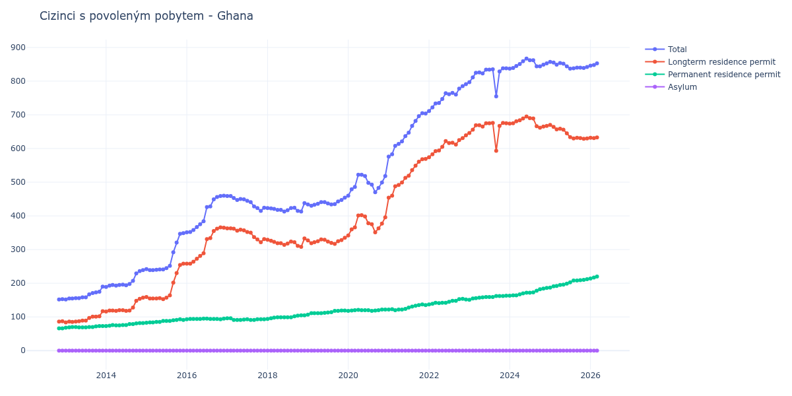

# Ghana

## Souhrnné statistiky (Min/Max pro rok) / Summary Statistics (Min/Max per year)

| Year   | Total     | Longterm Residence Permit   | Permanent Residence Permit   | Asylum   |
|--------|-----------|-----------------------------|------------------------------|----------|
| 2012   | 152 / 153 | 86 / 87                     | 66 / 66                      | 0 / 0    |
| 2013   | 152 / 190 | 84 / 117                    | 68 / 73                      | 0 / 0    |
| 2014   | 189 / 239 | 116 / 157                   | 73 / 82                      | 0 / 0    |
| 2015   | 239 / 349 | 153 / 258                   | 83 / 93                      | 0 / 0    |
| 2016   | 351 / 460 | 258 / 366                   | 93 / 95                      | 0 / 0    |
| 2017   | 415 / 459 | 322 / 363                   | 91 / 96                      | 0 / 0    |
| 2018   | 413 / 438 | 308 / 333                   | 94 / 105                     | 0 / 0    |
| 2019   | 430 / 454 | 317 / 335                   | 107 / 119                    | 0 / 0    |
| 2020   | 460 / 522 | 342 / 402                   | 118 / 122                    | 0 / 0    |
| 2021   | 576 / 705 | 454 / 569                   | 120 / 137                    | 0 / 0    |
| 2022   | 711 / 791 | 574 / 639                   | 137 / 154                    | 0 / 0    |
| 2023   | 755 / 838 | 593 / 676                   | 151 / 163                    | 0 / 0    |
| 2024   | 837 / 867 | 662 / 695                   | 163 / 186                    | 0 / 0    |
| 2025   | 837 / 857 | 629 / 670                   | 187 / 212                    | 0 / 0    |
| 2026   | 846 / 853 | 631 / 633                   | 214 / 220                    | 0 / 0    |

## Detailní tabulka / Detailed Data Table

| Date     | Total         | Longterm Residence Permit   | Permanent Residence Permit   | Asylum   |
|----------|---------------|-----------------------------|------------------------------|----------|
| **2012** |               |                             |                              |          |
| 11.2012  | 152           | 86                          | 66                           | 0        |
| 12.2012  | 153 (+0.66%)  | 87 (+1.16%)                 | 66 (+0.00%)                  | 0        |
| **2013** |               |                             |                              |          |
| 01.2013  | 152 (-0.65%)  | 84 (-3.45%)                 | 68 (+3.03%)                  | 0        |
| 02.2013  | 155 (+1.97%)  | 86 (+2.38%)                 | 69 (+1.47%)                  | 0        |
| 03.2013  | 155 (+0.00%)  | 85 (-1.16%)                 | 70 (+1.45%)                  | 0        |
| 04.2013  | 156 (+0.65%)  | 86 (+1.18%)                 | 70 (+0.00%)                  | 0        |
| 05.2013  | 156 (+0.00%)  | 87 (+1.16%)                 | 69 (-1.43%)                  | 0        |
| 06.2013  | 158 (+1.28%)  | 89 (+2.30%)                 | 69 (+0.00%)                  | 0        |
| 07.2013  | 158 (+0.00%)  | 89 (+0.00%)                 | 69 (+0.00%)                  | 0        |
| 08.2013  | 167 (+5.70%)  | 97 (+8.99%)                 | 70 (+1.45%)                  | 0        |
| 09.2013  | 171 (+2.40%)  | 101 (+4.12%)                | 70 (+0.00%)                  | 0        |
| 10.2013  | 173 (+1.17%)  | 101 (+0.00%)                | 72 (+2.86%)                  | 0        |
| 11.2013  | 175 (+1.16%)  | 102 (+0.99%)                | 73 (+1.39%)                  | 0        |
| 12.2013  | 190 (+8.57%)  | 117 (+14.71%)               | 73 (+0.00%)                  | 0        |
| **2014** |               |                             |                              |          |
| 01.2014  | 189 (-0.53%)  | 116 (-0.85%)                | 73 (+0.00%)                  | 0        |
| 02.2014  | 193 (+2.12%)  | 119 (+2.59%)                | 74 (+1.37%)                  | 0        |
| 03.2014  | 195 (+1.04%)  | 119 (+0.00%)                | 76 (+2.70%)                  | 0        |
| 04.2014  | 193 (-1.03%)  | 118 (-0.84%)                | 75 (-1.32%)                  | 0        |
| 05.2014  | 195 (+1.04%)  | 120 (+1.69%)                | 75 (+0.00%)                  | 0        |
| 06.2014  | 196 (+0.51%)  | 120 (+0.00%)                | 76 (+1.33%)                  | 0        |
| 07.2014  | 194 (-1.02%)  | 118 (-1.67%)                | 76 (+0.00%)                  | 0        |
| 08.2014  | 198 (+2.06%)  | 119 (+0.85%)                | 79 (+3.95%)                  | 0        |
| 09.2014  | 207 (+4.55%)  | 128 (+7.56%)                | 79 (+0.00%)                  | 0        |
| 10.2014  | 229 (+10.63%) | 148 (+15.62%)               | 81 (+2.53%)                  | 0        |
| 11.2014  | 236 (+3.06%)  | 154 (+4.05%)                | 82 (+1.23%)                  | 0        |
| 12.2014  | 239 (+1.27%)  | 157 (+1.95%)                | 82 (+0.00%)                  | 0        |
| **2015** |               |                             |                              |          |
| 01.2015  | 242 (+1.26%)  | 159 (+1.27%)                | 83 (+1.22%)                  | 0        |
| 02.2015  | 239 (-1.24%)  | 155 (-2.52%)                | 84 (+1.20%)                  | 0        |
| 03.2015  | 239 (+0.00%)  | 155 (+0.00%)                | 84 (+0.00%)                  | 0        |
| 04.2015  | 240 (+0.42%)  | 155 (+0.00%)                | 85 (+1.19%)                  | 0        |
| 05.2015  | 241 (+0.42%)  | 156 (+0.65%)                | 85 (+0.00%)                  | 0        |
| 06.2015  | 241 (+0.00%)  | 153 (-1.92%)                | 88 (+3.53%)                  | 0        |
| 07.2015  | 245 (+1.66%)  | 157 (+2.61%)                | 88 (+0.00%)                  | 0        |
| 08.2015  | 252 (+2.86%)  | 164 (+4.46%)                | 88 (+0.00%)                  | 0        |
| 09.2015  | 292 (+15.87%) | 202 (+23.17%)               | 90 (+2.27%)                  | 0        |
| 10.2015  | 321 (+9.93%)  | 230 (+13.86%)               | 91 (+1.11%)                  | 0        |
| 11.2015  | 347 (+8.10%)  | 254 (+10.43%)               | 93 (+2.20%)                  | 0        |
| 12.2015  | 349 (+0.58%)  | 258 (+1.57%)                | 91 (-2.15%)                  | 0        |
| **2016** |               |                             |                              |          |
| 01.2016  | 351 (+0.57%)  | 258 (+0.00%)                | 93 (+2.20%)                  | 0        |
| 02.2016  | 352 (+0.28%)  | 258 (+0.00%)                | 94 (+1.08%)                  | 0        |
| 03.2016  | 358 (+1.70%)  | 264 (+2.33%)                | 94 (+0.00%)                  | 0        |
| 04.2016  | 367 (+2.51%)  | 273 (+3.41%)                | 94 (+0.00%)                  | 0        |
| 05.2016  | 375 (+2.18%)  | 281 (+2.93%)                | 94 (+0.00%)                  | 0        |
| 06.2016  | 384 (+2.40%)  | 289 (+2.85%)                | 95 (+1.06%)                  | 0        |
| 07.2016  | 426 (+10.94%) | 331 (+14.53%)               | 95 (+0.00%)                  | 0        |
| 08.2016  | 428 (+0.47%)  | 334 (+0.91%)                | 94 (-1.05%)                  | 0        |
| 09.2016  | 449 (+4.91%)  | 355 (+6.29%)                | 94 (+0.00%)                  | 0        |
| 10.2016  | 456 (+1.56%)  | 362 (+1.97%)                | 94 (+0.00%)                  | 0        |
| 11.2016  | 459 (+0.66%)  | 366 (+1.10%)                | 93 (-1.06%)                  | 0        |
| 12.2016  | 460 (+0.22%)  | 365 (-0.27%)                | 95 (+2.15%)                  | 0        |
| **2017** |               |                             |                              |          |
| 01.2017  | 459 (-0.22%)  | 363 (-0.55%)                | 96 (+1.05%)                  | 0        |
| 02.2017  | 459 (+0.00%)  | 363 (+0.00%)                | 96 (+0.00%)                  | 0        |
| 03.2017  | 453 (-1.31%)  | 362 (-0.28%)                | 91 (-5.21%)                  | 0        |
| 04.2017  | 447 (-1.32%)  | 356 (-1.66%)                | 91 (+0.00%)                  | 0        |
| 05.2017  | 450 (+0.67%)  | 359 (+0.84%)                | 91 (+0.00%)                  | 0        |
| 06.2017  | 449 (-0.22%)  | 357 (-0.56%)                | 92 (+1.10%)                  | 0        |
| 07.2017  | 445 (-0.89%)  | 352 (-1.40%)                | 93 (+1.09%)                  | 0        |
| 08.2017  | 441 (-0.90%)  | 350 (-0.57%)                | 91 (-2.15%)                  | 0        |
| 09.2017  | 428 (-2.95%)  | 337 (-3.71%)                | 91 (+0.00%)                  | 0        |
| 10.2017  | 423 (-1.17%)  | 330 (-2.08%)                | 93 (+2.20%)                  | 0        |
| 11.2017  | 415 (-1.89%)  | 322 (-2.42%)                | 93 (+0.00%)                  | 0        |
| 12.2017  | 424 (+2.17%)  | 331 (+2.80%)                | 93 (+0.00%)                  | 0        |
| **2018** |               |                             |                              |          |
| 01.2018  | 423 (-0.24%)  | 329 (-0.60%)                | 94 (+1.08%)                  | 0        |
| 02.2018  | 422 (-0.24%)  | 326 (-0.91%)                | 96 (+2.13%)                  | 0        |
| 03.2018  | 421 (-0.24%)  | 323 (-0.92%)                | 98 (+2.08%)                  | 0        |
| 04.2018  | 418 (-0.71%)  | 319 (-1.24%)                | 99 (+1.02%)                  | 0        |
| 05.2018  | 418 (+0.00%)  | 319 (+0.00%)                | 99 (+0.00%)                  | 0        |
| 06.2018  | 413 (-1.20%)  | 314 (-1.57%)                | 99 (+0.00%)                  | 0        |
| 07.2018  | 417 (+0.97%)  | 318 (+1.27%)                | 99 (+0.00%)                  | 0        |
| 08.2018  | 423 (+1.44%)  | 324 (+1.89%)                | 99 (+0.00%)                  | 0        |
| 09.2018  | 424 (+0.24%)  | 322 (-0.62%)                | 102 (+3.03%)                 | 0        |
| 10.2018  | 415 (-2.12%)  | 311 (-3.42%)                | 104 (+1.96%)                 | 0        |
| 11.2018  | 413 (-0.48%)  | 308 (-0.96%)                | 105 (+0.96%)                 | 0        |
| 12.2018  | 438 (+6.05%)  | 333 (+8.12%)                | 105 (+0.00%)                 | 0        |
| **2019** |               |                             |                              |          |
| 01.2019  | 434 (-0.91%)  | 327 (-1.80%)                | 107 (+1.90%)                 | 0        |
| 02.2019  | 430 (-0.92%)  | 319 (-2.45%)                | 111 (+3.74%)                 | 0        |
| 03.2019  | 433 (+0.70%)  | 322 (+0.94%)                | 111 (+0.00%)                 | 0        |
| 04.2019  | 436 (+0.69%)  | 325 (+0.93%)                | 111 (+0.00%)                 | 0        |
| 05.2019  | 441 (+1.15%)  | 330 (+1.54%)                | 111 (+0.00%)                 | 0        |
| 06.2019  | 441 (+0.00%)  | 329 (-0.30%)                | 112 (+0.90%)                 | 0        |
| 07.2019  | 437 (-0.91%)  | 324 (-1.52%)                | 113 (+0.89%)                 | 0        |
| 08.2019  | 434 (-0.69%)  | 320 (-1.23%)                | 114 (+0.88%)                 | 0        |
| 09.2019  | 435 (+0.23%)  | 317 (-0.94%)                | 118 (+3.51%)                 | 0        |
| 10.2019  | 443 (+1.84%)  | 325 (+2.52%)                | 118 (+0.00%)                 | 0        |
| 11.2019  | 447 (+0.90%)  | 328 (+0.92%)                | 119 (+0.85%)                 | 0        |
| 12.2019  | 454 (+1.57%)  | 335 (+2.13%)                | 119 (+0.00%)                 | 0        |
| **2020** |               |                             |                              |          |
| 01.2020  | 460 (+1.32%)  | 342 (+2.09%)                | 118 (-0.84%)                 | 0        |
| 02.2020  | 479 (+4.13%)  | 360 (+5.26%)                | 119 (+0.85%)                 | 0        |
| 03.2020  | 486 (+1.46%)  | 366 (+1.67%)                | 120 (+0.84%)                 | 0        |
| 04.2020  | 522 (+7.41%)  | 401 (+9.56%)                | 121 (+0.83%)                 | 0        |
| 05.2020  | 522 (+0.00%)  | 402 (+0.25%)                | 120 (-0.83%)                 | 0        |
| 06.2020  | 518 (-0.77%)  | 398 (-1.00%)                | 120 (+0.00%)                 | 0        |
| 07.2020  | 498 (-3.86%)  | 378 (-5.03%)                | 120 (+0.00%)                 | 0        |
| 08.2020  | 493 (-1.00%)  | 375 (-0.79%)                | 118 (-1.67%)                 | 0        |
| 09.2020  | 470 (-4.67%)  | 351 (-6.40%)                | 119 (+0.85%)                 | 0        |
| 10.2020  | 483 (+2.77%)  | 363 (+3.42%)                | 120 (+0.84%)                 | 0        |
| 11.2020  | 499 (+3.31%)  | 377 (+3.86%)                | 122 (+1.67%)                 | 0        |
| 12.2020  | 518 (+3.81%)  | 396 (+5.04%)                | 122 (+0.00%)                 | 0        |
| **2021** |               |                             |                              |          |
| 01.2021  | 576 (+11.20%) | 454 (+14.65%)               | 122 (+0.00%)                 | 0        |
| 02.2021  | 583 (+1.22%)  | 460 (+1.32%)                | 123 (+0.82%)                 | 0        |
| 03.2021  | 608 (+4.29%)  | 488 (+6.09%)                | 120 (-2.44%)                 | 0        |
| 04.2021  | 614 (+0.99%)  | 492 (+0.82%)                | 122 (+1.67%)                 | 0        |
| 05.2021  | 621 (+1.14%)  | 499 (+1.42%)                | 122 (+0.00%)                 | 0        |
| 06.2021  | 637 (+2.58%)  | 513 (+2.81%)                | 124 (+1.64%)                 | 0        |
| 07.2021  | 647 (+1.57%)  | 519 (+1.17%)                | 128 (+3.23%)                 | 0        |
| 08.2021  | 667 (+3.09%)  | 536 (+3.28%)                | 131 (+2.34%)                 | 0        |
| 09.2021  | 682 (+2.25%)  | 549 (+2.43%)                | 133 (+1.53%)                 | 0        |
| 10.2021  | 696 (+2.05%)  | 561 (+2.19%)                | 135 (+1.50%)                 | 0        |
| 11.2021  | 705 (+1.29%)  | 568 (+1.25%)                | 137 (+1.48%)                 | 0        |
| 12.2021  | 704 (-0.14%)  | 569 (+0.18%)                | 135 (-1.46%)                 | 0        |
| **2022** |               |                             |                              |          |
| 01.2022  | 711 (+0.99%)  | 574 (+0.88%)                | 137 (+1.48%)                 | 0        |
| 02.2022  | 722 (+1.55%)  | 583 (+1.57%)                | 139 (+1.46%)                 | 0        |
| 03.2022  | 734 (+1.66%)  | 592 (+1.54%)                | 142 (+2.16%)                 | 0        |
| 04.2022  | 735 (+0.14%)  | 594 (+0.34%)                | 141 (-0.70%)                 | 0        |
| 05.2022  | 747 (+1.63%)  | 605 (+1.85%)                | 142 (+0.71%)                 | 0        |
| 06.2022  | 764 (+2.28%)  | 622 (+2.81%)                | 142 (+0.00%)                 | 0        |
| 07.2022  | 761 (-0.39%)  | 616 (-0.96%)                | 145 (+2.11%)                 | 0        |
| 08.2022  | 765 (+0.53%)  | 617 (+0.16%)                | 148 (+2.07%)                 | 0        |
| 09.2022  | 760 (-0.65%)  | 612 (-0.81%)                | 148 (+0.00%)                 | 0        |
| 10.2022  | 778 (+2.37%)  | 625 (+2.12%)                | 153 (+3.38%)                 | 0        |
| 11.2022  | 785 (+0.90%)  | 631 (+0.96%)                | 154 (+0.65%)                 | 0        |
| 12.2022  | 791 (+0.76%)  | 639 (+1.27%)                | 152 (-1.30%)                 | 0        |
| **2023** |               |                             |                              |          |
| 01.2023  | 797 (+0.76%)  | 646 (+1.10%)                | 151 (-0.66%)                 | 0        |
| 02.2023  | 811 (+1.76%)  | 656 (+1.55%)                | 155 (+2.65%)                 | 0        |
| 03.2023  | 825 (+1.73%)  | 669 (+1.98%)                | 156 (+0.65%)                 | 0        |
| 04.2023  | 826 (+0.12%)  | 669 (+0.00%)                | 157 (+0.64%)                 | 0        |
| 05.2023  | 823 (-0.36%)  | 665 (-0.60%)                | 158 (+0.64%)                 | 0        |
| 06.2023  | 834 (+1.34%)  | 675 (+1.50%)                | 159 (+0.63%)                 | 0        |
| 07.2023  | 834 (+0.00%)  | 675 (+0.00%)                | 159 (+0.00%)                 | 0        |
| 08.2023  | 835 (+0.12%)  | 676 (+0.15%)                | 159 (+0.00%)                 | 0        |
| 09.2023  | 755 (-9.58%)  | 593 (-12.28%)               | 162 (+1.89%)                 | 0        |
| 10.2023  | 829 (+9.80%)  | 667 (+12.48%)               | 162 (+0.00%)                 | 0        |
| 11.2023  | 838 (+1.09%)  | 676 (+1.35%)                | 162 (+0.00%)                 | 0        |
| 12.2023  | 838 (+0.00%)  | 675 (-0.15%)                | 163 (+0.62%)                 | 0        |
| **2024** |               |                             |                              |          |
| 01.2024  | 837 (-0.12%)  | 674 (-0.15%)                | 163 (+0.00%)                 | 0        |
| 02.2024  | 839 (+0.24%)  | 675 (+0.15%)                | 164 (+0.61%)                 | 0        |
| 03.2024  | 845 (+0.72%)  | 681 (+0.89%)                | 164 (+0.00%)                 | 0        |
| 04.2024  | 851 (+0.71%)  | 684 (+0.44%)                | 167 (+1.83%)                 | 0        |
| 05.2024  | 859 (+0.94%)  | 689 (+0.73%)                | 170 (+1.80%)                 | 0        |
| 06.2024  | 867 (+0.93%)  | 695 (+0.87%)                | 172 (+1.18%)                 | 0        |
| 07.2024  | 862 (-0.58%)  | 690 (-0.72%)                | 172 (+0.00%)                 | 0        |
| 08.2024  | 862 (+0.00%)  | 689 (-0.14%)                | 173 (+0.58%)                 | 0        |
| 09.2024  | 844 (-2.09%)  | 666 (-3.34%)                | 178 (+2.89%)                 | 0        |
| 10.2024  | 844 (+0.00%)  | 662 (-0.60%)                | 182 (+2.25%)                 | 0        |
| 11.2024  | 849 (+0.59%)  | 665 (+0.45%)                | 184 (+1.10%)                 | 0        |
| 12.2024  | 853 (+0.47%)  | 667 (+0.30%)                | 186 (+1.09%)                 | 0        |
| **2025** |               |                             |                              |          |
| 01.2025  | 857 (+0.47%)  | 670 (+0.45%)                | 187 (+0.54%)                 | 0        |
| 02.2025  | 855 (-0.23%)  | 664 (-0.90%)                | 191 (+2.14%)                 | 0        |
| 03.2025  | 849 (-0.70%)  | 657 (-1.05%)                | 192 (+0.52%)                 | 0        |
| 04.2025  | 854 (+0.59%)  | 659 (+0.30%)                | 195 (+1.56%)                 | 0        |
| 05.2025  | 852 (-0.23%)  | 656 (-0.46%)                | 196 (+0.51%)                 | 0        |
| 06.2025  | 844 (-0.94%)  | 645 (-1.68%)                | 199 (+1.53%)                 | 0        |
| 07.2025  | 837 (-0.83%)  | 634 (-1.71%)                | 203 (+2.01%)                 | 0        |
| 08.2025  | 838 (+0.12%)  | 630 (-0.63%)                | 208 (+2.46%)                 | 0        |
| 09.2025  | 840 (+0.24%)  | 632 (+0.32%)                | 208 (+0.00%)                 | 0        |
| 10.2025  | 840 (+0.00%)  | 631 (-0.16%)                | 209 (+0.48%)                 | 0        |
| 11.2025  | 839 (-0.12%)  | 629 (-0.32%)                | 210 (+0.48%)                 | 0        |
| 12.2025  | 842 (+0.36%)  | 630 (+0.16%)                | 212 (+0.95%)                 | 0        |
| **2026** |               |                             |                              |          |
| 01.2026  | 846 (+0.48%)  | 632 (+0.32%)                | 214 (+0.94%)                 | 0        |
| 02.2026  | 848 (+0.24%)  | 631 (-0.16%)                | 217 (+1.40%)                 | 0        |
| 03.2026  | 853 (+0.59%)  | 633 (+0.32%)                | 220 (+1.38%)                 | 0        |
