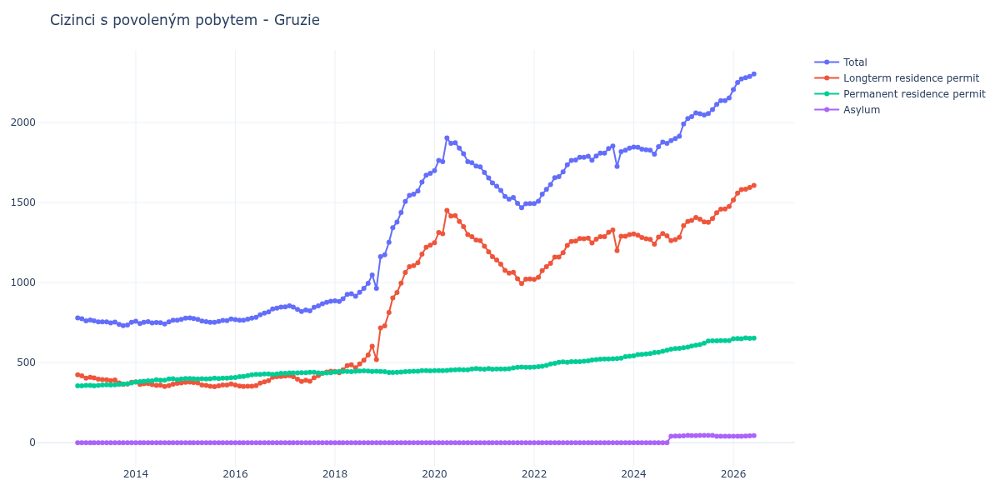

# Gruzie

## Souhrnné statistiky (Min/Max pro rok) / Summary Statistics (Min/Max per year)

| Year   | Total         | Longterm Residence Permit   | Permanent Residence Permit   | Asylum   |
|--------|---------------|-----------------------------|------------------------------|----------|
| 2012   | 774 / 780     | 418 / 425                   | 355 / 356                    | 0 / 0    |
| 2013   | 731 / 767     | 364 / 409                   | 356 / 374                    | 0 / 0    |
| 2014   | 742 / 771     | 351 / 380                   | 379 / 399                    | 0 / 0    |
| 2015   | 752 / 780     | 350 / 379                   | 398 / 406                    | 0 / 0    |
| 2016   | 765 / 847     | 351 / 414                   | 408 / 433                    | 0 / 0    |
| 2017   | 820 / 884     | 383 / 447                   | 433 / 440                    | 0 / 0    |
| 2018   | 882 / 1 162   | 437 / 717                   | 441 / 449                    | 0 / 0    |
| 2019   | 1 174 / 1 683 | 730 / 1 234                 | 439 / 451                    | 0 / 0    |
| 2020   | 1 700 / 1 904 | 1 249 / 1 452               | 450 / 463                    | 0 / 0    |
| 2021   | 1 468 / 1 688 | 995 / 1 228                 | 460 / 473                    | 0 / 0    |
| 2022   | 1 494 / 1 783 | 1 021 / 1 276               | 473 / 507                    | 0 / 0    |
| 2023   | 1 726 / 1 853 | 1 200 / 1 329               | 509 / 540                    | 0 / 0    |
| 2024   | 1 803 / 1 915 | 1 240 / 1 307               | 543 / 590                    | 0 / 42   |
| 2025   | 1 992 / 2 154 | 1 356 / 1 476               | 593 / 638                    | 40 / 45  |
| 2026   | 2 206 / 2 304 | 1 516 / 1 607               | 649 / 655                    | 40 / 44  |

## Detailní tabulka / Detailed Data Table

| Date     | Total           | Longterm Residence Permit   | Permanent Residence Permit   | Asylum       |
|----------|-----------------|-----------------------------|------------------------------|--------------|
| **2012** |                 |                             |                              |              |
| 11.2012  | 780             | 425                         | 355                          | 0            |
| 12.2012  | 774 (-0.77%)    | 418 (-1.65%)                | 356 (+0.28%)                 | 0            |
| **2013** |                 |                             |                              |              |
| 01.2013  | 762 (-1.55%)    | 404 (-3.35%)                | 358 (+0.56%)                 | 0            |
| 02.2013  | 767 (+0.66%)    | 409 (+1.24%)                | 358 (+0.00%)                 | 0            |
| 03.2013  | 761 (-0.78%)    | 405 (-0.98%)                | 356 (-0.56%)                 | 0            |
| 04.2013  | 755 (-0.79%)    | 397 (-1.98%)                | 358 (+0.56%)                 | 0            |
| 05.2013  | 755 (+0.00%)    | 395 (-0.50%)                | 360 (+0.56%)                 | 0            |
| 06.2013  | 755 (+0.00%)    | 393 (-0.51%)                | 362 (+0.56%)                 | 0            |
| 07.2013  | 749 (-0.79%)    | 388 (-1.27%)                | 361 (-0.28%)                 | 0            |
| 08.2013  | 754 (+0.67%)    | 392 (+1.03%)                | 362 (+0.28%)                 | 0            |
| 09.2013  | 739 (-1.99%)    | 374 (-4.59%)                | 365 (+0.83%)                 | 0            |
| 10.2013  | 731 (-1.08%)    | 364 (-2.67%)                | 367 (+0.55%)                 | 0            |
| 11.2013  | 736 (+0.68%)    | 367 (+0.82%)                | 369 (+0.54%)                 | 0            |
| 12.2013  | 752 (+2.17%)    | 378 (+3.00%)                | 374 (+1.36%)                 | 0            |
| **2014** |                 |                             |                              |              |
| 01.2014  | 759 (+0.93%)    | 380 (+0.53%)                | 379 (+1.34%)                 | 0            |
| 02.2014  | 745 (-1.84%)    | 364 (-4.21%)                | 381 (+0.53%)                 | 0            |
| 03.2014  | 753 (+1.07%)    | 369 (+1.37%)                | 384 (+0.79%)                 | 0            |
| 04.2014  | 756 (+0.40%)    | 370 (+0.27%)                | 386 (+0.52%)                 | 0            |
| 05.2014  | 749 (-0.93%)    | 363 (-1.89%)                | 386 (+0.00%)                 | 0            |
| 06.2014  | 751 (+0.27%)    | 358 (-1.38%)                | 393 (+1.81%)                 | 0            |
| 07.2014  | 750 (-0.13%)    | 359 (+0.28%)                | 391 (-0.51%)                 | 0            |
| 08.2014  | 742 (-1.07%)    | 351 (-2.23%)                | 391 (+0.00%)                 | 0            |
| 09.2014  | 755 (+1.75%)    | 357 (+1.71%)                | 398 (+1.79%)                 | 0            |
| 10.2014  | 765 (+1.32%)    | 366 (+2.52%)                | 399 (+0.25%)                 | 0            |
| 11.2014  | 765 (+0.00%)    | 371 (+1.37%)                | 394 (-1.25%)                 | 0            |
| 12.2014  | 771 (+0.78%)    | 373 (+0.54%)                | 398 (+1.02%)                 | 0            |
| **2015** |                 |                             |                              |              |
| 01.2015  | 778 (+0.91%)    | 377 (+1.07%)                | 401 (+0.75%)                 | 0            |
| 02.2015  | 780 (+0.26%)    | 379 (+0.53%)                | 401 (+0.00%)                 | 0            |
| 03.2015  | 776 (-0.51%)    | 376 (-0.79%)                | 400 (-0.25%)                 | 0            |
| 04.2015  | 771 (-0.64%)    | 373 (-0.80%)                | 398 (-0.50%)                 | 0            |
| 05.2015  | 760 (-1.43%)    | 360 (-3.49%)                | 400 (+0.50%)                 | 0            |
| 06.2015  | 756 (-0.53%)    | 358 (-0.56%)                | 398 (-0.50%)                 | 0            |
| 07.2015  | 752 (-0.53%)    | 353 (-1.40%)                | 399 (+0.25%)                 | 0            |
| 08.2015  | 753 (+0.13%)    | 350 (-0.85%)                | 403 (+1.00%)                 | 0            |
| 09.2015  | 757 (+0.53%)    | 356 (+1.71%)                | 401 (-0.50%)                 | 0            |
| 10.2015  | 764 (+0.92%)    | 360 (+1.12%)                | 404 (+0.75%)                 | 0            |
| 11.2015  | 763 (-0.13%)    | 360 (+0.00%)                | 403 (-0.25%)                 | 0            |
| 12.2015  | 773 (+1.31%)    | 367 (+1.94%)                | 406 (+0.74%)                 | 0            |
| **2016** |                 |                             |                              |              |
| 01.2016  | 769 (-0.52%)    | 361 (-1.63%)                | 408 (+0.49%)                 | 0            |
| 02.2016  | 766 (-0.39%)    | 354 (-1.94%)                | 412 (+0.98%)                 | 0            |
| 03.2016  | 765 (-0.13%)    | 351 (-0.85%)                | 414 (+0.49%)                 | 0            |
| 04.2016  | 772 (+0.92%)    | 353 (+0.57%)                | 419 (+1.21%)                 | 0            |
| 05.2016  | 778 (+0.78%)    | 353 (+0.00%)                | 425 (+1.43%)                 | 0            |
| 06.2016  | 784 (+0.77%)    | 357 (+1.13%)                | 427 (+0.47%)                 | 0            |
| 07.2016  | 799 (+1.91%)    | 372 (+4.20%)                | 427 (+0.00%)                 | 0            |
| 08.2016  | 810 (+1.38%)    | 380 (+2.15%)                | 430 (+0.70%)                 | 0            |
| 09.2016  | 817 (+0.86%)    | 388 (+2.11%)                | 429 (-0.23%)                 | 0            |
| 10.2016  | 836 (+2.33%)    | 409 (+5.41%)                | 427 (-0.47%)                 | 0            |
| 11.2016  | 841 (+0.60%)    | 412 (+0.73%)                | 429 (+0.47%)                 | 0            |
| 12.2016  | 847 (+0.71%)    | 414 (+0.49%)                | 433 (+0.93%)                 | 0            |
| **2017** |                 |                             |                              |              |
| 01.2017  | 849 (+0.24%)    | 416 (+0.48%)                | 433 (+0.00%)                 | 0            |
| 02.2017  | 855 (+0.71%)    | 419 (+0.72%)                | 436 (+0.69%)                 | 0            |
| 03.2017  | 848 (-0.82%)    | 412 (-1.67%)                | 436 (+0.00%)                 | 0            |
| 04.2017  | 833 (-1.77%)    | 397 (-3.64%)                | 436 (+0.00%)                 | 0            |
| 05.2017  | 820 (-1.56%)    | 383 (-3.53%)                | 437 (+0.23%)                 | 0            |
| 06.2017  | 829 (+1.10%)    | 391 (+2.09%)                | 438 (+0.23%)                 | 0            |
| 07.2017  | 824 (-0.60%)    | 384 (-1.79%)                | 440 (+0.46%)                 | 0            |
| 08.2017  | 846 (+2.67%)    | 406 (+5.73%)                | 440 (+0.00%)                 | 0            |
| 09.2017  | 855 (+1.06%)    | 419 (+3.20%)                | 436 (-0.91%)                 | 0            |
| 10.2017  | 868 (+1.52%)    | 433 (+3.34%)                | 435 (-0.23%)                 | 0            |
| 11.2017  | 877 (+1.04%)    | 441 (+1.85%)                | 436 (+0.23%)                 | 0            |
| 12.2017  | 884 (+0.80%)    | 447 (+1.36%)                | 437 (+0.23%)                 | 0            |
| **2018** |                 |                             |                              |              |
| 01.2018  | 886 (+0.23%)    | 445 (-0.45%)                | 441 (+0.92%)                 | 0            |
| 02.2018  | 882 (-0.45%)    | 437 (-1.80%)                | 445 (+0.91%)                 | 0            |
| 03.2018  | 900 (+2.04%)    | 455 (+4.12%)                | 445 (+0.00%)                 | 0            |
| 04.2018  | 927 (+3.00%)    | 482 (+5.93%)                | 445 (+0.00%)                 | 0            |
| 05.2018  | 931 (+0.43%)    | 487 (+1.04%)                | 444 (-0.22%)                 | 0            |
| 06.2018  | 915 (-1.72%)    | 468 (-3.90%)                | 447 (+0.68%)                 | 0            |
| 07.2018  | 940 (+2.73%)    | 492 (+5.13%)                | 448 (+0.22%)                 | 0            |
| 08.2018  | 964 (+2.55%)    | 515 (+4.67%)                | 449 (+0.22%)                 | 0            |
| 09.2018  | 996 (+3.32%)    | 548 (+6.41%)                | 448 (-0.22%)                 | 0            |
| 10.2018  | 1 048 (+5.22%)  | 603 (+10.04%)               | 445 (-0.67%)                 | 0            |
| 11.2018  | 965 (-7.92%)    | 519 (-13.93%)               | 446 (+0.22%)                 | 0            |
| 12.2018  | 1 162 (+20.41%) | 717 (+38.15%)               | 445 (-0.22%)                 | 0            |
| **2019** |                 |                             |                              |              |
| 01.2019  | 1 174 (+1.03%)  | 730 (+1.81%)                | 444 (-0.22%)                 | 0            |
| 02.2019  | 1 252 (+6.64%)  | 813 (+11.37%)               | 439 (-1.13%)                 | 0            |
| 03.2019  | 1 344 (+7.35%)  | 905 (+11.32%)               | 439 (+0.00%)                 | 0            |
| 04.2019  | 1 379 (+2.60%)  | 939 (+3.76%)                | 440 (+0.23%)                 | 0            |
| 05.2019  | 1 438 (+4.28%)  | 997 (+6.18%)                | 441 (+0.23%)                 | 0            |
| 06.2019  | 1 508 (+4.87%)  | 1 064 (+6.72%)              | 444 (+0.68%)                 | 0            |
| 07.2019  | 1 545 (+2.45%)  | 1 100 (+3.38%)              | 445 (+0.23%)                 | 0            |
| 08.2019  | 1 553 (+0.52%)  | 1 106 (+0.55%)              | 447 (+0.45%)                 | 0            |
| 09.2019  | 1 572 (+1.22%)  | 1 125 (+1.72%)              | 447 (+0.00%)                 | 0            |
| 10.2019  | 1 629 (+3.63%)  | 1 178 (+4.71%)              | 451 (+0.89%)                 | 0            |
| 11.2019  | 1 672 (+2.64%)  | 1 221 (+3.65%)              | 451 (+0.00%)                 | 0            |
| 12.2019  | 1 683 (+0.66%)  | 1 234 (+1.06%)              | 449 (-0.44%)                 | 0            |
| **2020** |                 |                             |                              |              |
| 01.2020  | 1 700 (+1.01%)  | 1 249 (+1.22%)              | 451 (+0.45%)                 | 0            |
| 02.2020  | 1 764 (+3.76%)  | 1 314 (+5.20%)              | 450 (-0.22%)                 | 0            |
| 03.2020  | 1 756 (-0.45%)  | 1 306 (-0.61%)              | 450 (+0.00%)                 | 0            |
| 04.2020  | 1 904 (+8.43%)  | 1 452 (+11.18%)             | 452 (+0.44%)                 | 0            |
| 05.2020  | 1 870 (-1.79%)  | 1 416 (-2.48%)              | 454 (+0.44%)                 | 0            |
| 06.2020  | 1 875 (+0.27%)  | 1 419 (+0.21%)              | 456 (+0.44%)                 | 0            |
| 07.2020  | 1 840 (-1.87%)  | 1 383 (-2.54%)              | 457 (+0.22%)                 | 0            |
| 08.2020  | 1 806 (-1.85%)  | 1 350 (-2.39%)              | 456 (-0.22%)                 | 0            |
| 09.2020  | 1 756 (-2.77%)  | 1 301 (-3.63%)              | 455 (-0.22%)                 | 0            |
| 10.2020  | 1 749 (-0.40%)  | 1 288 (-1.00%)              | 461 (+1.32%)                 | 0            |
| 11.2020  | 1 729 (-1.14%)  | 1 266 (-1.71%)              | 463 (+0.43%)                 | 0            |
| 12.2020  | 1 724 (-0.29%)  | 1 263 (-0.24%)              | 461 (-0.43%)                 | 0            |
| **2021** |                 |                             |                              |              |
| 01.2021  | 1 688 (-2.09%)  | 1 228 (-2.77%)              | 460 (-0.22%)                 | 0            |
| 02.2021  | 1 655 (-1.95%)  | 1 192 (-2.93%)              | 463 (+0.65%)                 | 0            |
| 03.2021  | 1 623 (-1.93%)  | 1 163 (-2.43%)              | 460 (-0.65%)                 | 0            |
| 04.2021  | 1 602 (-1.29%)  | 1 141 (-1.89%)              | 461 (+0.22%)                 | 0            |
| 05.2021  | 1 577 (-1.56%)  | 1 116 (-2.19%)              | 461 (+0.00%)                 | 0            |
| 06.2021  | 1 538 (-2.47%)  | 1 077 (-3.49%)              | 461 (+0.00%)                 | 0            |
| 07.2021  | 1 522 (-1.04%)  | 1 060 (-1.58%)              | 462 (+0.22%)                 | 0            |
| 08.2021  | 1 532 (+0.66%)  | 1 065 (+0.47%)              | 467 (+1.08%)                 | 0            |
| 09.2021  | 1 495 (-2.42%)  | 1 024 (-3.85%)              | 471 (+0.86%)                 | 0            |
| 10.2021  | 1 468 (-1.81%)  | 995 (-2.83%)                | 473 (+0.42%)                 | 0            |
| 11.2021  | 1 493 (+1.70%)  | 1 022 (+2.71%)              | 471 (-0.42%)                 | 0            |
| 12.2021  | 1 494 (+0.07%)  | 1 023 (+0.10%)              | 471 (+0.00%)                 | 0            |
| **2022** |                 |                             |                              |              |
| 01.2022  | 1 494 (+0.00%)  | 1 021 (-0.20%)              | 473 (+0.42%)                 | 0            |
| 02.2022  | 1 509 (+1.00%)  | 1 034 (+1.27%)              | 475 (+0.42%)                 | 0            |
| 03.2022  | 1 553 (+2.92%)  | 1 075 (+3.97%)              | 478 (+0.63%)                 | 0            |
| 04.2022  | 1 583 (+1.93%)  | 1 100 (+2.33%)              | 483 (+1.05%)                 | 0            |
| 05.2022  | 1 613 (+1.90%)  | 1 121 (+1.91%)              | 492 (+1.86%)                 | 0            |
| 06.2022  | 1 656 (+2.67%)  | 1 160 (+3.48%)              | 496 (+0.81%)                 | 0            |
| 07.2022  | 1 662 (+0.36%)  | 1 160 (+0.00%)              | 502 (+1.21%)                 | 0            |
| 08.2022  | 1 692 (+1.81%)  | 1 187 (+2.33%)              | 505 (+0.60%)                 | 0            |
| 09.2022  | 1 736 (+2.60%)  | 1 233 (+3.88%)              | 503 (-0.40%)                 | 0            |
| 10.2022  | 1 764 (+1.61%)  | 1 258 (+2.03%)              | 506 (+0.60%)                 | 0            |
| 11.2022  | 1 766 (+0.11%)  | 1 260 (+0.16%)              | 506 (+0.00%)                 | 0            |
| 12.2022  | 1 783 (+0.96%)  | 1 276 (+1.27%)              | 507 (+0.20%)                 | 0            |
| **2023** |                 |                             |                              |              |
| 01.2023  | 1 783 (+0.00%)  | 1 274 (-0.16%)              | 509 (+0.39%)                 | 0            |
| 02.2023  | 1 790 (+0.39%)  | 1 278 (+0.31%)              | 512 (+0.59%)                 | 0            |
| 03.2023  | 1 765 (-1.40%)  | 1 248 (-2.35%)              | 517 (+0.98%)                 | 0            |
| 04.2023  | 1 791 (+1.47%)  | 1 272 (+1.92%)              | 519 (+0.39%)                 | 0            |
| 05.2023  | 1 809 (+1.01%)  | 1 287 (+1.18%)              | 522 (+0.58%)                 | 0            |
| 06.2023  | 1 810 (+0.06%)  | 1 287 (+0.00%)              | 523 (+0.19%)                 | 0            |
| 07.2023  | 1 838 (+1.55%)  | 1 315 (+2.18%)              | 523 (+0.00%)                 | 0            |
| 08.2023  | 1 853 (+0.82%)  | 1 329 (+1.06%)              | 524 (+0.19%)                 | 0            |
| 09.2023  | 1 726 (-6.85%)  | 1 200 (-9.71%)              | 526 (+0.38%)                 | 0            |
| 10.2023  | 1 819 (+5.39%)  | 1 290 (+7.50%)              | 529 (+0.57%)                 | 0            |
| 11.2023  | 1 827 (+0.44%)  | 1 290 (+0.00%)              | 537 (+1.51%)                 | 0            |
| 12.2023  | 1 840 (+0.71%)  | 1 300 (+0.78%)              | 540 (+0.56%)                 | 0            |
| **2024** |                 |                             |                              |              |
| 01.2024  | 1 847 (+0.38%)  | 1 304 (+0.31%)              | 543 (+0.56%)                 | 0            |
| 02.2024  | 1 846 (-0.05%)  | 1 296 (-0.61%)              | 550 (+1.29%)                 | 0            |
| 03.2024  | 1 834 (-0.65%)  | 1 282 (-1.08%)              | 552 (+0.36%)                 | 0            |
| 04.2024  | 1 830 (-0.22%)  | 1 275 (-0.55%)              | 555 (+0.54%)                 | 0            |
| 05.2024  | 1 828 (-0.11%)  | 1 271 (-0.31%)              | 557 (+0.36%)                 | 0            |
| 06.2024  | 1 803 (-1.37%)  | 1 240 (-2.44%)              | 563 (+1.08%)                 | 0            |
| 07.2024  | 1 850 (+2.61%)  | 1 285 (+3.63%)              | 565 (+0.36%)                 | 0            |
| 08.2024  | 1 878 (+1.51%)  | 1 307 (+1.71%)              | 571 (+1.06%)                 | 0            |
| 09.2024  | 1 871 (-0.37%)  | 1 293 (-1.07%)              | 578 (+1.23%)                 | 0            |
| 10.2024  | 1 888 (+0.91%)  | 1 262 (-2.40%)              | 585 (+1.21%)                 | 41           |
| 11.2024  | 1 900 (+0.64%)  | 1 269 (+0.55%)              | 589 (+0.68%)                 | 42 (+2.44%)  |
| 12.2024  | 1 915 (+0.79%)  | 1 283 (+1.10%)              | 590 (+0.17%)                 | 42 (+0.00%)  |
| **2025** |                 |                             |                              |              |
| 01.2025  | 1 992 (+4.02%)  | 1 356 (+5.69%)              | 593 (+0.51%)                 | 43 (+2.38%)  |
| 02.2025  | 2 025 (+1.66%)  | 1 382 (+1.92%)              | 598 (+0.84%)                 | 45 (+4.65%)  |
| 03.2025  | 2 037 (+0.59%)  | 1 389 (+0.51%)              | 604 (+1.00%)                 | 44 (-2.22%)  |
| 04.2025  | 2 060 (+1.13%)  | 1 407 (+1.30%)              | 609 (+0.83%)                 | 44 (+0.00%)  |
| 05.2025  | 2 055 (-0.24%)  | 1 397 (-0.71%)              | 613 (+0.66%)                 | 45 (+2.27%)  |
| 06.2025  | 2 047 (-0.39%)  | 1 380 (-1.22%)              | 622 (+1.47%)                 | 45 (+0.00%)  |
| 07.2025  | 2 057 (+0.49%)  | 1 377 (-0.22%)              | 635 (+2.09%)                 | 45 (+0.00%)  |
| 08.2025  | 2 082 (+1.22%)  | 1 400 (+1.67%)              | 637 (+0.31%)                 | 45 (+0.00%)  |
| 09.2025  | 2 114 (+1.54%)  | 1 437 (+2.64%)              | 637 (+0.00%)                 | 40 (-11.11%) |
| 10.2025  | 2 137 (+1.09%)  | 1 459 (+1.53%)              | 638 (+0.16%)                 | 40 (+0.00%)  |
| 11.2025  | 2 138 (+0.05%)  | 1 460 (+0.07%)              | 638 (+0.00%)                 | 40 (+0.00%)  |
| 12.2025  | 2 154 (+0.75%)  | 1 476 (+1.10%)              | 638 (+0.00%)                 | 40 (+0.00%)  |
| **2026** |                 |                             |                              |              |
| 01.2026  | 2 206 (+2.41%)  | 1 516 (+2.71%)              | 649 (+1.72%)                 | 41 (+2.50%)  |
| 02.2026  | 2 251 (+2.04%)  | 1 560 (+2.90%)              | 651 (+0.31%)                 | 40 (-2.44%)  |
| 03.2026  | 2 273 (+0.98%)  | 1 582 (+1.41%)              | 650 (-0.15%)                 | 41 (+2.50%)  |
| 04.2026  | 2 281 (+0.35%)  | 1 584 (+0.13%)              | 655 (+0.77%)                 | 42 (+2.44%)  |
| 05.2026  | 2 289 (+0.35%)  | 1 594 (+0.63%)              | 652 (-0.46%)                 | 43 (+2.38%)  |
| 06.2026  | 2 304 (+0.66%)  | 1 607 (+0.82%)              | 653 (+0.15%)                 | 44 (+2.33%)  |
