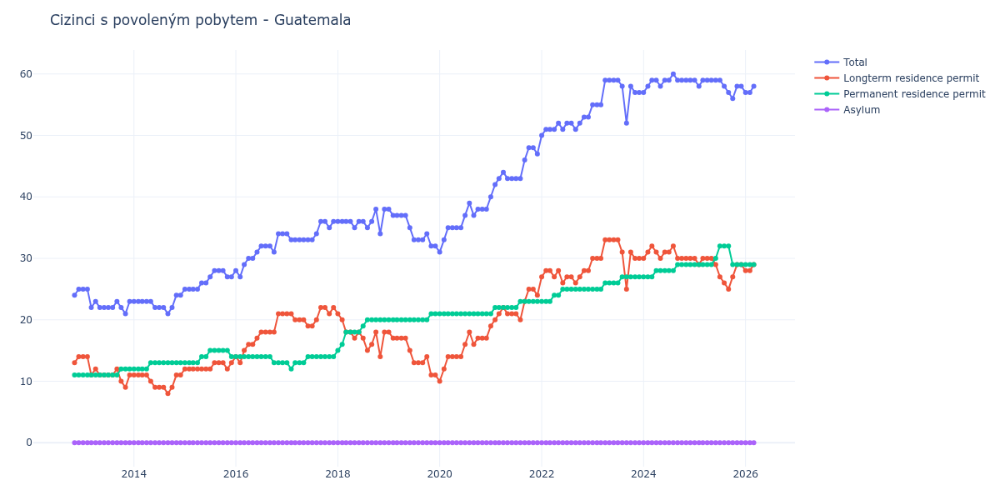

# Guatemala

## Souhrnné statistiky (Min/Max pro rok) / Summary Statistics (Min/Max per year)

| Year   | Total   | Longterm Residence Permit   | Permanent Residence Permit   | Asylum   |
|--------|---------|-----------------------------|------------------------------|----------|
| 2012   | 24 / 25 | 13 / 14                     | 11 / 11                      | 0 / 0    |
| 2013   | 21 / 25 | 9 / 14                      | 11 / 12                      | 0 / 0    |
| 2014   | 21 / 24 | 8 / 11                      | 12 / 13                      | 0 / 0    |
| 2015   | 25 / 28 | 12 / 13                     | 13 / 15                      | 0 / 0    |
| 2016   | 27 / 34 | 13 / 21                     | 13 / 14                      | 0 / 0    |
| 2017   | 33 / 36 | 19 / 22                     | 12 / 14                      | 0 / 0    |
| 2018   | 34 / 38 | 14 / 21                     | 15 / 20                      | 0 / 0    |
| 2019   | 32 / 38 | 11 / 18                     | 20 / 21                      | 0 / 0    |
| 2020   | 31 / 39 | 10 / 18                     | 21 / 21                      | 0 / 0    |
| 2021   | 40 / 48 | 19 / 25                     | 21 / 23                      | 0 / 0    |
| 2022   | 50 / 53 | 26 / 28                     | 23 / 25                      | 0 / 0    |
| 2023   | 52 / 59 | 25 / 33                     | 25 / 27                      | 0 / 0    |
| 2024   | 57 / 60 | 30 / 32                     | 27 / 29                      | 0 / 0    |
| 2025   | 56 / 59 | 25 / 30                     | 29 / 32                      | 0 / 0    |
| 2026   | 57 / 58 | 28 / 29                     | 29 / 29                      | 0 / 0    |

## Detailní tabulka / Detailed Data Table

| Date     | Total        | Longterm Residence Permit   | Permanent Residence Permit   | Asylum   |
|----------|--------------|-----------------------------|------------------------------|----------|
| **2012** |              |                             |                              |          |
| 11.2012  | 24           | 13                          | 11                           | 0        |
| 12.2012  | 25 (+4.17%)  | 14 (+7.69%)                 | 11 (+0.00%)                  | 0        |
| **2013** |              |                             |                              |          |
| 01.2013  | 25 (+0.00%)  | 14 (+0.00%)                 | 11 (+0.00%)                  | 0        |
| 02.2013  | 25 (+0.00%)  | 14 (+0.00%)                 | 11 (+0.00%)                  | 0        |
| 03.2013  | 22 (-12.00%) | 11 (-21.43%)                | 11 (+0.00%)                  | 0        |
| 04.2013  | 23 (+4.55%)  | 12 (+9.09%)                 | 11 (+0.00%)                  | 0        |
| 05.2013  | 22 (-4.35%)  | 11 (-8.33%)                 | 11 (+0.00%)                  | 0        |
| 06.2013  | 22 (+0.00%)  | 11 (+0.00%)                 | 11 (+0.00%)                  | 0        |
| 07.2013  | 22 (+0.00%)  | 11 (+0.00%)                 | 11 (+0.00%)                  | 0        |
| 08.2013  | 22 (+0.00%)  | 11 (+0.00%)                 | 11 (+0.00%)                  | 0        |
| 09.2013  | 23 (+4.55%)  | 12 (+9.09%)                 | 11 (+0.00%)                  | 0        |
| 10.2013  | 22 (-4.35%)  | 10 (-16.67%)                | 12 (+9.09%)                  | 0        |
| 11.2013  | 21 (-4.55%)  | 9 (-10.00%)                 | 12 (+0.00%)                  | 0        |
| 12.2013  | 23 (+9.52%)  | 11 (+22.22%)                | 12 (+0.00%)                  | 0        |
| **2014** |              |                             |                              |          |
| 01.2014  | 23 (+0.00%)  | 11 (+0.00%)                 | 12 (+0.00%)                  | 0        |
| 02.2014  | 23 (+0.00%)  | 11 (+0.00%)                 | 12 (+0.00%)                  | 0        |
| 03.2014  | 23 (+0.00%)  | 11 (+0.00%)                 | 12 (+0.00%)                  | 0        |
| 04.2014  | 23 (+0.00%)  | 11 (+0.00%)                 | 12 (+0.00%)                  | 0        |
| 05.2014  | 23 (+0.00%)  | 10 (-9.09%)                 | 13 (+8.33%)                  | 0        |
| 06.2014  | 22 (-4.35%)  | 9 (-10.00%)                 | 13 (+0.00%)                  | 0        |
| 07.2014  | 22 (+0.00%)  | 9 (+0.00%)                  | 13 (+0.00%)                  | 0        |
| 08.2014  | 22 (+0.00%)  | 9 (+0.00%)                  | 13 (+0.00%)                  | 0        |
| 09.2014  | 21 (-4.55%)  | 8 (-11.11%)                 | 13 (+0.00%)                  | 0        |
| 10.2014  | 22 (+4.76%)  | 9 (+12.50%)                 | 13 (+0.00%)                  | 0        |
| 11.2014  | 24 (+9.09%)  | 11 (+22.22%)                | 13 (+0.00%)                  | 0        |
| 12.2014  | 24 (+0.00%)  | 11 (+0.00%)                 | 13 (+0.00%)                  | 0        |
| **2015** |              |                             |                              |          |
| 01.2015  | 25 (+4.17%)  | 12 (+9.09%)                 | 13 (+0.00%)                  | 0        |
| 02.2015  | 25 (+0.00%)  | 12 (+0.00%)                 | 13 (+0.00%)                  | 0        |
| 03.2015  | 25 (+0.00%)  | 12 (+0.00%)                 | 13 (+0.00%)                  | 0        |
| 04.2015  | 25 (+0.00%)  | 12 (+0.00%)                 | 13 (+0.00%)                  | 0        |
| 05.2015  | 26 (+4.00%)  | 12 (+0.00%)                 | 14 (+7.69%)                  | 0        |
| 06.2015  | 26 (+0.00%)  | 12 (+0.00%)                 | 14 (+0.00%)                  | 0        |
| 07.2015  | 27 (+3.85%)  | 12 (+0.00%)                 | 15 (+7.14%)                  | 0        |
| 08.2015  | 28 (+3.70%)  | 13 (+8.33%)                 | 15 (+0.00%)                  | 0        |
| 09.2015  | 28 (+0.00%)  | 13 (+0.00%)                 | 15 (+0.00%)                  | 0        |
| 10.2015  | 28 (+0.00%)  | 13 (+0.00%)                 | 15 (+0.00%)                  | 0        |
| 11.2015  | 27 (-3.57%)  | 12 (-7.69%)                 | 15 (+0.00%)                  | 0        |
| 12.2015  | 27 (+0.00%)  | 13 (+8.33%)                 | 14 (-6.67%)                  | 0        |
| **2016** |              |                             |                              |          |
| 01.2016  | 28 (+3.70%)  | 14 (+7.69%)                 | 14 (+0.00%)                  | 0        |
| 02.2016  | 27 (-3.57%)  | 13 (-7.14%)                 | 14 (+0.00%)                  | 0        |
| 03.2016  | 29 (+7.41%)  | 15 (+15.38%)                | 14 (+0.00%)                  | 0        |
| 04.2016  | 30 (+3.45%)  | 16 (+6.67%)                 | 14 (+0.00%)                  | 0        |
| 05.2016  | 30 (+0.00%)  | 16 (+0.00%)                 | 14 (+0.00%)                  | 0        |
| 06.2016  | 31 (+3.33%)  | 17 (+6.25%)                 | 14 (+0.00%)                  | 0        |
| 07.2016  | 32 (+3.23%)  | 18 (+5.88%)                 | 14 (+0.00%)                  | 0        |
| 08.2016  | 32 (+0.00%)  | 18 (+0.00%)                 | 14 (+0.00%)                  | 0        |
| 09.2016  | 32 (+0.00%)  | 18 (+0.00%)                 | 14 (+0.00%)                  | 0        |
| 10.2016  | 31 (-3.12%)  | 18 (+0.00%)                 | 13 (-7.14%)                  | 0        |
| 11.2016  | 34 (+9.68%)  | 21 (+16.67%)                | 13 (+0.00%)                  | 0        |
| 12.2016  | 34 (+0.00%)  | 21 (+0.00%)                 | 13 (+0.00%)                  | 0        |
| **2017** |              |                             |                              |          |
| 01.2017  | 34 (+0.00%)  | 21 (+0.00%)                 | 13 (+0.00%)                  | 0        |
| 02.2017  | 33 (-2.94%)  | 21 (+0.00%)                 | 12 (-7.69%)                  | 0        |
| 03.2017  | 33 (+0.00%)  | 20 (-4.76%)                 | 13 (+8.33%)                  | 0        |
| 04.2017  | 33 (+0.00%)  | 20 (+0.00%)                 | 13 (+0.00%)                  | 0        |
| 05.2017  | 33 (+0.00%)  | 20 (+0.00%)                 | 13 (+0.00%)                  | 0        |
| 06.2017  | 33 (+0.00%)  | 19 (-5.00%)                 | 14 (+7.69%)                  | 0        |
| 07.2017  | 33 (+0.00%)  | 19 (+0.00%)                 | 14 (+0.00%)                  | 0        |
| 08.2017  | 34 (+3.03%)  | 20 (+5.26%)                 | 14 (+0.00%)                  | 0        |
| 09.2017  | 36 (+5.88%)  | 22 (+10.00%)                | 14 (+0.00%)                  | 0        |
| 10.2017  | 36 (+0.00%)  | 22 (+0.00%)                 | 14 (+0.00%)                  | 0        |
| 11.2017  | 35 (-2.78%)  | 21 (-4.55%)                 | 14 (+0.00%)                  | 0        |
| 12.2017  | 36 (+2.86%)  | 22 (+4.76%)                 | 14 (+0.00%)                  | 0        |
| **2018** |              |                             |                              |          |
| 01.2018  | 36 (+0.00%)  | 21 (-4.55%)                 | 15 (+7.14%)                  | 0        |
| 02.2018  | 36 (+0.00%)  | 20 (-4.76%)                 | 16 (+6.67%)                  | 0        |
| 03.2018  | 36 (+0.00%)  | 18 (-10.00%)                | 18 (+12.50%)                 | 0        |
| 04.2018  | 36 (+0.00%)  | 18 (+0.00%)                 | 18 (+0.00%)                  | 0        |
| 05.2018  | 35 (-2.78%)  | 17 (-5.56%)                 | 18 (+0.00%)                  | 0        |
| 06.2018  | 36 (+2.86%)  | 18 (+5.88%)                 | 18 (+0.00%)                  | 0        |
| 07.2018  | 36 (+0.00%)  | 17 (-5.56%)                 | 19 (+5.56%)                  | 0        |
| 08.2018  | 35 (-2.78%)  | 15 (-11.76%)                | 20 (+5.26%)                  | 0        |
| 09.2018  | 36 (+2.86%)  | 16 (+6.67%)                 | 20 (+0.00%)                  | 0        |
| 10.2018  | 38 (+5.56%)  | 18 (+12.50%)                | 20 (+0.00%)                  | 0        |
| 11.2018  | 34 (-10.53%) | 14 (-22.22%)                | 20 (+0.00%)                  | 0        |
| 12.2018  | 38 (+11.76%) | 18 (+28.57%)                | 20 (+0.00%)                  | 0        |
| **2019** |              |                             |                              |          |
| 01.2019  | 38 (+0.00%)  | 18 (+0.00%)                 | 20 (+0.00%)                  | 0        |
| 02.2019  | 37 (-2.63%)  | 17 (-5.56%)                 | 20 (+0.00%)                  | 0        |
| 03.2019  | 37 (+0.00%)  | 17 (+0.00%)                 | 20 (+0.00%)                  | 0        |
| 04.2019  | 37 (+0.00%)  | 17 (+0.00%)                 | 20 (+0.00%)                  | 0        |
| 05.2019  | 37 (+0.00%)  | 17 (+0.00%)                 | 20 (+0.00%)                  | 0        |
| 06.2019  | 35 (-5.41%)  | 15 (-11.76%)                | 20 (+0.00%)                  | 0        |
| 07.2019  | 33 (-5.71%)  | 13 (-13.33%)                | 20 (+0.00%)                  | 0        |
| 08.2019  | 33 (+0.00%)  | 13 (+0.00%)                 | 20 (+0.00%)                  | 0        |
| 09.2019  | 33 (+0.00%)  | 13 (+0.00%)                 | 20 (+0.00%)                  | 0        |
| 10.2019  | 34 (+3.03%)  | 14 (+7.69%)                 | 20 (+0.00%)                  | 0        |
| 11.2019  | 32 (-5.88%)  | 11 (-21.43%)                | 21 (+5.00%)                  | 0        |
| 12.2019  | 32 (+0.00%)  | 11 (+0.00%)                 | 21 (+0.00%)                  | 0        |
| **2020** |              |                             |                              |          |
| 01.2020  | 31 (-3.12%)  | 10 (-9.09%)                 | 21 (+0.00%)                  | 0        |
| 02.2020  | 33 (+6.45%)  | 12 (+20.00%)                | 21 (+0.00%)                  | 0        |
| 03.2020  | 35 (+6.06%)  | 14 (+16.67%)                | 21 (+0.00%)                  | 0        |
| 04.2020  | 35 (+0.00%)  | 14 (+0.00%)                 | 21 (+0.00%)                  | 0        |
| 05.2020  | 35 (+0.00%)  | 14 (+0.00%)                 | 21 (+0.00%)                  | 0        |
| 06.2020  | 35 (+0.00%)  | 14 (+0.00%)                 | 21 (+0.00%)                  | 0        |
| 07.2020  | 37 (+5.71%)  | 16 (+14.29%)                | 21 (+0.00%)                  | 0        |
| 08.2020  | 39 (+5.41%)  | 18 (+12.50%)                | 21 (+0.00%)                  | 0        |
| 09.2020  | 37 (-5.13%)  | 16 (-11.11%)                | 21 (+0.00%)                  | 0        |
| 10.2020  | 38 (+2.70%)  | 17 (+6.25%)                 | 21 (+0.00%)                  | 0        |
| 11.2020  | 38 (+0.00%)  | 17 (+0.00%)                 | 21 (+0.00%)                  | 0        |
| 12.2020  | 38 (+0.00%)  | 17 (+0.00%)                 | 21 (+0.00%)                  | 0        |
| **2021** |              |                             |                              |          |
| 01.2021  | 40 (+5.26%)  | 19 (+11.76%)                | 21 (+0.00%)                  | 0        |
| 02.2021  | 42 (+5.00%)  | 20 (+5.26%)                 | 22 (+4.76%)                  | 0        |
| 03.2021  | 43 (+2.38%)  | 21 (+5.00%)                 | 22 (+0.00%)                  | 0        |
| 04.2021  | 44 (+2.33%)  | 22 (+4.76%)                 | 22 (+0.00%)                  | 0        |
| 05.2021  | 43 (-2.27%)  | 21 (-4.55%)                 | 22 (+0.00%)                  | 0        |
| 06.2021  | 43 (+0.00%)  | 21 (+0.00%)                 | 22 (+0.00%)                  | 0        |
| 07.2021  | 43 (+0.00%)  | 21 (+0.00%)                 | 22 (+0.00%)                  | 0        |
| 08.2021  | 43 (+0.00%)  | 20 (-4.76%)                 | 23 (+4.55%)                  | 0        |
| 09.2021  | 46 (+6.98%)  | 23 (+15.00%)                | 23 (+0.00%)                  | 0        |
| 10.2021  | 48 (+4.35%)  | 25 (+8.70%)                 | 23 (+0.00%)                  | 0        |
| 11.2021  | 48 (+0.00%)  | 25 (+0.00%)                 | 23 (+0.00%)                  | 0        |
| 12.2021  | 47 (-2.08%)  | 24 (-4.00%)                 | 23 (+0.00%)                  | 0        |
| **2022** |              |                             |                              |          |
| 01.2022  | 50 (+6.38%)  | 27 (+12.50%)                | 23 (+0.00%)                  | 0        |
| 02.2022  | 51 (+2.00%)  | 28 (+3.70%)                 | 23 (+0.00%)                  | 0        |
| 03.2022  | 51 (+0.00%)  | 28 (+0.00%)                 | 23 (+0.00%)                  | 0        |
| 04.2022  | 51 (+0.00%)  | 27 (-3.57%)                 | 24 (+4.35%)                  | 0        |
| 05.2022  | 52 (+1.96%)  | 28 (+3.70%)                 | 24 (+0.00%)                  | 0        |
| 06.2022  | 51 (-1.92%)  | 26 (-7.14%)                 | 25 (+4.17%)                  | 0        |
| 07.2022  | 52 (+1.96%)  | 27 (+3.85%)                 | 25 (+0.00%)                  | 0        |
| 08.2022  | 52 (+0.00%)  | 27 (+0.00%)                 | 25 (+0.00%)                  | 0        |
| 09.2022  | 51 (-1.92%)  | 26 (-3.70%)                 | 25 (+0.00%)                  | 0        |
| 10.2022  | 52 (+1.96%)  | 27 (+3.85%)                 | 25 (+0.00%)                  | 0        |
| 11.2022  | 53 (+1.92%)  | 28 (+3.70%)                 | 25 (+0.00%)                  | 0        |
| 12.2022  | 53 (+0.00%)  | 28 (+0.00%)                 | 25 (+0.00%)                  | 0        |
| **2023** |              |                             |                              |          |
| 01.2023  | 55 (+3.77%)  | 30 (+7.14%)                 | 25 (+0.00%)                  | 0        |
| 02.2023  | 55 (+0.00%)  | 30 (+0.00%)                 | 25 (+0.00%)                  | 0        |
| 03.2023  | 55 (+0.00%)  | 30 (+0.00%)                 | 25 (+0.00%)                  | 0        |
| 04.2023  | 59 (+7.27%)  | 33 (+10.00%)                | 26 (+4.00%)                  | 0        |
| 05.2023  | 59 (+0.00%)  | 33 (+0.00%)                 | 26 (+0.00%)                  | 0        |
| 06.2023  | 59 (+0.00%)  | 33 (+0.00%)                 | 26 (+0.00%)                  | 0        |
| 07.2023  | 59 (+0.00%)  | 33 (+0.00%)                 | 26 (+0.00%)                  | 0        |
| 08.2023  | 58 (-1.69%)  | 31 (-6.06%)                 | 27 (+3.85%)                  | 0        |
| 09.2023  | 52 (-10.34%) | 25 (-19.35%)                | 27 (+0.00%)                  | 0        |
| 10.2023  | 58 (+11.54%) | 31 (+24.00%)                | 27 (+0.00%)                  | 0        |
| 11.2023  | 57 (-1.72%)  | 30 (-3.23%)                 | 27 (+0.00%)                  | 0        |
| 12.2023  | 57 (+0.00%)  | 30 (+0.00%)                 | 27 (+0.00%)                  | 0        |
| **2024** |              |                             |                              |          |
| 01.2024  | 57 (+0.00%)  | 30 (+0.00%)                 | 27 (+0.00%)                  | 0        |
| 02.2024  | 58 (+1.75%)  | 31 (+3.33%)                 | 27 (+0.00%)                  | 0        |
| 03.2024  | 59 (+1.72%)  | 32 (+3.23%)                 | 27 (+0.00%)                  | 0        |
| 04.2024  | 59 (+0.00%)  | 31 (-3.12%)                 | 28 (+3.70%)                  | 0        |
| 05.2024  | 58 (-1.69%)  | 30 (-3.23%)                 | 28 (+0.00%)                  | 0        |
| 06.2024  | 59 (+1.72%)  | 31 (+3.33%)                 | 28 (+0.00%)                  | 0        |
| 07.2024  | 59 (+0.00%)  | 31 (+0.00%)                 | 28 (+0.00%)                  | 0        |
| 08.2024  | 60 (+1.69%)  | 32 (+3.23%)                 | 28 (+0.00%)                  | 0        |
| 09.2024  | 59 (-1.67%)  | 30 (-6.25%)                 | 29 (+3.57%)                  | 0        |
| 10.2024  | 59 (+0.00%)  | 30 (+0.00%)                 | 29 (+0.00%)                  | 0        |
| 11.2024  | 59 (+0.00%)  | 30 (+0.00%)                 | 29 (+0.00%)                  | 0        |
| 12.2024  | 59 (+0.00%)  | 30 (+0.00%)                 | 29 (+0.00%)                  | 0        |
| **2025** |              |                             |                              |          |
| 01.2025  | 59 (+0.00%)  | 30 (+0.00%)                 | 29 (+0.00%)                  | 0        |
| 02.2025  | 58 (-1.69%)  | 29 (-3.33%)                 | 29 (+0.00%)                  | 0        |
| 03.2025  | 59 (+1.72%)  | 30 (+3.45%)                 | 29 (+0.00%)                  | 0        |
| 04.2025  | 59 (+0.00%)  | 30 (+0.00%)                 | 29 (+0.00%)                  | 0        |
| 05.2025  | 59 (+0.00%)  | 30 (+0.00%)                 | 29 (+0.00%)                  | 0        |
| 06.2025  | 59 (+0.00%)  | 29 (-3.33%)                 | 30 (+3.45%)                  | 0        |
| 07.2025  | 59 (+0.00%)  | 27 (-6.90%)                 | 32 (+6.67%)                  | 0        |
| 08.2025  | 58 (-1.69%)  | 26 (-3.70%)                 | 32 (+0.00%)                  | 0        |
| 09.2025  | 57 (-1.72%)  | 25 (-3.85%)                 | 32 (+0.00%)                  | 0        |
| 10.2025  | 56 (-1.75%)  | 27 (+8.00%)                 | 29 (-9.38%)                  | 0        |
| 11.2025  | 58 (+3.57%)  | 29 (+7.41%)                 | 29 (+0.00%)                  | 0        |
| 12.2025  | 58 (+0.00%)  | 29 (+0.00%)                 | 29 (+0.00%)                  | 0        |
| **2026** |              |                             |                              |          |
| 01.2026  | 57 (-1.72%)  | 28 (-3.45%)                 | 29 (+0.00%)                  | 0        |
| 02.2026  | 57 (+0.00%)  | 28 (+0.00%)                 | 29 (+0.00%)                  | 0        |
| 03.2026  | 58 (+1.75%)  | 29 (+3.57%)                 | 29 (+0.00%)                  | 0        |
