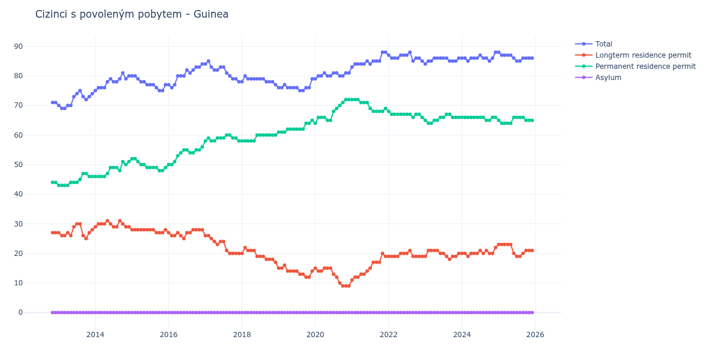

# Guinea

## Souhrnné statistiky (Min/Max pro rok) / Summary Statistics (Min/Max per year)

| Year   | Total Min/Max   | Longterm Residence Permit Min/Max   | Permanent Residence Permit Min/Max   | Asylum Min/Max   |
|--------|-----------------|-------------------------------------|--------------------------------------|------------------|
| 2012   | 71 / 71         | 27 / 27                             | 44 / 44                              | 0 / 0            |
| 2013   | 69 / 75         | 25 / 30                             | 43 / 47                              | 0 / 0            |
| 2014   | 75 / 81         | 29 / 31                             | 46 / 51                              | 0 / 0            |
| 2015   | 75 / 80         | 27 / 28                             | 48 / 52                              | 0 / 0            |
| 2016   | 76 / 84         | 25 / 28                             | 50 / 56                              | 0 / 0            |
| 2017   | 78 / 85         | 20 / 26                             | 58 / 60                              | 0 / 0            |
| 2018   | 77 / 80         | 17 / 22                             | 58 / 60                              | 0 / 0            |
| 2019   | 75 / 79         | 12 / 16                             | 61 / 65                              | 0 / 0            |
| 2020   | 79 / 81         | 9 / 15                              | 64 / 72                              | 0 / 0            |
| 2021   | 83 / 88         | 11 / 20                             | 68 / 72                              | 0 / 0            |
| 2022   | 85 / 88         | 19 / 21                             | 66 / 68                              | 0 / 0            |
| 2023   | 84 / 86         | 18 / 21                             | 64 / 67                              | 0 / 0            |
| 2024   | 85 / 88         | 19 / 22                             | 65 / 66                              | 0 / 0            |
| 2025   | 85 / 88         | 19 / 23                             | 64 / 66                              | 0 / 0            |

## Detailní tabulka / Detailed Data Table

| Date     | Total       | Longterm Residence Permit   | Permanent Residence Permit   | Asylum   |
|----------|-------------|-----------------------------|------------------------------|----------|
| **2012** |             |                             |                              |          |
| 11.2012  | 71          | 27                          | 44                           | 0        |
| 12.2012  | 71 (+0.00%) | 27 (+0.00%)                 | 44 (+0.00%)                  | 0        |
| **2013** |             |                             |                              |          |
| 01.2013  | 70 (-1.41%) | 27 (+0.00%)                 | 43 (-2.27%)                  | 0        |
| 02.2013  | 69 (-1.43%) | 26 (-3.70%)                 | 43 (+0.00%)                  | 0        |
| 03.2013  | 69 (+0.00%) | 26 (+0.00%)                 | 43 (+0.00%)                  | 0        |
| 04.2013  | 70 (+1.45%) | 27 (+3.85%)                 | 43 (+0.00%)                  | 0        |
| 05.2013  | 70 (+0.00%) | 26 (-3.70%)                 | 44 (+2.33%)                  | 0        |
| 06.2013  | 73 (+4.29%) | 29 (+11.54%)                | 44 (+0.00%)                  | 0        |
| 07.2013  | 74 (+1.37%) | 30 (+3.45%)                 | 44 (+0.00%)                  | 0        |
| 08.2013  | 75 (+1.35%) | 30 (+0.00%)                 | 45 (+2.27%)                  | 0        |
| 09.2013  | 73 (-2.67%) | 26 (-13.33%)                | 47 (+4.44%)                  | 0        |
| 10.2013  | 72 (-1.37%) | 25 (-3.85%)                 | 47 (+0.00%)                  | 0        |
| 11.2013  | 73 (+1.39%) | 27 (+8.00%)                 | 46 (-2.13%)                  | 0        |
| 12.2013  | 74 (+1.37%) | 28 (+3.70%)                 | 46 (+0.00%)                  | 0        |
| **2014** |             |                             |                              |          |
| 01.2014  | 75 (+1.35%) | 29 (+3.57%)                 | 46 (+0.00%)                  | 0        |
| 02.2014  | 76 (+1.33%) | 30 (+3.45%)                 | 46 (+0.00%)                  | 0        |
| 03.2014  | 76 (+0.00%) | 30 (+0.00%)                 | 46 (+0.00%)                  | 0        |
| 04.2014  | 76 (+0.00%) | 30 (+0.00%)                 | 46 (+0.00%)                  | 0        |
| 05.2014  | 78 (+2.63%) | 31 (+3.33%)                 | 47 (+2.17%)                  | 0        |
| 06.2014  | 79 (+1.28%) | 30 (-3.23%)                 | 49 (+4.26%)                  | 0        |
| 07.2014  | 78 (-1.27%) | 29 (-3.33%)                 | 49 (+0.00%)                  | 0        |
| 08.2014  | 78 (+0.00%) | 29 (+0.00%)                 | 49 (+0.00%)                  | 0        |
| 09.2014  | 79 (+1.28%) | 31 (+6.90%)                 | 48 (-2.04%)                  | 0        |
| 10.2014  | 81 (+2.53%) | 30 (-3.23%)                 | 51 (+6.25%)                  | 0        |
| 11.2014  | 79 (-2.47%) | 29 (-3.33%)                 | 50 (-1.96%)                  | 0        |
| 12.2014  | 80 (+1.27%) | 29 (+0.00%)                 | 51 (+2.00%)                  | 0        |
| **2015** |             |                             |                              |          |
| 01.2015  | 80 (+0.00%) | 28 (-3.45%)                 | 52 (+1.96%)                  | 0        |
| 02.2015  | 80 (+0.00%) | 28 (+0.00%)                 | 52 (+0.00%)                  | 0        |
| 03.2015  | 79 (-1.25%) | 28 (+0.00%)                 | 51 (-1.92%)                  | 0        |
| 04.2015  | 78 (-1.27%) | 28 (+0.00%)                 | 50 (-1.96%)                  | 0        |
| 05.2015  | 78 (+0.00%) | 28 (+0.00%)                 | 50 (+0.00%)                  | 0        |
| 06.2015  | 77 (-1.28%) | 28 (+0.00%)                 | 49 (-2.00%)                  | 0        |
| 07.2015  | 77 (+0.00%) | 28 (+0.00%)                 | 49 (+0.00%)                  | 0        |
| 08.2015  | 77 (+0.00%) | 28 (+0.00%)                 | 49 (+0.00%)                  | 0        |
| 09.2015  | 76 (-1.30%) | 27 (-3.57%)                 | 49 (+0.00%)                  | 0        |
| 10.2015  | 75 (-1.32%) | 27 (+0.00%)                 | 48 (-2.04%)                  | 0        |
| 11.2015  | 75 (+0.00%) | 27 (+0.00%)                 | 48 (+0.00%)                  | 0        |
| 12.2015  | 77 (+2.67%) | 28 (+3.70%)                 | 49 (+2.08%)                  | 0        |
| **2016** |             |                             |                              |          |
| 01.2016  | 77 (+0.00%) | 27 (-3.57%)                 | 50 (+2.04%)                  | 0        |
| 02.2016  | 76 (-1.30%) | 26 (-3.70%)                 | 50 (+0.00%)                  | 0        |
| 03.2016  | 77 (+1.32%) | 26 (+0.00%)                 | 51 (+2.00%)                  | 0        |
| 04.2016  | 80 (+3.90%) | 27 (+3.85%)                 | 53 (+3.92%)                  | 0        |
| 05.2016  | 80 (+0.00%) | 26 (-3.70%)                 | 54 (+1.89%)                  | 0        |
| 06.2016  | 80 (+0.00%) | 25 (-3.85%)                 | 55 (+1.85%)                  | 0        |
| 07.2016  | 82 (+2.50%) | 27 (+8.00%)                 | 55 (+0.00%)                  | 0        |
| 08.2016  | 81 (-1.22%) | 27 (+0.00%)                 | 54 (-1.82%)                  | 0        |
| 09.2016  | 82 (+1.23%) | 28 (+3.70%)                 | 54 (+0.00%)                  | 0        |
| 10.2016  | 83 (+1.22%) | 28 (+0.00%)                 | 55 (+1.85%)                  | 0        |
| 11.2016  | 83 (+0.00%) | 28 (+0.00%)                 | 55 (+0.00%)                  | 0        |
| 12.2016  | 84 (+1.20%) | 28 (+0.00%)                 | 56 (+1.82%)                  | 0        |
| **2017** |             |                             |                              |          |
| 01.2017  | 84 (+0.00%) | 26 (-7.14%)                 | 58 (+3.57%)                  | 0        |
| 02.2017  | 85 (+1.19%) | 26 (+0.00%)                 | 59 (+1.72%)                  | 0        |
| 03.2017  | 83 (-2.35%) | 25 (-3.85%)                 | 58 (-1.69%)                  | 0        |
| 04.2017  | 82 (-1.20%) | 24 (-4.00%)                 | 58 (+0.00%)                  | 0        |
| 05.2017  | 82 (+0.00%) | 23 (-4.17%)                 | 59 (+1.72%)                  | 0        |
| 06.2017  | 83 (+1.22%) | 24 (+4.35%)                 | 59 (+0.00%)                  | 0        |
| 07.2017  | 83 (+0.00%) | 24 (+0.00%)                 | 59 (+0.00%)                  | 0        |
| 08.2017  | 81 (-2.41%) | 21 (-12.50%)                | 60 (+1.69%)                  | 0        |
| 09.2017  | 80 (-1.23%) | 20 (-4.76%)                 | 60 (+0.00%)                  | 0        |
| 10.2017  | 79 (-1.25%) | 20 (+0.00%)                 | 59 (-1.67%)                  | 0        |
| 11.2017  | 79 (+0.00%) | 20 (+0.00%)                 | 59 (+0.00%)                  | 0        |
| 12.2017  | 78 (-1.27%) | 20 (+0.00%)                 | 58 (-1.69%)                  | 0        |
| **2018** |             |                             |                              |          |
| 01.2018  | 78 (+0.00%) | 20 (+0.00%)                 | 58 (+0.00%)                  | 0        |
| 02.2018  | 80 (+2.56%) | 22 (+10.00%)                | 58 (+0.00%)                  | 0        |
| 03.2018  | 79 (-1.25%) | 21 (-4.55%)                 | 58 (+0.00%)                  | 0        |
| 04.2018  | 79 (+0.00%) | 21 (+0.00%)                 | 58 (+0.00%)                  | 0        |
| 05.2018  | 79 (+0.00%) | 21 (+0.00%)                 | 58 (+0.00%)                  | 0        |
| 06.2018  | 79 (+0.00%) | 19 (-9.52%)                 | 60 (+3.45%)                  | 0        |
| 07.2018  | 79 (+0.00%) | 19 (+0.00%)                 | 60 (+0.00%)                  | 0        |
| 08.2018  | 79 (+0.00%) | 19 (+0.00%)                 | 60 (+0.00%)                  | 0        |
| 09.2018  | 78 (-1.27%) | 18 (-5.26%)                 | 60 (+0.00%)                  | 0        |
| 10.2018  | 78 (+0.00%) | 18 (+0.00%)                 | 60 (+0.00%)                  | 0        |
| 11.2018  | 78 (+0.00%) | 18 (+0.00%)                 | 60 (+0.00%)                  | 0        |
| 12.2018  | 77 (-1.28%) | 17 (-5.56%)                 | 60 (+0.00%)                  | 0        |
| **2019** |             |                             |                              |          |
| 01.2019  | 76 (-1.30%) | 15 (-11.76%)                | 61 (+1.67%)                  | 0        |
| 02.2019  | 76 (+0.00%) | 15 (+0.00%)                 | 61 (+0.00%)                  | 0        |
| 03.2019  | 77 (+1.32%) | 16 (+6.67%)                 | 61 (+0.00%)                  | 0        |
| 04.2019  | 76 (-1.30%) | 14 (-12.50%)                | 62 (+1.64%)                  | 0        |
| 05.2019  | 76 (+0.00%) | 14 (+0.00%)                 | 62 (+0.00%)                  | 0        |
| 06.2019  | 76 (+0.00%) | 14 (+0.00%)                 | 62 (+0.00%)                  | 0        |
| 07.2019  | 76 (+0.00%) | 14 (+0.00%)                 | 62 (+0.00%)                  | 0        |
| 08.2019  | 75 (-1.32%) | 13 (-7.14%)                 | 62 (+0.00%)                  | 0        |
| 09.2019  | 75 (+0.00%) | 13 (+0.00%)                 | 62 (+0.00%)                  | 0        |
| 10.2019  | 76 (+1.33%) | 12 (-7.69%)                 | 64 (+3.23%)                  | 0        |
| 11.2019  | 76 (+0.00%) | 12 (+0.00%)                 | 64 (+0.00%)                  | 0        |
| 12.2019  | 79 (+3.95%) | 14 (+16.67%)                | 65 (+1.56%)                  | 0        |
| **2020** |             |                             |                              |          |
| 01.2020  | 79 (+0.00%) | 15 (+7.14%)                 | 64 (-1.54%)                  | 0        |
| 02.2020  | 80 (+1.27%) | 14 (-6.67%)                 | 66 (+3.12%)                  | 0        |
| 03.2020  | 80 (+0.00%) | 14 (+0.00%)                 | 66 (+0.00%)                  | 0        |
| 04.2020  | 81 (+1.25%) | 15 (+7.14%)                 | 66 (+0.00%)                  | 0        |
| 05.2020  | 80 (-1.23%) | 15 (+0.00%)                 | 65 (-1.52%)                  | 0        |
| 06.2020  | 80 (+0.00%) | 15 (+0.00%)                 | 65 (+0.00%)                  | 0        |
| 07.2020  | 81 (+1.25%) | 13 (-13.33%)                | 68 (+4.62%)                  | 0        |
| 08.2020  | 81 (+0.00%) | 12 (-7.69%)                 | 69 (+1.47%)                  | 0        |
| 09.2020  | 80 (-1.23%) | 10 (-16.67%)                | 70 (+1.45%)                  | 0        |
| 10.2020  | 80 (+0.00%) | 9 (-10.00%)                 | 71 (+1.43%)                  | 0        |
| 11.2020  | 81 (+1.25%) | 9 (+0.00%)                  | 72 (+1.41%)                  | 0        |
| 12.2020  | 81 (+0.00%) | 9 (+0.00%)                  | 72 (+0.00%)                  | 0        |
| **2021** |             |                             |                              |          |
| 01.2021  | 83 (+2.47%) | 11 (+22.22%)                | 72 (+0.00%)                  | 0        |
| 02.2021  | 84 (+1.20%) | 12 (+9.09%)                 | 72 (+0.00%)                  | 0        |
| 03.2021  | 84 (+0.00%) | 12 (+0.00%)                 | 72 (+0.00%)                  | 0        |
| 04.2021  | 84 (+0.00%) | 13 (+8.33%)                 | 71 (-1.39%)                  | 0        |
| 05.2021  | 84 (+0.00%) | 13 (+0.00%)                 | 71 (+0.00%)                  | 0        |
| 06.2021  | 85 (+1.19%) | 14 (+7.69%)                 | 71 (+0.00%)                  | 0        |
| 07.2021  | 84 (-1.18%) | 15 (+7.14%)                 | 69 (-2.82%)                  | 0        |
| 08.2021  | 85 (+1.19%) | 17 (+13.33%)                | 68 (-1.45%)                  | 0        |
| 09.2021  | 85 (+0.00%) | 17 (+0.00%)                 | 68 (+0.00%)                  | 0        |
| 10.2021  | 85 (+0.00%) | 17 (+0.00%)                 | 68 (+0.00%)                  | 0        |
| 11.2021  | 88 (+3.53%) | 20 (+17.65%)                | 68 (+0.00%)                  | 0        |
| 12.2021  | 88 (+0.00%) | 19 (-5.00%)                 | 69 (+1.47%)                  | 0        |
| **2022** |             |                             |                              |          |
| 01.2022  | 87 (-1.14%) | 19 (+0.00%)                 | 68 (-1.45%)                  | 0        |
| 02.2022  | 86 (-1.15%) | 19 (+0.00%)                 | 67 (-1.47%)                  | 0        |
| 03.2022  | 86 (+0.00%) | 19 (+0.00%)                 | 67 (+0.00%)                  | 0        |
| 04.2022  | 86 (+0.00%) | 19 (+0.00%)                 | 67 (+0.00%)                  | 0        |
| 05.2022  | 87 (+1.16%) | 20 (+5.26%)                 | 67 (+0.00%)                  | 0        |
| 06.2022  | 87 (+0.00%) | 20 (+0.00%)                 | 67 (+0.00%)                  | 0        |
| 07.2022  | 87 (+0.00%) | 20 (+0.00%)                 | 67 (+0.00%)                  | 0        |
| 08.2022  | 88 (+1.15%) | 21 (+5.00%)                 | 67 (+0.00%)                  | 0        |
| 09.2022  | 85 (-3.41%) | 19 (-9.52%)                 | 66 (-1.49%)                  | 0        |
| 10.2022  | 86 (+1.18%) | 19 (+0.00%)                 | 67 (+1.52%)                  | 0        |
| 11.2022  | 86 (+0.00%) | 19 (+0.00%)                 | 67 (+0.00%)                  | 0        |
| 12.2022  | 85 (-1.16%) | 19 (+0.00%)                 | 66 (-1.49%)                  | 0        |
| **2023** |             |                             |                              |          |
| 01.2023  | 84 (-1.18%) | 19 (+0.00%)                 | 65 (-1.52%)                  | 0        |
| 02.2023  | 85 (+1.19%) | 21 (+10.53%)                | 64 (-1.54%)                  | 0        |
| 03.2023  | 85 (+0.00%) | 21 (+0.00%)                 | 64 (+0.00%)                  | 0        |
| 04.2023  | 86 (+1.18%) | 21 (+0.00%)                 | 65 (+1.56%)                  | 0        |
| 05.2023  | 86 (+0.00%) | 21 (+0.00%)                 | 65 (+0.00%)                  | 0        |
| 06.2023  | 86 (+0.00%) | 20 (-4.76%)                 | 66 (+1.54%)                  | 0        |
| 07.2023  | 86 (+0.00%) | 20 (+0.00%)                 | 66 (+0.00%)                  | 0        |
| 08.2023  | 86 (+0.00%) | 19 (-5.00%)                 | 67 (+1.52%)                  | 0        |
| 09.2023  | 85 (-1.16%) | 18 (-5.26%)                 | 67 (+0.00%)                  | 0        |
| 10.2023  | 85 (+0.00%) | 19 (+5.56%)                 | 66 (-1.49%)                  | 0        |
| 11.2023  | 85 (+0.00%) | 19 (+0.00%)                 | 66 (+0.00%)                  | 0        |
| 12.2023  | 86 (+1.18%) | 20 (+5.26%)                 | 66 (+0.00%)                  | 0        |
| **2024** |             |                             |                              |          |
| 01.2024  | 86 (+0.00%) | 20 (+0.00%)                 | 66 (+0.00%)                  | 0        |
| 02.2024  | 86 (+0.00%) | 20 (+0.00%)                 | 66 (+0.00%)                  | 0        |
| 03.2024  | 85 (-1.16%) | 19 (-5.00%)                 | 66 (+0.00%)                  | 0        |
| 04.2024  | 86 (+1.18%) | 20 (+5.26%)                 | 66 (+0.00%)                  | 0        |
| 05.2024  | 86 (+0.00%) | 20 (+0.00%)                 | 66 (+0.00%)                  | 0        |
| 06.2024  | 86 (+0.00%) | 20 (+0.00%)                 | 66 (+0.00%)                  | 0        |
| 07.2024  | 87 (+1.16%) | 21 (+5.00%)                 | 66 (+0.00%)                  | 0        |
| 08.2024  | 86 (-1.15%) | 20 (-4.76%)                 | 66 (+0.00%)                  | 0        |
| 09.2024  | 86 (+0.00%) | 21 (+5.00%)                 | 65 (-1.52%)                  | 0        |
| 10.2024  | 85 (-1.16%) | 20 (-4.76%)                 | 65 (+0.00%)                  | 0        |
| 11.2024  | 86 (+1.18%) | 20 (+0.00%)                 | 66 (+1.54%)                  | 0        |
| 12.2024  | 88 (+2.33%) | 22 (+10.00%)                | 66 (+0.00%)                  | 0        |
| **2025** |             |                             |                              |          |
| 01.2025  | 88 (+0.00%) | 23 (+4.55%)                 | 65 (-1.52%)                  | 0        |
| 02.2025  | 87 (-1.14%) | 23 (+0.00%)                 | 64 (-1.54%)                  | 0        |
| 03.2025  | 87 (+0.00%) | 23 (+0.00%)                 | 64 (+0.00%)                  | 0        |
| 04.2025  | 87 (+0.00%) | 23 (+0.00%)                 | 64 (+0.00%)                  | 0        |
| 05.2025  | 87 (+0.00%) | 23 (+0.00%)                 | 64 (+0.00%)                  | 0        |
| 06.2025  | 86 (-1.15%) | 20 (-13.04%)                | 66 (+3.12%)                  | 0        |
| 07.2025  | 85 (-1.16%) | 19 (-5.00%)                 | 66 (+0.00%)                  | 0        |
| 08.2025  | 85 (+0.00%) | 19 (+0.00%)                 | 66 (+0.00%)                  | 0        |
| 09.2025  | 86 (+1.18%) | 20 (+5.26%)                 | 66 (+0.00%)                  | 0        |
| 10.2025  | 86 (+0.00%) | 21 (+5.00%)                 | 65 (-1.52%)                  | 0        |
| 11.2025  | 86 (+0.00%) | 21 (+0.00%)                 | 65 (+0.00%)                  | 0        |
| 12.2025  | 86 (+0.00%) | 21 (+0.00%)                 | 65 (+0.00%)                  | 0        |
