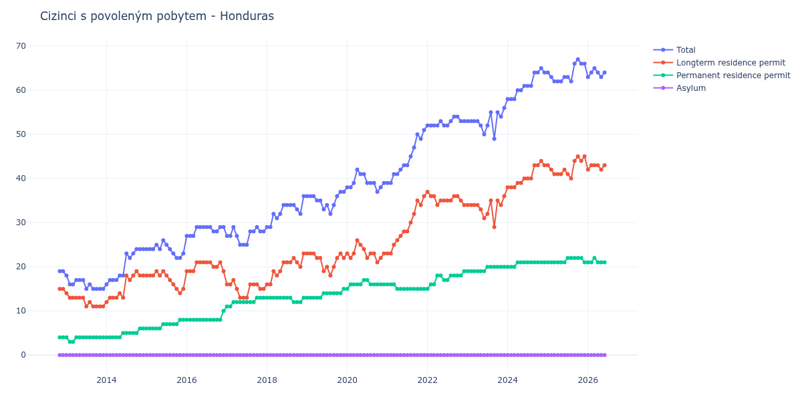

# Honduras

## Souhrnné statistiky (Min/Max pro rok) / Summary Statistics (Min/Max per year)

| Year   | Total   | Longterm Residence Permit   | Permanent Residence Permit   | Asylum   |
|--------|---------|-----------------------------|------------------------------|----------|
| 2012   | 19 / 19 | 15 / 15                     | 4 / 4                        | 0 / 0    |
| 2013   | 15 / 18 | 11 / 14                     | 3 / 4                        | 0 / 0    |
| 2014   | 16 / 24 | 12 / 19                     | 4 / 6                        | 0 / 0    |
| 2015   | 22 / 26 | 14 / 19                     | 6 / 8                        | 0 / 0    |
| 2016   | 27 / 29 | 19 / 21                     | 8 / 10                       | 0 / 0    |
| 2017   | 25 / 29 | 13 / 17                     | 11 / 13                      | 0 / 0    |
| 2018   | 29 / 36 | 16 / 23                     | 12 / 13                      | 0 / 0    |
| 2019   | 32 / 37 | 18 / 23                     | 13 / 15                      | 0 / 0    |
| 2020   | 37 / 42 | 21 / 26                     | 15 / 17                      | 0 / 0    |
| 2021   | 39 / 51 | 23 / 36                     | 15 / 16                      | 0 / 0    |
| 2022   | 52 / 54 | 34 / 37                     | 15 / 19                      | 0 / 0    |
| 2023   | 49 / 56 | 29 / 36                     | 19 / 20                      | 0 / 0    |
| 2024   | 58 / 65 | 38 / 44                     | 20 / 21                      | 0 / 0    |
| 2025   | 62 / 67 | 40 / 45                     | 21 / 22                      | 0 / 0    |
| 2026   | 63 / 65 | 42 / 43                     | 21 / 22                      | 0 / 0    |

## Detailní tabulka / Detailed Data Table

| Date     | Total        | Longterm Residence Permit   | Permanent Residence Permit   | Asylum   |
|----------|--------------|-----------------------------|------------------------------|----------|
| **2012** |              |                             |                              |          |
| 11.2012  | 19           | 15                          | 4                            | 0        |
| 12.2012  | 19 (+0.00%)  | 15 (+0.00%)                 | 4 (+0.00%)                   | 0        |
| **2013** |              |                             |                              |          |
| 01.2013  | 18 (-5.26%)  | 14 (-6.67%)                 | 4 (+0.00%)                   | 0        |
| 02.2013  | 16 (-11.11%) | 13 (-7.14%)                 | 3 (-25.00%)                  | 0        |
| 03.2013  | 16 (+0.00%)  | 13 (+0.00%)                 | 3 (+0.00%)                   | 0        |
| 04.2013  | 17 (+6.25%)  | 13 (+0.00%)                 | 4 (+33.33%)                  | 0        |
| 05.2013  | 17 (+0.00%)  | 13 (+0.00%)                 | 4 (+0.00%)                   | 0        |
| 06.2013  | 17 (+0.00%)  | 13 (+0.00%)                 | 4 (+0.00%)                   | 0        |
| 07.2013  | 15 (-11.76%) | 11 (-15.38%)                | 4 (+0.00%)                   | 0        |
| 08.2013  | 16 (+6.67%)  | 12 (+9.09%)                 | 4 (+0.00%)                   | 0        |
| 09.2013  | 15 (-6.25%)  | 11 (-8.33%)                 | 4 (+0.00%)                   | 0        |
| 10.2013  | 15 (+0.00%)  | 11 (+0.00%)                 | 4 (+0.00%)                   | 0        |
| 11.2013  | 15 (+0.00%)  | 11 (+0.00%)                 | 4 (+0.00%)                   | 0        |
| 12.2013  | 15 (+0.00%)  | 11 (+0.00%)                 | 4 (+0.00%)                   | 0        |
| **2014** |              |                             |                              |          |
| 01.2014  | 16 (+6.67%)  | 12 (+9.09%)                 | 4 (+0.00%)                   | 0        |
| 02.2014  | 17 (+6.25%)  | 13 (+8.33%)                 | 4 (+0.00%)                   | 0        |
| 03.2014  | 17 (+0.00%)  | 13 (+0.00%)                 | 4 (+0.00%)                   | 0        |
| 04.2014  | 17 (+0.00%)  | 13 (+0.00%)                 | 4 (+0.00%)                   | 0        |
| 05.2014  | 18 (+5.88%)  | 14 (+7.69%)                 | 4 (+0.00%)                   | 0        |
| 06.2014  | 18 (+0.00%)  | 13 (-7.14%)                 | 5 (+25.00%)                  | 0        |
| 07.2014  | 23 (+27.78%) | 18 (+38.46%)                | 5 (+0.00%)                   | 0        |
| 08.2014  | 22 (-4.35%)  | 17 (-5.56%)                 | 5 (+0.00%)                   | 0        |
| 09.2014  | 23 (+4.55%)  | 18 (+5.88%)                 | 5 (+0.00%)                   | 0        |
| 10.2014  | 24 (+4.35%)  | 19 (+5.56%)                 | 5 (+0.00%)                   | 0        |
| 11.2014  | 24 (+0.00%)  | 18 (-5.26%)                 | 6 (+20.00%)                  | 0        |
| 12.2014  | 24 (+0.00%)  | 18 (+0.00%)                 | 6 (+0.00%)                   | 0        |
| **2015** |              |                             |                              |          |
| 01.2015  | 24 (+0.00%)  | 18 (+0.00%)                 | 6 (+0.00%)                   | 0        |
| 02.2015  | 24 (+0.00%)  | 18 (+0.00%)                 | 6 (+0.00%)                   | 0        |
| 03.2015  | 24 (+0.00%)  | 18 (+0.00%)                 | 6 (+0.00%)                   | 0        |
| 04.2015  | 25 (+4.17%)  | 19 (+5.56%)                 | 6 (+0.00%)                   | 0        |
| 05.2015  | 24 (-4.00%)  | 18 (-5.26%)                 | 6 (+0.00%)                   | 0        |
| 06.2015  | 26 (+8.33%)  | 19 (+5.56%)                 | 7 (+16.67%)                  | 0        |
| 07.2015  | 25 (-3.85%)  | 18 (-5.26%)                 | 7 (+0.00%)                   | 0        |
| 08.2015  | 24 (-4.00%)  | 17 (-5.56%)                 | 7 (+0.00%)                   | 0        |
| 09.2015  | 23 (-4.17%)  | 16 (-5.88%)                 | 7 (+0.00%)                   | 0        |
| 10.2015  | 22 (-4.35%)  | 15 (-6.25%)                 | 7 (+0.00%)                   | 0        |
| 11.2015  | 22 (+0.00%)  | 14 (-6.67%)                 | 8 (+14.29%)                  | 0        |
| 12.2015  | 23 (+4.55%)  | 15 (+7.14%)                 | 8 (+0.00%)                   | 0        |
| **2016** |              |                             |                              |          |
| 01.2016  | 27 (+17.39%) | 19 (+26.67%)                | 8 (+0.00%)                   | 0        |
| 02.2016  | 27 (+0.00%)  | 19 (+0.00%)                 | 8 (+0.00%)                   | 0        |
| 03.2016  | 27 (+0.00%)  | 19 (+0.00%)                 | 8 (+0.00%)                   | 0        |
| 04.2016  | 29 (+7.41%)  | 21 (+10.53%)                | 8 (+0.00%)                   | 0        |
| 05.2016  | 29 (+0.00%)  | 21 (+0.00%)                 | 8 (+0.00%)                   | 0        |
| 06.2016  | 29 (+0.00%)  | 21 (+0.00%)                 | 8 (+0.00%)                   | 0        |
| 07.2016  | 29 (+0.00%)  | 21 (+0.00%)                 | 8 (+0.00%)                   | 0        |
| 08.2016  | 29 (+0.00%)  | 21 (+0.00%)                 | 8 (+0.00%)                   | 0        |
| 09.2016  | 28 (-3.45%)  | 20 (-4.76%)                 | 8 (+0.00%)                   | 0        |
| 10.2016  | 28 (+0.00%)  | 20 (+0.00%)                 | 8 (+0.00%)                   | 0        |
| 11.2016  | 29 (+3.57%)  | 21 (+5.00%)                 | 8 (+0.00%)                   | 0        |
| 12.2016  | 29 (+0.00%)  | 19 (-9.52%)                 | 10 (+25.00%)                 | 0        |
| **2017** |              |                             |                              |          |
| 01.2017  | 27 (-6.90%)  | 16 (-15.79%)                | 11 (+10.00%)                 | 0        |
| 02.2017  | 27 (+0.00%)  | 16 (+0.00%)                 | 11 (+0.00%)                  | 0        |
| 03.2017  | 29 (+7.41%)  | 17 (+6.25%)                 | 12 (+9.09%)                  | 0        |
| 04.2017  | 27 (-6.90%)  | 15 (-11.76%)                | 12 (+0.00%)                  | 0        |
| 05.2017  | 25 (-7.41%)  | 13 (-13.33%)                | 12 (+0.00%)                  | 0        |
| 06.2017  | 25 (+0.00%)  | 13 (+0.00%)                 | 12 (+0.00%)                  | 0        |
| 07.2017  | 25 (+0.00%)  | 13 (+0.00%)                 | 12 (+0.00%)                  | 0        |
| 08.2017  | 28 (+12.00%) | 16 (+23.08%)                | 12 (+0.00%)                  | 0        |
| 09.2017  | 28 (+0.00%)  | 16 (+0.00%)                 | 12 (+0.00%)                  | 0        |
| 10.2017  | 29 (+3.57%)  | 16 (+0.00%)                 | 13 (+8.33%)                  | 0        |
| 11.2017  | 28 (-3.45%)  | 15 (-6.25%)                 | 13 (+0.00%)                  | 0        |
| 12.2017  | 28 (+0.00%)  | 15 (+0.00%)                 | 13 (+0.00%)                  | 0        |
| **2018** |              |                             |                              |          |
| 01.2018  | 29 (+3.57%)  | 16 (+6.67%)                 | 13 (+0.00%)                  | 0        |
| 02.2018  | 29 (+0.00%)  | 16 (+0.00%)                 | 13 (+0.00%)                  | 0        |
| 03.2018  | 32 (+10.34%) | 19 (+18.75%)                | 13 (+0.00%)                  | 0        |
| 04.2018  | 31 (-3.12%)  | 18 (-5.26%)                 | 13 (+0.00%)                  | 0        |
| 05.2018  | 32 (+3.23%)  | 19 (+5.56%)                 | 13 (+0.00%)                  | 0        |
| 06.2018  | 34 (+6.25%)  | 21 (+10.53%)                | 13 (+0.00%)                  | 0        |
| 07.2018  | 34 (+0.00%)  | 21 (+0.00%)                 | 13 (+0.00%)                  | 0        |
| 08.2018  | 34 (+0.00%)  | 21 (+0.00%)                 | 13 (+0.00%)                  | 0        |
| 09.2018  | 34 (+0.00%)  | 22 (+4.76%)                 | 12 (-7.69%)                  | 0        |
| 10.2018  | 33 (-2.94%)  | 21 (-4.55%)                 | 12 (+0.00%)                  | 0        |
| 11.2018  | 32 (-3.03%)  | 20 (-4.76%)                 | 12 (+0.00%)                  | 0        |
| 12.2018  | 36 (+12.50%) | 23 (+15.00%)                | 13 (+8.33%)                  | 0        |
| **2019** |              |                             |                              |          |
| 01.2019  | 36 (+0.00%)  | 23 (+0.00%)                 | 13 (+0.00%)                  | 0        |
| 02.2019  | 36 (+0.00%)  | 23 (+0.00%)                 | 13 (+0.00%)                  | 0        |
| 03.2019  | 36 (+0.00%)  | 23 (+0.00%)                 | 13 (+0.00%)                  | 0        |
| 04.2019  | 35 (-2.78%)  | 22 (-4.35%)                 | 13 (+0.00%)                  | 0        |
| 05.2019  | 35 (+0.00%)  | 22 (+0.00%)                 | 13 (+0.00%)                  | 0        |
| 06.2019  | 33 (-5.71%)  | 19 (-13.64%)                | 14 (+7.69%)                  | 0        |
| 07.2019  | 34 (+3.03%)  | 20 (+5.26%)                 | 14 (+0.00%)                  | 0        |
| 08.2019  | 32 (-5.88%)  | 18 (-10.00%)                | 14 (+0.00%)                  | 0        |
| 09.2019  | 34 (+6.25%)  | 20 (+11.11%)                | 14 (+0.00%)                  | 0        |
| 10.2019  | 36 (+5.88%)  | 22 (+10.00%)                | 14 (+0.00%)                  | 0        |
| 11.2019  | 37 (+2.78%)  | 23 (+4.55%)                 | 14 (+0.00%)                  | 0        |
| 12.2019  | 37 (+0.00%)  | 22 (-4.35%)                 | 15 (+7.14%)                  | 0        |
| **2020** |              |                             |                              |          |
| 01.2020  | 38 (+2.70%)  | 23 (+4.55%)                 | 15 (+0.00%)                  | 0        |
| 02.2020  | 38 (+0.00%)  | 22 (-4.35%)                 | 16 (+6.67%)                  | 0        |
| 03.2020  | 39 (+2.63%)  | 23 (+4.55%)                 | 16 (+0.00%)                  | 0        |
| 04.2020  | 42 (+7.69%)  | 26 (+13.04%)                | 16 (+0.00%)                  | 0        |
| 05.2020  | 41 (-2.38%)  | 25 (-3.85%)                 | 16 (+0.00%)                  | 0        |
| 06.2020  | 41 (+0.00%)  | 24 (-4.00%)                 | 17 (+6.25%)                  | 0        |
| 07.2020  | 39 (-4.88%)  | 22 (-8.33%)                 | 17 (+0.00%)                  | 0        |
| 08.2020  | 39 (+0.00%)  | 23 (+4.55%)                 | 16 (-5.88%)                  | 0        |
| 09.2020  | 39 (+0.00%)  | 23 (+0.00%)                 | 16 (+0.00%)                  | 0        |
| 10.2020  | 37 (-5.13%)  | 21 (-8.70%)                 | 16 (+0.00%)                  | 0        |
| 11.2020  | 38 (+2.70%)  | 22 (+4.76%)                 | 16 (+0.00%)                  | 0        |
| 12.2020  | 39 (+2.63%)  | 23 (+4.55%)                 | 16 (+0.00%)                  | 0        |
| **2021** |              |                             |                              |          |
| 01.2021  | 39 (+0.00%)  | 23 (+0.00%)                 | 16 (+0.00%)                  | 0        |
| 02.2021  | 39 (+0.00%)  | 23 (+0.00%)                 | 16 (+0.00%)                  | 0        |
| 03.2021  | 41 (+5.13%)  | 25 (+8.70%)                 | 16 (+0.00%)                  | 0        |
| 04.2021  | 41 (+0.00%)  | 26 (+4.00%)                 | 15 (-6.25%)                  | 0        |
| 05.2021  | 42 (+2.44%)  | 27 (+3.85%)                 | 15 (+0.00%)                  | 0        |
| 06.2021  | 43 (+2.38%)  | 28 (+3.70%)                 | 15 (+0.00%)                  | 0        |
| 07.2021  | 43 (+0.00%)  | 28 (+0.00%)                 | 15 (+0.00%)                  | 0        |
| 08.2021  | 45 (+4.65%)  | 30 (+7.14%)                 | 15 (+0.00%)                  | 0        |
| 09.2021  | 47 (+4.44%)  | 32 (+6.67%)                 | 15 (+0.00%)                  | 0        |
| 10.2021  | 50 (+6.38%)  | 35 (+9.38%)                 | 15 (+0.00%)                  | 0        |
| 11.2021  | 49 (-2.00%)  | 34 (-2.86%)                 | 15 (+0.00%)                  | 0        |
| 12.2021  | 51 (+4.08%)  | 36 (+5.88%)                 | 15 (+0.00%)                  | 0        |
| **2022** |              |                             |                              |          |
| 01.2022  | 52 (+1.96%)  | 37 (+2.78%)                 | 15 (+0.00%)                  | 0        |
| 02.2022  | 52 (+0.00%)  | 36 (-2.70%)                 | 16 (+6.67%)                  | 0        |
| 03.2022  | 52 (+0.00%)  | 36 (+0.00%)                 | 16 (+0.00%)                  | 0        |
| 04.2022  | 52 (+0.00%)  | 34 (-5.56%)                 | 18 (+12.50%)                 | 0        |
| 05.2022  | 53 (+1.92%)  | 35 (+2.94%)                 | 18 (+0.00%)                  | 0        |
| 06.2022  | 52 (-1.89%)  | 35 (+0.00%)                 | 17 (-5.56%)                  | 0        |
| 07.2022  | 52 (+0.00%)  | 35 (+0.00%)                 | 17 (+0.00%)                  | 0        |
| 08.2022  | 53 (+1.92%)  | 35 (+0.00%)                 | 18 (+5.88%)                  | 0        |
| 09.2022  | 54 (+1.89%)  | 36 (+2.86%)                 | 18 (+0.00%)                  | 0        |
| 10.2022  | 54 (+0.00%)  | 36 (+0.00%)                 | 18 (+0.00%)                  | 0        |
| 11.2022  | 53 (-1.85%)  | 35 (-2.78%)                 | 18 (+0.00%)                  | 0        |
| 12.2022  | 53 (+0.00%)  | 34 (-2.86%)                 | 19 (+5.56%)                  | 0        |
| **2023** |              |                             |                              |          |
| 01.2023  | 53 (+0.00%)  | 34 (+0.00%)                 | 19 (+0.00%)                  | 0        |
| 02.2023  | 53 (+0.00%)  | 34 (+0.00%)                 | 19 (+0.00%)                  | 0        |
| 03.2023  | 53 (+0.00%)  | 34 (+0.00%)                 | 19 (+0.00%)                  | 0        |
| 04.2023  | 53 (+0.00%)  | 34 (+0.00%)                 | 19 (+0.00%)                  | 0        |
| 05.2023  | 52 (-1.89%)  | 33 (-2.94%)                 | 19 (+0.00%)                  | 0        |
| 06.2023  | 50 (-3.85%)  | 31 (-6.06%)                 | 19 (+0.00%)                  | 0        |
| 07.2023  | 52 (+4.00%)  | 32 (+3.23%)                 | 20 (+5.26%)                  | 0        |
| 08.2023  | 55 (+5.77%)  | 35 (+9.38%)                 | 20 (+0.00%)                  | 0        |
| 09.2023  | 49 (-10.91%) | 29 (-17.14%)                | 20 (+0.00%)                  | 0        |
| 10.2023  | 55 (+12.24%) | 35 (+20.69%)                | 20 (+0.00%)                  | 0        |
| 11.2023  | 54 (-1.82%)  | 34 (-2.86%)                 | 20 (+0.00%)                  | 0        |
| 12.2023  | 56 (+3.70%)  | 36 (+5.88%)                 | 20 (+0.00%)                  | 0        |
| **2024** |              |                             |                              |          |
| 01.2024  | 58 (+3.57%)  | 38 (+5.56%)                 | 20 (+0.00%)                  | 0        |
| 02.2024  | 58 (+0.00%)  | 38 (+0.00%)                 | 20 (+0.00%)                  | 0        |
| 03.2024  | 58 (+0.00%)  | 38 (+0.00%)                 | 20 (+0.00%)                  | 0        |
| 04.2024  | 60 (+3.45%)  | 39 (+2.63%)                 | 21 (+5.00%)                  | 0        |
| 05.2024  | 60 (+0.00%)  | 39 (+0.00%)                 | 21 (+0.00%)                  | 0        |
| 06.2024  | 61 (+1.67%)  | 40 (+2.56%)                 | 21 (+0.00%)                  | 0        |
| 07.2024  | 61 (+0.00%)  | 40 (+0.00%)                 | 21 (+0.00%)                  | 0        |
| 08.2024  | 61 (+0.00%)  | 40 (+0.00%)                 | 21 (+0.00%)                  | 0        |
| 09.2024  | 64 (+4.92%)  | 43 (+7.50%)                 | 21 (+0.00%)                  | 0        |
| 10.2024  | 64 (+0.00%)  | 43 (+0.00%)                 | 21 (+0.00%)                  | 0        |
| 11.2024  | 65 (+1.56%)  | 44 (+2.33%)                 | 21 (+0.00%)                  | 0        |
| 12.2024  | 64 (-1.54%)  | 43 (-2.27%)                 | 21 (+0.00%)                  | 0        |
| **2025** |              |                             |                              |          |
| 01.2025  | 64 (+0.00%)  | 43 (+0.00%)                 | 21 (+0.00%)                  | 0        |
| 02.2025  | 63 (-1.56%)  | 42 (-2.33%)                 | 21 (+0.00%)                  | 0        |
| 03.2025  | 62 (-1.59%)  | 41 (-2.38%)                 | 21 (+0.00%)                  | 0        |
| 04.2025  | 62 (+0.00%)  | 41 (+0.00%)                 | 21 (+0.00%)                  | 0        |
| 05.2025  | 62 (+0.00%)  | 41 (+0.00%)                 | 21 (+0.00%)                  | 0        |
| 06.2025  | 63 (+1.61%)  | 42 (+2.44%)                 | 21 (+0.00%)                  | 0        |
| 07.2025  | 63 (+0.00%)  | 41 (-2.38%)                 | 22 (+4.76%)                  | 0        |
| 08.2025  | 62 (-1.59%)  | 40 (-2.44%)                 | 22 (+0.00%)                  | 0        |
| 09.2025  | 66 (+6.45%)  | 44 (+10.00%)                | 22 (+0.00%)                  | 0        |
| 10.2025  | 67 (+1.52%)  | 45 (+2.27%)                 | 22 (+0.00%)                  | 0        |
| 11.2025  | 66 (-1.49%)  | 44 (-2.22%)                 | 22 (+0.00%)                  | 0        |
| 12.2025  | 66 (+0.00%)  | 45 (+2.27%)                 | 21 (-4.55%)                  | 0        |
| **2026** |              |                             |                              |          |
| 01.2026  | 63 (-4.55%)  | 42 (-6.67%)                 | 21 (+0.00%)                  | 0        |
| 02.2026  | 64 (+1.59%)  | 43 (+2.38%)                 | 21 (+0.00%)                  | 0        |
| 03.2026  | 65 (+1.56%)  | 43 (+0.00%)                 | 22 (+4.76%)                  | 0        |
| 04.2026  | 64 (-1.54%)  | 43 (+0.00%)                 | 21 (-4.55%)                  | 0        |
| 05.2026  | 63 (-1.56%)  | 42 (-2.33%)                 | 21 (+0.00%)                  | 0        |
| 06.2026  | 64 (+1.59%)  | 43 (+2.38%)                 | 21 (+0.00%)                  | 0        |
