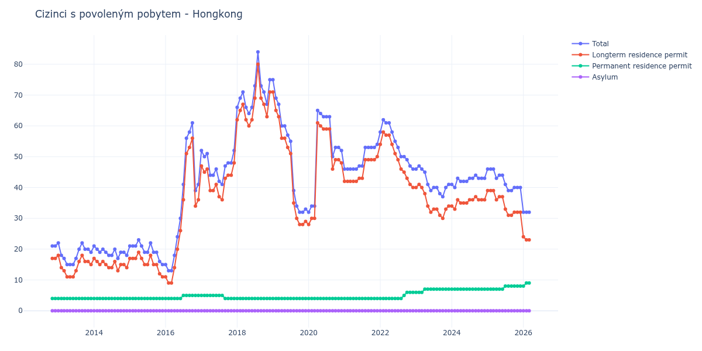

# Hongkong

## Souhrnné statistiky (Min/Max pro rok) / Summary Statistics (Min/Max per year)

| Year   | Total   | Longterm Residence Permit   | Permanent Residence Permit   | Asylum   |
|--------|---------|-----------------------------|------------------------------|----------|
| 2012   | 21 / 21 | 17 / 17                     | 4 / 4                        | 0 / 0    |
| 2013   | 15 / 22 | 11 / 18                     | 4 / 4                        | 0 / 0    |
| 2014   | 17 / 21 | 13 / 17                     | 4 / 4                        | 0 / 0    |
| 2015   | 15 / 23 | 11 / 19                     | 4 / 4                        | 0 / 0    |
| 2016   | 13 / 61 | 9 / 56                      | 4 / 5                        | 0 / 0    |
| 2017   | 41 / 52 | 36 / 48                     | 4 / 5                        | 0 / 0    |
| 2018   | 64 / 84 | 60 / 80                     | 4 / 4                        | 0 / 0    |
| 2019   | 32 / 75 | 28 / 71                     | 4 / 4                        | 0 / 0    |
| 2020   | 32 / 65 | 28 / 61                     | 4 / 4                        | 0 / 0    |
| 2021   | 46 / 54 | 42 / 50                     | 4 / 4                        | 0 / 0    |
| 2022   | 46 / 62 | 40 / 58                     | 4 / 6                        | 0 / 0    |
| 2023   | 37 / 47 | 30 / 41                     | 6 / 7                        | 0 / 0    |
| 2024   | 40 / 44 | 33 / 37                     | 7 / 7                        | 0 / 0    |
| 2025   | 39 / 46 | 31 / 39                     | 7 / 8                        | 0 / 0    |
| 2026   | 32 / 32 | 23 / 24                     | 8 / 9                        | 0 / 0    |

## Detailní tabulka / Detailed Data Table

| Date     | Total        | Longterm Residence Permit   | Permanent Residence Permit   | Asylum   |
|----------|--------------|-----------------------------|------------------------------|----------|
| **2012** |              |                             |                              |          |
| 11.2012  | 21           | 17                          | 4                            | 0        |
| 12.2012  | 21 (+0.00%)  | 17 (+0.00%)                 | 4 (+0.00%)                   | 0        |
| **2013** |              |                             |                              |          |
| 01.2013  | 22 (+4.76%)  | 18 (+5.88%)                 | 4 (+0.00%)                   | 0        |
| 02.2013  | 18 (-18.18%) | 14 (-22.22%)                | 4 (+0.00%)                   | 0        |
| 03.2013  | 17 (-5.56%)  | 13 (-7.14%)                 | 4 (+0.00%)                   | 0        |
| 04.2013  | 15 (-11.76%) | 11 (-15.38%)                | 4 (+0.00%)                   | 0        |
| 05.2013  | 15 (+0.00%)  | 11 (+0.00%)                 | 4 (+0.00%)                   | 0        |
| 06.2013  | 15 (+0.00%)  | 11 (+0.00%)                 | 4 (+0.00%)                   | 0        |
| 07.2013  | 17 (+13.33%) | 13 (+18.18%)                | 4 (+0.00%)                   | 0        |
| 08.2013  | 20 (+17.65%) | 16 (+23.08%)                | 4 (+0.00%)                   | 0        |
| 09.2013  | 22 (+10.00%) | 18 (+12.50%)                | 4 (+0.00%)                   | 0        |
| 10.2013  | 20 (-9.09%)  | 16 (-11.11%)                | 4 (+0.00%)                   | 0        |
| 11.2013  | 20 (+0.00%)  | 16 (+0.00%)                 | 4 (+0.00%)                   | 0        |
| 12.2013  | 19 (-5.00%)  | 15 (-6.25%)                 | 4 (+0.00%)                   | 0        |
| **2014** |              |                             |                              |          |
| 01.2014  | 21 (+10.53%) | 17 (+13.33%)                | 4 (+0.00%)                   | 0        |
| 02.2014  | 20 (-4.76%)  | 16 (-5.88%)                 | 4 (+0.00%)                   | 0        |
| 03.2014  | 19 (-5.00%)  | 15 (-6.25%)                 | 4 (+0.00%)                   | 0        |
| 04.2014  | 20 (+5.26%)  | 16 (+6.67%)                 | 4 (+0.00%)                   | 0        |
| 05.2014  | 19 (-5.00%)  | 15 (-6.25%)                 | 4 (+0.00%)                   | 0        |
| 06.2014  | 18 (-5.26%)  | 14 (-6.67%)                 | 4 (+0.00%)                   | 0        |
| 07.2014  | 18 (+0.00%)  | 14 (+0.00%)                 | 4 (+0.00%)                   | 0        |
| 08.2014  | 20 (+11.11%) | 16 (+14.29%)                | 4 (+0.00%)                   | 0        |
| 09.2014  | 17 (-15.00%) | 13 (-18.75%)                | 4 (+0.00%)                   | 0        |
| 10.2014  | 19 (+11.76%) | 15 (+15.38%)                | 4 (+0.00%)                   | 0        |
| 11.2014  | 19 (+0.00%)  | 15 (+0.00%)                 | 4 (+0.00%)                   | 0        |
| 12.2014  | 18 (-5.26%)  | 14 (-6.67%)                 | 4 (+0.00%)                   | 0        |
| **2015** |              |                             |                              |          |
| 01.2015  | 21 (+16.67%) | 17 (+21.43%)                | 4 (+0.00%)                   | 0        |
| 02.2015  | 21 (+0.00%)  | 17 (+0.00%)                 | 4 (+0.00%)                   | 0        |
| 03.2015  | 21 (+0.00%)  | 17 (+0.00%)                 | 4 (+0.00%)                   | 0        |
| 04.2015  | 23 (+9.52%)  | 19 (+11.76%)                | 4 (+0.00%)                   | 0        |
| 05.2015  | 21 (-8.70%)  | 17 (-10.53%)                | 4 (+0.00%)                   | 0        |
| 06.2015  | 19 (-9.52%)  | 15 (-11.76%)                | 4 (+0.00%)                   | 0        |
| 07.2015  | 19 (+0.00%)  | 15 (+0.00%)                 | 4 (+0.00%)                   | 0        |
| 08.2015  | 22 (+15.79%) | 18 (+20.00%)                | 4 (+0.00%)                   | 0        |
| 09.2015  | 19 (-13.64%) | 15 (-16.67%)                | 4 (+0.00%)                   | 0        |
| 10.2015  | 19 (+0.00%)  | 15 (+0.00%)                 | 4 (+0.00%)                   | 0        |
| 11.2015  | 16 (-15.79%) | 12 (-20.00%)                | 4 (+0.00%)                   | 0        |
| 12.2015  | 15 (-6.25%)  | 11 (-8.33%)                 | 4 (+0.00%)                   | 0        |
| **2016** |              |                             |                              |          |
| 01.2016  | 15 (+0.00%)  | 11 (+0.00%)                 | 4 (+0.00%)                   | 0        |
| 02.2016  | 13 (-13.33%) | 9 (-18.18%)                 | 4 (+0.00%)                   | 0        |
| 03.2016  | 13 (+0.00%)  | 9 (+0.00%)                  | 4 (+0.00%)                   | 0        |
| 04.2016  | 18 (+38.46%) | 14 (+55.56%)                | 4 (+0.00%)                   | 0        |
| 05.2016  | 24 (+33.33%) | 20 (+42.86%)                | 4 (+0.00%)                   | 0        |
| 06.2016  | 30 (+25.00%) | 26 (+30.00%)                | 4 (+0.00%)                   | 0        |
| 07.2016  | 41 (+36.67%) | 36 (+38.46%)                | 5 (+25.00%)                  | 0        |
| 08.2016  | 56 (+36.59%) | 51 (+41.67%)                | 5 (+0.00%)                   | 0        |
| 09.2016  | 58 (+3.57%)  | 53 (+3.92%)                 | 5 (+0.00%)                   | 0        |
| 10.2016  | 61 (+5.17%)  | 56 (+5.66%)                 | 5 (+0.00%)                   | 0        |
| 11.2016  | 39 (-36.07%) | 34 (-39.29%)                | 5 (+0.00%)                   | 0        |
| 12.2016  | 41 (+5.13%)  | 36 (+5.88%)                 | 5 (+0.00%)                   | 0        |
| **2017** |              |                             |                              |          |
| 01.2017  | 52 (+26.83%) | 47 (+30.56%)                | 5 (+0.00%)                   | 0        |
| 02.2017  | 50 (-3.85%)  | 45 (-4.26%)                 | 5 (+0.00%)                   | 0        |
| 03.2017  | 51 (+2.00%)  | 46 (+2.22%)                 | 5 (+0.00%)                   | 0        |
| 04.2017  | 44 (-13.73%) | 39 (-15.22%)                | 5 (+0.00%)                   | 0        |
| 05.2017  | 44 (+0.00%)  | 39 (+0.00%)                 | 5 (+0.00%)                   | 0        |
| 06.2017  | 46 (+4.55%)  | 41 (+5.13%)                 | 5 (+0.00%)                   | 0        |
| 07.2017  | 42 (-8.70%)  | 37 (-9.76%)                 | 5 (+0.00%)                   | 0        |
| 08.2017  | 41 (-2.38%)  | 36 (-2.70%)                 | 5 (+0.00%)                   | 0        |
| 09.2017  | 47 (+14.63%) | 43 (+19.44%)                | 4 (-20.00%)                  | 0        |
| 10.2017  | 48 (+2.13%)  | 44 (+2.33%)                 | 4 (+0.00%)                   | 0        |
| 11.2017  | 48 (+0.00%)  | 44 (+0.00%)                 | 4 (+0.00%)                   | 0        |
| 12.2017  | 52 (+8.33%)  | 48 (+9.09%)                 | 4 (+0.00%)                   | 0        |
| **2018** |              |                             |                              |          |
| 01.2018  | 66 (+26.92%) | 62 (+29.17%)                | 4 (+0.00%)                   | 0        |
| 02.2018  | 69 (+4.55%)  | 65 (+4.84%)                 | 4 (+0.00%)                   | 0        |
| 03.2018  | 71 (+2.90%)  | 67 (+3.08%)                 | 4 (+0.00%)                   | 0        |
| 04.2018  | 66 (-7.04%)  | 62 (-7.46%)                 | 4 (+0.00%)                   | 0        |
| 05.2018  | 64 (-3.03%)  | 60 (-3.23%)                 | 4 (+0.00%)                   | 0        |
| 06.2018  | 66 (+3.12%)  | 62 (+3.33%)                 | 4 (+0.00%)                   | 0        |
| 07.2018  | 73 (+10.61%) | 69 (+11.29%)                | 4 (+0.00%)                   | 0        |
| 08.2018  | 84 (+15.07%) | 80 (+15.94%)                | 4 (+0.00%)                   | 0        |
| 09.2018  | 73 (-13.10%) | 69 (-13.75%)                | 4 (+0.00%)                   | 0        |
| 10.2018  | 71 (-2.74%)  | 67 (-2.90%)                 | 4 (+0.00%)                   | 0        |
| 11.2018  | 67 (-5.63%)  | 63 (-5.97%)                 | 4 (+0.00%)                   | 0        |
| 12.2018  | 75 (+11.94%) | 71 (+12.70%)                | 4 (+0.00%)                   | 0        |
| **2019** |              |                             |                              |          |
| 01.2019  | 75 (+0.00%)  | 71 (+0.00%)                 | 4 (+0.00%)                   | 0        |
| 02.2019  | 69 (-8.00%)  | 65 (-8.45%)                 | 4 (+0.00%)                   | 0        |
| 03.2019  | 67 (-2.90%)  | 63 (-3.08%)                 | 4 (+0.00%)                   | 0        |
| 04.2019  | 60 (-10.45%) | 56 (-11.11%)                | 4 (+0.00%)                   | 0        |
| 05.2019  | 60 (+0.00%)  | 56 (+0.00%)                 | 4 (+0.00%)                   | 0        |
| 06.2019  | 57 (-5.00%)  | 53 (-5.36%)                 | 4 (+0.00%)                   | 0        |
| 07.2019  | 55 (-3.51%)  | 51 (-3.77%)                 | 4 (+0.00%)                   | 0        |
| 08.2019  | 39 (-29.09%) | 35 (-31.37%)                | 4 (+0.00%)                   | 0        |
| 09.2019  | 34 (-12.82%) | 30 (-14.29%)                | 4 (+0.00%)                   | 0        |
| 10.2019  | 32 (-5.88%)  | 28 (-6.67%)                 | 4 (+0.00%)                   | 0        |
| 11.2019  | 32 (+0.00%)  | 28 (+0.00%)                 | 4 (+0.00%)                   | 0        |
| 12.2019  | 33 (+3.12%)  | 29 (+3.57%)                 | 4 (+0.00%)                   | 0        |
| **2020** |              |                             |                              |          |
| 01.2020  | 32 (-3.03%)  | 28 (-3.45%)                 | 4 (+0.00%)                   | 0        |
| 02.2020  | 34 (+6.25%)  | 30 (+7.14%)                 | 4 (+0.00%)                   | 0        |
| 03.2020  | 34 (+0.00%)  | 30 (+0.00%)                 | 4 (+0.00%)                   | 0        |
| 04.2020  | 65 (+91.18%) | 61 (+103.33%)               | 4 (+0.00%)                   | 0        |
| 05.2020  | 64 (-1.54%)  | 60 (-1.64%)                 | 4 (+0.00%)                   | 0        |
| 06.2020  | 63 (-1.56%)  | 59 (-1.67%)                 | 4 (+0.00%)                   | 0        |
| 07.2020  | 63 (+0.00%)  | 59 (+0.00%)                 | 4 (+0.00%)                   | 0        |
| 08.2020  | 63 (+0.00%)  | 59 (+0.00%)                 | 4 (+0.00%)                   | 0        |
| 09.2020  | 50 (-20.63%) | 46 (-22.03%)                | 4 (+0.00%)                   | 0        |
| 10.2020  | 53 (+6.00%)  | 49 (+6.52%)                 | 4 (+0.00%)                   | 0        |
| 11.2020  | 53 (+0.00%)  | 49 (+0.00%)                 | 4 (+0.00%)                   | 0        |
| 12.2020  | 52 (-1.89%)  | 48 (-2.04%)                 | 4 (+0.00%)                   | 0        |
| **2021** |              |                             |                              |          |
| 01.2021  | 46 (-11.54%) | 42 (-12.50%)                | 4 (+0.00%)                   | 0        |
| 02.2021  | 46 (+0.00%)  | 42 (+0.00%)                 | 4 (+0.00%)                   | 0        |
| 03.2021  | 46 (+0.00%)  | 42 (+0.00%)                 | 4 (+0.00%)                   | 0        |
| 04.2021  | 46 (+0.00%)  | 42 (+0.00%)                 | 4 (+0.00%)                   | 0        |
| 05.2021  | 46 (+0.00%)  | 42 (+0.00%)                 | 4 (+0.00%)                   | 0        |
| 06.2021  | 47 (+2.17%)  | 43 (+2.38%)                 | 4 (+0.00%)                   | 0        |
| 07.2021  | 47 (+0.00%)  | 43 (+0.00%)                 | 4 (+0.00%)                   | 0        |
| 08.2021  | 53 (+12.77%) | 49 (+13.95%)                | 4 (+0.00%)                   | 0        |
| 09.2021  | 53 (+0.00%)  | 49 (+0.00%)                 | 4 (+0.00%)                   | 0        |
| 10.2021  | 53 (+0.00%)  | 49 (+0.00%)                 | 4 (+0.00%)                   | 0        |
| 11.2021  | 53 (+0.00%)  | 49 (+0.00%)                 | 4 (+0.00%)                   | 0        |
| 12.2021  | 54 (+1.89%)  | 50 (+2.04%)                 | 4 (+0.00%)                   | 0        |
| **2022** |              |                             |                              |          |
| 01.2022  | 58 (+7.41%)  | 54 (+8.00%)                 | 4 (+0.00%)                   | 0        |
| 02.2022  | 62 (+6.90%)  | 58 (+7.41%)                 | 4 (+0.00%)                   | 0        |
| 03.2022  | 61 (-1.61%)  | 57 (-1.72%)                 | 4 (+0.00%)                   | 0        |
| 04.2022  | 61 (+0.00%)  | 57 (+0.00%)                 | 4 (+0.00%)                   | 0        |
| 05.2022  | 58 (-4.92%)  | 54 (-5.26%)                 | 4 (+0.00%)                   | 0        |
| 06.2022  | 55 (-5.17%)  | 51 (-5.56%)                 | 4 (+0.00%)                   | 0        |
| 07.2022  | 53 (-3.64%)  | 49 (-3.92%)                 | 4 (+0.00%)                   | 0        |
| 08.2022  | 50 (-5.66%)  | 46 (-6.12%)                 | 4 (+0.00%)                   | 0        |
| 09.2022  | 50 (+0.00%)  | 45 (-2.17%)                 | 5 (+25.00%)                  | 0        |
| 10.2022  | 49 (-2.00%)  | 43 (-4.44%)                 | 6 (+20.00%)                  | 0        |
| 11.2022  | 47 (-4.08%)  | 41 (-4.65%)                 | 6 (+0.00%)                   | 0        |
| 12.2022  | 46 (-2.13%)  | 40 (-2.44%)                 | 6 (+0.00%)                   | 0        |
| **2023** |              |                             |                              |          |
| 01.2023  | 46 (+0.00%)  | 40 (+0.00%)                 | 6 (+0.00%)                   | 0        |
| 02.2023  | 47 (+2.17%)  | 41 (+2.50%)                 | 6 (+0.00%)                   | 0        |
| 03.2023  | 46 (-2.13%)  | 40 (-2.44%)                 | 6 (+0.00%)                   | 0        |
| 04.2023  | 45 (-2.17%)  | 38 (-5.00%)                 | 7 (+16.67%)                  | 0        |
| 05.2023  | 41 (-8.89%)  | 34 (-10.53%)                | 7 (+0.00%)                   | 0        |
| 06.2023  | 39 (-4.88%)  | 32 (-5.88%)                 | 7 (+0.00%)                   | 0        |
| 07.2023  | 40 (+2.56%)  | 33 (+3.12%)                 | 7 (+0.00%)                   | 0        |
| 08.2023  | 40 (+0.00%)  | 33 (+0.00%)                 | 7 (+0.00%)                   | 0        |
| 09.2023  | 38 (-5.00%)  | 31 (-6.06%)                 | 7 (+0.00%)                   | 0        |
| 10.2023  | 37 (-2.63%)  | 30 (-3.23%)                 | 7 (+0.00%)                   | 0        |
| 11.2023  | 40 (+8.11%)  | 33 (+10.00%)                | 7 (+0.00%)                   | 0        |
| 12.2023  | 41 (+2.50%)  | 34 (+3.03%)                 | 7 (+0.00%)                   | 0        |
| **2024** |              |                             |                              |          |
| 01.2024  | 41 (+0.00%)  | 34 (+0.00%)                 | 7 (+0.00%)                   | 0        |
| 02.2024  | 40 (-2.44%)  | 33 (-2.94%)                 | 7 (+0.00%)                   | 0        |
| 03.2024  | 43 (+7.50%)  | 36 (+9.09%)                 | 7 (+0.00%)                   | 0        |
| 04.2024  | 42 (-2.33%)  | 35 (-2.78%)                 | 7 (+0.00%)                   | 0        |
| 05.2024  | 42 (+0.00%)  | 35 (+0.00%)                 | 7 (+0.00%)                   | 0        |
| 06.2024  | 42 (+0.00%)  | 35 (+0.00%)                 | 7 (+0.00%)                   | 0        |
| 07.2024  | 43 (+2.38%)  | 36 (+2.86%)                 | 7 (+0.00%)                   | 0        |
| 08.2024  | 43 (+0.00%)  | 36 (+0.00%)                 | 7 (+0.00%)                   | 0        |
| 09.2024  | 44 (+2.33%)  | 37 (+2.78%)                 | 7 (+0.00%)                   | 0        |
| 10.2024  | 43 (-2.27%)  | 36 (-2.70%)                 | 7 (+0.00%)                   | 0        |
| 11.2024  | 43 (+0.00%)  | 36 (+0.00%)                 | 7 (+0.00%)                   | 0        |
| 12.2024  | 43 (+0.00%)  | 36 (+0.00%)                 | 7 (+0.00%)                   | 0        |
| **2025** |              |                             |                              |          |
| 01.2025  | 46 (+6.98%)  | 39 (+8.33%)                 | 7 (+0.00%)                   | 0        |
| 02.2025  | 46 (+0.00%)  | 39 (+0.00%)                 | 7 (+0.00%)                   | 0        |
| 03.2025  | 46 (+0.00%)  | 39 (+0.00%)                 | 7 (+0.00%)                   | 0        |
| 04.2025  | 43 (-6.52%)  | 36 (-7.69%)                 | 7 (+0.00%)                   | 0        |
| 05.2025  | 44 (+2.33%)  | 37 (+2.78%)                 | 7 (+0.00%)                   | 0        |
| 06.2025  | 44 (+0.00%)  | 37 (+0.00%)                 | 7 (+0.00%)                   | 0        |
| 07.2025  | 41 (-6.82%)  | 33 (-10.81%)                | 8 (+14.29%)                  | 0        |
| 08.2025  | 39 (-4.88%)  | 31 (-6.06%)                 | 8 (+0.00%)                   | 0        |
| 09.2025  | 39 (+0.00%)  | 31 (+0.00%)                 | 8 (+0.00%)                   | 0        |
| 10.2025  | 40 (+2.56%)  | 32 (+3.23%)                 | 8 (+0.00%)                   | 0        |
| 11.2025  | 40 (+0.00%)  | 32 (+0.00%)                 | 8 (+0.00%)                   | 0        |
| 12.2025  | 40 (+0.00%)  | 32 (+0.00%)                 | 8 (+0.00%)                   | 0        |
| **2026** |              |                             |                              |          |
| 01.2026  | 32 (-20.00%) | 24 (-25.00%)                | 8 (+0.00%)                   | 0        |
| 02.2026  | 32 (+0.00%)  | 23 (-4.17%)                 | 9 (+12.50%)                  | 0        |
| 03.2026  | 32 (+0.00%)  | 23 (+0.00%)                 | 9 (+0.00%)                   | 0        |
