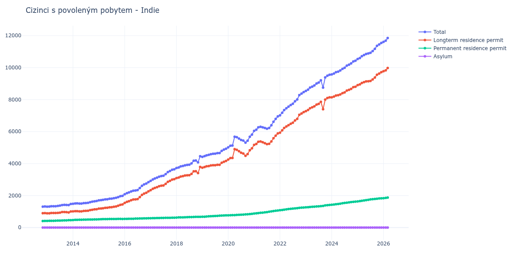

# Indie

## Souhrnné statistiky (Min/Max pro rok) / Summary Statistics (Min/Max per year)

| Year   | Total           | Longterm Residence Permit   | Permanent Residence Permit   | Asylum   |
|--------|-----------------|-----------------------------|------------------------------|----------|
| 2012   | 1 304 / 1 319   | 894 / 905                   | 410 / 414                    | 0 / 0    |
| 2013   | 1 308 / 1 471   | 890 / 1 007                 | 418 / 464                    | 0 / 0    |
| 2014   | 1 484 / 1 658   | 1 011 / 1 147               | 470 / 511                    | 0 / 0    |
| 2015   | 1 704 / 1 985   | 1 187 / 1 447               | 517 / 540                    | 0 / 0    |
| 2016   | 2 083 / 2 842   | 1 541 / 2 262               | 542 / 580                    | 0 / 0    |
| 2017   | 2 922 / 3 642   | 2 340 / 3 024               | 582 / 618                    | 0 / 0    |
| 2018   | 3 722 / 4 462   | 3 097 / 3 790               | 625 / 672                    | 0 / 0    |
| 2019   | 4 417 / 4 926   | 3 741 / 4 165               | 676 / 761                    | 0 / 0    |
| 2020   | 5 014 / 5 813   | 4 249 / 4 955               | 765 / 858                    | 0 / 0    |
| 2021   | 6 049 / 6 951   | 5 171 / 5 887               | 878 / 1 064                  | 0 / 0    |
| 2022   | 7 018 / 8 469   | 5 932 / 7 219               | 1 086 / 1 250                | 0 / 0    |
| 2023   | 8 546 / 9 553   | 7 281 / 8 142               | 1 265 / 1 411                | 0 / 0    |
| 2024   | 9 573 / 10 431  | 8 146 / 8 809               | 1 427 / 1 620                | 0 / 2    |
| 2025   | 10 543 / 11 545 | 8 905 / 9 717               | 1 636 / 1 826                | 2 / 2    |
| 2026   | 11 611 / 11 853 | 9 777 / 9 978               | 1 832 / 1 873                | 2 / 2    |

## Detailní tabulka / Detailed Data Table

| Date     | Total           | Longterm Residence Permit   | Permanent Residence Permit   | Asylum     |
|----------|-----------------|-----------------------------|------------------------------|------------|
| **2012** |                 |                             |                              |            |
| 11.2012  | 1 304           | 894                         | 410                          | 0          |
| 12.2012  | 1 319 (+1.15%)  | 905 (+1.23%)                | 414 (+0.98%)                 | 0          |
| **2013** |                 |                             |                              |            |
| 01.2013  | 1 308 (-0.83%)  | 890 (-1.66%)                | 418 (+0.97%)                 | 0          |
| 02.2013  | 1 311 (+0.23%)  | 892 (+0.22%)                | 419 (+0.24%)                 | 0          |
| 03.2013  | 1 331 (+1.53%)  | 910 (+2.02%)                | 421 (+0.48%)                 | 0          |
| 04.2013  | 1 334 (+0.23%)  | 910 (+0.00%)                | 424 (+0.71%)                 | 0          |
| 05.2013  | 1 335 (+0.07%)  | 908 (-0.22%)                | 427 (+0.71%)                 | 0          |
| 06.2013  | 1 351 (+1.20%)  | 919 (+1.21%)                | 432 (+1.17%)                 | 0          |
| 07.2013  | 1 372 (+1.55%)  | 934 (+1.63%)                | 438 (+1.39%)                 | 0          |
| 08.2013  | 1 408 (+2.62%)  | 968 (+3.64%)                | 440 (+0.46%)                 | 0          |
| 09.2013  | 1 417 (+0.64%)  | 970 (+0.21%)                | 447 (+1.59%)                 | 0          |
| 10.2013  | 1 414 (-0.21%)  | 962 (-0.82%)                | 452 (+1.12%)                 | 0          |
| 11.2013  | 1 407 (-0.50%)  | 947 (-1.56%)                | 460 (+1.77%)                 | 0          |
| 12.2013  | 1 471 (+4.55%)  | 1 007 (+6.34%)              | 464 (+0.87%)                 | 0          |
| **2014** |                 |                             |                              |            |
| 01.2014  | 1 484 (+0.88%)  | 1 014 (+0.70%)              | 470 (+1.29%)                 | 0          |
| 02.2014  | 1 505 (+1.42%)  | 1 025 (+1.08%)              | 480 (+2.13%)                 | 0          |
| 03.2014  | 1 512 (+0.47%)  | 1 027 (+0.20%)              | 485 (+1.04%)                 | 0          |
| 04.2014  | 1 499 (-0.86%)  | 1 011 (-1.56%)              | 488 (+0.62%)                 | 0          |
| 05.2014  | 1 501 (+0.13%)  | 1 011 (+0.00%)              | 490 (+0.41%)                 | 0          |
| 06.2014  | 1 530 (+1.93%)  | 1 037 (+2.57%)              | 493 (+0.61%)                 | 0          |
| 07.2014  | 1 535 (+0.33%)  | 1 042 (+0.48%)              | 493 (+0.00%)                 | 0          |
| 08.2014  | 1 550 (+0.98%)  | 1 050 (+0.77%)              | 500 (+1.42%)                 | 0          |
| 09.2014  | 1 589 (+2.52%)  | 1 090 (+3.81%)              | 499 (-0.20%)                 | 0          |
| 10.2014  | 1 618 (+1.83%)  | 1 114 (+2.20%)              | 504 (+1.00%)                 | 0          |
| 11.2014  | 1 643 (+1.55%)  | 1 136 (+1.97%)              | 507 (+0.60%)                 | 0          |
| 12.2014  | 1 658 (+0.91%)  | 1 147 (+0.97%)              | 511 (+0.79%)                 | 0          |
| **2015** |                 |                             |                              |            |
| 01.2015  | 1 704 (+2.77%)  | 1 187 (+3.49%)              | 517 (+1.17%)                 | 0          |
| 02.2015  | 1 715 (+0.65%)  | 1 193 (+0.51%)              | 522 (+0.97%)                 | 0          |
| 03.2015  | 1 734 (+1.11%)  | 1 204 (+0.92%)              | 530 (+1.53%)                 | 0          |
| 04.2015  | 1 763 (+1.67%)  | 1 235 (+2.57%)              | 528 (-0.38%)                 | 0          |
| 05.2015  | 1 768 (+0.28%)  | 1 238 (+0.24%)              | 530 (+0.38%)                 | 0          |
| 06.2015  | 1 800 (+1.81%)  | 1 264 (+2.10%)              | 536 (+1.13%)                 | 0          |
| 07.2015  | 1 806 (+0.33%)  | 1 272 (+0.63%)              | 534 (-0.37%)                 | 0          |
| 08.2015  | 1 833 (+1.50%)  | 1 297 (+1.97%)              | 536 (+0.37%)                 | 0          |
| 09.2015  | 1 860 (+1.47%)  | 1 321 (+1.85%)              | 539 (+0.56%)                 | 0          |
| 10.2015  | 1 903 (+2.31%)  | 1 363 (+3.18%)              | 540 (+0.19%)                 | 0          |
| 11.2015  | 1 959 (+2.94%)  | 1 419 (+4.11%)              | 540 (+0.00%)                 | 0          |
| 12.2015  | 1 985 (+1.33%)  | 1 447 (+1.97%)              | 538 (-0.37%)                 | 0          |
| **2016** |                 |                             |                              |            |
| 01.2016  | 2 083 (+4.94%)  | 1 541 (+6.50%)              | 542 (+0.74%)                 | 0          |
| 02.2016  | 2 150 (+3.22%)  | 1 605 (+4.15%)              | 545 (+0.55%)                 | 0          |
| 03.2016  | 2 198 (+2.23%)  | 1 650 (+2.80%)              | 548 (+0.55%)                 | 0          |
| 04.2016  | 2 254 (+2.55%)  | 1 705 (+3.33%)              | 549 (+0.18%)                 | 0          |
| 05.2016  | 2 304 (+2.22%)  | 1 753 (+2.82%)              | 551 (+0.36%)                 | 0          |
| 06.2016  | 2 320 (+0.69%)  | 1 759 (+0.34%)              | 561 (+1.81%)                 | 0          |
| 07.2016  | 2 347 (+1.16%)  | 1 783 (+1.36%)              | 564 (+0.53%)                 | 0          |
| 08.2016  | 2 469 (+5.20%)  | 1 902 (+6.67%)              | 567 (+0.53%)                 | 0          |
| 09.2016  | 2 612 (+5.79%)  | 2 042 (+7.36%)              | 570 (+0.53%)                 | 0          |
| 10.2016  | 2 696 (+3.22%)  | 2 123 (+3.97%)              | 573 (+0.53%)                 | 0          |
| 11.2016  | 2 755 (+2.19%)  | 2 177 (+2.54%)              | 578 (+0.87%)                 | 0          |
| 12.2016  | 2 842 (+3.16%)  | 2 262 (+3.90%)              | 580 (+0.35%)                 | 0          |
| **2017** |                 |                             |                              |            |
| 01.2017  | 2 922 (+2.81%)  | 2 340 (+3.45%)              | 582 (+0.34%)                 | 0          |
| 02.2017  | 3 009 (+2.98%)  | 2 422 (+3.50%)              | 587 (+0.86%)                 | 0          |
| 03.2017  | 3 069 (+1.99%)  | 2 477 (+2.27%)              | 592 (+0.85%)                 | 0          |
| 04.2017  | 3 119 (+1.63%)  | 2 526 (+1.98%)              | 593 (+0.17%)                 | 0          |
| 05.2017  | 3 182 (+2.02%)  | 2 585 (+2.34%)              | 597 (+0.67%)                 | 0          |
| 06.2017  | 3 218 (+1.13%)  | 2 616 (+1.20%)              | 602 (+0.84%)                 | 0          |
| 07.2017  | 3 238 (+0.62%)  | 2 632 (+0.61%)              | 606 (+0.66%)                 | 0          |
| 08.2017  | 3 342 (+3.21%)  | 2 734 (+3.88%)              | 608 (+0.33%)                 | 0          |
| 09.2017  | 3 468 (+3.77%)  | 2 861 (+4.65%)              | 607 (-0.16%)                 | 0          |
| 10.2017  | 3 534 (+1.90%)  | 2 922 (+2.13%)              | 612 (+0.82%)                 | 0          |
| 11.2017  | 3 614 (+2.26%)  | 2 998 (+2.60%)              | 616 (+0.65%)                 | 0          |
| 12.2017  | 3 642 (+0.77%)  | 3 024 (+0.87%)              | 618 (+0.32%)                 | 0          |
| **2018** |                 |                             |                              |            |
| 01.2018  | 3 722 (+2.20%)  | 3 097 (+2.41%)              | 625 (+1.13%)                 | 0          |
| 02.2018  | 3 760 (+1.02%)  | 3 127 (+0.97%)              | 633 (+1.28%)                 | 0          |
| 03.2018  | 3 821 (+1.62%)  | 3 186 (+1.89%)              | 635 (+0.32%)                 | 0          |
| 04.2018  | 3 849 (+0.73%)  | 3 212 (+0.82%)              | 637 (+0.31%)                 | 0          |
| 05.2018  | 3 893 (+1.14%)  | 3 252 (+1.25%)              | 641 (+0.63%)                 | 0          |
| 06.2018  | 3 916 (+0.59%)  | 3 268 (+0.49%)              | 648 (+1.09%)                 | 0          |
| 07.2018  | 3 929 (+0.33%)  | 3 276 (+0.24%)              | 653 (+0.77%)                 | 0          |
| 08.2018  | 4 014 (+2.16%)  | 3 355 (+2.41%)              | 659 (+0.92%)                 | 0          |
| 09.2018  | 4 178 (+4.09%)  | 3 516 (+4.80%)              | 662 (+0.46%)                 | 0          |
| 10.2018  | 4 192 (+0.34%)  | 3 523 (+0.20%)              | 669 (+1.06%)                 | 0          |
| 11.2018  | 4 079 (-2.70%)  | 3 407 (-3.29%)              | 672 (+0.45%)                 | 0          |
| 12.2018  | 4 462 (+9.39%)  | 3 790 (+11.24%)             | 672 (+0.00%)                 | 0          |
| **2019** |                 |                             |                              |            |
| 01.2019  | 4 417 (-1.01%)  | 3 741 (-1.29%)              | 676 (+0.60%)                 | 0          |
| 02.2019  | 4 464 (+1.06%)  | 3 786 (+1.20%)              | 678 (+0.30%)                 | 0          |
| 03.2019  | 4 516 (+1.16%)  | 3 829 (+1.14%)              | 687 (+1.33%)                 | 0          |
| 04.2019  | 4 545 (+0.64%)  | 3 844 (+0.39%)              | 701 (+2.04%)                 | 0          |
| 05.2019  | 4 590 (+0.99%)  | 3 882 (+0.99%)              | 708 (+1.00%)                 | 0          |
| 06.2019  | 4 613 (+0.50%)  | 3 898 (+0.41%)              | 715 (+0.99%)                 | 0          |
| 07.2019  | 4 624 (+0.24%)  | 3 899 (+0.03%)              | 725 (+1.40%)                 | 0          |
| 08.2019  | 4 652 (+0.61%)  | 3 921 (+0.56%)              | 731 (+0.83%)                 | 0          |
| 09.2019  | 4 662 (+0.21%)  | 3 921 (+0.00%)              | 741 (+1.37%)                 | 0          |
| 10.2019  | 4 796 (+2.87%)  | 4 049 (+3.26%)              | 747 (+0.81%)                 | 0          |
| 11.2019  | 4 872 (+1.58%)  | 4 115 (+1.63%)              | 757 (+1.34%)                 | 0          |
| 12.2019  | 4 926 (+1.11%)  | 4 165 (+1.22%)              | 761 (+0.53%)                 | 0          |
| **2020** |                 |                             |                              |            |
| 01.2020  | 5 014 (+1.79%)  | 4 249 (+2.02%)              | 765 (+0.53%)                 | 0          |
| 02.2020  | 5 116 (+2.03%)  | 4 344 (+2.24%)              | 772 (+0.92%)                 | 0          |
| 03.2020  | 5 127 (+0.22%)  | 4 351 (+0.16%)              | 776 (+0.52%)                 | 0          |
| 04.2020  | 5 681 (+10.81%) | 4 903 (+12.69%)             | 778 (+0.26%)                 | 0          |
| 05.2020  | 5 650 (-0.55%)  | 4 859 (-0.90%)              | 791 (+1.67%)                 | 0          |
| 06.2020  | 5 566 (-1.49%)  | 4 772 (-1.79%)              | 794 (+0.38%)                 | 0          |
| 07.2020  | 5 480 (-1.55%)  | 4 679 (-1.95%)              | 801 (+0.88%)                 | 0          |
| 08.2020  | 5 435 (-0.82%)  | 4 626 (-1.13%)              | 809 (+1.00%)                 | 0          |
| 09.2020  | 5 311 (-2.28%)  | 4 490 (-2.94%)              | 821 (+1.48%)                 | 0          |
| 10.2020  | 5 429 (+2.22%)  | 4 596 (+2.36%)              | 833 (+1.46%)                 | 0          |
| 11.2020  | 5 679 (+4.60%)  | 4 835 (+5.20%)              | 844 (+1.32%)                 | 0          |
| 12.2020  | 5 813 (+2.36%)  | 4 955 (+2.48%)              | 858 (+1.66%)                 | 0          |
| **2021** |                 |                             |                              |            |
| 01.2021  | 6 049 (+4.06%)  | 5 171 (+4.36%)              | 878 (+2.33%)                 | 0          |
| 02.2021  | 6 118 (+1.14%)  | 5 227 (+1.08%)              | 891 (+1.48%)                 | 0          |
| 03.2021  | 6 270 (+2.48%)  | 5 363 (+2.60%)              | 907 (+1.80%)                 | 0          |
| 04.2021  | 6 304 (+0.54%)  | 5 383 (+0.37%)              | 921 (+1.54%)                 | 0          |
| 05.2021  | 6 266 (-0.60%)  | 5 334 (-0.91%)              | 932 (+1.19%)                 | 0          |
| 06.2021  | 6 229 (-0.59%)  | 5 278 (-1.05%)              | 951 (+2.04%)                 | 0          |
| 07.2021  | 6 181 (-0.77%)  | 5 215 (-1.19%)              | 966 (+1.58%)                 | 0          |
| 08.2021  | 6 226 (+0.73%)  | 5 235 (+0.38%)              | 991 (+2.59%)                 | 0          |
| 09.2021  | 6 398 (+2.76%)  | 5 384 (+2.85%)              | 1 014 (+2.32%)               | 0          |
| 10.2021  | 6 615 (+3.39%)  | 5 587 (+3.77%)              | 1 028 (+1.38%)               | 0          |
| 11.2021  | 6 796 (+2.74%)  | 5 746 (+2.85%)              | 1 050 (+2.14%)               | 0          |
| 12.2021  | 6 951 (+2.28%)  | 5 887 (+2.45%)              | 1 064 (+1.33%)               | 0          |
| **2022** |                 |                             |                              |            |
| 01.2022  | 7 018 (+0.96%)  | 5 932 (+0.76%)              | 1 086 (+2.07%)               | 0          |
| 02.2022  | 7 182 (+2.34%)  | 6 081 (+2.51%)              | 1 101 (+1.38%)               | 0          |
| 03.2022  | 7 349 (+2.33%)  | 6 230 (+2.45%)              | 1 119 (+1.63%)               | 0          |
| 04.2022  | 7 459 (+1.50%)  | 6 320 (+1.44%)              | 1 139 (+1.79%)               | 0          |
| 05.2022  | 7 561 (+1.37%)  | 6 402 (+1.30%)              | 1 159 (+1.76%)               | 0          |
| 06.2022  | 7 664 (+1.36%)  | 6 490 (+1.37%)              | 1 174 (+1.29%)               | 0          |
| 07.2022  | 7 741 (+1.00%)  | 6 559 (+1.06%)              | 1 182 (+0.68%)               | 0          |
| 08.2022  | 7 895 (+1.99%)  | 6 697 (+2.10%)              | 1 198 (+1.35%)               | 0          |
| 09.2022  | 8 008 (+1.43%)  | 6 799 (+1.52%)              | 1 209 (+0.92%)               | 0          |
| 10.2022  | 8 283 (+3.43%)  | 7 050 (+3.69%)              | 1 233 (+1.99%)               | 0          |
| 11.2022  | 8 375 (+1.11%)  | 7 129 (+1.12%)              | 1 246 (+1.05%)               | 0          |
| 12.2022  | 8 469 (+1.12%)  | 7 219 (+1.26%)              | 1 250 (+0.32%)               | 0          |
| **2023** |                 |                             |                              |            |
| 01.2023  | 8 546 (+0.91%)  | 7 281 (+0.86%)              | 1 265 (+1.20%)               | 0          |
| 02.2023  | 8 625 (+0.92%)  | 7 350 (+0.95%)              | 1 275 (+0.79%)               | 0          |
| 03.2023  | 8 751 (+1.46%)  | 7 463 (+1.54%)              | 1 288 (+1.02%)               | 0          |
| 04.2023  | 8 813 (+0.71%)  | 7 517 (+0.72%)              | 1 296 (+0.62%)               | 0          |
| 05.2023  | 8 888 (+0.85%)  | 7 579 (+0.82%)              | 1 309 (+1.00%)               | 0          |
| 06.2023  | 9 009 (+1.36%)  | 7 691 (+1.48%)              | 1 318 (+0.69%)               | 0          |
| 07.2023  | 9 064 (+0.61%)  | 7 737 (+0.60%)              | 1 327 (+0.68%)               | 0          |
| 08.2023  | 9 206 (+1.57%)  | 7 865 (+1.65%)              | 1 341 (+1.06%)               | 0          |
| 09.2023  | 8 753 (-4.92%)  | 7 397 (-5.95%)              | 1 356 (+1.12%)               | 0          |
| 10.2023  | 9 387 (+7.24%)  | 8 001 (+8.17%)              | 1 386 (+2.21%)               | 0          |
| 11.2023  | 9 499 (+1.19%)  | 8 101 (+1.25%)              | 1 398 (+0.87%)               | 0          |
| 12.2023  | 9 553 (+0.57%)  | 8 142 (+0.51%)              | 1 411 (+0.93%)               | 0          |
| **2024** |                 |                             |                              |            |
| 01.2024  | 9 573 (+0.21%)  | 8 146 (+0.05%)              | 1 427 (+1.13%)               | 0          |
| 02.2024  | 9 631 (+0.61%)  | 8 191 (+0.55%)              | 1 440 (+0.91%)               | 0          |
| 03.2024  | 9 717 (+0.89%)  | 8 259 (+0.83%)              | 1 458 (+1.25%)               | 0          |
| 04.2024  | 9 752 (+0.36%)  | 8 276 (+0.21%)              | 1 476 (+1.23%)               | 0          |
| 05.2024  | 9 821 (+0.71%)  | 8 325 (+0.59%)              | 1 496 (+1.36%)               | 0          |
| 06.2024  | 9 924 (+1.05%)  | 8 402 (+0.92%)              | 1 522 (+1.74%)               | 0          |
| 07.2024  | 9 988 (+0.64%)  | 8 449 (+0.56%)              | 1 539 (+1.12%)               | 0          |
| 08.2024  | 10 124 (+1.36%) | 8 568 (+1.41%)              | 1 556 (+1.10%)               | 0          |
| 09.2024  | 10 184 (+0.59%) | 8 612 (+0.51%)              | 1 572 (+1.03%)               | 0          |
| 10.2024  | 10 263 (+0.78%) | 8 670 (+0.67%)              | 1 591 (+1.21%)               | 2          |
| 11.2024  | 10 387 (+1.21%) | 8 776 (+1.22%)              | 1 609 (+1.13%)               | 2 (+0.00%) |
| 12.2024  | 10 431 (+0.42%) | 8 809 (+0.38%)              | 1 620 (+0.68%)               | 2 (+0.00%) |
| **2025** |                 |                             |                              |            |
| 01.2025  | 10 543 (+1.07%) | 8 905 (+1.09%)              | 1 636 (+0.99%)               | 2 (+0.00%) |
| 02.2025  | 10 604 (+0.58%) | 8 951 (+0.52%)              | 1 651 (+0.92%)               | 2 (+0.00%) |
| 03.2025  | 10 714 (+1.04%) | 9 040 (+0.99%)              | 1 672 (+1.27%)               | 2 (+0.00%) |
| 04.2025  | 10 787 (+0.68%) | 9 091 (+0.56%)              | 1 694 (+1.32%)               | 2 (+0.00%) |
| 05.2025  | 10 853 (+0.61%) | 9 139 (+0.53%)              | 1 712 (+1.06%)               | 2 (+0.00%) |
| 06.2025  | 10 886 (+0.30%) | 9 149 (+0.11%)              | 1 735 (+1.34%)               | 2 (+0.00%) |
| 07.2025  | 10 929 (+0.40%) | 9 169 (+0.22%)              | 1 758 (+1.33%)               | 2 (+0.00%) |
| 08.2025  | 11 038 (+1.00%) | 9 263 (+1.03%)              | 1 773 (+0.85%)               | 2 (+0.00%) |
| 09.2025  | 11 177 (+1.26%) | 9 384 (+1.31%)              | 1 791 (+1.02%)               | 2 (+0.00%) |
| 10.2025  | 11 364 (+1.67%) | 9 558 (+1.85%)              | 1 804 (+0.73%)               | 2 (+0.00%) |
| 11.2025  | 11 454 (+0.79%) | 9 632 (+0.77%)              | 1 820 (+0.89%)               | 2 (+0.00%) |
| 12.2025  | 11 545 (+0.79%) | 9 717 (+0.88%)              | 1 826 (+0.33%)               | 2 (+0.00%) |
| **2026** |                 |                             |                              |            |
| 01.2026  | 11 611 (+0.57%) | 9 777 (+0.62%)              | 1 832 (+0.33%)               | 2 (+0.00%) |
| 02.2026  | 11 683 (+0.62%) | 9 828 (+0.52%)              | 1 853 (+1.15%)               | 2 (+0.00%) |
| 03.2026  | 11 853 (+1.46%) | 9 978 (+1.53%)              | 1 873 (+1.08%)               | 2 (+0.00%) |
