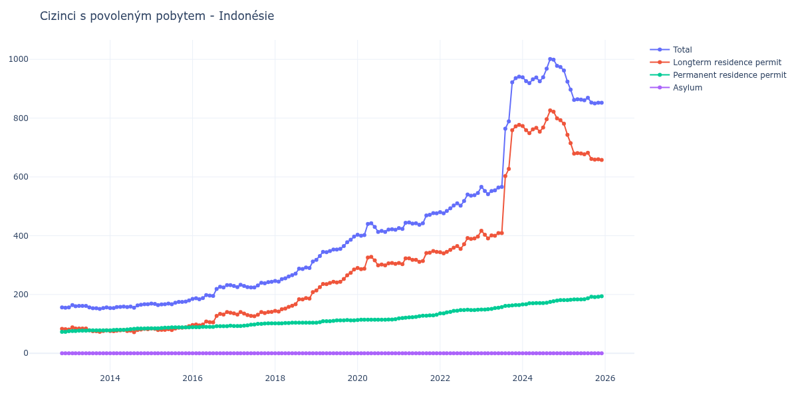

# Indonésie

## Souhrnné statistiky (Min/Max pro rok) / Summary Statistics (Min/Max per year)

| Year   | Total Min/Max   | Longterm Residence Permit Min/Max   | Permanent Residence Permit Min/Max   | Asylum Min/Max   |
|--------|-----------------|-------------------------------------|--------------------------------------|------------------|
| 2012   | 155 / 156       | 82 / 83                             | 73 / 73                              | 0 / 0            |
| 2013   | 151 / 164       | 73 / 88                             | 75 / 78                              | 0 / 0            |
| 2014   | 154 / 167       | 72 / 83                             | 78 / 85                              | 0 / 0            |
| 2015   | 164 / 180       | 79 / 92                             | 85 / 88                              | 0 / 0            |
| 2016   | 184 / 232       | 95 / 140                            | 89 / 94                              | 0 / 0            |
| 2017   | 224 / 243       | 126 / 141                           | 93 / 102                             | 0 / 0            |
| 2018   | 244 / 312       | 142 / 208                           | 102 / 104                            | 0 / 0            |
| 2019   | 318 / 397       | 214 / 285                           | 104 / 113                            | 0 / 0            |
| 2020   | 400 / 442       | 286 / 328                           | 113 / 116                            | 0 / 0            |
| 2021   | 423 / 477       | 303 / 348                           | 119 / 131                            | 0 / 0            |
| 2022   | 476 / 545       | 340 / 397                           | 136 / 148                            | 0 / 0            |
| 2023   | 541 / 941       | 391 / 777                           | 149 / 164                            | 0 / 0            |
| 2024   | 919 / 1 001     | 749 / 826                           | 166 / 181                            | 0 / 0            |
| 2025   | 850 / 962       | 658 / 781                           | 181 / 194                            | 0 / 0            |

## Detailní tabulka / Detailed Data Table

| Date     | Total          | Longterm Residence Permit   | Permanent Residence Permit   | Asylum   |
|----------|----------------|-----------------------------|------------------------------|----------|
| **2012** |                |                             |                              |          |
| 11.2012  | 156            | 83                          | 73                           | 0        |
| 12.2012  | 155 (-0.64%)   | 82 (-1.20%)                 | 73 (+0.00%)                  | 0        |
| **2013** |                |                             |                              |          |
| 01.2013  | 156 (+0.65%)   | 81 (-1.22%)                 | 75 (+2.74%)                  | 0        |
| 02.2013  | 164 (+5.13%)   | 88 (+8.64%)                 | 76 (+1.33%)                  | 0        |
| 03.2013  | 160 (-2.44%)   | 84 (-4.55%)                 | 76 (+0.00%)                  | 0        |
| 04.2013  | 161 (+0.63%)   | 84 (+0.00%)                 | 77 (+1.32%)                  | 0        |
| 05.2013  | 161 (+0.00%)   | 84 (+0.00%)                 | 77 (+0.00%)                  | 0        |
| 06.2013  | 161 (+0.00%)   | 84 (+0.00%)                 | 77 (+0.00%)                  | 0        |
| 07.2013  | 156 (-3.11%)   | 78 (-7.14%)                 | 78 (+1.30%)                  | 0        |
| 08.2013  | 153 (-1.92%)   | 75 (-3.85%)                 | 78 (+0.00%)                  | 0        |
| 09.2013  | 153 (+0.00%)   | 75 (+0.00%)                 | 78 (+0.00%)                  | 0        |
| 10.2013  | 151 (-1.31%)   | 73 (-2.67%)                 | 78 (+0.00%)                  | 0        |
| 11.2013  | 154 (+1.99%)   | 76 (+4.11%)                 | 78 (+0.00%)                  | 0        |
| 12.2013  | 156 (+1.30%)   | 78 (+2.63%)                 | 78 (+0.00%)                  | 0        |
| **2014** |                |                             |                              |          |
| 01.2014  | 154 (-1.28%)   | 76 (-2.56%)                 | 78 (+0.00%)                  | 0        |
| 02.2014  | 154 (+0.00%)   | 75 (-1.32%)                 | 79 (+1.28%)                  | 0        |
| 03.2014  | 157 (+1.95%)   | 77 (+2.67%)                 | 80 (+1.27%)                  | 0        |
| 04.2014  | 158 (+0.64%)   | 78 (+1.30%)                 | 80 (+0.00%)                  | 0        |
| 05.2014  | 159 (+0.63%)   | 79 (+1.28%)                 | 80 (+0.00%)                  | 0        |
| 06.2014  | 157 (-1.26%)   | 76 (-3.80%)                 | 81 (+1.25%)                  | 0        |
| 07.2014  | 159 (+1.27%)   | 77 (+1.32%)                 | 82 (+1.23%)                  | 0        |
| 08.2014  | 155 (-2.52%)   | 72 (-6.49%)                 | 83 (+1.22%)                  | 0        |
| 09.2014  | 163 (+5.16%)   | 79 (+9.72%)                 | 84 (+1.20%)                  | 0        |
| 10.2014  | 165 (+1.23%)   | 81 (+2.53%)                 | 84 (+0.00%)                  | 0        |
| 11.2014  | 167 (+1.21%)   | 83 (+2.47%)                 | 84 (+0.00%)                  | 0        |
| 12.2014  | 167 (+0.00%)   | 82 (-1.20%)                 | 85 (+1.19%)                  | 0        |
| **2015** |                |                             |                              |          |
| 01.2015  | 169 (+1.20%)   | 84 (+2.44%)                 | 85 (+0.00%)                  | 0        |
| 02.2015  | 168 (-0.59%)   | 83 (-1.19%)                 | 85 (+0.00%)                  | 0        |
| 03.2015  | 164 (-2.38%)   | 79 (-4.82%)                 | 85 (+0.00%)                  | 0        |
| 04.2015  | 166 (+1.22%)   | 80 (+1.27%)                 | 86 (+1.18%)                  | 0        |
| 05.2015  | 167 (+0.60%)   | 80 (+0.00%)                 | 87 (+1.16%)                  | 0        |
| 06.2015  | 169 (+1.20%)   | 82 (+2.50%)                 | 87 (+0.00%)                  | 0        |
| 07.2015  | 167 (-1.18%)   | 79 (-3.66%)                 | 88 (+1.15%)                  | 0        |
| 08.2015  | 172 (+2.99%)   | 84 (+6.33%)                 | 88 (+0.00%)                  | 0        |
| 09.2015  | 175 (+1.74%)   | 87 (+3.57%)                 | 88 (+0.00%)                  | 0        |
| 10.2015  | 175 (+0.00%)   | 87 (+0.00%)                 | 88 (+0.00%)                  | 0        |
| 11.2015  | 176 (+0.57%)   | 88 (+1.15%)                 | 88 (+0.00%)                  | 0        |
| 12.2015  | 180 (+2.27%)   | 92 (+4.55%)                 | 88 (+0.00%)                  | 0        |
| **2016** |                |                             |                              |          |
| 01.2016  | 185 (+2.78%)   | 96 (+4.35%)                 | 89 (+1.14%)                  | 0        |
| 02.2016  | 187 (+1.08%)   | 98 (+2.08%)                 | 89 (+0.00%)                  | 0        |
| 03.2016  | 184 (-1.60%)   | 95 (-3.06%)                 | 89 (+0.00%)                  | 0        |
| 04.2016  | 188 (+2.17%)   | 98 (+3.16%)                 | 90 (+1.12%)                  | 0        |
| 05.2016  | 198 (+5.32%)   | 108 (+10.20%)               | 90 (+0.00%)                  | 0        |
| 06.2016  | 196 (-1.01%)   | 106 (-1.85%)                | 90 (+0.00%)                  | 0        |
| 07.2016  | 195 (-0.51%)   | 105 (-0.94%)                | 90 (+0.00%)                  | 0        |
| 08.2016  | 219 (+12.31%)  | 127 (+20.95%)               | 92 (+2.22%)                  | 0        |
| 09.2016  | 226 (+3.20%)   | 134 (+5.51%)                | 92 (+0.00%)                  | 0        |
| 10.2016  | 224 (-0.88%)   | 132 (-1.49%)                | 92 (+0.00%)                  | 0        |
| 11.2016  | 232 (+3.57%)   | 140 (+6.06%)                | 92 (+0.00%)                  | 0        |
| 12.2016  | 232 (+0.00%)   | 138 (-1.43%)                | 94 (+2.17%)                  | 0        |
| **2017** |                |                             |                              |          |
| 01.2017  | 229 (-1.29%)   | 136 (-1.45%)                | 93 (-1.06%)                  | 0        |
| 02.2017  | 225 (-1.75%)   | 132 (-2.94%)                | 93 (+0.00%)                  | 0        |
| 03.2017  | 233 (+3.56%)   | 140 (+6.06%)                | 93 (+0.00%)                  | 0        |
| 04.2017  | 229 (-1.72%)   | 135 (-3.57%)                | 94 (+1.08%)                  | 0        |
| 05.2017  | 225 (-1.75%)   | 130 (-3.70%)                | 95 (+1.06%)                  | 0        |
| 06.2017  | 224 (-0.44%)   | 127 (-2.31%)                | 97 (+2.11%)                  | 0        |
| 07.2017  | 224 (+0.00%)   | 126 (-0.79%)                | 98 (+1.03%)                  | 0        |
| 08.2017  | 231 (+3.12%)   | 131 (+3.97%)                | 100 (+2.04%)                 | 0        |
| 09.2017  | 240 (+3.90%)   | 140 (+6.87%)                | 100 (+0.00%)                 | 0        |
| 10.2017  | 238 (-0.83%)   | 137 (-2.14%)                | 101 (+1.00%)                 | 0        |
| 11.2017  | 242 (+1.68%)   | 140 (+2.19%)                | 102 (+0.99%)                 | 0        |
| 12.2017  | 243 (+0.41%)   | 141 (+0.71%)                | 102 (+0.00%)                 | 0        |
| **2018** |                |                             |                              |          |
| 01.2018  | 246 (+1.23%)   | 144 (+2.13%)                | 102 (+0.00%)                 | 0        |
| 02.2018  | 244 (-0.81%)   | 142 (-1.39%)                | 102 (+0.00%)                 | 0        |
| 03.2018  | 252 (+3.28%)   | 150 (+5.63%)                | 102 (+0.00%)                 | 0        |
| 04.2018  | 255 (+1.19%)   | 152 (+1.33%)                | 103 (+0.98%)                 | 0        |
| 05.2018  | 261 (+2.35%)   | 158 (+3.95%)                | 103 (+0.00%)                 | 0        |
| 06.2018  | 266 (+1.92%)   | 162 (+2.53%)                | 104 (+0.97%)                 | 0        |
| 07.2018  | 271 (+1.88%)   | 167 (+3.09%)                | 104 (+0.00%)                 | 0        |
| 08.2018  | 288 (+6.27%)   | 184 (+10.18%)               | 104 (+0.00%)                 | 0        |
| 09.2018  | 287 (-0.35%)   | 183 (-0.54%)                | 104 (+0.00%)                 | 0        |
| 10.2018  | 292 (+1.74%)   | 188 (+2.73%)                | 104 (+0.00%)                 | 0        |
| 11.2018  | 290 (-0.68%)   | 186 (-1.06%)                | 104 (+0.00%)                 | 0        |
| 12.2018  | 312 (+7.59%)   | 208 (+11.83%)               | 104 (+0.00%)                 | 0        |
| **2019** |                |                             |                              |          |
| 01.2019  | 318 (+1.92%)   | 214 (+2.88%)                | 104 (+0.00%)                 | 0        |
| 02.2019  | 331 (+4.09%)   | 225 (+5.14%)                | 106 (+1.92%)                 | 0        |
| 03.2019  | 345 (+4.23%)   | 236 (+4.89%)                | 109 (+2.83%)                 | 0        |
| 04.2019  | 344 (-0.29%)   | 235 (-0.42%)                | 109 (+0.00%)                 | 0        |
| 05.2019  | 348 (+1.16%)   | 239 (+1.70%)                | 109 (+0.00%)                 | 0        |
| 06.2019  | 353 (+1.44%)   | 243 (+1.67%)                | 110 (+0.92%)                 | 0        |
| 07.2019  | 353 (+0.00%)   | 241 (-0.82%)                | 112 (+1.82%)                 | 0        |
| 08.2019  | 355 (+0.57%)   | 243 (+0.83%)                | 112 (+0.00%)                 | 0        |
| 09.2019  | 365 (+2.82%)   | 253 (+4.12%)                | 112 (+0.00%)                 | 0        |
| 10.2019  | 378 (+3.56%)   | 265 (+4.74%)                | 113 (+0.89%)                 | 0        |
| 11.2019  | 386 (+2.12%)   | 274 (+3.40%)                | 112 (-0.88%)                 | 0        |
| 12.2019  | 397 (+2.85%)   | 285 (+4.01%)                | 112 (+0.00%)                 | 0        |
| **2020** |                |                             |                              |          |
| 01.2020  | 403 (+1.51%)   | 290 (+1.75%)                | 113 (+0.89%)                 | 0        |
| 02.2020  | 400 (-0.74%)   | 286 (-1.38%)                | 114 (+0.88%)                 | 0        |
| 03.2020  | 402 (+0.50%)   | 288 (+0.70%)                | 114 (+0.00%)                 | 0        |
| 04.2020  | 440 (+9.45%)   | 326 (+13.19%)               | 114 (+0.00%)                 | 0        |
| 05.2020  | 442 (+0.45%)   | 328 (+0.61%)                | 114 (+0.00%)                 | 0        |
| 06.2020  | 430 (-2.71%)   | 316 (-3.66%)                | 114 (+0.00%)                 | 0        |
| 07.2020  | 413 (-3.95%)   | 299 (-5.38%)                | 114 (+0.00%)                 | 0        |
| 08.2020  | 416 (+0.73%)   | 302 (+1.00%)                | 114 (+0.00%)                 | 0        |
| 09.2020  | 413 (-0.72%)   | 299 (-0.99%)                | 114 (+0.00%)                 | 0        |
| 10.2020  | 421 (+1.94%)   | 306 (+2.34%)                | 115 (+0.88%)                 | 0        |
| 11.2020  | 422 (+0.24%)   | 307 (+0.33%)                | 115 (+0.00%)                 | 0        |
| 12.2020  | 420 (-0.47%)   | 304 (-0.98%)                | 116 (+0.87%)                 | 0        |
| **2021** |                |                             |                              |          |
| 01.2021  | 426 (+1.43%)   | 307 (+0.99%)                | 119 (+2.59%)                 | 0        |
| 02.2021  | 423 (-0.70%)   | 303 (-1.30%)                | 120 (+0.84%)                 | 0        |
| 03.2021  | 444 (+4.96%)   | 323 (+6.60%)                | 121 (+0.83%)                 | 0        |
| 04.2021  | 445 (+0.23%)   | 323 (+0.00%)                | 122 (+0.83%)                 | 0        |
| 05.2021  | 441 (-0.90%)   | 318 (-1.55%)                | 123 (+0.82%)                 | 0        |
| 06.2021  | 442 (+0.23%)   | 318 (+0.00%)                | 124 (+0.81%)                 | 0        |
| 07.2021  | 437 (-1.13%)   | 311 (-2.20%)                | 126 (+1.61%)                 | 0        |
| 08.2021  | 442 (+1.14%)   | 314 (+0.96%)                | 128 (+1.59%)                 | 0        |
| 09.2021  | 469 (+6.11%)   | 341 (+8.60%)                | 128 (+0.00%)                 | 0        |
| 10.2021  | 471 (+0.43%)   | 342 (+0.29%)                | 129 (+0.78%)                 | 0        |
| 11.2021  | 477 (+1.27%)   | 348 (+1.75%)                | 129 (+0.00%)                 | 0        |
| 12.2021  | 476 (-0.21%)   | 345 (-0.86%)                | 131 (+1.55%)                 | 0        |
| **2022** |                |                             |                              |          |
| 01.2022  | 480 (+0.84%)   | 344 (-0.29%)                | 136 (+3.82%)                 | 0        |
| 02.2022  | 476 (-0.83%)   | 340 (-1.16%)                | 136 (+0.00%)                 | 0        |
| 03.2022  | 484 (+1.68%)   | 345 (+1.47%)                | 139 (+2.21%)                 | 0        |
| 04.2022  | 493 (+1.86%)   | 352 (+2.03%)                | 141 (+1.44%)                 | 0        |
| 05.2022  | 503 (+2.03%)   | 359 (+1.99%)                | 144 (+2.13%)                 | 0        |
| 06.2022  | 510 (+1.39%)   | 365 (+1.67%)                | 145 (+0.69%)                 | 0        |
| 07.2022  | 502 (-1.57%)   | 355 (-2.74%)                | 147 (+1.38%)                 | 0        |
| 08.2022  | 518 (+3.19%)   | 371 (+4.51%)                | 147 (+0.00%)                 | 0        |
| 09.2022  | 540 (+4.25%)   | 392 (+5.66%)                | 148 (+0.68%)                 | 0        |
| 10.2022  | 536 (-0.74%)   | 389 (-0.77%)                | 147 (-0.68%)                 | 0        |
| 11.2022  | 538 (+0.37%)   | 391 (+0.51%)                | 147 (+0.00%)                 | 0        |
| 12.2022  | 545 (+1.30%)   | 397 (+1.53%)                | 148 (+0.68%)                 | 0        |
| **2023** |                |                             |                              |          |
| 01.2023  | 566 (+3.85%)   | 417 (+5.04%)                | 149 (+0.68%)                 | 0        |
| 02.2023  | 552 (-2.47%)   | 403 (-3.36%)                | 149 (+0.00%)                 | 0        |
| 03.2023  | 541 (-1.99%)   | 391 (-2.98%)                | 150 (+0.67%)                 | 0        |
| 04.2023  | 552 (+2.03%)   | 401 (+2.56%)                | 151 (+0.67%)                 | 0        |
| 05.2023  | 554 (+0.36%)   | 400 (-0.25%)                | 154 (+1.99%)                 | 0        |
| 06.2023  | 564 (+1.81%)   | 409 (+2.25%)                | 155 (+0.65%)                 | 0        |
| 07.2023  | 566 (+0.35%)   | 409 (+0.00%)                | 157 (+1.29%)                 | 0        |
| 08.2023  | 764 (+34.98%)  | 603 (+47.43%)               | 161 (+2.55%)                 | 0        |
| 09.2023  | 789 (+3.27%)   | 627 (+3.98%)                | 162 (+0.62%)                 | 0        |
| 10.2023  | 922 (+16.86%)  | 759 (+21.05%)               | 163 (+0.62%)                 | 0        |
| 11.2023  | 936 (+1.52%)   | 772 (+1.71%)                | 164 (+0.61%)                 | 0        |
| 12.2023  | 941 (+0.53%)   | 777 (+0.65%)                | 164 (+0.00%)                 | 0        |
| **2024** |                |                             |                              |          |
| 01.2024  | 939 (-0.21%)   | 773 (-0.51%)                | 166 (+1.22%)                 | 0        |
| 02.2024  | 926 (-1.38%)   | 759 (-1.81%)                | 167 (+0.60%)                 | 0        |
| 03.2024  | 919 (-0.76%)   | 749 (-1.32%)                | 170 (+1.80%)                 | 0        |
| 04.2024  | 932 (+1.41%)   | 762 (+1.74%)                | 170 (+0.00%)                 | 0        |
| 05.2024  | 938 (+0.64%)   | 767 (+0.66%)                | 171 (+0.59%)                 | 0        |
| 06.2024  | 925 (-1.39%)   | 754 (-1.69%)                | 171 (+0.00%)                 | 0        |
| 07.2024  | 939 (+1.51%)   | 768 (+1.86%)                | 171 (+0.00%)                 | 0        |
| 08.2024  | 968 (+3.09%)   | 796 (+3.65%)                | 172 (+0.58%)                 | 0        |
| 09.2024  | 1 001 (+3.41%) | 826 (+3.77%)                | 175 (+1.74%)                 | 0        |
| 10.2024  | 999 (-0.20%)   | 822 (-0.48%)                | 177 (+1.14%)                 | 0        |
| 11.2024  | 978 (-2.10%)   | 799 (-2.80%)                | 179 (+1.13%)                 | 0        |
| 12.2024  | 974 (-0.41%)   | 793 (-0.75%)                | 181 (+1.12%)                 | 0        |
| **2025** |                |                             |                              |          |
| 01.2025  | 962 (-1.23%)   | 781 (-1.51%)                | 181 (+0.00%)                 | 0        |
| 02.2025  | 924 (-3.95%)   | 743 (-4.87%)                | 181 (+0.00%)                 | 0        |
| 03.2025  | 897 (-2.92%)   | 715 (-3.77%)                | 182 (+0.55%)                 | 0        |
| 04.2025  | 862 (-3.90%)   | 679 (-5.03%)                | 183 (+0.55%)                 | 0        |
| 05.2025  | 864 (+0.23%)   | 681 (+0.29%)                | 183 (+0.00%)                 | 0        |
| 06.2025  | 863 (-0.12%)   | 680 (-0.15%)                | 183 (+0.00%)                 | 0        |
| 07.2025  | 861 (-0.23%)   | 677 (-0.44%)                | 184 (+0.55%)                 | 0        |
| 08.2025  | 869 (+0.93%)   | 682 (+0.74%)                | 187 (+1.63%)                 | 0        |
| 09.2025  | 853 (-1.84%)   | 661 (-3.08%)                | 192 (+2.67%)                 | 0        |
| 10.2025  | 850 (-0.35%)   | 659 (-0.30%)                | 191 (-0.52%)                 | 0        |
| 11.2025  | 852 (+0.24%)   | 660 (+0.15%)                | 192 (+0.52%)                 | 0        |
| 12.2025  | 852 (+0.00%)   | 658 (-0.30%)                | 194 (+1.04%)                 | 0        |
