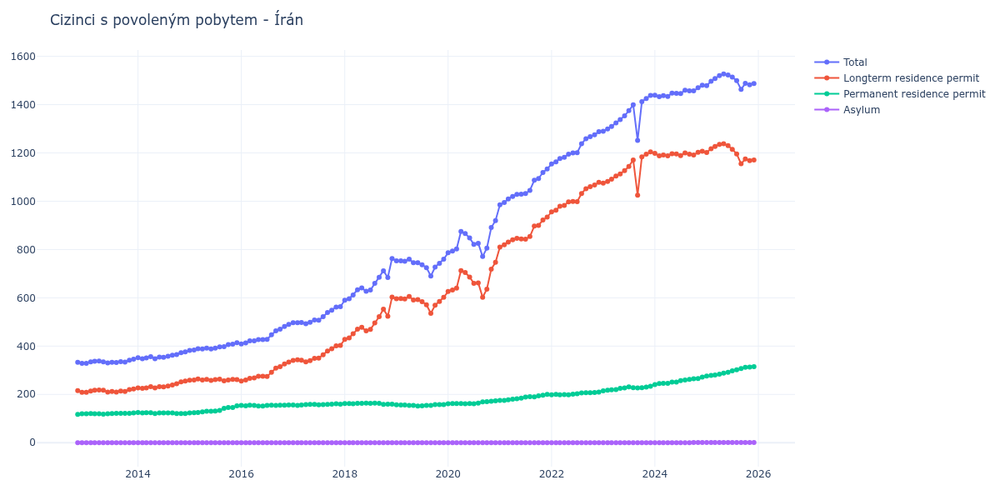

# Írán

## Souhrnné statistiky (Min/Max pro rok) / Summary Statistics (Min/Max per year)

| Year   | Total Min/Max   | Longterm Residence Permit Min/Max   | Permanent Residence Permit Min/Max   | Asylum Min/Max   |
|--------|-----------------|-------------------------------------|--------------------------------------|------------------|
| 2012   | 329 / 333       | 209 / 216                           | 117 / 120                            | 0 / 0            |
| 2013   | 329 / 346       | 209 / 223                           | 118 / 123                            | 0 / 0            |
| 2014   | 348 / 376       | 225 / 255                           | 121 / 125                            | 0 / 0            |
| 2015   | 382 / 414       | 256 / 264                           | 123 / 153                            | 0 / 0            |
| 2016   | 409 / 490       | 255 / 334                           | 152 / 156                            | 0 / 0            |
| 2017   | 493 / 563       | 335 / 403                           | 154 / 161                            | 0 / 0            |
| 2018   | 590 / 763       | 428 / 603                           | 159 / 164                            | 0 / 0            |
| 2019   | 690 / 760       | 536 / 606                           | 152 / 158                            | 0 / 0            |
| 2020   | 771 / 920       | 602 / 747                           | 161 / 173                            | 0 / 0            |
| 2021   | 985 / 1 134     | 810 / 934                           | 175 / 200                            | 0 / 0            |
| 2022   | 1 154 / 1 288   | 956 / 1 078                         | 198 / 210                            | 0 / 0            |
| 2023   | 1 252 / 1 438   | 1 025 / 1 204                       | 215 / 234                            | 0 / 0            |
| 2024   | 1 433 / 1 480   | 1 188 / 1 207                       | 241 / 272                            | 0 / 1            |
| 2025   | 1 463 / 1 527   | 1 155 / 1 238                       | 276 / 315                            | 1 / 1            |

## Detailní tabulka / Detailed Data Table

| Date     | Total           | Longterm Residence Permit   | Permanent Residence Permit   | Asylum     |
|----------|-----------------|-----------------------------|------------------------------|------------|
| **2012** |                 |                             |                              |            |
| 11.2012  | 333             | 216                         | 117                          | 0          |
| 12.2012  | 329 (-1.20%)    | 209 (-3.24%)                | 120 (+2.56%)                 | 0          |
| **2013** |                 |                             |                              |            |
| 01.2013  | 329 (+0.00%)    | 209 (+0.00%)                | 120 (+0.00%)                 | 0          |
| 02.2013  | 335 (+1.82%)    | 214 (+2.39%)                | 121 (+0.83%)                 | 0          |
| 03.2013  | 337 (+0.60%)    | 217 (+1.40%)                | 120 (-0.83%)                 | 0          |
| 04.2013  | 338 (+0.30%)    | 218 (+0.46%)                | 120 (+0.00%)                 | 0          |
| 05.2013  | 335 (-0.89%)    | 217 (-0.46%)                | 118 (-1.67%)                 | 0          |
| 06.2013  | 330 (-1.49%)    | 210 (-3.23%)                | 120 (+1.69%)                 | 0          |
| 07.2013  | 333 (+0.91%)    | 212 (+0.95%)                | 121 (+0.83%)                 | 0          |
| 08.2013  | 332 (-0.30%)    | 210 (-0.94%)                | 122 (+0.83%)                 | 0          |
| 09.2013  | 336 (+1.20%)    | 214 (+1.90%)                | 122 (+0.00%)                 | 0          |
| 10.2013  | 334 (-0.60%)    | 212 (-0.93%)                | 122 (+0.00%)                 | 0          |
| 11.2013  | 342 (+2.40%)    | 220 (+3.77%)                | 122 (+0.00%)                 | 0          |
| 12.2013  | 346 (+1.17%)    | 223 (+1.36%)                | 123 (+0.82%)                 | 0          |
| **2014** |                 |                             |                              |            |
| 01.2014  | 352 (+1.73%)    | 227 (+1.79%)                | 125 (+1.63%)                 | 0          |
| 02.2014  | 348 (-1.14%)    | 225 (-0.88%)                | 123 (-1.60%)                 | 0          |
| 03.2014  | 351 (+0.86%)    | 227 (+0.89%)                | 124 (+0.81%)                 | 0          |
| 04.2014  | 356 (+1.42%)    | 232 (+2.20%)                | 124 (+0.00%)                 | 0          |
| 05.2014  | 348 (-2.25%)    | 227 (-2.16%)                | 121 (-2.42%)                 | 0          |
| 06.2014  | 355 (+2.01%)    | 232 (+2.20%)                | 123 (+1.65%)                 | 0          |
| 07.2014  | 354 (-0.28%)    | 231 (-0.43%)                | 123 (+0.00%)                 | 0          |
| 08.2014  | 358 (+1.13%)    | 235 (+1.73%)                | 123 (+0.00%)                 | 0          |
| 09.2014  | 362 (+1.12%)    | 239 (+1.70%)                | 123 (+0.00%)                 | 0          |
| 10.2014  | 365 (+0.83%)    | 244 (+2.09%)                | 121 (-1.63%)                 | 0          |
| 11.2014  | 373 (+2.19%)    | 252 (+3.28%)                | 121 (+0.00%)                 | 0          |
| 12.2014  | 376 (+0.80%)    | 255 (+1.19%)                | 121 (+0.00%)                 | 0          |
| **2015** |                 |                             |                              |            |
| 01.2015  | 382 (+1.60%)    | 259 (+1.57%)                | 123 (+1.65%)                 | 0          |
| 02.2015  | 384 (+0.52%)    | 260 (+0.39%)                | 124 (+0.81%)                 | 0          |
| 03.2015  | 389 (+1.30%)    | 264 (+1.54%)                | 125 (+0.81%)                 | 0          |
| 04.2015  | 388 (-0.26%)    | 260 (-1.52%)                | 128 (+2.40%)                 | 0          |
| 05.2015  | 392 (+1.03%)    | 262 (+0.77%)                | 130 (+1.56%)                 | 0          |
| 06.2015  | 388 (-1.02%)    | 258 (-1.53%)                | 130 (+0.00%)                 | 0          |
| 07.2015  | 392 (+1.03%)    | 261 (+1.16%)                | 131 (+0.77%)                 | 0          |
| 08.2015  | 397 (+1.28%)    | 263 (+0.77%)                | 134 (+2.29%)                 | 0          |
| 09.2015  | 398 (+0.25%)    | 256 (-2.66%)                | 142 (+5.97%)                 | 0          |
| 10.2015  | 406 (+2.01%)    | 260 (+1.56%)                | 146 (+2.82%)                 | 0          |
| 11.2015  | 408 (+0.49%)    | 262 (+0.77%)                | 146 (+0.00%)                 | 0          |
| 12.2015  | 414 (+1.47%)    | 261 (-0.38%)                | 153 (+4.79%)                 | 0          |
| **2016** |                 |                             |                              |            |
| 01.2016  | 409 (-1.21%)    | 255 (-2.30%)                | 154 (+0.65%)                 | 0          |
| 02.2016  | 413 (+0.98%)    | 260 (+1.96%)                | 153 (-0.65%)                 | 0          |
| 03.2016  | 422 (+2.18%)    | 267 (+2.69%)                | 155 (+1.31%)                 | 0          |
| 04.2016  | 422 (+0.00%)    | 268 (+0.37%)                | 154 (-0.65%)                 | 0          |
| 05.2016  | 427 (+1.18%)    | 275 (+2.61%)                | 152 (-1.30%)                 | 0          |
| 06.2016  | 427 (+0.00%)    | 275 (+0.00%)                | 152 (+0.00%)                 | 0          |
| 07.2016  | 428 (+0.23%)    | 274 (-0.36%)                | 154 (+1.32%)                 | 0          |
| 08.2016  | 447 (+4.44%)    | 292 (+6.57%)                | 155 (+0.65%)                 | 0          |
| 09.2016  | 463 (+3.58%)    | 309 (+5.82%)                | 154 (-0.65%)                 | 0          |
| 10.2016  | 470 (+1.51%)    | 315 (+1.94%)                | 155 (+0.65%)                 | 0          |
| 11.2016  | 481 (+2.34%)    | 326 (+3.49%)                | 155 (+0.00%)                 | 0          |
| 12.2016  | 490 (+1.87%)    | 334 (+2.45%)                | 156 (+0.65%)                 | 0          |
| **2017** |                 |                             |                              |            |
| 01.2017  | 497 (+1.43%)    | 341 (+2.10%)                | 156 (+0.00%)                 | 0          |
| 02.2017  | 497 (+0.00%)    | 343 (+0.59%)                | 154 (-1.28%)                 | 0          |
| 03.2017  | 498 (+0.20%)    | 342 (-0.29%)                | 156 (+1.30%)                 | 0          |
| 04.2017  | 493 (-1.00%)    | 335 (-2.05%)                | 158 (+1.28%)                 | 0          |
| 05.2017  | 499 (+1.22%)    | 340 (+1.49%)                | 159 (+0.63%)                 | 0          |
| 06.2017  | 508 (+1.80%)    | 349 (+2.65%)                | 159 (+0.00%)                 | 0          |
| 07.2017  | 507 (-0.20%)    | 350 (+0.29%)                | 157 (-1.26%)                 | 0          |
| 08.2017  | 522 (+2.96%)    | 364 (+4.00%)                | 158 (+0.64%)                 | 0          |
| 09.2017  | 539 (+3.26%)    | 380 (+4.40%)                | 159 (+0.63%)                 | 0          |
| 10.2017  | 549 (+1.86%)    | 389 (+2.37%)                | 160 (+0.63%)                 | 0          |
| 11.2017  | 562 (+2.37%)    | 401 (+3.08%)                | 161 (+0.63%)                 | 0          |
| 12.2017  | 563 (+0.18%)    | 403 (+0.50%)                | 160 (-0.62%)                 | 0          |
| **2018** |                 |                             |                              |            |
| 01.2018  | 590 (+4.80%)    | 428 (+6.20%)                | 162 (+1.25%)                 | 0          |
| 02.2018  | 596 (+1.02%)    | 434 (+1.40%)                | 162 (+0.00%)                 | 0          |
| 03.2018  | 612 (+2.68%)    | 451 (+3.92%)                | 161 (-0.62%)                 | 0          |
| 04.2018  | 633 (+3.43%)    | 470 (+4.21%)                | 163 (+1.24%)                 | 0          |
| 05.2018  | 641 (+1.26%)    | 478 (+1.70%)                | 163 (+0.00%)                 | 0          |
| 06.2018  | 627 (-2.18%)    | 463 (-3.14%)                | 164 (+0.61%)                 | 0          |
| 07.2018  | 632 (+0.80%)    | 469 (+1.30%)                | 163 (-0.61%)                 | 0          |
| 08.2018  | 660 (+4.43%)    | 496 (+5.76%)                | 164 (+0.61%)                 | 0          |
| 09.2018  | 685 (+3.79%)    | 522 (+5.24%)                | 163 (-0.61%)                 | 0          |
| 10.2018  | 712 (+3.94%)    | 553 (+5.94%)                | 159 (-2.45%)                 | 0          |
| 11.2018  | 684 (-3.93%)    | 524 (-5.24%)                | 160 (+0.63%)                 | 0          |
| 12.2018  | 763 (+11.55%)   | 603 (+15.08%)               | 160 (+0.00%)                 | 0          |
| **2019** |                 |                             |                              |            |
| 01.2019  | 753 (-1.31%)    | 596 (-1.16%)                | 157 (-1.88%)                 | 0          |
| 02.2019  | 753 (+0.00%)    | 597 (+0.17%)                | 156 (-0.64%)                 | 0          |
| 03.2019  | 751 (-0.27%)    | 595 (-0.34%)                | 156 (+0.00%)                 | 0          |
| 04.2019  | 760 (+1.20%)    | 606 (+1.85%)                | 154 (-1.28%)                 | 0          |
| 05.2019  | 745 (-1.97%)    | 591 (-2.48%)                | 154 (+0.00%)                 | 0          |
| 06.2019  | 745 (+0.00%)    | 593 (+0.34%)                | 152 (-1.30%)                 | 0          |
| 07.2019  | 737 (-1.07%)    | 584 (-1.52%)                | 153 (+0.66%)                 | 0          |
| 08.2019  | 725 (-1.63%)    | 571 (-2.23%)                | 154 (+0.65%)                 | 0          |
| 09.2019  | 690 (-4.83%)    | 536 (-6.13%)                | 154 (+0.00%)                 | 0          |
| 10.2019  | 727 (+5.36%)    | 569 (+6.16%)                | 158 (+2.60%)                 | 0          |
| 11.2019  | 743 (+2.20%)    | 585 (+2.81%)                | 158 (+0.00%)                 | 0          |
| 12.2019  | 760 (+2.29%)    | 602 (+2.91%)                | 158 (+0.00%)                 | 0          |
| **2020** |                 |                             |                              |            |
| 01.2020  | 787 (+3.55%)    | 626 (+3.99%)                | 161 (+1.90%)                 | 0          |
| 02.2020  | 794 (+0.89%)    | 632 (+0.96%)                | 162 (+0.62%)                 | 0          |
| 03.2020  | 802 (+1.01%)    | 640 (+1.27%)                | 162 (+0.00%)                 | 0          |
| 04.2020  | 875 (+9.10%)    | 713 (+11.41%)               | 162 (+0.00%)                 | 0          |
| 05.2020  | 866 (-1.03%)    | 705 (-1.12%)                | 161 (-0.62%)                 | 0          |
| 06.2020  | 848 (-2.08%)    | 686 (-2.70%)                | 162 (+0.62%)                 | 0          |
| 07.2020  | 821 (-3.18%)    | 660 (-3.79%)                | 161 (-0.62%)                 | 0          |
| 08.2020  | 826 (+0.61%)    | 662 (+0.30%)                | 164 (+1.86%)                 | 0          |
| 09.2020  | 771 (-6.66%)    | 602 (-9.06%)                | 169 (+3.05%)                 | 0          |
| 10.2020  | 806 (+4.54%)    | 636 (+5.65%)                | 170 (+0.59%)                 | 0          |
| 11.2020  | 891 (+10.55%)   | 719 (+13.05%)               | 172 (+1.18%)                 | 0          |
| 12.2020  | 920 (+3.25%)    | 747 (+3.89%)                | 173 (+0.58%)                 | 0          |
| **2021** |                 |                             |                              |            |
| 01.2021  | 985 (+7.07%)    | 810 (+8.43%)                | 175 (+1.16%)                 | 0          |
| 02.2021  | 995 (+1.02%)    | 820 (+1.23%)                | 175 (+0.00%)                 | 0          |
| 03.2021  | 1 009 (+1.41%)  | 831 (+1.34%)                | 178 (+1.71%)                 | 0          |
| 04.2021  | 1 020 (+1.09%)  | 840 (+1.08%)                | 180 (+1.12%)                 | 0          |
| 05.2021  | 1 028 (+0.78%)  | 846 (+0.71%)                | 182 (+1.11%)                 | 0          |
| 06.2021  | 1 029 (+0.10%)  | 844 (-0.24%)                | 185 (+1.65%)                 | 0          |
| 07.2021  | 1 032 (+0.29%)  | 843 (-0.12%)                | 189 (+2.16%)                 | 0          |
| 08.2021  | 1 045 (+1.26%)  | 854 (+1.30%)                | 191 (+1.06%)                 | 0          |
| 09.2021  | 1 087 (+4.02%)  | 897 (+5.04%)                | 190 (-0.52%)                 | 0          |
| 10.2021  | 1 094 (+0.64%)  | 900 (+0.33%)                | 194 (+2.11%)                 | 0          |
| 11.2021  | 1 119 (+2.29%)  | 922 (+2.44%)                | 197 (+1.55%)                 | 0          |
| 12.2021  | 1 134 (+1.34%)  | 934 (+1.30%)                | 200 (+1.52%)                 | 0          |
| **2022** |                 |                             |                              |            |
| 01.2022  | 1 154 (+1.76%)  | 956 (+2.36%)                | 198 (-1.00%)                 | 0          |
| 02.2022  | 1 163 (+0.78%)  | 963 (+0.73%)                | 200 (+1.01%)                 | 0          |
| 03.2022  | 1 177 (+1.20%)  | 979 (+1.66%)                | 198 (-1.00%)                 | 0          |
| 04.2022  | 1 182 (+0.42%)  | 983 (+0.41%)                | 199 (+0.51%)                 | 0          |
| 05.2022  | 1 195 (+1.10%)  | 997 (+1.42%)                | 198 (-0.50%)                 | 0          |
| 06.2022  | 1 200 (+0.42%)  | 999 (+0.20%)                | 201 (+1.52%)                 | 0          |
| 07.2022  | 1 201 (+0.08%)  | 998 (-0.10%)                | 203 (+1.00%)                 | 0          |
| 08.2022  | 1 238 (+3.08%)  | 1 032 (+3.41%)              | 206 (+1.48%)                 | 0          |
| 09.2022  | 1 259 (+1.70%)  | 1 052 (+1.94%)              | 207 (+0.49%)                 | 0          |
| 10.2022  | 1 267 (+0.64%)  | 1 060 (+0.76%)              | 207 (+0.00%)                 | 0          |
| 11.2022  | 1 275 (+0.63%)  | 1 067 (+0.66%)              | 208 (+0.48%)                 | 0          |
| 12.2022  | 1 288 (+1.02%)  | 1 078 (+1.03%)              | 210 (+0.96%)                 | 0          |
| **2023** |                 |                             |                              |            |
| 01.2023  | 1 290 (+0.16%)  | 1 075 (-0.28%)              | 215 (+2.38%)                 | 0          |
| 02.2023  | 1 299 (+0.70%)  | 1 082 (+0.65%)              | 217 (+0.93%)                 | 0          |
| 03.2023  | 1 310 (+0.85%)  | 1 091 (+0.83%)              | 219 (+0.92%)                 | 0          |
| 04.2023  | 1 324 (+1.07%)  | 1 104 (+1.19%)              | 220 (+0.46%)                 | 0          |
| 05.2023  | 1 338 (+1.06%)  | 1 113 (+0.82%)              | 225 (+2.27%)                 | 0          |
| 06.2023  | 1 354 (+1.20%)  | 1 127 (+1.26%)              | 227 (+0.89%)                 | 0          |
| 07.2023  | 1 375 (+1.55%)  | 1 144 (+1.51%)              | 231 (+1.76%)                 | 0          |
| 08.2023  | 1 399 (+1.75%)  | 1 171 (+2.36%)              | 228 (-1.30%)                 | 0          |
| 09.2023  | 1 252 (-10.51%) | 1 025 (-12.47%)             | 227 (-0.44%)                 | 0          |
| 10.2023  | 1 412 (+12.78%) | 1 184 (+15.51%)             | 228 (+0.44%)                 | 0          |
| 11.2023  | 1 425 (+0.92%)  | 1 195 (+0.93%)              | 230 (+0.88%)                 | 0          |
| 12.2023  | 1 438 (+0.91%)  | 1 204 (+0.75%)              | 234 (+1.74%)                 | 0          |
| **2024** |                 |                             |                              |            |
| 01.2024  | 1 439 (+0.07%)  | 1 198 (-0.50%)              | 241 (+2.99%)                 | 0          |
| 02.2024  | 1 433 (-0.42%)  | 1 188 (-0.83%)              | 245 (+1.66%)                 | 0          |
| 03.2024  | 1 437 (+0.28%)  | 1 191 (+0.25%)              | 246 (+0.41%)                 | 0          |
| 04.2024  | 1 434 (-0.21%)  | 1 188 (-0.25%)              | 246 (+0.00%)                 | 0          |
| 05.2024  | 1 448 (+0.98%)  | 1 197 (+0.76%)              | 251 (+2.03%)                 | 0          |
| 06.2024  | 1 447 (-0.07%)  | 1 196 (-0.08%)              | 251 (+0.00%)                 | 0          |
| 07.2024  | 1 446 (-0.07%)  | 1 189 (-0.59%)              | 257 (+2.39%)                 | 0          |
| 08.2024  | 1 460 (+0.97%)  | 1 200 (+0.93%)              | 260 (+1.17%)                 | 0          |
| 09.2024  | 1 457 (-0.21%)  | 1 195 (-0.42%)              | 262 (+0.77%)                 | 0          |
| 10.2024  | 1 457 (+0.00%)  | 1 191 (-0.33%)              | 265 (+1.15%)                 | 1          |
| 11.2024  | 1 470 (+0.89%)  | 1 203 (+1.01%)              | 266 (+0.38%)                 | 1 (+0.00%) |
| 12.2024  | 1 480 (+0.68%)  | 1 207 (+0.33%)              | 272 (+2.26%)                 | 1 (+0.00%) |
| **2025** |                 |                             |                              |            |
| 01.2025  | 1 479 (-0.07%)  | 1 202 (-0.41%)              | 276 (+1.47%)                 | 1 (+0.00%) |
| 02.2025  | 1 497 (+1.22%)  | 1 217 (+1.25%)              | 279 (+1.09%)                 | 1 (+0.00%) |
| 03.2025  | 1 508 (+0.73%)  | 1 227 (+0.82%)              | 280 (+0.36%)                 | 1 (+0.00%) |
| 04.2025  | 1 520 (+0.80%)  | 1 235 (+0.65%)              | 284 (+1.43%)                 | 1 (+0.00%) |
| 05.2025  | 1 527 (+0.46%)  | 1 238 (+0.24%)              | 288 (+1.41%)                 | 1 (+0.00%) |
| 06.2025  | 1 523 (-0.26%)  | 1 230 (-0.65%)              | 292 (+1.39%)                 | 1 (+0.00%) |
| 07.2025  | 1 514 (-0.59%)  | 1 215 (-1.22%)              | 298 (+2.05%)                 | 1 (+0.00%) |
| 08.2025  | 1 499 (-0.99%)  | 1 196 (-1.56%)              | 302 (+1.34%)                 | 1 (+0.00%) |
| 09.2025  | 1 463 (-2.40%)  | 1 155 (-3.43%)              | 307 (+1.66%)                 | 1 (+0.00%) |
| 10.2025  | 1 488 (+1.71%)  | 1 175 (+1.73%)              | 312 (+1.63%)                 | 1 (+0.00%) |
| 11.2025  | 1 482 (-0.40%)  | 1 168 (-0.60%)              | 313 (+0.32%)                 | 1 (+0.00%) |
| 12.2025  | 1 487 (+0.34%)  | 1 171 (+0.26%)              | 315 (+0.64%)                 | 1 (+0.00%) |
