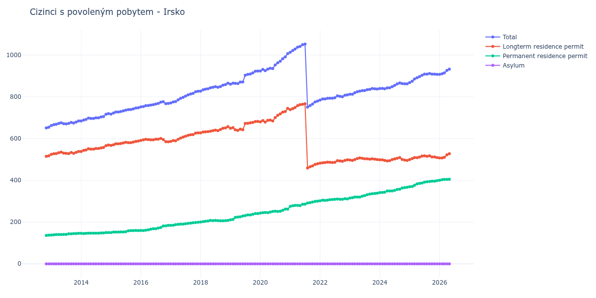

# Irsko

## Souhrnné statistiky (Min/Max pro rok) / Summary Statistics (Min/Max per year)

| Year   | Total       | Longterm Residence Permit   | Permanent Residence Permit   | Asylum   |
|--------|-------------|-----------------------------|------------------------------|----------|
| 2012   | 651 / 654   | 515 / 517                   | 136 / 137                    | 0 / 0    |
| 2013   | 662 / 684   | 524 / 538                   | 138 / 146                    | 0 / 0    |
| 2014   | 684 / 719   | 538 / 569                   | 145 / 150                    | 0 / 0    |
| 2015   | 717 / 747   | 567 / 588                   | 150 / 160                    | 0 / 0    |
| 2016   | 751 / 776   | 584 / 600                   | 159 / 184                    | 0 / 0    |
| 2017   | 770 / 826   | 586 / 627                   | 184 / 199                    | 0 / 0    |
| 2018   | 827 / 865   | 627 / 657                   | 200 / 208                    | 0 / 0    |
| 2019   | 860 / 923   | 639 / 682                   | 211 / 241                    | 0 / 0    |
| 2020   | 923 / 1 006 | 679 / 744                   | 243 / 262                    | 0 / 0    |
| 2021   | 750 / 1 052 | 459 / 766                   | 275 / 300                    | 0 / 0    |
| 2022   | 784 / 809   | 482 / 498                   | 302 / 312                    | 0 / 0    |
| 2023   | 812 / 839   | 495 / 507                   | 315 / 338                    | 0 / 0    |
| 2024   | 838 / 866   | 493 / 509                   | 341 / 367                    | 0 / 0    |
| 2025   | 868 / 911   | 499 / 517                   | 369 / 398                    | 0 / 0    |
| 2026   | 907 / 932   | 507 / 527                   | 400 / 405                    | 0 / 0    |

## Detailní tabulka / Detailed Data Table

| Date     | Total          | Longterm Residence Permit   | Permanent Residence Permit   | Asylum   |
|----------|----------------|-----------------------------|------------------------------|----------|
| **2012** |                |                             |                              |          |
| 11.2012  | 651            | 515                         | 136                          | 0        |
| 12.2012  | 654 (+0.46%)   | 517 (+0.39%)                | 137 (+0.74%)                 | 0        |
| **2013** |                |                             |                              |          |
| 01.2013  | 662 (+1.22%)   | 524 (+1.35%)                | 138 (+0.73%)                 | 0        |
| 02.2013  | 666 (+0.60%)   | 527 (+0.57%)                | 139 (+0.72%)                 | 0        |
| 03.2013  | 668 (+0.30%)   | 528 (+0.19%)                | 140 (+0.72%)                 | 0        |
| 04.2013  | 672 (+0.60%)   | 532 (+0.76%)                | 140 (+0.00%)                 | 0        |
| 05.2013  | 675 (+0.45%)   | 535 (+0.56%)                | 140 (+0.00%)                 | 0        |
| 06.2013  | 671 (-0.59%)   | 530 (-0.93%)                | 141 (+0.71%)                 | 0        |
| 07.2013  | 670 (-0.15%)   | 529 (-0.19%)                | 141 (+0.00%)                 | 0        |
| 08.2013  | 672 (+0.30%)   | 528 (-0.19%)                | 144 (+2.13%)                 | 0        |
| 09.2013  | 677 (+0.74%)   | 533 (+0.95%)                | 144 (+0.00%)                 | 0        |
| 10.2013  | 674 (-0.44%)   | 529 (-0.75%)                | 145 (+0.69%)                 | 0        |
| 11.2013  | 679 (+0.74%)   | 534 (+0.95%)                | 145 (+0.00%)                 | 0        |
| 12.2013  | 684 (+0.74%)   | 538 (+0.75%)                | 146 (+0.69%)                 | 0        |
| **2014** |                |                             |                              |          |
| 01.2014  | 684 (+0.00%)   | 538 (+0.00%)                | 146 (+0.00%)                 | 0        |
| 02.2014  | 688 (+0.58%)   | 543 (+0.93%)                | 145 (-0.68%)                 | 0        |
| 03.2014  | 691 (+0.44%)   | 545 (+0.37%)                | 146 (+0.69%)                 | 0        |
| 04.2014  | 698 (+1.01%)   | 551 (+1.10%)                | 147 (+0.68%)                 | 0        |
| 05.2014  | 696 (-0.29%)   | 549 (-0.36%)                | 147 (+0.00%)                 | 0        |
| 06.2014  | 696 (+0.00%)   | 549 (+0.00%)                | 147 (+0.00%)                 | 0        |
| 07.2014  | 699 (+0.43%)   | 552 (+0.55%)                | 147 (+0.00%)                 | 0        |
| 08.2014  | 699 (+0.00%)   | 552 (+0.00%)                | 147 (+0.00%)                 | 0        |
| 09.2014  | 703 (+0.57%)   | 555 (+0.54%)                | 148 (+0.68%)                 | 0        |
| 10.2014  | 705 (+0.28%)   | 557 (+0.36%)                | 148 (+0.00%)                 | 0        |
| 11.2014  | 716 (+1.56%)   | 566 (+1.62%)                | 150 (+1.35%)                 | 0        |
| 12.2014  | 719 (+0.42%)   | 569 (+0.53%)                | 150 (+0.00%)                 | 0        |
| **2015** |                |                             |                              |          |
| 01.2015  | 717 (-0.28%)   | 567 (-0.35%)                | 150 (+0.00%)                 | 0        |
| 02.2015  | 722 (+0.70%)   | 570 (+0.53%)                | 152 (+1.33%)                 | 0        |
| 03.2015  | 727 (+0.69%)   | 575 (+0.88%)                | 152 (+0.00%)                 | 0        |
| 04.2015  | 727 (+0.00%)   | 575 (+0.00%)                | 152 (+0.00%)                 | 0        |
| 05.2015  | 729 (+0.28%)   | 576 (+0.17%)                | 153 (+0.66%)                 | 0        |
| 06.2015  | 732 (+0.41%)   | 579 (+0.52%)                | 153 (+0.00%)                 | 0        |
| 07.2015  | 736 (+0.55%)   | 582 (+0.52%)                | 154 (+0.65%)                 | 0        |
| 08.2015  | 738 (+0.27%)   | 580 (-0.34%)                | 158 (+2.60%)                 | 0        |
| 09.2015  | 739 (+0.14%)   | 580 (+0.00%)                | 159 (+0.63%)                 | 0        |
| 10.2015  | 742 (+0.41%)   | 583 (+0.52%)                | 159 (+0.00%)                 | 0        |
| 11.2015  | 746 (+0.54%)   | 586 (+0.51%)                | 160 (+0.63%)                 | 0        |
| 12.2015  | 747 (+0.13%)   | 588 (+0.34%)                | 159 (-0.62%)                 | 0        |
| **2016** |                |                             |                              |          |
| 01.2016  | 751 (+0.54%)   | 591 (+0.51%)                | 160 (+0.63%)                 | 0        |
| 02.2016  | 753 (+0.27%)   | 594 (+0.51%)                | 159 (-0.62%)                 | 0        |
| 03.2016  | 757 (+0.53%)   | 596 (+0.34%)                | 161 (+1.26%)                 | 0        |
| 04.2016  | 758 (+0.13%)   | 595 (-0.17%)                | 163 (+1.24%)                 | 0        |
| 05.2016  | 760 (+0.26%)   | 594 (-0.17%)                | 166 (+1.84%)                 | 0        |
| 06.2016  | 762 (+0.26%)   | 594 (+0.00%)                | 168 (+1.20%)                 | 0        |
| 07.2016  | 765 (+0.39%)   | 597 (+0.51%)                | 168 (+0.00%)                 | 0        |
| 08.2016  | 768 (+0.39%)   | 597 (+0.00%)                | 171 (+1.79%)                 | 0        |
| 09.2016  | 774 (+0.78%)   | 600 (+0.50%)                | 174 (+1.75%)                 | 0        |
| 10.2016  | 776 (+0.26%)   | 595 (-0.83%)                | 181 (+4.02%)                 | 0        |
| 11.2016  | 767 (-1.16%)   | 585 (-1.68%)                | 182 (+0.55%)                 | 0        |
| 12.2016  | 768 (+0.13%)   | 584 (-0.17%)                | 184 (+1.10%)                 | 0        |
| **2017** |                |                             |                              |          |
| 01.2017  | 770 (+0.26%)   | 586 (+0.34%)                | 184 (+0.00%)                 | 0        |
| 02.2017  | 775 (+0.65%)   | 590 (+0.68%)                | 185 (+0.54%)                 | 0        |
| 03.2017  | 777 (+0.26%)   | 589 (-0.17%)                | 188 (+1.62%)                 | 0        |
| 04.2017  | 785 (+1.03%)   | 596 (+1.19%)                | 189 (+0.53%)                 | 0        |
| 05.2017  | 792 (+0.89%)   | 602 (+1.01%)                | 190 (+0.53%)                 | 0        |
| 06.2017  | 797 (+0.63%)   | 607 (+0.83%)                | 190 (+0.00%)                 | 0        |
| 07.2017  | 803 (+0.75%)   | 611 (+0.66%)                | 192 (+1.05%)                 | 0        |
| 08.2017  | 809 (+0.75%)   | 615 (+0.65%)                | 194 (+1.04%)                 | 0        |
| 09.2017  | 813 (+0.49%)   | 618 (+0.49%)                | 195 (+0.52%)                 | 0        |
| 10.2017  | 816 (+0.37%)   | 619 (+0.16%)                | 197 (+1.03%)                 | 0        |
| 11.2017  | 824 (+0.98%)   | 626 (+1.13%)                | 198 (+0.51%)                 | 0        |
| 12.2017  | 826 (+0.24%)   | 627 (+0.16%)                | 199 (+0.51%)                 | 0        |
| **2018** |                |                             |                              |          |
| 01.2018  | 827 (+0.12%)   | 627 (+0.00%)                | 200 (+0.50%)                 | 0        |
| 02.2018  | 833 (+0.73%)   | 631 (+0.64%)                | 202 (+1.00%)                 | 0        |
| 03.2018  | 836 (+0.36%)   | 632 (+0.16%)                | 204 (+0.99%)                 | 0        |
| 04.2018  | 838 (+0.24%)   | 633 (+0.16%)                | 205 (+0.49%)                 | 0        |
| 05.2018  | 843 (+0.60%)   | 635 (+0.32%)                | 208 (+1.46%)                 | 0        |
| 06.2018  | 845 (+0.24%)   | 638 (+0.47%)                | 207 (-0.48%)                 | 0        |
| 07.2018  | 848 (+0.36%)   | 640 (+0.31%)                | 208 (+0.48%)                 | 0        |
| 08.2018  | 845 (-0.35%)   | 638 (-0.31%)                | 207 (-0.48%)                 | 0        |
| 09.2018  | 849 (+0.47%)   | 643 (+0.78%)                | 206 (-0.48%)                 | 0        |
| 10.2018  | 855 (+0.71%)   | 649 (+0.93%)                | 206 (+0.00%)                 | 0        |
| 11.2018  | 858 (+0.35%)   | 651 (+0.31%)                | 207 (+0.49%)                 | 0        |
| 12.2018  | 865 (+0.82%)   | 657 (+0.92%)                | 208 (+0.48%)                 | 0        |
| **2019** |                |                             |                              |          |
| 01.2019  | 860 (-0.58%)   | 649 (-1.22%)                | 211 (+1.44%)                 | 0        |
| 02.2019  | 865 (+0.58%)   | 652 (+0.46%)                | 213 (+0.95%)                 | 0        |
| 03.2019  | 864 (-0.12%)   | 642 (-1.53%)                | 222 (+4.23%)                 | 0        |
| 04.2019  | 863 (-0.12%)   | 639 (-0.47%)                | 224 (+0.90%)                 | 0        |
| 05.2019  | 870 (+0.81%)   | 645 (+0.94%)                | 225 (+0.45%)                 | 0        |
| 06.2019  | 871 (+0.11%)   | 642 (-0.47%)                | 229 (+1.78%)                 | 0        |
| 07.2019  | 903 (+3.67%)   | 672 (+4.67%)                | 231 (+0.87%)                 | 0        |
| 08.2019  | 907 (+0.44%)   | 673 (+0.15%)                | 234 (+1.30%)                 | 0        |
| 09.2019  | 909 (+0.22%)   | 675 (+0.30%)                | 234 (+0.00%)                 | 0        |
| 10.2019  | 914 (+0.55%)   | 677 (+0.30%)                | 237 (+1.28%)                 | 0        |
| 11.2019  | 922 (+0.88%)   | 681 (+0.59%)                | 241 (+1.69%)                 | 0        |
| 12.2019  | 923 (+0.11%)   | 682 (+0.15%)                | 241 (+0.00%)                 | 0        |
| **2020** |                |                             |                              |          |
| 01.2020  | 923 (+0.00%)   | 680 (-0.29%)                | 243 (+0.83%)                 | 0        |
| 02.2020  | 931 (+0.87%)   | 686 (+0.88%)                | 245 (+0.82%)                 | 0        |
| 03.2020  | 925 (-0.64%)   | 679 (-1.02%)                | 246 (+0.41%)                 | 0        |
| 04.2020  | 932 (+0.76%)   | 687 (+1.18%)                | 245 (-0.41%)                 | 0        |
| 05.2020  | 936 (+0.43%)   | 688 (+0.15%)                | 248 (+1.22%)                 | 0        |
| 06.2020  | 935 (-0.11%)   | 684 (-0.58%)                | 251 (+1.21%)                 | 0        |
| 07.2020  | 952 (+1.82%)   | 700 (+2.34%)                | 252 (+0.40%)                 | 0        |
| 08.2020  | 962 (+1.05%)   | 711 (+1.57%)                | 251 (-0.40%)                 | 0        |
| 09.2020  | 970 (+0.83%)   | 718 (+0.98%)                | 252 (+0.40%)                 | 0        |
| 10.2020  | 982 (+1.24%)   | 726 (+1.11%)                | 256 (+1.59%)                 | 0        |
| 11.2020  | 991 (+0.92%)   | 729 (+0.41%)                | 262 (+2.34%)                 | 0        |
| 12.2020  | 1 006 (+1.51%) | 744 (+2.06%)                | 262 (+0.00%)                 | 0        |
| **2021** |                |                             |                              |          |
| 01.2021  | 1 013 (+0.70%) | 738 (-0.81%)                | 275 (+4.96%)                 | 0        |
| 02.2021  | 1 021 (+0.79%) | 743 (+0.68%)                | 278 (+1.09%)                 | 0        |
| 03.2021  | 1 028 (+0.69%) | 748 (+0.67%)                | 280 (+0.72%)                 | 0        |
| 04.2021  | 1 037 (+0.88%) | 757 (+1.20%)                | 280 (+0.00%)                 | 0        |
| 05.2021  | 1 041 (+0.39%) | 762 (+0.66%)                | 279 (-0.36%)                 | 0        |
| 06.2021  | 1 049 (+0.77%) | 764 (+0.26%)                | 285 (+2.15%)                 | 0        |
| 07.2021  | 1 052 (+0.29%) | 766 (+0.26%)                | 286 (+0.35%)                 | 0        |
| 08.2021  | 750 (-28.71%)  | 459 (-40.08%)               | 291 (+1.75%)                 | 0        |
| 09.2021  | 758 (+1.07%)   | 465 (+1.31%)                | 293 (+0.69%)                 | 0        |
| 10.2021  | 765 (+0.92%)   | 469 (+0.86%)                | 296 (+1.02%)                 | 0        |
| 11.2021  | 775 (+1.31%)   | 476 (+1.49%)                | 299 (+1.01%)                 | 0        |
| 12.2021  | 779 (+0.52%)   | 479 (+0.63%)                | 300 (+0.33%)                 | 0        |
| **2022** |                |                             |                              |          |
| 01.2022  | 784 (+0.64%)   | 482 (+0.63%)                | 302 (+0.67%)                 | 0        |
| 02.2022  | 789 (+0.64%)   | 484 (+0.41%)                | 305 (+0.99%)                 | 0        |
| 03.2022  | 789 (+0.00%)   | 485 (+0.21%)                | 304 (-0.33%)                 | 0        |
| 04.2022  | 792 (+0.38%)   | 487 (+0.41%)                | 305 (+0.33%)                 | 0        |
| 05.2022  | 793 (+0.13%)   | 486 (-0.21%)                | 307 (+0.66%)                 | 0        |
| 06.2022  | 793 (+0.00%)   | 485 (-0.21%)                | 308 (+0.33%)                 | 0        |
| 07.2022  | 795 (+0.25%)   | 486 (+0.21%)                | 309 (+0.32%)                 | 0        |
| 08.2022  | 804 (+1.13%)   | 494 (+1.65%)                | 310 (+0.32%)                 | 0        |
| 09.2022  | 802 (-0.25%)   | 493 (-0.20%)                | 309 (-0.32%)                 | 0        |
| 10.2022  | 800 (-0.25%)   | 491 (-0.41%)                | 309 (+0.00%)                 | 0        |
| 11.2022  | 807 (+0.88%)   | 495 (+0.81%)                | 312 (+0.97%)                 | 0        |
| 12.2022  | 809 (+0.25%)   | 498 (+0.61%)                | 311 (-0.32%)                 | 0        |
| **2023** |                |                             |                              |          |
| 01.2023  | 812 (+0.37%)   | 497 (-0.20%)                | 315 (+1.29%)                 | 0        |
| 02.2023  | 812 (+0.00%)   | 495 (-0.40%)                | 317 (+0.63%)                 | 0        |
| 03.2023  | 819 (+0.86%)   | 499 (+0.81%)                | 320 (+0.95%)                 | 0        |
| 04.2023  | 824 (+0.61%)   | 504 (+1.00%)                | 320 (+0.00%)                 | 0        |
| 05.2023  | 827 (+0.36%)   | 507 (+0.60%)                | 320 (+0.00%)                 | 0        |
| 06.2023  | 829 (+0.24%)   | 505 (-0.39%)                | 324 (+1.25%)                 | 0        |
| 07.2023  | 830 (+0.12%)   | 503 (-0.40%)                | 327 (+0.93%)                 | 0        |
| 08.2023  | 834 (+0.48%)   | 503 (+0.00%)                | 331 (+1.22%)                 | 0        |
| 09.2023  | 835 (+0.12%)   | 501 (-0.40%)                | 334 (+0.91%)                 | 0        |
| 10.2023  | 839 (+0.48%)   | 503 (+0.40%)                | 336 (+0.60%)                 | 0        |
| 11.2023  | 838 (-0.12%)   | 501 (-0.40%)                | 337 (+0.30%)                 | 0        |
| 12.2023  | 837 (-0.12%)   | 499 (-0.40%)                | 338 (+0.30%)                 | 0        |
| **2024** |                |                             |                              |          |
| 01.2024  | 839 (+0.24%)   | 498 (-0.20%)                | 341 (+0.89%)                 | 0        |
| 02.2024  | 840 (+0.12%)   | 498 (+0.00%)                | 342 (+0.29%)                 | 0        |
| 03.2024  | 838 (-0.24%)   | 495 (-0.60%)                | 343 (+0.29%)                 | 0        |
| 04.2024  | 842 (+0.48%)   | 493 (-0.40%)                | 349 (+1.75%)                 | 0        |
| 05.2024  | 843 (+0.12%)   | 494 (+0.20%)                | 349 (+0.00%)                 | 0        |
| 06.2024  | 848 (+0.59%)   | 499 (+1.01%)                | 349 (+0.00%)                 | 0        |
| 07.2024  | 854 (+0.71%)   | 502 (+0.60%)                | 352 (+0.86%)                 | 0        |
| 08.2024  | 861 (+0.82%)   | 505 (+0.60%)                | 356 (+1.14%)                 | 0        |
| 09.2024  | 866 (+0.58%)   | 509 (+0.79%)                | 357 (+0.28%)                 | 0        |
| 10.2024  | 863 (-0.35%)   | 500 (-1.77%)                | 363 (+1.68%)                 | 0        |
| 11.2024  | 862 (-0.12%)   | 497 (-0.60%)                | 365 (+0.55%)                 | 0        |
| 12.2024  | 862 (+0.00%)   | 495 (-0.40%)                | 367 (+0.55%)                 | 0        |
| **2025** |                |                             |                              |          |
| 01.2025  | 868 (+0.70%)   | 499 (+0.81%)                | 369 (+0.54%)                 | 0        |
| 02.2025  | 874 (+0.69%)   | 504 (+1.00%)                | 370 (+0.27%)                 | 0        |
| 03.2025  | 885 (+1.26%)   | 509 (+0.99%)                | 376 (+1.62%)                 | 0        |
| 04.2025  | 891 (+0.68%)   | 508 (-0.20%)                | 383 (+1.86%)                 | 0        |
| 05.2025  | 896 (+0.56%)   | 511 (+0.59%)                | 385 (+0.52%)                 | 0        |
| 06.2025  | 903 (+0.78%)   | 516 (+0.98%)                | 387 (+0.52%)                 | 0        |
| 07.2025  | 908 (+0.55%)   | 517 (+0.19%)                | 391 (+1.03%)                 | 0        |
| 08.2025  | 908 (+0.00%)   | 515 (-0.39%)                | 393 (+0.51%)                 | 0        |
| 09.2025  | 911 (+0.33%)   | 517 (+0.39%)                | 394 (+0.25%)                 | 0        |
| 10.2025  | 908 (-0.33%)   | 512 (-0.97%)                | 396 (+0.51%)                 | 0        |
| 11.2025  | 908 (+0.00%)   | 512 (+0.00%)                | 396 (+0.00%)                 | 0        |
| 12.2025  | 907 (-0.11%)   | 509 (-0.59%)                | 398 (+0.51%)                 | 0        |
| **2026** |                |                             |                              |          |
| 01.2026  | 907 (+0.00%)   | 507 (-0.39%)                | 400 (+0.50%)                 | 0        |
| 02.2026  | 910 (+0.33%)   | 507 (+0.00%)                | 403 (+0.75%)                 | 0        |
| 03.2026  | 914 (+0.44%)   | 510 (+0.59%)                | 404 (+0.25%)                 | 0        |
| 04.2026  | 926 (+1.31%)   | 522 (+2.35%)                | 404 (+0.00%)                 | 0        |
| 05.2026  | 932 (+0.65%)   | 527 (+0.96%)                | 405 (+0.25%)                 | 0        |
