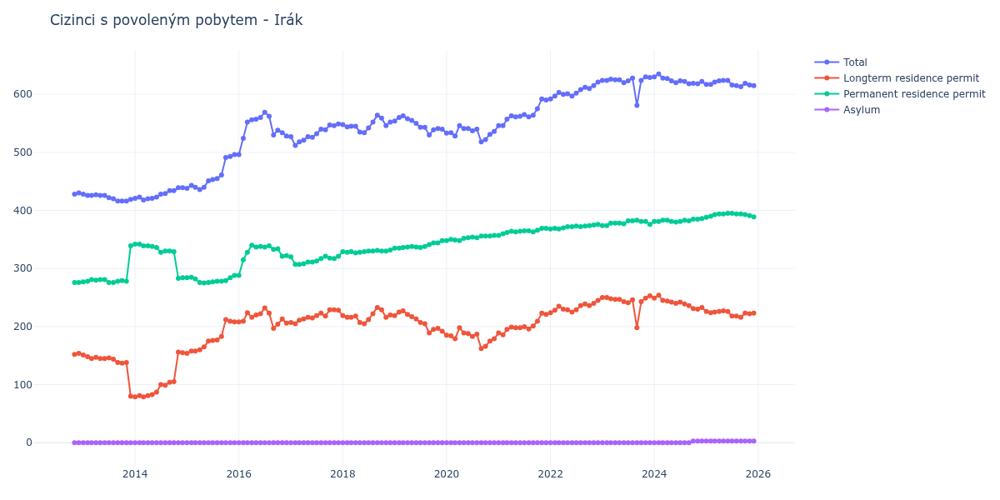

# Irák

## Souhrnné statistiky (Min/Max pro rok) / Summary Statistics (Min/Max per year)

| Year   | Total Min/Max   | Longterm Residence Permit Min/Max   | Permanent Residence Permit Min/Max   | Asylum Min/Max   |
|--------|-----------------|-------------------------------------|--------------------------------------|------------------|
| 2012   | 428 / 430       | 152 / 154                           | 276 / 276                            | 0 / 0            |
| 2013   | 416 / 428       | 80 / 151                            | 276 / 339                            | 0 / 0            |
| 2014   | 418 / 439       | 79 / 156                            | 283 / 342                            | 0 / 0            |
| 2015   | 436 / 496       | 154 / 212                           | 275 / 288                            | 0 / 0            |
| 2016   | 496 / 569       | 197 / 232                           | 288 / 340                            | 0 / 0            |
| 2017   | 512 / 549       | 205 / 229                           | 307 / 321                            | 0 / 0            |
| 2018   | 534 / 564       | 205 / 233                           | 327 / 332                            | 0 / 0            |
| 2019   | 530 / 563       | 189 / 227                           | 335 / 348                            | 0 / 0            |
| 2020   | 518 / 546       | 162 / 198                           | 348 / 357                            | 0 / 0            |
| 2021   | 546 / 592       | 186 / 223                           | 357 / 369                            | 0 / 0            |
| 2022   | 592 / 621       | 224 / 245                           | 368 / 376                            | 0 / 0            |
| 2023   | 581 / 630       | 198 / 253                           | 374 / 383                            | 0 / 0            |
| 2024   | 618 / 635       | 230 / 254                           | 380 / 386                            | 0 / 3            |
| 2025   | 613 / 624       | 216 / 227                           | 388 / 395                            | 3 / 3            |

## Detailní tabulka / Detailed Data Table

| Date     | Total        | Longterm Residence Permit   | Permanent Residence Permit   | Asylum     |
|----------|--------------|-----------------------------|------------------------------|------------|
| **2012** |              |                             |                              |            |
| 11.2012  | 428          | 152                         | 276                          | 0          |
| 12.2012  | 430 (+0.47%) | 154 (+1.32%)                | 276 (+0.00%)                 | 0          |
| **2013** |              |                             |                              |            |
| 01.2013  | 428 (-0.47%) | 151 (-1.95%)                | 277 (+0.36%)                 | 0          |
| 02.2013  | 426 (-0.47%) | 148 (-1.99%)                | 278 (+0.36%)                 | 0          |
| 03.2013  | 426 (+0.00%) | 145 (-2.03%)                | 281 (+1.08%)                 | 0          |
| 04.2013  | 427 (+0.23%) | 147 (+1.38%)                | 280 (-0.36%)                 | 0          |
| 05.2013  | 426 (-0.23%) | 145 (-1.36%)                | 281 (+0.36%)                 | 0          |
| 06.2013  | 426 (+0.00%) | 145 (+0.00%)                | 281 (+0.00%)                 | 0          |
| 07.2013  | 422 (-0.94%) | 146 (+0.69%)                | 276 (-1.78%)                 | 0          |
| 08.2013  | 420 (-0.47%) | 144 (-1.37%)                | 276 (+0.00%)                 | 0          |
| 09.2013  | 416 (-0.95%) | 138 (-4.17%)                | 278 (+0.72%)                 | 0          |
| 10.2013  | 416 (+0.00%) | 137 (-0.72%)                | 279 (+0.36%)                 | 0          |
| 11.2013  | 416 (+0.00%) | 138 (+0.73%)                | 278 (-0.36%)                 | 0          |
| 12.2013  | 419 (+0.72%) | 80 (-42.03%)                | 339 (+21.94%)                | 0          |
| **2014** |              |                             |                              |            |
| 01.2014  | 421 (+0.48%) | 79 (-1.25%)                 | 342 (+0.88%)                 | 0          |
| 02.2014  | 423 (+0.48%) | 81 (+2.53%)                 | 342 (+0.00%)                 | 0          |
| 03.2014  | 418 (-1.18%) | 79 (-2.47%)                 | 339 (-0.88%)                 | 0          |
| 04.2014  | 420 (+0.48%) | 81 (+2.53%)                 | 339 (+0.00%)                 | 0          |
| 05.2014  | 421 (+0.24%) | 83 (+2.47%)                 | 338 (-0.29%)                 | 0          |
| 06.2014  | 423 (+0.48%) | 87 (+4.82%)                 | 336 (-0.59%)                 | 0          |
| 07.2014  | 428 (+1.18%) | 100 (+14.94%)               | 328 (-2.38%)                 | 0          |
| 08.2014  | 429 (+0.23%) | 99 (-1.00%)                 | 330 (+0.61%)                 | 0          |
| 09.2014  | 434 (+1.17%) | 104 (+5.05%)                | 330 (+0.00%)                 | 0          |
| 10.2014  | 434 (+0.00%) | 105 (+0.96%)                | 329 (-0.30%)                 | 0          |
| 11.2014  | 439 (+1.15%) | 156 (+48.57%)               | 283 (-13.98%)                | 0          |
| 12.2014  | 439 (+0.00%) | 155 (-0.64%)                | 284 (+0.35%)                 | 0          |
| **2015** |              |                             |                              |            |
| 01.2015  | 438 (-0.23%) | 154 (-0.65%)                | 284 (+0.00%)                 | 0          |
| 02.2015  | 443 (+1.14%) | 158 (+2.60%)                | 285 (+0.35%)                 | 0          |
| 03.2015  | 440 (-0.68%) | 158 (+0.00%)                | 282 (-1.05%)                 | 0          |
| 04.2015  | 436 (-0.91%) | 160 (+1.27%)                | 276 (-2.13%)                 | 0          |
| 05.2015  | 440 (+0.92%) | 165 (+3.12%)                | 275 (-0.36%)                 | 0          |
| 06.2015  | 451 (+2.50%) | 175 (+6.06%)                | 276 (+0.36%)                 | 0          |
| 07.2015  | 453 (+0.44%) | 176 (+0.57%)                | 277 (+0.36%)                 | 0          |
| 08.2015  | 455 (+0.44%) | 177 (+0.57%)                | 278 (+0.36%)                 | 0          |
| 09.2015  | 461 (+1.32%) | 183 (+3.39%)                | 278 (+0.00%)                 | 0          |
| 10.2015  | 491 (+6.51%) | 212 (+15.85%)               | 279 (+0.36%)                 | 0          |
| 11.2015  | 493 (+0.41%) | 209 (-1.42%)                | 284 (+1.79%)                 | 0          |
| 12.2015  | 496 (+0.61%) | 208 (-0.48%)                | 288 (+1.41%)                 | 0          |
| **2016** |              |                             |                              |            |
| 01.2016  | 496 (+0.00%) | 208 (+0.00%)                | 288 (+0.00%)                 | 0          |
| 02.2016  | 524 (+5.65%) | 209 (+0.48%)                | 315 (+9.38%)                 | 0          |
| 03.2016  | 552 (+5.34%) | 224 (+7.18%)                | 328 (+4.13%)                 | 0          |
| 04.2016  | 556 (+0.72%) | 216 (-3.57%)                | 340 (+3.66%)                 | 0          |
| 05.2016  | 557 (+0.18%) | 220 (+1.85%)                | 337 (-0.88%)                 | 0          |
| 06.2016  | 560 (+0.54%) | 222 (+0.91%)                | 338 (+0.30%)                 | 0          |
| 07.2016  | 569 (+1.61%) | 232 (+4.50%)                | 337 (-0.30%)                 | 0          |
| 08.2016  | 562 (-1.23%) | 223 (-3.88%)                | 339 (+0.59%)                 | 0          |
| 09.2016  | 530 (-5.69%) | 197 (-11.66%)               | 333 (-1.77%)                 | 0          |
| 10.2016  | 538 (+1.51%) | 204 (+3.55%)                | 334 (+0.30%)                 | 0          |
| 11.2016  | 534 (-0.74%) | 213 (+4.41%)                | 321 (-3.89%)                 | 0          |
| 12.2016  | 528 (-1.12%) | 206 (-3.29%)                | 322 (+0.31%)                 | 0          |
| **2017** |              |                             |                              |            |
| 01.2017  | 527 (-0.19%) | 207 (+0.49%)                | 320 (-0.62%)                 | 0          |
| 02.2017  | 512 (-2.85%) | 205 (-0.97%)                | 307 (-4.06%)                 | 0          |
| 03.2017  | 518 (+1.17%) | 211 (+2.93%)                | 307 (+0.00%)                 | 0          |
| 04.2017  | 521 (+0.58%) | 213 (+0.95%)                | 308 (+0.33%)                 | 0          |
| 05.2017  | 527 (+1.15%) | 216 (+1.41%)                | 311 (+0.97%)                 | 0          |
| 06.2017  | 526 (-0.19%) | 215 (-0.46%)                | 311 (+0.00%)                 | 0          |
| 07.2017  | 532 (+1.14%) | 219 (+1.86%)                | 313 (+0.64%)                 | 0          |
| 08.2017  | 540 (+1.50%) | 223 (+1.83%)                | 317 (+1.28%)                 | 0          |
| 09.2017  | 539 (-0.19%) | 218 (-2.24%)                | 321 (+1.26%)                 | 0          |
| 10.2017  | 547 (+1.48%) | 229 (+5.05%)                | 318 (-0.93%)                 | 0          |
| 11.2017  | 546 (-0.18%) | 229 (+0.00%)                | 317 (-0.31%)                 | 0          |
| 12.2017  | 549 (+0.55%) | 228 (-0.44%)                | 321 (+1.26%)                 | 0          |
| **2018** |              |                             |                              |            |
| 01.2018  | 548 (-0.18%) | 219 (-3.95%)                | 329 (+2.49%)                 | 0          |
| 02.2018  | 544 (-0.73%) | 216 (-1.37%)                | 328 (-0.30%)                 | 0          |
| 03.2018  | 545 (+0.18%) | 216 (+0.00%)                | 329 (+0.30%)                 | 0          |
| 04.2018  | 545 (+0.00%) | 218 (+0.93%)                | 327 (-0.61%)                 | 0          |
| 05.2018  | 535 (-1.83%) | 207 (-5.05%)                | 328 (+0.31%)                 | 0          |
| 06.2018  | 534 (-0.19%) | 205 (-0.97%)                | 329 (+0.30%)                 | 0          |
| 07.2018  | 542 (+1.50%) | 212 (+3.41%)                | 330 (+0.30%)                 | 0          |
| 08.2018  | 552 (+1.85%) | 222 (+4.72%)                | 330 (+0.00%)                 | 0          |
| 09.2018  | 564 (+2.17%) | 233 (+4.95%)                | 331 (+0.30%)                 | 0          |
| 10.2018  | 559 (-0.89%) | 229 (-1.72%)                | 330 (-0.30%)                 | 0          |
| 11.2018  | 546 (-2.33%) | 216 (-5.68%)                | 330 (+0.00%)                 | 0          |
| 12.2018  | 552 (+1.10%) | 220 (+1.85%)                | 332 (+0.61%)                 | 0          |
| **2019** |              |                             |                              |            |
| 01.2019  | 554 (+0.36%) | 219 (-0.45%)                | 335 (+0.90%)                 | 0          |
| 02.2019  | 560 (+1.08%) | 225 (+2.74%)                | 335 (+0.00%)                 | 0          |
| 03.2019  | 563 (+0.54%) | 227 (+0.89%)                | 336 (+0.30%)                 | 0          |
| 04.2019  | 558 (-0.89%) | 221 (-2.64%)                | 337 (+0.30%)                 | 0          |
| 05.2019  | 555 (-0.54%) | 217 (-1.81%)                | 338 (+0.30%)                 | 0          |
| 06.2019  | 550 (-0.90%) | 213 (-1.84%)                | 337 (-0.30%)                 | 0          |
| 07.2019  | 543 (-1.27%) | 207 (-2.82%)                | 336 (-0.30%)                 | 0          |
| 08.2019  | 543 (+0.00%) | 205 (-0.97%)                | 338 (+0.60%)                 | 0          |
| 09.2019  | 530 (-2.39%) | 189 (-7.80%)                | 341 (+0.89%)                 | 0          |
| 10.2019  | 539 (+1.70%) | 195 (+3.17%)                | 344 (+0.88%)                 | 0          |
| 11.2019  | 541 (+0.37%) | 197 (+1.03%)                | 344 (+0.00%)                 | 0          |
| 12.2019  | 540 (-0.18%) | 192 (-2.54%)                | 348 (+1.16%)                 | 0          |
| **2020** |              |                             |                              |            |
| 01.2020  | 533 (-1.30%) | 185 (-3.65%)                | 348 (+0.00%)                 | 0          |
| 02.2020  | 534 (+0.19%) | 184 (-0.54%)                | 350 (+0.57%)                 | 0          |
| 03.2020  | 528 (-1.12%) | 179 (-2.72%)                | 349 (-0.29%)                 | 0          |
| 04.2020  | 546 (+3.41%) | 198 (+10.61%)               | 348 (-0.29%)                 | 0          |
| 05.2020  | 541 (-0.92%) | 189 (-4.55%)                | 352 (+1.15%)                 | 0          |
| 06.2020  | 541 (+0.00%) | 188 (-0.53%)                | 353 (+0.28%)                 | 0          |
| 07.2020  | 537 (-0.74%) | 183 (-2.66%)                | 354 (+0.28%)                 | 0          |
| 08.2020  | 540 (+0.56%) | 187 (+2.19%)                | 353 (-0.28%)                 | 0          |
| 09.2020  | 518 (-4.07%) | 162 (-13.37%)               | 356 (+0.85%)                 | 0          |
| 10.2020  | 522 (+0.77%) | 166 (+2.47%)                | 356 (+0.00%)                 | 0          |
| 11.2020  | 531 (+1.72%) | 175 (+5.42%)                | 356 (+0.00%)                 | 0          |
| 12.2020  | 536 (+0.94%) | 179 (+2.29%)                | 357 (+0.28%)                 | 0          |
| **2021** |              |                             |                              |            |
| 01.2021  | 546 (+1.87%) | 189 (+5.59%)                | 357 (+0.00%)                 | 0          |
| 02.2021  | 546 (+0.00%) | 186 (-1.59%)                | 360 (+0.84%)                 | 0          |
| 03.2021  | 557 (+2.01%) | 195 (+4.84%)                | 362 (+0.56%)                 | 0          |
| 04.2021  | 563 (+1.08%) | 199 (+2.05%)                | 364 (+0.55%)                 | 0          |
| 05.2021  | 561 (-0.36%) | 198 (-0.50%)                | 363 (-0.27%)                 | 0          |
| 06.2021  | 562 (+0.18%) | 198 (+0.00%)                | 364 (+0.28%)                 | 0          |
| 07.2021  | 565 (+0.53%) | 200 (+1.01%)                | 365 (+0.27%)                 | 0          |
| 08.2021  | 561 (-0.71%) | 196 (-2.00%)                | 365 (+0.00%)                 | 0          |
| 09.2021  | 564 (+0.53%) | 201 (+2.55%)                | 363 (-0.55%)                 | 0          |
| 10.2021  | 575 (+1.95%) | 209 (+3.98%)                | 366 (+0.83%)                 | 0          |
| 11.2021  | 592 (+2.96%) | 223 (+6.70%)                | 369 (+0.82%)                 | 0          |
| 12.2021  | 590 (-0.34%) | 221 (-0.90%)                | 369 (+0.00%)                 | 0          |
| **2022** |              |                             |                              |            |
| 01.2022  | 592 (+0.34%) | 224 (+1.36%)                | 368 (-0.27%)                 | 0          |
| 02.2022  | 597 (+0.84%) | 228 (+1.79%)                | 369 (+0.27%)                 | 0          |
| 03.2022  | 603 (+1.01%) | 235 (+3.07%)                | 368 (-0.27%)                 | 0          |
| 04.2022  | 600 (-0.50%) | 230 (-2.13%)                | 370 (+0.54%)                 | 0          |
| 05.2022  | 601 (+0.17%) | 229 (-0.43%)                | 372 (+0.54%)                 | 0          |
| 06.2022  | 597 (-0.67%) | 225 (-1.75%)                | 372 (+0.00%)                 | 0          |
| 07.2022  | 602 (+0.84%) | 229 (+1.78%)                | 373 (+0.27%)                 | 0          |
| 08.2022  | 608 (+1.00%) | 236 (+3.06%)                | 372 (-0.27%)                 | 0          |
| 09.2022  | 612 (+0.66%) | 239 (+1.27%)                | 373 (+0.27%)                 | 0          |
| 10.2022  | 610 (-0.33%) | 236 (-1.26%)                | 374 (+0.27%)                 | 0          |
| 11.2022  | 615 (+0.82%) | 240 (+1.69%)                | 375 (+0.27%)                 | 0          |
| 12.2022  | 621 (+0.98%) | 245 (+2.08%)                | 376 (+0.27%)                 | 0          |
| **2023** |              |                             |                              |            |
| 01.2023  | 624 (+0.48%) | 250 (+2.04%)                | 374 (-0.53%)                 | 0          |
| 02.2023  | 624 (+0.00%) | 250 (+0.00%)                | 374 (+0.00%)                 | 0          |
| 03.2023  | 626 (+0.32%) | 248 (-0.80%)                | 378 (+1.07%)                 | 0          |
| 04.2023  | 625 (-0.16%) | 247 (-0.40%)                | 378 (+0.00%)                 | 0          |
| 05.2023  | 625 (+0.00%) | 247 (+0.00%)                | 378 (+0.00%)                 | 0          |
| 06.2023  | 620 (-0.80%) | 243 (-1.62%)                | 377 (-0.26%)                 | 0          |
| 07.2023  | 623 (+0.48%) | 241 (-0.82%)                | 382 (+1.33%)                 | 0          |
| 08.2023  | 628 (+0.80%) | 246 (+2.07%)                | 382 (+0.00%)                 | 0          |
| 09.2023  | 581 (-7.48%) | 198 (-19.51%)               | 383 (+0.26%)                 | 0          |
| 10.2023  | 624 (+7.40%) | 243 (+22.73%)               | 381 (-0.52%)                 | 0          |
| 11.2023  | 630 (+0.96%) | 249 (+2.47%)                | 381 (+0.00%)                 | 0          |
| 12.2023  | 629 (-0.16%) | 253 (+1.61%)                | 376 (-1.31%)                 | 0          |
| **2024** |              |                             |                              |            |
| 01.2024  | 630 (+0.16%) | 249 (-1.58%)                | 381 (+1.33%)                 | 0          |
| 02.2024  | 635 (+0.79%) | 254 (+2.01%)                | 381 (+0.00%)                 | 0          |
| 03.2024  | 628 (-1.10%) | 245 (-3.54%)                | 383 (+0.52%)                 | 0          |
| 04.2024  | 627 (-0.16%) | 244 (-0.41%)                | 383 (+0.00%)                 | 0          |
| 05.2024  | 623 (-0.64%) | 242 (-0.82%)                | 381 (-0.52%)                 | 0          |
| 06.2024  | 620 (-0.48%) | 240 (-0.83%)                | 380 (-0.26%)                 | 0          |
| 07.2024  | 623 (+0.48%) | 242 (+0.83%)                | 381 (+0.26%)                 | 0          |
| 08.2024  | 622 (-0.16%) | 239 (-1.24%)                | 383 (+0.52%)                 | 0          |
| 09.2024  | 618 (-0.64%) | 236 (-1.26%)                | 382 (-0.26%)                 | 0          |
| 10.2024  | 619 (+0.16%) | 231 (-2.12%)                | 385 (+0.79%)                 | 3          |
| 11.2024  | 618 (-0.16%) | 230 (-0.43%)                | 385 (+0.00%)                 | 3 (+0.00%) |
| 12.2024  | 622 (+0.65%) | 233 (+1.30%)                | 386 (+0.26%)                 | 3 (+0.00%) |
| **2025** |              |                             |                              |            |
| 01.2025  | 617 (-0.80%) | 226 (-3.00%)                | 388 (+0.52%)                 | 3 (+0.00%) |
| 02.2025  | 617 (+0.00%) | 224 (-0.88%)                | 390 (+0.52%)                 | 3 (+0.00%) |
| 03.2025  | 621 (+0.65%) | 225 (+0.45%)                | 393 (+0.77%)                 | 3 (+0.00%) |
| 04.2025  | 623 (+0.32%) | 226 (+0.44%)                | 394 (+0.25%)                 | 3 (+0.00%) |
| 05.2025  | 624 (+0.16%) | 227 (+0.44%)                | 394 (+0.00%)                 | 3 (+0.00%) |
| 06.2025  | 624 (+0.00%) | 226 (-0.44%)                | 395 (+0.25%)                 | 3 (+0.00%) |
| 07.2025  | 616 (-1.28%) | 218 (-3.54%)                | 395 (+0.00%)                 | 3 (+0.00%) |
| 08.2025  | 615 (-0.16%) | 218 (+0.00%)                | 394 (-0.25%)                 | 3 (+0.00%) |
| 09.2025  | 613 (-0.33%) | 216 (-0.92%)                | 394 (+0.00%)                 | 3 (+0.00%) |
| 10.2025  | 619 (+0.98%) | 223 (+3.24%)                | 393 (-0.25%)                 | 3 (+0.00%) |
| 11.2025  | 616 (-0.48%) | 222 (-0.45%)                | 391 (-0.51%)                 | 3 (+0.00%) |
| 12.2025  | 615 (-0.16%) | 223 (+0.45%)                | 389 (-0.51%)                 | 3 (+0.00%) |
