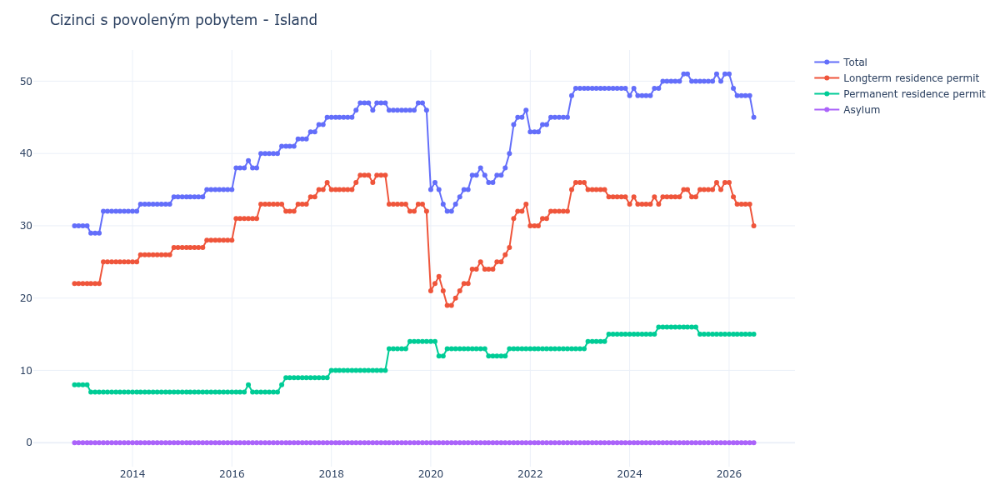

# Island

## Souhrnné statistiky (Min/Max pro rok) / Summary Statistics (Min/Max per year)

| Year   | Total   | Longterm Residence Permit   | Permanent Residence Permit   | Asylum   |
|--------|---------|-----------------------------|------------------------------|----------|
| 2012   | 30 / 30 | 22 / 22                     | 8 / 8                        | 0 / 0    |
| 2013   | 29 / 32 | 22 / 25                     | 7 / 8                        | 0 / 0    |
| 2014   | 32 / 34 | 25 / 27                     | 7 / 7                        | 0 / 0    |
| 2015   | 34 / 35 | 27 / 28                     | 7 / 7                        | 0 / 0    |
| 2016   | 35 / 40 | 28 / 33                     | 7 / 8                        | 0 / 0    |
| 2017   | 41 / 45 | 32 / 36                     | 8 / 9                        | 0 / 0    |
| 2018   | 45 / 47 | 35 / 37                     | 10 / 10                      | 0 / 0    |
| 2019   | 46 / 47 | 32 / 37                     | 10 / 14                      | 0 / 0    |
| 2020   | 32 / 37 | 19 / 24                     | 12 / 14                      | 0 / 0    |
| 2021   | 36 / 46 | 24 / 33                     | 12 / 13                      | 0 / 0    |
| 2022   | 43 / 49 | 30 / 36                     | 13 / 13                      | 0 / 0    |
| 2023   | 49 / 49 | 34 / 36                     | 13 / 15                      | 0 / 0    |
| 2024   | 48 / 50 | 33 / 34                     | 15 / 16                      | 0 / 0    |
| 2025   | 50 / 51 | 34 / 36                     | 15 / 16                      | 0 / 0    |
| 2026   | 45 / 51 | 30 / 36                     | 15 / 15                      | 0 / 0    |

## Detailní tabulka / Detailed Data Table

| Date     | Total        | Longterm Residence Permit   | Permanent Residence Permit   | Asylum   |
|----------|--------------|-----------------------------|------------------------------|----------|
| **2012** |              |                             |                              |          |
| 11.2012  | 30           | 22                          | 8                            | 0        |
| 12.2012  | 30 (+0.00%)  | 22 (+0.00%)                 | 8 (+0.00%)                   | 0        |
| **2013** |              |                             |                              |          |
| 01.2013  | 30 (+0.00%)  | 22 (+0.00%)                 | 8 (+0.00%)                   | 0        |
| 02.2013  | 30 (+0.00%)  | 22 (+0.00%)                 | 8 (+0.00%)                   | 0        |
| 03.2013  | 29 (-3.33%)  | 22 (+0.00%)                 | 7 (-12.50%)                  | 0        |
| 04.2013  | 29 (+0.00%)  | 22 (+0.00%)                 | 7 (+0.00%)                   | 0        |
| 05.2013  | 29 (+0.00%)  | 22 (+0.00%)                 | 7 (+0.00%)                   | 0        |
| 06.2013  | 32 (+10.34%) | 25 (+13.64%)                | 7 (+0.00%)                   | 0        |
| 07.2013  | 32 (+0.00%)  | 25 (+0.00%)                 | 7 (+0.00%)                   | 0        |
| 08.2013  | 32 (+0.00%)  | 25 (+0.00%)                 | 7 (+0.00%)                   | 0        |
| 09.2013  | 32 (+0.00%)  | 25 (+0.00%)                 | 7 (+0.00%)                   | 0        |
| 10.2013  | 32 (+0.00%)  | 25 (+0.00%)                 | 7 (+0.00%)                   | 0        |
| 11.2013  | 32 (+0.00%)  | 25 (+0.00%)                 | 7 (+0.00%)                   | 0        |
| 12.2013  | 32 (+0.00%)  | 25 (+0.00%)                 | 7 (+0.00%)                   | 0        |
| **2014** |              |                             |                              |          |
| 01.2014  | 32 (+0.00%)  | 25 (+0.00%)                 | 7 (+0.00%)                   | 0        |
| 02.2014  | 32 (+0.00%)  | 25 (+0.00%)                 | 7 (+0.00%)                   | 0        |
| 03.2014  | 33 (+3.12%)  | 26 (+4.00%)                 | 7 (+0.00%)                   | 0        |
| 04.2014  | 33 (+0.00%)  | 26 (+0.00%)                 | 7 (+0.00%)                   | 0        |
| 05.2014  | 33 (+0.00%)  | 26 (+0.00%)                 | 7 (+0.00%)                   | 0        |
| 06.2014  | 33 (+0.00%)  | 26 (+0.00%)                 | 7 (+0.00%)                   | 0        |
| 07.2014  | 33 (+0.00%)  | 26 (+0.00%)                 | 7 (+0.00%)                   | 0        |
| 08.2014  | 33 (+0.00%)  | 26 (+0.00%)                 | 7 (+0.00%)                   | 0        |
| 09.2014  | 33 (+0.00%)  | 26 (+0.00%)                 | 7 (+0.00%)                   | 0        |
| 10.2014  | 33 (+0.00%)  | 26 (+0.00%)                 | 7 (+0.00%)                   | 0        |
| 11.2014  | 34 (+3.03%)  | 27 (+3.85%)                 | 7 (+0.00%)                   | 0        |
| 12.2014  | 34 (+0.00%)  | 27 (+0.00%)                 | 7 (+0.00%)                   | 0        |
| **2015** |              |                             |                              |          |
| 01.2015  | 34 (+0.00%)  | 27 (+0.00%)                 | 7 (+0.00%)                   | 0        |
| 02.2015  | 34 (+0.00%)  | 27 (+0.00%)                 | 7 (+0.00%)                   | 0        |
| 03.2015  | 34 (+0.00%)  | 27 (+0.00%)                 | 7 (+0.00%)                   | 0        |
| 04.2015  | 34 (+0.00%)  | 27 (+0.00%)                 | 7 (+0.00%)                   | 0        |
| 05.2015  | 34 (+0.00%)  | 27 (+0.00%)                 | 7 (+0.00%)                   | 0        |
| 06.2015  | 34 (+0.00%)  | 27 (+0.00%)                 | 7 (+0.00%)                   | 0        |
| 07.2015  | 35 (+2.94%)  | 28 (+3.70%)                 | 7 (+0.00%)                   | 0        |
| 08.2015  | 35 (+0.00%)  | 28 (+0.00%)                 | 7 (+0.00%)                   | 0        |
| 09.2015  | 35 (+0.00%)  | 28 (+0.00%)                 | 7 (+0.00%)                   | 0        |
| 10.2015  | 35 (+0.00%)  | 28 (+0.00%)                 | 7 (+0.00%)                   | 0        |
| 11.2015  | 35 (+0.00%)  | 28 (+0.00%)                 | 7 (+0.00%)                   | 0        |
| 12.2015  | 35 (+0.00%)  | 28 (+0.00%)                 | 7 (+0.00%)                   | 0        |
| **2016** |              |                             |                              |          |
| 01.2016  | 35 (+0.00%)  | 28 (+0.00%)                 | 7 (+0.00%)                   | 0        |
| 02.2016  | 38 (+8.57%)  | 31 (+10.71%)                | 7 (+0.00%)                   | 0        |
| 03.2016  | 38 (+0.00%)  | 31 (+0.00%)                 | 7 (+0.00%)                   | 0        |
| 04.2016  | 38 (+0.00%)  | 31 (+0.00%)                 | 7 (+0.00%)                   | 0        |
| 05.2016  | 39 (+2.63%)  | 31 (+0.00%)                 | 8 (+14.29%)                  | 0        |
| 06.2016  | 38 (-2.56%)  | 31 (+0.00%)                 | 7 (-12.50%)                  | 0        |
| 07.2016  | 38 (+0.00%)  | 31 (+0.00%)                 | 7 (+0.00%)                   | 0        |
| 08.2016  | 40 (+5.26%)  | 33 (+6.45%)                 | 7 (+0.00%)                   | 0        |
| 09.2016  | 40 (+0.00%)  | 33 (+0.00%)                 | 7 (+0.00%)                   | 0        |
| 10.2016  | 40 (+0.00%)  | 33 (+0.00%)                 | 7 (+0.00%)                   | 0        |
| 11.2016  | 40 (+0.00%)  | 33 (+0.00%)                 | 7 (+0.00%)                   | 0        |
| 12.2016  | 40 (+0.00%)  | 33 (+0.00%)                 | 7 (+0.00%)                   | 0        |
| **2017** |              |                             |                              |          |
| 01.2017  | 41 (+2.50%)  | 33 (+0.00%)                 | 8 (+14.29%)                  | 0        |
| 02.2017  | 41 (+0.00%)  | 32 (-3.03%)                 | 9 (+12.50%)                  | 0        |
| 03.2017  | 41 (+0.00%)  | 32 (+0.00%)                 | 9 (+0.00%)                   | 0        |
| 04.2017  | 41 (+0.00%)  | 32 (+0.00%)                 | 9 (+0.00%)                   | 0        |
| 05.2017  | 42 (+2.44%)  | 33 (+3.12%)                 | 9 (+0.00%)                   | 0        |
| 06.2017  | 42 (+0.00%)  | 33 (+0.00%)                 | 9 (+0.00%)                   | 0        |
| 07.2017  | 42 (+0.00%)  | 33 (+0.00%)                 | 9 (+0.00%)                   | 0        |
| 08.2017  | 43 (+2.38%)  | 34 (+3.03%)                 | 9 (+0.00%)                   | 0        |
| 09.2017  | 43 (+0.00%)  | 34 (+0.00%)                 | 9 (+0.00%)                   | 0        |
| 10.2017  | 44 (+2.33%)  | 35 (+2.94%)                 | 9 (+0.00%)                   | 0        |
| 11.2017  | 44 (+0.00%)  | 35 (+0.00%)                 | 9 (+0.00%)                   | 0        |
| 12.2017  | 45 (+2.27%)  | 36 (+2.86%)                 | 9 (+0.00%)                   | 0        |
| **2018** |              |                             |                              |          |
| 01.2018  | 45 (+0.00%)  | 35 (-2.78%)                 | 10 (+11.11%)                 | 0        |
| 02.2018  | 45 (+0.00%)  | 35 (+0.00%)                 | 10 (+0.00%)                  | 0        |
| 03.2018  | 45 (+0.00%)  | 35 (+0.00%)                 | 10 (+0.00%)                  | 0        |
| 04.2018  | 45 (+0.00%)  | 35 (+0.00%)                 | 10 (+0.00%)                  | 0        |
| 05.2018  | 45 (+0.00%)  | 35 (+0.00%)                 | 10 (+0.00%)                  | 0        |
| 06.2018  | 45 (+0.00%)  | 35 (+0.00%)                 | 10 (+0.00%)                  | 0        |
| 07.2018  | 46 (+2.22%)  | 36 (+2.86%)                 | 10 (+0.00%)                  | 0        |
| 08.2018  | 47 (+2.17%)  | 37 (+2.78%)                 | 10 (+0.00%)                  | 0        |
| 09.2018  | 47 (+0.00%)  | 37 (+0.00%)                 | 10 (+0.00%)                  | 0        |
| 10.2018  | 47 (+0.00%)  | 37 (+0.00%)                 | 10 (+0.00%)                  | 0        |
| 11.2018  | 46 (-2.13%)  | 36 (-2.70%)                 | 10 (+0.00%)                  | 0        |
| 12.2018  | 47 (+2.17%)  | 37 (+2.78%)                 | 10 (+0.00%)                  | 0        |
| **2019** |              |                             |                              |          |
| 01.2019  | 47 (+0.00%)  | 37 (+0.00%)                 | 10 (+0.00%)                  | 0        |
| 02.2019  | 47 (+0.00%)  | 37 (+0.00%)                 | 10 (+0.00%)                  | 0        |
| 03.2019  | 46 (-2.13%)  | 33 (-10.81%)                | 13 (+30.00%)                 | 0        |
| 04.2019  | 46 (+0.00%)  | 33 (+0.00%)                 | 13 (+0.00%)                  | 0        |
| 05.2019  | 46 (+0.00%)  | 33 (+0.00%)                 | 13 (+0.00%)                  | 0        |
| 06.2019  | 46 (+0.00%)  | 33 (+0.00%)                 | 13 (+0.00%)                  | 0        |
| 07.2019  | 46 (+0.00%)  | 33 (+0.00%)                 | 13 (+0.00%)                  | 0        |
| 08.2019  | 46 (+0.00%)  | 32 (-3.03%)                 | 14 (+7.69%)                  | 0        |
| 09.2019  | 46 (+0.00%)  | 32 (+0.00%)                 | 14 (+0.00%)                  | 0        |
| 10.2019  | 47 (+2.17%)  | 33 (+3.12%)                 | 14 (+0.00%)                  | 0        |
| 11.2019  | 47 (+0.00%)  | 33 (+0.00%)                 | 14 (+0.00%)                  | 0        |
| 12.2019  | 46 (-2.13%)  | 32 (-3.03%)                 | 14 (+0.00%)                  | 0        |
| **2020** |              |                             |                              |          |
| 01.2020  | 35 (-23.91%) | 21 (-34.38%)                | 14 (+0.00%)                  | 0        |
| 02.2020  | 36 (+2.86%)  | 22 (+4.76%)                 | 14 (+0.00%)                  | 0        |
| 03.2020  | 35 (-2.78%)  | 23 (+4.55%)                 | 12 (-14.29%)                 | 0        |
| 04.2020  | 33 (-5.71%)  | 21 (-8.70%)                 | 12 (+0.00%)                  | 0        |
| 05.2020  | 32 (-3.03%)  | 19 (-9.52%)                 | 13 (+8.33%)                  | 0        |
| 06.2020  | 32 (+0.00%)  | 19 (+0.00%)                 | 13 (+0.00%)                  | 0        |
| 07.2020  | 33 (+3.12%)  | 20 (+5.26%)                 | 13 (+0.00%)                  | 0        |
| 08.2020  | 34 (+3.03%)  | 21 (+5.00%)                 | 13 (+0.00%)                  | 0        |
| 09.2020  | 35 (+2.94%)  | 22 (+4.76%)                 | 13 (+0.00%)                  | 0        |
| 10.2020  | 35 (+0.00%)  | 22 (+0.00%)                 | 13 (+0.00%)                  | 0        |
| 11.2020  | 37 (+5.71%)  | 24 (+9.09%)                 | 13 (+0.00%)                  | 0        |
| 12.2020  | 37 (+0.00%)  | 24 (+0.00%)                 | 13 (+0.00%)                  | 0        |
| **2021** |              |                             |                              |          |
| 01.2021  | 38 (+2.70%)  | 25 (+4.17%)                 | 13 (+0.00%)                  | 0        |
| 02.2021  | 37 (-2.63%)  | 24 (-4.00%)                 | 13 (+0.00%)                  | 0        |
| 03.2021  | 36 (-2.70%)  | 24 (+0.00%)                 | 12 (-7.69%)                  | 0        |
| 04.2021  | 36 (+0.00%)  | 24 (+0.00%)                 | 12 (+0.00%)                  | 0        |
| 05.2021  | 37 (+2.78%)  | 25 (+4.17%)                 | 12 (+0.00%)                  | 0        |
| 06.2021  | 37 (+0.00%)  | 25 (+0.00%)                 | 12 (+0.00%)                  | 0        |
| 07.2021  | 38 (+2.70%)  | 26 (+4.00%)                 | 12 (+0.00%)                  | 0        |
| 08.2021  | 40 (+5.26%)  | 27 (+3.85%)                 | 13 (+8.33%)                  | 0        |
| 09.2021  | 44 (+10.00%) | 31 (+14.81%)                | 13 (+0.00%)                  | 0        |
| 10.2021  | 45 (+2.27%)  | 32 (+3.23%)                 | 13 (+0.00%)                  | 0        |
| 11.2021  | 45 (+0.00%)  | 32 (+0.00%)                 | 13 (+0.00%)                  | 0        |
| 12.2021  | 46 (+2.22%)  | 33 (+3.12%)                 | 13 (+0.00%)                  | 0        |
| **2022** |              |                             |                              |          |
| 01.2022  | 43 (-6.52%)  | 30 (-9.09%)                 | 13 (+0.00%)                  | 0        |
| 02.2022  | 43 (+0.00%)  | 30 (+0.00%)                 | 13 (+0.00%)                  | 0        |
| 03.2022  | 43 (+0.00%)  | 30 (+0.00%)                 | 13 (+0.00%)                  | 0        |
| 04.2022  | 44 (+2.33%)  | 31 (+3.33%)                 | 13 (+0.00%)                  | 0        |
| 05.2022  | 44 (+0.00%)  | 31 (+0.00%)                 | 13 (+0.00%)                  | 0        |
| 06.2022  | 45 (+2.27%)  | 32 (+3.23%)                 | 13 (+0.00%)                  | 0        |
| 07.2022  | 45 (+0.00%)  | 32 (+0.00%)                 | 13 (+0.00%)                  | 0        |
| 08.2022  | 45 (+0.00%)  | 32 (+0.00%)                 | 13 (+0.00%)                  | 0        |
| 09.2022  | 45 (+0.00%)  | 32 (+0.00%)                 | 13 (+0.00%)                  | 0        |
| 10.2022  | 45 (+0.00%)  | 32 (+0.00%)                 | 13 (+0.00%)                  | 0        |
| 11.2022  | 48 (+6.67%)  | 35 (+9.38%)                 | 13 (+0.00%)                  | 0        |
| 12.2022  | 49 (+2.08%)  | 36 (+2.86%)                 | 13 (+0.00%)                  | 0        |
| **2023** |              |                             |                              |          |
| 01.2023  | 49 (+0.00%)  | 36 (+0.00%)                 | 13 (+0.00%)                  | 0        |
| 02.2023  | 49 (+0.00%)  | 36 (+0.00%)                 | 13 (+0.00%)                  | 0        |
| 03.2023  | 49 (+0.00%)  | 35 (-2.78%)                 | 14 (+7.69%)                  | 0        |
| 04.2023  | 49 (+0.00%)  | 35 (+0.00%)                 | 14 (+0.00%)                  | 0        |
| 05.2023  | 49 (+0.00%)  | 35 (+0.00%)                 | 14 (+0.00%)                  | 0        |
| 06.2023  | 49 (+0.00%)  | 35 (+0.00%)                 | 14 (+0.00%)                  | 0        |
| 07.2023  | 49 (+0.00%)  | 35 (+0.00%)                 | 14 (+0.00%)                  | 0        |
| 08.2023  | 49 (+0.00%)  | 34 (-2.86%)                 | 15 (+7.14%)                  | 0        |
| 09.2023  | 49 (+0.00%)  | 34 (+0.00%)                 | 15 (+0.00%)                  | 0        |
| 10.2023  | 49 (+0.00%)  | 34 (+0.00%)                 | 15 (+0.00%)                  | 0        |
| 11.2023  | 49 (+0.00%)  | 34 (+0.00%)                 | 15 (+0.00%)                  | 0        |
| 12.2023  | 49 (+0.00%)  | 34 (+0.00%)                 | 15 (+0.00%)                  | 0        |
| **2024** |              |                             |                              |          |
| 01.2024  | 48 (-2.04%)  | 33 (-2.94%)                 | 15 (+0.00%)                  | 0        |
| 02.2024  | 49 (+2.08%)  | 34 (+3.03%)                 | 15 (+0.00%)                  | 0        |
| 03.2024  | 48 (-2.04%)  | 33 (-2.94%)                 | 15 (+0.00%)                  | 0        |
| 04.2024  | 48 (+0.00%)  | 33 (+0.00%)                 | 15 (+0.00%)                  | 0        |
| 05.2024  | 48 (+0.00%)  | 33 (+0.00%)                 | 15 (+0.00%)                  | 0        |
| 06.2024  | 48 (+0.00%)  | 33 (+0.00%)                 | 15 (+0.00%)                  | 0        |
| 07.2024  | 49 (+2.08%)  | 34 (+3.03%)                 | 15 (+0.00%)                  | 0        |
| 08.2024  | 49 (+0.00%)  | 33 (-2.94%)                 | 16 (+6.67%)                  | 0        |
| 09.2024  | 50 (+2.04%)  | 34 (+3.03%)                 | 16 (+0.00%)                  | 0        |
| 10.2024  | 50 (+0.00%)  | 34 (+0.00%)                 | 16 (+0.00%)                  | 0        |
| 11.2024  | 50 (+0.00%)  | 34 (+0.00%)                 | 16 (+0.00%)                  | 0        |
| 12.2024  | 50 (+0.00%)  | 34 (+0.00%)                 | 16 (+0.00%)                  | 0        |
| **2025** |              |                             |                              |          |
| 01.2025  | 50 (+0.00%)  | 34 (+0.00%)                 | 16 (+0.00%)                  | 0        |
| 02.2025  | 51 (+2.00%)  | 35 (+2.94%)                 | 16 (+0.00%)                  | 0        |
| 03.2025  | 51 (+0.00%)  | 35 (+0.00%)                 | 16 (+0.00%)                  | 0        |
| 04.2025  | 50 (-1.96%)  | 34 (-2.86%)                 | 16 (+0.00%)                  | 0        |
| 05.2025  | 50 (+0.00%)  | 34 (+0.00%)                 | 16 (+0.00%)                  | 0        |
| 06.2025  | 50 (+0.00%)  | 35 (+2.94%)                 | 15 (-6.25%)                  | 0        |
| 07.2025  | 50 (+0.00%)  | 35 (+0.00%)                 | 15 (+0.00%)                  | 0        |
| 08.2025  | 50 (+0.00%)  | 35 (+0.00%)                 | 15 (+0.00%)                  | 0        |
| 09.2025  | 50 (+0.00%)  | 35 (+0.00%)                 | 15 (+0.00%)                  | 0        |
| 10.2025  | 51 (+2.00%)  | 36 (+2.86%)                 | 15 (+0.00%)                  | 0        |
| 11.2025  | 50 (-1.96%)  | 35 (-2.78%)                 | 15 (+0.00%)                  | 0        |
| 12.2025  | 51 (+2.00%)  | 36 (+2.86%)                 | 15 (+0.00%)                  | 0        |
| **2026** |              |                             |                              |          |
| 01.2026  | 51 (+0.00%)  | 36 (+0.00%)                 | 15 (+0.00%)                  | 0        |
| 02.2026  | 49 (-3.92%)  | 34 (-5.56%)                 | 15 (+0.00%)                  | 0        |
| 03.2026  | 48 (-2.04%)  | 33 (-2.94%)                 | 15 (+0.00%)                  | 0        |
| 04.2026  | 48 (+0.00%)  | 33 (+0.00%)                 | 15 (+0.00%)                  | 0        |
| 05.2026  | 48 (+0.00%)  | 33 (+0.00%)                 | 15 (+0.00%)                  | 0        |
| 06.2026  | 48 (+0.00%)  | 33 (+0.00%)                 | 15 (+0.00%)                  | 0        |
| 07.2026  | 45 (-6.25%)  | 30 (-9.09%)                 | 15 (+0.00%)                  | 0        |
