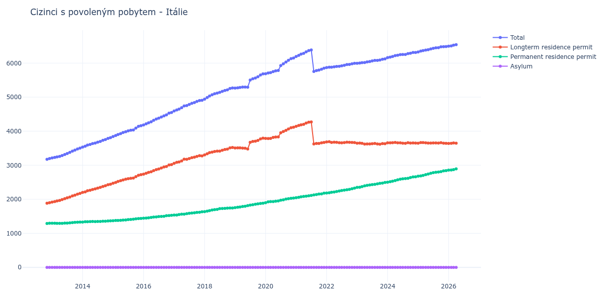

# Itálie

## Souhrnné statistiky (Min/Max pro rok) / Summary Statistics (Min/Max per year)

| Year   | Total         | Longterm Residence Permit   | Permanent Residence Permit   | Asylum   |
|--------|---------------|-----------------------------|------------------------------|----------|
| 2012   | 3 176 / 3 197 | 1 886 / 1 901               | 1 290 / 1 296                | 0 / 0    |
| 2013   | 3 215 / 3 503 | 1 917 / 2 173               | 1 294 / 1 330                | 0 / 0    |
| 2014   | 3 532 / 3 810 | 2 202 / 2 444               | 1 330 / 1 366                | 0 / 0    |
| 2015   | 3 843 / 4 161 | 2 473 / 2 722               | 1 370 / 1 439                | 0 / 0    |
| 2016   | 4 184 / 4 550 | 2 739 / 3 021               | 1 445 / 1 529                | 0 / 0    |
| 2017   | 4 592 / 4 908 | 3 056 / 3 280               | 1 536 / 1 632                | 0 / 0    |
| 2018   | 4 942 / 5 268 | 3 304 / 3 523               | 1 638 / 1 746                | 0 / 0    |
| 2019   | 5 265 / 5 682 | 3 478 / 3 797               | 1 757 / 1 885                | 0 / 0    |
| 2020   | 5 686 / 6 151 | 3 785 / 4 115               | 1 898 / 2 036                | 0 / 0    |
| 2021   | 5 753 / 6 386 | 3 626 / 4 273               | 2 049 / 2 179                | 0 / 0    |
| 2022   | 5 868 / 5 994 | 3 660 / 3 690               | 2 183 / 2 328                | 0 / 0    |
| 2023   | 5 995 / 6 125 | 3 619 / 3 650               | 2 349 / 2 493                | 0 / 0    |
| 2024   | 6 159 / 6 312 | 3 643 / 3 670               | 2 502 / 2 662                | 0 / 0    |
| 2025   | 6 327 / 6 486 | 3 644 / 3 665               | 2 681 / 2 842                | 0 / 0    |
| 2026   | 6 495 / 6 541 | 3 639 / 3 656               | 2 856 / 2 894                | 0 / 0    |

## Detailní tabulka / Detailed Data Table

| Date     | Total          | Longterm Residence Permit   | Permanent Residence Permit   | Asylum   |
|----------|----------------|-----------------------------|------------------------------|----------|
| **2012** |                |                             |                              |          |
| 11.2012  | 3 176          | 1 886                       | 1 290                        | 0        |
| 12.2012  | 3 197 (+0.66%) | 1 901 (+0.80%)              | 1 296 (+0.47%)               | 0        |
| **2013** |                |                             |                              |          |
| 01.2013  | 3 215 (+0.56%) | 1 917 (+0.84%)              | 1 298 (+0.15%)               | 0        |
| 02.2013  | 3 229 (+0.44%) | 1 932 (+0.78%)              | 1 297 (-0.08%)               | 0        |
| 03.2013  | 3 246 (+0.53%) | 1 952 (+1.04%)              | 1 294 (-0.23%)               | 0        |
| 04.2013  | 3 261 (+0.46%) | 1 966 (+0.72%)              | 1 295 (+0.08%)               | 0        |
| 05.2013  | 3 286 (+0.77%) | 1 992 (+1.32%)              | 1 294 (-0.08%)               | 0        |
| 06.2013  | 3 316 (+0.91%) | 2 017 (+1.26%)              | 1 299 (+0.39%)               | 0        |
| 07.2013  | 3 345 (+0.87%) | 2 044 (+1.34%)              | 1 301 (+0.15%)               | 0        |
| 08.2013  | 3 376 (+0.93%) | 2 067 (+1.13%)              | 1 309 (+0.61%)               | 0        |
| 09.2013  | 3 415 (+1.16%) | 2 098 (+1.50%)              | 1 317 (+0.61%)               | 0        |
| 10.2013  | 3 445 (+0.88%) | 2 122 (+1.14%)              | 1 323 (+0.46%)               | 0        |
| 11.2013  | 3 478 (+0.96%) | 2 152 (+1.41%)              | 1 326 (+0.23%)               | 0        |
| 12.2013  | 3 503 (+0.72%) | 2 173 (+0.98%)              | 1 330 (+0.30%)               | 0        |
| **2014** |                |                             |                              |          |
| 01.2014  | 3 532 (+0.83%) | 2 202 (+1.33%)              | 1 330 (+0.00%)               | 0        |
| 02.2014  | 3 557 (+0.71%) | 2 217 (+0.68%)              | 1 340 (+0.75%)               | 0        |
| 03.2014  | 3 591 (+0.96%) | 2 249 (+1.44%)              | 1 342 (+0.15%)               | 0        |
| 04.2014  | 3 612 (+0.58%) | 2 267 (+0.80%)              | 1 345 (+0.22%)               | 0        |
| 05.2014  | 3 636 (+0.66%) | 2 286 (+0.84%)              | 1 350 (+0.37%)               | 0        |
| 06.2014  | 3 650 (+0.39%) | 2 305 (+0.83%)              | 1 345 (-0.37%)               | 0        |
| 07.2014  | 3 676 (+0.71%) | 2 327 (+0.95%)              | 1 349 (+0.30%)               | 0        |
| 08.2014  | 3 699 (+0.63%) | 2 349 (+0.95%)              | 1 350 (+0.07%)               | 0        |
| 09.2014  | 3 731 (+0.87%) | 2 376 (+1.15%)              | 1 355 (+0.37%)               | 0        |
| 10.2014  | 3 755 (+0.64%) | 2 398 (+0.93%)              | 1 357 (+0.15%)               | 0        |
| 11.2014  | 3 789 (+0.91%) | 2 427 (+1.21%)              | 1 362 (+0.37%)               | 0        |
| 12.2014  | 3 810 (+0.55%) | 2 444 (+0.70%)              | 1 366 (+0.29%)               | 0        |
| **2015** |                |                             |                              |          |
| 01.2015  | 3 843 (+0.87%) | 2 473 (+1.19%)              | 1 370 (+0.29%)               | 0        |
| 02.2015  | 3 873 (+0.78%) | 2 495 (+0.89%)              | 1 378 (+0.58%)               | 0        |
| 03.2015  | 3 901 (+0.72%) | 2 524 (+1.16%)              | 1 377 (-0.07%)               | 0        |
| 04.2015  | 3 930 (+0.74%) | 2 548 (+0.95%)              | 1 382 (+0.36%)               | 0        |
| 05.2015  | 3 961 (+0.79%) | 2 570 (+0.86%)              | 1 391 (+0.65%)               | 0        |
| 06.2015  | 3 984 (+0.58%) | 2 589 (+0.74%)              | 1 395 (+0.29%)               | 0        |
| 07.2015  | 4 010 (+0.65%) | 2 607 (+0.70%)              | 1 403 (+0.57%)               | 0        |
| 08.2015  | 4 027 (+0.42%) | 2 618 (+0.42%)              | 1 409 (+0.43%)               | 0        |
| 09.2015  | 4 036 (+0.22%) | 2 622 (+0.15%)              | 1 414 (+0.35%)               | 0        |
| 10.2015  | 4 092 (+1.39%) | 2 666 (+1.68%)              | 1 426 (+0.85%)               | 0        |
| 11.2015  | 4 141 (+1.20%) | 2 706 (+1.50%)              | 1 435 (+0.63%)               | 0        |
| 12.2015  | 4 161 (+0.48%) | 2 722 (+0.59%)              | 1 439 (+0.28%)               | 0        |
| **2016** |                |                             |                              |          |
| 01.2016  | 4 184 (+0.55%) | 2 739 (+0.62%)              | 1 445 (+0.42%)               | 0        |
| 02.2016  | 4 215 (+0.74%) | 2 766 (+0.99%)              | 1 449 (+0.28%)               | 0        |
| 03.2016  | 4 246 (+0.74%) | 2 789 (+0.83%)              | 1 457 (+0.55%)               | 0        |
| 04.2016  | 4 276 (+0.71%) | 2 808 (+0.68%)              | 1 468 (+0.75%)               | 0        |
| 05.2016  | 4 319 (+1.01%) | 2 840 (+1.14%)              | 1 479 (+0.75%)               | 0        |
| 06.2016  | 4 356 (+0.86%) | 2 873 (+1.16%)              | 1 483 (+0.27%)               | 0        |
| 07.2016  | 4 384 (+0.64%) | 2 890 (+0.59%)              | 1 494 (+0.74%)               | 0        |
| 08.2016  | 4 415 (+0.71%) | 2 919 (+1.00%)              | 1 496 (+0.13%)               | 0        |
| 09.2016  | 4 450 (+0.79%) | 2 948 (+0.99%)              | 1 502 (+0.40%)               | 0        |
| 10.2016  | 4 480 (+0.67%) | 2 962 (+0.47%)              | 1 518 (+1.07%)               | 0        |
| 11.2016  | 4 530 (+1.12%) | 3 008 (+1.55%)              | 1 522 (+0.26%)               | 0        |
| 12.2016  | 4 550 (+0.44%) | 3 021 (+0.43%)              | 1 529 (+0.46%)               | 0        |
| **2017** |                |                             |                              |          |
| 01.2017  | 4 592 (+0.92%) | 3 056 (+1.16%)              | 1 536 (+0.46%)               | 0        |
| 02.2017  | 4 624 (+0.70%) | 3 085 (+0.95%)              | 1 539 (+0.20%)               | 0        |
| 03.2017  | 4 648 (+0.52%) | 3 095 (+0.32%)              | 1 553 (+0.91%)               | 0        |
| 04.2017  | 4 689 (+0.88%) | 3 126 (+1.00%)              | 1 563 (+0.64%)               | 0        |
| 05.2017  | 4 743 (+1.15%) | 3 178 (+1.66%)              | 1 565 (+0.13%)               | 0        |
| 06.2017  | 4 754 (+0.23%) | 3 176 (-0.06%)              | 1 578 (+0.83%)               | 0        |
| 07.2017  | 4 785 (+0.65%) | 3 197 (+0.66%)              | 1 588 (+0.63%)               | 0        |
| 08.2017  | 4 820 (+0.73%) | 3 224 (+0.84%)              | 1 596 (+0.50%)               | 0        |
| 09.2017  | 4 840 (+0.41%) | 3 236 (+0.37%)              | 1 604 (+0.50%)               | 0        |
| 10.2017  | 4 874 (+0.70%) | 3 260 (+0.74%)              | 1 614 (+0.62%)               | 0        |
| 11.2017  | 4 900 (+0.53%) | 3 280 (+0.61%)              | 1 620 (+0.37%)               | 0        |
| 12.2017  | 4 908 (+0.16%) | 3 276 (-0.12%)              | 1 632 (+0.74%)               | 0        |
| **2018** |                |                             |                              |          |
| 01.2018  | 4 942 (+0.69%) | 3 304 (+0.85%)              | 1 638 (+0.37%)               | 0        |
| 02.2018  | 4 990 (+0.97%) | 3 337 (+1.00%)              | 1 653 (+0.92%)               | 0        |
| 03.2018  | 5 035 (+0.90%) | 3 370 (+0.99%)              | 1 665 (+0.73%)               | 0        |
| 04.2018  | 5 071 (+0.71%) | 3 386 (+0.47%)              | 1 685 (+1.20%)               | 0        |
| 05.2018  | 5 101 (+0.59%) | 3 404 (+0.53%)              | 1 697 (+0.71%)               | 0        |
| 06.2018  | 5 120 (+0.37%) | 3 415 (+0.32%)              | 1 705 (+0.47%)               | 0        |
| 07.2018  | 5 139 (+0.37%) | 3 415 (+0.00%)              | 1 724 (+1.11%)               | 0        |
| 08.2018  | 5 170 (+0.60%) | 3 440 (+0.73%)              | 1 730 (+0.35%)               | 0        |
| 09.2018  | 5 196 (+0.50%) | 3 461 (+0.61%)              | 1 735 (+0.29%)               | 0        |
| 10.2018  | 5 215 (+0.37%) | 3 475 (+0.40%)              | 1 740 (+0.29%)               | 0        |
| 11.2018  | 5 256 (+0.79%) | 3 510 (+1.01%)              | 1 746 (+0.34%)               | 0        |
| 12.2018  | 5 268 (+0.23%) | 3 523 (+0.37%)              | 1 745 (-0.06%)               | 0        |
| **2019** |                |                             |                              |          |
| 01.2019  | 5 265 (-0.06%) | 3 508 (-0.43%)              | 1 757 (+0.69%)               | 0        |
| 02.2019  | 5 275 (+0.19%) | 3 510 (+0.06%)              | 1 765 (+0.46%)               | 0        |
| 03.2019  | 5 283 (+0.15%) | 3 509 (-0.03%)              | 1 774 (+0.51%)               | 0        |
| 04.2019  | 5 295 (+0.23%) | 3 505 (-0.11%)              | 1 790 (+0.90%)               | 0        |
| 05.2019  | 5 296 (+0.02%) | 3 500 (-0.14%)              | 1 796 (+0.34%)               | 0        |
| 06.2019  | 5 291 (-0.09%) | 3 478 (-0.63%)              | 1 813 (+0.95%)               | 0        |
| 07.2019  | 5 504 (+4.03%) | 3 675 (+5.66%)              | 1 829 (+0.88%)               | 0        |
| 08.2019  | 5 540 (+0.65%) | 3 699 (+0.65%)              | 1 841 (+0.66%)               | 0        |
| 09.2019  | 5 561 (+0.38%) | 3 706 (+0.19%)              | 1 855 (+0.76%)               | 0        |
| 10.2019  | 5 597 (+0.65%) | 3 730 (+0.65%)              | 1 867 (+0.65%)               | 0        |
| 11.2019  | 5 650 (+0.95%) | 3 774 (+1.18%)              | 1 876 (+0.48%)               | 0        |
| 12.2019  | 5 682 (+0.57%) | 3 797 (+0.61%)              | 1 885 (+0.48%)               | 0        |
| **2020** |                |                             |                              |          |
| 01.2020  | 5 686 (+0.07%) | 3 788 (-0.24%)              | 1 898 (+0.69%)               | 0        |
| 02.2020  | 5 710 (+0.42%) | 3 785 (-0.08%)              | 1 925 (+1.42%)               | 0        |
| 03.2020  | 5 719 (+0.16%) | 3 788 (+0.08%)              | 1 931 (+0.31%)               | 0        |
| 04.2020  | 5 750 (+0.54%) | 3 818 (+0.79%)              | 1 932 (+0.05%)               | 0        |
| 05.2020  | 5 773 (+0.40%) | 3 828 (+0.26%)              | 1 945 (+0.67%)               | 0        |
| 06.2020  | 5 782 (+0.16%) | 3 831 (+0.08%)              | 1 951 (+0.31%)               | 0        |
| 07.2020  | 5 927 (+2.51%) | 3 953 (+3.18%)              | 1 974 (+1.18%)               | 0        |
| 08.2020  | 5 978 (+0.86%) | 3 992 (+0.99%)              | 1 986 (+0.61%)               | 0        |
| 09.2020  | 6 030 (+0.87%) | 4 025 (+0.83%)              | 2 005 (+0.96%)               | 0        |
| 10.2020  | 6 081 (+0.85%) | 4 065 (+0.99%)              | 2 016 (+0.55%)               | 0        |
| 11.2020  | 6 129 (+0.79%) | 4 102 (+0.91%)              | 2 027 (+0.55%)               | 0        |
| 12.2020  | 6 151 (+0.36%) | 4 115 (+0.32%)              | 2 036 (+0.44%)               | 0        |
| **2021** |                |                             |                              |          |
| 01.2021  | 6 192 (+0.67%) | 4 143 (+0.68%)              | 2 049 (+0.64%)               | 0        |
| 02.2021  | 6 226 (+0.55%) | 4 168 (+0.60%)              | 2 058 (+0.44%)               | 0        |
| 03.2021  | 6 262 (+0.58%) | 4 188 (+0.48%)              | 2 074 (+0.78%)               | 0        |
| 04.2021  | 6 286 (+0.38%) | 4 203 (+0.36%)              | 2 083 (+0.43%)               | 0        |
| 05.2021  | 6 330 (+0.70%) | 4 240 (+0.88%)              | 2 090 (+0.34%)               | 0        |
| 06.2021  | 6 368 (+0.60%) | 4 265 (+0.59%)              | 2 103 (+0.62%)               | 0        |
| 07.2021  | 6 386 (+0.28%) | 4 273 (+0.19%)              | 2 113 (+0.48%)               | 0        |
| 08.2021  | 5 753 (-9.91%) | 3 626 (-15.14%)             | 2 127 (+0.66%)               | 0        |
| 09.2021  | 5 778 (+0.43%) | 3 639 (+0.36%)              | 2 139 (+0.56%)               | 0        |
| 10.2021  | 5 793 (+0.26%) | 3 639 (+0.00%)              | 2 154 (+0.70%)               | 0        |
| 11.2021  | 5 820 (+0.47%) | 3 660 (+0.58%)              | 2 160 (+0.28%)               | 0        |
| 12.2021  | 5 850 (+0.52%) | 3 671 (+0.30%)              | 2 179 (+0.88%)               | 0        |
| **2022** |                |                             |                              |          |
| 01.2022  | 5 868 (+0.31%) | 3 685 (+0.38%)              | 2 183 (+0.18%)               | 0        |
| 02.2022  | 5 880 (+0.20%) | 3 690 (+0.14%)              | 2 190 (+0.32%)               | 0        |
| 03.2022  | 5 878 (-0.03%) | 3 671 (-0.51%)              | 2 207 (+0.78%)               | 0        |
| 04.2022  | 5 892 (+0.24%) | 3 678 (+0.19%)              | 2 214 (+0.32%)               | 0        |
| 05.2022  | 5 903 (+0.19%) | 3 674 (-0.11%)              | 2 229 (+0.68%)               | 0        |
| 06.2022  | 5 907 (+0.07%) | 3 663 (-0.30%)              | 2 244 (+0.67%)               | 0        |
| 07.2022  | 5 919 (+0.20%) | 3 660 (-0.08%)              | 2 259 (+0.67%)               | 0        |
| 08.2022  | 5 935 (+0.27%) | 3 666 (+0.16%)              | 2 269 (+0.44%)               | 0        |
| 09.2022  | 5 957 (+0.37%) | 3 678 (+0.33%)              | 2 279 (+0.44%)               | 0        |
| 10.2022  | 5 962 (+0.08%) | 3 672 (-0.16%)              | 2 290 (+0.48%)               | 0        |
| 11.2022  | 5 978 (+0.27%) | 3 670 (-0.05%)              | 2 308 (+0.79%)               | 0        |
| 12.2022  | 5 994 (+0.27%) | 3 666 (-0.11%)              | 2 328 (+0.87%)               | 0        |
| **2023** |                |                             |                              |          |
| 01.2023  | 5 995 (+0.02%) | 3 646 (-0.55%)              | 2 349 (+0.90%)               | 0        |
| 02.2023  | 6 003 (+0.13%) | 3 650 (+0.11%)              | 2 353 (+0.17%)               | 0        |
| 03.2023  | 6 014 (+0.18%) | 3 643 (-0.19%)              | 2 371 (+0.76%)               | 0        |
| 04.2023  | 6 018 (+0.07%) | 3 623 (-0.55%)              | 2 395 (+1.01%)               | 0        |
| 05.2023  | 6 033 (+0.25%) | 3 624 (+0.03%)              | 2 409 (+0.58%)               | 0        |
| 06.2023  | 6 046 (+0.22%) | 3 624 (+0.00%)              | 2 422 (+0.54%)               | 0        |
| 07.2023  | 6 064 (+0.30%) | 3 633 (+0.25%)              | 2 431 (+0.37%)               | 0        |
| 08.2023  | 6 078 (+0.23%) | 3 639 (+0.17%)              | 2 439 (+0.33%)               | 0        |
| 09.2023  | 6 078 (+0.00%) | 3 624 (-0.41%)              | 2 454 (+0.62%)               | 0        |
| 10.2023  | 6 089 (+0.18%) | 3 619 (-0.14%)              | 2 470 (+0.65%)               | 0        |
| 11.2023  | 6 113 (+0.39%) | 3 636 (+0.47%)              | 2 477 (+0.28%)               | 0        |
| 12.2023  | 6 125 (+0.20%) | 3 632 (-0.11%)              | 2 493 (+0.65%)               | 0        |
| **2024** |                |                             |                              |          |
| 01.2024  | 6 159 (+0.56%) | 3 657 (+0.69%)              | 2 502 (+0.36%)               | 0        |
| 02.2024  | 6 175 (+0.26%) | 3 659 (+0.05%)              | 2 516 (+0.56%)               | 0        |
| 03.2024  | 6 194 (+0.31%) | 3 661 (+0.05%)              | 2 533 (+0.68%)               | 0        |
| 04.2024  | 6 220 (+0.42%) | 3 670 (+0.25%)              | 2 550 (+0.67%)               | 0        |
| 05.2024  | 6 232 (+0.19%) | 3 660 (-0.27%)              | 2 572 (+0.86%)               | 0        |
| 06.2024  | 6 249 (+0.27%) | 3 657 (-0.08%)              | 2 592 (+0.78%)               | 0        |
| 07.2024  | 6 251 (+0.03%) | 3 649 (-0.22%)              | 2 602 (+0.39%)               | 0        |
| 08.2024  | 6 252 (+0.02%) | 3 643 (-0.16%)              | 2 609 (+0.27%)               | 0        |
| 09.2024  | 6 279 (+0.43%) | 3 663 (+0.55%)              | 2 616 (+0.27%)               | 0        |
| 10.2024  | 6 291 (+0.19%) | 3 651 (-0.33%)              | 2 640 (+0.92%)               | 0        |
| 11.2024  | 6 311 (+0.32%) | 3 653 (+0.05%)              | 2 658 (+0.68%)               | 0        |
| 12.2024  | 6 312 (+0.02%) | 3 650 (-0.08%)              | 2 662 (+0.15%)               | 0        |
| **2025** |                |                             |                              |          |
| 01.2025  | 6 327 (+0.24%) | 3 646 (-0.11%)              | 2 681 (+0.71%)               | 0        |
| 02.2025  | 6 352 (+0.40%) | 3 665 (+0.52%)              | 2 687 (+0.22%)               | 0        |
| 03.2025  | 6 368 (+0.25%) | 3 665 (+0.00%)              | 2 703 (+0.60%)               | 0        |
| 04.2025  | 6 383 (+0.24%) | 3 659 (-0.16%)              | 2 724 (+0.78%)               | 0        |
| 05.2025  | 6 393 (+0.16%) | 3 650 (-0.25%)              | 2 743 (+0.70%)               | 0        |
| 06.2025  | 6 416 (+0.36%) | 3 650 (+0.00%)              | 2 766 (+0.84%)               | 0        |
| 07.2025  | 6 434 (+0.28%) | 3 653 (+0.08%)              | 2 781 (+0.54%)               | 0        |
| 08.2025  | 6 449 (+0.23%) | 3 654 (+0.03%)              | 2 795 (+0.50%)               | 0        |
| 09.2025  | 6 453 (+0.06%) | 3 652 (-0.05%)              | 2 801 (+0.21%)               | 0        |
| 10.2025  | 6 477 (+0.37%) | 3 663 (+0.30%)              | 2 814 (+0.46%)               | 0        |
| 11.2025  | 6 483 (+0.09%) | 3 647 (-0.44%)              | 2 836 (+0.78%)               | 0        |
| 12.2025  | 6 486 (+0.05%) | 3 644 (-0.08%)              | 2 842 (+0.21%)               | 0        |
| **2026** |                |                             |                              |          |
| 01.2026  | 6 495 (+0.14%) | 3 639 (-0.14%)              | 2 856 (+0.49%)               | 0        |
| 02.2026  | 6 503 (+0.12%) | 3 642 (+0.08%)              | 2 861 (+0.18%)               | 0        |
| 03.2026  | 6 527 (+0.37%) | 3 656 (+0.38%)              | 2 871 (+0.35%)               | 0        |
| 04.2026  | 6 541 (+0.21%) | 3 647 (-0.25%)              | 2 894 (+0.80%)               | 0        |
